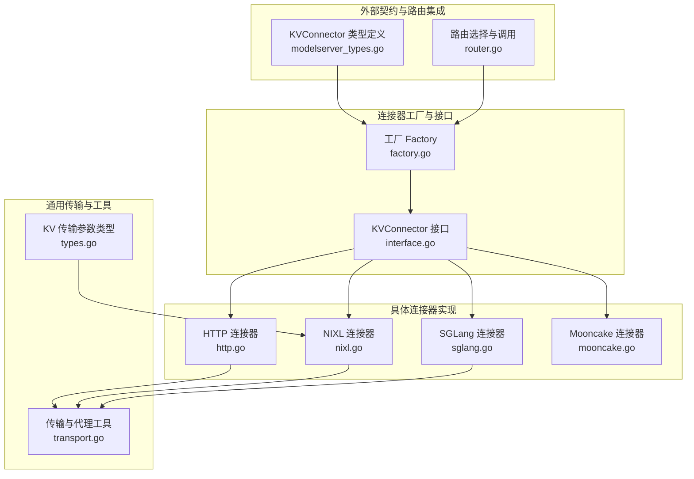
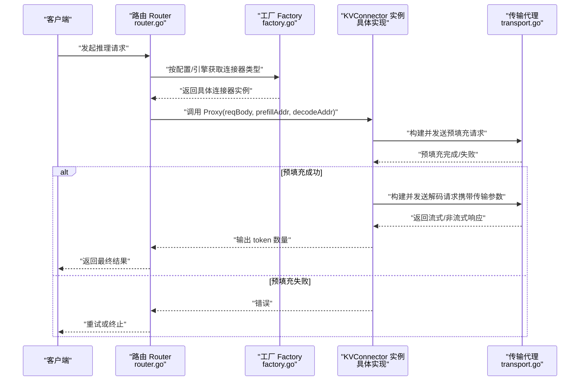
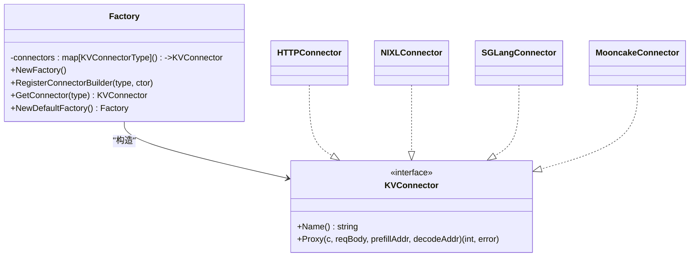
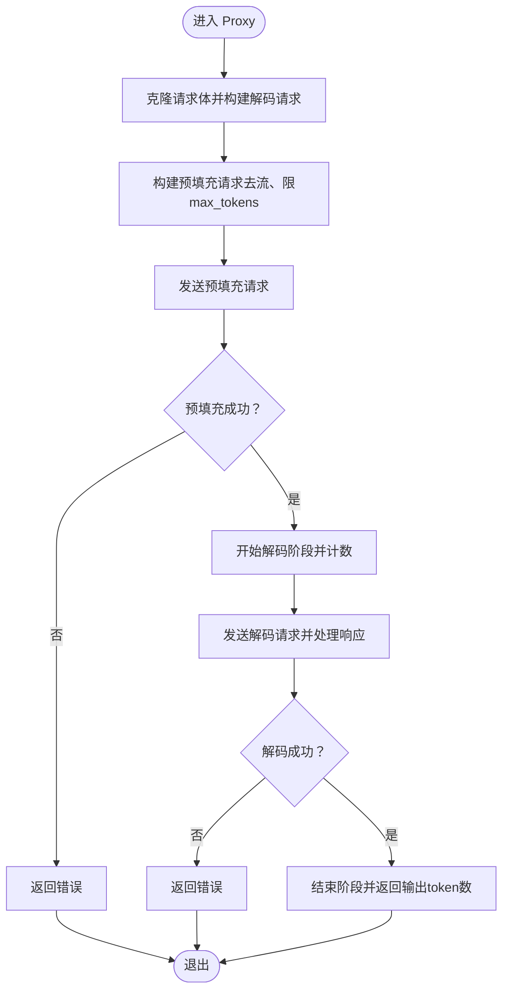
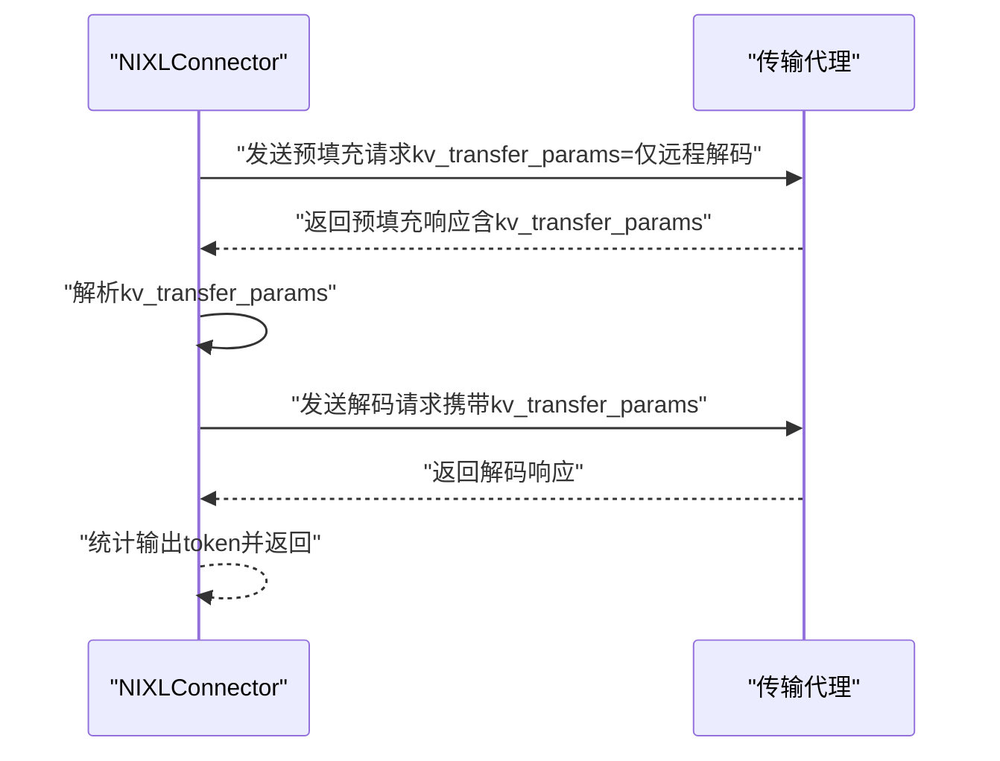
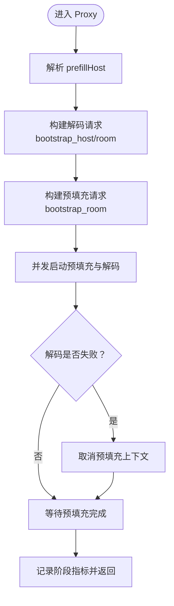
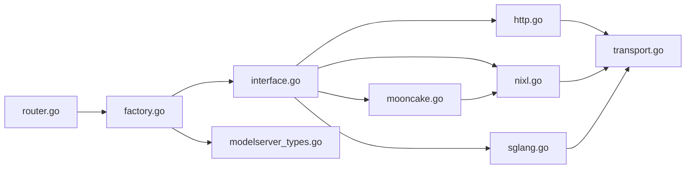

# 连接器工厂

<cite>
**本文引用的文件**
- [factory.go](file://pkg/kthena-router/connectors/factory.go)
- [interface.go](file://pkg/kthena-router/connectors/interface.go)
- [types.go](file://pkg/kthena-router/connectors/types.go)
- [http.go](file://pkg/kthena-router/connectors/http.go)
- [sglang.go](file://pkg/kthena-router/connectors/sglang.go)
- [mooncake.go](file://pkg/kthena-router/connectors/mooncake.go)
- [nixl.go](file://pkg/kthena-router/connectors/nixl.go)
- [transport.go](file://pkg/kthena-router/connectors/transport.go)
- [modelserver_types.go](file://pkg/apis/networking/v1alpha1/modelserver_types.go)
- [router.go](file://pkg/kthena-router/router/router.go)
- [connectors_test.go](file://pkg/kthena-router/connectors/connectors_test.go)
</cite>

## 目录
1. [引言](#引言)
2. [项目结构](#项目结构)
3. [核心组件](#核心组件)
4. [架构总览](#架构总览)
5. [详细组件分析](#详细组件分析)
6. [依赖分析](#依赖分析)
7. [性能考虑](#性能考虑)
8. [故障排查指南](#故障排查指南)
9. [结论](#结论)
10. [附录：新连接器开发指南与配置示例](#附录新连接器开发指南与配置示例)

## 引言
本文件系统性阐述连接器工厂的设计与实现，覆盖工厂方法模式、抽象接口与具体实现之间的关系；详解 HTTP 连接器、vLLM/NIXL 连接器、SGLang 连接器、Mooncake 连接器的工作机制与适用场景；说明连接器生命周期、请求构建与传输层代理、错误处理策略；并提供新连接器的开发指南、配置要点与性能优化建议。

## 项目结构
连接器相关代码集中在 kthena 路由模块的 connectors 子目录，并通过路由层在运行时按需选择具体连接器实现。

图表来源
- [factory.go:21-60](file://pkg/kthena-router/connectors/factory.go#L21-L60)
- [interface.go:23-31](file://pkg/kthena-router/connectors/interface.go#L23-L31)
- [http.go:28-120](file://pkg/kthena-router/connectors/http.go#L28-L120)
- [nixl.go:34-205](file://pkg/kthena-router/connectors/nixl.go#L34-L205)
- [sglang.go:42-222](file://pkg/kthena-router/connectors/sglang.go#L42-L222)
- [mooncake.go:19-26](file://pkg/kthena-router/connectors/mooncake.go#L19-L26)
- [transport.go:33-227](file://pkg/kthena-router/connectors/transport.go#L33-L227)
- [types.go:19-28](file://pkg/kthena-router/connectors/types.go#L19-L28)
- [modelserver_types.go:104-120](file://pkg/apis/networking/v1alpha1/modelserver_types.go#L104-L120)
- [router.go:924-938](file://pkg/kthena-router/router/router.go#L924-L938)

章节来源
- [factory.go:21-60](file://pkg/kthena-router/connectors/factory.go#L21-L60)
- [interface.go:23-31](file://pkg/kthena-router/connectors/interface.go#L23-L31)
- [http.go:28-120](file://pkg/kthena-router/connectors/http.go#L28-L120)
- [nixl.go:34-205](file://pkg/kthena-router/connectors/nixl.go#L34-L205)
- [sglang.go:42-222](file://pkg/kthena-router/connectors/sglang.go#L42-L222)
- [mooncake.go:19-26](file://pkg/kthena-router/connectors/mooncake.go#L19-L26)
- [transport.go:33-227](file://pkg/kthena-router/connectors/transport.go#L33-L227)
- [types.go:19-28](file://pkg/kthena-router/connectors/types.go#L19-L28)
- [modelserver_types.go:104-120](file://pkg/apis/networking/v1alpha1/modelserver_types.go#L104-L120)
- [router.go:924-938](file://pkg/kthena-router/router/router.go#L924-L938)

## 核心组件
- 工厂（Factory）：基于 KVConnectorType 注册与实例化具体连接器，支持默认注册集与未知类型回退到 HTTP。
- 抽象接口（KVConnector）：统一声明名称与预填充-解码全流程代理能力。
- 传输与代理（transport.go）：封装 prefill/decode 请求的构建、发送、响应流式处理与非流式处理。
- 参数类型（types.go）：描述跨阶段 KV 缓存传输的关键参数结构。
- 具体实现：
  - HTTP 连接器：通用 HTTP 转发，适配 LMCache/Mooncake 等场景。
  - NIXL 连接器：在预填充阶段返回 kv_transfer_params，供解码阶段复用。
  - SGLang 连接器：并发启动预填充与解码，使用 bootstrap_room/bootstrap_host 协作交换元数据。
  - Mooncake 连接器：复用 NIXL 实现，命名差异。

章节来源
- [factory.go:21-60](file://pkg/kthena-router/connectors/factory.go#L21-L60)
- [interface.go:23-31](file://pkg/kthena-router/connectors/interface.go#L23-L31)
- [transport.go:33-227](file://pkg/kthena-router/connectors/transport.go#L33-L227)
- [types.go:19-28](file://pkg/kthena-router/connectors/types.go#L19-L28)
- [http.go:28-120](file://pkg/kthena-router/connectors/http.go#L28-L120)
- [nixl.go:34-205](file://pkg/kthena-router/connectors/nixl.go#L34-L205)
- [sglang.go:42-222](file://pkg/kthena-router/connectors/sglang.go#L42-L222)
- [mooncake.go:19-26](file://pkg/kthena-router/connectors/mooncake.go#L19-L26)

## 架构总览
连接器工厂在路由层根据 ModelServer 配置或推理引擎自动推断连接器类型，随后通过工厂获取具体实现并执行 PD（预填充-解码）解耦推理流程。传输层负责请求构建、HTTP 代理与响应流式转发。

图表来源
- [router.go:924-938](file://pkg/kthena-router/router/router.go#L924-L938)
- [router.go:940-1019](file://pkg/kthena-router/router/router.go#L940-L1019)
- [factory.go:38-60](file://pkg/kthena-router/connectors/factory.go#L38-L60)
- [transport.go:33-78](file://pkg/kthena-router/connectors/transport.go#L33-L78)

## 详细组件分析

### 工厂与注册机制
- 工厂持有映射表，键为 KVConnectorType，值为构造函数；支持动态注册与默认工厂一次性注册多种实现。
- 未知类型时回退到 HTTP 连接器，确保系统可用性。
- 默认工厂注册：
  - http、lmcache（复用 HTTP）、mooncake（复用 NIXL）、nixl、sglang（内部推断，不暴露为用户枚举）。

图表来源
- [factory.go:21-60](file://pkg/kthena-router/connectors/factory.go#L21-L60)
- [interface.go:23-31](file://pkg/kthena-router/connectors/interface.go#L23-L31)
- [http.go:28-38](file://pkg/kthena-router/connectors/http.go#L28-L38)
- [nixl.go:34-46](file://pkg/kthena-router/connectors/nixl.go#L34-L46)
- [sglang.go:42-65](file://pkg/kthena-router/connectors/sglang.go#L42-L65)
- [mooncake.go:19-25](file://pkg/kthena-router/connectors/mooncake.go#L19-L25)

章节来源
- [factory.go:21-60](file://pkg/kthena-router/connectors/factory.go#L21-L60)
- [modelserver_types.go:104-120](file://pkg/apis/networking/v1alpha1/modelserver_types.go#L104-L120)

### HTTP 连接器
- 设计目标：通用 HTTP 转发，适合 LMCache、MooncakeStore 等通过 HTTP 协议进行 KV 缓存交互的场景。
- 关键行为：
  - 预填充阶段移除流式字段，限制 max_tokens/max_completion_tokens 到 1，避免实际生成。
  - 解码阶段保留原始请求语义，非流式显式 include_usage，流式通过 stream_options.include_usage 汇总 token 使用。
  - 代理层支持流式 SSE/NDJSON 与非流式响应，分别统计输出 token 数量。
- 生命周期：
  - 构造 -> 预填充请求构建 -> 发送预填充 -> 记录阶段指标 -> 发送解码 -> 记录阶段指标 -> 返回 token 数量。

图表来源
- [http.go:64-119](file://pkg/kthena-router/connectors/http.go#L64-L119)
- [transport.go:82-145](file://pkg/kthena-router/connectors/transport.go#L82-L145)
- [transport.go:175-226](file://pkg/kthena-router/connectors/transport.go#L175-L226)

章节来源
- [http.go:28-120](file://pkg/kthena-router/connectors/http.go#L28-L120)
- [transport.go:33-227](file://pkg/kthena-router/connectors/transport.go#L33-L227)
- [connectors_test.go:32-532](file://pkg/kthena-router/connectors/connectors_test.go#L32-L532)

### NIXL 连接器
- 设计目标：高性能分布式内存 KV 缓存传输，预填充阶段返回 kv_transfer_params，解码阶段直接复用。
- 关键行为：
  - 预填充阶段设置 kv_transfer_params（仅远程解码），并限制 max_tokens 为 1。
  - 解码阶段从预填充响应中提取 kv_transfer_params 并注入到解码请求。
  - 代理层对预填充响应解析并校验状态码，再进入解码阶段。
- 生命周期：
  - 构造 -> 预填充（带 kv_transfer_params）-> 解析响应 -> 构建解码请求（携带 kv_transfer_params）-> 发送解码 -> 返回 token 数量。

图表来源
- [nixl.go:54-112](file://pkg/kthena-router/connectors/nixl.go#L54-L112)
- [nixl.go:115-173](file://pkg/kthena-router/connectors/nixl.go#L115-L173)
- [types.go:19-28](file://pkg/kthena-router/connectors/types.go#L19-L28)

章节来源
- [nixl.go:34-205](file://pkg/kthena-router/connectors/nixl.go#L34-L205)
- [types.go:19-28](file://pkg/kthena-router/connectors/types.go#L19-L28)

### SGLang 连接器
- 设计目标：SGLang 的预填充-解码解耦需要严格的“同时在途”协议，通过 bootstrap_room 与 bootstrap_host 协同交换 ZMQ 元数据。
- 关键行为：
  - 解码请求先于预填充构建，携带 bootstrap_host（预填充 Pod IP）与 bootstrap_room。
  - 预填充请求携带相同的 bootstrap_room，但不携带 bootstrap_host。
  - 并发启动预填充与解码，若解码失败则取消预填充上下文，避免悬挂等待。
  - 代理层严格区分预填充与解码阶段的指标记录与错误处理。
- 生命周期：
  - 构造 -> 提取 prefillHost -> 构建解码请求（含 bootstrap_host/room）-> 构建预填充请求（含 bootstrap_room）-> 并发发送 -> 若解码失败则取消预填充 -> 统计阶段指标 -> 返回结果。

图表来源
- [sglang.go:86-195](file://pkg/kthena-router/connectors/sglang.go#L86-L195)
- [sglang.go:197-222](file://pkg/kthena-router/connectors/sglang.go#L197-L222)

章节来源
- [sglang.go:42-222](file://pkg/kthena-router/connectors/sglang.go#L42-L222)

### Mooncake 连接器
- 设计目标：面向 Ascend 场景的 Mooncake，当前实现复用 NIXL 的传输参数与流程，仅命名不同。
- 行为特征：与 NIXL 一致，预填充阶段返回 kv_transfer_params，解码阶段复用。

章节来源
- [mooncake.go:19-26](file://pkg/kthena-router/connectors/mooncake.go#L19-L26)
- [nixl.go:34-205](file://pkg/kthena-router/connectors/nixl.go#L34-L205)

### 传输与代理工具
- prefillerProxy/decoderProxy：统一的 HTTP RoundTrip 封装，处理状态码、响应头复制、流式/非流式分支。
- 请求体准备：预填充阶段移除流式字段并将 max_tokens/max_completion_tokens 限制为 1；解码阶段按需添加 token usage。
- 流式处理：逐行读取 SSE/NDJSON，解析 usage 并累加输出 token；非流式则解析完整响应体中的 usage。

章节来源
- [transport.go:33-227](file://pkg/kthena-router/connectors/transport.go#L33-L227)

## 依赖分析
- 路由层依赖工厂：根据 ModelServer 的 KVConnector 类型或推理引擎自动选择连接器。
- 工厂依赖类型定义：KVConnectorType 来自 networking/v1alpha1。
- 连接器实现依赖传输工具：统一的请求构建与响应处理逻辑。
- Mooncake 复用 NIXL：通过组合 NIXLConnector 实现。

图表来源
- [router.go:924-938](file://pkg/kthena-router/router/router.go#L924-L938)
- [factory.go:21-60](file://pkg/kthena-router/connectors/factory.go#L21-L60)
- [modelserver_types.go:104-120](file://pkg/apis/networking/v1alpha1/modelserver_types.go#L104-L120)

章节来源
- [router.go:924-938](file://pkg/kthena-router/router/router.go#L924-L938)
- [factory.go:21-60](file://pkg/kthena-router/connectors/factory.go#L21-L60)
- [modelserver_types.go:104-120](file://pkg/apis/networking/v1alpha1/modelserver_types.go#L104-L120)

## 性能考虑
- 并发与取消：SGLang 连接器并发启动预填充与解码，并在解码失败时及时取消预填充，避免资源浪费与超时堆积。
- 指标与节流：路由层在每次 PD 尝试后记录输出 token，用于后续速率限制与公平调度。
- 请求裁剪：预填充阶段强制 max_tokens/max_completion_tokens=1，减少不必要的计算与网络开销。
- 流式优化：流式响应按行解析 usage，避免全量缓冲；非流式仅在必要时解析完整响应体。
- 默认回退：未知连接器类型回退到 HTTP，保证系统可用性，避免因配置错误导致整体不可用。

## 故障排查指南
- 无法获取连接器：检查 KVConnector 类型是否在工厂注册；未知类型会回退到 HTTP。
- PD 尝试全部失败：路由层会尝试多个预填充-解码配对，若均失败则返回 500；检查预填充/解码地址可达性与端口配置。
- SGLang 超时/中断：确认解码请求先于预填充构建，且携带正确的 bootstrap_host/room；若解码失败会触发预填充取消。
- HTTP 连接器报错：常见于网络不可达或上游服务异常；可结合日志定位预填充/解码阶段的错误码。
- 响应未包含 usage：非流式请求需显式 include_usage；流式请求需启用 stream_options.include_usage。

章节来源
- [router.go:972-1019](file://pkg/kthena-router/router/router.go#L972-L1019)
- [sglang.go:86-195](file://pkg/kthena-router/connectors/sglang.go#L86-L195)
- [http.go:64-119](file://pkg/kthena-router/connectors/http.go#L64-L119)
- [transport.go:33-78](file://pkg/kthena-router/connectors/transport.go#L33-L78)

## 结论
连接器工厂以清晰的抽象接口与可插拔实现，支撑了多种 KV 缓存传输方案。HTTP 连接器提供通用兼容路径，NIXL 与 Mooncake 专注于高性能分布式缓存复用，SGLang 则满足特定框架的严格并发协议。通过统一的传输与代理工具、完善的指标与错误处理，系统在复杂 PD 场景下保持稳定与可观测性。

## 附录：新连接器开发指南与配置示例

### 新连接器开发指南
- 实现 KVConnector 接口
  - 定义 Name() 返回连接器标识。
  - 实现 Proxy(c, reqBody, prefillAddr, decodeAddr)：按需构建预填充与解码请求，调用传输代理发送并处理响应，返回输出 token 数量。
- 注册到工厂
  - 在工厂中注册构造函数，确保未知类型时有合理回退。
- 集成到路由
  - 在路由层根据 CRD 或引擎类型选择连接器；如需用户可选，扩展枚举并在工厂注册。
- 配置参数
  - 如需跨阶段参数，参考 KVTransferParams 结构，确保预填充返回、解码消费。
- 错误处理与指标
  - 明确预填充/解码阶段的错误码与指标记录，便于排障与监控。

章节来源
- [interface.go:23-31](file://pkg/kthena-router/connectors/interface.go#L23-L31)
- [factory.go:33-60](file://pkg/kthena-router/connectors/factory.go#L33-L60)
- [types.go:19-28](file://pkg/kthena-router/connectors/types.go#L19-L28)
- [router.go:924-938](file://pkg/kthena-router/router/router.go#L924-L938)

### 连接器类型与适用场景
- http：通用 HTTP 转发，LMCache/MooncakeStore 可用。
- nixl：高性能分布式内存 KV 缓存，预填充返回 kv_transfer_params，解码复用。
- mooncake：Ascend 场景的 Mooncake，复用 NIXL 流程。
- sglang：SGLang 解耦推理，要求并发启动并严格使用 bootstrap_room/bootstrap_host。

章节来源
- [modelserver_types.go:106-111](file://pkg/apis/networking/v1alpha1/modelserver_types.go#L106-L111)
- [factory.go:47-59](file://pkg/kthena-router/connectors/factory.go#L47-L59)

### 配置示例（概念性）
- ModelServer 中指定 KVConnector 类型为 http/nixl/mooncake。
- 若未显式指定且推理引擎为 sglang，则自动选择 sglang 连接器。
- 预填充/解码地址由路由层根据调度结果拼接为 IP:Port。

章节来源
- [router.go:924-938](file://pkg/kthena-router/router/router.go#L924-L938)
- [modelserver_types.go:113-120](file://pkg/apis/networking/v1alpha1/modelserver_types.go#L113-L120)