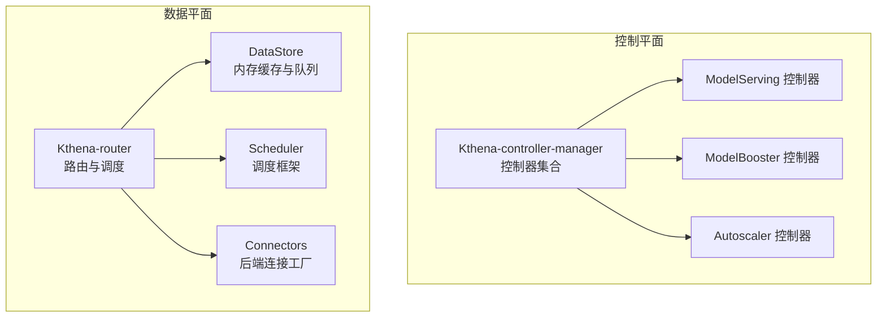
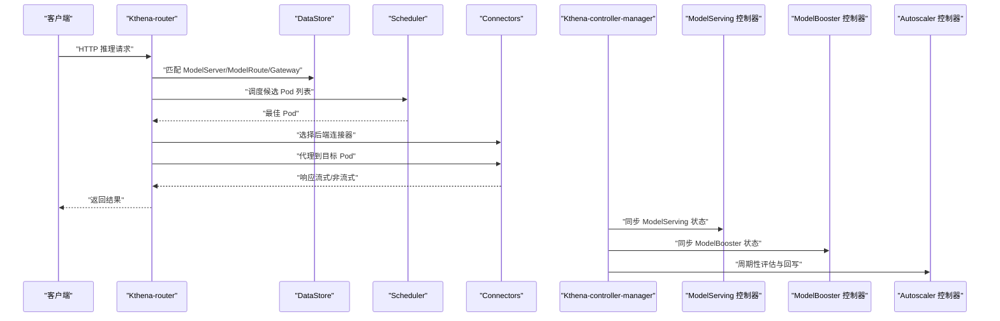
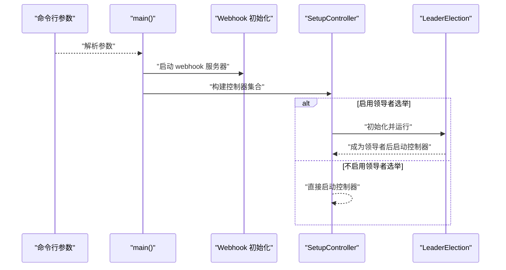
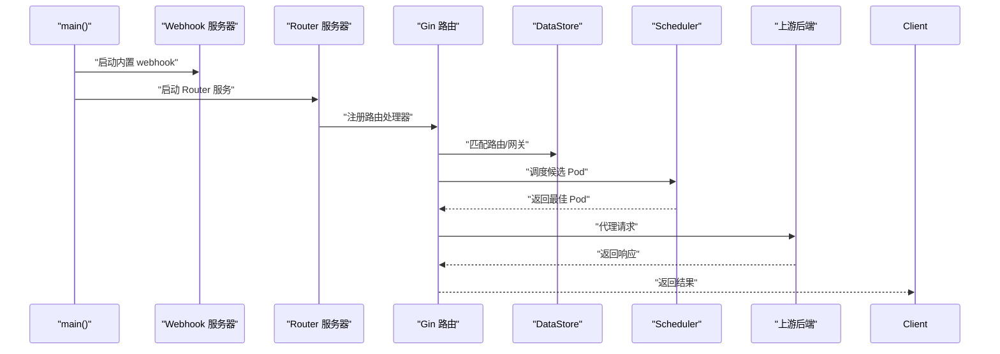
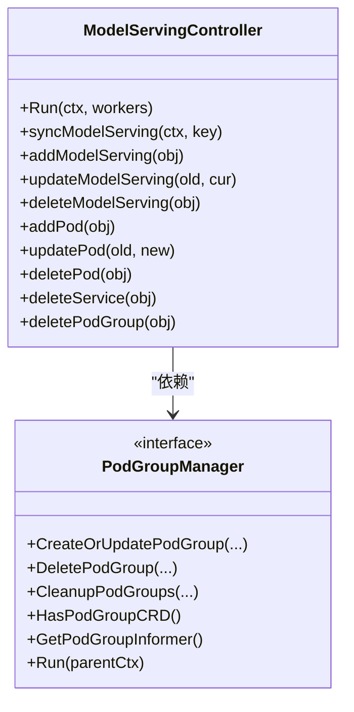
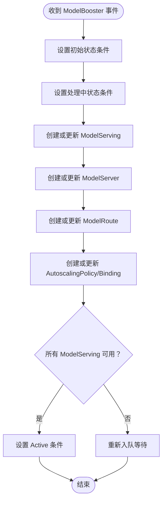
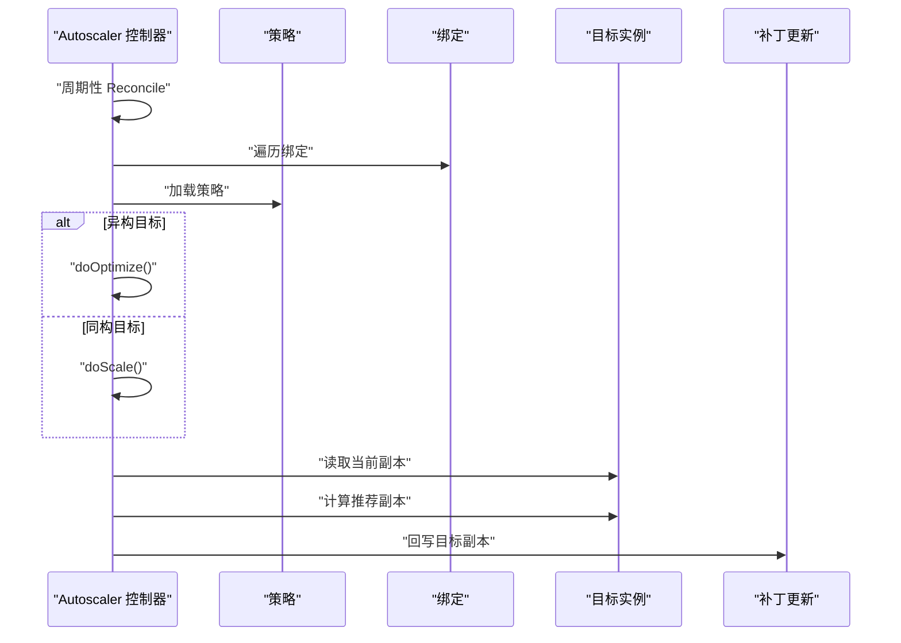
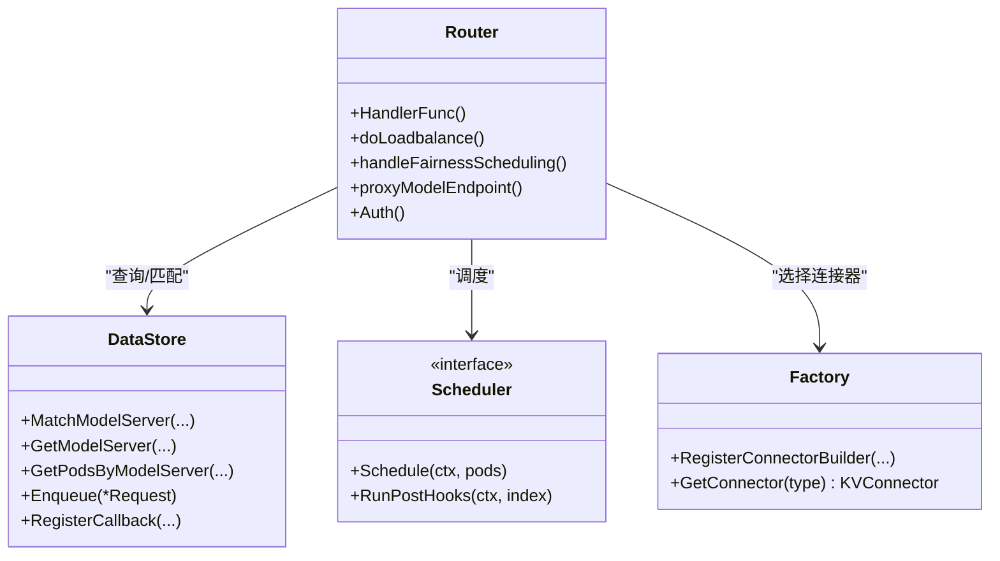
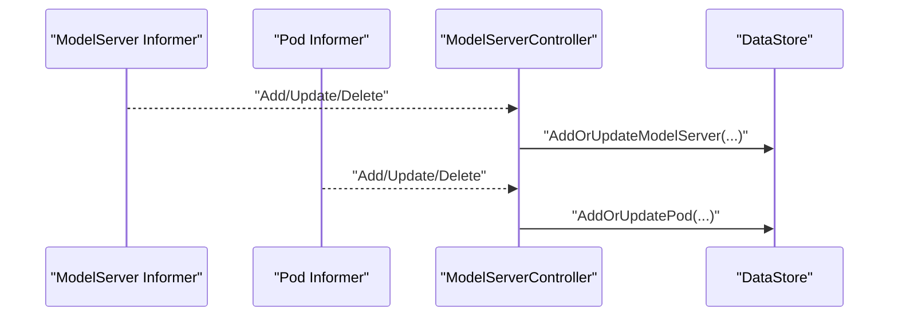
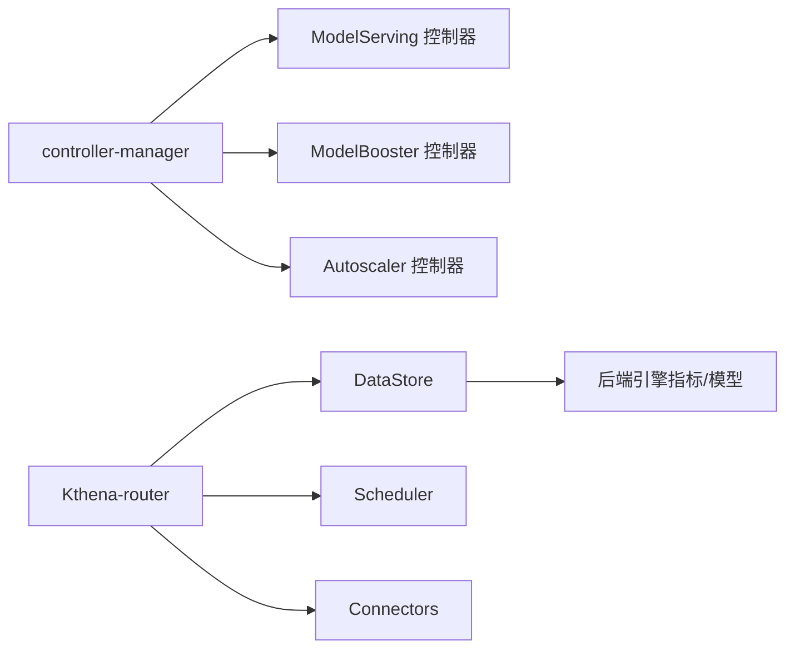

# 核心组件

<cite>
**本文引用的文件**
- [cmd/kthena-controller-manager/main.go](file://cmd/kthena-controller-manager/main.go)
- [pkg/controller/controller.go](file://pkg/controller/controller.go)
- [pkg/controller/config.go](file://pkg/controller/config.go)
- [cmd/kthena-router/main.go](file://cmd/kthena-router/main.go)
- [pkg/kthena-router/router/router.go](file://pkg/kthena-router/router/router.go)
- [pkg/kthena-router/controller/modelserver_controller.go](file://pkg/kthena-router/controller/modelserver_controller.go)
- [pkg/kthena-router/controller/modelroute_controller.go](file://pkg/kthena-router/controller/modelroute_controller.go)
- [pkg/kthena-router/datastore/store.go](file://pkg/kthena-router/datastore/store.go)
- [pkg/kthena-router/scheduler/scheduler.go](file://pkg/kthena-router/scheduler/scheduler.go)
- [pkg/kthena-router/connectors/factory.go](file://pkg/kthena-router/connectors/factory.go)
- [pkg/model-serving-controller/controller/model_serving_controller.go](file://pkg/model-serving-controller/controller/model_serving_controller.go)
- [pkg/model-booster-controller/controller/model_booster_controller.go](file://pkg/model-booster-controller/controller/model_booster_controller.go)
- [pkg/autoscaler/controller/autoscale_controller.go](file://pkg/autoscaler/controller/autoscale_controller.go)
</cite>

## 目录
1. [简介](#简介)
2. [项目结构](#项目结构)
3. [核心组件](#核心组件)
4. [架构总览](#架构总览)
5. [组件详解](#组件详解)
6. [依赖关系分析](#依赖关系分析)
7. [性能与可扩展性](#性能与可扩展性)
8. [故障排查指南](#故障排查指南)
9. [结论](#结论)
10. [附录：配置与使用示例](#附录配置与使用示例)

## 简介
本文件面向开发者与运维人员，系统化梳理 Kthena 平台的核心组件，覆盖控制平面（Kthena-controller-manager）与数据平面（Kthena-router）的关键子系统，包括各控制器的职责边界、接口设计、内部架构、启动流程、配置参数、运行时行为与故障处理策略，并提供扩展与最佳实践建议。

## 项目结构
Kthena 采用“控制平面 + 数据平面”的分层架构：
- 控制平面：以 Kthena-controller-manager 为核心，管理模型推理工作负载与弹性伸缩策略，负责资源编排与状态收敛。
- 数据平面：以 Kthena-router 为核心，负责请求接入、路由匹配、调度与转发，支持网关 API、公平调度、速率限制、访问日志与可观测性。

图示来源
- [cmd/kthena-controller-manager/main.go:54-111](file://cmd/kthena-controller-manager/main.go#L54-L111)
- [pkg/controller/controller.go:52-141](file://pkg/controller/controller.go#L52-L141)
- [cmd/kthena-router/main.go:40-122](file://cmd/kthena-router/main.go#L40-L122)
- [pkg/kthena-router/router/router.go:91-169](file://pkg/kthena-router/router/router.go#L91-L169)

章节来源
- [cmd/kthena-controller-manager/main.go:54-111](file://cmd/kthena-controller-manager/main.go#L54-L111)
- [pkg/controller/controller.go:52-141](file://pkg/controller/controller.go#L52-L141)
- [cmd/kthena-router/main.go:40-122](file://cmd/kthena-router/main.go#L40-L122)
- [pkg/kthena-router/router/router.go:91-169](file://pkg/kthena-router/router/router.go#L91-L169)

## 核心组件
- Kthena-controller-manager：统一入口，解析控制器开关、构建客户端、初始化控制器并按需启用领导者选举。
- 模型推理控制器（ModelServing）：基于 Informer 的工作循环，管理 Pod/Service/PodGroup 生命周期，驱动滚动更新与扩缩容。
- 模型增强控制器（ModelBooster）：根据 ModelBooster 资源，协调生成 ModelServing/ModelServer/ModelRoute/AutoscalingPolicy 及绑定。
- 自动伸缩控制器（Autoscaler）：周期性拉取策略与绑定，计算推荐副本数并回写目标实例数量。
- Kthena-router：统一入口，解析请求、速率限制、路由匹配、调度与代理；内置公平队列、访问日志、指标采集与后端连接器工厂。

章节来源
- [pkg/model-serving-controller/controller/model_serving_controller.go:104-247](file://pkg/model-serving-controller/controller/model_serving_controller.go#L104-L247)
- [pkg/model-booster-controller/controller/model_booster_controller.go:285-383](file://pkg/model-booster-controller/controller/model_booster_controller.go#L285-L383)
- [pkg/autoscaler/controller/autoscale_controller.go:64-96](file://pkg/autoscaler/controller/autoscale_controller.go#L64-L96)
- [pkg/kthena-router/router/router.go:91-169](file://pkg/kthena-router/router/router.go#L91-L169)

## 架构总览
下图展示了控制平面与数据平面的交互关系与关键组件职责：

图示来源
- [pkg/kthena-router/router/router.go:204-315](file://pkg/kthena-router/router/router.go#L204-L315)
- [pkg/kthena-router/datastore/store.go:179-240](file://pkg/kthena-router/datastore/store.go#L179-L240)
- [pkg/kthena-router/scheduler/scheduler.go:25-28](file://pkg/kthena-router/scheduler/scheduler.go#L25-L28)
- [pkg/kthena-router/connectors/factory.go:38-60](file://pkg/kthena-router/connectors/factory.go#L38-L60)
- [pkg/controller/controller.go:80-100](file://pkg/controller/controller.go#L80-L100)

## 组件详解

### Kthena-controller-manager 启动与控制器装配
- 命令行参数
  - kubeconfig/master：K8s 集群配置
  - enable-webhook/port/webhook-timeout/cert-secret-name/service-name：Webhook 服务参数
  - leader-elect：是否启用领导者选举
  - workers：控制器工作线程数
  - controllers：控制器白名单（支持 + 开启、- 关闭、* 默认全开）
  - kube-api-qps/kube-api-burst：K8s 客户端限速
- Webhook 初始化
  - 自动证书生成与 CA 注入
  - 注册校验/变更 webhook 处理函数
- 控制器装配
  - ModelBoosterController、ModelServingController、AutoscalerController
  - 支持 LWS（LeaderWorkerSet）控制器初始化（若 CRD 存在）
- 领导者选举
  - 使用 Lease 资源进行领导者选举，失败回调记录日志

图示来源
- [cmd/kthena-controller-manager/main.go:54-111](file://cmd/kthena-controller-manager/main.go#L54-L111)
- [pkg/controller/controller.go:52-141](file://pkg/controller/controller.go#L52-L141)

章节来源
- [cmd/kthena-controller-manager/main.go:54-111](file://cmd/kthena-controller-manager/main.go#L54-L111)
- [pkg/controller/config.go:19-27](file://pkg/controller/config.go#L19-L27)
- [pkg/controller/controller.go:52-141](file://pkg/controller/controller.go#L52-L141)

### Kthena-router 启动与路由处理
- 命令行参数
  - port/tls-cert/tls-key：监听端口与 TLS 证书
  - enable-webhook/webhook-port/webhook-tls-cert-file/webhook-tls-private-key-file/cert-secret-name/webhook-service-name：内置 Admission Webhook
  - enable-gateway-api/enable-gateway-api-inference-extension：Gateway API 与 Inference 扩展支持
  - debug-port：本地调试端口
  - kube-api-qps/kube-api-burst：K8s 客户端限速
- Webhook 证书管理
  - 优先从 Secret 加载 CA Bundle，其次尝试磁盘证书，最后自动生成
- 服务器启动
  - 启动 Router 与可选的 Webhook 服务器
- 请求处理主流程
  - 解析/校验请求、速率限制、路由匹配（ModelRoute 或 HTTPRoute）、调度、代理到后端 Pod

图示来源
- [cmd/kthena-router/main.go:40-122](file://cmd/kthena-router/main.go#L40-L122)
- [pkg/kthena-router/router/router.go:204-315](file://pkg/kthena-router/router/router.go#L204-L315)

章节来源
- [cmd/kthena-router/main.go:40-122](file://cmd/kthena-router/main.go#L40-L122)
- [pkg/kthena-router/router/router.go:204-315](file://pkg/kthena-router/router/router.go#L204-L315)

### ModelServing 控制器（控制平面）
- 职责
  - 监听 ModelServing、Pod、Service、PodGroup 等资源事件
  - 管理 ServingGroup 数量与角色模板修订
  - 处理滚动更新、扩缩容、Headless Service 管理与状态更新
  - 事件广播与插件注册
- 关键接口
  - Run(ctx, workers)：启动 Informer 与工作队列
  - syncModelServing：核心同步逻辑（副本、角色、滚动更新、服务）
  - handleReadyPod/handleErrorPod：就绪/错误 Pod 处理
- 数据存储
  - 内部 Store 记录 ServingGroup、Pod/Service 索引与事件

图示来源
- [pkg/model-serving-controller/controller/model_serving_controller.go:82-102](file://pkg/model-serving-controller/controller/model_serving_controller.go#L82-L102)
- [pkg/model-serving-controller/controller/model_serving_controller.go:104-247](file://pkg/model-serving-controller/controller/model_serving_controller.go#L104-L247)

章节来源
- [pkg/model-serving-controller/controller/model_serving_controller.go:104-247](file://pkg/model-serving-controller/controller/model_serving_controller.go#L104-L247)

### ModelBooster 控制器（控制平面）
- 职责
  - 监听 ModelBooster 资源，协调生成/更新 ModelServing/ModelServer/ModelRoute/AutoscalingPolicy 及绑定
  - 维护 LoRA 更新缓存，避免并发冲突
  - 将状态条件写回 ModelBooster
- 关键接口
  - Run(ctx, workers)：启动多 Informer 与工作队列
  - reconcile：统一编排流程（状态初始化/处理/活跃判定）
  - isModelServingActive：检查所有 ModelServing 是否可用
  - loadConfigFromConfigMap：从 ConfigMap 注入镜像配置

图示来源
- [pkg/model-booster-controller/controller/model_booster_controller.go:188-233](file://pkg/model-booster-controller/controller/model_booster_controller.go#L188-L233)

章节来源
- [pkg/model-booster-controller/controller/model_booster_controller.go:188-233](file://pkg/model-booster-controller/controller/model_booster_controller.go#L188-L233)

### Autoscaler 控制器（控制平面）
- 职责
  - 周期性拉取策略与绑定，计算推荐副本数
  - 支持同构/异构目标，分别走 Scale/Optimizer 路径
  - 回写目标实例数量（支持 Role 级别）
- 关键接口
  - Run(ctx)：周期性 Reconcile
  - Reconcile：遍历绑定、调度执行
  - doScale/doOptimize：同构/异构调度
  - updateTargetReplicas/getTargetReplicas：回写与读取当前副本

图示来源
- [pkg/autoscaler/controller/autoscale_controller.go:124-171](file://pkg/autoscaler/controller/autoscale_controller.go#L124-L171)
- [pkg/autoscaler/controller/autoscale_controller.go:316-348](file://pkg/autoscaler/controller/autoscale_controller.go#L316-L348)

章节来源
- [pkg/autoscaler/controller/autoscale_controller.go:124-171](file://pkg/autoscaler/controller/autoscale_controller.go#L124-L171)

### Kthena-router 路由与调度（数据平面）
- 路由器 Router
  - 统一速率限制器、访问日志、指标、分词器、调度器、连接器工厂
  - 支持公平调度权重与超时配置
  - HandlerFunc：解析请求、令牌估算、速率限制、路由匹配、调度与代理
- DataStore
  - 缓存 ModelServer/Pod/ModelRoute/Gateway/HTTPRoute/InferencePool
  - 公平队列与令牌追踪，支持回调注册
- Scheduler
  - 调度接口定义，具体实现由调度框架提供
- Connectors 工厂
  - 支持 HTTP/LMCache/MoonCake/NIXL/SGLang 等连接器类型，默认 HTTP

图示来源
- [pkg/kthena-router/router/router.go:73-90](file://pkg/kthena-router/router/router.go#L73-L90)
- [pkg/kthena-router/router/router.go:204-315](file://pkg/kthena-router/router/router.go#L204-L315)
- [pkg/kthena-router/datastore/store.go:162-240](file://pkg/kthena-router/datastore/store.go#L162-L240)
- [pkg/kthena-router/scheduler/scheduler.go:25-28](file://pkg/kthena-router/scheduler/scheduler.go#L25-L28)
- [pkg/kthena-router/connectors/factory.go:38-60](file://pkg/kthena-router/connectors/factory.go#L38-L60)

章节来源
- [pkg/kthena-router/router/router.go:73-90](file://pkg/kthena-router/router/router.go#L73-L90)
- [pkg/kthena-router/datastore/store.go:162-240](file://pkg/kthena-router/datastore/store.go#L162-L240)
- [pkg/kthena-router/connectors/factory.go:38-60](file://pkg/kthena-router/connectors/factory.go#L38-L60)

### 路由控制器（数据平面）
- ModelServerController
  - 监听 ModelServer 与 Pod，建立/更新 Pod 与 ModelServer 的绑定
  - 仅对 Ready Pod 进行绑定，避免不健康实例参与调度
- ModelRouteController
  - 监听 ModelRoute，维护路由到模型/LoRA 的映射

图示来源
- [pkg/kthena-router/controller/modelserver_controller.go:178-250](file://pkg/kthena-router/controller/modelserver_controller.go#L178-L250)
- [pkg/kthena-router/controller/modelroute_controller.go:130-151](file://pkg/kthena-router/controller/modelroute_controller.go#L130-L151)

章节来源
- [pkg/kthena-router/controller/modelserver_controller.go:178-250](file://pkg/kthena-router/controller/modelserver_controller.go#L178-L250)
- [pkg/kthena-router/controller/modelroute_controller.go:130-151](file://pkg/kthena-router/controller/modelroute_controller.go#L130-L151)

## 依赖关系分析
- 控制平面
  - Kthena-controller-manager 依赖 client-go、controller-runtime、volcano 客户端与 CRD Listers
  - 各控制器共享 Informer 工厂与工作队列，通过事件驱动收敛状态
- 数据平面
  - Router 依赖 DataStore、Scheduler、Connectors、AccessLog、Metrics
  - DataStore 依赖后端引擎指标与模型列表查询能力

图示来源
- [pkg/controller/controller.go:74-100](file://pkg/controller/controller.go#L74-L100)
- [pkg/kthena-router/router/router.go:157-169](file://pkg/kthena-router/router/router.go#L157-L169)
- [pkg/kthena-router/datastore/store.go:143-149](file://pkg/kthena-router/datastore/store.go#L143-L149)

章节来源
- [pkg/controller/controller.go:74-100](file://pkg/controller/controller.go#L74-L100)
- [pkg/kthena-router/router/router.go:157-169](file://pkg/kthena-router/router/router.go#L157-L169)

## 性能与可扩展性
- 控制器并发
  - 通过 workers 参数控制工作线程数，合理分配 CPU 与内存
  - Informer 缓存与索引（按 GroupName/RoleID）降低查询成本
- 调度与队列
  - 公平队列支持窗口大小、并发上限、QPS 与权重配置
  - 令牌追踪与滑动窗口统计，支持按用户/模型维度的公平性
- 速率限制
  - 统一速率限制器，支持输入/输出令牌与请求数限制
- 后端连接器
  - 工厂模式便于扩展新连接器类型，HTTP/LMCache/MoonCake/NIXL/SGLang 可按需启用

章节来源
- [pkg/kthena-router/datastore/store.go:351-404](file://pkg/kthena-router/datastore/store.go#L351-L404)
- [pkg/kthena-router/router/router.go:92-94](file://pkg/kthena-router/router/router.go#L92-L94)

## 故障排查指南
- 控制平面
  - 日志级别：通过 klog 标志调整 stderr 阈值与输出
  - 领导者选举：确认 Lease 资源与命名空间权限
  - 控制器开关：核对 controllers 列表与默认启用项
- 数据平面
  - 路由匹配：检查 ModelRoute/HTTPRoute/Gateway 绑定与匹配规则
  - 公平队列：观察队列长度与超时配置，必要时调大 MaxQPS 或调整权重
  - 速率限制：确认 RateLimit 配置与令牌计数更新
  - Webhook：证书加载顺序与 CA Bundle 注入是否成功

章节来源
- [cmd/kthena-controller-manager/main.go:58-91](file://cmd/kthena-controller-manager/main.go#L58-L91)
- [cmd/kthena-router/main.go:137-195](file://cmd/kthena-router/main.go#L137-L195)
- [pkg/kthena-router/router/router.go:266-292](file://pkg/kthena-router/router/router.go#L266-L292)

## 结论
Kthena 通过清晰的控制平面与数据平面分离，实现了从资源编排到请求调度的完整链路。控制平面以事件驱动的方式保证状态收敛，数据平面以可插拔的连接器与调度框架支撑高并发与低延迟的推理服务。通过合理的配置与扩展点，可在生产环境中实现稳定、可观测且可扩展的推理平台。

## 附录：配置与使用示例
- 控制平面（Kthena-controller-manager）
  - 启用/禁用控制器：通过 controllers 参数精确控制
  - 领导者选举：在多副本部署时开启 leader-elect
  - API 限速：根据集群规模设置 kube-api-qps/kube-api-burst
- 数据平面（Kthena-router）
  - TLS 与证书：通过 tls-cert/tls-key 或自动证书生成
  - Gateway API：启用 enable-gateway-api 与可选的 Inference 扩展
  - 公平调度：通过环境变量配置窗口大小、并发上限、权重等
  - 速率限制：在 ModelRoute 中配置 RateLimit，Router 将自动生效

章节来源
- [cmd/kthena-controller-manager/main.go:68-85](file://cmd/kthena-controller-manager/main.go#L68-L85)
- [cmd/kthena-router/main.go:67-81](file://cmd/kthena-router/main.go#L67-L81)
- [pkg/kthena-router/datastore/store.go:351-404](file://pkg/kthena-router/datastore/store.go#L351-L404)
- [pkg/kthena-router/router/router.go:120-169](file://pkg/kthena-router/router/router.go#L120-L169)