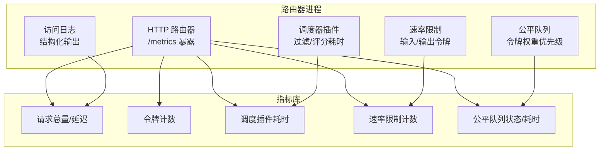
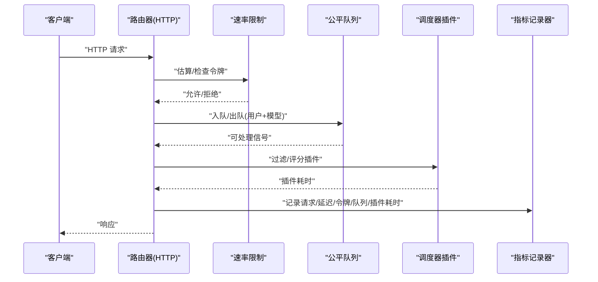
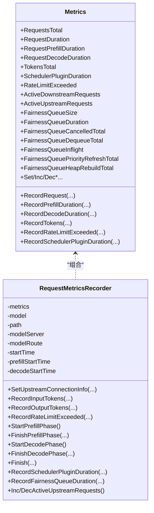
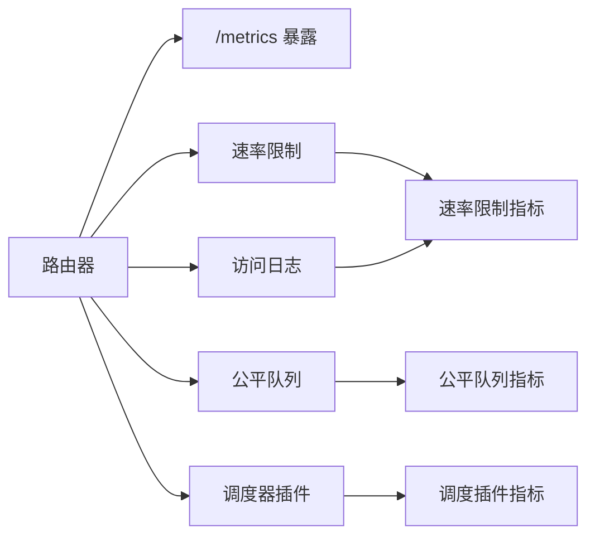

# 指标监控

<cite>
**本文引用的文件**
- [metrics.go](file://pkg/kthena-router/metrics/metrics.go)
- [token_tracker.go](file://pkg/kthena-router/datastore/token_tracker.go)
- [fairness_queue.go](file://pkg/kthena-router/datastore/fairness_queue.go)
- [ratelimit.go](file://pkg/kthena-router/filters/ratelimit/ratelimit.go)
- [router.go](file://cmd/kthena-router/app/router.go)
- [scheduler_impl.go](file://pkg/kthena-router/scheduler/scheduler_impl.go)
- [logger.go](file://pkg/kthena-router/accesslog/logger.go)
- [router-observability.md](file://docs/kthena/docs/user-guide/router-observability.md)
- [prometheus.md](file://docs/kthena/docs/general/prometheus.md)
- [store.go](file://pkg/kthena-router/datastore/store.go)
</cite>

## 目录
1. [简介](#简介)
2. [项目结构](#项目结构)
3. [核心组件](#核心组件)
4. [架构总览](#架构总览)
5. [详细组件分析](#详细组件分析)
6. [依赖分析](#依赖分析)
7. [性能考量](#性能考量)
8. [故障排查指南](#故障排查指南)
9. [结论](#结论)
10. [附录](#附录)

## 简介
本文件面向 Kthena 平台的指标监控体系，聚焦 kthena-router 的 Prometheus 指标设计与实现，覆盖请求总量、延迟分布、令牌统计、调度器插件性能、速率限制、公平队列等核心指标。文档逐项解释指标的数据类型、标签、聚合方式与业务意义，并提供查询示例、Grafana 配置建议、性能分析与容量规划方法，以及自定义指标扩展的最佳实践。

## 项目结构
围绕指标监控的关键代码分布在以下模块：
- 指标定义与记录：pkg/kthena-router/metrics
- 公平队列与令牌统计：pkg/kthena-router/datastore
- 速率限制：pkg/kthena-router/filters/ratelimit
- 调度器插件性能：pkg/kthena-router/scheduler
- 访问日志（结构化输出）：pkg/kthena-router/accesslog
- 路由器服务端口与 /metrics 暴露：cmd/kthena-router/app
- 用户指南与 Prometheus/Grafana 参考：docs/kthena/docs/user-guide 与 docs/kthena/docs/general

图表来源
- [router.go:248-256](file://cmd/kthena-router/app/router.go#L248-L256)
- [metrics.go:54-85](file://pkg/kthena-router/metrics/metrics.go#L54-L85)
- [fairness_queue.go:120-145](file://pkg/kthena-router/datastore/fairness_queue.go#L120-L145)
- [ratelimit.go:100-126](file://pkg/kthena-router/filters/ratelimit/ratelimit.go#L100-L126)
- [scheduler_impl.go:167-198](file://pkg/kthena-router/scheduler/scheduler_impl.go#L167-L198)

章节来源
- [router.go:248-256](file://cmd/kthena-router/app/router.go#L248-L256)
- [metrics.go:54-85](file://pkg/kthena-router/metrics/metrics.go#L54-L85)

## 核心组件
- 指标注册与记录器：统一在 metrics 包中定义 Counter/Histogram/Gauge/CounterVec/HistogramVec，并提供便捷的记录方法。
- 公平队列与令牌统计：基于滑动窗口令牌跟踪器，结合用户维度优先级计算，支撑公平队列的排队与出队行为。
- 速率限制：支持本地/全局（Redis）令牌桶限流，按输入/输出令牌分别计量。
- 调度器插件：在过滤与评分阶段记录各插件执行耗时，便于评估调度器性能瓶颈。
- 访问日志：结构化 JSON 输出，便于日志侧的统计与分析。

章节来源
- [metrics.go:87-223](file://pkg/kthena-router/metrics/metrics.go#L87-L223)
- [token_tracker.go:56-110](file://pkg/kthena-router/datastore/token_tracker.go#L56-L110)
- [fairness_queue.go:120-145](file://pkg/kthena-router/datastore/fairness_queue.go#L120-L145)
- [ratelimit.go:100-126](file://pkg/kthena-router/filters/ratelimit/ratelimit.go#L100-L126)
- [scheduler_impl.go:167-198](file://pkg/kthena-router/scheduler/scheduler_impl.go#L167-L198)
- [logger.go:138-208](file://pkg/kthena-router/accesslog/logger.go#L138-L208)

## 架构总览
下图展示从请求进入路由器到指标产出的关键路径，以及与 Prometheus 的集成点。

图表来源
- [router.go:248-256](file://cmd/kthena-router/app/router.go#L248-L256)
- [ratelimit.go:100-126](file://pkg/kthena-router/filters/ratelimit/ratelimit.go#L100-L126)
- [fairness_queue.go:334-412](file://pkg/kthena-router/datastore/fairness_queue.go#L334-L412)
- [scheduler_impl.go:167-198](file://pkg/kthena-router/scheduler/scheduler_impl.go#L167-L198)
- [metrics.go:225-259](file://pkg/kthena-router/metrics/metrics.go#L225-L259)

## 详细组件分析

### 请求与延迟指标
- 指标名称与类型
  - kthena_router_requests_total：Counter，累计请求总数
  - kthena_router_request_duration_seconds：Histogram，端到端延迟分布
  - kthena_router_request_prefill_duration_seconds：Histogram，预填充阶段延迟
  - kthena_router_request_decode_duration_seconds：Histogram，解码阶段延迟
  - kthena_router_active_downstream_requests：Gauge，活跃下游请求数
  - kthena_router_active_upstream_requests：Gauge，活跃上游请求数
- 标签
  - model、path、status_code、error_type、plugin、type、limit_type、model_route、model_server、user_id
- 数据类型与聚合
  - Counter：直接累加，适合计算速率（如每秒请求数）
  - Histogram：带桶的直方图，适合分位数（p50/p95/p99）与错误率分析
  - Gauge：当前值，适合并发度与队列长度
- 业务意义
  - 识别慢请求、错误高发模型与路由
  - 结合活跃请求数评估资源压力
- 查询示例
  - 每模型每路由的请求速率：sum(rate(kthena_router_requests_total[5m])) by (model, path)
  - P95 延迟：histogram_quantile(0.95, sum by(le) (rate(kthena_router_request_duration_seconds_bucket[5m])))
  - 错误率：sum(rate(kthena_router_requests_total{status_code=~"5.."}[5m])) / sum(rate(kthena_router_requests_total[5m]))
- Grafana 面板建议
  - 主面板：请求速率、P95 延迟、错误率、活跃请求数
  - 分模型面板：按 model/limit_type 维度拆分

章节来源
- [metrics.go:87-223](file://pkg/kthena-router/metrics/metrics.go#L87-L223)
- [router-observability.md:36-46](file://docs/kthena/docs/user-guide/router-observability.md#L36-L46)

### 令牌统计与使用
- 指标名称与类型
  - kthena_router_tokens_total：Counter，累计输入/输出令牌
- 标签
  - model、path、token_type（input/output）
- 数据类型与聚合
  - Counter，适合计算吞吐与成本
- 业务意义
  - 评估模型使用强度、成本归因与异常高消耗请求
- 查询示例
  - 模型输入/输出令牌速率：rate(kthena_router_tokens_total[5m]) by (model, token_type)
  - 高输入/输出请求：topk(10, sum by(model, request_id)(increase(kthena_router_tokens_total[1h])))
- Grafana 面板建议
  - 输入/输出令牌速率对比
  - 单请求令牌分布热力图

章节来源
- [metrics.go:125-131](file://pkg/kthena-router/metrics/metrics.go#L125-L131)
- [token_tracker.go:56-110](file://pkg/kthena-router/datastore/token_tracker.go#L56-L110)

### 调度器插件性能
- 指标名称与类型
  - kthena_router_scheduler_plugin_duration_seconds：Histogram，插件执行耗时
- 标签
  - model、plugin、type（filter/score）
- 数据类型与聚合
  - Histogram，适合定位耗时插件
- 业务意义
  - 评估调度器整体与单插件性能，指导插件优化或替换
- 查询示例
  - 插件平均耗时：avg by(plugin, type)(rate(kthena_router_scheduler_plugin_duration_seconds[5m]))
  - 慢插件占比：histogram_quantile(0.95, sum by(le, plugin, type)(rate(kthena_router_scheduler_plugin_duration_seconds_bucket[5m])))
- Grafana 面板建议
  - 插件耗时箱线图/柱状图
  - 不同类型（filter/score）对比

章节来源
- [metrics.go:133-140](file://pkg/kthena-router/metrics/metrics.go#L133-L140)
- [scheduler_impl.go:167-198](file://pkg/kthena-router/scheduler/scheduler_impl.go#L167-L198)

### 速率限制与保护
- 指标名称与类型
  - kthena_router_rate_limit_exceeded_total：Counter，因速率限制被拒绝的请求数
- 标签
  - model、limit_type（input_tokens/output_tokens/requests）、path
- 数据类型与聚合
  - Counter，适合统计拒绝量与趋势
- 业务意义
  - 识别限流触发点、模型/路由的配额紧张情况
- 查询示例
  - 拒绝速率：rate(kthena_router_rate_limit_exceeded_total[5m]) by (model, limit_type)
  - 拒绝占比：sum(rate(kthena_router_rate_limit_exceeded_total[5m])) / sum(rate(kthena_router_requests_total[5m]))
- Grafana 面板建议
  - 拒绝趋势与时效性告警联动
  - 按 limit_type 的拒绝分布

章节来源
- [metrics.go:142-148](file://pkg/kthena-router/metrics/metrics.go#L142-L148)
- [ratelimit.go:100-126](file://pkg/kthena-router/filters/ratelimit/ratelimit.go#L100-L126)

### 公平队列与排队行为
- 指标名称与类型
  - kthena_router_fairness_queue_size：Gauge，排队请求数
  - kthena_router_fairness_queue_duration_seconds：Histogram，排队等待时延
  - kthena_router_fairness_queue_cancelled_total：Counter，取消/超时计数
  - kthena_router_fairness_queue_dequeue_total：Counter，成功出队计数
  - kthena_router_fairness_queue_inflight：Gauge，飞行中请求数
  - kthena_router_fairness_queue_priority_refresh_total：Counter，优先级刷新次数
  - kthena_router_fairness_queue_heap_rebuild_total：Counter，堆重建次数
- 标签
  - model、user_id
- 数据类型与聚合
  - Gauge/Counter/Histogram，综合反映排队压力与公平性
- 业务意义
  - 评估公平性、队列拥塞与退让策略有效性
- 查询示例
  - 排队压力：max by(model)(kthena_router_fairness_queue_size) > 0
  - 平均排队时延：avg by(model)(rate(kthena_router_fairness_queue_duration_seconds_sum[5m]) / rate(kthena_router_fairness_queue_duration_seconds_count[5m]))
  - 优先级刷新/堆重建频率：rate(kthena_router_fairness_queue_priority_refresh_total[5m])、rate(kthena_router_fairness_queue_heap_rebuild_total[5m])
- Grafana 面板建议
  - 排队长度与等待时延趋势
  - 取消/超时比率

章节来源
- [metrics.go:166-222](file://pkg/kthena-router/metrics/metrics.go#L166-L222)
- [fairness_queue.go:120-145](file://pkg/kthena-router/datastore/fairness_queue.go#L120-L145)

### 指标类与记录器（代码级）

图表来源
- [metrics.go:54-85](file://pkg/kthena-router/metrics/metrics.go#L54-L85)
- [metrics.go:341-447](file://pkg/kthena-router/metrics/metrics.go#L341-L447)

## 依赖分析
- 指标暴露与路由
  - /metrics 在默认模式下通过 gin 暴露，使用 promhttp.Handler
- 速率限制与令牌
  - 速率限制器根据输入/输出令牌估算与可用令牌判断是否放行；输出令牌在生成后回补
- 公平队列与令牌
  - 公平队列优先级由令牌统计与请求次数加权计算；支持优先级刷新与堆重建
- 调度器插件
  - 过滤与评分阶段分别记录耗时，便于评估插件性能
- 访问日志
  - 支持 JSON/文本格式，便于日志侧统计与可视化

图表来源
- [router.go:248-256](file://cmd/kthena-router/app/router.go#L248-L256)
- [ratelimit.go:100-126](file://pkg/kthena-router/filters/ratelimit/ratelimit.go#L100-L126)
- [fairness_queue.go:334-412](file://pkg/kthena-router/datastore/fairness_queue.go#L334-L412)
- [scheduler_impl.go:167-198](file://pkg/kthena-router/scheduler/scheduler_impl.go#L167-L198)
- [logger.go:138-208](file://pkg/kthena-router/accesslog/logger.go#L138-L208)

章节来源
- [router.go:248-256](file://cmd/kthena-router/app/router.go#L248-L256)
- [ratelimit.go:100-126](file://pkg/kthena-router/filters/ratelimit/ratelimit.go#L100-L126)
- [fairness_queue.go:334-412](file://pkg/kthena-router/datastore/fairness_queue.go#L334-L412)
- [scheduler_impl.go:167-198](file://pkg/kthena-router/scheduler/scheduler_impl.go#L167-L198)
- [logger.go:138-208](file://pkg/kthena-router/accesslog/logger.go#L138-L208)

## 性能考量
- 指标开销
  - Histogram/CounterVec 的标签基数需控制，避免过多唯一组合导致内存与查询压力
- 公平队列
  - 优先级刷新与堆重建频率过高可能影响出队性能，应结合令牌权重与阈值调优
- 速率限制
  - 全局限流依赖 Redis，网络抖动会影响判定准确性，建议监控 Redis 延迟与连接失败
- 日志与指标
  - 访问日志为结构化 JSON，建议配合日志收集系统做去重与采样，避免对 Prometheus 抓取造成干扰

[本节为通用指导，无需特定文件来源]

## 故障排查指南
- 高错误率（5xx/超时/内部错误）
  - 查询：按 status_code 与 model 聚合，定位问题模型与路由
  - 检查上游健康：通过调试端点查看 ModelServer/Pod 状态
- 高延迟/慢 TTFT/生成速度
  - 查询：P95/P99 延迟与活跃请求数，观察排队压力
  - 关注公平队列等待时延与队列长度
- 队列积压/限流/节流
  - 观察公平队列大小与取消/超时计数
  - 查看速率限制拒绝计数与 limit_type 分布
- 路由错误/404/Pod 选择问题
  - 使用调试端点核对路由表与 Pod 就绪状态
  - 通过 request_id 在访问日志中追踪请求链路
- 令牌用量/成本/滥用
  - 监控令牌速率与高消耗请求
  - 结合业务规则设置告警阈值

章节来源
- [router-observability.md:169-294](file://docs/kthena/docs/user-guide/router-observability.md#L169-L294)

## 结论
Kthena 的指标监控以 Prometheus 为核心，覆盖请求、延迟、令牌、调度器插件、速率限制与公平队列等关键面。通过合理的标签设计与直方图分位数，能够快速定位性能瓶颈、评估公平性与容量压力，并为告警与容量规划提供依据。建议持续优化标签基数、完善 Grafana 仪表板与告警规则，并结合访问日志进行深度根因分析。

[本节为总结，无需特定文件来源]

## 附录

### 指标查询与 Grafana 配置要点
- Prometheus 配置参考
  - ServiceMonitor 或 PodMonitor 抓取 /metrics 路径
  - 合理设置抓取间隔与 honorLabels
- Grafana 面板建议
  - 主面板：请求速率、P95 延迟、错误率、活跃请求数、令牌速率
  - 公平队列：排队长度、等待时延、取消/超时比率
  - 调度器：插件耗时分布与慢插件识别
  - 速率限制：拒绝趋势与时效性告警联动
- 访问日志
  - 建议使用 JSON 格式，便于日志系统解析与可视化

章节来源
- [prometheus.md:97-121](file://docs/kthena/docs/general/prometheus.md#L97-L121)
- [router-observability.md:198-402](file://docs/kthena/docs/user-guide/router-observability.md#L198-L402)

### 自定义指标扩展最佳实践
- 新增指标
  - 在 metrics 包中定义新的 Counter/Histogram/Gauge/CounterVec/HistogramVec
  - 提供对应的记录方法（Inc/Set/Observe/Add）
  - 明确标签集合，避免过度细分导致基数爆炸
- 采集点
  - 在关键路径（请求入口、插件执行、队列入出、速率限制决策）埋点
  - 对于时间敏感事件，使用 Recorder 记录开始/结束并计算耗时
- 聚合与命名
  - 指标名采用清晰前缀（如 kthena_router_*），便于与其他组件区分
  - 优先使用直方图记录时延，辅以计数器统计事件发生频次
- 可观测性闭环
  - 与日志/调试端点联动，形成“指标—日志—端点”的三通道可观测性

章节来源
- [metrics.go:87-223](file://pkg/kthena-router/metrics/metrics.go#L87-L223)
- [store.go:49-62](file://pkg/kthena-router/datastore/store.go#L49-L62)