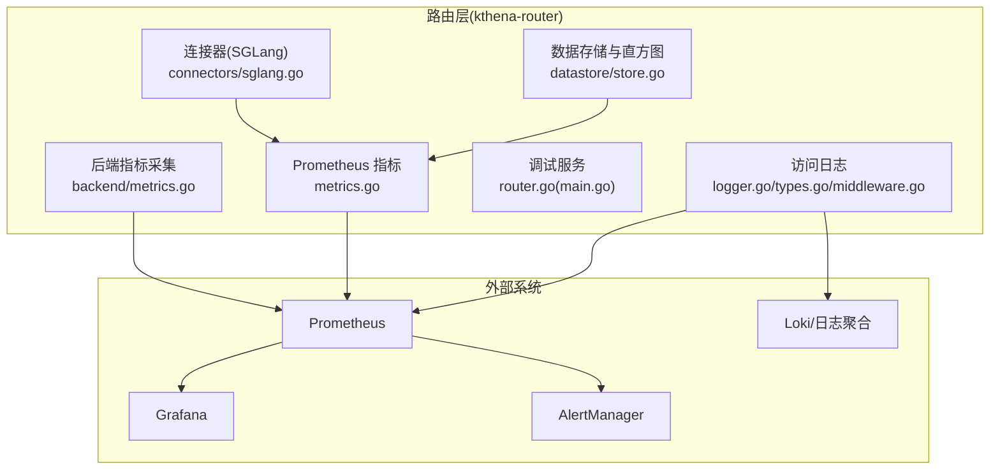
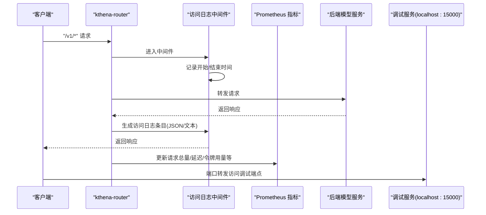
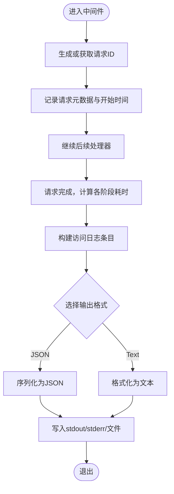
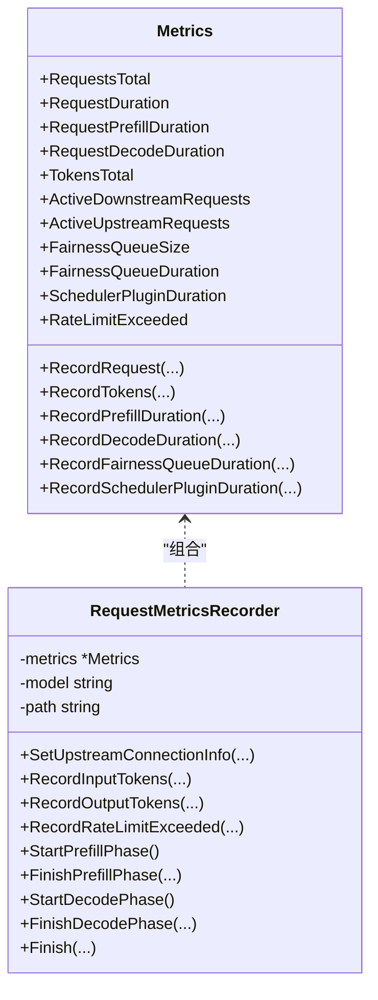
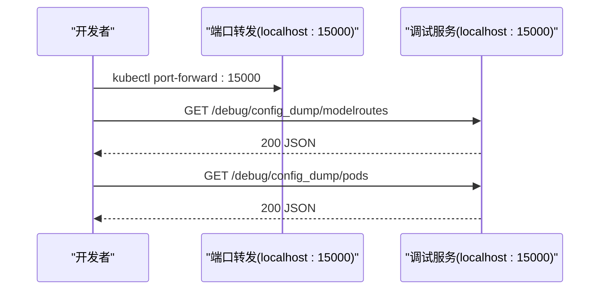
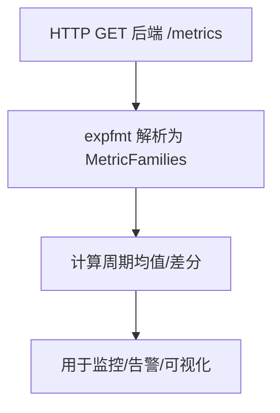
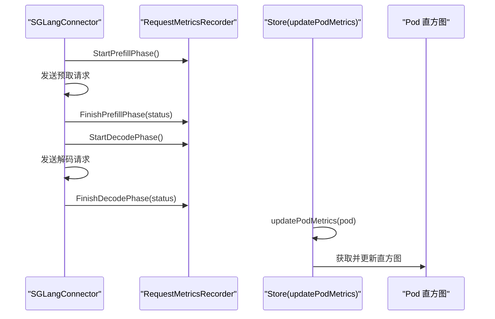
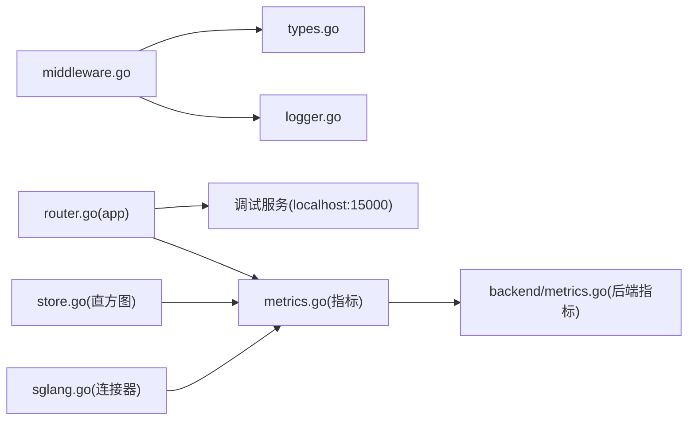

# 监控与可观测性

<cite>
**本文引用的文件**
- [logger.go](file://pkg/kthena-router/accesslog/logger.go)
- [types.go](file://pkg/kthena-router/accesslog/types.go)
- [middleware.go](file://pkg/kthena-router/accesslog/middleware.go)
- [metrics.go](file://pkg/kthena-router/metrics/metrics.go)
- [router.go](file://cmd/kthena-router/app/router.go)
- [main.go](file://cmd/kthena-router/main.go)
- [router-observability.md](file://docs/kthena/docs/user-guide/router-observability.md)
- [prometheus.md](file://docs/kthena/docs/general/prometheus.md)
- [debug_test.go](file://test/e2e/router/debug_test.go)
- [sglang.go](file://pkg/kthena-router/connectors/sglang.go)
- [factory.go](file://pkg/kthena-router/connectors/factory.go)
- [metrics.go](file://pkg/kthena-router/backend/metrics/metrics.go)
- [store.go](file://pkg/kthena-router/datastore/store.go)
- [store_test.go](file://pkg/kthena-router/datastore/store_test.go)
- [router.go](file://pkg/kthena-router/scheduler/plugins/least_latency.go)
</cite>

## 目录
1. [简介](#简介)
2. [项目结构](#项目结构)
3. [核心组件](#核心组件)
4. [架构总览](#架构总览)
5. [详细组件分析](#详细组件分析)
6. [依赖关系分析](#依赖关系分析)
7. [性能考量](#性能考量)
8. [故障排查指南](#故障排查指南)
9. [结论](#结论)
10. [附录](#附录)

## 简介
本指南面向运维与平台工程团队，系统化阐述 Kthena 平台在“路由层（kthena-router）”的监控与可观测性体系，覆盖以下方面：
- Prometheus 指标定义与含义：请求量、延迟、错误率、令牌用量、调度器与公平队列、速率限制等
- 访问日志格式与字段解析：结构化 JSON 与文本格式、字段语义、日志分析与故障排查
- 调试服务器与端点：本地只监听、端口与可用接口、端到端验证
- 告警规则与监控仪表板：基于现有指标的告警建议与可视化思路
- 性能监控最佳实践与容量规划：从指标到容量评估的闭环

## 项目结构
围绕可观测性的关键代码分布在如下模块：
- 访问日志：结构化记录每条请求的完整生命周期信息，支持 JSON/文本输出与多目标输出
- Prometheus 指标：统一暴露路由层关键业务指标，便于监控、告警与趋势分析
- 调试服务：仅绑定 localhost 的内网调试接口，用于导出路由配置与运行时状态
- 后端指标采集：对后端模型服务的指标进行拉取与解析，支撑更细粒度的性能分析
- 数据存储与直方图：维护每个 Pod 的直方图指标，支持增量计算与跨周期对比

图表来源
- [logger.go:138-208](file://pkg/kthena-router/accesslog/logger.go#L138-L208)
- [metrics.go:87-223](file://pkg/kthena-router/metrics/metrics.go#L87-L223)
- [router.go:113-156](file://cmd/kthena-router/app/router.go#L113-L156)
- [main.go:78-121](file://cmd/kthena-router/main.go#L78-L121)
- [metrics.go:38-55](file://pkg/kthena-router/backend/metrics/metrics.go#L38-L55)
- [store.go:1168-1285](file://pkg/kthena-router/datastore/store.go#L1168-L1285)
- [sglang.go:86-195](file://pkg/kthena-router/connectors/sglang.go#L86-L195)

章节来源
- [router.go:113-156](file://cmd/kthena-router/app/router.go#L113-L156)
- [main.go:78-121](file://cmd/kthena-router/main.go#L78-L121)

## 核心组件
- 访问日志子系统
  - 支持 JSON 与文本两种格式；输出可为 stdout/stderr/文件路径
  - 结构化字段覆盖时间戳、方法、路径、协议、状态码、错误类型与消息、AI 路由信息、令牌数、端到端与分阶段耗时
  - 中间件在请求处理前后打点，最终生成访问日志条目
- Prometheus 指标子系统
  - 请求总量、端到端与分阶段延迟直方图、令牌用量计数器
  - 公平队列大小与等待时延直方图、活跃上游/下游请求数
  - 调度器插件执行时延直方图、速率限制触发计数器
- 调试服务
  - 默认仅绑定 localhost:15000，提供路由表、模型服务、Pod、网关、HTTPRoute、推理池等资源列表与详情
  - 通过端口转发访问，避免直接对外暴露
- 后端指标采集
  - 以 HTTP 客户端抓取后端指标文本，解析为 MetricFamilies，支持按需计算如 TPOT/TTFT 的周期均值

章节来源
- [logger.go:44-98](file://pkg/kthena-router/accesslog/logger.go#L44-L98)
- [types.go:24-97](file://pkg/kthena-router/accesslog/types.go#L24-L97)
- [middleware.go:31-63](file://pkg/kthena-router/accesslog/middleware.go#L31-L63)
- [metrics.go:54-223](file://pkg/kthena-router/metrics/metrics.go#L54-L223)
- [router.go:113-156](file://cmd/kthena-router/app/router.go#L113-L156)
- [main.go:78-121](file://cmd/kthena-router/main.go#L78-L121)
- [metrics.go:38-55](file://pkg/kthena-router/backend/metrics/metrics.go#L38-L55)

## 架构总览
下图展示路由层可观测性数据流：访问日志与 Prometheus 指标分别由访问日志中间件与指标注册模块产生；调试服务独立监听 localhost 提供内网诊断能力；后端指标采集模块负责拉取后端服务指标。

图表来源
- [middleware.go:31-63](file://pkg/kthena-router/accesslog/middleware.go#L31-L63)
- [logger.go:100-128](file://pkg/kthena-router/accesslog/logger.go#L100-L128)
- [metrics.go:225-249](file://pkg/kthena-router/metrics/metrics.go#L225-L249)
- [router.go:113-156](file://cmd/kthena-router/app/router.go#L113-L156)

## 详细组件分析

### 访问日志：格式、字段与分析
- 输出格式
  - JSON：结构化，便于日志收集与查询
  - 文本：便于人类阅读与快速定位
- 输出目标
  - stdout/stderr/文件路径，支持环境变量动态配置
- 关键字段
  - 标准 HTTP 字段：timestamp、method、path、protocol、status_code
  - 错误信息：error.type、error.message
  - AI 路由信息：model_name、model_route、model_server、selected_pod、request_id
  - 网关扩展：gateway、http_route、inference_pool
  - 令牌统计：input_tokens、output_tokens
  - 时间拆解：duration_total、duration_request_processing、duration_upstream_processing、duration_response_processing
- 日志中间件行为
  - 自动生成/透传 x-request-id
  - 在请求完成后生成日志条目并写入目标
- 分析与排查
  - 使用 JSON 过滤与 jq 解析，结合 request_id 追踪单次调用
  - 通过 status_code/error.type 快速定位错误类型与来源

图表来源
- [middleware.go:31-63](file://pkg/kthena-router/accesslog/middleware.go#L31-L63)
- [types.go:169-223](file://pkg/kthena-router/accesslog/types.go#L169-L223)
- [logger.go:138-208](file://pkg/kthena-router/accesslog/logger.go#L138-L208)

章节来源
- [logger.go:44-98](file://pkg/kthena-router/accesslog/logger.go#L44-L98)
- [types.go:24-97](file://pkg/kthena-router/accesslog/types.go#L24-L97)
- [middleware.go:31-63](file://pkg/kthena-router/accesslog/middleware.go#L31-L63)
- [router-observability.md:67-168](file://docs/kthena/docs/user-guide/router-observability.md#L67-L168)

### Prometheus 指标：定义与含义
- 指标清单与标签
  - kthena_router_requests_total：按 model/path/status_code/error_type 维度统计
  - kthena_router_request_duration_seconds：端到端延迟直方图
  - kthena_router_request_prefill_duration_seconds / kthena_router_request_decode_duration_seconds：PD 拆分阶段延迟直方图
  - kthena_router_tokens_total：输入/输出令牌累计
  - kthena_router_active_downstream_requests / kthena_router_active_upstream_requests：当前活跃请求数
  - kthena_router_fairness_queue_size / kthena_router_fairness_queue_duration_seconds：公平队列规模与等待时延
  - kthena_router_scheduler_plugin_duration_seconds：调度器插件执行时延
  - kthena_router_rate_limit_exceeded_total：因速率限制被拒绝的请求数
- 指标注册与更新
  - 通过 NewMetrics 注册并返回默认实例
  - RequestMetricsRecorder 提供按请求维度的便捷记录器，自动携带 model/path 等标签
- 与后端指标的关系
  - 后端指标采集模块可解析后端导出的文本指标，结合路由层指标进行端到端分析

图表来源
- [metrics.go:54-223](file://pkg/kthena-router/metrics/metrics.go#L54-L223)
- [metrics.go:341-445](file://pkg/kthena-router/metrics/metrics.go#L341-L445)

章节来源
- [metrics.go:54-223](file://pkg/kthena-router/metrics/metrics.go#L54-L223)
- [metrics.go:341-445](file://pkg/kthena-router/metrics/metrics.go#L341-L445)
- [router-observability.md:26-66](file://docs/kthena/docs/user-guide/router-observability.md#L26-L66)

### 调试服务器：端口与端点
- 绑定策略
  - 仅绑定 localhost，避免直接对外暴露
  - 通过端口转发访问（如 kubectl port-forward），默认端口 15000
- 可用端点
  - 列表：/debug/config_dump/modelroutes、/debug/config_dump/modelservers、/debug/config_dump/pods、/debug/config_dump/gateways、/debug/config_dump/httproutes、/debug/config_dump/inferencepools
  - 详情：/debug/config_dump/namespaces/:namespace/modelroutes/:name 等
- 行为验证
  - E2E 测试验证：通过 Pod IP 直连应失败；通过端口转发访问应成功且返回 JSON

图表来源
- [router.go:113-156](file://cmd/kthena-router/app/router.go#L113-L156)
- [main.go:78-121](file://cmd/kthena-router/main.go#L78-L121)
- [debug_test.go:32-107](file://test/e2e/router/debug_test.go#L32-L107)

章节来源
- [router.go:113-156](file://cmd/kthena-router/app/router.go#L113-L156)
- [main.go:78-121](file://cmd/kthena-router/main.go#L78-L121)
- [debug_test.go:32-107](file://test/e2e/router/debug_test.go#L32-L107)

### 后端指标采集：拉取与解析
- 功能概述
  - 通过 HTTP 拉取后端指标文本，解析为 MetricFamilies
  - 提供 LastPeriodAvg 计算 TPOT/TTFT 的周期均值，辅助性能对比
- 应用场景
  - 结合路由层指标，定位端到端延迟中上游占比
  - 对比不同 Pod 或版本间的性能差异

图表来源
- [metrics.go:38-55](file://pkg/kthena-router/backend/metrics/metrics.go#L38-L55)

章节来源
- [metrics.go:38-55](file://pkg/kthena-router/backend/metrics/metrics.go#L38-L55)

### PD 拆分推理与直方图更新
- SGLang 连接器
  - 在预取/解码阶段分别记录时延，更新路由层直方图
  - 通过上下文传递 RequestMetricsRecorder，确保标签与维度一致
- 数据存储与直方图
  - store.updatePodMetrics 从运行时检查器获取 Pod 级直方图，并更新内存中的历史快照
  - 支持测试用例验证直方图保留与标签更新

图表来源
- [sglang.go:86-195](file://pkg/kthena-router/connectors/sglang.go#L86-L195)
- [metrics.go:388-414](file://pkg/kthena-router/metrics/metrics.go#L388-L414)
- [store.go:1168-1285](file://pkg/kthena-router/datastore/store.go#L1168-L1285)
- [store_test.go:120-164](file://pkg/kthena-router/datastore/store_test.go#L120-L164)

章节来源
- [sglang.go:86-195](file://pkg/kthena-router/connectors/sglang.go#L86-L195)
- [store.go:1168-1285](file://pkg/kthena-router/datastore/store.go#L1168-L1285)
- [store_test.go:120-164](file://pkg/kthena-router/datastore/store_test.go#L120-L164)

### 调度器插件与最小延迟评分
- 最小/最大 TTFT/TPOT 统计
  - 用于评估候选 Pod 的性能区间，辅助评分与选择
- 与指标的关系
  - 插件执行时延可通过 kthena_router_scheduler_plugin_duration_seconds 进行观测与告警

章节来源
- [router.go:95-130](file://pkg/kthena-router/scheduler/plugins/least_latency.go#L95-L130)
- [metrics.go:133-140](file://pkg/kthena-router/metrics/metrics.go#L133-L140)

## 依赖关系分析
- 访问日志依赖
  - 中间件依赖 UUID 生成请求 ID，依赖 klog 记录写入错误
  - 日志实现支持 stdout/stderr/文件三种输出
- 指标依赖
  - 使用 prometheus/client_golang 注册与导出指标
  - RequestMetricsRecorder 作为便捷封装，减少重复标签拼装
- 调试服务依赖
  - 仅绑定 localhost，避免网络暴露风险
  - 通过端口转发访问，测试用例验证该行为
- 后端指标依赖
  - 使用 expfmt 解析 Prometheus 文本格式指标
  - 提供 LastPeriodAvg 辅助计算

图表来源
- [middleware.go:31-63](file://pkg/kthena-router/accesslog/middleware.go#L31-L63)
- [types.go:24-97](file://pkg/kthena-router/accesslog/types.go#L24-L97)
- [logger.go:69-98](file://pkg/kthena-router/accesslog/logger.go#L69-L98)
- [router.go:113-156](file://cmd/kthena-router/app/router.go#L113-L156)
- [metrics.go:87-223](file://pkg/kthena-router/metrics/metrics.go#L87-L223)
- [metrics.go:38-55](file://pkg/kthena-router/backend/metrics/metrics.go#L38-L55)
- [store.go:1168-1285](file://pkg/kthena-router/datastore/store.go#L1168-L1285)
- [sglang.go:86-195](file://pkg/kthena-router/connectors/sglang.go#L86-L195)

章节来源
- [router.go:113-156](file://cmd/kthena-router/app/router.go#L113-L156)
- [main.go:78-121](file://cmd/kthena-router/main.go#L78-L121)

## 性能考量
- 指标维度设计
  - 按 model/path/status_code/error_type 维度统计，便于快速定位异常来源
  - PD 拆分阶段独立计时，便于识别预取/解码瓶颈
- 直方图桶设计
  - 针对端到端与阶段延迟采用较细粒度桶，兼顾精度与资源占用
- 公平队列与活跃请求数
  - 通过公平队列规模与等待时延直方图，评估排队压力与公平性
- 速率限制与保护
  - 通过 rate limit exceeded 计数器，配合阈值告警，防止雪崩
- 后端指标联动
  - 拉取后端指标并与路由层指标对比，定位端到端延迟中上游占比

## 故障排查指南
- 准备工作
  - 端口转发：8080（指标）、15000（调试）
  - 实时查看 JSON 访问日志：过滤有效 JSON 行并用 jq 解析
- 高错误率（5xx/超时/内部错误）
  - 统计按状态码与模型的错误分布
  - 查看最近失败请求的错误类型与所选 Pod
  - 检查后端模型服务健康状态
- 高延迟/慢 TTFT/生成速度
  - 观察端到端与阶段延迟分位数
  - 查找高延迟请求，关注上游处理耗时
  - 监控活跃下游请求与公平队列规模
- 队列堆积/公平性/限流
  - 实时观察公平队列规模与等待时延分布
  - 查找被限流/排队满导致的拒绝请求
- 路由错误/404/Pod 选择问题
  - 导出路由表与 Pod 就绪状态
  - 使用 request_id 追踪特定请求链路
- 令牌用量/成本/滥用监控
  - 查看令牌累计计数
  - 过滤高输入/输出令牌请求，评估成本与异常

章节来源
- [router-observability.md:169-294](file://docs/kthena/docs/user-guide/router-observability.md#L169-L294)

## 结论
Kthena 路由层的可观测性以“访问日志 + Prometheus 指标 + 调试服务”三位一体为核心，既能满足生产级监控与告警，又能提供快速的端到端排障能力。通过结构化日志与细粒度指标，结合后端指标采集与公平队列观测，可形成从请求到后端的全链路可见性闭环，支撑性能优化、容量规划与成本控制。

## 附录
- 访问日志配置（环境变量）
  - ACCESS_LOG_ENABLED：是否启用
  - ACCESS_LOG_FORMAT：json/text
  - ACCESS_LOG_OUTPUT：stdout/stderr/文件路径
- 指标端点
  - 默认端口 8080，路径 /metrics
- 调试端点
  - 默认端口 15000，仅 localhost 可访问，通过端口转发访问
- 建议的告警与仪表板
  - 参考通用 Prometheus 文档中的告警规则与 Grafana 仪表板示例，结合路由层指标进行定制

章节来源
- [router.go:125-154](file://cmd/kthena-router/app/router.go#L125-L154)
- [router-observability.md:94-141](file://docs/kthena/docs/user-guide/router-observability.md#L94-L141)
- [prometheus.md:458-616](file://docs/kthena/docs/general/prometheus.md#L458-L616)