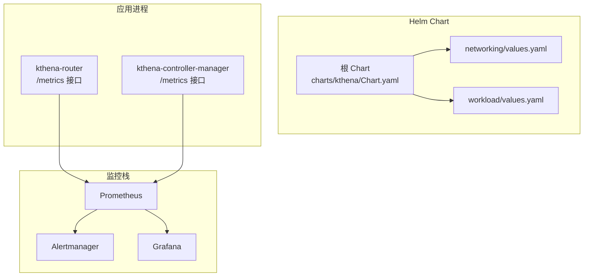
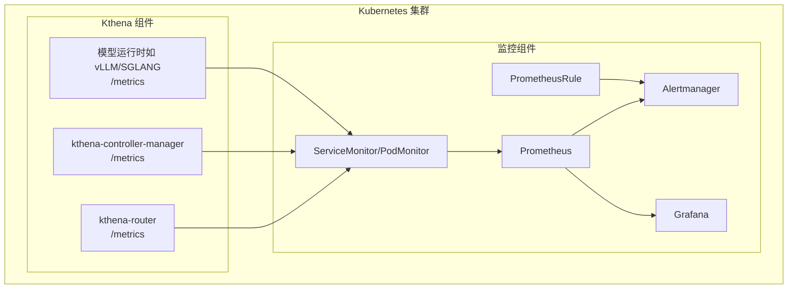
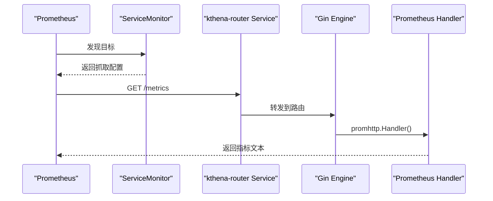
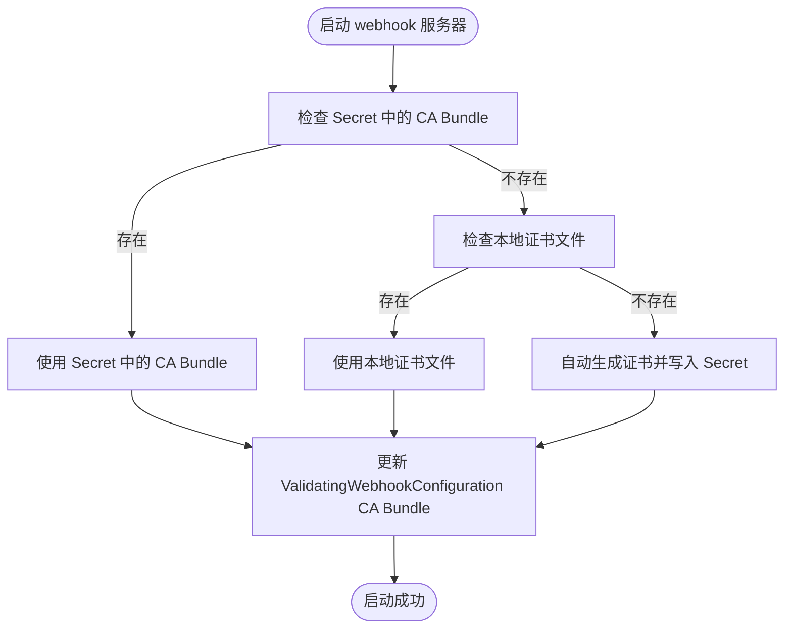
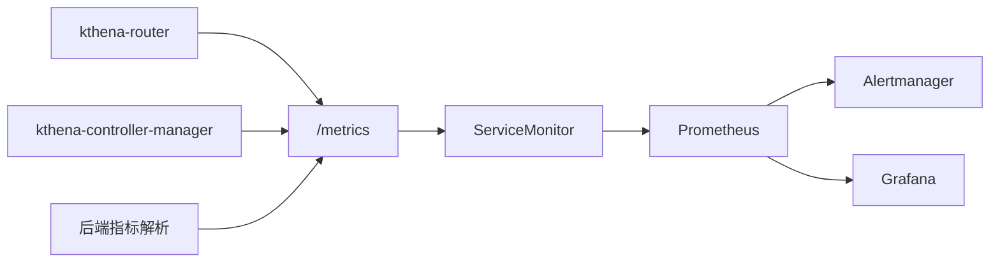

# 监控配置

<cite>
**本文引用的文件**
- [prometheus.md](file://docs/kthena/docs/general/prometheus.md)
- [Chart.yaml](file://charts/kthena/Chart.yaml)
- [values.yaml](file://charts/kthena/values.yaml)
- [networking/values.yaml](file://charts/kthena/charts/networking/values.yaml)
- [workload/values.yaml](file://charts/kthena/charts/workload/values.yaml)
- [router.go](file://cmd/kthena-router/app/router.go)
- [metrics.go](file://pkg/kthena-router/metrics/metrics.go)
- [metrics.go（后端）](file://pkg/kthena-router/backend/metrics/metrics.go)
- [servicemonitor.yaml](file://examples/keda-autoscaling/servicemonitor.yaml)
- [main.go（router 主程序）](file://cmd/kthena-router/main.go)
- [main.go（controller-manager 主程序）](file://cmd/kthena-controller-manager/main.go)
</cite>

## 目录
1. [简介](#简介)
2. [项目结构](#项目结构)
3. [核心组件](#核心组件)
4. [架构总览](#架构总览)
5. [详细组件分析](#详细组件分析)
6. [依赖关系分析](#依赖关系分析)
7. [性能考虑](#性能考虑)
8. [故障排查指南](#故障排查指南)
9. [结论](#结论)
10. [附录](#附录)

## 简介
本指南面向在 Kubernetes 上部署与运维 Kthena 的工程师，系统性讲解如何基于 Prometheus、Grafana、Alertmanager 等组件构建完善的监控体系；涵盖指标采集、服务发现、标签管理、告警规则与通知渠道、证书与安全配置、网络策略、性能优化与容量规划，并给出 Helm Chart 部署清单与集成第三方监控工具的实践建议。

## 项目结构
Kthena 提供了 Helm Chart 以统一编排工作负载与网络组件，监控相关能力通过以下路径体现：
- 文档层：监控与可观测性文档位于 docs/kthena/docs/general/prometheus.md
- Chart 层：根 Chart 定义子 Chart 依赖，子 Chart 提供 networking 与 workload 组件的部署参数
- 应用层：router 与 controller-manager 均内置 /metrics 接口，支持 Prometheus 抓取
- 示例层：提供 KEDA 自动伸缩场景下的 ServiceMonitor 示例

图表来源
- [Chart.yaml:16-22](file://charts/kthena/Chart.yaml#L16-L22)
- [networking/values.yaml:1-92](file://charts/kthena/charts/networking/values.yaml#L1-L92)
- [workload/values.yaml:1-51](file://charts/kthena/charts/workload/values.yaml#L1-L51)
- [router.go:248-256](file://cmd/kthena-router/app/router.go#L248-L256)

章节来源
- [Chart.yaml:1-22](file://charts/kthena/Chart.yaml#L1-L22)
- [values.yaml:1-97](file://charts/kthena/values.yaml#L1-L97)
- [networking/values.yaml:1-92](file://charts/kthena/charts/networking/values.yaml#L1-L92)
- [workload/values.yaml:1-51](file://charts/kthena/charts/workload/values.yaml#L1-L51)

## 核心组件
- Prometheus：负责从 Kthena 组件与模型运行时拉取指标，存储时间序列数据
- Grafana：提供可视化面板与仪表盘，展示请求速率、延迟、错误率、资源使用等
- Alertmanager：接收告警并进行去重、分组、静默与路由到 Slack、邮件等通知渠道
- ServiceMonitor（或 PrometheusRule）：通过 CRD 定义抓取目标与告警规则，实现声明式监控
- OpenTelemetry/Jaeger/Loki（可选）：用于分布式追踪与日志聚合

章节来源
- [prometheus.md:1-927](file://docs/kthena/docs/general/prometheus.md#L1-L927)

## 架构总览
下图展示了 Kthena 组件与监控栈的交互关系，以及指标采集与告警流转的关键节点。

图表来源
- [router.go:248-256](file://cmd/kthena-router/app/router.go#L248-L256)
- [metrics.go（后端）:38-55](file://pkg/kthena-router/backend/metrics/metrics.go#L38-L55)
- [servicemonitor.yaml:1-17](file://examples/keda-autoscaling/servicemonitor.yaml#L1-L17)
- [prometheus.md:520-615](file://docs/kthena/docs/general/prometheus.md#L520-L615)

## 详细组件分析

### Prometheus 安装与配置
- 使用 Helm 安装 kube-prometheus-stack 并禁用默认的 selector 行为，确保自定义 ServiceMonitor 生效
- 通过 ConfigMap 或 CRD 定义抓取任务，包括：
  - Pod 级抓取（按命名空间与标签选择）
  - 静态目标（如 controller-manager 的 /metrics 端点）
- 关键抓取配置要点
  - relabel_configs：按注解过滤、修正 __address__ 与 __metrics_path__
  - honorLabels：避免上游标签覆盖
  - namespaceSelector：限定抓取范围

章节来源
- [prometheus.md:34-121](file://docs/kthena/docs/general/prometheus.md#L34-L121)

### Grafana 可视化与仪表盘
- Grafana 通过数据源连接 Prometheus，提供多类仪表盘：
  - Kthena 概览：请求速率、P95 延迟、错误率、活跃模型数、内存/GPU 使用、自动伸缩副本数
  - 模型级仪表盘：按 model_id 过滤，查看请求速率分布、延迟热力图、模型准确率趋势
- 仪表盘模板变量：通过查询 label_values 注入动态维度

章节来源
- [prometheus.md:198-456](file://docs/kthena/docs/general/prometheus.md#L198-L456)

### 告警规则与通知渠道
- 告警规则覆盖：
  - 服务可用性：up 任务异常
  - 推理性能：P95 延迟阈值、错误率阈值
  - 资源使用：模型内存占用、GPU 利用率
  - 模型状态：加载失败次数、准确率下降
  - 自动伸缩：高负载但副本未增长
- 通知渠道：
  - 邮件：SMTP 配置
  - Slack：Webhook 配置，支持分组与标题定制

章节来源
- [prometheus.md:458-615](file://docs/kthena/docs/general/prometheus.md#L458-L615)

### 指标采集与服务发现
- kthena-router 内置 /metrics 接口，注册 Prometheus Handler
- 通过 ServiceMonitor 选择 router 服务，抓取 /metrics 路径
- 模型运行时（vLLM/SGLANG）通过后端指标解析函数拉取远端 /metrics 并解析文本格式

图表来源
- [router.go:248-256](file://cmd/kthena-router/app/router.go#L248-L256)
- [servicemonitor.yaml:1-17](file://examples/keda-autoscaling/servicemonitor.yaml#L1-L17)

章节来源
- [router.go:248-256](file://cmd/kthena-router/app/router.go#L248-L256)
- [metrics.go（后端）:38-55](file://pkg/kthena-router/backend/metrics/metrics.go#L38-L55)
- [servicemonitor.yaml:1-17](file://examples/keda-autoscaling/servicemonitor.yaml#L1-L17)

### 指标体系与标签管理
- kthena-router 指标
  - 请求总量、延迟直方图（含 prefill/decode 分阶段）
  - Token 计数（输入/输出）
  - 速率限制触发计数
  - 公平队列大小、排队时延、在途请求数
- 标签设计
  - model、path、status_code、error_type、token_type、plugin、limit_type、model_route、model_server、user_id 等
- 模型运行时指标
  - 通过 HTTP 拉取远端 /metrics，解析文本格式，计算周期内平均延迟等

章节来源
- [metrics.go:26-84](file://pkg/kthena-router/metrics/metrics.go#L26-L84)
- [metrics.go:87-223](file://pkg/kthena-router/metrics/metrics.go#L87-L223)
- [metrics.go（后端）:38-72](file://pkg/kthena-router/backend/metrics/metrics.go#L38-L72)

### 证书管理与安全配置
- 证书管理模式
  - auto：自动为 webhook 生成自签名证书
  - cert-manager：使用 cert-manager 管理证书并注入到 ValidatingWebhookConfiguration
  - manual：手动提供 CA Bundle（base64 编码）
- 路由器与控制器的 webhook 服务器启动流程
  - 优先从 Secret 加载 CA Bundle
  - 若不存在则尝试本地证书文件
  - 否则自动生成证书并更新 ValidatingWebhookConfiguration

图表来源
- [main.go（router 主程序）:124-195](file://cmd/kthena-router/main.go#L124-L195)
- [main.go（controller-manager 主程序）:116-174](file://cmd/kthena-controller-manager/main.go#L116-L174)
- [values.yaml:85-97](file://charts/kthena/values.yaml#L85-L97)

章节来源
- [main.go（router 主程序）:124-195](file://cmd/kthena-router/main.go#L124-L195)
- [main.go（controller-manager 主程序）:116-174](file://cmd/kthena-controller-manager/main.go#L116-L174)
- [values.yaml:85-97](file://charts/kthena/values.yaml#L85-L97)

### 网络策略与访问控制
- 通过 ServiceMonitor 的 namespaceSelector 与 selector 控制抓取范围
- 在网关模式下，/metrics 仅在主端口上暴露，便于集中管理
- 建议结合 NetworkPolicy 限制对 /metrics 的访问范围，仅允许 Prometheus 与内部组件访问

章节来源
- [router.go:188-200](file://cmd/kthena-router/app/router.go#L188-L200)
- [servicemonitor.yaml:7-12](file://examples/keda-autoscaling/servicemonitor.yaml#L7-L12)

### Helm Chart 部署清单与参数
- 根 Chart 依赖 workload 与 networking 子 Chart
- networking.values.yaml
  - kthenaRouter：副本数、镜像、资源、TLS、webhook、公平调度、访问日志、Gateway API
  - webhook：副本数、镜像、资源、端口与证书路径
- workload.values.yaml
  - controllerManager：副本数、镜像、资源、webhook、下载器与运行时镜像、Kube API QPS/Burst

章节来源
- [Chart.yaml:16-22](file://charts/kthena/Chart.yaml#L16-L22)
- [networking/values.yaml:1-92](file://charts/kthena/charts/networking/values.yaml#L1-L92)
- [workload/values.yaml:1-51](file://charts/kthena/charts/workload/values.yaml#L1-L51)

## 依赖关系分析
- 组件耦合
  - kthena-router 与 controller-manager 均暴露 /metrics，Prometheus 通过 ServiceMonitor 抓取
  - 模型运行时指标由后端模块拉取并解析，便于统一上报
- 外部依赖
  - Prometheus Operator（ServiceMonitor/PodMonitor）、kube-state-metrics、node-exporter
  - Alertmanager 与通知通道（Slack、邮件）

图表来源
- [router.go:248-256](file://cmd/kthena-router/app/router.go#L248-L256)
- [metrics.go（后端）:38-55](file://pkg/kthena-router/backend/metrics/metrics.go#L38-L55)
- [servicemonitor.yaml:1-17](file://examples/keda-autoscaling/servicemonitor.yaml#L1-L17)

章节来源
- [router.go:248-256](file://cmd/kthena-router/app/router.go#L248-L256)
- [metrics.go（后端）:38-55](file://pkg/kthena-router/backend/metrics/metrics.go#L38-L55)
- [servicemonitor.yaml:1-17](file://examples/keda-autoscaling/servicemonitor.yaml#L1-L17)

## 性能考虑
- 抓取间隔与超时
  - 建议 15s 抓取间隔，针对关键服务可缩短至 5s
  - 设置合理的 scrape_timeout，避免长尾影响
- 指标数量与标签基数
  - 控制高基数标签（如 user_id、pod 名称），必要时使用 label_replace/rename
  - 对高频直方图桶进行裁剪，减少内存与存储开销
- Prometheus 存储与查询
  - 合理设置 retention 与 remote write（如需）
  - 使用 recording rules 降低查询压力
- 资源与副本
  - Prometheus 与 Alertmanager 建议独立资源配额与亲和/反亲和
  - Grafana 与 Prometheus 保持就近部署，减少网络抖动

## 故障排查指南
- 无法抓取 /metrics
  - 检查 ServiceMonitor 的 selector 与 namespaceSelector 是否匹配
  - 确认 Pod 已标注 prometheus.io/scrape=true、path、port
  - 核对路由端口与路径（网关模式下仅主端口暴露 /metrics）
- 指标缺失或标签不全
  - 检查 honorLabels 与 relabel_configs，避免上游覆盖
  - 确认目标 Pod 的 /metrics 路径与格式正确
- 告警未触发或重复
  - 检查 PrometheusRule 的表达式与 for/duration 条件
  - 核对 Alertmanager route 与 receiver 配置
- 证书问题导致 webhook 不生效
  - 检查 Secret 是否存在、CA Bundle 是否注入
  - 确认 ValidatingWebhookConfiguration 的 caBundle 已更新
  - 查看 webhook 日志，确认 TLS 文件就绪

章节来源
- [router.go:188-200](file://cmd/kthena-router/app/router.go#L188-L200)
- [servicemonitor.yaml:1-17](file://examples/keda-autoscaling/servicemonitor.yaml#L1-L17)
- [main.go（router 主程序）:176-183](file://cmd/kthena-router/main.go#L176-L183)
- [main.go（controller-manager 主程序）:153-174](file://cmd/kthena-controller-manager/main.go#L153-L174)

## 结论
通过将 Kthena 的关键组件纳入 Prometheus 的统一抓取，配合 Grafana 的可视化与 Alertmanager 的告警路由，可以快速建立一套覆盖推理性能、资源使用与自动伸缩健康度的监控体系。结合证书管理、服务发现与标签治理，可在生产环境中实现稳定、可观测、可扩展的 AI 推理平台监控方案。

## 附录

### 快速开始（Helm 安装 kube-prometheus-stack）
- 添加仓库并安装
  - 参考文档中的 Helm 命令与参数
- 创建 ServiceMonitor 与 PrometheusRule
  - 参考文档中的 ServiceMonitor 与 PrometheusRule 示例
- 配置 Grafana 数据源与仪表盘
  - 参考文档中的 Grafana 配置与仪表盘 JSON

章节来源
- [prometheus.md:34-121](file://docs/kthena/docs/general/prometheus.md#L34-L121)
- [prometheus.md:198-456](file://docs/kthena/docs/general/prometheus.md#L198-L456)
- [prometheus.md:458-615](file://docs/kthena/docs/general/prometheus.md#L458-L615)

### 自动伸缩与指标端点
- KEDA 场景下的 ServiceMonitor 示例
  - 选择 kthena-router 所在命名空间与标签，抓取 /metrics

章节来源
- [servicemonitor.yaml:1-17](file://examples/keda-autoscaling/servicemonitor.yaml#L1-L17)