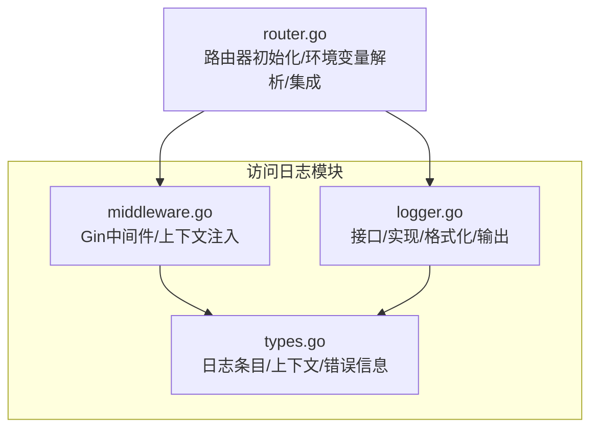
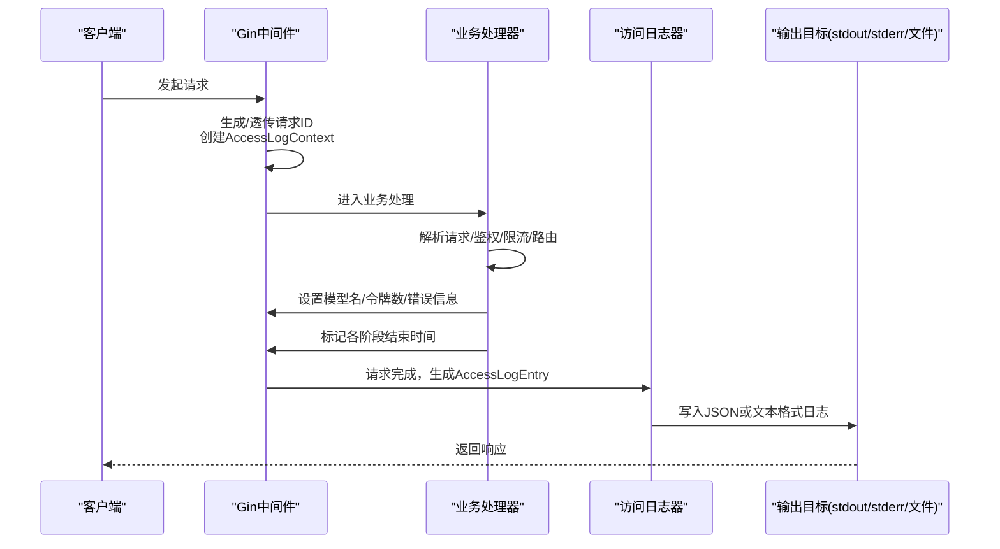
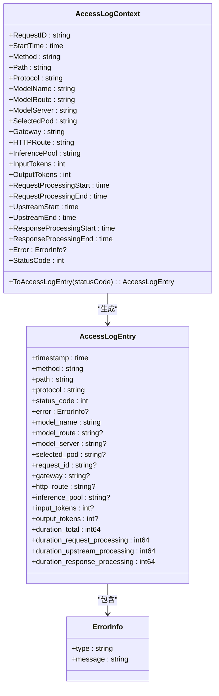
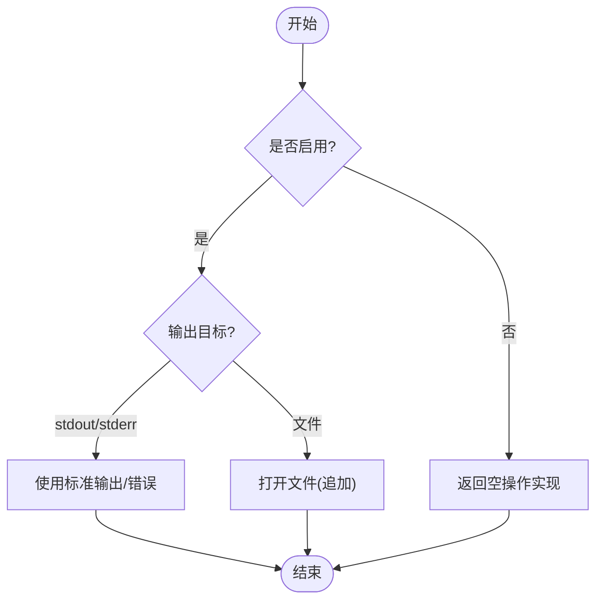
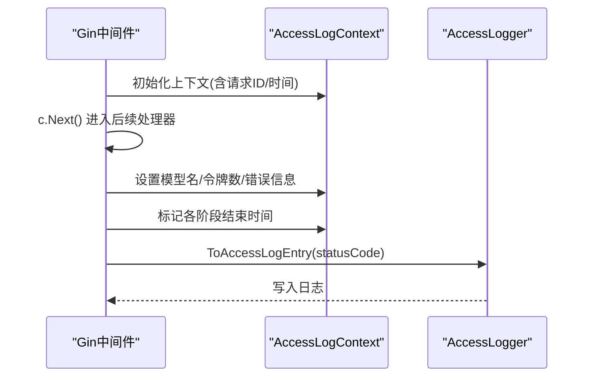
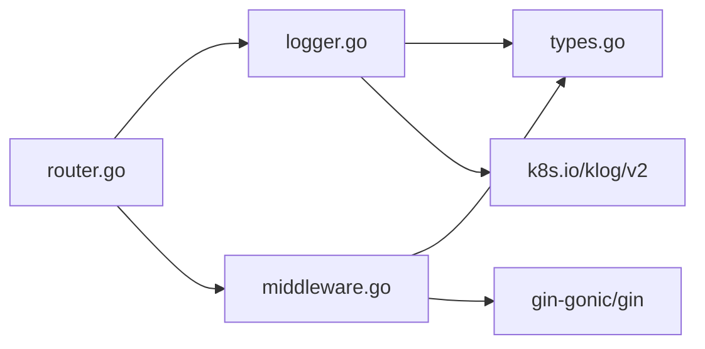

# 访问日志

<cite>
**本文引用的文件**
- [logger.go](file://pkg/kthena-router/accesslog/logger.go)
- [types.go](file://pkg/kthena-router/accesslog/types.go)
- [middleware.go](file://pkg/kthena-router/accesslog/middleware.go)
- [logger_test.go](file://pkg/kthena-router/accesslog/logger_test.go)
- [router.go](file://pkg/kthena-router/router/router.go)
- [router-access-log-fields.md](file://docs/kthena/docs/reference/router-access-log-fields.md)
</cite>

## 目录
1. [简介](#简介)
2. [项目结构](#项目结构)
3. [核心组件](#核心组件)
4. [架构总览](#架构总览)
5. [详细组件分析](#详细组件分析)
6. [依赖关系分析](#依赖关系分析)
7. [性能与可扩展性](#性能与可扩展性)
8. [故障排查指南](#故障排查指南)
9. [结论](#结论)
10. [附录：配置与最佳实践](#附录配置与最佳实践)

## 简介
本文件系统化阐述 Kthena 路由器访问日志子系统的设计与实现，覆盖日志格式规范、字段定义、触发时机、输出目标、错误处理与性能特性，并提供日志轮转、存储与检索的最佳实践建议，以及日志分析与查询示例，帮助运维团队进行故障排查与性能分析。同时给出日志格式自定义与扩展的方法，便于在生产环境中按需定制。

## 项目结构
访问日志能力位于独立模块 pkg/kthena-router/accesslog，围绕以下关键文件组织：
- 类型与上下文：types.go 定义日志条目、错误信息、上下文与生命周期标记方法
- 中间件与入口：middleware.go 提供 Gin 中间件，贯穿请求生命周期采集元数据
- 日志器与输出：logger.go 实现接口、配置、格式化与输出（stdout/stderr/文件）
- 集成点：router.go 在路由器初始化时读取环境变量构建日志器，并在请求处理链路中设置字段与打点

图表来源
- [types.go:23-97](file://pkg/kthena-router/accesslog/types.go#L23-L97)
- [middleware.go:30-63](file://pkg/kthena-router/accesslog/middleware.go#L30-L63)
- [logger.go:28-98](file://pkg/kthena-router/accesslog/logger.go#L28-L98)
- [router.go:125-168](file://pkg/kthena-router/router/router.go#L125-L168)

章节来源
- [types.go:23-97](file://pkg/kthena-router/accesslog/types.go#L23-L97)
- [middleware.go:30-63](file://pkg/kthena-router/accesslog/middleware.go#L30-L63)
- [logger.go:28-98](file://pkg/kthena-router/accesslog/logger.go#L28-L98)
- [router.go:125-168](file://pkg/kthena-router/router/router.go#L125-L168)

## 核心组件
- 访问日志接口与实现
  - 接口：定义日志写入与关闭能力
  - 实现：支持 JSON 与文本两种格式；支持 stdout/stderr/文件输出；禁用时返回空操作实现
- 日志条目与上下文
  - 结构化字段：标准 HTTP 字段、AI 路由信息、令牌统计、分阶段耗时、错误信息
  - 上下文：生命周期打点（请求处理、上游推理、响应处理）与最终状态码
- Gin 中间件
  - 注入请求上下文、生成/透传请求 ID、在请求完成后收集并落盘日志

章节来源
- [logger.go:28-136](file://pkg/kthena-router/accesslog/logger.go#L28-L136)
- [types.go:23-97](file://pkg/kthena-router/accesslog/types.go#L23-L97)
- [middleware.go:30-63](file://pkg/kthena-router/accesslog/middleware.go#L30-L63)

## 架构总览
访问日志在请求生命周期中的触发流程如下：

图表来源
- [middleware.go:30-63](file://pkg/kthena-router/accesslog/middleware.go#L30-L63)
- [router.go:204-314](file://pkg/kthena-router/router/router.go#L204-L314)
- [logger.go:100-128](file://pkg/kthena-router/accesslog/logger.go#L100-L128)

章节来源
- [middleware.go:30-63](file://pkg/kthena-router/accesslog/middleware.go#L30-L63)
- [router.go:204-314](file://pkg/kthena-router/router/router.go#L204-L314)
- [logger.go:100-128](file://pkg/kthena-router/accesslog/logger.go#L100-L128)

## 详细组件分析

### 日志条目与上下文（结构化字段）
- 标准 HTTP 字段（遵循 Envoy 兼容格式）
  - 时间戳、方法、路径、协议、状态码
- 错误信息（可选）
  - 类型与消息，用于失败场景
- AI 路由信息
  - 模型名、ModelRoute、ModelServer、选中 Pod、请求 ID
- Gateway API / Inference Extension 信息（可选）
  - 网关、HTTPRoute、InferencePool
- 令牌统计
  - 输入/输出令牌数
- 分阶段耗时（毫秒）
  - 总耗时、请求处理、上游推理、响应处理

图表来源
- [types.go:23-97](file://pkg/kthena-router/accesslog/types.go#L23-L97)

章节来源
- [types.go:23-97](file://pkg/kthena-router/accesslog/types.go#L23-L97)

### 日志器与输出（格式、目标、错误处理）
- 支持格式
  - JSON：适合日志聚合与分析
  - 文本：便于开发调试与快速查看
- 输出目标
  - stdout/stderr 或指定文件路径
- 行为与错误处理
  - 禁用时返回空操作实现
  - 不支持的格式返回错误
  - 写入失败返回错误（中间件会记录 klog）

图表来源
- [logger.go:70-98](file://pkg/kthena-router/accesslog/logger.go#L70-L98)

章节来源
- [logger.go:70-136](file://pkg/kthena-router/accesslog/logger.go#L70-L136)

### Gin 中间件（生命周期与字段填充）
- 生命周期
  - 创建上下文、注入到 gin.Context
  - 请求结束后，根据状态码与上下文生成日志条目并写入
- 字段填充
  - 模型名、令牌数、错误类型/消息、各阶段结束时间
- 请求 ID
  - 若请求头未携带，则生成 UUID 并回填

图表来源
- [middleware.go:30-63](file://pkg/kthena-router/accesslog/middleware.go#L30-L63)
- [types.go:169-223](file://pkg/kthena-router/accesslog/types.go#L169-L223)

章节来源
- [middleware.go:30-138](file://pkg/kthena-router/accesslog/middleware.go#L30-L138)
- [types.go:169-223](file://pkg/kthena-router/accesslog/types.go#L169-L223)

### 路由器集成（环境变量与初始化）
- 初始化阶段
  - 从环境变量读取 ACCESS_LOG_ENABLED、ACCESS_LOG_FORMAT、ACCESS_LOG_OUTPUT
  - 构造日志器并注入到路由器实例
- 请求处理阶段
  - 在各关键节点设置模型名、令牌数、错误信息、阶段时间
  - 请求完成后生成并落盘日志

章节来源
- [router.go:125-168](file://pkg/kthena-router/router/router.go#L125-L168)
- [router.go:204-314](file://pkg/kthena-router/router/router.go#L204-L314)

## 依赖关系分析
- 组件耦合
  - 路由器依赖访问日志器；中间件依赖上下文；日志器依赖条目结构
- 外部依赖
  - Gin 用于中间件与上下文
  - klog 用于中间件写入失败时的日志记录
  - 标准库 time、json、os、strings 用于格式化与文件输出

图表来源
- [router.go:125-168](file://pkg/kthena-router/router/router.go#L125-L168)
- [middleware.go:19-23](file://pkg/kthena-router/accesslog/middleware.go#L19-L23)
- [logger.go:19-26](file://pkg/kthena-router/accesslog/logger.go#L19-L26)

章节来源
- [router.go:125-168](file://pkg/kthena-router/router/router.go#L125-L168)
- [middleware.go:19-23](file://pkg/kthena-router/accesslog/middleware.go#L19-L23)
- [logger.go:19-26](file://pkg/kthena-router/accesslog/logger.go#L19-L26)

## 性能与可扩展性
- 性能特征
  - 日志写入为同步阻塞调用，建议在高并发场景结合外部日志收集器（如 Fluent Bit、Vector）统一收集
  - 文本格式更轻量，JSON 更利于结构化分析
- 可扩展性
  - 新增字段：在 AccessLogEntry 与 AccessLogContext 中添加字段，并在 ToAccessLogEntry 中映射
  - 自定义格式：可在 logger.go 增加新格式常量与格式化函数
  - 输出目标：当前支持 stdout/stderr/文件，可扩展为 HTTP/UDP/远程服务等（需自行实现接口）

[本节为通用指导，不直接分析具体文件]

## 故障排查指南
- 常见问题与定位
  - 日志未输出：检查 ACCESS_LOG_ENABLED 是否为 true；确认输出目标有效
  - 格式错误：确认 ACCESS_LOG_FORMAT 仅允许 json/text
  - 文件写入失败：检查文件路径权限与磁盘空间
  - 中间件未生效：确认中间件已注册到路由
- 关键字段定位
  - 错误类型与消息：优先查看 error.type 与 error.message
  - 路由信息：核对 model_name/model_route/model_server/selected_pod
  - 性能瓶颈：关注 duration_total 与 duration_upstream_processing 的占比
- 单元测试参考
  - 测试覆盖了 JSON/文本格式、错误字段、上下文生命周期、禁用模式等场景

章节来源
- [logger_test.go:28-269](file://pkg/kthena-router/accesslog/logger_test.go#L28-L269)
- [logger.go:100-136](file://pkg/kthena-router/accesslog/logger.go#L100-L136)

## 结论
Kthena 路由器访问日志系统通过结构化的日志条目与生命周期中间件，提供了可观测性与可诊断性的基础。其灵活的格式与输出配置满足不同环境需求，配合外部日志平台可实现高效的数据采集与分析。

[本节为总结，不直接分析具体文件]

## 附录：配置与最佳实践

### 日志格式规范与字段定义
- 格式
  - JSON：适合结构化采集与分析
  - 文本：适合开发调试与快速查看
- 字段参考
  - 标准 HTTP 字段、错误信息、AI 路由信息、令牌统计、分阶段耗时
- 示例与常见错误类型请参阅参考文档

章节来源
- [router-access-log-fields.md:9-175](file://docs/kthena/docs/reference/router-access-log-fields.md#L9-L175)

### 触发时机与输出目标
- 触发时机
  - 请求进入中间件时创建上下文
  - 请求完成后根据状态码与上下文生成日志条目并写入
- 输出目标
  - stdout/stderr 或文件路径（默认 stdout）

章节来源
- [middleware.go:30-63](file://pkg/kthena-router/accesslog/middleware.go#L30-L63)
- [logger.go:79-92](file://pkg/kthena-router/accesslog/logger.go#L79-L92)

### 日志轮转、存储与检索最佳实践
- 轮转
  - 使用系统级轮转工具（如 logrotate）管理文件大小与保留策略
- 存储
  - 将 stdout/stderr 交由容器运行时收集；将文件输出到持久卷以便长期保存
- 检索
  - 使用结构化日志（JSON）配合日志平台（如 ELK/Fluentd/Loki）进行查询与可视化
- 查询示例思路
  - 按模型名过滤：model_name=...
  - 按错误类型过滤：error.type=timeout/rate_limit
  - 按耗时阈值过滤：duration_total>...

[本节为通用指导，不直接分析具体文件]

### 日志格式自定义与扩展
- 新增字段
  - 在 AccessLogEntry 与 AccessLogContext 中新增字段
  - 在 ToAccessLogEntry 中映射到条目
- 新增格式
  - 在 logger.go 中新增格式常量与格式化函数
  - 在 NewAccessLogger 中增加分支处理
- 输出目标扩展
  - 实现 io.WriteCloser 接口并替换 writer

章节来源
- [types.go:23-97](file://pkg/kthena-router/accesslog/types.go#L23-L97)
- [logger.go:34-52](file://pkg/kthena-router/accesslog/logger.go#L34-L52)
- [logger.go:109-145](file://pkg/kthena-router/accesslog/logger.go#L109-L145)