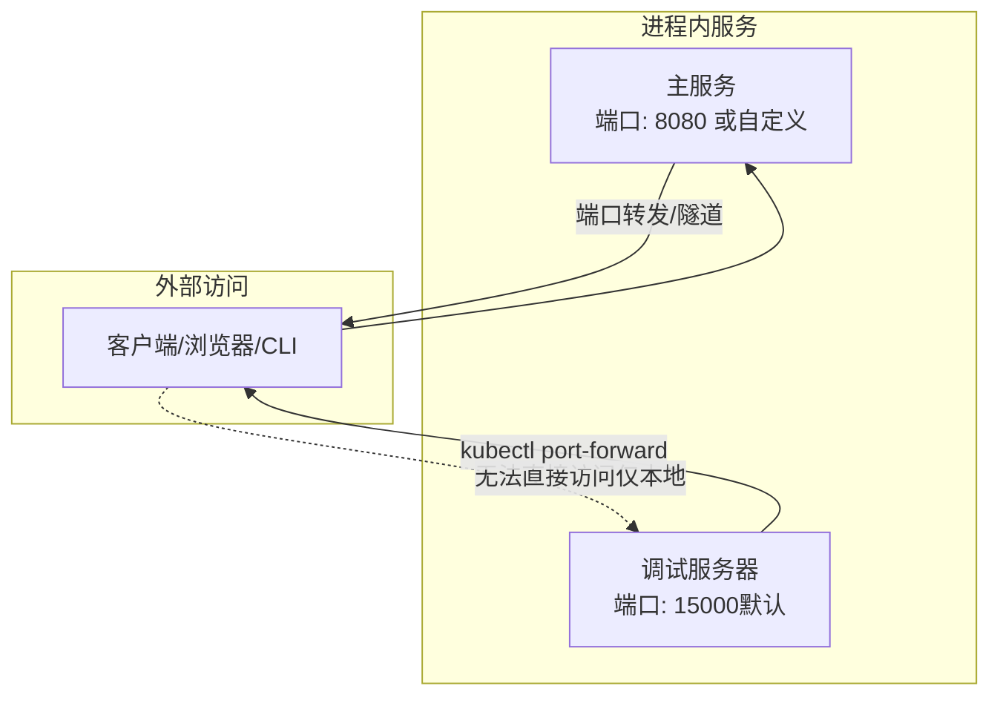
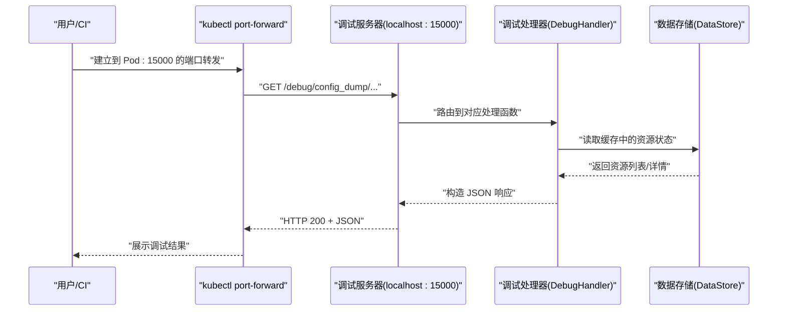
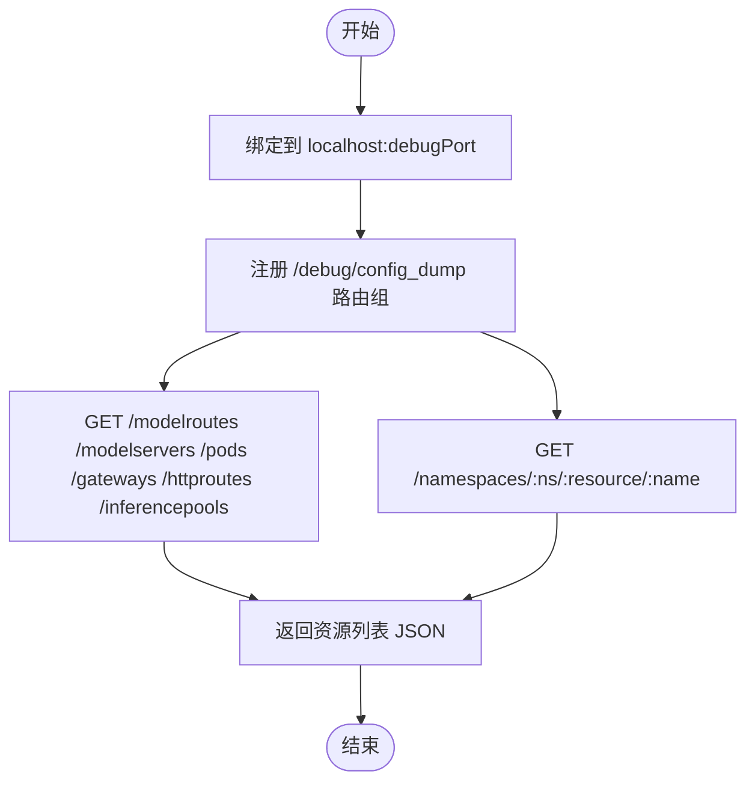
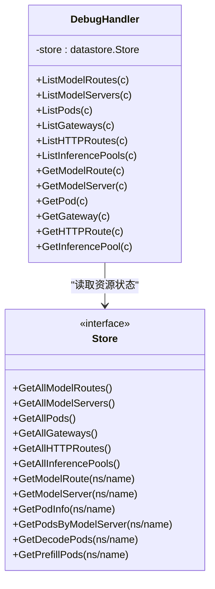
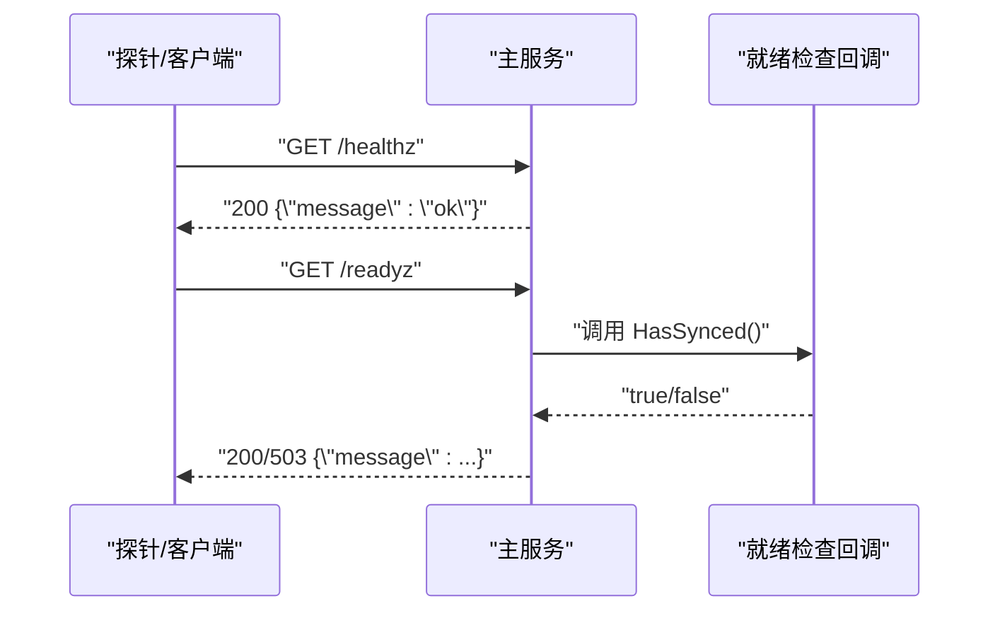
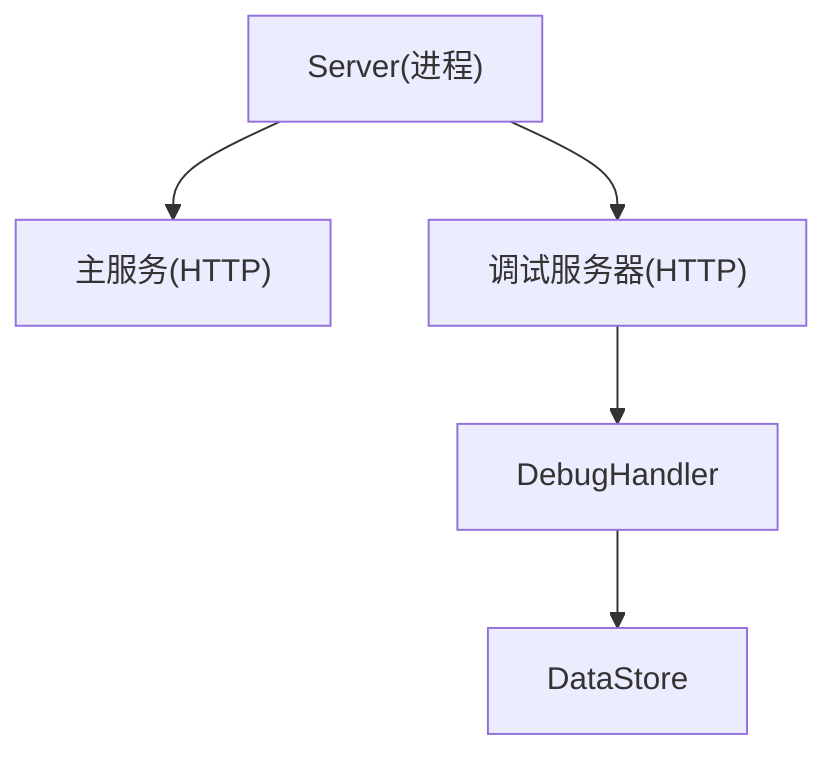
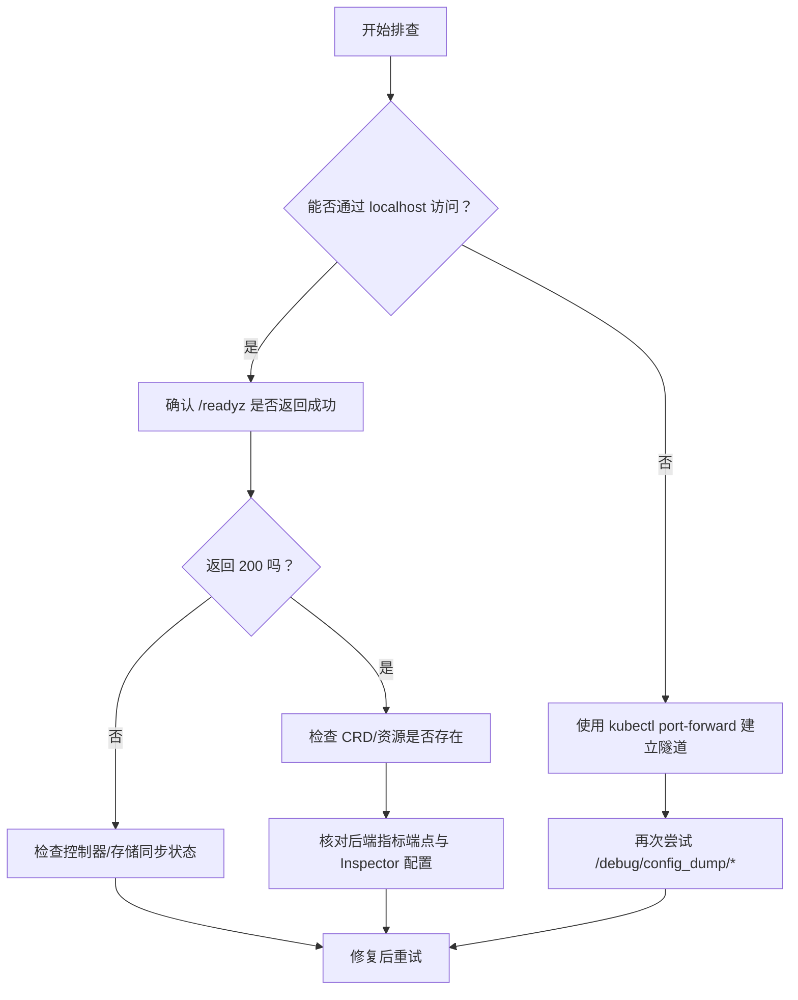

# 调试工具

<cite>
**本文引用的文件**
- [cmd/kthena-router/main.go](file://cmd/kthena-router/main.go)
- [cmd/kthena-router/app/server.go](file://cmd/kthena-router/app/server.go)
- [cmd/kthena-router/app/router.go](file://cmd/kthena-router/app/router.go)
- [pkg/kthena-router/debug/handlers.go](file://pkg/kthena-router/debug/handlers.go)
- [test/e2e/router/debug_test.go](file://test/e2e/router/debug_test.go)
- [pkg/kthena-router/metrics/metrics.go](file://pkg/kthena-router/metrics/metrics.go)
- [pkg/kthena-router/datastore/store.go](file://pkg/kthena-router/datastore/store.go)
</cite>

## 目录
1. [简介](#简介)
2. [项目结构](#项目结构)
3. [核心组件](#核心组件)
4. [架构总览](#架构总览)
5. [详细组件分析](#详细组件分析)
6. [依赖分析](#依赖分析)
7. [性能考虑](#性能考虑)
8. [故障排查指南](#故障排查指南)
9. [结论](#结论)
10. [附录](#附录)

## 简介
本指南面向运维与开发人员，系统性介绍 Kthena 路由器内置的调试工具与诊断能力。内容涵盖：
- 内置调试服务器：端口绑定、访问控制、端点清单与响应模型
- 健康检查与就绪检查：主服务与调试服务器的可用性判断
- 状态查询与配置导出：资源列表与详情接口
- 性能分析与指标：Prometheus 指标暴露与运行时指标采集
- 调试模式启用与配置项：命令行参数与环境变量
- 实时监控与排障流程：端到端诊断步骤与安全建议
- 生产环境调试的安全注意事项与最佳实践

## 项目结构
Kthena 路由器在进程内同时运行两条 HTTP 服务：
- 主服务：对外提供推理路由、健康检查、就绪检查与 Prometheus 指标
- 调试服务器：仅监听本地回环地址，提供配置导出与资源状态查询

图表来源
- [cmd/kthena-router/app/router.go:248-263](file://cmd/kthena-router/app/router.go#L248-L263)
- [cmd/kthena-router/app/router.go:107-156](file://cmd/kthena-router/app/router.go#L107-L156)
- [cmd/kthena-router/main.go:77-98](file://cmd/kthena-router/main.go#L77-L98)

章节来源
- [cmd/kthena-router/main.go:77-98](file://cmd/kthena-router/main.go#L77-L98)
- [cmd/kthena-router/app/server.go:28-56](file://cmd/kthena-router/app/server.go#L28-L56)
- [cmd/kthena-router/app/router.go:107-156](file://cmd/kthena-router/app/router.go#L107-L156)

## 核心组件
- 调试处理器（DebugHandler）
  - 提供资源列表与详情接口，返回结构化 JSON，便于自动化脚本与可视化工具消费
- 调试服务器（独立 HTTP 服务）
  - 仅绑定到 localhost，避免直接暴露于集群网络
  - 通过 kubectl port-forward 访问
- 主服务（路由与管理端点）
  - 对外提供 /healthz、/readyz、/metrics 以及推理路由 /v1
- 指标系统（Prometheus）
  - 暴露请求耗时、令牌数、队列等待、调度插件耗时等指标

章节来源
- [pkg/kthena-router/debug/handlers.go:33-43](file://pkg/kthena-router/debug/handlers.go#L33-L43)
- [cmd/kthena-router/app/router.go:107-156](file://cmd/kthena-router/app/router.go#L107-L156)
- [cmd/kthena-router/app/router.go:248-263](file://cmd/kthena-router/app/router.go#L248-L263)
- [pkg/kthena-router/metrics/metrics.go:236-447](file://pkg/kthena-router/metrics/metrics.go#L236-L447)

## 架构总览
调试服务器与主服务的交互与职责分离如下：

图表来源
- [cmd/kthena-router/app/router.go:107-156](file://cmd/kthena-router/app/router.go#L107-L156)
- [pkg/kthena-router/debug/handlers.go:117-262](file://pkg/kthena-router/debug/handlers.go#L117-L262)
- [pkg/kthena-router/datastore/store.go:162-200](file://pkg/kthena-router/datastore/store.go#L162-L200)

## 详细组件分析

### 调试服务器与端点
- 绑定策略
  - 地址固定为 localhost:debugPort，不对外网开放
- 端点分组
  - 列表接口：列举各类资源
  - 详情接口：按命名空间与名称获取单个资源
- 访问方式
  - 通过 kubectl port-forward 将 Pod 的 15000 映射到本地端口后访问

图表来源
- [cmd/kthena-router/app/router.go:114-132](file://cmd/kthena-router/app/router.go#L114-L132)
- [pkg/kthena-router/debug/handlers.go:117-262](file://pkg/kthena-router/debug/handlers.go#L117-L262)

章节来源
- [cmd/kthena-router/app/router.go:107-156](file://cmd/kthena-router/app/router.go#L107-L156)
- [pkg/kthena-router/debug/handlers.go:117-262](file://pkg/kthena-router/debug/handlers.go#L117-L262)

### 调试处理器（DebugHandler）
- 资源模型
  - ModelRouteResponse、ModelServerResponse、PodResponse、GatewayResponse、HTTPRouteResponse、InferencePoolResponse
- 数据来源
  - 从 DataStore 获取缓存的资源状态与 Pod 运行时指标
- 处理逻辑
  - 列表接口遍历 DataStore 中的资源集合
  - 详情接口根据命名空间与名称定位资源，并补充关联 Pod 信息（如适用）

图表来源
- [pkg/kthena-router/debug/handlers.go:33-43](file://pkg/kthena-router/debug/handlers.go#L33-L43)
- [pkg/kthena-router/debug/handlers.go:117-262](file://pkg/kthena-router/debug/handlers.go#L117-L262)
- [pkg/kthena-router/datastore/store.go:162-200](file://pkg/kthena-router/datastore/store.go#L162-L200)

章节来源
- [pkg/kthena-router/debug/handlers.go:45-114](file://pkg/kthena-router/debug/handlers.go#L45-L114)
- [pkg/kthena-router/debug/handlers.go:117-262](file://pkg/kthena-router/debug/handlers.go#L117-L262)
- [pkg/kthena-router/datastore/store.go:162-200](file://pkg/kthena-router/datastore/store.go#L162-L200)

### 健康检查与就绪检查
- 主服务端点
  - /healthz：返回服务健康状态
  - /readyz：返回控制器与存储是否已同步
  - /metrics：Prometheus 指标
- 调试服务器端点
  - 仅提供配置导出，不包含 /healthz 或 /readyz

图表来源
- [cmd/kthena-router/app/router.go:248-263](file://cmd/kthena-router/app/router.go#L248-L263)
- [cmd/kthena-router/app/router.go:158-174](file://cmd/kthena-router/app/router.go#L158-L174)

章节来源
- [cmd/kthena-router/app/router.go:248-263](file://cmd/kthena-router/app/router.go#L248-L263)
- [cmd/kthena-router/app/router.go:158-174](file://cmd/kthena-router/app/router.go#L158-L174)

### 性能分析与指标
- 指标暴露
  - /metrics 使用 Prometheus Handler 暴露
- 关键指标类别
  - 请求耗时分布（解码阶段、TTFT、TPOT）
  - 令牌统计（输入/输出）
  - 公平调度队列等待时间
  - 调度插件执行耗时
  - 活跃上游/下游请求数
- Pod 运行时指标
  - GPU 缓存命中率、等待/运行中请求数、TPOT、TTFT
  - 通过 DataStore 定期更新并注入到响应中

图表来源
- [pkg/kthena-router/metrics/metrics.go:236-447](file://pkg/kthena-router/metrics/metrics.go#L236-L447)
- [pkg/kthena-router/datastore/store.go:1168-1182](file://pkg/kthena-router/datastore/store.go#L1168-L1182)

章节来源
- [pkg/kthena-router/metrics/metrics.go:236-447](file://pkg/kthena-router/metrics/metrics.go#L236-L447)
- [pkg/kthena-router/datastore/store.go:1168-1182](file://pkg/kthena-router/datastore/store.go#L1168-L1182)

## 依赖分析
- 调试服务器对主服务的依赖
  - 仅依赖 DataStore 提供的只读状态
  - 不依赖主路由逻辑，避免调试对线上流量的影响
- 端口与网络边界
  - 调试服务器仅监听 localhost，防止外部访问
  - 通过 kubectl port-forward 在受控通道内访问

图表来源
- [cmd/kthena-router/app/server.go:28-56](file://cmd/kthena-router/app/server.go#L28-L56)
- [cmd/kthena-router/app/router.go:107-156](file://cmd/kthena-router/app/router.go#L107-L156)
- [pkg/kthena-router/debug/handlers.go:33-43](file://pkg/kthena-router/debug/handlers.go#L33-L43)

章节来源
- [cmd/kthena-router/app/server.go:28-56](file://cmd/kthena-router/app/server.go#L28-L56)
- [cmd/kthena-router/app/router.go:107-156](file://cmd/kthena-router/app/router.go#L107-L156)

## 性能考虑
- 调试服务器独立线程
  - 与主服务互不影响，避免调试查询阻塞线上请求
- 仅本地绑定
  - 防止外部网络抖动影响调试查询
- 指标粒度
  - 按模型、路径、插件类型细分，便于快速定位热点
- 运行时指标更新
  - DataStore 周期性拉取后端指标，减少频繁远端调用

## 故障排查指南
- 无法访问调试端点
  - 确认未直接使用 Pod IP 访问，调试服务器仅监听 localhost
  - 使用 kubectl port-forward 将 Pod:15000 映射到本地端口后再访问
- 端口冲突或无效端口
  - 检查 --debug-port 参数范围（1–65535），默认 15000
- 资源为空或字段缺失
  - 确认 DataStore 已完成初始化与同步（/readyz）
  - 检查相关 CRD 是否存在且被控制器正确处理
- 指标缺失
  - 确认后端引擎已暴露指标端点
  - 检查 DataStore 的 Pod 运行时 Inspector 是否正常工作

章节来源
- [test/e2e/router/debug_test.go:32-107](file://test/e2e/router/debug_test.go#L32-L107)
- [cmd/kthena-router/main.go:77-98](file://cmd/kthena-router/main.go#L77-L98)
- [cmd/kthena-router/app/router.go:248-263](file://cmd/kthena-router/app/router.go#L248-L263)

## 结论
Kthena 路由器的调试工具以“本地隔离 + 受控通道”为核心设计，既满足日常诊断与自动化验证需求，又避免对线上服务产生干扰。结合 /metrics 与调试端点，可实现从资源状态到运行时性能的全链路可观测。

## 附录

### 调试端点一览（调试服务器）
- 列表接口
  - GET /debug/config_dump/modelroutes
  - GET /debug/config_dump/modelservers
  - GET /debug/config_dump/pods
  - GET /debug/config_dump/gateways
  - GET /debug/config_dump/httproutes
  - GET /debug/config_dump/inferencepools
- 详情接口
  - GET /debug/config_dump/namespaces/:namespace/modelroutes/:name
  - GET /debug/config_dump/namespaces/:namespace/modelservers/:name
  - GET /debug/config_dump/namespaces/:namespace/pods/:name
  - GET /debug/config_dump/namespaces/:namespace/gateways/:name
  - GET /debug/config_dump/namespaces/:namespace/httproutes/:name
  - GET /debug/config_dump/namespaces/:namespace/inferencepools/:name

章节来源
- [cmd/kthena-router/app/router.go:114-132](file://cmd/kthena-router/app/router.go#L114-L132)
- [pkg/kthena-router/debug/handlers.go:117-262](file://pkg/kthena-router/debug/handlers.go#L117-L262)

### 主服务端点（参考）
- /healthz：健康检查
- /readyz：就绪检查
- /metrics：Prometheus 指标
- /v1：推理路由入口

章节来源
- [cmd/kthena-router/app/router.go:248-263](file://cmd/kthena-router/app/router.go#L248-L263)

### 调试模式启用与配置
- 启用方式
  - 默认启动，无需额外开关
- 关键参数
  - --debug-port：调试服务器端口（默认 15000）
  - --port：主服务端口（默认 8080）
  - --enable-webhook、--webhook-port、--webhook-tls-*、--cert-secret-name、--webhook-service-name：Webhook 相关
  - --enable-gateway-api、--enable-gateway-api-inference-extension：Gateway API 功能
  - --kube-api-qps、--kube-api-burst：Kubernetes API 速率限制

章节来源
- [cmd/kthena-router/main.go:67-98](file://cmd/kthena-router/main.go#L67-L98)

### 生产环境调试安全建议
- 仅通过 kubectl port-forward 访问调试端点，不在 Service/Ingress 中暴露
- 限制调试端口的访问权限，仅允许受信账号或 CI 账号
- 定期轮换证书与密钥，确保 webhook 与 TLS 配置安全
- 在审计日志中记录调试访问行为，便于追踪
- 严格控制调试服务器的可见性，避免误放行至公网