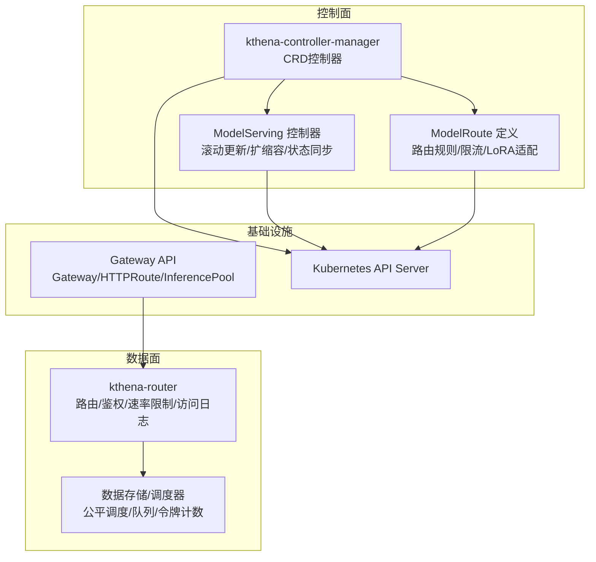
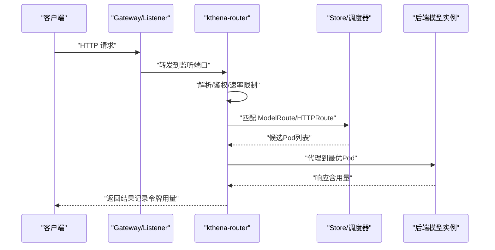
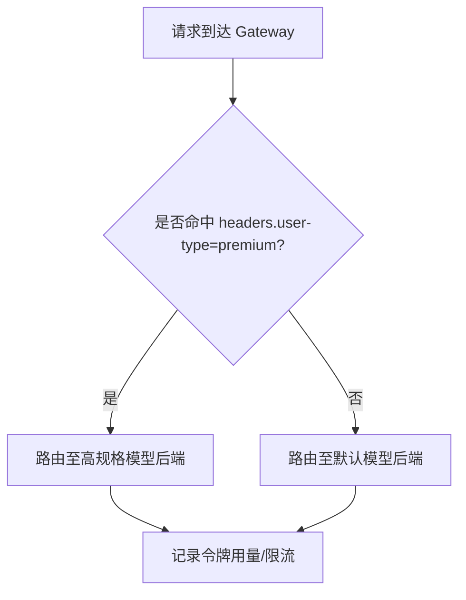
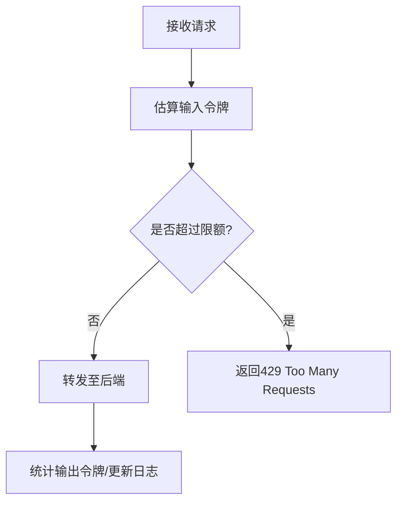
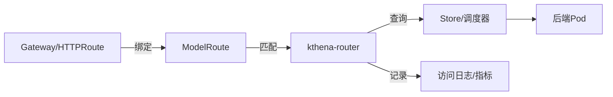

# 场景化解决方案

<cite>
**本文引用的文件**
- [README.md](file://README.md)
- [cmd/kthena-router/main.go](file://cmd/kthena-router/main.go)
- [pkg/kthena-router/router/router.go](file://pkg/kthena-router/router/router.go)
- [pkg/apis/networking/v1alpha1/modelroute_types.go](file://pkg/apis/networking/v1alpha1/modelroute_types.go)
- [pkg/apis/workload/v1alpha1/model_serving_types.go](file://pkg/apis/workload/v1alpha1/model_serving_types.go)
- [pkg/kthena-router/scheduler/scheduler.go](file://pkg/kthena-router/scheduler/scheduler.go)
- [pkg/model-serving-controller/controller/model_serving_controller.go](file://pkg/model-serving-controller/controller/model_serving_controller.go)
- [docs/kthena/docs/user-guide/rate-limit.md](file://docs/kthena/docs/user-guide/rate-limit.md)
- [docs/kthena/docs/user-guide/gateway-api-support.md](file://docs/kthena/docs/user-guide/gateway-api-support.md)
- [docs/kthena/docs/user-guide/lws-integration.md](file://docs/kthena/docs/user-guide/lws-integration.md)
- [examples/kthena-router/ModelRouteMultiModels.yaml](file://examples/kthena-router/ModelRouteMultiModels.yaml)
- [examples/kthena-router/ModelRouteLora.yaml](file://examples/kthena-router/ModelRouteLora.yaml)
- [examples/kthena-router/ModelRouteWithRateLimit.yaml](file://examples/kthena-router/ModelRouteWithRateLimit.yaml)
- [examples/kthena-router/Gateway.yaml](file://examples/kthena-router/Gateway.yaml)
- [charts/kthena/values.yaml](file://charts/kthena/values.yaml)
</cite>

## 目录
1. [简介](#简介)
2. [项目结构](#项目结构)
3. [核心组件](#核心组件)
4. [架构总览](#架构总览)
5. [详细场景分析](#详细场景分析)
6. [依赖关系分析](#依赖关系分析)
7. [性能与成本优化](#性能与成本优化)
8. [故障排查指南](#故障排查指南)
9. [结论](#结论)
10. [附录](#附录)

## 简介
本方案面向不同业务场景，基于 Kthena 的 Kubernetes 原生推理平台能力，提供多模型管理、动态 LoRA 管理、流量控制、网关集成等场景化落地指南。内容覆盖需求特征、实现方案、配置示例、部署策略、成本优化、性能调优、安全配置、迁移与升级路径，帮助团队在不同规模与发展阶段高效构建企业级 LLM 推理服务。

## 项目结构
Kthena 采用“控制面 + 数据面”的分层架构：控制面由 kthena-controller-manager 驱动 CRD 生命周期与调度策略；数据面由 kthena-router 承载请求路由、负载均衡、限流与可观测性。通过 Gateway API、ModelRoute、ModelServer、ModelServing 等 CRD 实现声明式模型生命周期与路由编排。

图示来源
- [cmd/kthena-router/main.go:40-122](file://cmd/kthena-router/main.go#L40-L122)
- [pkg/kthena-router/router/router.go:91-169](file://pkg/kthena-router/router/router.go#L91-L169)
- [docs/kthena/docs/user-guide/gateway-api-support.md:61-71](file://docs/kthena/docs/user-guide/gateway-api-support.md#L61-L71)

章节来源
- [README.md:24-66](file://README.md#L24-L66)
- [charts/kthena/values.yaml:1-97](file://charts/kthena/values.yaml#L1-L97)

## 核心组件
- 控制面组件
  - kthena-controller-manager：负责 CRD 的验证/变更、工作负载编排、插件框架、自动伸缩策略绑定等。
  - ModelServing 控制器：管理 ServingGroup/Role 的创建、滚动更新、回滚、状态同步与 Gang 调度。
- 数据面组件
  - kthena-router：统一入口，支持 Gateway API、HTTPRoute、InferencePool、ModelRoute 绑定，内置鉴权、速率限制（本地/全局）、访问日志、令牌统计与公平调度。
- 关键 CRD
  - ModelRoute：定义模型名或 LoRA 适配器匹配规则、目标后端、速率限制策略。
  - ModelServer：描述后端模型服务端口、模型名映射、PD 分离等。
  - ModelServing：声明式模型服务编排，支持滚动更新、恢复策略、插件扩展。

章节来源
- [pkg/apis/networking/v1alpha1/modelroute_types.go:24-194](file://pkg/apis/networking/v1alpha1/modelroute_types.go#L24-L194)
- [pkg/apis/workload/v1alpha1/model_serving_types.go:35-262](file://pkg/apis/workload/v1alpha1/model_serving_types.go#L35-L262)
- [pkg/kthena-router/router/router.go:73-169](file://pkg/kthena-router/router/router.go#L73-L169)

## 架构总览
Kthena 将“模型生命周期”与“请求路由”解耦：控制面通过 CRD 自动化模型部署与扩缩容；数据面通过路由层完成请求分类、负载均衡、速率限制与可观测性输出。Gateway API 提供多入口隔离与模型名冲突规避，结合 ModelRoute 实现灵活的路由与流量治理。

图示来源
- [docs/kthena/docs/user-guide/gateway-api-support.md:61-71](file://docs/kthena/docs/user-guide/gateway-api-support.md#L61-L71)
- [pkg/kthena-router/router/router.go:204-315](file://pkg/kthena-router/router/router.go#L204-L315)

## 详细场景分析

### 场景一：多模型管理与路由
- 需求特点
  - 同一业务线存在多个模型版本或不同模型，需要按用户类型/请求头进行分流。
  - 需要避免全局模型名冲突，确保路由隔离。
- 实现方案
  - 使用 Gateway API 的 parentRefs 将不同 ModelRoute 绑定到不同 Gateway，即使 modelName 相同也不会冲突。
  - 在 ModelRoute 中通过 headers 匹配实现“付费用户走高规格模型，普通用户走低成本模型”。
- 配置示例
  - 多模型路由示例：[ModelRouteMultiModels.yaml:1-19](file://examples/kthena-router/ModelRouteMultiModels.yaml#L1-L19)
  - Gateway 示例：[Gateway.yaml:1-12](file://examples/kthena-router/Gateway.yaml#L1-L12)
- 最佳实践
  - 为不同环境/租户划分独立 Gateway，便于资源隔离与审计。
  - 使用权重分配与规则优先级控制流量比例与回滚策略。

图示来源
- [examples/kthena-router/ModelRouteMultiModels.yaml:7-19](file://examples/kthena-router/ModelRouteMultiModels.yaml#L7-L19)
- [docs/kthena/docs/user-guide/gateway-api-support.md:144-153](file://docs/kthena/docs/user-guide/gateway-api-support.md#L144-L153)

章节来源
- [docs/kthena/docs/user-guide/gateway-api-support.md:14-50](file://docs/kthena/docs/user-guide/gateway-api-support.md#L14-L50)
- [examples/kthena-router/ModelRouteMultiModels.yaml:1-19](file://examples/kthena-router/ModelRouteMultiModels.yaml#L1-L19)
- [examples/kthena-router/Gateway.yaml:1-12](file://examples/kthena-router/Gateway.yaml#L1-L12)

### 场景二：动态 LoRA 管理
- 需求特点
  - 需要对同一基座模型热切换不同 LoRA 适配器，且不中断服务。
  - 路由需能识别 LoRA 名称并指向对应后端。
- 实现方案
  - 在 ModelRoute.spec.loraAdapters 列表中声明可接受的 LoRA 名称，规则直接指向具体 ModelServer。
  - kthena-router 在匹配时区分 LoRA 与基座模型，确保请求被正确路由。
- 配置示例
  - LoRA 路由示例：[ModelRouteLora.yaml:1-14](file://examples/kthena-router/ModelRouteLora.yaml#L1-L14)
- 最佳实践
  - 为不同 LoRA 建立独立的 ModelServer，便于资源隔离与弹性扩缩。
  - 结合速率限制与访问日志，监控各 LoRA 的使用量与延迟。

章节来源
- [pkg/apis/networking/v1alpha1/modelroute_types.go:24-56](file://pkg/apis/networking/v1alpha1/modelroute_types.go#L24-L56)
- [examples/kthena-router/ModelRouteLora.yaml:1-14](file://examples/kthena-router/ModelRouteLora.yaml#L1-L14)

### 场景三：流量控制与成本优化
- 需求特点
  - 需要以“令牌”为单位进行限流，避免突发请求导致资源浪费与成本飙升。
  - 支持本地限流与全局限流（Redis），满足单实例保护与跨实例一致性。
- 实现方案
  - 在 ModelRoute.spec.rateLimit 中配置输入/输出令牌上限与时间窗口。
  - 全局限流通过 Redis 配置实现跨实例共享计数。
- 配置示例
  - 本地/全局限流示例：[ModelRouteWithRateLimit.yaml:1-18](file://examples/kthena-router/ModelRouteWithRateLimit.yaml#L1-L18)
  - 速率限制文档：[rate-limit.md:1-167](file://docs/kthena/docs/user-guide/rate-limit.md#L1-L167)
- 最佳实践
  - 对高价值模型设置更严格的全局限流，对测试/灰度流量使用本地限流。
  - 结合令牌估算与历史用量，动态调整限额与时间窗口。

图示来源
- [docs/kthena/docs/user-guide/rate-limit.md:31-94](file://docs/kthena/docs/user-guide/rate-limit.md#L31-L94)
- [pkg/kthena-router/router/router.go:266-292](file://pkg/kthena-router/router/router.go#L266-L292)

章节来源
- [docs/kthena/docs/user-guide/rate-limit.md:1-167](file://docs/kthena/docs/user-guide/rate-limit.md#L1-L167)
- [examples/kthena-router/ModelRouteWithRateLimit.yaml:1-18](file://examples/kthena-router/ModelRouteWithRateLimit.yaml#L1-L18)

### 场景四：网关集成与多入口隔离
- 需求特点
  - 不同业务线/租户需要独立入口，避免 modelName 冲突与路由串扰。
  - 需要支持 HTTPRoute 与 InferencePool 的组合，实现路径重写与后端池化。
- 实现方案
  - 启用 Gateway API 支持，创建多个 Gateway 并绑定到不同 ModelRoute。
  - 通过 HTTPRoute 的 URL 重写与后端引用 InferencePool，实现灵活的路径与端口策略。
- 配置示例
  - Gateway API 支持文档：[gateway-api-support.md:1-358](file://docs/kthena/docs/user-guide/gateway-api-support.md#L1-L358)
  - Gateway 示例：[Gateway.yaml:1-12](file://examples/kthena-router/Gateway.yaml#L1-L12)
- 最佳实践
  - 默认 Gateway 用于常规流量，新增 Gateway 用于灰度/租户隔离。
  - 为每个 Gateway 暴露独立 Service 端口，并在 Service 上显式开放对应端口。

章节来源
- [docs/kthena/docs/user-guide/gateway-api-support.md:72-103](file://docs/kthena/docs/user-guide/gateway-api-support.md#L72-L103)
- [examples/kthena-router/Gateway.yaml:1-12](file://examples/kthena-router/Gateway.yaml#L1-L12)

### 场景五：多节点推理与 PD 分离
- 需求特点
  - 大模型需要预填（prefill）与解码（decode）分离，提升吞吐与延迟表现。
  - 需要网络拓扑感知调度，降低跨域通信开销。
- 实现方案
  - 使用 ModelServing 描述多角色（Entry/Worker）与多节点部署，结合 Gang 调度保证原子性。
  - 通过 PDGroup 与 KV 连接器实现前处理与生成阶段的协同。
- 配置示例
  - 多节点/预填-解码分离示例：[prefill-decode-disaggregation.yaml](file://examples/model-serving/prefill-decode-disaggregation.yaml)
  - 网络拓扑与调度文档：[network-topology.md](file://docs/kthena/docs/user-guide/network-topology.md)
- 最佳实践
  - 将 Entry/Worker 放在同一网络域内，减少跨域带宽争用。
  - 为不同规模模型设置差异化副本与资源配额，避免资源碎片化。

章节来源
- [pkg/apis/workload/v1alpha1/model_serving_types.go:35-182](file://pkg/apis/workload/v1alpha1/model_serving_types.go#L35-L182)
- [docs/kthena/docs/user-guide/network-topology.md](file://docs/kthena/docs/user-guide/network-topology.md)

### 场景六：LeaderWorkerSet（LWS）集成
- 需求特点
  - 已有 LWS 资源清单，希望无缝迁移到 Kthena，获得统一的路由、限流与可观测能力。
- 实现方案
  - Kthena ModelServing 控制器直接监听 LWS，进行一次性转换并维护状态同步。
- 配置示例
  - LWS 集成文档：[lws-integration.md:1-192](file://docs/kthena/docs/user-guide/lws-integration.md#L1-L192)
- 最佳实践
  - 保持 LWS 清单不变，通过 Kthena 的滚动更新与恢复策略保障升级过程无感。

章节来源
- [docs/kthena/docs/user-guide/lws-integration.md:18-27](file://docs/kthena/docs/user-guide/lws-integration.md#L18-L27)

## 依赖关系分析
- 控制面与数据面
  - 控制面通过 CRD 驱动后端模型实例的创建与更新；数据面通过 Store 与调度器选择最优 Pod。
- 路由与网关
  - ModelRoute 与 Gateway API 绑定，实现多入口隔离；HTTPRoute 与 InferencePool 支持路径重写与后端池化。
- 速率限制与令牌统计
  - kthena-router 在请求处理过程中实时统计令牌用量，驱动速率限制与访问日志。

图示来源
- [pkg/kthena-router/router/router.go:317-464](file://pkg/kthena-router/router/router.go#L317-L464)
- [docs/kthena/docs/user-guide/gateway-api-support.md:61-71](file://docs/kthena/docs/user-guide/gateway-api-support.md#L61-L71)

章节来源
- [pkg/kthena-router/router/router.go:73-169](file://pkg/kthena-router/router/router.go#L73-L169)
- [pkg/kthena-router/scheduler/scheduler.go:25-28](file://pkg/kthena-router/scheduler/scheduler.go#L25-L28)

## 性能与成本优化
- 调度与资源
  - 使用 Gang 调度与网络拓扑感知，减少跨域通信与资源争用。
  - 通过 PD 分离与 KV 连接器，平衡预填与解码阶段的计算与带宽占用。
- 限流与成本
  - 以令牌为粒度的限流，避免“轻量请求但高算力消耗”的误判。
  - 全局限流配合 Redis，确保跨实例一致的成本边界。
- 可观测性
  - 访问日志与指标埋点覆盖请求/响应、令牌用量、排队与上游并发，支撑容量规划与成本归因。

章节来源
- [docs/kthena/docs/user-guide/rate-limit.md:3-13](file://docs/kthena/docs/user-guide/rate-limit.md#L3-L13)
- [pkg/kthena-router/router/router.go:222-239](file://pkg/kthena-router/router/router.go#L222-L239)

## 故障排查指南
- 路由未生效
  - 检查 Gateway API 是否启用、ModelRoute 是否绑定到正确的 Gateway、parentRefs 是否填写。
  - 参考：[gateway-api-support.md:72-143](file://docs/kthena/docs/user-guide/gateway-api-support.md#L72-L143)
- 限流异常
  - 确认 ModelRoute.rateLimit 配置正确，全局限流需检查 Redis 地址可达性。
  - 参考：[rate-limit.md:95-167](file://docs/kthena/docs/user-guide/rate-limit.md#L95-L167)
- 后端无响应
  - 核验 ModelServer 与 Pod 状态，确认 Store 能发现可用 Pod。
  - 参考：[model_serving_types.go:35-182](file://pkg/apis/workload/v1alpha1/model_serving_types.go#L35-L182)
- 日志与指标
  - 开启访问日志与指标导出，定位请求耗时与错误原因。
  - 参考：[router.go:125-154](file://pkg/kthena-router/router/router.go#L125-L154)

章节来源
- [docs/kthena/docs/user-guide/gateway-api-support.md:72-143](file://docs/kthena/docs/user-guide/gateway-api-support.md#L72-L143)
- [docs/kthena/docs/user-guide/rate-limit.md:95-167](file://docs/kthena/docs/user-guide/rate-limit.md#L95-L167)
- [pkg/apis/workload/v1alpha1/model_serving_types.go:35-182](file://pkg/apis/workload/v1alpha1/model_serving_types.go#L35-L182)
- [pkg/kthena-router/router/router.go:125-154](file://pkg/kthena-router/router/router.go#L125-L154)

## 结论
Kthena 通过“控制面 + 数据面”的分层设计，将模型生命周期与请求路由解耦，结合 Gateway API、ModelRoute、ModelServer、ModelServing 等能力，为企业提供可演进、可治理、可成本优化的 LLM 推理平台。针对多模型、动态 LoRA、流量控制与网关集成等场景，建议以 Gateway API 实现路由隔离，以令牌限流实现成本可控，以 PD 分离与拓扑感知提升性能，并通过 LWS 集成与滚动更新保障平滑迁移与升级。

## 附录
- 部署与配置
  - Helm Chart 默认值参考：[values.yaml:1-97](file://charts/kthena/values.yaml#L1-L97)
  - 控制面与数据面启动参数参考：[main.go:67-81](file://cmd/kthena-router/main.go#L67-L81)
- 示例清单
  - 多模型路由：[ModelRouteMultiModels.yaml:1-19](file://examples/kthena-router/ModelRouteMultiModels.yaml#L1-L19)
  - LoRA 路由：[ModelRouteLora.yaml:1-14](file://examples/kthena-router/ModelRouteLora.yaml#L1-L14)
  - 速率限制：[ModelRouteWithRateLimit.yaml:1-18](file://examples/kthena-router/ModelRouteWithRateLimit.yaml#L1-L18)
  - Gateway：[Gateway.yaml:1-12](file://examples/kthena-router/Gateway.yaml#L1-L12)