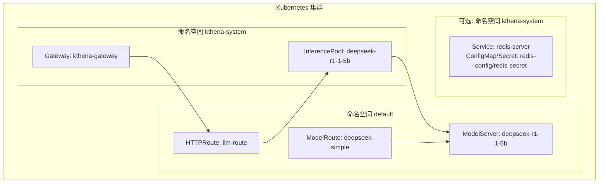
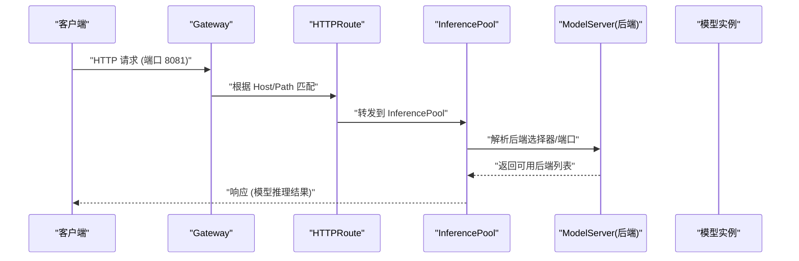
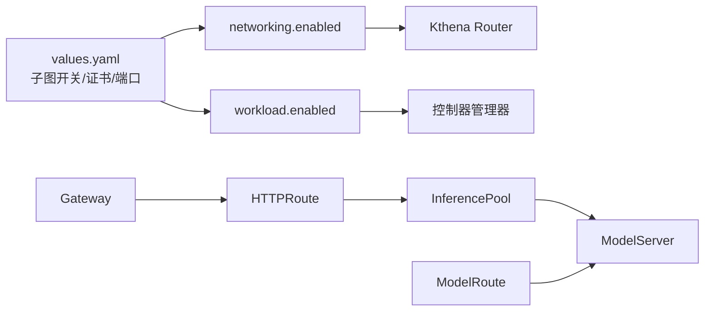

# 基础部署示例

<cite>
**本文引用的文件**
- [charts/kthena/values.yaml](file://charts/kthena/values.yaml)
- [charts/kthena/README.md](file://charts/kthena/README.md)
- [examples/kthena-router/ModelRouteSimple.yaml](file://examples/kthena-router/ModelRouteSimple.yaml)
- [examples/kthena-router/ModelServer-ds1.5b.yaml](file://examples/kthena-router/ModelServer-ds1.5b.yaml)
- [examples/kthena-router/Gateway.yaml](file://examples/kthena-router/Gateway.yaml)
- [examples/kthena-router/HTTPRoute.yaml](file://examples/kthena-router/HTTPRoute.yaml)
- [examples/kthena-router/InferencePool.yaml](file://examples/kthena-router/InferencePool.yaml)
- [examples/redis/redis-standalone.yaml](file://examples/redis/redis-standalone.yaml)
</cite>

## 目录
1. [简介](#简介)
2. [项目结构](#项目结构)
3. [核心组件](#核心组件)
4. [架构总览](#架构总览)
5. [详细组件分析](#详细组件分析)
6. [依赖关系分析](#依赖关系分析)
7. [性能与可用性建议](#性能与可用性建议)
8. [故障排查指南](#故障排查指南)
9. [结论](#结论)
10. [附录：完整部署步骤与模板](#附录完整部署步骤与模板)

## 简介
本示例面向初学者，演示如何使用 Kthena 在 Kubernetes 上完成“单模型服务”的最小化部署，包括：
- 单模型路由与后端模型服务器
- 基础网关与 HTTP 路由
- 可选的 Redis 缓存（如需 KV 缓存或评分插件）
- 完整的部署步骤、验证方法与常见问题排查

目标是帮助你快速理解 Kthena 的工作原理与关键配置项，并提供可直接使用的模板与脚本路径。

## 项目结构
Kthena 提供了 Helm Chart 与丰富的示例清单，用于一键安装控制器与路由器，以及演示不同路由策略的示例资源。基础部署所需的最小集合如下：
- 控制器与路由器：通过 Helm Chart 安装（子图 networking 与 workload）
- 网关与路由：Gateway 与 HTTPRoute
- 模型路由与模型服务器：ModelRoute 与 ModelServer
- 推理池：InferencePool（作为 HTTPRoute 的后端引用）
- Redis（如需 KV 缓存或评分插件）

图表来源
- [examples/kthena-router/Gateway.yaml:1-12](file://examples/kthena-router/Gateway.yaml#L1-L12)
- [examples/kthena-router/HTTPRoute.yaml:1-20](file://examples/kthena-router/HTTPRoute.yaml#L1-L20)
- [examples/kthena-router/InferencePool.yaml:1-17](file://examples/kthena-router/InferencePool.yaml#L1-L17)
- [examples/kthena-router/ModelServer-ds1.5b.yaml:1-16](file://examples/kthena-router/ModelServer-ds1.5b.yaml#L1-L16)
- [examples/kthena-router/ModelRouteSimple.yaml:1-12](file://examples/kthena-router/ModelRouteSimple.yaml#L1-L12)
- [examples/redis/redis-standalone.yaml:1-98](file://examples/redis/redis-standalone.yaml#L1-L98)

章节来源
- [charts/kthena/README.md:1-255](file://charts/kthena/README.md#L1-L255)

## 核心组件
- 控制器与路由器（Helm Chart）
  - 子图 networking.enabled: true，启用 Kthena Router
  - 子图 workload.enabled: true，启用控制器管理器
  - 全局证书管理模式：支持 auto、cert-manager、manual
- 网关与路由
  - Gateway 定义监听端口与网关类
  - HTTPRoute 将请求转发到 InferencePool
- 模型路由与模型服务器
  - ModelRoute 将模型名称映射到一个或多个 ModelServer
  - ModelServer 描述后端工作负载选择器、推理引擎、超时等
- 推理池
  - InferencePool 作为 HTTPRoute 的后端引用对象
- Redis（可选）
  - 通过 ConfigMap/Secret 提供连接信息；当使用 KV 缓存或评分插件时需要

章节来源
- [charts/kthena/values.yaml:1-97](file://charts/kthena/values.yaml#L1-L97)
- [charts/kthena/README.md:165-255](file://charts/kthena/README.md#L165-L255)
- [examples/kthena-router/Gateway.yaml:1-12](file://examples/kthena-router/Gateway.yaml#L1-L12)
- [examples/kthena-router/HTTPRoute.yaml:1-20](file://examples/kthena-router/HTTPRoute.yaml#L1-L20)
- [examples/kthena-router/InferencePool.yaml:1-17](file://examples/kthena-router/InferencePool.yaml#L1-L17)
- [examples/kthena-router/ModelServer-ds1.5b.yaml:1-16](file://examples/kthena-router/ModelServer-ds1.5b.yaml#L1-L16)
- [examples/kthena-router/ModelRouteSimple.yaml:1-12](file://examples/kthena-router/ModelRouteSimple.yaml#L1-L12)
- [examples/redis/redis-standalone.yaml:1-98](file://examples/redis/redis-standalone.yaml#L1-L98)

## 架构总览
下图展示了从客户端到模型后端的请求路径，以及关键控制平面组件之间的关系。

图表来源
- [examples/kthena-router/Gateway.yaml:1-12](file://examples/kthena-router/Gateway.yaml#L1-L12)
- [examples/kthena-router/HTTPRoute.yaml:1-20](file://examples/kthena-router/HTTPRoute.yaml#L1-L20)
- [examples/kthena-router/InferencePool.yaml:1-17](file://examples/kthena-router/InferencePool.yaml#L1-L17)
- [examples/kthena-router/ModelServer-ds1.5b.yaml:1-16](file://examples/kthena-router/ModelServer-ds1.5b.yaml#L1-L16)

## 详细组件分析

### 组件一：Helm Chart 与全局配置
- 子图开关
  - workload.enabled: true/false 控制是否安装工作负载控制器
  - networking.enabled: true/false 控制是否安装网络相关组件（含 Kthena Router）
- Kthena Router 配置
  - port: 8080（容器端口）
  - debugPort: 15000（本地调试端口）
  - tls.enabled: false（默认不启用 TLS）
  - webhook: 8443 容器端口，443 服务端口
- 全局证书管理
  - certManagementMode: auto/cert-manager/manual
  - manual 模式需提供 base64 编码的 CA Bundle

章节来源
- [charts/kthena/values.yaml:1-97](file://charts/kthena/values.yaml#L1-L97)
- [charts/kthena/README.md:165-213](file://charts/kthena/README.md#L165-L213)

### 组件二：Gateway（网关）
- 关键字段
  - gatewayClassName: 使用 Kthena Router 的网关类
  - listeners: 定义 HTTP 监听端口与协议
- 建议
  - 将 Gateway 放在独立命名空间（如 kthena-system），便于集中管理

章节来源
- [examples/kthena-router/Gateway.yaml:1-12](file://examples/kthena-router/Gateway.yaml#L1-L12)

### 组件三：HTTPRoute（路由规则）
- 关键字段
  - parentRefs: 绑定到 Gateway
  - rules.backendRefs: 引用 InferencePool
  - rules.matches: 路径前缀匹配（例如 /）
- 建议
  - 与 Gateway 的监听端口保持一致，确保流量进入

章节来源
- [examples/kthena-router/HTTPRoute.yaml:1-20](file://examples/kthena-router/HTTPRoute.yaml#L1-L20)

### 组件四：InferencePool（推理池）
- 关键字段
  - targetPorts: 指定后端服务端口（如 8000）
  - selector.matchLabels: 与后端工作负载标签匹配
  - endpointPickerRef: 仅用于 API 校验占位
- 建议
  - 与 ModelServer 的 workloadPort 保持一致

章节来源
- [examples/kthena-router/InferencePool.yaml:1-17](file://examples/kthena-router/InferencePool.yaml#L1-L17)

### 组件五：ModelServer（模型服务器）
- 关键字段
  - workloadSelector.matchLabels: 与后端 Deployment/Pod 标签一致
  - workloadPort.port: 后端服务端口（如 8000）
  - model: 模型名称（用于展示或日志）
  - inferenceEngine: 推理引擎类型（如 vLLM）
  - trafficPolicy.timeout: 请求超时时间
- 建议
  - 确保后端工作负载暴露的端口与 InferencePool/targetPorts 一致

章节来源
- [examples/kthena-router/ModelServer-ds1.5b.yaml:1-16](file://examples/kthena-router/ModelServer-ds1.5b.yaml#L1-L16)

### 组件六：ModelRoute（模型路由）
- 关键字段
  - modelName: 路由所面向的模型名称
  - rules[].targetModels[].modelServerName: 指向具体 ModelServer
- 建议
  - 最小化配置仅包含一条默认规则，指向一个 ModelServer

章节来源
- [examples/kthena-router/ModelRouteSimple.yaml:1-12](file://examples/kthena-router/ModelRouteSimple.yaml#L1-L12)

### 组件七：Redis（可选）
- 作用
  - 当使用 KV 缓存或评分插件时，需要 Redis
- 结构
  - Service: redis-server（ClusterIP + 6379）
  - ConfigMap: redis-config（REDIS_HOST/REDIS_PORT）
  - Secret: redis-secret（password 字段）
- 建议
  - 部署在与 Kthena 相同命名空间（如 kthena-system），并确保 Service 名称与 ConfigMap 中一致

章节来源
- [examples/redis/redis-standalone.yaml:1-98](file://examples/redis/redis-standalone.yaml#L1-L98)
- [charts/kthena/README.md:214-255](file://charts/kthena/README.md#L214-L255)

## 依赖关系分析
- 控制平面依赖
  - Helm Chart 安装顺序：CRD → RBAC → ServiceAccount → Webhook → 控制器 → 路由器
- 数据平面依赖
  - HTTPRoute 依赖 Gateway
  - InferencePool 依赖 ModelServer 的标签选择器
  - ModelRoute 依赖 ModelServer 的存在与名称一致
- 可选依赖
  - Redis 仅在启用 KV 缓存或评分插件时需要

图表来源
- [charts/kthena/values.yaml:1-97](file://charts/kthena/values.yaml#L1-L97)
- [examples/kthena-router/Gateway.yaml:1-12](file://examples/kthena-router/Gateway.yaml#L1-L12)
- [examples/kthena-router/HTTPRoute.yaml:1-20](file://examples/kthena-router/HTTPRoute.yaml#L1-L20)
- [examples/kthena-router/InferencePool.yaml:1-17](file://examples/kthena-router/InferencePool.yaml#L1-L17)
- [examples/kthena-router/ModelServer-ds1.5b.yaml:1-16](file://examples/kthena-router/ModelServer-ds1.5b.yaml#L1-L16)
- [examples/kthena-router/ModelRouteSimple.yaml:1-12](file://examples/kthena-router/ModelRouteSimple.yaml#L1-L12)

## 性能与可用性建议
- 超时与重试
  - 在 ModelServer 的 trafficPolicy.timeout 中设置合理的超时值，避免长尾请求拖垮路由
- 负载均衡与副本
  - 为后端工作负载增加副本数以提升吞吐与可用性
- 端口一致性
  - 确保 InferencePool.targetPorts、ModelServer.workloadPort、后端容器端口三者一致
- 证书与 TLS
  - 生产环境建议开启 TLS 并使用 cert-manager 自动签发证书

[本节为通用建议，无需特定文件来源]

## 故障排查指南
- 症状：HTTPRoute 未生效
  - 检查 parentRefs 是否正确指向 Gateway，且 Gateway 的监听端口与 HTTPRoute 的匹配一致
- 症状：InferencePool 无法找到后端
  - 检查 selector.matchLabels 是否与后端工作负载标签一致
  - 检查 targetPorts 与后端容器端口是否一致
- 症状：ModelRoute 404 或无路由命中
  - 检查 modelName 与实际调用一致
  - 检查 rules[].targetModels[].modelServerName 是否存在且拼写正确
- 症状：Webhook 证书错误
  - 若使用 manual 模式，确认 CA Bundle 已正确注入
  - 若使用 cert-manager，请确认已安装并正常工作
- 症状：启用全局限流但无效
  - 确认 Redis 地址与端口正确，且 Redis 已部署在相同命名空间

章节来源
- [examples/kthena-router/HTTPRoute.yaml:1-20](file://examples/kthena-router/HTTPRoute.yaml#L1-L20)
- [examples/kthena-router/InferencePool.yaml:1-17](file://examples/kthena-router/InferencePool.yaml#L1-L17)
- [examples/kthena-router/ModelServer-ds1.5b.yaml:1-16](file://examples/kthena-router/ModelServer-ds1.5b.yaml#L1-L16)
- [examples/kthena-router/ModelRouteSimple.yaml:1-12](file://examples/kthena-router/ModelRouteSimple.yaml#L1-L12)
- [charts/kthena/README.md:165-213](file://charts/kthena/README.md#L165-L213)
- [charts/kthena/README.md:214-255](file://charts/kthena/README.md#L214-L255)

## 结论
通过上述最小化配置，你可以快速完成单模型服务的部署与验证。建议先以本示例为基础，逐步引入多模型、限流、全局限流与 Redis 等高级特性，以满足生产需求。

[本节为总结，无需特定文件来源]

## 附录：完整部署步骤与模板

### 步骤 1：准备命名空间与 Redis（可选）
- 创建命名空间（如 kthena-system）并部署 Redis（若需要 KV 缓存或评分插件）
  - 参考路径：[examples/redis/redis-standalone.yaml:1-98](file://examples/redis/redis-standalone.yaml#L1-L98)

章节来源
- [examples/redis/redis-standalone.yaml:1-98](file://examples/redis/redis-standalone.yaml#L1-L98)

### 步骤 2：安装 Kthena（Helm Chart）
- 使用 Helm 安装 Chart，按需启用子图与证书模式
  - 参考路径：[charts/kthena/README.md:17-47](file://charts/kthena/README.md#L17-L47)
  - 默认值参考：[charts/kthena/values.yaml:1-97](file://charts/kthena/values.yaml#L1-L97)

章节来源
- [charts/kthena/README.md:17-47](file://charts/kthena/README.md#L17-L47)
- [charts/kthena/values.yaml:1-97](file://charts/kthena/values.yaml#L1-L97)

### 步骤 3：部署网关与路由
- 部署 Gateway（监听端口 8081）
  - 参考路径：[examples/kthena-router/Gateway.yaml:1-12](file://examples/kthena-router/Gateway.yaml#L1-L12)
- 部署 HTTPRoute，绑定到 InferencePool
  - 参考路径：[examples/kthena-router/HTTPRoute.yaml:1-20](file://examples/kthena-router/HTTPRoute.yaml#L1-L20)

章节来源
- [examples/kthena-router/Gateway.yaml:1-12](file://examples/kthena-router/Gateway.yaml#L1-L12)
- [examples/kthena-router/HTTPRoute.yaml:1-20](file://examples/kthena-router/HTTPRoute.yaml#L1-L20)

### 步骤 4：部署推理池与模型服务器
- 部署 InferencePool，指定后端端口与标签选择器
  - 参考路径：[examples/kthena-router/InferencePool.yaml:1-17](file://examples/kthena-router/InferencePool.yaml#L1-L17)
- 部署 ModelServer，指定工作负载选择器、端口与推理引擎
  - 参考路径：[examples/kthena-router/ModelServer-ds1.5b.yaml:1-16](file://examples/kthena-router/ModelServer-ds1.5b.yaml#L1-L16)

章节来源
- [examples/kthena-router/InferencePool.yaml:1-17](file://examples/kthena-router/InferencePool.yaml#L1-L17)
- [examples/kthena-router/ModelServer-ds1.5b.yaml:1-16](file://examples/kthena-router/ModelServer-ds1.5b.yaml#L1-L16)

### 步骤 5：部署模型路由
- 部署 ModelRoute，将模型名称映射到 ModelServer
  - 参考路径：[examples/kthena-router/ModelRouteSimple.yaml:1-12](file://examples/kthena-router/ModelRouteSimple.yaml#L1-L12)

章节来源
- [examples/kthena-router/ModelRouteSimple.yaml:1-12](file://examples/kthena-router/ModelRouteSimple.yaml#L1-L12)

### 步骤 6：验证部署
- 通过 Gateway 暴露的端口（如 8081）访问 HTTPRoute 指定的路径（如 /），观察是否返回模型推理结果
- 如需调试，可查看 Kthena Router 的调试端口（默认 15000，需在本地访问）

章节来源
- [charts/kthena/values.yaml:38-40](file://charts/kthena/values.yaml#L38-L40)
- [examples/kthena-router/Gateway.yaml:8-12](file://examples/kthena-router/Gateway.yaml#L8-L12)
- [examples/kthena-router/HTTPRoute.yaml:16-20](file://examples/kthena-router/HTTPRoute.yaml#L16-L20)

### 模板与脚本（路径）
- Helm Chart 安装命令与参数参考：[charts/kthena/README.md:27-47](file://charts/kthena/README.md#L27-L47)
- 生成单文件清单（包含 CRDs）参考：[charts/kthena/README.md:148-162](file://charts/kthena/README.md#L148-L162)
- Webhook 证书配置参考：[charts/kthena/README.md:165-213](file://charts/kthena/README.md#L165-L213)
- Redis 部署与配置参考：[charts/kthena/README.md:214-255](file://charts/kthena/README.md#L214-L255)