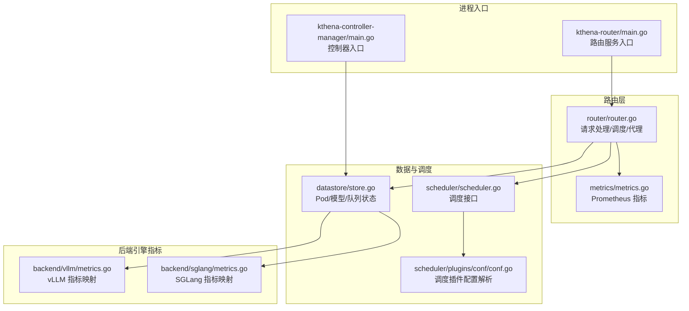
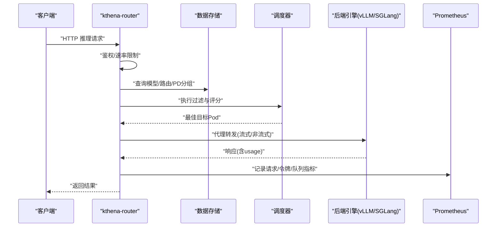
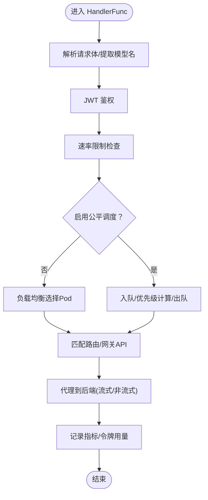
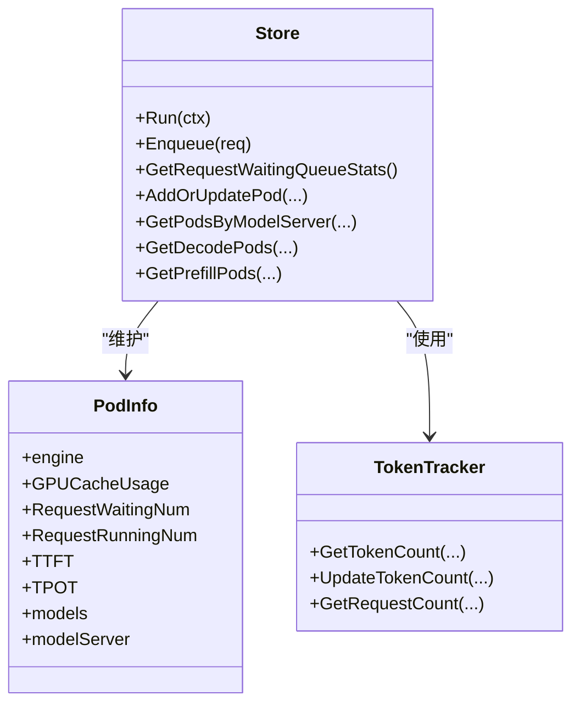
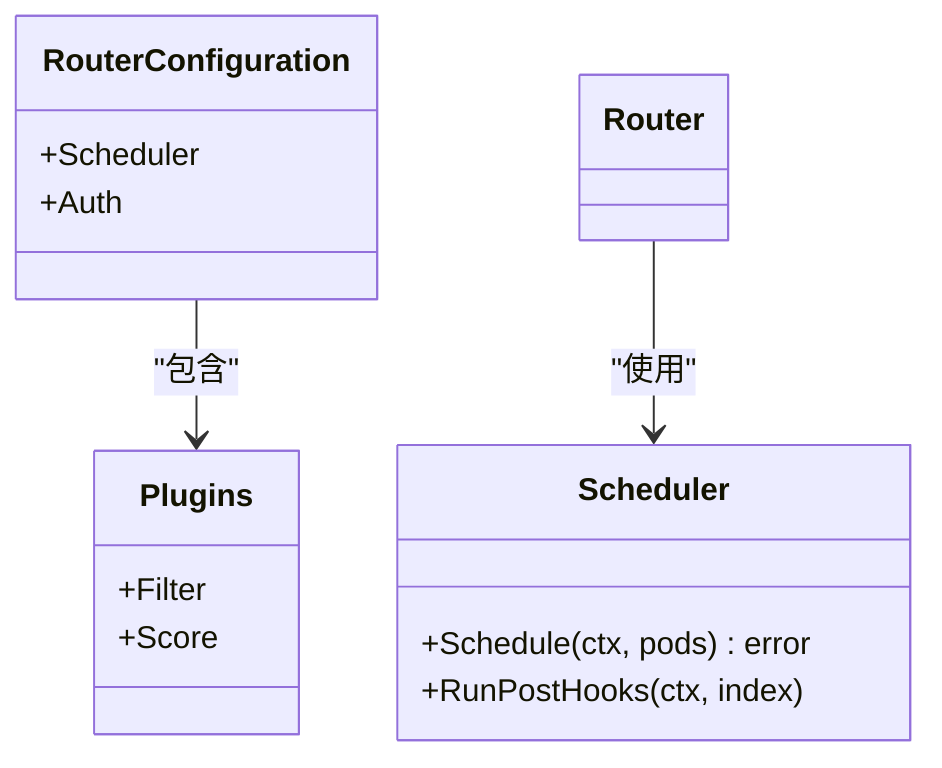
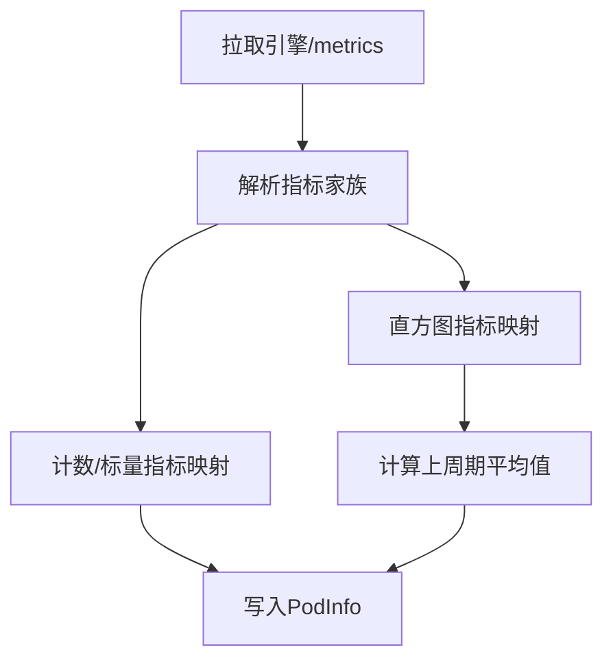
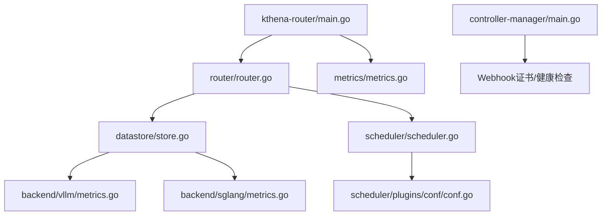

# 性能优化案例

<cite>
**本文引用的文件**
- [cmd/kthena-router/main.go](file://cmd/kthena-router/main.go)
- [cmd/kthena-controller-manager/main.go](file://cmd/kthena-controller-manager/main.go)
- [pkg/kthena-router/router/router.go](file://pkg/kthena-router/router/router.go)
- [pkg/kthena-router/datastore/store.go](file://pkg/kthena-router/datastore/store.go)
- [pkg/kthena-router/scheduler/scheduler.go](file://pkg/kthena-router/scheduler/scheduler.go)
- [pkg/kthena-router/scheduler/plugins/conf/conf.go](file://pkg/kthena-router/scheduler/plugins/conf/conf.go)
- [pkg/kthena-router/metrics/metrics.go](file://pkg/kthena-router/metrics/metrics.go)
- [pkg/kthena-router/backend/vllm/metrics.go](file://pkg/kthena-router/backend/vllm/metrics.go)
- [pkg/kthena-router/backend/sglang/metrics.go](file://pkg/kthena-router/backend/sglang/metrics.go)
- [python/kthena/runtime/vllm_config.py](file://python/kthena/runtime/vllm_config.py)
</cite>

## 目录
1. [简介](#简介)
2. [项目结构](#项目结构)
3. [核心组件](#核心组件)
4. [架构总览](#架构总览)
5. [详细组件分析](#详细组件分析)
6. [依赖分析](#依赖分析)
7. [性能考量与优化建议](#性能考量与优化建议)
8. [故障排查指南](#故障排查指南)
9. [结论](#结论)
10. [附录](#附录)

## 简介
本指南聚焦于 Kthena 在大模型推理场景下的性能优化实践，覆盖硬件资源优化、内存管理、网络配置、调度策略、并发控制、缓存策略、监控指标与瓶颈分析，并结合 vLLM、SGLang、Triton 等推理引擎的特点给出可落地的调优建议与成本控制策略。文档以代码为依据，辅以图示帮助读者快速定位优化切入点。

## 项目结构
Kthena 由“路由层”“数据存储与调度”“指标与监控”“后端引擎适配”等模块组成，核心入口分别为控制器管理器与路由服务，二者均支持通过命令行参数进行性能相关配置（如 API 客户端限速、调试端口、Webhook 证书等）。

**图表来源**
- [cmd/kthena-router/main.go:1-226](file://cmd/kthena-router/main.go#L1-L226)
- [cmd/kthena-controller-manager/main.go:1-332](file://cmd/kthena-controller-manager/main.go#L1-L332)
- [pkg/kthena-router/router/router.go:1-800](file://pkg/kthena-router/router/router.go#L1-L800)
- [pkg/kthena-router/datastore/store.go:1-800](file://pkg/kthena-router/datastore/store.go#L1-L800)
- [pkg/kthena-router/scheduler/scheduler.go:1-29](file://pkg/kthena-router/scheduler/scheduler.go#L1-L29)
- [pkg/kthena-router/scheduler/plugins/conf/conf.go:1-153](file://pkg/kthena-router/scheduler/plugins/conf/conf.go#L1-L153)
- [pkg/kthena-router/metrics/metrics.go:1-448](file://pkg/kthena-router/metrics/metrics.go#L1-L448)
- [pkg/kthena-router/backend/vllm/metrics.go:1-120](file://pkg/kthena-router/backend/vllm/metrics.go#L1-L120)
- [pkg/kthena-router/backend/sglang/metrics.go:1-126](file://pkg/kthena-router/backend/sglang/metrics.go#L1-L126)

**章节来源**
- [cmd/kthena-router/main.go:1-226](file://cmd/kthena-router/main.go#L1-L226)
- [cmd/kthena-controller-manager/main.go:1-332](file://cmd/kthena-controller-manager/main.go#L1-L332)
- [pkg/kthena-router/router/router.go:1-800](file://pkg/kthena-router/router/router.go#L1-L800)
- [pkg/kthena-router/datastore/store.go:1-800](file://pkg/kthena-router/datastore/store.go#L1-L800)

## 核心组件
- 路由器：负责请求解析、鉴权、速率限制、公平调度、网关 API 匹配、到后端的代理转发与指标记录。
- 数据存储：维护 Pod/模型/路由/队列状态，周期性拉取后端指标，提供公平调度所需的运行时信息。
- 调度器：抽象调度接口，结合插件配置实现过滤与评分，支持 PD 分离模式下的预取/解码分组调度。
- 指标系统：统一暴露 Prometheus 指标，涵盖请求时延、令牌用量、活跃请求数、公平队列状态等。
- 引擎指标适配：针对 vLLM/SGLang 的 GPU 缓存使用、等待/运行中的请求数、首 token 时间、每输出 token 时间等指标进行采集与映射。

**章节来源**
- [pkg/kthena-router/router/router.go:73-169](file://pkg/kthena-router/router/router.go#L73-L169)
- [pkg/kthena-router/datastore/store.go:161-240](file://pkg/kthena-router/datastore/store.go#L161-L240)
- [pkg/kthena-router/scheduler/scheduler.go:25-28](file://pkg/kthena-router/scheduler/scheduler.go#L25-L28)
- [pkg/kthena-router/metrics/metrics.go:54-85](file://pkg/kthena-router/metrics/metrics.go#L54-L85)
- [pkg/kthena-router/backend/vllm/metrics.go:29-56](file://pkg/kthena-router/backend/vllm/metrics.go#L29-L56)
- [pkg/kthena-router/backend/sglang/metrics.go:30-57](file://pkg/kthena-router/backend/sglang/metrics.go#L30-L57)

## 架构总览
下图展示了从客户端请求到后端推理引擎的关键路径，以及性能相关的关键节点（速率限制、公平队列、调度插件、指标采集）。

**图表来源**
- [pkg/kthena-router/router/router.go:204-464](file://pkg/kthena-router/router/router.go#L204-L464)
- [pkg/kthena-router/datastore/store.go:410-430](file://pkg/kthena-router/datastore/store.go#L410-L430)
- [pkg/kthena-router/metrics/metrics.go:225-447](file://pkg/kthena-router/metrics/metrics.go#L225-L447)

## 详细组件分析

### 组件一：路由器与请求处理流水线
- 请求解析与鉴权：从 Gin 上下文解析模型名，按路由配置进行 JWT 鉴权。
- 速率限制：基于统一令牌桶对输入/输出令牌与请求数进行限制，支持按模型维度动态更新。
- 公平调度：在启用公平调度时，计算优先级并入队，按窗口大小与权重控制并发；否则直接负载均衡选择 Pod。
- 网关 API 支持：匹配 Gateway/HTTPRoute/InferencePool，支持路径重写与后端引用。
- 代理与指标：记录下游/上游活跃请求数、令牌用量、TTFT/TPOT 等；在 PD 分离模式下区分 prefill/decode 阶段时延。

**图表来源**
- [pkg/kthena-router/router/router.go:204-464](file://pkg/kthena-router/router/router.go#L204-L464)
- [pkg/kthena-router/router/router.go:714-780](file://pkg/kthena-router/router/router.go#L714-L780)

**章节来源**
- [pkg/kthena-router/router/router.go:204-464](file://pkg/kthena-router/router/router.go#L204-L464)
- [pkg/kthena-router/router/router.go:714-780](file://pkg/kthena-router/router/router.go#L714-L780)

### 组件二：数据存储与公平队列
- 周期性指标采集：定时轮询后端 Pod 指标（GPU 缓存使用、等待/运行中请求、TTFT/TPOT），并维护直方图历史用于平均值计算。
- 公平队列：基于滑动窗口令牌跟踪器，支持窗口大小、令牌权重、请求数权重等环境变量配置；提供最大并发、QPS、重建阈值等参数。
- 资源同步：监听 ModelServer/ModelRoute/Gateway/InferencePool/HTTPRoute 等 CRD 变更，维护内部索引与回调。

**图表来源**
- [pkg/kthena-router/datastore/store.go:161-240](file://pkg/kthena-router/datastore/store.go#L161-L240)
- [pkg/kthena-router/datastore/store.go:248-266](file://pkg/kthena-router/datastore/store.go#L248-L266)
- [pkg/kthena-router/datastore/store.go:351-404](file://pkg/kthena-router/datastore/store.go#L351-L404)

**章节来源**
- [pkg/kthena-router/datastore/store.go:410-430](file://pkg/kthena-router/datastore/store.go#L410-L430)
- [pkg/kthena-router/datastore/store.go:443-468](file://pkg/kthena-router/datastore/store.go#L443-L468)
- [pkg/kthena-router/datastore/store.go:351-404](file://pkg/kthena-router/datastore/store.go#L351-L404)

### 组件三：调度器与插件配置
- 调度接口：定义 Schedule 与 PostHooks，便于扩展过滤与评分插件。
- 插件配置：支持启用/禁用过滤与评分插件、设置权重、传参；自动处理随机插件与其他评分插件共用的冲突。

**图表来源**
- [pkg/kthena-router/scheduler/scheduler.go:25-28](file://pkg/kthena-router/scheduler/scheduler.go#L25-L28)
- [pkg/kthena-router/scheduler/plugins/conf/conf.go:28-67](file://pkg/kthena-router/scheduler/plugins/conf/conf.go#L28-L67)
- [pkg/kthena-router/scheduler/plugins/conf/conf.go:127-140](file://pkg/kthena-router/scheduler/plugins/conf/conf.go#L127-L140)

**章节来源**
- [pkg/kthena-router/scheduler/scheduler.go:25-28](file://pkg/kthena-router/scheduler/scheduler.go#L25-L28)
- [pkg/kthena-router/scheduler/plugins/conf/conf.go:82-103](file://pkg/kthena-router/scheduler/plugins/conf/conf.go#L82-L103)

### 组件四：指标系统与监控
- 指标类别：请求总量与时延分布、令牌用量、调度插件耗时、活跃请求数、公平队列规模与排队时延等。
- 记录时机：请求开始/结束、prefill/decode 阶段、速率限制触发、队列入队/出队等。
- 采集范围：统一暴露 Prometheus 指标，便于 Grafana 展示与告警。

**图表来源**
- [pkg/kthena-router/metrics/metrics.go:225-447](file://pkg/kthena-router/metrics/metrics.go#L225-L447)
- [pkg/kthena-router/router/router.go:714-780](file://pkg/kthena-router/router/router.go#L714-L780)

**章节来源**
- [pkg/kthena-router/metrics/metrics.go:54-85](file://pkg/kthena-router/metrics/metrics.go#L54-L85)
- [pkg/kthena-router/metrics/metrics.go:225-447](file://pkg/kthena-router/metrics/metrics.go#L225-L447)

### 组件五：后端引擎指标适配（vLLM/SGLang）
- 指标映射：将引擎导出的 GPU 缓存使用、等待/运行中请求、TTFT/TPOT 等指标映射到统一名称，供调度与监控使用。
- 采集方式：通过 Pod IP 与固定端口访问 /metrics 并解析直方图，计算上一周期平均值以平滑抖动。

**图表来源**
- [pkg/kthena-router/backend/vllm/metrics.go:71-119](file://pkg/kthena-router/backend/vllm/metrics.go#L71-L119)
- [pkg/kthena-router/backend/sglang/metrics.go:72-120](file://pkg/kthena-router/backend/sglang/metrics.go#L72-L120)

**章节来源**
- [pkg/kthena-router/backend/vllm/metrics.go:29-56](file://pkg/kthena-router/backend/vllm/metrics.go#L29-L56)
- [pkg/kthena-router/backend/sglang/metrics.go:30-57](file://pkg/kthena-router/backend/sglang/metrics.go#L30-L57)

## 依赖分析
- 进程入口依赖：路由服务与控制器管理器分别通过命令行参数控制 TLS/Webhook、调试端口、Kubernetes API 客户端 QPS/Burst 等。
- 路由器依赖：依赖数据存储（Pod/路由/队列）、调度器（插件配置）、指标系统、访问日志与连接器工厂。
- 数据存储依赖：后端引擎指标适配（vLLM/SGLang）与令牌跟踪器。
- 控制器管理器依赖：Webhook 证书生成与更新、健康检查端点、多控制器选择。

**图表来源**
- [cmd/kthena-router/main.go:19-36](file://cmd/kthena-router/main.go#L19-L36)
- [cmd/kthena-controller-manager/main.go:19-41](file://cmd/kthena-controller-manager/main.go#L19-L41)
- [pkg/kthena-router/router/router.go:44-54](file://pkg/kthena-router/router/router.go#L44-L54)

**章节来源**
- [cmd/kthena-router/main.go:19-36](file://cmd/kthena-router/main.go#L19-L36)
- [cmd/kthena-controller-manager/main.go:19-41](file://cmd/kthena-controller-manager/main.go#L19-L41)

## 性能考量与优化建议

### 硬件资源优化
- GPU 利用率与 KV 缓存
  - 通过后端指标读取 GPU 缓存使用率与等待/运行中请求数，结合公平队列与 PD 分离策略，避免过载导致排队时间上升。
  - 建议：根据 TTFT/TPOT 指标与 GPU 使用率联动调整并发与批大小，避免显存碎片化。
- CPU/网络带宽
  - 控制器与路由服务的 Kubernetes API 客户端 QPS/Burst 应与集群规模匹配，避免 API 服务器压力过大引发延迟。
  - 建议：在高并发场景下适当提升 QPS/Burst，同时开启本地调试端口以便快速诊断。

**章节来源**
- [pkg/kthena-router/backend/vllm/metrics.go:29-56](file://pkg/kthena-router/backend/vllm/metrics.go#L29-L56)
- [pkg/kthena-router/backend/sglang/metrics.go:30-57](file://pkg/kthena-router/backend/sglang/metrics.go#L30-L57)
- [cmd/kthena-router/main.go:79-80](file://cmd/kthena-router/main.go#L79-L80)
- [cmd/kthena-controller-manager/main.go:83-84](file://cmd/kthena-controller-manager/main.go#L83-L84)

### 内存管理与缓存策略
- 指标驱动的缓存命中
  - 利用 vLLM/SGLang 的直方图指标计算上周期平均 TTFT/TPOT，作为缓存命中与预热效果的参考。
  - 建议：在低延迟目标下优先提升缓存命中率，减少重复预取开销。
- 公平队列窗口与权重
  - 通过环境变量调节公平窗口大小、令牌权重与请求数权重，平衡吞吐与延迟。
  - 建议：长尾请求较多时增大窗口与请求数权重，降低抖动。

**章节来源**
- [pkg/kthena-router/backend/vllm/metrics.go:97-119](file://pkg/kthena-router/backend/vllm/metrics.go#L97-L119)
- [pkg/kthena-router/backend/sglang/metrics.go:98-120](file://pkg/kthena-router/backend/sglang/metrics.go#L98-L120)
- [pkg/kthena-router/datastore/store.go:351-404](file://pkg/kthena-router/datastore/store.go#L351-L404)

### 网络配置与代理优化
- 路由到后端的代理链路
  - 支持流式/非流式两种模式，记录 TTFT/TPOT 与令牌用量，便于定位网络或后端瓶颈。
  - 建议：在高延迟网络环境下适当放宽超时，确保流式响应不被过早中断。
- 网关 API 与 InferencePool
  - 通过 HTTPRoute 的 URL 重写与 InferencePool 的端口选择，实现灵活的路由与后端绑定。

**章节来源**
- [pkg/kthena-router/router/router.go:714-780](file://pkg/kthena-router/router/router.go#L714-L780)
- [pkg/kthena-router/router/router.go:500-622](file://pkg/kthena-router/router/router.go#L500-L622)

### 调度策略与并发控制
- 公平调度
  - 基于令牌跟踪器与滑动窗口计算优先级，支持队列超时、最大并发、QPS 等参数。
  - 建议：在突发流量场景下适度提高最大并发与 QPS，同时观察公平队列排队时延。
- PD 分离与分组调度
  - 预取/解码阶段分离，按 PD 组合选择匹配的解码/预取 Pod，降低跨阶段等待。
- 调度插件
  - 支持启用/禁用过滤与评分插件，权重与参数通过配置文件注入，避免与随机插件混用。

**章节来源**
- [pkg/kthena-router/router/router.go:302-314](file://pkg/kthena-router/router/router.go#L302-L314)
- [pkg/kthena-router/datastore/store.go:572-635](file://pkg/kthena-router/datastore/store.go#L572-L635)
- [pkg/kthena-router/scheduler/plugins/conf/conf.go:82-103](file://pkg/kthena-router/scheduler/plugins/conf/conf.go#L82-L103)

### 不同推理引擎的性能特点与适用场景
- vLLM
  - 指标：GPU 缓存使用、等待/运行中请求、TTFT/TPOT。
  - 特点：适合高吞吐、低延迟的通用推理场景，支持高效 KV 缓存复用。
- SGLang
  - 指标：与 vLLM 类似的运行态指标，模型列表可通过引擎端口查询。
  - 特点：在复杂推理流程与多阶段管线中具备灵活性。
- Triton
  - 说明：当前代码未包含 Triton 后端适配文件，但可参照 vLLM/SGLang 的指标映射与采集方式扩展。

**章节来源**
- [pkg/kthena-router/backend/vllm/metrics.go:29-56](file://pkg/kthena-router/backend/vllm/metrics.go#L29-L56)
- [pkg/kthena-router/backend/sglang/metrics.go:30-57](file://pkg/kthena-router/backend/sglang/metrics.go#L30-L57)
- [pkg/kthena-router/backend/sglang/metrics.go:122-126](file://pkg/kthena-router/backend/sglang/metrics.go#L122-L126)

### 基准测试与性能评估方法
- 指标采集与导出
  - 使用 Prometheus 抓取路由与后端引擎指标，关注 TTFT/TPOT、GPU 缓存使用、活跃请求数、公平队列时延。
- 场景设计
  - 单模型稳定压测、多模型混合负载、突发流量冲击、PD 分离与合并对比。
- 关键指标解释
  - TTFT：首 token 延迟，反映冷启动与预取效率。
  - TPOT：每输出 token 延迟，反映解码阶段稳定性。
  - GPU 缓存使用：反映 KV 复用效果与预热程度。
  - 公平队列时延：反映公平调度对长尾的影响。

**章节来源**
- [pkg/kthena-router/metrics/metrics.go:54-85](file://pkg/kthena-router/metrics/metrics.go#L54-L85)
- [pkg/kthena-router/backend/vllm/metrics.go:97-119](file://pkg/kthena-router/backend/vllm/metrics.go#L97-L119)
- [pkg/kthena-router/backend/sglang/metrics.go:98-120](file://pkg/kthena-router/backend/sglang/metrics.go#L98-L120)

### 监控指标解读与瓶颈分析
- 指标解读
  - 下游活跃请求数持续高位且 TTFT/TPOT 上升：可能为后端过载或缓存命中不足。
  - 公平队列时延显著：可能为并发过高或权重设置不当。
  - GPU 缓存使用率低：可能为预热不足或模型切换频繁。
- 瓶颈定位
  - 通过分阶段时延（prefill/decode）与令牌用量，判断是预取阶段还是解码阶段成为瓶颈。
  - 结合调度插件耗时，评估过滤/评分是否引入额外开销。

**章节来源**
- [pkg/kthena-router/metrics/metrics.go:133-140](file://pkg/kthena-router/metrics/metrics.go#L133-L140)
- [pkg/kthena-router/router/router.go:714-780](file://pkg/kthena-router/router/router.go#L714-L780)

### 大规模部署的性能调优经验与成本控制
- 成本控制
  - 通过公平调度与队列参数，避免过度扩容导致的闲置资源浪费。
  - 利用 PD 分离与缓存复用，降低预取开销与网络往返。
- 扩展性
  - 控制器与路由服务的 QPS/Burst 参数应随集群规模线性增长，避免 API 服务器成为瓶颈。
  - Webhook 证书自动管理与健康检查端点，保障运维稳定性。

**章节来源**
- [cmd/kthena-router/main.go:79-80](file://cmd/kthena-router/main.go#L79-L80)
- [cmd/kthena-controller-manager/main.go:83-84](file://cmd/kthena-controller-manager/main.go#L83-L84)
- [cmd/kthena-controller-manager/main.go:127-236](file://cmd/kthena-controller-manager/main.go#L127-L236)

## 故障排查指南
- Webhook 证书问题
  - 若 TLS 证书/密钥文件缺失，路由服务会等待指定时长后失败退出；控制器管理器同样需要证书文件或自动签发。
- 调试端口
  - 路由服务与控制器管理器均提供本地调试端口，便于快速定位启动与运行问题。
- 指标不可用
  - 若后端引擎指标无法拉取，检查 Pod IP、端口与网络连通性；确认直方图解析逻辑与历史直方图字段一致。

**章节来源**
- [cmd/kthena-router/main.go:197-225](file://cmd/kthena-router/main.go#L197-L225)
- [cmd/kthena-router/main.go:137-195](file://cmd/kthena-router/main.go#L137-L195)
- [cmd/kthena-controller-manager/main.go:252-266](file://cmd/kthena-controller-manager/main.go#L252-L266)
- [cmd/kthena-controller-manager/main.go:127-236](file://cmd/kthena-controller-manager/main.go#L127-L236)

## 结论
Kthena 的性能优化围绕“指标驱动的调度与缓存、合理的并发与队列参数、清晰的网关与代理链路”展开。通过 vLLM/SGLang 的指标映射与 Prometheus 统一观测，结合公平队列与 PD 分离策略，可在保证公平性的前提下最大化吞吐与稳定性。在大规模部署中，需重点关注 API 客户端限速、Webhook 证书与健康检查、以及缓存复用与预热策略，以实现性能与成本的平衡。

## 附录
- vLLM 运行时配置（ZMQ 相关参数）可用于 KV 事件订阅与事件处理，有助于进一步优化 KV 缓存与事件驱动的推理流程。

**章节来源**
- [python/kthena/runtime/vllm_config.py:18-31](file://python/kthena/runtime/vllm_config.py#L18-L31)