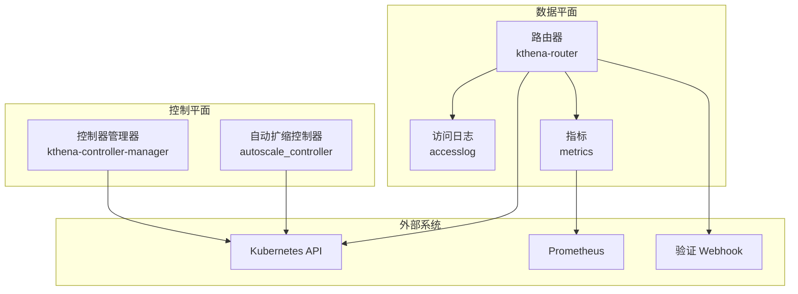
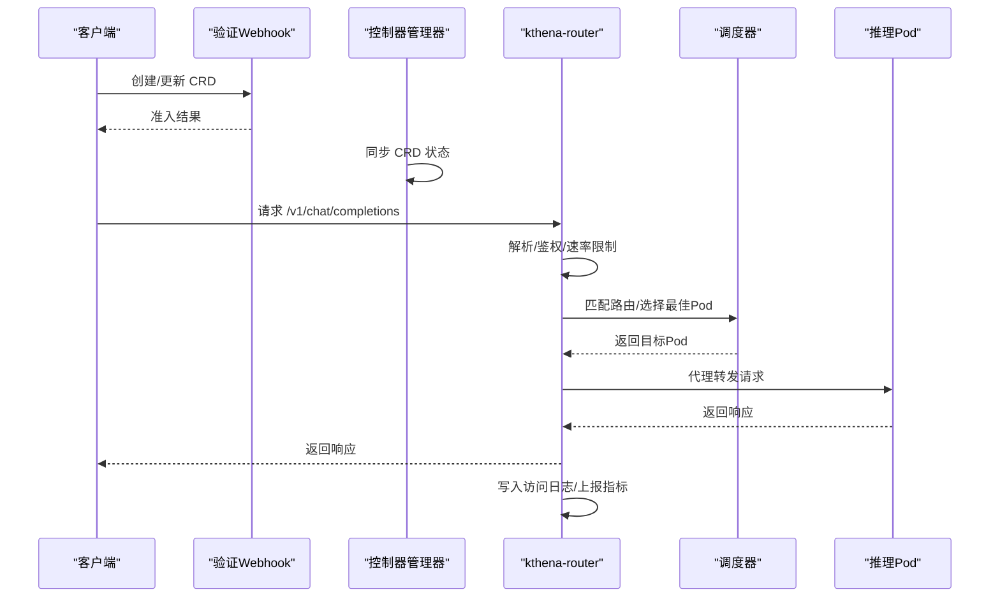
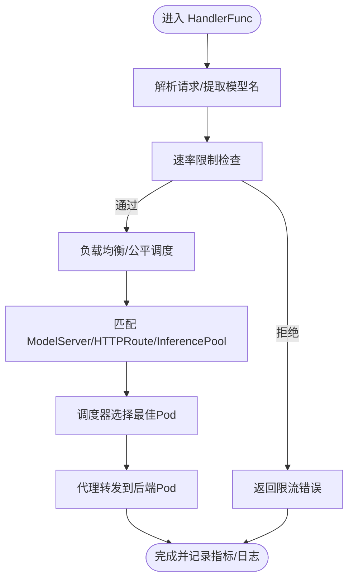
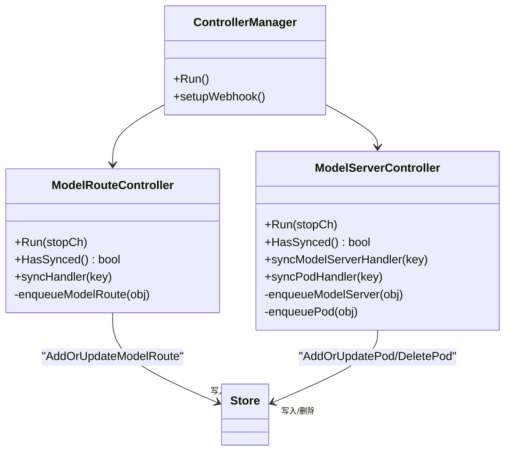
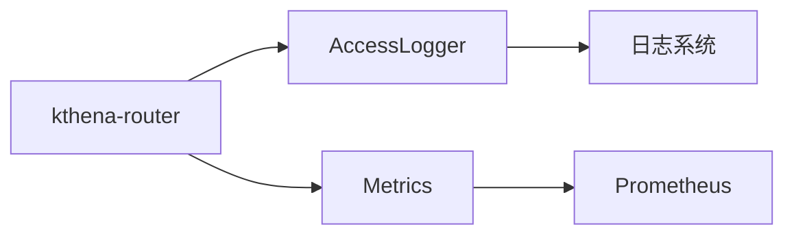
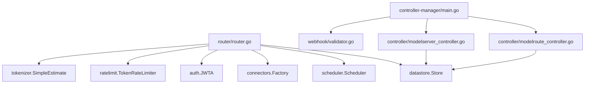

# 故障排查指南

<cite>
**本文引用的文件**
- [cmd/kthena-router/main.go](file://cmd/kthena-router/main.go)
- [cmd/kthena-controller-manager/main.go](file://cmd/kthena-controller-manager/main.go)
- [pkg/controller/config.go](file://pkg/controller/config.go)
- [pkg/kthena-router/controller/modelroute_controller.go](file://pkg/kthena-router/controller/modelroute_controller.go)
- [pkg/kthena-router/controller/modelserver_controller.go](file://pkg/kthena-router/controller/modelserver_controller.go)
- [pkg/kthena-router/accesslog/logger.go](file://pkg/kthena-router/accesslog/logger.go)
- [pkg/kthena-router/metrics/metrics.go](file://pkg/kthena-router/metrics/metrics.go)
- [pkg/kthena-router/router/router.go](file://pkg/kthena-router/router/router.go)
- [pkg/autoscaler/controller/autoscale_controller.go](file://pkg/autoscaler/controller/autoscale_controller.go)
- [pkg/kthena-router/webhook/validator.go](file://pkg/kthena-router/webhook/validator.go)
- [docs/kthena/docs/user-guide/router-observability.md](file://docs/kthena/docs/user-guide/router-observability.md)
- [docs/kthena/docs/general/prometheus.md](file://docs/kthena/docs/general/prometheus.md)
- [examples/kthena-router/LLM-Mock-ds1.5b-Canary.yaml](file://examples/kthena-router/LLM-Mock-ds1.5b-Canary.yaml)
</cite>

## 目录
1. [简介](#简介)
2. [项目结构](#项目结构)
3. [核心组件](#核心组件)
4. [架构总览](#架构总览)
5. [详细组件分析](#详细组件分析)
6. [依赖分析](#依赖分析)
7. [性能考量](#性能考量)
8. [故障排查指南](#故障排查指南)
9. [结论](#结论)
10. [附录](#附录)

## 简介
本指南面向运维与平台工程团队，聚焦 Kthena 在生产环境中的故障排查实践。围绕“模型加载失败、路由配置错误、扩缩容异常、性能下降”等典型问题，提供系统化诊断流程、可观测性工具使用技巧（日志、指标、调试端点）、网络连通性检查方法，并结合 Canary 发布与回滚策略，给出快速恢复与预防建议。

## 项目结构
Kthena 由三层组成：
- 控制平面：控制器管理器负责 CRD 的状态收敛与扩缩容策略执行
- 数据平面：kthena-router 负责请求接入、路由、调度、限流、可观测性
- 可观测性：Prometheus 指标、结构化访问日志、调试端点

图示来源
- [cmd/kthena-controller-manager/main.go:54-111](file://cmd/kthena-controller-manager/main.go#L54-L111)
- [pkg/autoscaler/controller/autoscale_controller.go:98-120](file://pkg/autoscaler/controller/autoscale_controller.go#L98-L120)
- [cmd/kthena-router/main.go:104-122](file://cmd/kthena-router/main.go#L104-L122)
- [pkg/kthena-router/router/router.go:91-169](file://pkg/kthena-router/router/router.go#L91-L169)
- [pkg/kthena-router/accesslog/logger.go:69-98](file://pkg/kthena-router/accesslog/logger.go#L69-L98)
- [pkg/kthena-router/metrics/metrics.go:87-223](file://pkg/kthena-router/metrics/metrics.go#L87-L223)

章节来源
- [cmd/kthena-controller-manager/main.go:54-111](file://cmd/kthena-controller-manager/main.go#L54-L111)
- [cmd/kthena-router/main.go:104-122](file://cmd/kthena-router/main.go#L104-L122)
- [pkg/kthena-router/router/router.go:91-169](file://pkg/kthena-router/router/router.go#L91-L169)

## 核心组件
- 控制器管理器：启动 Webhook 服务器，初始化控制器集合，支持控制器选择性启用/禁用，具备领导者选举能力
- 自动扩缩控制器：基于绑定策略对 ModelServing 实例进行同构/异构扩缩容
- kthena-router：统一入口，负责鉴权、速率限制、路由匹配、调度、代理转发、访问日志与指标上报
- 访问日志：结构化输出每条请求的完整画像，便于审计与根因分析
- 指标体系：覆盖请求总量/时延、令牌统计、公平队列、调度插件耗时、速率限制等
- 验证 Webhook：对 ModelRoute/ModelServer 进行准入校验

章节来源
- [pkg/controller/config.go:19-27](file://pkg/controller/config.go#L19-L27)
- [pkg/autoscaler/controller/autoscale_controller.go:47-62](file://pkg/autoscaler/controller/autoscale_controller.go#L47-L62)
- [pkg/kthena-router/router/router.go:73-89](file://pkg/kthena-router/router/router.go#L73-L89)
- [pkg/kthena-router/accesslog/logger.go:28-61](file://pkg/kthena-router/accesslog/logger.go#L28-L61)
- [pkg/kthena-router/metrics/metrics.go:54-85](file://pkg/kthena-router/metrics/metrics.go#L54-L85)
- [pkg/kthena-router/webhook/validator.go:38-59](file://pkg/kthena-router/webhook/validator.go#L38-L59)

## 架构总览
下图展示从客户端到后端推理 Pod 的全链路调用序列，以及关键可观测性落点。

图示来源
- [pkg/kthena-router/webhook/validator.go:86-156](file://pkg/kthena-router/webhook/validator.go#L86-L156)
- [cmd/kthena-controller-manager/main.go:104-110](file://cmd/kthena-controller-manager/main.go#L104-L110)
- [pkg/kthena-router/router/router.go:204-315](file://pkg/kthena-router/router/router.go#L204-L315)
- [pkg/kthena-router/router/router.go:466-498](file://pkg/kthena-router/router/router.go#L466-L498)
- [pkg/kthena-router/router/router.go:714-780](file://pkg/kthena-router/router/router.go#L714-L780)
- [pkg/kthena-router/accesslog/logger.go:100-128](file://pkg/kthena-router/accesslog/logger.go#L100-L128)
- [pkg/kthena-router/metrics/metrics.go:225-254](file://pkg/kthena-router/metrics/metrics.go#L225-L254)

## 详细组件分析

### 组件A：路由器与路由匹配
- 职责：解析请求、鉴权、速率限制、路由匹配、调度、代理转发、访问日志与指标
- 关键路径：HandlerFunc → doLoadbalance/handleFairnessScheduling → getPodsAndServer → proxyModelEndpoint → proxy
- 公平调度开关：通过环境变量控制是否启用公平调度队列
- 调试端点：在路由层设置 Gateway/HTTPRoute/InferencePool 信息，便于定位路由问题

图示来源
- [pkg/kthena-router/router/router.go:204-315](file://pkg/kthena-router/router/router.go#L204-L315)
- [pkg/kthena-router/router/router.go:317-464](file://pkg/kthena-router/router/router.go#L317-L464)
- [pkg/kthena-router/router/router.go:466-498](file://pkg/kthena-router/router/router.go#L466-L498)
- [pkg/kthena-router/router/router.go:714-780](file://pkg/kthena-router/router/router.go#L714-L780)

章节来源
- [pkg/kthena-router/router/router.go:71-89](file://pkg/kthena-router/router/router.go#L71-L89)
- [pkg/kthena-router/router/router.go:204-315](file://pkg/kthena-router/router/router.go#L204-L315)

### 组件B：控制器与资源同步
- ModelRoute 控制器：监听 ModelRoute 变更，写入内部存储，触发速率限制配置更新
- ModelServer 控制器：监听 ModelServer 与 Pod，维护 Pod-ModelServer 绑定关系，处理就绪/删除场景
- 控制器管理器：启动 Webhook，按参数启用/禁用控制器，支持领导者选举

图示来源
- [pkg/kthena-router/controller/modelroute_controller.go:71-85](file://pkg/kthena-router/controller/modelroute_controller.go#L71-L85)
- [pkg/kthena-router/controller/modelserver_controller.go:114-128](file://pkg/kthena-router/controller/modelserver_controller.go#L114-L128)
- [cmd/kthena-controller-manager/main.go:104-110](file://cmd/kthena-controller-manager/main.go#L104-L110)

章节来源
- [pkg/kthena-router/controller/modelroute_controller.go:130-151](file://pkg/kthena-router/controller/modelroute_controller.go#L130-L151)
- [pkg/kthena-router/controller/modelserver_controller.go:178-250](file://pkg/kthena-router/controller/modelserver_controller.go#L178-L250)
- [cmd/kthena-controller-manager/main.go:54-111](file://cmd/kthena-controller-manager/main.go#L54-L111)

### 组件C：访问日志与指标
- 访问日志：支持 JSON/文本格式，输出请求/路由/令牌/耗时等字段；可输出到 stdout/stderr/文件
- 指标：请求总量与时延分布、令牌统计、活跃上游/下游请求数、公平队列大小与等待时延、调度插件耗时、速率限制计数

图示来源
- [pkg/kthena-router/accesslog/logger.go:69-98](file://pkg/kthena-router/accesslog/logger.go#L69-L98)
- [pkg/kthena-router/metrics/metrics.go:87-223](file://pkg/kthena-router/metrics/metrics.go#L87-L223)

章节来源
- [pkg/kthena-router/accesslog/logger.go:138-208](file://pkg/kthena-router/accesslog/logger.go#L138-L208)
- [pkg/kthena-router/metrics/metrics.go:225-447](file://pkg/kthena-router/metrics/metrics.go#L225-L447)

## 依赖分析
- 路由器依赖：
  - 存储层：匹配路由、查询 Pod、公平队列、令牌跟踪
  - 调度器：根据路由/规则选择最佳 Pod
  - 连接器：KV 连接器用于 PD 分离模式
  - 认证/限流/分词器：鉴权、速率限制、令牌估算
- 控制器依赖：
  - Informer：监听 CRD/Pod 变更
  - 客户端：调用 Kubernetes API 更新副本数
- Webhook 依赖：
  - 对 ModelRoute/ModelServer 进行准入校验

图示来源
- [pkg/kthena-router/router/router.go:91-169](file://pkg/kthena-router/router/router.go#L91-L169)
- [pkg/kthena-router/controller/modelroute_controller.go:36-44](file://pkg/kthena-router/controller/modelroute_controller.go#L36-L44)
- [pkg/kthena-router/controller/modelserver_controller.go:59-73](file://pkg/kthena-router/controller/modelserver_controller.go#L59-L73)
- [cmd/kthena-controller-manager/main.go:104-110](file://cmd/kthena-controller-manager/main.go#L104-L110)
- [pkg/kthena-router/webhook/validator.go:38-59](file://pkg/kthena-router/webhook/validator.go#L38-L59)

章节来源
- [pkg/kthena-router/router/router.go:91-169](file://pkg/kthena-router/router/router.go#L91-L169)
- [pkg/kthena-router/controller/modelroute_controller.go:36-44](file://pkg/kthena-router/controller/modelroute_controller.go#L36-L44)
- [pkg/kthena-router/controller/modelserver_controller.go:59-73](file://pkg/kthena-router/controller/modelserver_controller.go#L59-L73)
- [cmd/kthena-controller-manager/main.go:104-110](file://cmd/kthena-controller-manager/main.go#L104-L110)

## 性能考量
- 公平调度：通过公平队列与优先级权重缓解长尾延迟，降低排队等待时间
- 指标维度：按模型/路径/状态码/错误类型/插件类型/队列用户等标签聚合，便于定位瓶颈
- PD 分离：预取/解码阶段分离，需关注前段/后段时延分布与令牌统计
- 速率限制：输入/输出令牌与请求数联合限制，避免突发流量导致雪崩

章节来源
- [pkg/kthena-router/router/router.go:193-200](file://pkg/kthena-router/router/router.go#L193-L200)
- [pkg/kthena-router/metrics/metrics.go:54-85](file://pkg/kthena-router/metrics/metrics.go#L54-L85)
- [pkg/kthena-router/metrics/metrics.go:107-124](file://pkg/kthena-router/metrics/metrics.go#L107-L124)

## 故障排查指南

### 一、模型加载失败
症状
- 5xx 错误、超时、模型不可用
- 日志出现模型加载/初始化失败
- 指标中错误率上升、请求时延升高

排查步骤
1. 查看控制器日志与事件，确认 ModelServer/ModelRoute 是否被正确创建/更新
2. 使用调试端点查看当前 ModelServer/Pod 列表，确认 Pod 就绪状态
3. 检查后端推理 Pod 的健康状态与资源限制
4. 若为 PD 分离模式，检查 KV 连接器可用性与连接参数
5. 回滚至上一个稳定版本或切换到备用模型镜像

参考指标与日志
- 指标：kthena_router_requests_total、kthena_router_request_duration_seconds
- 日志：访问日志中 status_code/error 字段

章节来源
- [docs/kthena/docs/user-guide/router-observability.md:169-294](file://docs/kthena/docs/user-guide/router-observability.md#L169-L294)
- [pkg/kthena-router/router/router.go:714-780](file://pkg/kthena-router/router/router.go#L714-L780)

### 二、路由配置错误
症状
- 404 路由未找到、模型名不匹配、LoRA 适配器缺失
- 访问日志显示 route_not_found 或 model_server_matching 失败

排查步骤
1. 使用调试端点导出当前路由表与模型服务器视图
2. 校验 ModelRoute 的模型名/LoRA 列表与请求是否一致
3. 检查 HTTPRoute/Gateway/API 扩展匹配规则（路径/主机名/过滤器）
4. 如启用网关 API 扩展，确认 InferencePool 配置与目标端口
5. 修正路由规则后重试，观察访问日志与指标变化

章节来源
- [pkg/kthena-router/router/router.go:340-402](file://pkg/kthena-router/router/router.go#L340-L402)
- [pkg/kthena-router/router/router.go:500-622](file://pkg/kthena-router/router/router.go#L500-L622)
- [docs/kthena/docs/user-guide/router-observability.md:130-141](file://docs/kthena/docs/user-guide/router-observability.md#L130-L141)

### 三、扩缩容异常
症状
- 副本数未按预期变化、扩缩容延迟、资源不足
- 指标显示活跃请求持续高位、队列长度增长

排查步骤
1. 检查自动扩缩控制器日志，确认策略绑定与计算逻辑
2. 校验 AutoscalingPolicy/AutoscalingPolicyBinding 配置
3. 观察 Pod 数量与资源使用趋势，确认是否达到上限
4. 如为异构优化，核对各角色副本分配是否合理
5. 临时调整策略参数或手动干预，确保服务稳定

章节来源
- [pkg/autoscaler/controller/autoscale_controller.go:251-348](file://pkg/autoscaler/controller/autoscale_controller.go#L251-L348)
- [pkg/autoscaler/controller/autoscale_controller.go:350-373](file://pkg/autoscaler/controller/autoscale_controller.go#L350-L373)

### 四、性能下降
症状
- P95/P99 时延升高、TTFT/吞吐异常、队列堆积
- 指标显示公平队列时延分布偏大、活跃上游/下游请求高

排查步骤
1. 使用 Prometheus 抓取 kthena_router_request_duration_seconds 分位数
2. 检查公平队列大小与等待时延，评估是否需要调整公平调度权重
3. 对比输入/输出令牌统计，识别长请求与高消耗会话
4. 结合访问日志定位慢请求的模型/路径/Pod
5. 优化模型/批处理/并发参数，必要时引入多实例或多路由分流

章节来源
- [docs/kthena/docs/user-guide/router-observability.md:215-249](file://docs/kthena/docs/user-guide/router-observability.md#L215-L249)
- [pkg/kthena-router/metrics/metrics.go:174-181](file://pkg/kthena-router/metrics/metrics.go#L174-L181)

### 五、网络连通性检查
- 路由器到后端 Pod：确认 Service/Ingress/网关路由可达，检查端口映射与协议
- Webhook 证书：确认 CA Bundle 已更新，TLS 证书/密钥存在且未过期
- 调试端点：通过 15000 端口导出路由表与 Pod 视图，辅助定位

章节来源
- [cmd/kthena-router/main.go:135-195](file://cmd/kthena-router/main.go#L135-L195)
- [pkg/kthena-router/webhook/validator.go:61-84](file://pkg/kthena-router/webhook/validator.go#L61-L84)

### 六、Canary 发布与回滚
- 发布策略：先以小比例流量导入新版本，观察访问日志与指标
- 回滚策略：若出现错误率/时延异常，立即降低新版本权重或回滚到上一个稳定版本
- 示例：可参考示例中的多版本部署，便于快速切换

章节来源
- [examples/kthena-router/LLM-Mock-ds1.5b-Canary.yaml:1-61](file://examples/kthena-router/LLM-Mock-ds1.5b-Canary.yaml#L1-L61)

### 七、紧急恢复方案
- 快速降载：临时提高速率限制阈值、放宽公平调度权重
- 服务降级：关闭非关键功能（如部分过滤器），保留核心路由与代理
- 快速回滚：切换到上一个稳定镜像或路由配置
- 人工接管：通过调试端点导出状态，临时绕过问题模块

章节来源
- [docs/kthena/docs/user-guide/router-observability.md:169-294](file://docs/kthena/docs/user-guide/router-observability.md#L169-L294)

## 结论
通过“可观测性先行、自动化治理、分阶段发布”的方式，Kthena 能够在复杂推理场景中实现快速定位与恢复。建议在生产环境中：
- 默认开启结构化访问日志与 Prometheus 指标
- 建立完善的告警与仪表盘
- 使用网关 API 与 InferencePool 提升路由灵活性
- 采用 Canary 与回滚机制，降低变更风险

## 附录

### A. 常用命令与端点
- 指标端口：8080（默认）/metrics
- 调试端口：15000（配置导出）
- 常用调试端点：/debug/config_dump/modelroutes、/debug/config_dump/modelservers、/debug/config_dump/pods

章节来源
- [docs/kthena/docs/user-guide/router-observability.md:28-34](file://docs/kthena/docs/user-guide/router-observability.md#L28-L34)
- [docs/kthena/docs/user-guide/router-observability.md:130-141](file://docs/kthena/docs/user-guide/router-observability.md#L130-L141)

### B. Webhook 与控制器启动参数要点
- 控制器管理器：可启用/禁用控制器、领导者选举、Webhook 端口与证书
- 路由器：可启用/禁用 Webhook、网关 API、调试端口、K8s API QPS/Burst

章节来源
- [cmd/kthena-controller-manager/main.go:54-85](file://cmd/kthena-controller-manager/main.go#L54-L85)
- [cmd/kthena-router/main.go:40-102](file://cmd/kthena-router/main.go#L40-L102)