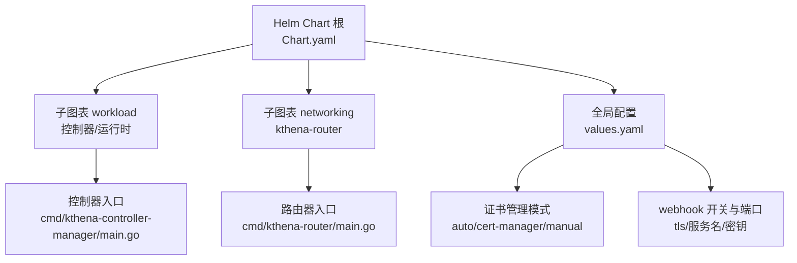
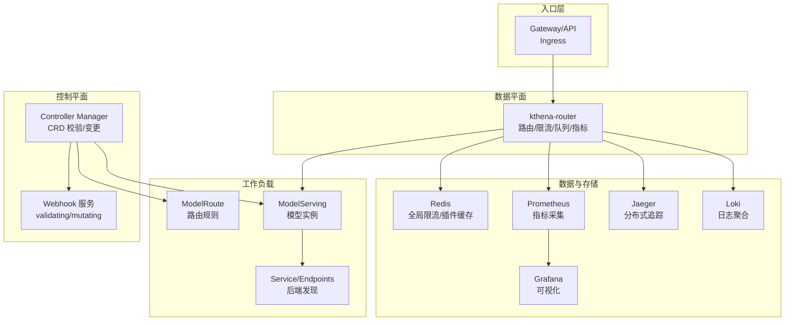
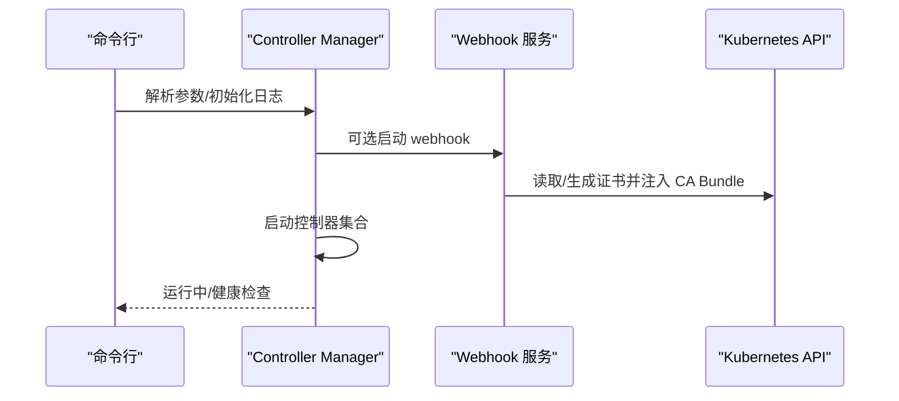
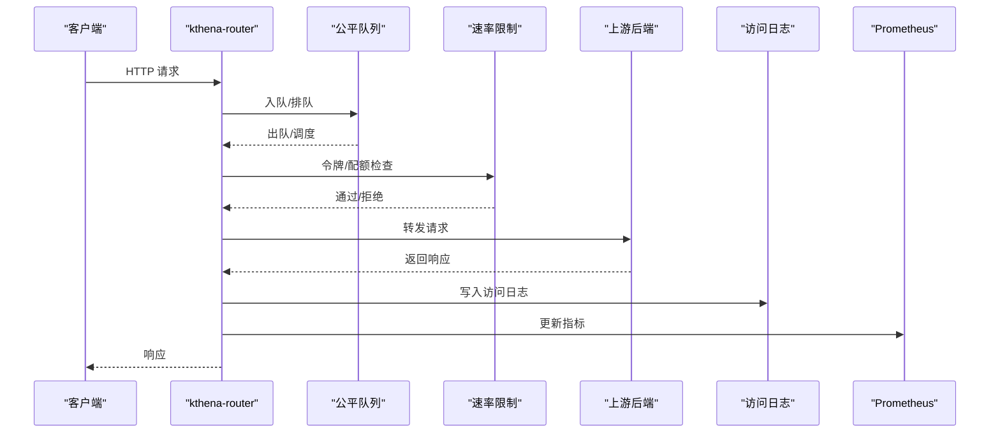
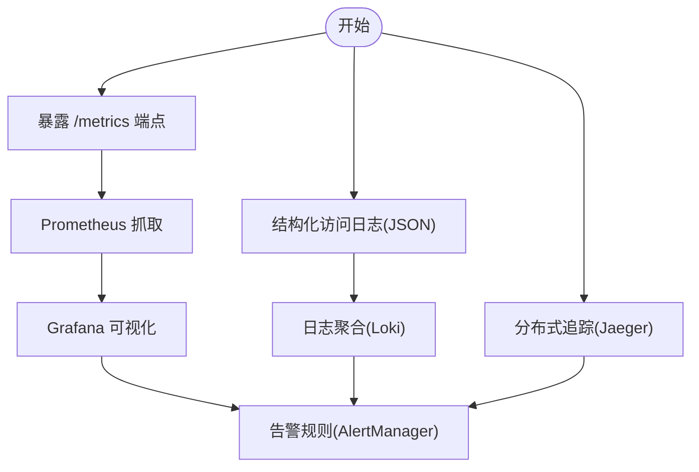
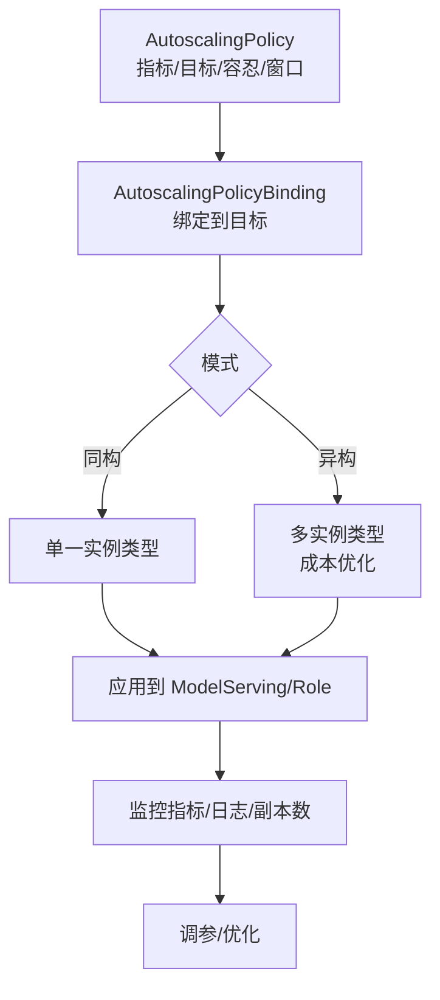
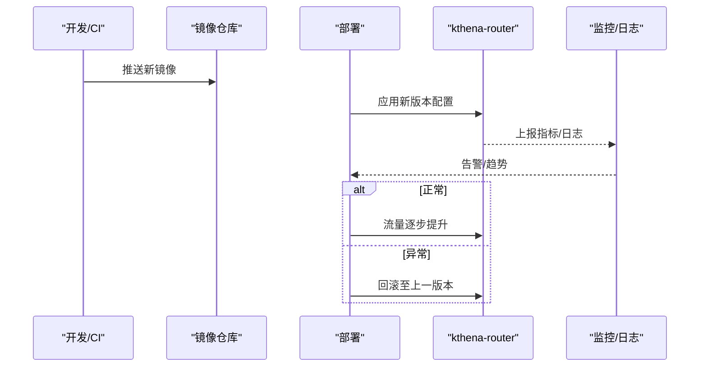
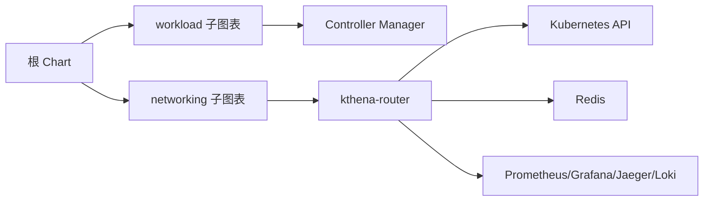

# 生产部署最佳实践

<cite>
**本文档引用的文件**
- [values.yaml](file://charts/kthena/values.yaml)
- [Chart.yaml](file://charts/kthena/Chart.yaml)
- [README.md](file://charts/kthena/README.md)
- [main.go](file://cmd/kthena-controller-manager/main.go)
- [main.go](file://cmd/kthena-router/main.go)
- [config.go](file://pkg/controller/config.go)
- [logger.go](file://pkg/kthena-router/accesslog/logger.go)
- [metrics.go](file://pkg/kthena-router/metrics/metrics.go)
- [router-observability.md](file://docs/kthena/docs/user-guide/router-observability.md)
- [prometheus.md](file://docs/kthena/docs/general/prometheus.md)
- [autoscaler.md](file://docs/kthena/docs/user-guide/autoscaler.md)
- [modelroute_types.go](file://pkg/apis/networking/v1alpha1/modelroute_types.go)
- [router.go](file://pkg/kthena-router/router/router.go)
- [ModelRouteSimple.yaml](file://examples/kthena-router/ModelRouteSimple.yaml)
</cite>

## 目录
1. [简介](#简介)
2. [项目结构](#项目结构)
3. [核心组件](#核心组件)
4. [架构总览](#架构总览)
5. [详细组件分析](#详细组件分析)
6. [依赖关系分析](#依赖关系分析)
7. [性能考量](#性能考量)
8. [故障排查指南](#故障排查指南)
9. [结论](#结论)
10. [附录](#附录)

## 简介
本指南面向在生产环境中部署 Kthena 的工程团队，围绕高可用、灾难恢复、安全加固、监控告警等生产级要求，提供从集群规划、资源分配、网络隔离、权限控制到容量规划与成本控制的完整方法论，并结合滚动更新、蓝绿部署、金丝雀发布等策略，以及企业级认证授权、审计日志与合规检查的集成路径，帮助您构建稳定、可观测、可扩展且安全的推理平台。

## 项目结构
Kthena 采用 Helm Chart 分层管理，核心由两个子图表组成：workload（控制器与运行时）与 networking（路由与网关），并通过全局参数统一管理证书与 webhook 行为。命令行入口分别位于控制器与路由器进程，支持通过参数控制 webhook、端口、调试端口、QPS/Burst 等关键运行参数。

**图示来源**
- [Chart.yaml:1-22](file://charts/kthena/Chart.yaml#L1-L22)
- [values.yaml:1-97](file://charts/kthena/values.yaml#L1-L97)
- [main.go:54-111](file://cmd/kthena-controller-manager/main.go#L54-L111)
- [main.go:40-122](file://cmd/kthena-router/main.go#L40-L122)

**章节来源**
- [Chart.yaml:1-22](file://charts/kthena/Chart.yaml#L1-L22)
- [values.yaml:1-97](file://charts/kthena/values.yaml#L1-L97)

## 核心组件
- 控制器管理器（Controller Manager）
  - 支持启用/禁用 webhook，自动证书生成与 CA Bundle 注入，健康检查端点，支持 leader election，可按需选择启用的控制器集合。
  - 关键参数：webhook 端口、超时、证书路径、服务名、QPS/Burst、工作线程数、控制器列表。
- 路由器（kthena-router）
  - 提供请求路由、负载均衡、调度、公平队列、速率限制、令牌统计、访问日志与 Prometheus 指标导出。
  - 支持 Gateway API 与推理扩展开关，内置调试端口用于配置快照与状态查看。
- 观测性
  - 访问日志：结构化 JSON/文本输出，支持 stdout/stderr/文件；指标：请求总量、延迟直方图、令牌用量、公平队列、速率限制等。
  - Prometheus 集成：提供 ServiceMonitor/Service 配置与告警规则模板，便于快速落地监控体系。
- 自动伸缩
  - 基于自定义资源 AutoscalingPolicy 与绑定资源 AutoscalingPolicyBinding，支持同构/异构目标模式，具备稳定窗口、恐慌阈值、容忍度等精细控制。

**章节来源**
- [main.go:54-111](file://cmd/kthena-controller-manager/main.go#L54-L111)
- [main.go:40-122](file://cmd/kthena-router/main.go#L40-L122)
- [logger.go:69-98](file://pkg/kthena-router/accesslog/logger.go#L69-L98)
- [metrics.go:87-223](file://pkg/kthena-router/metrics/metrics.go#L87-L223)
- [router-observability.md:1-294](file://docs/kthena/docs/user-guide/router-observability.md#L1-L294)
- [prometheus.md:1-800](file://docs/kthena/docs/general/prometheus.md#L1-L800)
- [autoscaler.md:1-331](file://docs/kthena/docs/user-guide/autoscaler.md#L1-L331)

## 架构总览
下图展示了生产环境中的典型部署拓扑：前端通过 Ingress/Gateway API 进入 kthena-router，后端由模型服务（ModelServing）与模型服务器（ModelServer）承载，控制器负责 CRD 的校验与变更，Prometheus/Grafana/Jaeger/Loki 等组件提供观测与追踪能力。

**图示来源**
- [README.md:165-254](file://charts/kthena/README.md#L165-L254)
- [metrics.go:87-223](file://pkg/kthena-router/metrics/metrics.go#L87-L223)
- [router-observability.md:1-294](file://docs/kthena/docs/user-guide/router-observability.md#L1-L294)
- [prometheus.md:1-800](file://docs/kthena/docs/general/prometheus.md#L1-L800)

## 详细组件分析

### 控制器管理器（Controller Manager）
- 启动流程
  - 解析命令行参数，初始化 klog，设置 stderr 阈值。
  - 可选启动 webhook 服务，自动注入 CA Bundle 并监听健康检查端点。
  - 初始化控制器上下文，按配置启用指定控制器集合。
- 安全与证书
  - 支持三种证书管理模式：auto（自动生成）、cert-manager（外部 CA）、manual（手动提供 CA Bundle）。
  - webhook 证书优先从 Secret 加载，否则尝试本地文件，最后自动生成并写入 Secret。
- 运行参数要点
  - leader-elect：启用主控选举以确保单活。
  - workers：并发工作线程数。
  - kube-api-qps/burst：限制与 API Server 交互的速率与突发。
  - controllers：支持启用/禁用具体控制器或全部。

**图示来源**
- [main.go:54-111](file://cmd/kthena-controller-manager/main.go#L54-L111)
- [main.go:127-236](file://cmd/kthena-controller-manager/main.go#L127-L236)

**章节来源**
- [main.go:54-111](file://cmd/kthena-controller-manager/main.go#L54-L111)
- [main.go:127-236](file://cmd/kthena-controller-manager/main.go#L127-L236)
- [config.go:19-27](file://pkg/controller/config.go#L19-L27)

### 路由器（kthena-router）
- 功能特性
  - 请求路由、负载均衡、调度、公平队列、速率限制、令牌统计、访问日志、Prometheus 指标导出、调试端点。
  - 支持 Gateway API 与推理扩展，可按需开启。
- 日志与指标
  - 访问日志支持 JSON/文本格式，输出至 stdout/stderr/文件；指标覆盖请求总量、延迟、令牌、公平队列、速率限制等。
- 运行参数要点
  - 端口、TLS 证书/密钥、webhook 端口与证书、调试端口、QPS/Burst、Gateway API 开关。

**图示来源**
- [router.go:109-154](file://pkg/kthena-router/router/router.go#L109-L154)
- [logger.go:69-98](file://pkg/kthena-router/accesslog/logger.go#L69-L98)
- [metrics.go:87-223](file://pkg/kthena-router/metrics/metrics.go#L87-L223)

**章节来源**
- [main.go:40-122](file://cmd/kthena-router/main.go#L40-L122)
- [router.go:109-154](file://pkg/kthena-router/router/router.go#L109-L154)
- [logger.go:69-98](file://pkg/kthena-router/accesslog/logger.go#L69-L98)
- [metrics.go:87-223](file://pkg/kthena-router/metrics/metrics.go#L87-L223)

### 观测性与监控
- 指标端点
  - 默认端口 8080，路径 /metrics；调试端口 15000，提供路由表、模型服务器、Pod 状态等快照。
- 访问日志
  - 结构化 JSON 输出，包含时间戳、方法、路径、协议、状态码、模型名、路由、服务器、Pod、请求 ID、令牌用量、总耗时与各阶段耗时等字段。
- Prometheus 集成
  - 提供 ServiceMonitor/Service 配置与告警规则模板，覆盖服务可用性、延迟、错误率、资源使用、模型精度、自动伸缩有效性等维度。

**图示来源**
- [router-observability.md:1-294](file://docs/kthena/docs/user-guide/router-observability.md#L1-L294)
- [prometheus.md:1-800](file://docs/kthena/docs/general/prometheus.md#L1-L800)

**章节来源**
- [router-observability.md:1-294](file://docs/kthena/docs/user-guide/router-observability.md#L1-L294)
- [prometheus.md:1-800](file://docs/kthena/docs/general/prometheus.md#L1-L800)

### 自动伸缩策略
- 策略资源
  - AutoscalingPolicy：定义指标、目标值、容忍度、稳定窗口、恐慌阈值与周期等行为参数。
  - AutoscalingPolicyBinding：将策略绑定到目标资源（ModelServing/Role），支持同构/异构两种模式。
- 异构优化
  - 通过成本系数与成本扩展率百分比，在满足性能的前提下实现多实例类型的成本优化组合。
- 监控与验证
  - 通过 CR 状态与副本数变化验证伸缩效果；关注抖动、响应速度与 Panic 模式使用频率。

**图示来源**
- [autoscaler.md:1-331](file://docs/kthena/docs/user-guide/autoscaler.md#L1-L331)

**章节来源**
- [autoscaler.md:1-331](file://docs/kthena/docs/user-guide/autoscaler.md#L1-L331)

### 部署策略（滚动/蓝绿/金丝雀）
- 滚动更新
  - 使用 Partition 控制分批替换，结合 MaxUnavailable 限制不可用副本数量，保障平滑升级。
- 蓝绿/金丝雀
  - 通过路由规则（ModelRoute）将流量按权重切分至新旧版本，结合速率限制与队列压力观察进行渐进式放量。
- 发布流程建议
  - 预热：先在测试环境验证指标与稳定性。
  - 灰度：小流量（如 10%）观察指标与日志。
  - 扩容：根据队列长度、P95 延迟、错误率动态调整副本或实例规格。
  - 回滚：若异常，回退到上一稳定版本并恢复流量。

[本图为概念流程，不直接映射具体源文件，故无“图示来源”]

## 依赖关系分析
- Helm Chart 依赖
  - 根 Chart 依赖 workload 与 networking 子图表，安装顺序需先 CRD 再资源清单。
- 组件耦合
  - 控制器依赖 Kubernetes API 与 CRD，路由器依赖模型路由与后端服务发现，观测性组件独立但与路由器强耦合。
- 外部依赖
  - cert-manager（可选）、Redis（可选，用于全局限流/插件缓存）、Prometheus/Grafana/Jaeger/Loki。

**图示来源**
- [Chart.yaml:16-22](file://charts/kthena/Chart.yaml#L16-L22)
- [README.md:49-106](file://charts/kthena/README.md#L49-L106)

**章节来源**
- [Chart.yaml:16-22](file://charts/kthena/Chart.yaml#L16-L22)
- [README.md:49-106](file://charts/kthena/README.md#L49-L106)

## 性能考量
- 资源与容量规划
  - 基于历史峰值请求速率、P95/P99 延迟与队列长度估算副本数；结合令牌用量与 GPU/CPU 利用率设定上限。
  - 使用异构目标模式在保证性能前提下降低总体成本。
- 网络与调度
  - 启用公平队列与速率限制，避免头部模型拖累整体吞吐；合理设置队列窗口与优先级刷新频率。
- 指标与阈值
  - 将队列长度、P95 延迟、错误率、令牌用量纳入告警阈值，建立自动扩缩容联动机制。
- 伸缩策略
  - 为不同模型设置差异化目标值与容忍度；对突发流量启用恐慌模式并设置合理的保持时间。

[本节为通用指导，不直接分析具体文件，故无“章节来源”]

## 故障排查指南
- 快速定位
  - 通过调试端口（15000）查看路由表、模型服务器与 Pod 状态；抓取 /metrics 中的错误分布与队列压力。
- 日志过滤
  - 使用结构化 JSON 访问日志，按模型名、状态码、错误类型筛选；结合请求 ID 追踪端到端链路。
- 常见问题
  - 高错误率：检查上游健康、路由配置与 Pod 就绪状态。
  - 高延迟：关注队列长度与上游处理耗时，必要时扩容或优化模型。
  - 限流/队满：调整速率限制策略与队列参数，或引入多实例类型以提升并发。
- 回滚与恢复
  - 若升级导致异常，回退到上一稳定版本；同时恢复流量权重，避免长时间灰度。

**章节来源**
- [router-observability.md:169-294](file://docs/kthena/docs/user-guide/router-observability.md#L169-L294)

## 结论
通过 Helm Chart 的模块化管理、控制器与路由器的职责分离、完善的观测性体系与自动伸缩能力，Kthena 能够在生产环境中实现高可用、可观测与可扩展的推理服务。结合滚动/蓝绿/金丝雀等发布策略与企业级安全加固（证书管理、RBAC、审计日志），可进一步提升安全性与合规性，满足金融、电信、政务等高要求场景。

## 附录

### 集群规划与资源分配
- 集群分区
  - 生产/预发/测试三区隔离，跨可用区部署，启用 PodDisruptionBudget 与多副本。
- 资源预留
  - 为控制器与路由器设置 QoS 与资源请求/限制，避免突发流量影响稳定性。
- 网络隔离
  - 使用 NetworkPolicy 限制控制器与路由器的入站/出站访问；对外仅开放必要的 Ingress/Gateway API。

[本节为通用指导，不直接分析具体文件，故无“章节来源”]

### 安全加固与合规
- 证书管理
  - 生产环境推荐使用 cert-manager 自动签发与轮换；手动模式需提供 CA Bundle 并定期轮换。
- 权限控制
  - 最小权限原则，为控制器与路由器分别配置 ServiceAccount、ClusterRole/Role 与 RBAC；严格限制对 CRD 的写权限。
- 审计与合规
  - 启用结构化访问日志与分布式追踪，结合 Loki/ELK 实现审计留痕；定期审查速率限制与队列策略以满足合规要求。

**章节来源**
- [README.md:165-254](file://charts/kthena/README.md#L165-L254)

### 容量规划与成本控制
- 指标驱动
  - 以请求速率、P95 延迟、队列长度、令牌用量为核心指标，结合 GPU/CPU 利用率制定容量基线。
- 成本优化
  - 在异构目标模式下，通过成本系数与扩展率平衡性能与成本；在闲时启用自动缩容策略。
- 成本核算
  - 基于命名空间/模型维度拆分成本，结合 Prometheus 报表进行成本归集与分析。

**章节来源**
- [autoscaler.md:1-331](file://docs/kthena/docs/user-guide/autoscaler.md#L1-L331)
- [prometheus.md:1-800](file://docs/kthena/docs/general/prometheus.md#L1-L800)

### 部署策略实操要点
- 滚动更新
  - 设置 Partition 与 MaxUnavailable，结合就绪探针与优雅退出时间，确保零中断。
- 蓝绿/金丝雀
  - 使用 ModelRoute 的权重切换与速率限制，逐步提升新版本流量；异常立即回切。
- 发布流程
  - 预热 → 小流量 → 观察 → 扩容/降权 → 全量 → 监控 → 归档。

**章节来源**
- [router.go:109-154](file://pkg/kthena-router/router/router.go#L109-L154)
- [modelroute_types.go:122-155](file://pkg/apis/networking/v1alpha1/modelroute_types.go#L122-L155)
- [ModelRouteSimple.yaml:1-12](file://examples/kthena-router/ModelRouteSimple.yaml#L1-L12)