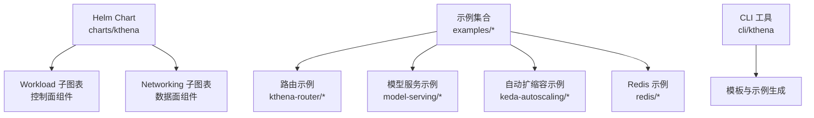
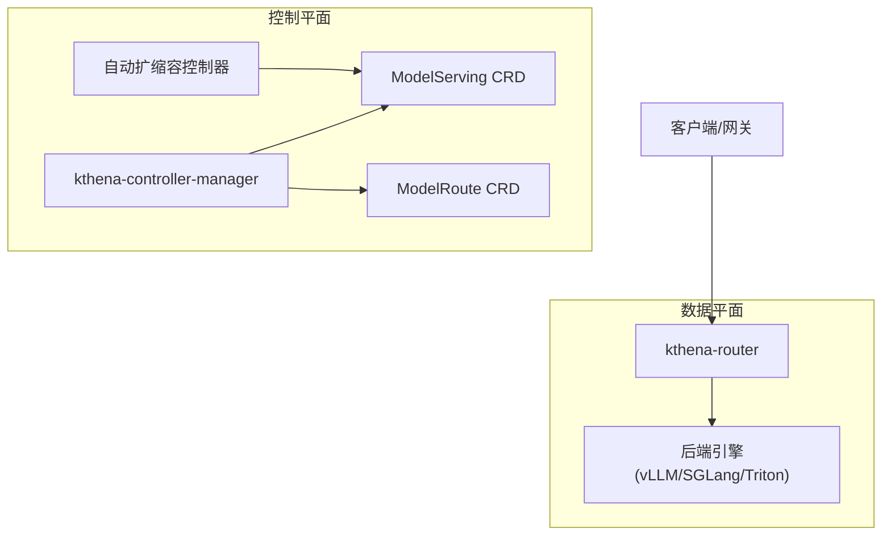
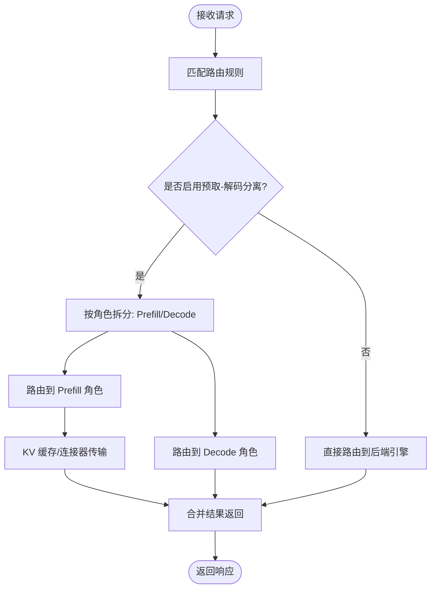
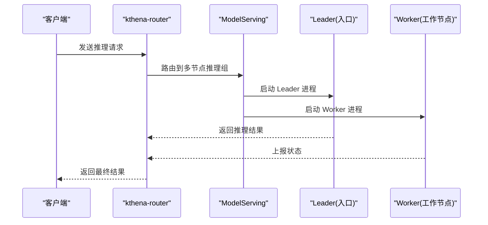
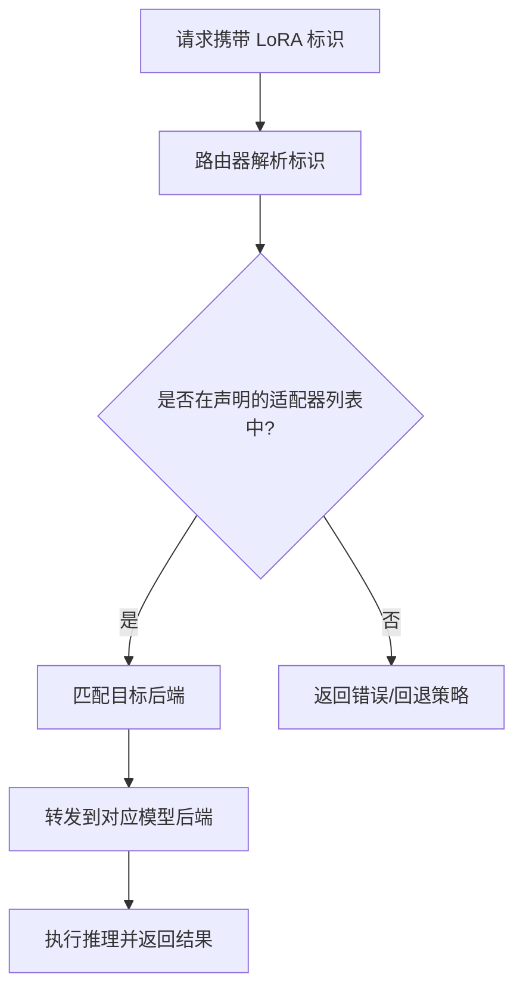
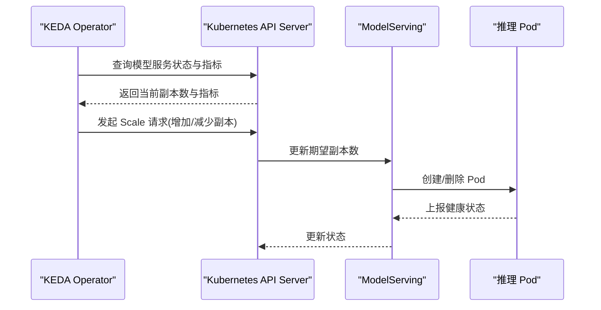
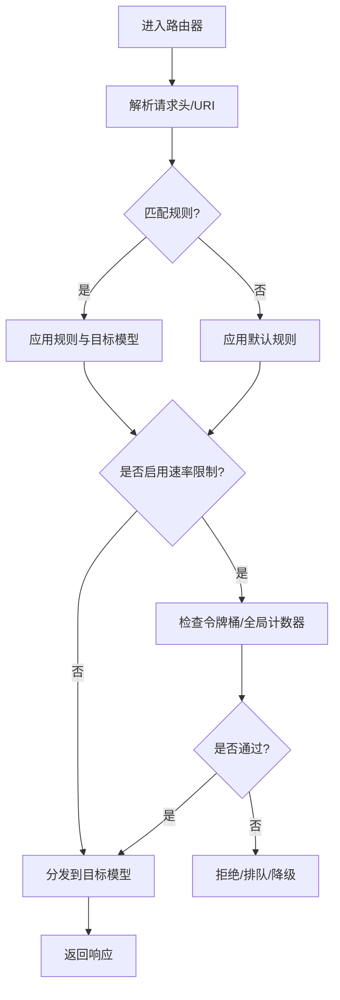
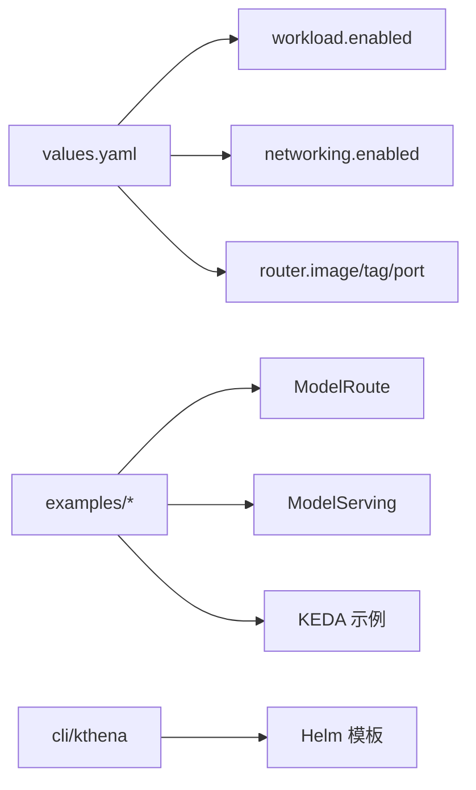

# 示例与最佳实践

<cite>
**本文引用的文件**
- [README.md](file://README.md)
- [charts/kthena/README.md](file://charts/kthena/README.md)
- [charts/kthena/values.yaml](file://charts/kthena/values.yaml)
- [cli/kthena/main.go](file://cli/kthena/main.go)
- [examples/README.md](file://examples/README.md)
- [examples/kthena-router/ModelRoute-prefill-decode-disaggregation.yaml](file://examples/kthena-router/ModelRoute-prefill-decode-disaggregation.yaml)
- [examples/kthena-router/ModelRouteMultiModels.yaml](file://examples/kthena-router/ModelRouteMultiModels.yaml)
- [examples/kthena-router/ModelRouteLora.yaml](file://examples/kthena-router/ModelRouteLora.yaml)
- [examples/kthena-router/ModelRouteWithRateLimit.yaml](file://examples/kthena-router/ModelRouteWithRateLimit.yaml)
- [examples/kthena-router/ModelRouteWithGlobalRateLimit.yaml](file://examples/kthena-router/ModelRouteWithGlobalRateLimit.yaml)
- [examples/model-serving/prefill-decode-disaggregation.yaml](file://examples/model-serving/prefill-decode-disaggregation.yaml)
- [examples/model-serving/multi-node.yaml](file://examples/model-serving/multi-node.yaml)
- [examples/keda-autoscaling/modelserving.yaml](file://examples/keda-autoscaling/modelserving.yaml)
- [examples/keda-autoscaling/rbac.yaml](file://examples/keda-autoscaling/rbac.yaml)
- [examples/redis/redis-standalone.yaml](file://examples/redis/redis-standalone.yaml)
</cite>

## 目录
1. [简介](#简介)
2. [项目结构](#项目结构)
3. [核心组件](#核心组件)
4. [架构总览](#架构总览)
5. [详细组件分析](#详细组件分析)
6. [依赖关系分析](#依赖关系分析)
7. [性能考虑](#性能考虑)
8. [故障排查指南](#故障排查指南)
9. [结论](#结论)
10. [附录](#附录)

## 简介
本指南面向希望在生产环境中稳定、高效地部署与运维大模型（LLM）推理服务的工程团队，系统性整理了 Kthena 平台的示例与最佳实践。内容覆盖从基础到高级的完整配置路径，包括：
- 预取-解码分离（Prefill-Decode Disaggregation）
- 多节点推理（Multi-Node Inference）
- 动态 LoRA 管理（LoRA Adapter Aware Routing）
- 自动扩缩容（含 KEDA 集成）
- 路由与流量控制（速率限制、全局限流、多模型路由）
- 性能优化与成本控制策略
- 常见问题与排障案例
- 不同规模与需求的企业参考模板

Kthena 通过声明式 CRD 管理模型生命周期，结合智能路由与调度能力，支持 vLLM、SGLang、Triton 等后端引擎，并提供网络拓扑感知调度、分组调度（Gang Scheduling）、零停机滚动更新等企业级特性。

章节来源
- [README.md:24-66](file://README.md#L24-L66)

## 项目结构
Kthena 的示例与最佳实践主要分布在以下位置：
- charts/kthena：Helm Chart 及默认值，用于一键安装控制面与数据面组件
- examples：各类自定义资源（CR）示例，覆盖路由、模型服务、自动扩缩容、Redis 集成等
- cli/kthena：CLI 工具，提供模板生成与示例管理能力
- docs：官方文档与博客，包含架构、用户指南、开发者指南与参考说明

章节来源
- [charts/kthena/README.md:1-255](file://charts/kthena/README.md#L1-L255)
- [examples/README.md:1-2](file://examples/README.md#L1-L2)
- [cli/kthena/main.go:28-34](file://cli/kthena/main.go#L28-L34)

## 核心组件
- 控制面（Workload 子图表）
  - kthena-controller-manager：负责模型生命周期、滚动更新、扩缩容策略绑定、Webhook 校验与注入
  - 下载器镜像与运行时镜像：统一模型下载与推理运行环境
- 数据面（Networking 子图表）
  - kthena-router：请求分类、负载均衡、路由决策、速率限制、公平调度、网关 API 支持
- Helm Chart 默认值
  - 控制面与数据面镜像仓库、标签、拉取策略
  - 路由器端口、调试端口、TLS 与 Webhook 配置
  - 公平调度、Gateway API 与推理扩展开关
  - 全局证书管理模式（auto/cert-manager/manual）

章节来源
- [charts/kthena/values.yaml:1-97](file://charts/kthena/values.yaml#L1-L97)
- [charts/kthena/README.md:165-213](file://charts/kthena/README.md#L165-L213)

## 架构总览
Kthena 将控制平面与数据平面解耦，分别管理模型生命周期与流量路由。控制面通过 CRD 与 Volcano 调度器协作；数据面通过路由器进行请求分发与策略执行。

章节来源
- [README.md:53-66](file://README.md#L53-L66)

## 详细组件分析

### 预取-解码分离（Prefill-Decode Disaggregation）
设计思路
- 将计算密集的预取阶段与持续的解码阶段拆分为独立角色（prefill/decode），分别部署与调度
- 通过 KV 缓存或连接器在角色间传输中间状态，降低重复计算与带宽占用
- 适合高吞吐、低延迟的在线推理场景，满足不同阶段的资源与延迟要求

适用场景
- 大语言模型在线服务，需要严格控制首 Token 延迟与整体吞吐
- 多租户共享集群，需隔离不同阶段的资源争用

实现要点（基于示例）
- 使用 ModelServing 定义 prefill 与 decode 角色，分别配置推理引擎参数与资源配额
- 在角色容器中启用 KV 传输配置，指定连接器类型、并行度与端口
- 通过 ModelRoute 将请求路由至对应角色，或在多模型场景下按规则分流

章节来源
- [examples/model-serving/prefill-decode-disaggregation.yaml:1-256](file://examples/model-serving/prefill-decode-disaggregation.yaml#L1-L256)
- [examples/kthena-router/ModelRoute-prefill-decode-disaggregation.yaml:1-12](file://examples/kthena-router/ModelRoute-prefill-decode-disaggregation.yaml#L1-L12)

### 多节点推理（Multi-Node Inference）
设计思路
- 通过分组调度（Gang Scheduling）保证分布式推理实例的原子性部署
- 使用 Leader/Worker 模型，配合 Ray 或进程内通信完成多节点协同
- 适用于超大规模模型（如 405B 参数级）的在线服务

适用场景
- 需要跨多个节点进行张量/流水线并行的大模型推理
- 对可用性与一致性有较高要求的生产环境

实现要点（基于示例）
- 在 ModelServing 中定义角色与最小可调度副本数，启用 Gang Policy
- 为 Leader/Worker 分别配置资源、命令与卷挂载，确保共享内存与存储一致
- 通过环境变量传递集群地址，使 Worker 能正确连接到 Leader

章节来源
- [examples/model-serving/multi-node.yaml:1-82](file://examples/model-serving/multi-node.yaml#L1-L82)

### 动态 LoRA 管理（LoRA Adapter Aware Routing）
设计思路
- 通过 ModelRoute 的 loraAdapters 字段声明可用适配器列表
- 路由规则根据请求中的 LoRA 标识选择目标后端，实现热切换与无感更新
- 适合多租户或多场景定制化推理需求

适用场景
- 需要快速切换不同 LoRA 适配器以适配不同领域或风格
- 无需重启服务即可上线/下线特定适配器

实现要点（基于示例）
- 在 ModelRoute 中声明 loraAdapters 列表与路由规则
- 在后端 ModelServer 或 ModelServing 中加载对应适配器
- 通过请求头或参数携带 LoRA 名称，由路由器进行匹配与路由

章节来源
- [examples/kthena-router/ModelRouteLora.yaml:1-14](file://examples/kthena-router/ModelRouteLora.yaml#L1-L14)

### 自动扩缩容（含 KEDA 集成）
设计思路
- 结合 KEDA 的 ScaledObject 与指标监控，对 ModelServing 实例进行基于请求量、队列长度或自定义指标的弹性伸缩
- 通过 RBAC 授权 KEDA 访问模型服务的 scale 接口，实现安全可控的自动化扩缩容

适用场景
- 流量波动较大、需要快速响应的在线服务
- 成本敏感场景，需在低峰期释放资源以降低成本

实现要点（基于示例）
- 使用 KEDA 的 ScaledObject 关联 ModelServing，配置触发条件与目标值
- 为 KEDA 操作者授予读写模型服务与 scale 子资源的权限
- 在模型服务中暴露健康检查与指标端点，供 KEDA 抓取

章节来源
- [examples/keda-autoscaling/modelserving.yaml:1-45](file://examples/keda-autoscaling/modelserving.yaml#L1-L45)
- [examples/keda-autoscaling/rbac.yaml:1-35](file://examples/keda-autoscaling/rbac.yaml#L1-L35)

### 路由与流量控制（速率限制、全局限流、多模型路由）
设计思路
- 通过 ModelRoute 定义规则与目标模型，支持按请求头、URI 模式等进行匹配
- 在规则级别或全局级别设置速率限制，保障服务质量与公平性
- 支持多模型路由，实现不同用户类型或业务场景的差异化服务

适用场景
- 多租户或多等级服务（Premium/Basic）的差异化路由
- 防止突发流量冲击后端，保障 SLA

实现要点（基于示例）
- 在 ModelRoute 中定义 rules 与 targetModels，实现按条件路由
- 在规则或全局层设置 rateLimit，控制输入/输出令牌速率
- 如需跨实例全局限流，配置 Redis 地址以共享计数器

章节来源
- [examples/kthena-router/ModelRouteMultiModels.yaml:1-19](file://examples/kthena-router/ModelRouteMultiModels.yaml#L1-L19)
- [examples/kthena-router/ModelRouteWithRateLimit.yaml:1-18](file://examples/kthena-router/ModelRouteWithRateLimit.yaml#L1-L18)
- [examples/kthena-router/ModelRouteWithGlobalRateLimit.yaml:1-22](file://examples/kthena-router/ModelRouteWithGlobalRateLimit.yaml#L1-L22)

### Redis 集成（KV 缓存与评分插件）
设计思路
- 当使用 KV 缓存或评分插件时，需要单独部署 Redis，并在 Kthena 组件中读取连接信息
- 通过 ConfigMap 与 Secret 提供主机、端口与密码等配置

适用场景
- 需要跨请求复用 KV 缓存以提升吞吐
- 需要基于评分策略进行路由或限流

实现要点（基于示例）
- 应用 examples/redis/redis-standalone.yaml 快速部署 Redis
- 在 kthena-system 命名空间中创建 redis-config ConfigMap 与 redis-secret Secret
- Kthena 组件自动读取配置并建立连接

章节来源
- [charts/kthena/README.md:214-254](file://charts/kthena/README.md#L214-L254)
- [examples/redis/redis-standalone.yaml](file://examples/redis/redis-standalone.yaml)

## 依赖关系分析
- Helm Chart 与子图表
  - workload 与 networking 子图表分别管理控制面与数据面组件
  - values.yaml 提供镜像、端口、TLS、Webhook、公平调度与 Gateway API 开关
- 示例与 CRD 的耦合
  - ModelRoute 依赖 ModelServer/ModelServing 的存在与健康状态
  - 自动扩缩容示例依赖 KEDA 与 RBAC 权限
  - 预取-解码分离示例依赖后端引擎与 KV 传输配置
- CLI 与模板
  - cli/kthena 通过嵌入的 Helm 模板提供示例生成能力

章节来源
- [charts/kthena/values.yaml:1-97](file://charts/kthena/values.yaml#L1-L97)
- [cli/kthena/main.go:28-34](file://cli/kthena/main.go#L28-L34)

## 性能考虑
- 资源规划
  - 预取-解码分离场景下，为 prefill 与 decode 角色分别设置 CPU/内存/GPU 配额，避免互相抢占
  - 多节点推理场景下，确保共享内存卷大小与 GPU 数量满足并行需求
- 吞吐与延迟
  - 合理设置 max-num-batched-tokens、tensor-parallel-size、pipeline-parallel-size 等参数
  - 使用 KV 缓存与连接器减少重复计算与网络传输
- 速率限制与公平性
  - 在路由层设置合理的速率限制，防止突发流量导致尾延迟上升
  - 启用公平调度（fairness）以平衡不同用户的资源占用
- 成本控制
  - 结合 KEDA 自动扩缩容，在低峰期回收资源
  - 使用分层路由区分高优与低优流量，优先保障关键业务

## 故障排查指南
- 路由不生效
  - 检查 ModelRoute 的 rules 是否与请求匹配（请求头/URI 模式）
  - 确认目标 ModelServer/ModelServing 是否已创建且处于健康状态
- 速率限制异常
  - 校验 rateLimit 配置单位与数值是否合理
  - 若使用全局限流，确认 Redis 地址与连通性
- 自动扩缩容无效
  - 检查 KEDA ScaledObject 与 RBAC 授权是否正确
  - 确认指标抓取端点可达且返回有效数据
- 预取-解码分离失败
  - 核对 KV 传输配置（连接器类型、端口、并行度）
  - 检查角色间网络连通性与探针健康状态
- Redis 相关问题
  - 确认 redis-config 与 redis-secret 是否存在于 kthena-system 命名空间
  - 检查密码与网络策略是否允许组件访问

章节来源
- [examples/kthena-router/ModelRouteWithRateLimit.yaml:1-18](file://examples/kthena-router/ModelRouteWithRateLimit.yaml#L1-L18)
- [examples/kthena-router/ModelRouteWithGlobalRateLimit.yaml:1-22](file://examples/kthena-router/ModelRouteWithGlobalRateLimit.yaml#L1-L22)
- [examples/keda-autoscaling/rbac.yaml:1-35](file://examples/keda-autoscaling/rbac.yaml#L1-L35)
- [charts/kthena/README.md:214-254](file://charts/kthena/README.md#L214-L254)

## 结论
通过本指南提供的示例与最佳实践，团队可以快速构建从单节点到多节点、从基础路由到高级扩缩容与动态 LoRA 管理的全栈 LLM 推理平台。建议在生产部署前完成以下步骤：
- 明确业务 SLA 与成本目标，选择合适的路由与扩缩容策略
- 基于示例进行参数调优与资源规划
- 建立完善的监控与告警体系，结合自动扩缩容与速率限制保障稳定性
- 持续迭代示例模板，形成企业内部的标准化交付流程

## 附录
- 参考模板清单
  - 预取-解码分离：[prefill-decode-disaggregation.yaml](file://examples/model-serving/prefill-decode-disaggregation.yaml)
  - 多节点推理：[multi-node.yaml](file://examples/model-serving/multi-node.yaml)
  - 动态 LoRA 管理：[ModelRouteLora.yaml](file://examples/kthena-router/ModelRouteLora.yaml)
  - 速率限制与全局限流：[ModelRouteWithRateLimit.yaml](file://examples/kthena-router/ModelRouteWithRateLimit.yaml)、[ModelRouteWithGlobalRateLimit.yaml](file://examples/kthena-router/ModelRouteWithGlobalRateLimit.yaml)
  - 自动扩缩容（KEDA）：[modelserving.yaml](file://examples/keda-autoscaling/modelserving.yaml)、[rbac.yaml](file://examples/keda-autoscaling/rbac.yaml)
  - Redis 集成：[redis-standalone.yaml](file://examples/redis/redis-standalone.yaml)
  - Helm 安装与配置：[charts/kthena/README.md](file://charts/kthena/README.md)、[charts/kthena/values.yaml](file://charts/kthena/values.yaml)
  - CLI 模板生成：[cli/kthena/main.go](file://cli/kthena/main.go)