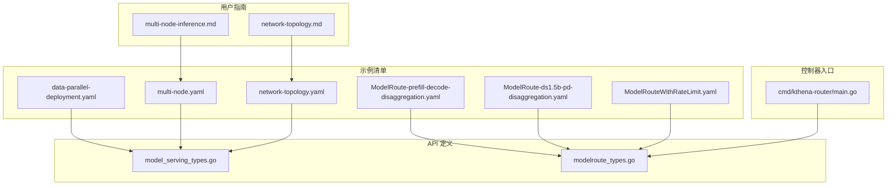
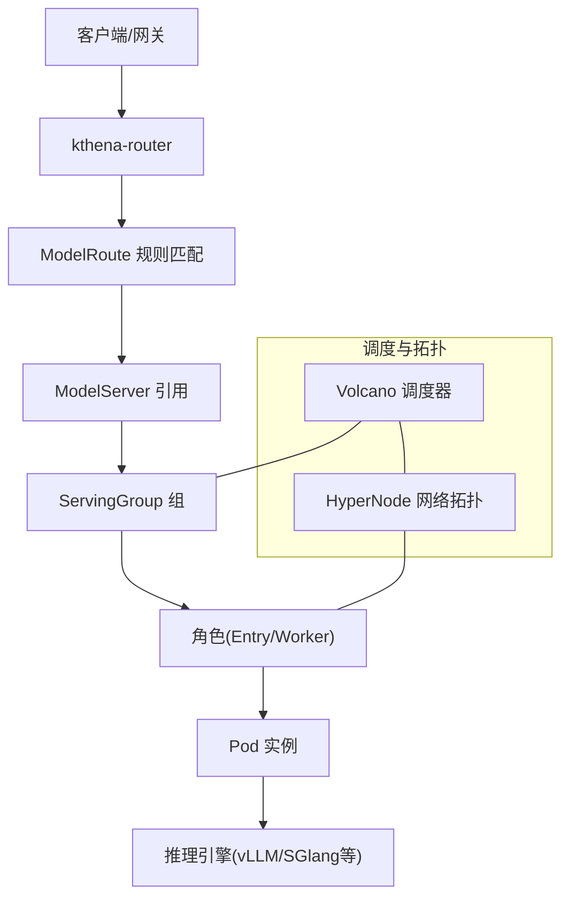
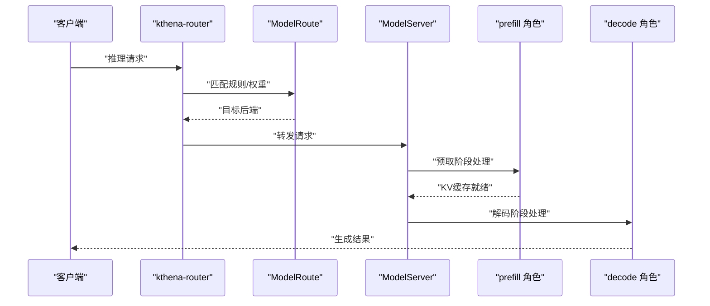
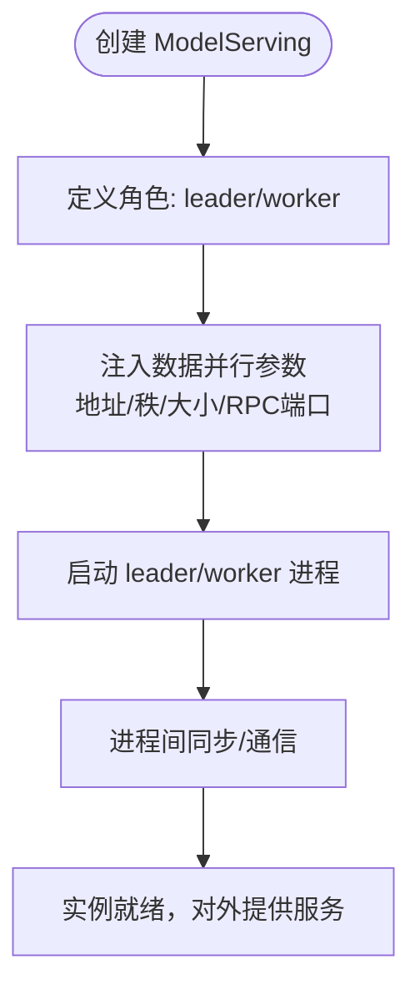
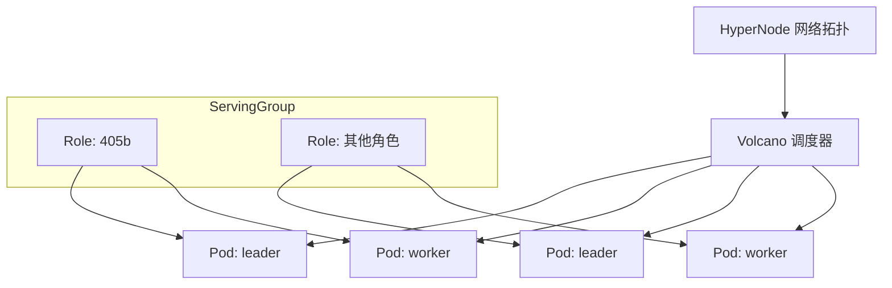
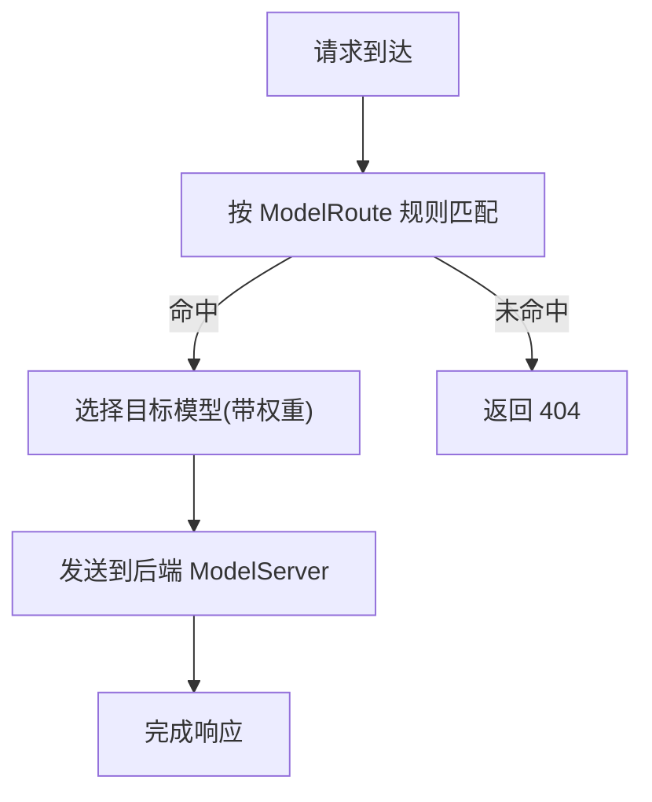
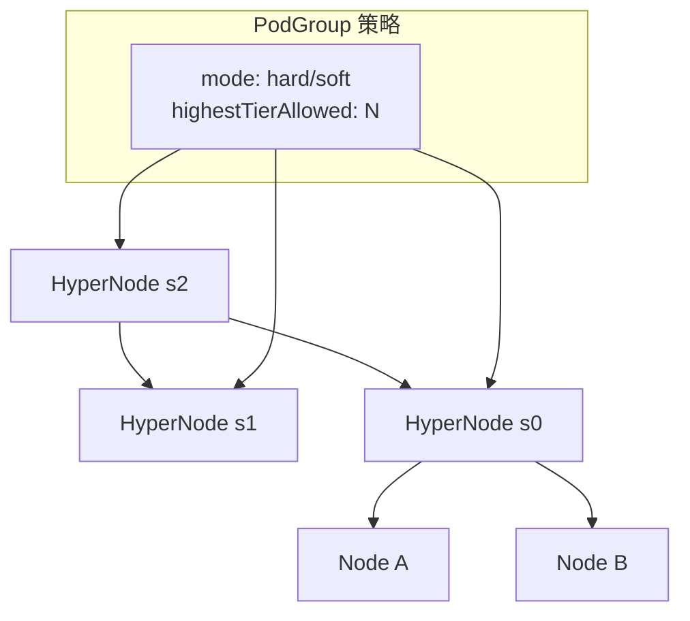
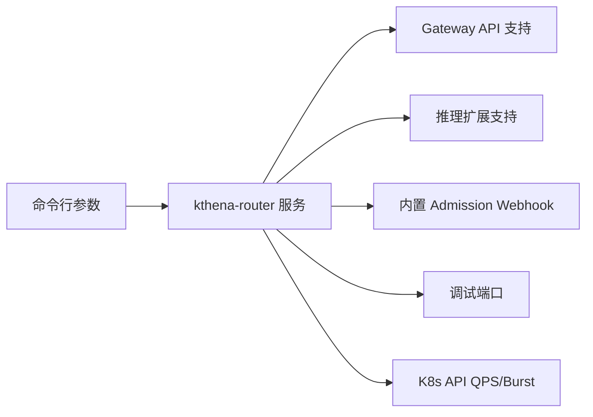

# 高级配置示例

<cite>
**本文引用的文件**
- [examples/kthena-router/ModelRoute-prefill-decode-disaggregation.yaml](file://examples/kthena-router/ModelRoute-prefill-decode-disaggregation.yaml)
- [examples/kthena-router/ModelRoute-ds1.5b-pd-disaggregation.yaml](file://examples/kthena-router/ModelRoute-ds1.5b-pd-disaggregation.yaml)
- [examples/kthena-router/ModelRouteWithRateLimit.yaml](file://examples/kthena-router/ModelRouteWithRateLimit.yaml)
- [examples/model-serving/data-parallel-deployment.yaml](file://examples/model-serving/data-parallel-deployment.yaml)
- [examples/model-serving/multi-node.yaml](file://examples/model-serving/multi-node.yaml)
- [examples/model-serving/network-topology.yaml](file://examples/model-serving/network-topology.yaml)
- [docs/kthena/docs/user-guide/multi-node-inference.md](file://docs/kthena/docs/user-guide/multi-node-inference.md)
- [docs/kthena/docs/user-guide/network-topology.md](file://docs/kthena/docs/user-guide/network-topology.md)
- [pkg/apis/networking/v1alpha1/modelroute_types.go](file://pkg/apis/networking/v1alpha1/modelroute_types.go)
- [pkg/apis/workload/v1alpha1/model_serving_types.go](file://pkg/apis/workload/v1alpha1/model_serving_types.go)
- [cmd/kthena-router/main.go](file://cmd/kthena-router/main.go)
</cite>

## 目录
1. [简介](#简介)
2. [项目结构](#项目结构)
3. [核心组件](#核心组件)
4. [架构总览](#架构总览)
5. [详细组件分析](#详细组件分析)
6. [依赖分析](#依赖分析)
7. [性能考虑](#性能考虑)
8. [故障排查指南](#故障排查指南)
9. [结论](#结论)
10. [附录](#附录)

## 简介
本文件面向需要在生产环境中进行高性能、可扩展的大模型推理部署的工程师，系统性地给出 Kthena 的高级配置示例与实践指南。重点覆盖以下主题：
- 预取-解码分离（Prefill-Decode Disaggregation）
- 数据并行部署（Data Parallel Deployment）
- 多节点推理（Multi-Node Inference）
- 路由规则与负载均衡策略
- 网络拓扑感知调度（Network Topology Aware Scheduling）
- 性能对比与调优建议
- 故障排查与可观测性

通过结合 CRD 定义、示例清单与控制器实现，帮助读者在不同硬件与业务场景下完成最优配置。

## 项目结构
围绕“高级配置示例”的目标，本文涉及的关键目录与文件如下：
- 示例清单：examples/model-serving 与 examples/kthena-router 下的 YAML 清单，用于演示多节点、数据并行、预取-解码分离与路由限流等能力
- 用户指南：docs/kthena/docs/user-guide 下的多节点推理与网络拓扑文档，提供概念说明与实操步骤
- API 定义：pkg/apis 下的 CRD 类型定义，明确字段语义与约束
- 控制器入口：cmd/kthena-router/main.go，展示路由服务启动参数与功能开关

**图表来源**
- [examples/model-serving/data-parallel-deployment.yaml:1-150](file://examples/model-serving/data-parallel-deployment.yaml#L1-L150)
- [examples/model-serving/multi-node.yaml:1-82](file://examples/model-serving/multi-node.yaml#L1-L82)
- [examples/model-serving/network-topology.yaml:1-73](file://examples/model-serving/network-topology.yaml#L1-L73)
- [examples/kthena-router/ModelRoute-prefill-decode-disaggregation.yaml:1-12](file://examples/kthena-router/ModelRoute-prefill-decode-disaggregation.yaml#L1-L12)
- [examples/kthena-router/ModelRoute-ds1.5b-pd-disaggregation.yaml:1-12](file://examples/kthena-router/ModelRoute-ds1.5b-pd-disaggregation.yaml#L1-L12)
- [examples/kthena-router/ModelRouteWithRateLimit.yaml:1-18](file://examples/kthena-router/ModelRouteWithRateLimit.yaml#L1-L18)
- [docs/kthena/docs/user-guide/multi-node-inference.md:1-451](file://docs/kthena/docs/user-guide/multi-node-inference.md#L1-L451)
- [docs/kthena/docs/user-guide/network-topology.md:1-207](file://docs/kthena/docs/user-guide/network-topology.md#L1-L207)
- [pkg/apis/workload/v1alpha1/model_serving_types.go:1-262](file://pkg/apis/workload/v1alpha1/model_serving_types.go#L1-L262)
- [pkg/apis/networking/v1alpha1/modelroute_types.go:1-194](file://pkg/apis/networking/v1alpha1/modelroute_types.go#L1-L194)
- [cmd/kthena-router/main.go:1-226](file://cmd/kthena-router/main.go#L1-L226)

**章节来源**
- [examples/model-serving/data-parallel-deployment.yaml:1-150](file://examples/model-serving/data-parallel-deployment.yaml#L1-L150)
- [examples/model-serving/multi-node.yaml:1-82](file://examples/model-serving/multi-node.yaml#L1-L82)
- [examples/model-serving/network-topology.yaml:1-73](file://examples/model-serving/network-topology.yaml#L1-L73)
- [examples/kthena-router/ModelRoute-prefill-decode-disaggregation.yaml:1-12](file://examples/kthena-router/ModelRoute-prefill-decode-disaggregation.yaml#L1-L12)
- [examples/kthena-router/ModelRoute-ds1.5b-pd-disaggregation.yaml:1-12](file://examples/kthena-router/ModelRoute-ds1.5b-pd-disaggregation.yaml#L1-L12)
- [examples/kthena-router/ModelRouteWithRateLimit.yaml:1-18](file://examples/kthena-router/ModelRouteWithRateLimit.yaml#L1-L18)
- [docs/kthena/docs/user-guide/multi-node-inference.md:1-451](file://docs/kthena/docs/user-guide/multi-node-inference.md#L1-L451)
- [docs/kthena/docs/user-guide/network-topology.md:1-207](file://docs/kthena/docs/user-guide/network-topology.md#L1-L207)
- [pkg/apis/workload/v1alpha1/model_serving_types.go:1-262](file://pkg/apis/workload/v1alpha1/model_serving_types.go#L1-L262)
- [pkg/apis/networking/v1alpha1/modelroute_types.go:1-194](file://pkg/apis/networking/v1alpha1/modelroute_types.go#L1-L194)
- [cmd/kthena-router/main.go:1-226](file://cmd/kthena-router/main.go#L1-L226)

## 核心组件
- ModelServing（工作负载层）：定义推理任务的分组、角色、副本与滚动更新策略；支持网络拓扑与调度策略（含 Volcano Gang 与 HyperNode）
- ModelRoute（路由层）：定义请求到后端 ModelServer 的匹配规则、权重与全局/本地限流
- kthena-router（控制面）：提供路由服务、可选的 Admission Webhook、Gateway API 支持与调试端口

这些组件共同构成“预取-解码分离”“数据并行”“多节点推理”等高级特性的落地基础。

**章节来源**
- [pkg/apis/workload/v1alpha1/model_serving_types.go:35-182](file://pkg/apis/workload/v1alpha1/model_serving_types.go#L35-L182)
- [pkg/apis/networking/v1alpha1/modelroute_types.go:24-148](file://pkg/apis/networking/v1alpha1/modelroute_types.go#L24-L148)
- [cmd/kthena-router/main.go:40-122](file://cmd/kthena-router/main.go#L40-L122)

## 架构总览
下图展示了从请求进入路由层，到通过 ModelRoute 匹配到后端 ModelServer，再到 ModelServing 执行多节点/数据并行/预取-解码分离的总体流程。

**图表来源**
- [cmd/kthena-router/main.go:67-80](file://cmd/kthena-router/main.go#L67-L80)
- [pkg/apis/networking/v1alpha1/modelroute_types.go:24-148](file://pkg/apis/networking/v1alpha1/modelroute_types.go#L24-L148)
- [pkg/apis/workload/v1alpha1/model_serving_types.go:35-182](file://pkg/apis/workload/v1alpha1/model_serving_types.go#L35-L182)
- [docs/kthena/docs/user-guide/network-topology.md:23-77](file://docs/kthena/docs/user-guide/network-topology.md#L23-L77)

## 详细组件分析

### 预取-解码分离（Prefill-Decode Disaggregation）
- 概念说明：将“预取阶段”（构建 KV 缓存）与“解码阶段”（增量生成）拆分到不同角色或实例，以提升资源利用率与吞吐
- 在 Kthena 中，可通过为 ModelServing 定义多个角色（如 prefill/decode），并在路由层对不同阶段进行差异化调度与访问
- 示例清单中提供了基于 ModelRoute 的预取-解码分离配置样例，便于将不同阶段映射到不同后端或实例

**图表来源**
- [examples/kthena-router/ModelRoute-prefill-decode-disaggregation.yaml:1-12](file://examples/kthena-router/ModelRoute-prefill-decode-disaggregation.yaml#L1-L12)
- [examples/kthena-router/ModelRoute-ds1.5b-pd-disaggregation.yaml:1-12](file://examples/kthena-router/ModelRoute-ds1.5b-pd-disaggregation.yaml#L1-L12)

**章节来源**
- [examples/kthena-router/ModelRoute-prefill-decode-disaggregation.yaml:1-12](file://examples/kthena-router/ModelRoute-prefill-decode-disaggregation.yaml#L1-L12)
- [examples/kthena-router/ModelRoute-ds1.5b-pd-disaggregation.yaml:1-12](file://examples/kthena-router/ModelRoute-ds1.5b-pd-disaggregation.yaml#L1-L12)

### 数据并行部署（Data Parallel Deployment）
- 概念说明：在同一模型上使用多个实例（通常为 GPU 多卡）进行并行计算，通过进程间通信实现同步
- 在 Kthena 中，通过 ModelServing 的角色与模板，为 leader/worker 分别注入数据并行相关参数（地址、rank、size、RPC 端口等），实现多实例协同
- 示例清单展示了 vLLM 的数据并行参数配置方式，包括 rank、size、RPC 端口等

**图表来源**
- [examples/model-serving/data-parallel-deployment.yaml:11-149](file://examples/model-serving/data-parallel-deployment.yaml#L11-L149)

**章节来源**
- [examples/model-serving/data-parallel-deployment.yaml:1-150](file://examples/model-serving/data-parallel-deployment.yaml#L1-L150)

### 多节点推理（Multi-Node Inference）
- 概念说明：借助 Volcano 的 Gang 调度与 HyperNode 网络拓扑，将模型切分到多个节点协同完成推理
- 关键点：
  - 通过 Role 定义不同功能组件（如 leader/worker）
  - 使用 tensor 并行与 pipeline 并行参数控制模型切分
  - 使用 Gang Policy 保证多 Pod 同时调度
  - 使用网络拓扑策略降低跨节点通信延迟

**图表来源**
- [examples/model-serving/multi-node.yaml:14-81](file://examples/model-serving/multi-node.yaml#L14-L81)
- [docs/kthena/docs/user-guide/multi-node-inference.md:109-194](file://docs/kthena/docs/user-guide/multi-node-inference.md#L109-L194)

**章节来源**
- [examples/model-serving/multi-node.yaml:1-82](file://examples/model-serving/multi-node.yaml#L1-L82)
- [docs/kthena/docs/user-guide/multi-node-inference.md:1-451](file://docs/kthena/docs/user-guide/multi-node-inference.md#L1-L451)

### 路由规则与负载均衡策略
- ModelRoute 提供基于请求头、URI、请求体等条件的匹配规则，并支持为不同目标指定权重，实现灰度/蓝绿/金丝雀等流量分配
- 支持本地/全局限流，全局限流可基于 Redis 实现跨实例一致性

**图表来源**
- [pkg/apis/networking/v1alpha1/modelroute_types.go:58-120](file://pkg/apis/networking/v1alpha1/modelroute_types.go#L58-L120)
- [examples/kthena-router/ModelRouteWithRateLimit.yaml:1-18](file://examples/kthena-router/ModelRouteWithRateLimit.yaml#L1-L18)

**章节来源**
- [pkg/apis/networking/v1alpha1/modelroute_types.go:24-148](file://pkg/apis/networking/v1alpha1/modelroute_types.go#L24-L148)
- [examples/kthena-router/ModelRouteWithRateLimit.yaml:1-18](file://examples/kthena-router/ModelRouteWithRateLimit.yaml#L1-L18)

### 网络拓扑设置（Network Topology Aware Scheduling）
- 通过 Volcano 的 HyperNode 将节点组织为层级拓扑，Kthena 在 PodGroup 上设置网络拓扑策略，使调度器尽量将相关 Pod 放置在同一层级内
- 支持硬约束（hard）与软约束（soft），并可限制最高允许层级

**图表来源**
- [docs/kthena/docs/user-guide/network-topology.md:23-77](file://docs/kthena/docs/user-guide/network-topology.md#L23-L77)
- [examples/model-serving/network-topology.yaml:11-17](file://examples/model-serving/network-topology.yaml#L11-L17)

**章节来源**
- [docs/kthena/docs/user-guide/network-topology.md:1-207](file://docs/kthena/docs/user-guide/network-topology.md#L1-L207)
- [examples/model-serving/network-topology.yaml:1-73](file://examples/model-serving/network-topology.yaml#L1-L73)

## 依赖分析
- 控制器参数与功能开关
  - kthena-router 支持通过命令行参数启用/禁用 Webhook、Gateway API 及其推理扩展，以及设置证书、服务名、调试端口、K8s API QPS/Burst 等
  - 这些参数直接影响路由服务的可用性与稳定性，需结合集群规模与安全策略进行配置

**图表来源**
- [cmd/kthena-router/main.go:67-80](file://cmd/kthena-router/main.go#L67-L80)
- [cmd/kthena-router/main.go:115-121](file://cmd/kthena-router/main.go#L115-L121)

**章节来源**
- [cmd/kthena-router/main.go:1-226](file://cmd/kthena-router/main.go#L1-L226)

## 性能考虑
- 预取-解码分离
  - 将高内存占用的预取阶段与低延迟的解码阶段分离，可显著提升并发与资源利用率
  - 建议为不同阶段配置独立的 GPU/内存资源与亲和策略，避免互相争抢
- 数据并行
  - 合理设置 data-parallel-size 与 RPC 端口，确保进程间通信稳定
  - 注意 GPU 内存利用率与队列长度，避免过载导致尾延迟上升
- 多节点推理
  - 使用 HyperNode 将通信频繁的 Pod 放置在同一层级，减少跨层通信
  - Gang 调度确保多 Pod 同步上线，避免部分实例空闲造成浪费
- 路由与限流
  - 对热点模型开启全局限流，防止突发流量压垮后端
  - 结合权重实现渐进式流量切换，降低风险

[本节为通用指导，不直接分析具体文件]

## 故障排查指南
- 多节点推理
  - 若 Pod 长期处于 Pending，检查 PodGroup 状态与 minTaskMember 是否满足 Gang 要求
  - 查看 Volcano 调度器日志，确认网络拓扑策略是否生效
  - 校验资源配额与节点亲和/污点设置
- 路由与限流
  - 若出现 404，确认 ModelRoute 规则是否正确匹配
  - 全局限流异常时，检查 Redis 地址与连接状态
- 控制器与路由
  - Webhook 证书缺失会导致路由校验失败，需确保证书 Secret 或自动生成流程正常
  - 调试端口可用于本地诊断，观察路由行为与请求路径

**章节来源**
- [docs/kthena/docs/user-guide/multi-node-inference.md:375-430](file://docs/kthena/docs/user-guide/multi-node-inference.md#L375-L430)
- [cmd/kthena-router/main.go:135-195](file://cmd/kthena-router/main.go#L135-L195)

## 结论
通过将“预取-解码分离”“数据并行”“多节点推理”与“网络拓扑感知调度”相结合，Kthena 能够在复杂硬件环境下实现高吞吐、低延迟与高可用的大模型推理服务。配合灵活的路由规则与限流策略，可在不同业务场景下实现平滑扩容、灰度发布与风险可控的流量治理。

[本节为总结性内容，不直接分析具体文件]

## 附录
- 快速对照表（关键字段与影响）
  - 数据并行 size/rank/address/RPC 端口：决定实例数量与通信稳定性
  - 多节点 tensor-parallel-size/pipeline-parallel-size：决定模型切分与跨节点协作
  - Gang Policy minRoleReplicas：决定 Gang 调度阈值
  - 网络拓扑 mode/highestTierAllowed：决定调度严格程度与层级上限
  - 路由规则 headers/uri/body/model：决定请求匹配与目标选择
  - 限流 input/output tokens per unit：决定流量削峰与公平性

[本节为概览性内容，不直接分析具体文件]