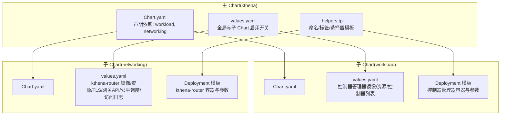
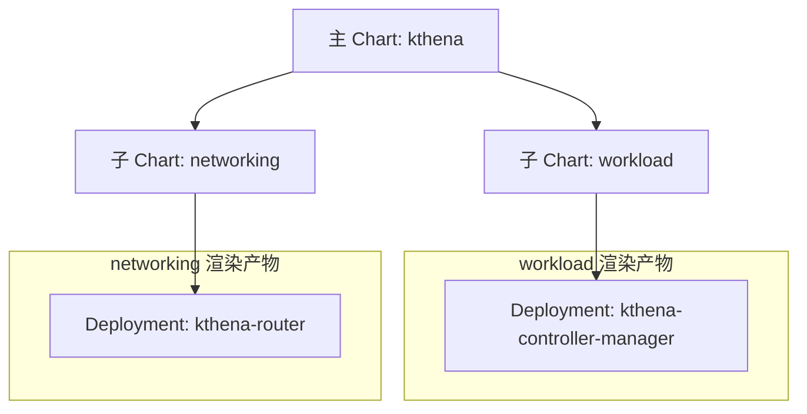
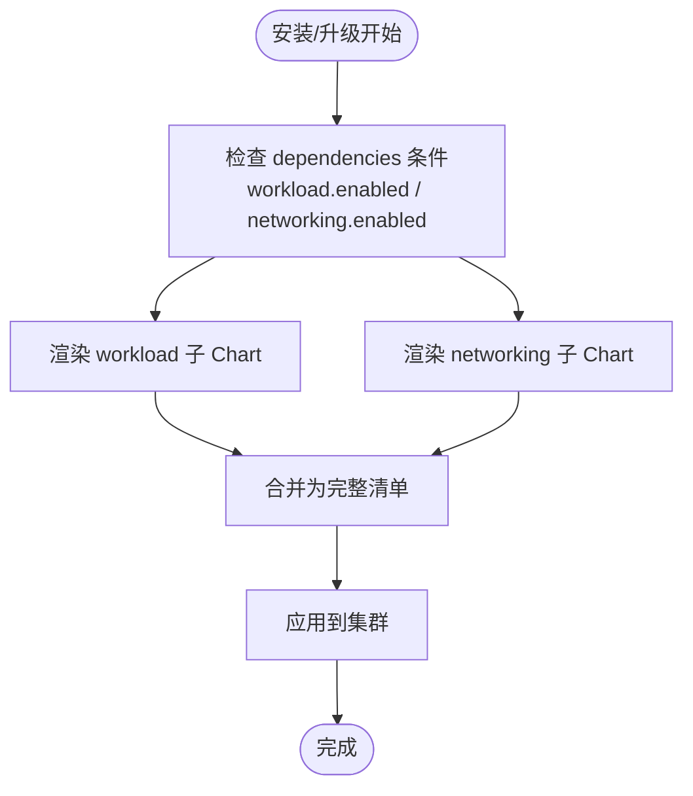

# Helm Charts 部署

<cite>
**本文引用的文件**
- [charts/kthena/Chart.yaml](file://charts/kthena/Chart.yaml)
- [charts/kthena/values.yaml](file://charts/kthena/values.yaml)
- [charts/kthena/values.schema.json](file://charts/kthena/values.schema.json)
- [charts/kthena/README.md](file://charts/kthena/README.md)
- [charts/kthena/templates/_helpers.tpl](file://charts/kthena/templates/_helpers.tpl)
- [charts/kthena/charts/workload/Chart.yaml](file://charts/kthena/charts/workload/Chart.yaml)
- [charts/kthena/charts/workload/values.yaml](file://charts/kthena/charts/workload/values.yaml)
- [charts/kthena/charts/workload/templates/kthena-controller-manager/component/deployment.yaml](file://charts/kthena/charts/workload/templates/kthena-controller-manager/component/deployment.yaml)
- [charts/kthena/charts/networking/Chart.yaml](file://charts/kthena/charts/networking/Chart.yaml)
- [charts/kthena/charts/networking/values.yaml](file://charts/kthena/charts/networking/values.yaml)
- [charts/kthena/charts/networking/templates/kthena-router/component/deployment.yaml](file://charts/kthena/charts/networking/templates/kthena-router/component/deployment.yaml)
</cite>

## 目录
1. [简介](#简介)
2. [项目结构](#项目结构)
3. [核心组件](#核心组件)
4. [架构总览](#架构总览)
5. [详细组件分析](#详细组件分析)
6. [依赖关系分析](#依赖关系分析)
7. [性能与资源建议](#性能与资源建议)
8. [升级、回滚与卸载](#升级回滚与卸载)
9. [配置验证与故障排查](#配置验证与故障排查)
10. [结论](#结论)
11. [附录：典型部署场景示例](#附录典型部署场景示例)

## 简介
本指南面向使用 Helm 在 Kubernetes 上部署 Kthena 的用户，系统性讲解主 Chart 与子 Chart 的结构、依赖关系、values.yaml 参数与默认值，并提供单节点、高可用与多集群等典型部署场景的配置要点。同时覆盖 Helm 升级、回滚与卸载操作，以及配置验证与常见问题排查方法。

## 项目结构
Kthena 的 Helm Chart 采用“主 Chart + 子 Chart”的分层设计：
- 主 Chart（kthena）负责聚合 workload 与 networking 两个子 Chart，并通过依赖声明控制启用条件。
- 子 Chart 分别封装控制器管理器（workload）与路由服务（networking），各自拥有独立的 Chart.yaml 与 values.yaml。
- 模板通过公共 helpers 提供命名与标签规范，确保资源命名一致、可追踪。

图表来源
- [charts/kthena/Chart.yaml:1-22](file://charts/kthena/Chart.yaml#L1-L22)
- [charts/kthena/values.yaml:1-97](file://charts/kthena/values.yaml#L1-L97)
- [charts/kthena/templates/_helpers.tpl:1-52](file://charts/kthena/templates/_helpers.tpl#L1-L52)
- [charts/kthena/charts/workload/Chart.yaml:1-14](file://charts/kthena/charts/workload/Chart.yaml#L1-L14)
- [charts/kthena/charts/workload/values.yaml:1-51](file://charts/kthena/charts/workload/values.yaml#L1-L51)
- [charts/kthena/charts/networking/Chart.yaml:1-14](file://charts/kthena/charts/networking/Chart.yaml#L1-L14)
- [charts/kthena/charts/networking/values.yaml:1-92](file://charts/kthena/charts/networking/values.yaml#L1-L92)

章节来源
- [charts/kthena/Chart.yaml:1-22](file://charts/kthena/Chart.yaml#L1-L22)
- [charts/kthena/values.yaml:1-97](file://charts/kthena/values.yaml#L1-L97)
- [charts/kthena/README.md:17-106](file://charts/kthena/README.md#L17-L106)

## 核心组件
- 主 Chart（kthena）
  - 用途：聚合并统一管理 workload 与 networking 子 Chart，提供全局开关与证书管理模式。
  - 关键点：通过 dependencies 字段声明子 Chart 及其启用条件；values.yaml 提供全局参数（如证书管理模式）。
- 子 Chart：workload
  - 用途：部署 Kthena 控制器管理器（含模型服务、模型增强器、自动伸缩控制器等），并提供 webhook 支持。
  - 关键点：支持控制器列表选择、API 限速参数、下载器与运行时镜像配置。
- 子 Chart：networking
  - 用途：部署 Kthena 路由器（kthena-router），提供请求接入、网关 API 支持、公平调度与访问日志。
  - 关键点：支持 TLS、Webhook、Gateway API、公平调度与访问日志输出格式/目标。

章节来源
- [charts/kthena/Chart.yaml:15-22](file://charts/kthena/Chart.yaml#L15-L22)
- [charts/kthena/values.yaml:1-97](file://charts/kthena/values.yaml#L1-L97)
- [charts/kthena/charts/workload/Chart.yaml:1-14](file://charts/kthena/charts/workload/Chart.yaml#L1-L14)
- [charts/kthena/charts/workload/values.yaml:1-51](file://charts/kthena/charts/workload/values.yaml#L1-L51)
- [charts/kthena/charts/networking/Chart.yaml:1-14](file://charts/kthena/charts/networking/Chart.yaml#L1-L14)
- [charts/kthena/charts/networking/values.yaml:1-92](file://charts/kthena/charts/networking/values.yaml#L1-L92)

## 架构总览
下图展示主 Chart 如何通过依赖关系调用子 Chart，并在模板中渲染出最终的 Kubernetes 资源清单。

图表来源
- [charts/kthena/Chart.yaml:16-22](file://charts/kthena/Chart.yaml#L16-L22)
- [charts/kthena/charts/workload/values.yaml:1-51](file://charts/kthena/charts/workload/values.yaml#L1-L51)
- [charts/kthena/charts/networking/values.yaml:1-92](file://charts/kthena/charts/networking/values.yaml#L1-L92)

## 详细组件分析

### 主 Chart（kthena）结构与依赖
- Chart.yaml
  - 类型为 application，版本与应用版本均为语义化版本号。
  - 依赖项：
    - workload：版本 1.0.0，启用条件为 workload.enabled。
    - networking：版本 1.0.0，启用条件为 networking.enabled。
- values.yaml
  - workload.enabled：控制是否启用 workload 子 Chart。
  - networking.enabled：控制是否启用 networking 子 Chart。
  - global.certManagementMode：证书管理模式，取值 auto、cert-manager、manual。
  - global.webhook.caBundle：当证书管理模式为 manual 时，用于注入 CA Bundle。

章节来源
- [charts/kthena/Chart.yaml:1-22](file://charts/kthena/Chart.yaml#L1-L22)
- [charts/kthena/values.yaml:1-97](file://charts/kthena/values.yaml#L1-L97)

### 子 Chart：workload（控制器管理器）
- Chart.yaml
  - 应用版本与 Chart 版本均固定。
- values.yaml 关键项
  - controllerManager.replicas：控制器管理器副本数，默认 1。
  - controllerManager.image.*：镜像仓库、标签、拉取策略。
  - controllerManager.args：启动参数（如日志级别、控制器列表、API 限速等）。
  - controllerManager.resource.limits/requests：CPU/内存限制与请求。
  - controllerManager.controllers：启用的控制器集合（空表示全部启用）。
  - controllerManager.kubeAPIQPS/kubeAPIBurst：与 Kubernetes API Server 交互的速率限制。
  - downloaderImage/runtimeImage：下载器与运行时镜像配置。
  - downloader.accessKey/secretKey：下载器鉴权信息。
  - webhook.enabled 与 tls：Webhook 开关与证书密钥名称、服务名。

模板渲染要点
- Deployment 使用 values 中的镜像、资源、参数与副本数。
- 通过卷挂载方式挂载 webhook 证书密钥。

章节来源
- [charts/kthena/charts/workload/Chart.yaml:1-14](file://charts/kthena/charts/workload/Chart.yaml#L1-L14)
- [charts/kthena/charts/workload/values.yaml:1-51](file://charts/kthena/charts/workload/values.yaml#L1-L51)
- [charts/kthena/charts/workload/templates/kthena-controller-manager/component/deployment.yaml:1-75](file://charts/kthena/charts/workload/templates/kthena-controller-manager/component/deployment.yaml#L1-L75)

### 子 Chart：networking（kthena-router）
- Chart.yaml
  - 应用版本与 Chart 版本均固定。
- values.yaml 关键项
  - kthenaRouter.replicas：路由器副本数，默认 1。
  - kthenaRouter.enabled：是否启用 kthena-router。
  - kthenaRouter.port/debugPort：HTTP 与调试端口。
  - kthenaRouter.image.*：镜像仓库、标签、拉取策略。
  - kthenaRouter.tls.enabled/dnsName/secretName：TLS 开关、DNS 名称与证书密钥名称。
  - kthenaRouter.webhook.*：Webhook 开关、容器端口、服务端口、证书路径与密钥名称、服务名。
  - kthenaRouter.fairness.enabled/windowSize/inputTokenWeight/outputTokenWeight：公平调度开关与权重。
  - kthenaRouter.accessLog.enabled/format/output：访问日志开关、格式与输出位置。
  - kthenaRouter.gatewayAPI.enabled/inferenceExtension：Gateway API 与推理扩展开关。
  - kthenaRouter.kubeAPIQPS/kubeAPIBurst：与 Kubernetes API Server 交互的速率限制。
  - webhook.*：router-webhook 的镜像、资源、端口与参数。

模板渲染要点
- Deployment 使用 values 中的镜像、资源、端口、参数与副本数。
- 条件渲染 TLS 与 Webhook 证书卷。
- 注入环境变量以启用公平调度与访问日志，并读取 Redis 配置（可选）。

章节来源
- [charts/kthena/charts/networking/Chart.yaml:1-14](file://charts/kthena/charts/networking/Chart.yaml#L1-L14)
- [charts/kthena/charts/networking/values.yaml:1-92](file://charts/kthena/charts/networking/values.yaml#L1-L92)
- [charts/kthena/charts/networking/templates/kthena-router/component/deployment.yaml:1-147](file://charts/kthena/charts/networking/templates/kthena-router/component/deployment.yaml#L1-L147)

### 公共模板与命名规范
- _helpers.tpl 提供：
  - chart 名称与版本标签。
  - 组件选择器标签与通用标签。
  - 限定长度的全名生成规则，避免 DNS 命名超长。

章节来源
- [charts/kthena/templates/_helpers.tpl:1-52](file://charts/kthena/templates/_helpers.tpl#L1-L52)

## 依赖关系分析
- 主 Chart 对子 Chart 的依赖通过 Chart.yaml 的 dependencies 字段声明，启用条件来自 values.yaml 中的布尔开关。
- 子 Chart 内部不互相依赖，彼此独立渲染。
- 模板层面通过公共 helpers 统一命名与标签，便于跨子 Chart 的资源关联与运维。

图表来源
- [charts/kthena/Chart.yaml:16-22](file://charts/kthena/Chart.yaml#L16-L22)
- [charts/kthena/values.yaml:1-97](file://charts/kthena/values.yaml#L1-L97)

章节来源
- [charts/kthena/Chart.yaml:16-22](file://charts/kthena/Chart.yaml#L16-L22)
- [charts/kthena/values.yaml:1-97](file://charts/kthena/values.yaml#L1-L97)

## 性能与资源建议
- 控制器管理器（workload）
  - 默认 CPU/内存请求与限制适合作为开发或小规模测试使用；生产建议根据并发与控制器数量调整 limits/requests。
  - 若启用多个控制器，建议适当提高 kubeAPIQPS/kubeAPIBurst 以降低 API Server 压力。
- kthena-router（networking）
  - 默认资源适合轻量流量；高并发场景应提升副本数与资源配额。
  - 启用公平调度与访问日志会增加少量开销，建议按需开启。
  - 启用 TLS 会带来额外 CPU 开销，建议在边缘层做终止或使用硬件加速。

[本节为通用建议，无需特定文件引用]

## 升级、回滚与卸载
- 升级
  - 使用 helm upgrade 更新发布版本，可叠加自定义 values 文件或 --set 覆盖参数。
  - 若涉及 CRD 变更，请参考 README 中关于 CRD 的说明与注意事项。
- 回滚
  - 使用 helm rollback 回到历史版本，适用于升级失败快速恢复。
- 卸载
  - 使用 helm uninstall 删除发布；注意删除 CRD 会级联删除所有基于该 CRD 的自定义资源，务必提前备份重要数据。

章节来源
- [charts/kthena/README.md:108-132](file://charts/kthena/README.md#L108-L132)

## 配置验证与故障排查
- 验证
  - 使用 helm lint 检查 Chart 语法与最佳实践。
  - 使用 helm template --validate 生成渲染清单并进行校验。
  - 使用 helm install --dry-run 预演安装，确认资源预期。
- 故障排查
  - Webhook 证书问题：若使用 cert-manager，确保已安装并正确颁发；若手动模式，确保 caBundle 正确且路径匹配。
  - TLS 证书问题：当启用 TLS 时，确认证书密钥名称与挂载路径一致。
  - Redis 集成：若使用 KV 缓存或评分插件，确保 kthena-system 命名空间下的 redis-config 与 redis-secret 已存在。
  - 日志与可观测性：可通过访问日志与调试端口定位问题；必要时临时提高日志级别。

章节来源
- [charts/kthena/README.md:114-132](file://charts/kthena/README.md#L114-L132)
- [charts/kthena/README.md:165-213](file://charts/kthena/README.md#L165-L213)
- [charts/kthena/README.md:214-255](file://charts/kthena/README.md#L214-L255)

## 结论
通过主 Chart 与子 Chart 的清晰分层，Kthena 的 Helm 部署具备良好的可维护性与可扩展性。结合 values.yaml 的参数与 README 的操作指引，用户可在不同规模与安全要求下灵活部署。建议在生产环境中优先启用 cert-manager 管理证书、合理设置资源与副本数，并在升级前做好 CRD 与数据备份。

[本节为总结，无需特定文件引用]

## 附录：典型部署场景示例
以下示例仅给出关键参数与场景说明，具体命令请参考 README 中的安装与验证章节。

- 单节点部署
  - 将 workload.controllerManager.replicas 与 networking.kthenaRouter.replicas 设为 1。
  - 若不需要网关 API 或推理扩展，保持 gatewayAPI.enabled=false。
  - 若需要启用公平调度，设置 fairness.enabled=true 并按需调整窗口与权重。
- 高可用部署
  - 将 replicas 提升至 2 或以上，结合 PodDisruptionBudget 保障可用性。
  - 为控制器管理器与路由器分别设置更高的 CPU/内存资源配额。
  - 启用 cert-manager 并配置域名与证书自动签发。
- 多集群部署
  - 使用不同的命名空间或 release 名称区分各集群实例。
  - 通过自定义 values 文件隔离各集群的端口、TLS 与网关配置。
  - 若各集群网络策略严格，确保 Webhook 与 API Server 通信端口放行。

章节来源
- [charts/kthena/values.yaml:1-97](file://charts/kthena/values.yaml#L1-L97)
- [charts/kthena/charts/workload/values.yaml:1-51](file://charts/kthena/charts/workload/values.yaml#L1-L51)
- [charts/kthena/charts/networking/values.yaml:1-92](file://charts/kthena/charts/networking/values.yaml#L1-L92)
- [charts/kthena/README.md:17-106](file://charts/kthena/README.md#L17-L106)