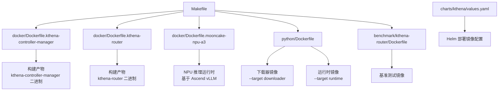
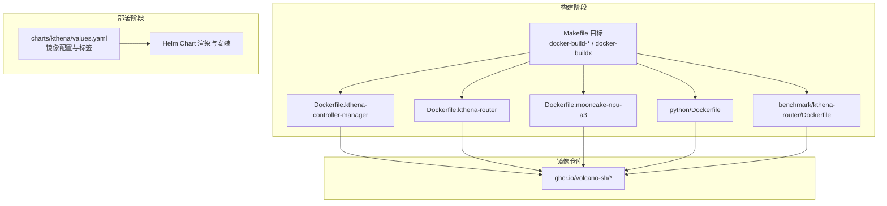
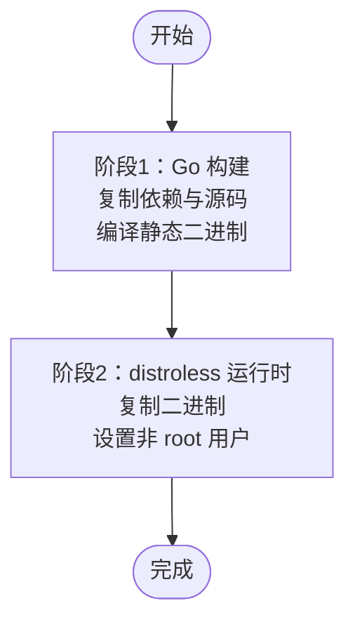
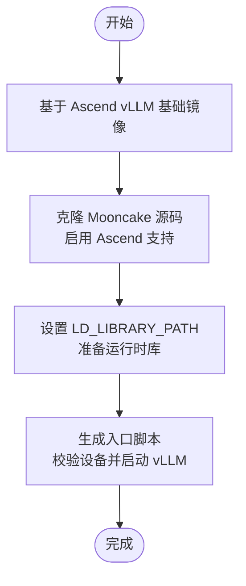
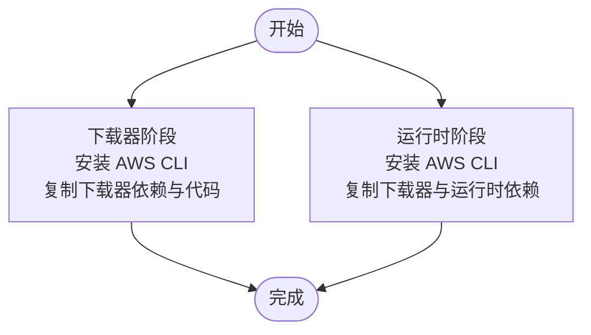
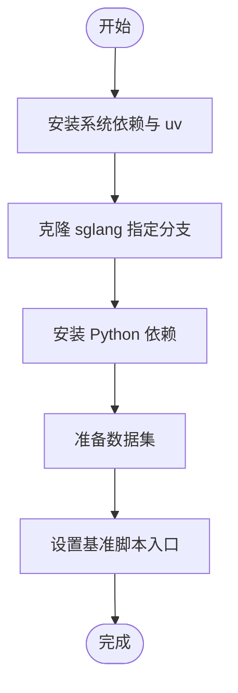
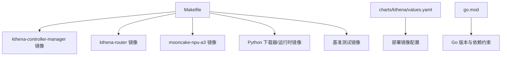

# 容器镜像配置

<cite>
**本文引用的文件**
- [docker/Dockerfile.kthena-controller-manager](file://docker/Dockerfile.kthena-controller-manager)
- [docker/Dockerfile.kthena-router](file://docker/Dockerfile.kthena-router)
- [docker/Dockerfile.mooncake-npu-a3](file://docker/Dockerfile.mooncake-npu-a3)
- [python/Dockerfile](file://python/Dockerfile)
- [benchmark/kthena-router/Dockerfile](file://benchmark/kthena-router/Dockerfile)
- [Makefile](file://Makefile)
- [charts/kthena/values.yaml](file://charts/kthena/values.yaml)
- [charts/kthena/Chart.yaml](file://charts/kthena/Chart.yaml)
- [charts/kthena/README.md](file://charts/kthena/README.md)
- [charts/kthena/charts/networking/README.md](file://charts/kthena/charts/networking/README.md)
- [.github/release.yml](file://.github/release.yml)
- [go.mod](file://go.mod)
</cite>

## 目录
1. [简介](#简介)
2. [项目结构](#项目结构)
3. [核心组件](#核心组件)
4. [架构总览](#架构总览)
5. [详细组件分析](#详细组件分析)
6. [依赖关系分析](#依赖关系分析)
7. [性能与优化建议](#性能与优化建议)
8. [故障排查指南](#故障排查指南)
9. [结论](#结论)
10. [附录](#附录)

## 简介
本指南聚焦于 Kthena 的三类核心容器镜像：kthena-controller-manager、kthena-router 以及 mooncake-npu-a3（NPU 加速推理运行时）。文档系统性阐述各镜像的 Dockerfile 结构、分层设计、依赖管理与安全配置；给出多阶段构建、镜像优化与缓存策略的最佳实践；并覆盖镜像标签管理、版本控制与发布流程，特别说明 NPU 加速相关镜像的特殊配置要求。

## 项目结构
围绕镜像构建与部署，仓库中与之直接相关的目录与文件如下：
- docker：存放三个主镜像的 Dockerfile
- python：Python 下载器与运行时镜像的多阶段 Dockerfile
- benchmark/kthena-router：基准测试镜像 Dockerfile 与构建脚本
- charts/kthena：Helm Chart 配置，定义镜像仓库、标签与拉取策略
- Makefile：统一的镜像构建、推送与跨平台打包目标
- go.mod：Go 依赖清单，影响 Go 基础镜像与二进制构建

图表来源
- [docker/Dockerfile.kthena-controller-manager:1-33](file://docker/Dockerfile.kthena-controller-manager#L1-L33)
- [docker/Dockerfile.kthena-router:1-33](file://docker/Dockerfile.kthena-router#L1-L33)
- [docker/Dockerfile.mooncake-npu-a3:1-28](file://docker/Dockerfile.mooncake-npu-a3#L1-L28)
- [python/Dockerfile:1-55](file://python/Dockerfile#L1-L55)
- [benchmark/kthena-router/Dockerfile:1-35](file://benchmark/kthena-router/Dockerfile#L1-L35)
- [Makefile:161-211](file://Makefile#L161-L211)
- [charts/kthena/values.yaml:1-97](file://charts/kthena/values.yaml#L1-L97)

章节来源
- [Makefile:161-211](file://Makefile#L161-L211)
- [charts/kthena/values.yaml:1-97](file://charts/kthena/values.yaml#L1-L97)

## 核心组件
本节对三大镜像进行分层结构、依赖与安全要点的深入解析，并结合 Makefile 中的构建目标说明统一的构建与发布流程。

- kthena-controller-manager 镜像
  - 分层结构：多阶段构建，第一阶段使用官方 Go 基础镜像编译静态二进制，第二阶段使用 distroless 静态镜像作为运行时基础，仅包含二进制与非 root 用户。
  - 依赖管理：通过 go.mod/go.sum 缓存依赖后复制源码，再执行构建，确保可复现与缓存命中。
  - 安全配置：以非 root 用户运行，最小化运行时镜像体积与攻击面。
  - 关键路径参考：[docker/Dockerfile.kthena-controller-manager:1-33](file://docker/Dockerfile.kthena-controller-manager#L1-L33)

- kthena-router 镜像
  - 分层结构：与控制器镜像一致的多阶段模式，构建静态二进制并放入 distroless 运行时镜像。
  - 依赖管理：同样采用 go.mod/go.sum 先行缓存依赖，随后复制源码并构建。
  - 安全配置：非 root 用户运行，入口为二进制可执行文件。
  - 关键路径参考：[docker/Dockerfile.kthena-router:1-33](file://docker/Dockerfile.kthena-router#L1-L33)

- mooncake-npu-a3 镜像（NPU 加速）
  - 分层结构：基于 Ascend vLLM 基础镜像，克隆 Mooncake 源码并启用 Ascend 支持，生成自定义入口脚本，最终以 Bash 启动 vLLM 服务。
  - 依赖管理：通过环境变量与脚本安装 Ascend 工具链与 Mooncake 依赖，设置库路径，保证运行时可用。
  - 安全配置：容器内以 Bash 执行入口脚本，需在部署时正确注入 Ascend 设备列表等环境变量。
  - 关键路径参考：[docker/Dockerfile.mooncake-npu-a3:1-28](file://docker/Dockerfile.mooncake-npu-a3#L1-L28)

- Python 下载器与运行时镜像
  - 多阶段 Dockerfile：分别构建下载器与运行时两个镜像，均基于 python:3.12-slim，安装 AWS CLI 并按需安装 Python 依赖。
  - 目标选择：通过 --target downloader 或 --target runtime 切换构建阶段。
  - 关键路径参考：[python/Dockerfile:1-55](file://python/Dockerfile#L1-L55)

- 基准测试镜像
  - 分层结构：基于 python:3.12-slim，安装系统依赖与 uv，克隆指定分支的 sglang 仓库，安装 Python 依赖，准备数据集，入口为基准脚本。
  - 关键路径参考：[benchmark/kthena-router/Dockerfile:1-35](file://benchmark/kthena-router/Dockerfile#L1-L35)

章节来源
- [docker/Dockerfile.kthena-controller-manager:1-33](file://docker/Dockerfile.kthena-controller-manager#L1-L33)
- [docker/Dockerfile.kthena-router:1-33](file://docker/Dockerfile.kthena-router#L1-L33)
- [docker/Dockerfile.mooncake-npu-a3:1-28](file://docker/Dockerfile.mooncake-npu-a3#L1-L28)
- [python/Dockerfile:1-55](file://python/Dockerfile#L1-L55)
- [benchmark/kthena-router/Dockerfile:1-35](file://benchmark/kthena-router/Dockerfile#L1-L35)

## 架构总览
下图展示镜像构建与部署的整体关系：Makefile 统一产出镜像，Helm Chart 在 values.yaml 中声明镜像仓库、标签与拉取策略，最终在集群中以 Deployment/StatefulSet 等资源形式运行。

图表来源
- [Makefile:161-211](file://Makefile#L161-L211)
- [charts/kthena/values.yaml:1-97](file://charts/kthena/values.yaml#L1-L97)

章节来源
- [Makefile:161-211](file://Makefile#L161-L211)
- [charts/kthena/values.yaml:1-97](file://charts/kthena/values.yaml#L1-L97)

## 详细组件分析

### kthena-controller-manager 镜像
- 多阶段构建流程
  - 第一阶段：使用官方 Go 基础镜像，复制 go.mod/go.sum 并执行依赖下载，随后复制源码并编译静态二进制。
  - 第二阶段：使用 distroless 静态镜像作为运行时，仅拷贝二进制与非 root 用户身份运行。
- 依赖与缓存
  - 通过先复制依赖清单并执行下载，确保后续复制源码时能命中缓存。
  - GOOS/GOARCH 由构建参数决定，避免硬编码导致平台不匹配。
- 安全与合规
  - 使用 distroless 静态镜像，减少运行时依赖与攻击面。
  - 非 root 用户运行，降低权限风险。
- 关键路径参考：[docker/Dockerfile.kthena-controller-manager:1-33](file://docker/Dockerfile.kthena-controller-manager#L1-L33)

图表来源
- [docker/Dockerfile.kthena-controller-manager:1-33](file://docker/Dockerfile.kthena-controller-manager#L1-L33)

章节来源
- [docker/Dockerfile.kthena-controller-manager:1-33](file://docker/Dockerfile.kthena-controller-manager#L1-L33)

### kthena-router 镜像
- 多阶段构建流程
  - 与控制器镜像一致，先构建静态二进制，再放入 distroless 运行时镜像。
- 依赖与缓存
  - 依赖缓存在 go.mod/go.sum 阶段，提升重复构建速度。
- 安全与合规
  - 非 root 用户运行，入口为二进制可执行文件。
- 关键路径参考：[docker/Dockerfile.kthena-router:1-33](file://docker/Dockerfile.kthena-router#L1-L33)

图表来源
- [docker/Dockerfile.kthena-router:1-33](file://docker/Dockerfile.kthena-router#L1-L33)

章节来源
- [docker/Dockerfile.kthena-router:1-33](file://docker/Dockerfile.kthena-router#L1-L33)

### mooncake-npu-a3 镜像（NPU 加速）
- 基础镜像与目标
  - 基于 Ascend vLLM 镜像，启用 Ascend 支持，克隆 Mooncake 源码并安装依赖。
- 特殊配置
  - 设置 LD_LIBRARY_PATH 指向 Ascend 工具链与 HCCL 库。
  - 通过环境变量注入 Ascend 设备列表，启动时校验并导出物理设备集合。
  - 入口脚本以 Bash 执行 vLLM serve，便于传参与调试。
- 关键路径参考：[docker/Dockerfile.mooncake-npu-a3:1-28](file://docker/Dockerfile.mooncake-npu-a3#L1-L28)

图表来源
- [docker/Dockerfile.mooncake-npu-a3:1-28](file://docker/Dockerfile.mooncake-npu-a3#L1-L28)

章节来源
- [docker/Dockerfile.mooncake-npu-a3:1-28](file://docker/Dockerfile.mooncake-npu-a3#L1-L28)

### Python 下载器与运行时镜像
- 多阶段设计
  - 下载器阶段：安装 AWS CLI，复制下载器依赖与代码，设置入口为下载器应用。
  - 运行时阶段：在下载器基础上增加运行时依赖与代码，设置入口为运行时应用。
- 目标切换
  - 通过 --target downloader 或 --target runtime 选择构建阶段。
- 关键路径参考：[python/Dockerfile:1-55](file://python/Dockerfile#L1-L55)

图表来源
- [python/Dockerfile:1-55](file://python/Dockerfile#L1-L55)

章节来源
- [python/Dockerfile:1-55](file://python/Dockerfile#L1-L55)

### 基准测试镜像
- 构建流程
  - 基于 python:3.12-slim，安装系统依赖与 uv，克隆 sglang 指定分支，安装 Python 依赖，准备数据集。
  - 入口为基准脚本，用于评估路由服务性能。
- 关键路径参考：[benchmark/kthena-router/Dockerfile:1-35](file://benchmark/kthena-router/Dockerfile#L1-L35)

图表来源
- [benchmark/kthena-router/Dockerfile:1-35](file://benchmark/kthena-router/Dockerfile#L1-L35)

章节来源
- [benchmark/kthena-router/Dockerfile:1-35](file://benchmark/kthena-router/Dockerfile#L1-L35)

## 依赖关系分析
- 构建工具链与平台
  - Makefile 提供统一的镜像构建与推送目标，支持跨平台打包与推送。
  - 使用 Buildx 平台参数定义多架构支持。
- Helm Chart 与镜像配置
  - values.yaml 明确各组件镜像仓库、标签与拉取策略，便于在集群中统一管理。
- Go 依赖与镜像一致性
  - go.mod 指定 Go 版本，确保构建环境与二进制兼容性。

图表来源
- [Makefile:161-211](file://Makefile#L161-L211)
- [charts/kthena/values.yaml:1-97](file://charts/kthena/values.yaml#L1-L97)
- [go.mod:1-144](file://go.mod#L1-L144)

章节来源
- [Makefile:161-211](file://Makefile#L161-L211)
- [charts/kthena/values.yaml:1-97](file://charts/kthena/values.yaml#L1-L97)
- [go.mod:1-144](file://go.mod#L1-L144)

## 性能与优化建议
- 多阶段构建与缓存策略
  - 将 go.mod/go.sum 与源码复制分离，优先下载依赖以提升缓存命中率。
  - 使用静态编译（CGO_ENABLED=0）减小二进制体积并提升可移植性。
- 运行时镜像最小化
  - distroless 静态镜像仅包含必要运行时文件，显著降低镜像大小与攻击面。
- 跨平台与并行构建
  - 使用 Buildx 的多平台参数并行构建不同架构镜像，配合 --push 一键推送。
- NPU 加速镜像优化
  - 预先设置 LD_LIBRARY_PATH，避免运行时动态链接失败。
  - 在入口脚本中进行设备校验，提前暴露配置问题。
- Python 镜像优化
  - 使用 --no-cache-dir 安装依赖，减少镜像层数与体积。
  - 通过 --target 控制构建阶段，避免冗余层。

[本节为通用指导，无需列出具体文件来源]

## 故障排查指南
- 构建失败（依赖下载或编译错误）
  - 检查 go.mod/go.sum 是否与源码同步更新。
  - 确认构建参数（如 TARGETOS/TARGETARCH）是否符合预期。
  - 参考路径：[docker/Dockerfile.kthena-controller-manager:1-33](file://docker/Dockerfile.kthena-controller-manager#L1-L33)、[docker/Dockerfile.kthena-router:1-33](file://docker/Dockerfile.kthena-router#L1-L33)
- 运行时权限问题
  - 确保以非 root 用户运行，检查用户 ID 与组 ID。
  - 参考路径：[docker/Dockerfile.kthena-controller-manager:25-33](file://docker/Dockerfile.kthena-controller-manager#L25-L33)、[docker/Dockerfile.kthena-router:25-33](file://docker/Dockerfile.kthena-router#L25-L33)
- NPU 设备未就绪
  - 检查 AscendRealDevices 环境变量是否设置，确认设备列表格式正确。
  - 参考路径：[docker/Dockerfile.mooncake-npu-a3:1-28](file://docker/Dockerfile.mooncake-npu-a3#L1-L28)
- 镜像拉取失败
  - 检查 values.yaml 中的镜像仓库与标签，确认拉取策略。
  - 参考路径：[charts/kthena/values.yaml:1-97](file://charts/kthena/values.yaml#L1-L97)
- 基准测试镜像异常
  - 确认 sglang 分支与数据集下载路径，检查 Python 依赖安装。
  - 参考路径：[benchmark/kthena-router/Dockerfile:1-35](file://benchmark/kthena-router/Dockerfile#L1-L35)

章节来源
- [docker/Dockerfile.kthena-controller-manager:1-33](file://docker/Dockerfile.kthena-controller-manager#L1-L33)
- [docker/Dockerfile.kthena-router:1-33](file://docker/Dockerfile.kthena-router#L1-L33)
- [docker/Dockerfile.mooncake-npu-a3:1-28](file://docker/Dockerfile.mooncake-npu-a3#L1-L28)
- [charts/kthena/values.yaml:1-97](file://charts/kthena/values.yaml#L1-L97)
- [benchmark/kthena-router/Dockerfile:1-35](file://benchmark/kthena-router/Dockerfile#L1-L35)

## 结论
通过对三大镜像的 Dockerfile 结构、依赖管理与安全配置的系统梳理，结合 Makefile 的统一构建与推送流程，可以实现稳定、可复现且易于维护的镜像构建体系。对于 NPU 加速场景，mooncake-npu-a3 镜像提供了明确的环境变量与入口脚本约定，有助于在生产环境中快速落地。Helm Chart 的 values.yaml 则为镜像仓库、标签与拉取策略提供了集中化的配置入口，便于版本化与发布管理。

[本节为总结性内容，无需列出具体文件来源]

## 附录

### 镜像标签管理与版本控制
- 标签来源与默认值
  - Makefile 中定义了 HUB（镜像仓库前缀）与 TAG（默认 latest），可通过环境变量覆盖。
  - 参考路径：[Makefile:1-24](file://Makefile#L1-L24)
- Helm Chart 中的镜像配置
  - values.yaml 中为各组件定义了 repository、tag 与 pullPolicy，默认均为 latest。
  - 参考路径：[charts/kthena/values.yaml:1-97](file://charts/kthena/values.yaml#L1-L97)
- Chart 版本与应用版本
  - Chart.yaml 中包含 chart version 与 appVersion 字段，遵循语义化版本管理。
  - 参考路径：[charts/kthena/Chart.yaml:1-22](file://charts/kthena/Chart.yaml#L1-L22)

章节来源
- [Makefile:1-24](file://Makefile#L1-L24)
- [charts/kthena/values.yaml:1-97](file://charts/kthena/values.yaml#L1-L97)
- [charts/kthena/Chart.yaml:1-22](file://charts/kthena/Chart.yaml#L1-L22)

### 发布流程与自动化
- 构建与推送
  - 使用 Makefile 的 docker-build-* 目标构建镜像，docker-push 推送至镜像仓库。
  - 参考路径：[Makefile:161-211](file://Makefile#L161-L211)
- 跨平台打包
  - docker-buildx 目标支持多平台并推送，适合多架构环境。
  - 参考路径：[Makefile:199-211](file://Makefile#L199-L211)
- 发布说明与变更分类
  - .github/release.yml 定义了发布说明的变更分类规则，便于生成 CHANGELOG。
  - 参考路径：[.github/release.yml:1-24](file://.github/release.yml#L1-L24)

章节来源
- [Makefile:161-211](file://Makefile#L161-L211)
- [.github/release.yml:1-24](file://.github/release.yml#L1-L24)

### Helm 部署注意事项
- Webhook 证书配置
  - 支持自动（自签名）、cert-manager 与手动三种模式，需根据环境选择并正确挂载证书。
  - 参考路径：[charts/kthena/README.md:165-213](file://charts/kthena/README.md#L165-L213)
- Redis 部署
  - 当使用 KV 缓存或评分插件时，需单独部署 Redis 并提供 ConfigMap/Secret。
  - 参考路径：[charts/kthena/README.md:214-255](file://charts/kthena/README.md#L214-L255)
- Router 功能开关
  - 公平调度、TLS、Gateway API 等功能可通过 values.yaml 开关与参数调整。
  - 参考路径：[charts/kthena/charts/networking/README.md:1-124](file://charts/kthena/charts/networking/README.md#L1-L124)

章节来源
- [charts/kthena/README.md:165-213](file://charts/kthena/README.md#L165-L213)
- [charts/kthena/README.md:214-255](file://charts/kthena/README.md#L214-L255)
- [charts/kthena/charts/networking/README.md:1-124](file://charts/kthena/charts/networking/README.md#L1-L124)