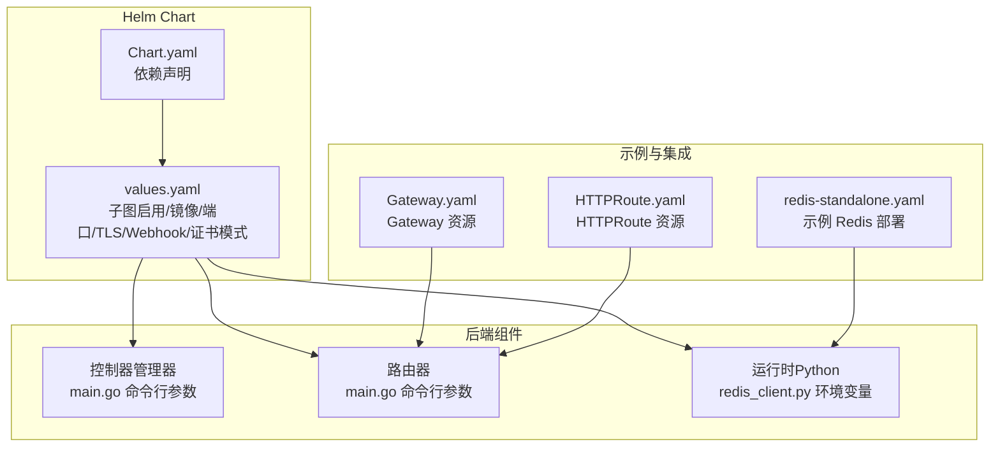
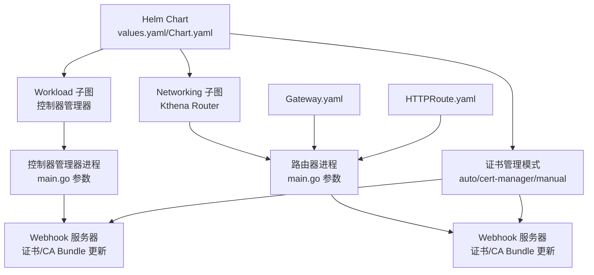
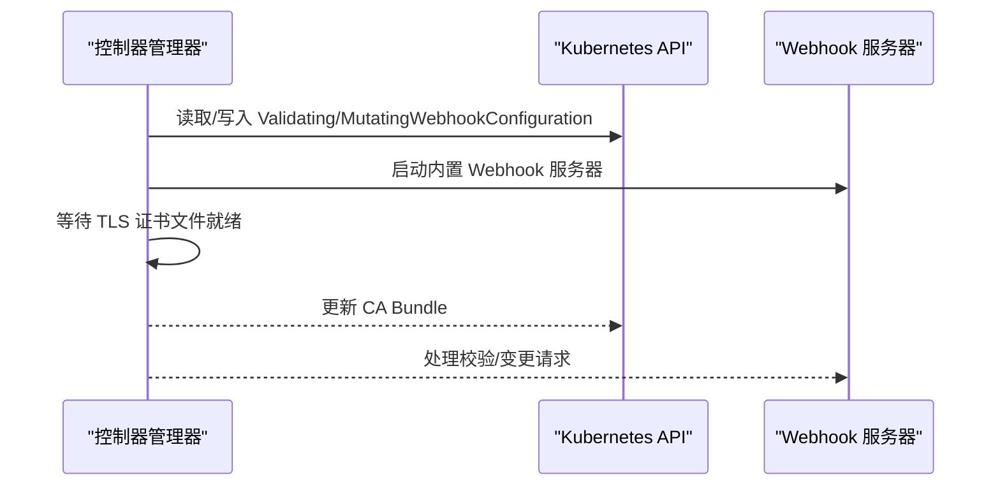
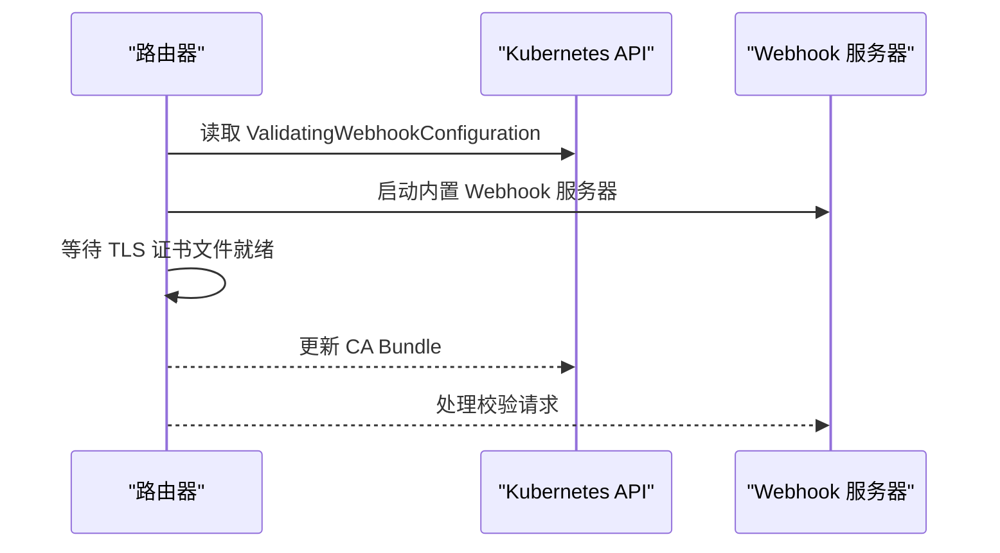
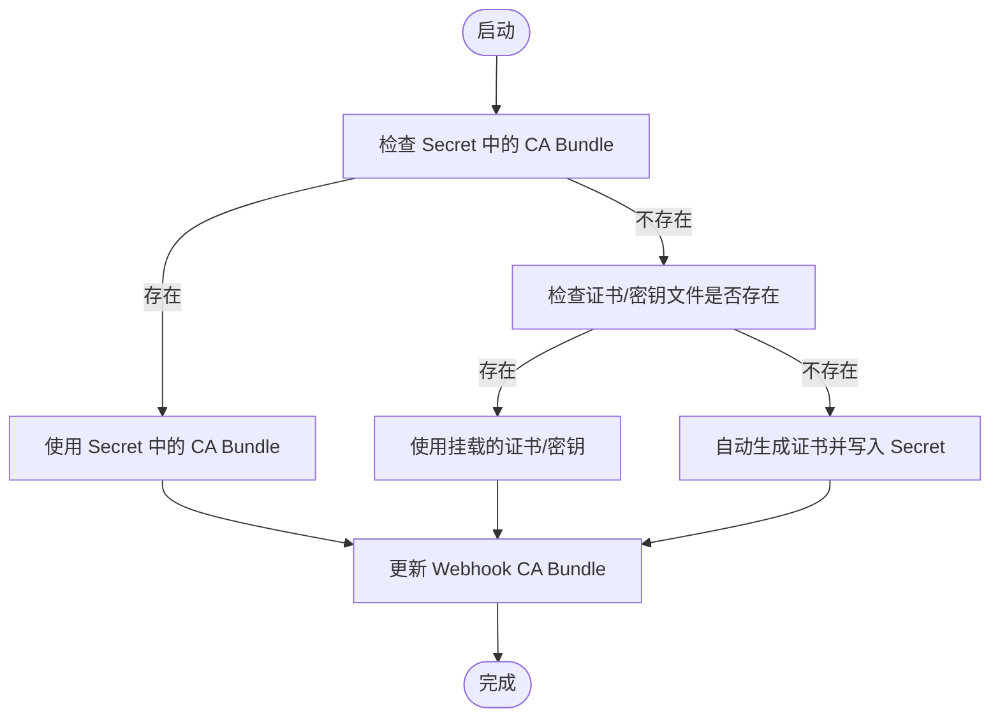
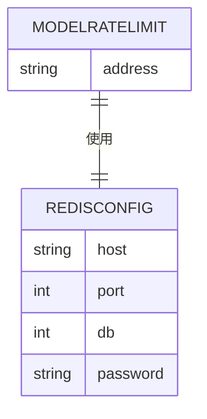
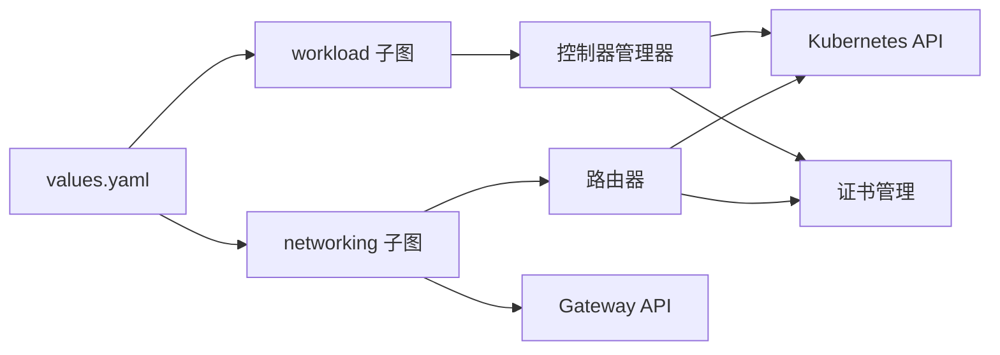

# 环境配置

<cite>
**本文引用的文件**
- [values.yaml](file://charts/kthena/values.yaml)
- [Chart.yaml](file://charts/kthena/Chart.yaml)
- [main.go（控制器管理器）](file://cmd/kthena-controller-manager/main.go)
- [config.go（控制器配置）](file://pkg/controller/config.go)
- [main.go（路由器）](file://cmd/kthena-router/main.go)
- [redis-standalone.yaml（示例 Redis）](file://test/e2e/router/testdata/redis-standalone.yaml)
- [redis_client.py（运行时 Redis 客户端）](file://python/kthena/runtime/redis_client.py)
- [modelroute_types.go（路由与限流定义）](file://pkg/apis/networking/v1alpha1/modelroute_types.go)
- [router_test.go（访问日志环境变量测试）](file://pkg/kthena-router/router/router_test.go)
- [.dockerignore](file://.dockerignore)
- [Gateway.yaml（示例网关）](file://examples/kthena-router/Gateway.yaml)
- [HTTPRoute.yaml（示例路由）](file://examples/kthena-router/HTTPRoute.yaml)
</cite>

## 目录
1. [简介](#简介)
2. [项目结构](#项目结构)
3. [核心组件](#核心组件)
4. [架构总览](#架构总览)
5. [详细组件分析](#详细组件分析)
6. [依赖分析](#依赖分析)
7. [性能考虑](#性能考虑)
8. [故障排查指南](#故障排查指南)
9. [结论](#结论)
10. [附录](#附录)

## 简介
本指南面向在不同环境中部署与运维 Kthena 的工程团队，系统性说明开发、测试与生产三类环境的配置差异与最佳实践；覆盖环境变量、数据库与缓存（如 Redis）、日志级别、证书与密钥管理、Kubernetes 资源配额与调度策略，以及环境迁移与配置备份的指导原则。内容基于仓库中的 Helm Chart、控制器与路由器入口、示例资源与运行时组件实现。

## 项目结构
Kthena 提供 Helm Chart 用于一键部署控制器管理器与路由器，并通过命令行参数与环境变量控制行为。关键位置如下：
- Helm Chart：集中定义工作负载与网络子图的启用、镜像、端口、TLS、Webhook 证书管理模式等
- 控制器管理器：以命令行参数控制 Webhook 开关、端口、超时、领导者选举、并发 Worker 数、控制器选择、Kubernetes API 访问速率等
- 路由器：以命令行参数控制服务端口、TLS、调试端口、Gateway API 功能开关、Webhook 端口与证书路径、Kubernetes API 访问速率等
- 运行时（Python）：通过环境变量读取 Redis 连接参数，支持重试与健康检查
- 示例资源：演示如何使用 Gateway API 与 HTTPRoute 将流量接入 Kthena 路由器

**图表来源**
- [values.yaml:1-97](file://charts/kthena/values.yaml#L1-L97)
- [Chart.yaml:1-22](file://charts/kthena/Chart.yaml#L1-L22)
- [main.go（控制器管理器）:54-111](file://cmd/kthena-controller-manager/main.go#L54-L111)
- [main.go（路由器）:40-122](file://cmd/kthena-router/main.go#L40-L122)
- [redis_client.py:27-48](file://python/kthena/runtime/redis_client.py#L27-L48)
- [Gateway.yaml:1-12](file://examples/kthena-router/Gateway.yaml#L1-L12)
- [HTTPRoute.yaml:1-20](file://examples/kthena-router/HTTPRoute.yaml#L1-L20)
- [redis-standalone.yaml:1-97](file://test/e2e/router/testdata/redis-standalone.yaml#L1-L97)

**章节来源**
- [values.yaml:1-97](file://charts/kthena/values.yaml#L1-L97)
- [Chart.yaml:1-22](file://charts/kthena/Chart.yaml#L1-L22)

## 核心组件
- Helm Chart 值（values.yaml）
  - 子图启用：workload 与 networking，默认均启用
  - 镜像仓库与标签：默认使用 ghcr.io/volcano-sh 下的镜像，可按需替换为私有仓库或固定版本
  - 端口与 TLS：路由器容器端口与调试端口；可开启服务器 TLS；Webhook TLS 证书路径与密钥路径
  - 证书管理模式：支持自动、cert-manager 或手动三种模式，配合 CA Bundle 使用
  - 全局特性：公平调度、Gateway API 及推理扩展开关
- 控制器管理器（kthena-controller-manager）
  - Webhook 开关、端口、超时、证书密钥文件路径、服务名、领导者选举、Worker 数、控制器选择、Kubernetes API QPS/Burst
- 路由器（kthena-router）
  - 服务端口、TLS 证书/密钥、Webhook 端口与证书、调试端口、Gateway API 开关、Kubernetes API QPS/Burst
- 运行时（Python）
  - Redis 连接参数：主机、端口、数据库、密码、连接池上限、超时、健康检查间隔、重试次数与退避

**章节来源**
- [values.yaml:1-97](file://charts/kthena/values.yaml#L1-L97)
- [main.go（控制器管理器）:54-111](file://cmd/kthena-controller-manager/main.go#L54-L111)
- [config.go（控制器配置）:19-27](file://pkg/controller/config.go#L19-L27)
- [main.go（路由器）:40-122](file://cmd/kthena-router/main.go#L40-L122)
- [redis_client.py:27-48](file://python/kthena/runtime/redis_client.py#L27-L48)

## 架构总览
下图展示 Helm Chart 如何驱动控制器与路由器的部署，以及证书管理与 Gateway API 的集成方式。

**图表来源**
- [values.yaml:1-97](file://charts/kthena/values.yaml#L1-L97)
- [Chart.yaml:16-22](file://charts/kthena/Chart.yaml#L16-L22)
- [main.go（控制器管理器）:127-184](file://cmd/kthena-controller-manager/main.go#L127-L184)
- [main.go（路由器）:137-194](file://cmd/kthena-router/main.go#L137-L194)
- [Gateway.yaml:1-12](file://examples/kthena-router/Gateway.yaml#L1-L12)
- [HTTPRoute.yaml:1-20](file://examples/kthena-router/HTTPRoute.yaml#L1-L20)

## 详细组件分析

### Helm Chart 值与环境差异
- 开发环境
  - 子图启用：workload 与 networking 均启用
  - 镜像：latest 或本地构建镜像，便于快速迭代
  - TLS：可关闭服务器 TLS，简化本地联调
  - Webhook：开启，证书模式可设为 auto 或 manual（自管证书）
  - 公平调度与 Gateway API：按需开启
- 测试环境
  - 镜像：固定版本标签，确保一致性
  - TLS：可开启服务器 TLS，Webhook 使用 cert-manager 自动签发
  - 公平调度与 Gateway API：按场景开启
- 生产环境
  - 镜像：固定版本标签，避免漂移
  - TLS：强制开启服务器 TLS，Webhook 使用 cert-manager
  - 证书模式：cert-manager，集中管理 CA 与证书轮换
  - 公平调度与 Gateway API：按业务需求开启

**章节来源**
- [values.yaml:1-97](file://charts/kthena/values.yaml#L1-L97)
- [Chart.yaml:16-22](file://charts/kthena/Chart.yaml#L16-L22)

### 控制器管理器配置要点
- Webhook 与证书
  - 支持从 Secret 加载 CA Bundle，若不存在则生成自签名证书并更新 Validating/Mutating Webhook 的 CA Bundle
  - 证书文件存在性等待机制，避免启动时缺失
- 控制器选择与并发
  - 支持启用/禁用特定控制器，支持领导者选举
  - 可调整 Worker 数量与 Kubernetes API 的 QPS/Burst
- 日志级别
  - 初始化 klog 并设置 stderr 阈值为 INFO，便于统一日志输出

**图表来源**
- [main.go（控制器管理器）:127-184](file://cmd/kthena-controller-manager/main.go#L127-L184)
- [main.go（控制器管理器）:209-235](file://cmd/kthena-controller-manager/main.go#L209-L235)

**章节来源**
- [main.go（控制器管理器）:54-111](file://cmd/kthena-controller-manager/main.go#L54-L111)
- [main.go（控制器管理器）:127-184](file://cmd/kthena-controller-manager/main.go#L127-L184)
- [main.go（控制器管理器）:209-235](file://cmd/kthena-controller-manager/main.go#L209-L235)
- [config.go（控制器配置）:19-27](file://pkg/controller/config.go#L19-L27)

### 路由器配置要点
- 服务端与调试端口
  - 通过命令行参数设置监听端口、调试端口
- TLS 与 Gateway API
  - 支持开启服务器 TLS；可选择启用 Gateway API 与推理扩展
- Webhook 与证书
  - 与控制器类似，优先从 Secret 加载 CA Bundle，否则生成自签名证书并更新配置
- 日志级别
  - 初始化 klog 并设置 stderr 阈值为 INFO

**图表来源**
- [main.go（路由器）:137-194](file://cmd/kthena-router/main.go#L137-L194)
- [main.go（路由器）:185-194](file://cmd/kthena-router/main.go#L185-L194)

**章节来源**
- [main.go（路由器）:40-122](file://cmd/kthena-router/main.go#L40-L122)
- [main.go（路由器）:137-194](file://cmd/kthena-router/main.go#L137-L194)

### 环境变量与配置项
- 访问日志（路由器侧）
  - ACCESS_LOG_ENABLED：是否启用访问日志
  - ACCESS_LOG_FORMAT：日志格式（text/json）
  - ACCESS_LOG_OUTPUT：输出目标（stdout/stderr/文件路径）
  - 测试用例验证了默认值与覆盖逻辑
- Redis 连接（运行时）
  - REDIS_HOST：Redis 主机
  - REDIS_PORT：Redis 端口
  - REDIS_DB：数据库编号
  - REDIS_PASSWORD：密码（可选）
  - 连接池上限、超时、健康检查间隔、重试次数与退避
- 日志级别
  - 通过 klog 标志设置 stderr 阈值为 INFO，便于在不同环境统一日志粒度

**章节来源**
- [router_test.go（访问日志环境变量测试）:331-452](file://pkg/kthena-router/router/router_test.go#L331-L452)
- [redis_client.py（运行时 Redis 客户端）:27-48](file://python/kthena/runtime/redis_client.py#L27-L48)
- [main.go（控制器管理器）:59-67](file://cmd/kthena-controller-manager/main.go#L59-L67)
- [main.go（路由器）:58-65](file://cmd/kthena-router/main.go#L58-L65)

### 证书与密钥管理
- 证书管理模式
  - auto：自动在集群内生成自签名证书并注入 Secret
  - cert-manager：依赖外部证书管理器，自动签发与续期
  - manual：手动提供 CA Bundle（base64 编码），通过 webhook.caBundle 注入
- Webhook 服务器
  - 优先从 Secret 读取 CA Bundle；若不存在，尝试现有证书文件；否则自动生成
  - 成功后更新 ValidatingWebhookConfiguration 的 CA Bundle
- 路由器与控制器管理器共享相同证书加载与更新流程

**图表来源**
- [main.go（控制器管理器）:153-184](file://cmd/kthena-controller-manager/main.go#L153-L184)
- [main.go（路由器）:154-183](file://cmd/kthena-router/main.go#L154-L183)
- [values.yaml:85-96](file://charts/kthena/values.yaml#L85-L96)

**章节来源**
- [values.yaml:85-96](file://charts/kthena/values.yaml#L85-L96)
- [main.go（控制器管理器）:153-184](file://cmd/kthena-controller-manager/main.go#L153-L184)
- [main.go（路由器）:154-183](file://cmd/kthena-router/main.go#L154-L183)

### 限流与 Redis 配置
- 全局限流
  - 支持基于 Redis 的全局限流，通过模型路由的 RateLimit.Global.Redis.Address 指定地址
- 运行时 Redis 客户端
  - 通过环境变量 REDIS_HOST/PORT/DB/PASSWORD 配置连接
  - 内置连接池、健康检查、超时与重试策略

**图表来源**
- [modelroute_types.go（路由与限流定义）:122-155](file://pkg/apis/networking/v1alpha1/modelroute_types.go#L122-L155)
- [redis_client.py（运行时 Redis 客户端）:27-48](file://python/kthena/runtime/redis_client.py#L27-L48)

**章节来源**
- [modelroute_types.go（路由与限流定义）:122-155](file://pkg/apis/networking/v1alpha1/modelroute_types.go#L122-L155)
- [redis_client.py（运行时 Redis 客户端）:27-48](file://python/kthena/runtime/redis_client.py#L27-L48)

### Kubernetes 集群资源配置建议
- 控制器管理器
  - CPU/内存：根据控制器数量与并发 Worker 数评估；建议预留与限制对齐，避免抢占
  - 存储：无需本地持久化；通过 Secret 挂载证书
  - 网络：暴露 Webhook 端口；若使用 cert-manager，需允许出站访问 CA 服务器
- 路由器
  - CPU/内存：按 QPS 与并发请求数估算；高延迟场景增加内存以提升缓存命中
  - 存储：无需本地持久化；通过 Secret 挂载 TLS 证书
  - 网络：对外暴露服务端口；若启用 Gateway API，需确保 GatewayClass 与 Ingress 控制器协同
- Redis（示例）
  - 示例中提供单副本部署，CPU/内存限制与请求可根据实际吞吐调整
  - 建议使用持久化存储（PVC）与哨兵/集群模式以提升可用性

**章节来源**
- [redis-standalone.yaml（示例 Redis）:79-97](file://test/e2e/router/testdata/redis-standalone.yaml#L79-L97)

### 环境迁移与配置备份
- 迁移步骤
  - 从 values.yaml 导出当前配置，作为基线
  - 在目标环境应用相同 Chart 版本，覆盖 values.yaml 中的关键字段（镜像、端口、TLS、证书模式）
  - 逐步切换流量至新环境，验证 Webhook 与证书更新成功
- 配置备份
  - 备份 values.yaml 与 Secret（证书与密钥）
  - 备份 Gateway 与 HTTPRoute 资源清单，以便回滚
- 环境隔离
  - 使用命名空间隔离不同环境
  - 通过 .dockerignore 忽略本地环境文件，避免误提交

**章节来源**
- [.dockerignore:60-67](file://.dockerignore#L60-L67)
- [values.yaml:1-97](file://charts/kthena/values.yaml#L1-L97)

## 依赖分析
- Helm Chart 依赖
  - workload 与 networking 子图，受 enabled 字段控制
- 组件间耦合
  - 控制器管理器与路由器均依赖 Kubernetes API 以读取/更新 Webhook 配置
  - 两者均依赖证书管理策略（Secret/文件/自动生成）
- 外部依赖
  - cert-manager（可选）用于自动化证书生命周期管理
  - Redis（可选）用于全局限流与 KV 缓存

**图表来源**
- [values.yaml:1-97](file://charts/kthena/values.yaml#L1-L97)
- [Chart.yaml:16-22](file://charts/kthena/Chart.yaml#L16-L22)
- [main.go（控制器管理器）:127-184](file://cmd/kthena-controller-manager/main.go#L127-L184)
- [main.go（路由器）:137-194](file://cmd/kthena-router/main.go#L137-L194)

**章节来源**
- [Chart.yaml:16-22](file://charts/kthena/Chart.yaml#L16-L22)
- [values.yaml:1-97](file://charts/kthena/values.yaml#L1-L97)

## 性能考虑
- 控制器与路由器
  - 合理设置 Workers 与 Kubernetes API 的 QPS/Burst，避免对 API Server 造成压力
  - 在高并发场景下，适当提高内存限制以减少 GC 抖动
- 路由器
  - 启用 TLS 会带来额外 CPU 开销，建议使用硬件加速或专用 SSL 卸载设备
  - 启用访问日志会增加 IO 压力，生产环境建议 JSON 格式并落盘到高性能磁盘
- Redis
  - 连接池大小与超时应与并发与延迟匹配；启用健康检查降低断连风险
  - 对于全局限流，建议独立部署 Redis 集群并开启持久化

[本节为通用建议，不直接分析具体文件]

## 故障排查指南
- Webhook 证书问题
  - 检查 Secret 是否存在且包含 CA Bundle；确认 Validating/Mutating Webhook 的 CA Bundle 已更新
  - 若使用自动模式，确认 Pod 命名空间与服务名称正确
- 证书文件未就绪
  - 启动前等待 TLS 证书/密钥文件出现，超时将导致启动失败
- 日志级别
  - 确认 stderr 阈值已设置为 INFO，便于定位问题
- Redis 连接
  - 检查 REDIS_HOST/PORT/DB/PASSWORD 是否正确；关注连接池上限与健康检查间隔
  - 观察重试次数与退避是否合理，避免瞬时抖动放大

**章节来源**
- [main.go（控制器管理器）:153-184](file://cmd/kthena-controller-manager/main.go#L153-L184)
- [main.go（路由器）:154-183](file://cmd/kthena-router/main.go#L154-L183)
- [main.go（控制器管理器）:252-266](file://cmd/kthena-controller-manager/main.go#L252-L266)
- [main.go（路由器）:197-211](file://cmd/kthena-router/main.go#L197-L211)
- [redis_client.py（运行时 Redis 客户端）:49-118](file://python/kthena/runtime/redis_client.py#L49-L118)

## 结论
- 开发环境强调灵活性与快速迭代，可使用 auto 证书与关闭 TLS；测试环境强调一致性与自动化，推荐固定镜像与 cert-manager；生产环境强调安全性与稳定性，必须启用 TLS 与 cert-manager，并严格管理证书轮换
- 通过 Helm Chart 统一管理控制器与路由器的部署与配置，结合环境变量与 Secret 实现敏感信息的安全隔离
- 在高并发与高可用场景下，建议优化 Kubernetes 资源配额、启用 Redis 集群与合理的日志策略，并建立完善的迁移与备份流程

[本节为总结，不直接分析具体文件]

## 附录
- 示例资源
  - 使用 Gateway.yaml 与 HTTPRoute.yaml 将流量接入路由器
- 环境隔离
  - 使用 .dockerignore 忽略本地环境文件，避免误提交

**章节来源**
- [Gateway.yaml:1-12](file://examples/kthena-router/Gateway.yaml#L1-L12)
- [HTTPRoute.yaml:1-20](file://examples/kthena-router/HTTPRoute.yaml#L1-L20)
- [.dockerignore:60-67](file://.dockerignore#L60-L67)