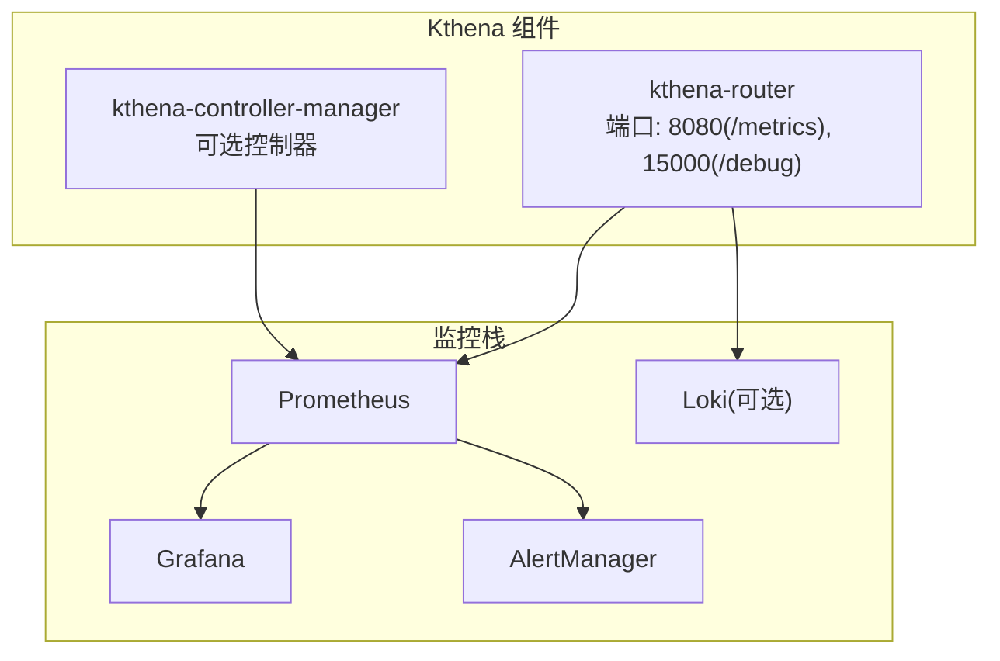
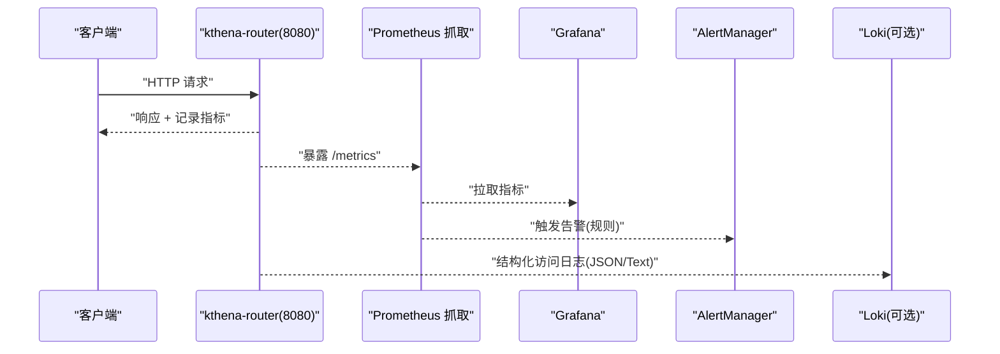
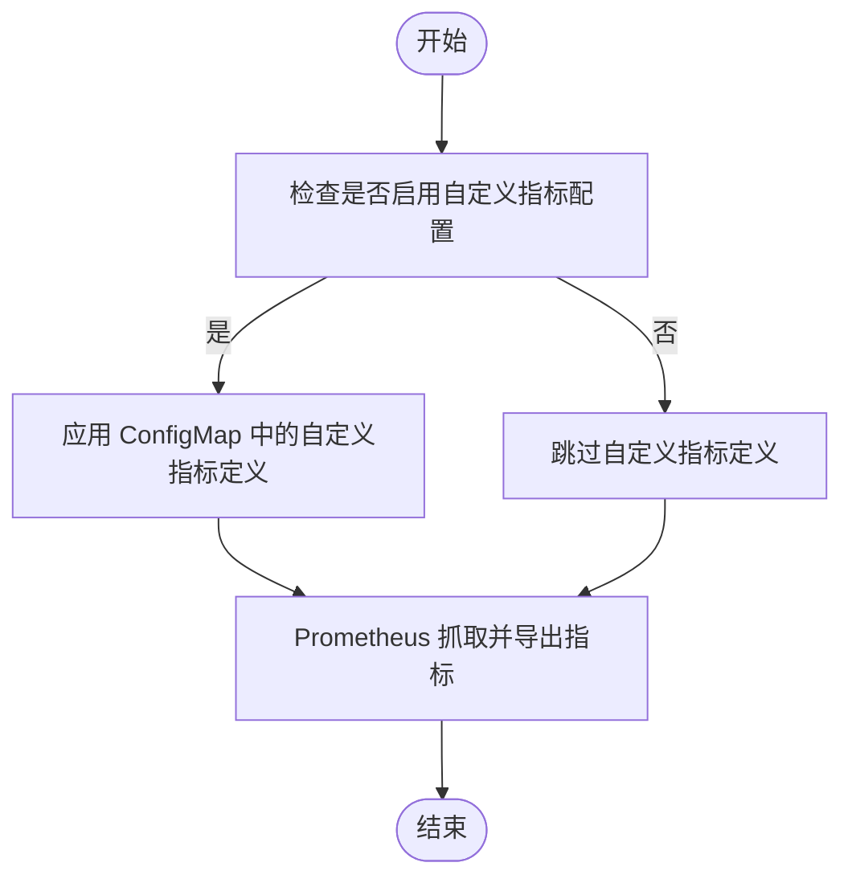
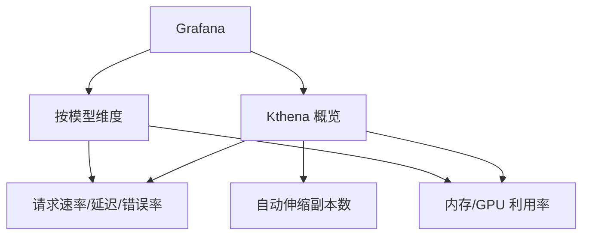
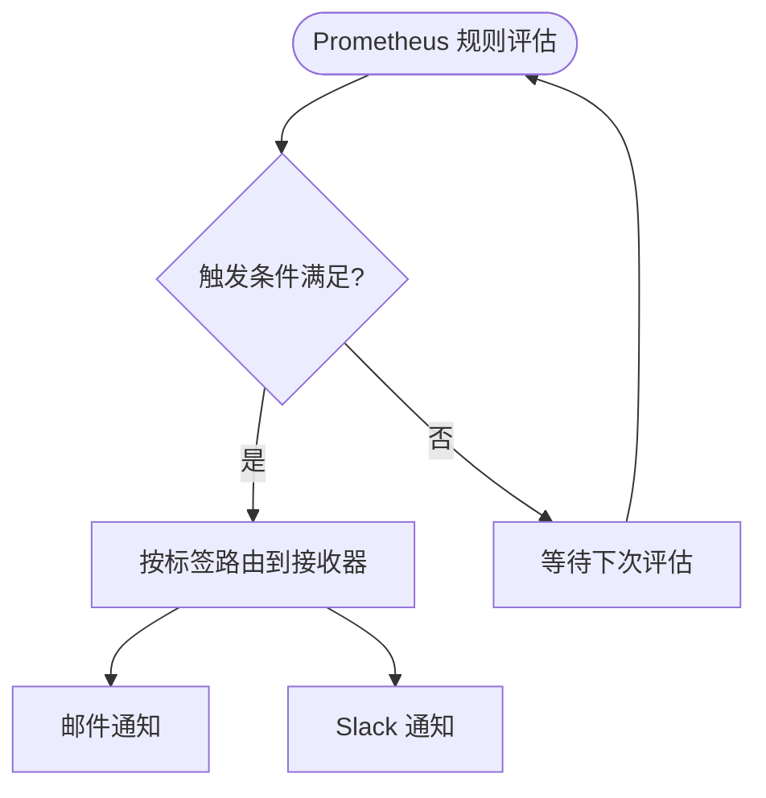
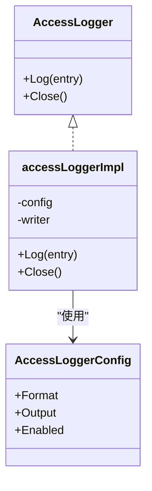
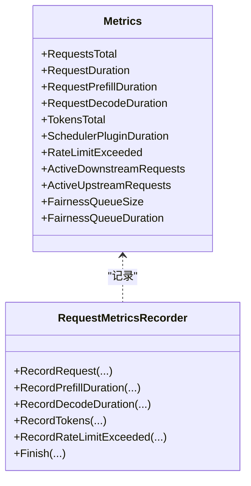
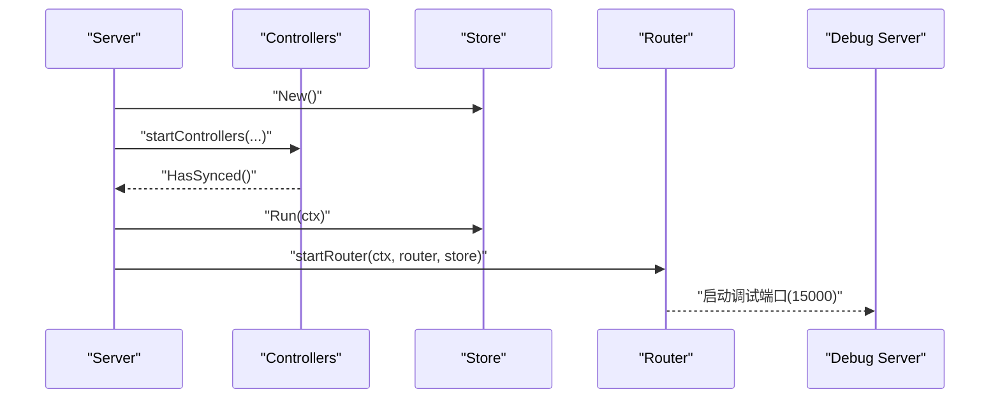
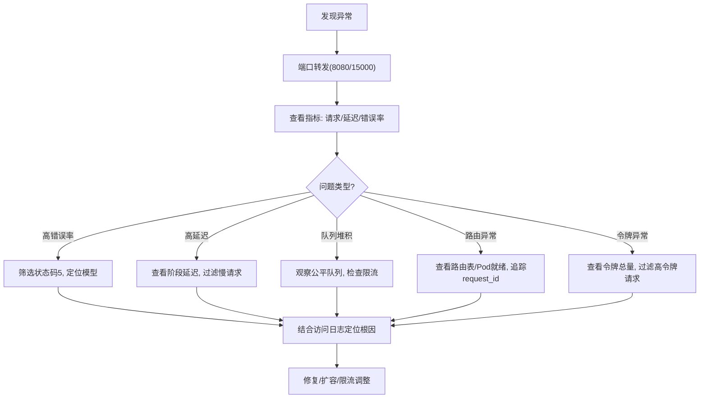

# 监控与告警配置

<cite>
**本文引用的文件**
- [prometheus.md](file://docs/kthena/docs/general/prometheus.md)
- [router-observability.md](file://docs/kthena/docs/user-guide/router-observability.md)
- [router-access-log-fields.md](file://docs/kthena/docs/reference/router-access-log-fields.md)
- [metrics.go](file://pkg/kthena-router/metrics/metrics.go)
- [logger.go](file://pkg/kthena-router/accesslog/logger.go)
- [types.go](file://pkg/kthena-router/accesslog/types.go)
- [values.yaml（网络子图表）](file://charts/kthena/charts/networking/values.yaml)
- [values.yaml（全局）](file://charts/kthena/values.yaml)
- [server.go](file://cmd/kthena-router/app/server.go)
- [router.go](file://cmd/kthena-router/app/router.go)
- [store.go](file://pkg/kthena-router/datastore/store.go)
- [store_test.go](file://pkg/kthena-router/datastore/store_test.go)
</cite>

## 目录
1. [简介](#简介)
2. [项目结构](#项目结构)
3. [核心组件](#核心组件)
4. [架构总览](#架构总览)
5. [组件详解](#组件详解)
6. [依赖关系分析](#依赖关系分析)
7. [性能与阈值建议](#性能与阈值建议)
8. [故障排查指南](#故障排查指南)
9. [结论](#结论)
10. [附录](#附录)

## 简介
本指南面向运维与平台工程团队，系统化阐述 Kthena 在 Prometheus、Grafana、AlertManager 与日志方面的监控与告警配置方法，覆盖指标采集与导出、自定义指标定义、Grafana 仪表板模板使用、告警规则编写、访问日志配置与日志聚合方案、关键性能指标与阈值设定，以及基于监控数据的故障排查流程与工具使用。

## 项目结构
Kthena 的监控与可观测性由以下部分组成：
- 路由器（kthena-router）：暴露 Prometheus 指标端点、结构化访问日志、调试端点
- 控制器管理器（kthena-controller-manager）：可选的控制器组件，支持指标端点与告警集成
- Helm Charts：提供部署参数与默认观测性开关（如访问日志格式、输出位置）
- 文档：Prometheus/Grafana/AlertManager 集成与路由可观测性最佳实践

图示来源
- [router-observability.md:26-35](file://docs/kthena/docs/user-guide/router-observability.md#L26-L35)
- [prometheus.md:34-50](file://docs/kthena/docs/general/prometheus.md#L34-L50)

章节来源
- [router-observability.md:1-294](file://docs/kthena/docs/user-guide/router-observability.md#L1-L294)
- [prometheus.md:1-927](file://docs/kthena/docs/general/prometheus.md#L1-L927)
- [values.yaml（网络子图表）:48-56](file://charts/kthena/charts/networking/values.yaml#L48-L56)
- [values.yaml（全局）:34-41](file://charts/kthena/values.yaml#L34-L41)

## 核心组件
- Prometheus 指标导出
  - kthena-router 默认在 8080 端口暴露 /metrics；控制器管理器亦可暴露指标端点（取决于部署与配置）
  - 支持通过 ServiceMonitor 或静态配置抓取
- Grafana 可视化
  - 提供“Kthena 概览”与“按模型维度”的仪表板 JSON 模板
  - 支持变量模板与多面板组合
- AlertManager 告警
  - 提供接收器配置与分组策略，结合 PrometheusRule 编写告警规则
- 访问日志
  - 结构化 JSON 与文本两种格式，支持 stdout/stderr/文件输出
  - 字段覆盖请求、路由、令牌与耗时等关键信息
- 日志聚合（可选）
  - Loki/Promtail 方案用于日志采集与查询

章节来源
- [router-observability.md:26-35](file://docs/kthena/docs/user-guide/router-observability.md#L26-L35)
- [prometheus.md:198-616](file://docs/kthena/docs/general/prometheus.md#L198-L616)
- [router-access-log-fields.md:1-175](file://docs/kthena/docs/reference/router-access-log-fields.md#L1-L175)
- [logger.go:69-98](file://pkg/kthena-router/accesslog/logger.go#L69-L98)

## 架构总览
下图展示 Kthena 组件与监控栈的交互关系，以及指标与日志的流向。

图示来源
- [router-observability.md:26-35](file://docs/kthena/docs/user-guide/router-observability.md#L26-L35)
- [prometheus.md:34-122](file://docs/kthena/docs/general/prometheus.md#L34-L122)
- [router-access-log-fields.md:9-26](file://docs/kthena/docs/reference/router-access-log-fields.md#L9-L26)

## 组件详解

### Prometheus 指标导出与自定义指标
- 指标端点
  - kthena-router：默认端口 8080，路径 /metrics
  - 控制器管理器：可通过部署参数启用指标端点（取决于具体版本与配置）
- 抓取配置
  - 使用 ServiceMonitor 或静态配置，按命名空间与标签选择目标
  - 可通过 relabel_configs 将指标路径与端口映射到 __address__
- 自定义指标
  - 可通过 ConfigMap 定义自定义指标（类型、帮助信息、标签、直方图桶等）
  - 示例：模型准确率、推理队列深度、缓存命中率、批处理效率等

图示来源
- [prometheus.md:165-196](file://docs/kthena/docs/general/prometheus.md#L165-L196)
- [prometheus.md:54-96](file://docs/kthena/docs/general/prometheus.md#L54-L96)

章节来源
- [router-observability.md:26-35](file://docs/kthena/docs/user-guide/router-observability.md#L26-L35)
- [prometheus.md:34-122](file://docs/kthena/docs/general/prometheus.md#L34-L122)
- [prometheus.md:165-196](file://docs/kthena/docs/general/prometheus.md#L165-L196)

### Grafana 仪表板与模板使用
- 安装与配置
  - 通过 ConfigMap 配置 Grafana（如根路径、认证、OAuth）
- 主仪表板
  - “Kthena 概览”包含请求速率、延迟（P95）、错误率、活跃模型数、内存/GPU 利用率、自动伸缩副本数等
- 模型级仪表板
  - 使用模板变量按 model_id 过滤，展示请求速率、延迟热力图、模型准确率趋势
- 使用建议
  - 为关键面板设置阈值颜色（绿色/黄色/红色），便于快速识别异常

图示来源
- [prometheus.md:198-402](file://docs/kthena/docs/general/prometheus.md#L198-L402)
- [prometheus.md:404-456](file://docs/kthena/docs/general/prometheus.md#L404-L456)

章节来源
- [prometheus.md:198-456](file://docs/kthena/docs/general/prometheus.md#L198-L456)

### AlertManager 告警规则编写与配置
- AlertManager 配置
  - 分组策略（按告警名、集群、服务）、等待与重复间隔、接收器（邮件/Slack）
- PrometheusRule 告警规则
  - 服务层：服务不可用、高延迟、高错误率
  - 资源层：模型内存占用过高、GPU 利用率过高
  - 模型层：模型加载失败、准确率下降
  - 自动伸缩层：负载高但副本未增长

图示来源
- [prometheus.md:460-518](file://docs/kthena/docs/general/prometheus.md#L460-L518)
- [prometheus.md:519-616](file://docs/kthena/docs/general/prometheus.md#L519-L616)

章节来源
- [prometheus.md:460-616](file://docs/kthena/docs/general/prometheus.md#L460-L616)

### 访问日志配置与字段参考
- 输出格式
  - JSON：推荐，便于日志聚合与分析
  - Text：开发调试友好
- 输出位置
  - stdout/stderr/文件路径
- 关键字段
  - HTTP 基础字段（时间戳、方法、路径、协议、状态码）
  - 错误信息（类型与消息）
  - AI 路由信息（模型名、ModelRoute、ModelServer、选中 Pod、请求 ID）
  - 令牌用量（输入/输出）
  - 耗时分解（总时长、请求处理、上游处理、响应处理）

图示来源
- [logger.go:44-98](file://pkg/kthena-router/accesslog/logger.go#L44-L98)

章节来源
- [router-access-log-fields.md:1-175](file://docs/kthena/docs/reference/router-access-log-fields.md#L1-L175)
- [logger.go:69-136](file://pkg/kthena-router/accesslog/logger.go#L69-L136)
- [types.go:133-171](file://pkg/kthena-router/accesslog/types.go#L133-L171)

### 日志聚合方案（Loki/Promtail）
- Loki：集中式日志存储与查询
- Promtail：在节点上采集日志，按标签转发至 Loki
- 建议
  - 通过 relabel_configs 保留模型 ID、Pod 名称、命名空间等标签
  - 生产环境避免直接将所有日志管道到 jq，使用日志处理器（如 Loki/Promtail/Vector）

章节来源
- [prometheus.md:712-800](file://docs/kthena/docs/general/prometheus.md#L712-L800)

### 路由器指标体系与采集
- 指标端点与端口
  - kthena-router 默认在 8080 暴露 /metrics；调试端口 15000
- 指标类别
  - 请求与延迟：总请求数、端到端延迟、预填与解码阶段延迟
  - 令牌与用量：输入/输出令牌总数
  - 公平调度与排队：公平队列大小、排队时延、插件执行时延
  - 限流与保护：被限流的请求数
- 采集与展示
  - 通过 Prometheus 抓取后，在 Grafana 中以图表/热力图/状态面板呈现

图示来源
- [metrics.go:54-85](file://pkg/kthena-router/metrics/metrics.go#L54-L85)
- [metrics.go:341-351](file://pkg/kthena-router/metrics/metrics.go#L341-L351)

章节来源
- [router-observability.md:26-66](file://docs/kthena/docs/user-guide/router-observability.md#L26-L66)
- [metrics.go:87-223](file://pkg/kthena-router/metrics/metrics.go#L87-L223)

### Helm Chart 中的观测性配置
- kthena-router
  - accessLog.enabled/format/output：控制访问日志开关、格式与输出位置
- 全局
  - kthenaRouter.port/debugPort：默认 8080/15000

章节来源
- [values.yaml（网络子图表）:48-56](file://charts/kthena/charts/networking/values.yaml#L48-L56)
- [values.yaml（全局）:34-41](file://charts/kthena/values.yaml#L34-L41)

## 依赖关系分析
- kthena-router 启动流程
  - 初始化 Store 与控制器，同步完成后启动路由器与调试服务器
  - 注册 /metrics 端点（通过 Prometheus HTTP 处理器）
- 指标与日志耦合点
  - 访问日志上下文与计时信息可用于定位慢请求与错误来源
  - 指标与日志共同支撑故障排查与容量规划

图示来源
- [server.go:58-85](file://cmd/kthena-router/app/server.go#L58-L85)
- [router.go:47-156](file://cmd/kthena-router/app/router.go#L47-L156)

章节来源
- [server.go:28-85](file://cmd/kthena-router/app/server.go#L28-L85)
- [router.go:1-199](file://cmd/kthena-router/app/router.go#L1-L199)

## 性能与阈值建议
- 关键指标
  - 请求速率（每模型/全局）
  - P95/P99 延迟（端到端、预填、解码）
  - 错误率（按模型与状态码）
  - 内存/GPU 利用率
  - 公平队列长度与排队时延
  - 令牌吞吐（输入/输出）
- 建议阈值（示例）
  - P95 延迟：生产环境建议 < 5 秒；对实时性敏感场景建议 < 1 秒
  - 错误率：持续 > 1% 即需关注；> 5% 应立即告警
  - 内存/GPU：超过 80% 时触发预警
  - 公平队列：排队时延 P95 > 10 秒，应检查资源或限流策略
- 自定义指标
  - 模型准确率、缓存命中率、批处理效率等，结合业务 SLA 设定阈值

章节来源
- [prometheus.md:123-164](file://docs/kthena/docs/general/prometheus.md#L123-L164)
- [router-observability.md:169-294](file://docs/kthena/docs/user-guide/router-observability.md#L169-L294)

## 故障排查指南
- 准备工作
  - 端口转发：8080（指标）、15000（调试）
  - 实时查看指标与访问日志
- 常见问题定位步骤
  - 高错误率（5xx/超时/内部错误）
    - 通过指标筛选状态码为 5 的条目，定位受影响模型
    - 查看最近失败日志，提取模型、Pod、耗时等信息
    - 检查上游模型服务器健康状态
  - 高延迟/慢 TTFT/生成速度低
    - 查看端到端与阶段延迟分布
    - 过滤耗时长的日志条目，核对上游处理时间
    - 监控公平队列压力与排队时延
  - 队列堆积/公平性/限流
    - 实时观察公平队列大小与排队时延
    - 过滤被限流/排队满的日志条目
  - 路由错误/404/Pod 选择异常
    - 通过调试端点查看路由表与 Pod 就绪状态
    - 使用 request_id 在日志中追踪请求链路
  - 令牌用量/成本/滥用监控
    - 查看令牌总量指标，过滤高输入/输出令牌请求
- 工具与命令
  - curl + grep + jq 组合进行指标与日志筛选
  - kubectl port-forward 快速接入本地观测

图示来源
- [router-observability.md:169-294](file://docs/kthena/docs/user-guide/router-observability.md#L169-L294)

章节来源
- [router-observability.md:169-294](file://docs/kthena/docs/user-guide/router-observability.md#L169-L294)

## 结论
通过规范化的 Prometheus 指标导出、Grafana 仪表板与 AlertManager 告警规则，配合结构化访问日志与可选的日志聚合方案，Kthena 能够实现全链路可观测性。建议在生产环境中启用 JSON 访问日志、完善自定义指标、设置合理的阈值与告警策略，并建立标准化的故障排查流程，以保障推理服务的稳定性与可维护性。

## 附录
- Helm 参数参考
  - kthena-router.accessLog.enabled/format/output
  - kthenaRouter.port/debugPort
- Prometheus 抓取与 ServiceMonitor
  - 按命名空间与标签选择目标，relabel 映射地址与路径
- Grafana 仪表板模板
  - “Kthena 概览”与“按模型维度”模板，支持变量与阈值配置

章节来源
- [values.yaml（网络子图表）:48-56](file://charts/kthena/charts/networking/values.yaml#L48-L56)
- [values.yaml（全局）:34-41](file://charts/kthena/values.yaml#L34-L41)
- [prometheus.md:97-122](file://docs/kthena/docs/general/prometheus.md#L97-L122)
- [prometheus.md:198-456](file://docs/kthena/docs/general/prometheus.md#L198-L456)