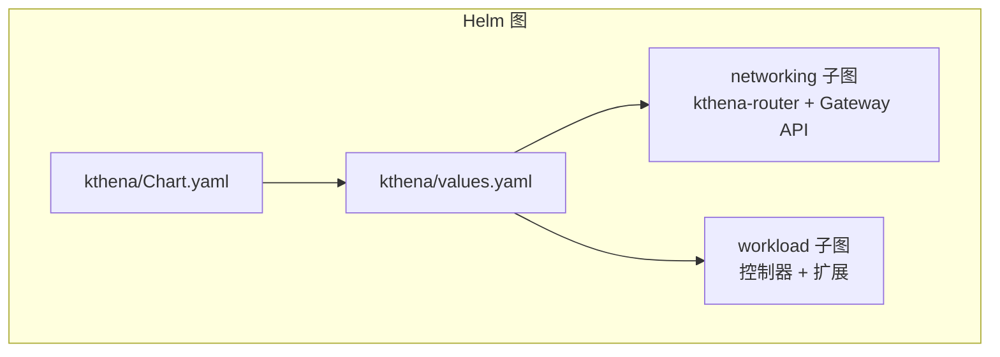
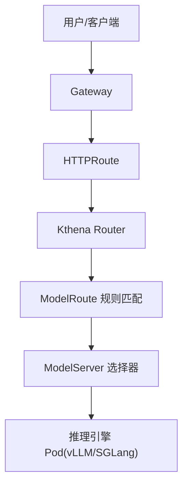
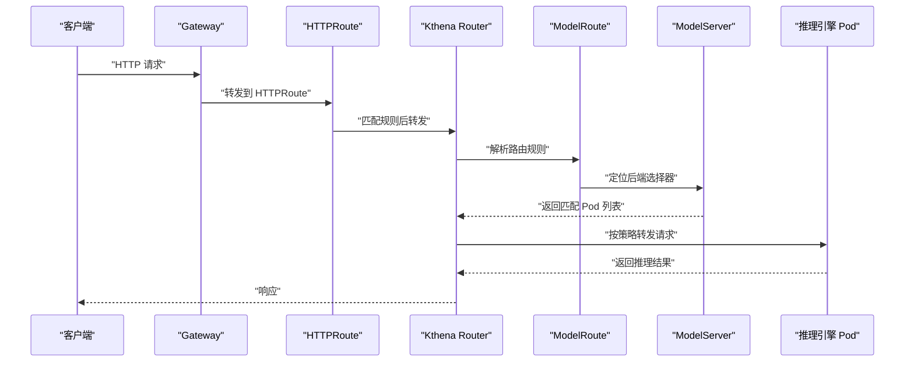
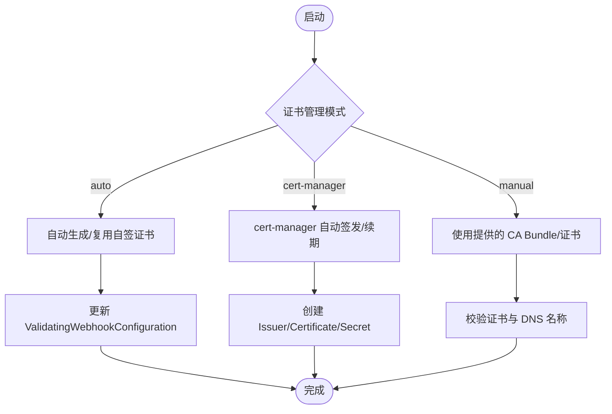
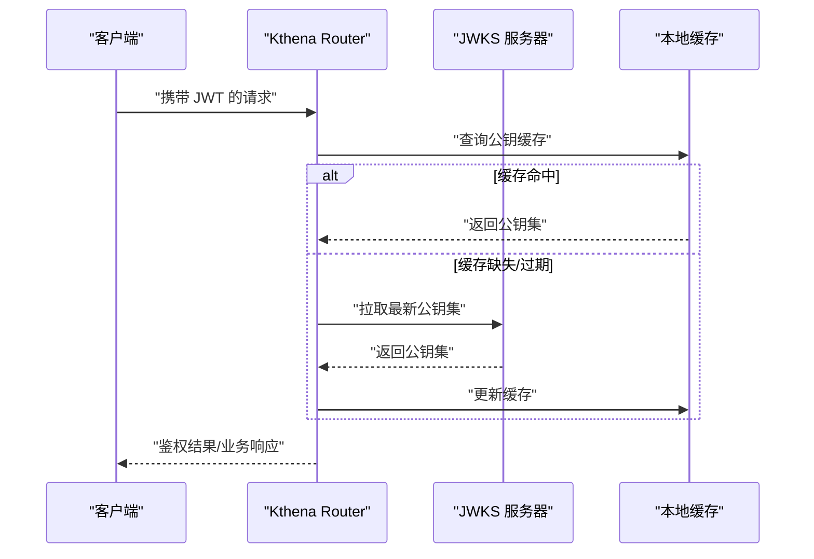
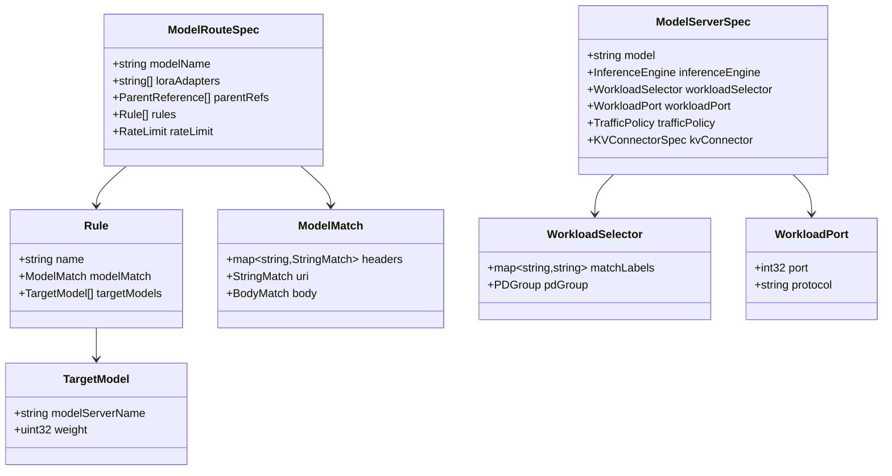
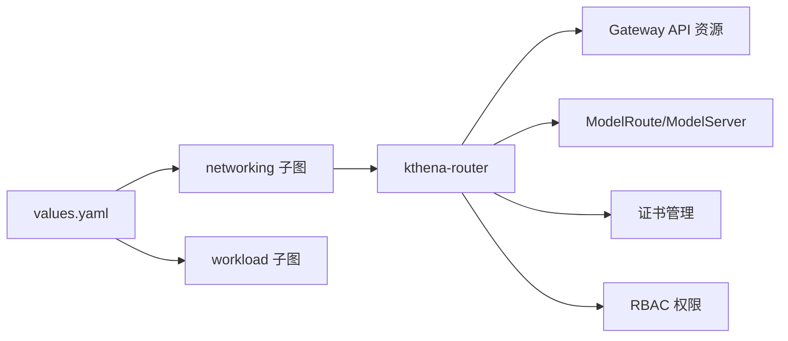

# 网络与安全配置

<cite>
**本文引用的文件**
- [values.yaml](file://charts/kthena/values.yaml)
- [Chart.yaml](file://charts/kthena/Chart.yaml)
- [Gateway.yaml](file://examples/kthena-router/Gateway.yaml)
- [HTTPRoute.yaml](file://examples/kthena-router/HTTPRoute.yaml)
- [modelroute_types.go](file://pkg/apis/networking/v1alpha1/modelroute_types.go)
- [modelserver_types.go](file://pkg/apis/networking/v1alpha1/modelserver_types.go)
- [rbac.yaml](file://examples/keda-autoscaling/rbac.yaml)
- [jwt.go](file://pkg/kthena-router/filters/auth/jwt.go)
- [cert-manager.md](file://docs/kthena/docs/general/cert-manager.md)
- [main.go](file://cmd/kthena-router/main.go)
- [ModelRouteSimple.yaml](file://examples/kthena-router/ModelRouteSimple.yaml)
- [ModelServer-ds1.5b.yaml](file://examples/kthena-router/ModelServer-ds1.5b.yaml)
</cite>

## 目录
1. [简介](#简介)
2. [项目结构](#项目结构)
3. [核心组件](#核心组件)
4. [架构总览](#架构总览)
5. [详细组件分析](#详细组件分析)
6. [依赖关系分析](#依赖关系分析)
7. [性能考量](#性能考量)
8. [故障排查指南](#故障排查指南)
9. [结论](#结论)
10. [附录](#附录)

## 简介
本指南聚焦于 Kthena 在 Kubernetes 环境中的网络与安全配置，涵盖服务发现与负载均衡（含 Service 类型、Ingress 与 Gateway API）、TLS 证书管理（自动、cert-manager、手动）、RBAC 权限最佳实践（ServiceAccount、ClusterRole、ClusterRoleBinding）、防火墙与网络策略建议、以及认证与授权机制（JWT 与访问控制）。文档以仓库内 Helm 值、示例清单、控制器实现与认证模块为依据，提供可操作的配置路径与排障指引。

## 项目结构
Kthena 通过 Helm Chart 将“工作负载”和“网络”两大子图组合部署。网络子图包含 Kthena Router 及其相关证书与网关能力；工作负载子图负责模型推理实例的生命周期与扩展。Gateway API 示例展示了如何将外部流量路由到后端 InferencePool 或 ModelServer 资源。

图表来源
- [Chart.yaml:16-22](file://charts/kthena/Chart.yaml#L16-L22)
- [values.yaml:1-97](file://charts/kthena/values.yaml#L1-L97)

章节来源
- [Chart.yaml:1-22](file://charts/kthena/Chart.yaml#L1-L22)
- [values.yaml:1-97](file://charts/kthena/values.yaml#L1-L97)

## 核心组件
- Kthena Router：对外提供推理入口，支持可选 TLS、内置 Webhook 服务器、Gateway API 路由与扩展。
- ModelRoute / ModelServer：定义推理请求的匹配规则与目标后端（含 vLLM/SGLang 引擎、端口协议、超时重试等）。
- Gateway API：通过 Gateway/HTTPRoute 将外部流量引入集群并转发至 InferencePool/ModelServer。
- 证书管理：支持 auto（自签）、cert-manager（自动化）、manual（自管）三种模式，覆盖 Webhook 与 Router 外部 TLS。
- RBAC：为控制器与扩展组件授予必要的读写权限，示例中包含 KEDA 缩放场景下的最小权限绑定。

章节来源
- [values.yaml:31-97](file://charts/kthena/values.yaml#L31-L97)
- [modelroute_types.go:24-194](file://pkg/apis/networking/v1alpha1/modelroute_types.go#L24-L194)
- [modelserver_types.go:23-172](file://pkg/apis/networking/v1alpha1/modelserver_types.go#L23-L172)
- [Gateway.yaml:1-12](file://examples/kthena-router/Gateway.yaml#L1-L12)
- [HTTPRoute.yaml:1-20](file://examples/kthena-router/HTTPRoute.yaml#L1-L20)
- [rbac.yaml:1-35](file://examples/keda-autoscaling/rbac.yaml#L1-L35)

## 架构总览
下图展示从客户端到后端模型实例的整体链路：Gateway/HTTPRoute 接收外部请求，Kthena Router 进行路由与鉴权，随后将请求转发至后端 ModelServer 指定的推理引擎实例。

图表来源
- [Gateway.yaml:1-12](file://examples/kthena-router/Gateway.yaml#L1-L12)
- [HTTPRoute.yaml:1-20](file://examples/kthena-router/HTTPRoute.yaml#L1-L20)
- [modelroute_types.go:24-194](file://pkg/apis/networking/v1alpha1/modelroute_types.go#L24-L194)
- [modelserver_types.go:23-172](file://pkg/apis/networking/v1alpha1/modelserver_types.go#L23-L172)

## 详细组件分析

### 服务发现与负载均衡
- Service 类型与暴露
  - Router 对外暴露端口由 Helm 值控制，默认监听端口在子图配置中定义；若启用 TLS，需提供证书与密钥。
  - 后端服务通过 ModelServer.spec.workloadSelector 匹配 Pod，结合 workloadPort.port/protocol 实现服务发现与连接。
- Ingress 配置
  - 仓库未提供标准 Ingress 示例；如需使用传统 Ingress，请参考通用实践：选择合适的 IngressClass、配置 TLS 证书与后端服务端口映射。
- Gateway API 支持
  - 已提供 Gateway 与 HTTPRoute 示例，演示将 HTTP 流量引入集群并转发至 InferencePool。
  - Router 支持通过命令行开关启用 Gateway API 与推理扩展功能。

图表来源
- [Gateway.yaml:1-12](file://examples/kthena-router/Gateway.yaml#L1-L12)
- [HTTPRoute.yaml:1-20](file://examples/kthena-router/HTTPRoute.yaml#L1-L20)
- [main.go:70-73](file://cmd/kthena-router/main.go#L70-L73)

章节来源
- [values.yaml:34-84](file://charts/kthena/values.yaml#L34-L84)
- [modelserver_types.go:66-102](file://pkg/apis/networking/v1alpha1/modelserver_types.go#L66-L102)
- [Gateway.yaml:1-12](file://examples/kthena-router/Gateway.yaml#L1-L12)
- [HTTPRoute.yaml:1-20](file://examples/kthena-router/HTTPRoute.yaml#L1-L20)
- [main.go:70-73](file://cmd/kthena-router/main.go#L70-L73)

### TLS 证书管理
- 模式选择
  - auto：默认模式，Webhook 服务器启动时自动生成自签证书并持久化到 Secret，多副本安全复用。
  - cert-manager：生产推荐，自动签发与续期证书，生成 Issuer/Certificate/TLS Secret。
  - manual：自行提供证书与 CA Bundle，适用于企业 PKI 或离线环境。
- Router 外部 TLS
  - 当启用 Router TLS 时，需配置 DNS 名称与密钥存储 Secret 名称。
- Webhook 证书
  - 支持从 Secret 加载 CA Bundle，或自动在集群内生成并更新 ValidatingWebhookConfiguration 的 CA Bundle。

图表来源
- [cert-manager.md:25-178](file://docs/kthena/docs/general/cert-manager.md#L25-L178)
- [values.yaml:85-97](file://charts/kthena/values.yaml#L85-L97)
- [main.go:124-195](file://cmd/kthena-router/main.go#L124-L195)

章节来源
- [cert-manager.md:1-275](file://docs/kthena/docs/general/cert-manager.md#L1-L275)
- [values.yaml:25-97](file://charts/kthena/values.yaml#L25-L97)
- [main.go:124-195](file://cmd/kthena-router/main.go#L124-L195)

### RBAC 权限配置最佳实践
- 最小权限原则：仅授予完成任务所需的资源与动作（verbs），避免使用通配符。
- 分离职责：将读取与变更权限拆分，分别授予不同角色。
- 使用 ClusterRole/ClusterRoleBinding：跨命名空间的全局资源访问应使用 ClusterRole。
- 示例参考
  - KEDA 缩放场景：为 ServiceAccount 绑定特定 ClusterRole，仅允许对 modelservings 及其 scale 子资源进行 get/list/watch/update/patch。
- 建议
  - 为每个控制器/组件单独创建 ClusterRole 并绑定到对应 ServiceAccount。
  - 定期审计 RBAC，清理不再使用的绑定。

章节来源
- [rbac.yaml:1-35](file://examples/keda-autoscaling/rbac.yaml#L1-L35)

### 认证与授权机制（JWT）
- JWT 鉴权流程
  - Router 内置 JWT 验证组件，周期性从 JWKS URI 拉取公钥集合并缓存。
  - 支持配置 audiences/issuer 与刷新间隔，具备失败重试与过期时间控制。
- 配置要点
  - 提供 JWKS 地址与期望的 audiences/issuer。
  - 合理设置刷新周期与重试次数，确保密钥轮换期间的连续可用。
- 访问控制
  - 结合 HTTPRoute/ModelRoute 的匹配条件（Header/URI/Body）实现细粒度访问控制。

图表来源
- [jwt.go:30-144](file://pkg/kthena-router/filters/auth/jwt.go#L30-L144)

章节来源
- [jwt.go:1-144](file://pkg/kthena-router/filters/auth/jwt.go#L1-L144)

### 数据模型与路由规则
- ModelRoute
  - 支持基于模型名、头、URI、Body 的匹配，以及权重分发与全局/本地速率限制。
- ModelServer
  - 定义推理引擎类型、后端 Pod 选择器、端口协议、超时与重试策略，以及 KV Connector（用于预取/解码分离场景）。

图表来源
- [modelroute_types.go:24-194](file://pkg/apis/networking/v1alpha1/modelroute_types.go#L24-L194)
- [modelserver_types.go:23-172](file://pkg/apis/networking/v1alpha1/modelserver_types.go#L23-L172)

章节来源
- [modelroute_types.go:24-194](file://pkg/apis/networking/v1alpha1/modelroute_types.go#L24-L194)
- [modelserver_types.go:23-172](file://pkg/apis/networking/v1alpha1/modelserver_types.go#L23-L172)

## 依赖关系分析
- Helm 依赖
  - kthena 主 Chart 依赖 workload 与 networking 两个子图，二者通过 values 控制启停与参数。
- 组件耦合
  - Router 依赖 Gateway API CRD 与 HTTPRoute/InferencePool 资源；ModelRoute/ModelServer 作为路由与后端抽象，被 Router 控制器消费。
  - 证书管理与 RBAC 为横切关注点，贯穿各组件。

图表来源
- [Chart.yaml:16-22](file://charts/kthena/Chart.yaml#L16-L22)
- [values.yaml:1-97](file://charts/kthena/values.yaml#L1-L97)

章节来源
- [Chart.yaml:16-22](file://charts/kthena/Chart.yaml#L16-L22)
- [values.yaml:1-97](file://charts/kthena/values.yaml#L1-L97)

## 性能考量
- 路由与调度
  - 使用权重与速率限制控制流量分布与突发，避免热点后端过载。
- 证书轮转
  - 合理设置 JWKS 刷新周期，减少频繁拉取带来的延迟抖动。
- 网络路径
  - 尽量缩短从 Gateway 到后端 Pod 的路径，减少中间层跳数与代理开销。
- 超时与重试
  - 为后端请求设置合理超时与重试策略，平衡吞吐与延迟。

## 故障排查指南
- 证书问题
  - cert-manager 未安装：确认已安装并运行，检查 Issuer/Certificate 状态。
  - 证书未就绪：查看证书状态与 cert-manager 日志，确认 DNS 名称与签名请求。
  - Webhook 连接失败：检查 Secret 是否正确挂载、ValidatingWebhookConfiguration CA Bundle 是否更新。
- Gateway API
  - HTTPRoute 未生效：确认 GatewayClassName、Listener 配置与 HTTPRoute 的 parentRefs 一致。
  - 路由不匹配：核对 ModelRoute 的匹配条件（Header/URI/Body）与实际请求是否一致。
- RBAC
  - 缩放或控制器无法读取/更新资源：检查 ClusterRole/Binding 是否正确绑定到 ServiceAccount。

章节来源
- [cert-manager.md:180-275](file://docs/kthena/docs/general/cert-manager.md#L180-L275)
- [Gateway.yaml:1-12](file://examples/kthena-router/Gateway.yaml#L1-L12)
- [HTTPRoute.yaml:1-20](file://examples/kthena-router/HTTPRoute.yaml#L1-L20)
- [rbac.yaml:1-35](file://examples/keda-autoscaling/rbac.yaml#L1-L35)

## 结论
Kthena 的网络与安全配置围绕“Gateway API + Router + ModelRoute/ModelServer”的组合展开。通过 Helm 值统一管理组件启停与参数，借助多种证书管理模式满足开发与生产的差异化需求，并以最小权限 RBAC 保障系统安全。配合 JWT 鉴权与细粒度路由规则，可在保证安全性的同时实现灵活的流量治理。

## 附录
- 快速参考
  - 启用 Router TLS：在 networking.kthenaRouter.tls 下配置 dnsName 与 secretName。
  - 启用 Gateway API：在 networking.gatewayAPI 下开启相关开关。
  - 自动证书：保持 global.certManagementMode: auto；或使用 cert-manager/manual 模式。
  - 示例清单：参考 examples/kthena-router 下的 Gateway、HTTPRoute、ModelRoute、ModelServer 示例。

章节来源
- [values.yaml:31-97](file://charts/kthena/values.yaml#L31-L97)
- [cert-manager.md:25-178](file://docs/kthena/docs/general/cert-manager.md#L25-L178)
- [Gateway.yaml:1-12](file://examples/kthena-router/Gateway.yaml#L1-L12)
- [HTTPRoute.yaml:1-20](file://examples/kthena-router/HTTPRoute.yaml#L1-L20)
- [ModelRouteSimple.yaml:1-12](file://examples/kthena-router/ModelRouteSimple.yaml#L1-L12)
- [ModelServer-ds1.5b.yaml:1-16](file://examples/kthena-router/ModelServer-ds1.5b.yaml#L1-L16)