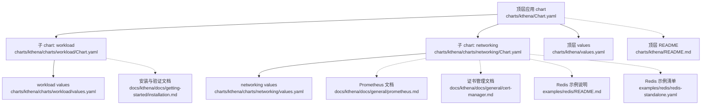
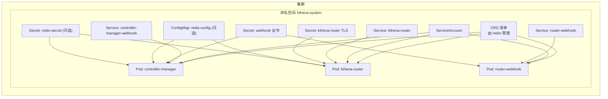
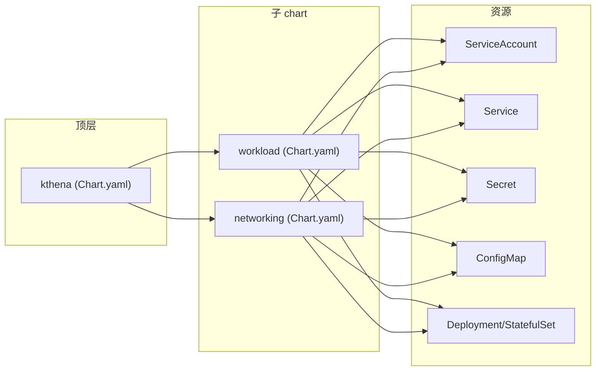

# 部署配置

<cite>
**本文引用的文件**
- [charts/kthena/Chart.yaml](file://charts/kthena/Chart.yaml)
- [charts/kthena/values.yaml](file://charts/kthena/values.yaml)
- [charts/kthena/README.md](file://charts/kthena/README.md)
- [charts/kthena/values.schema.json](file://charts/kthena/values.schema.json)
- [charts/kthena/charts/workload/Chart.yaml](file://charts/kthena/charts/workload/Chart.yaml)
- [charts/kthena/charts/workload/values.yaml](file://charts/kthena/charts/workload/values.yaml)
- [charts/kthena/charts/networking/Chart.yaml](file://charts/kthena/charts/networking/Chart.yaml)
- [charts/kthena/charts/networking/values.yaml](file://charts/kthena/charts/networking/values.yaml)
- [examples/redis/README.md](file://examples/redis/README.md)
- [examples/redis/redis-standalone.yaml](file://examples/redis/redis-standalone.yaml)
- [docker/Dockerfile.kthena-controller-manager](file://docker/Dockerfile.kthena-controller-manager)
- [docker/Dockerfile.kthena-router](file://docker/Dockerfile.kthena-router)
- [benchmark/kthena-router/Dockerfile](file://benchmark/kthena-router/Dockerfile)
- [docs/kthena/docs/getting-started/installation.md](file://docs/kthena/docs/getting-started/installation.md)
- [docs/kthena/docs/general/prometheus.md](file://docs/kthena/docs/general/prometheus.md)
- [docs/kthena/docs/general/cert-manager.md](file://docs/kthena/docs/general/cert-manager.md)
</cite>

## 目录
1. [简介](#简介)
2. [项目结构](#项目结构)
3. [核心组件](#核心组件)
4. [架构总览](#架构总览)
5. [详细组件分析](#详细组件分析)
6. [依赖关系分析](#依赖关系分析)
7. [性能考虑](#性能考虑)
8. [故障排查指南](#故障排查指南)
9. [结论](#结论)
10. [附录](#附录)

## 简介
本指南面向在 Kubernetes 上部署与配置 Kthena 平台的工程团队，覆盖 Helm Charts 结构与配置项、网络与工作负载组件的部署参数、多环境（开发/测试/生产）最佳实践、容器镜像构建流程、网络/存储/安全/监控配置、故障排查与性能调优，以及针对不同 Kubernetes 发行版与云平台的部署要点。

## 项目结构
Kthena 采用 Helm 三层结构：顶层应用 chart 负责聚合与依赖管理，两个子 chart 分别负责“工作负载控制器”和“网络路由”。顶层 README 提供安装、校验、证书与 Redis 部署等关键说明；各子 chart 的 values.yaml 定义了可调参的默认值与资源限制。

图示来源
- [charts/kthena/Chart.yaml:1-22](file://charts/kthena/Chart.yaml#L1-L22)
- [charts/kthena/values.yaml:1-97](file://charts/kthena/values.yaml#L1-L97)
- [charts/kthena/charts/workload/Chart.yaml:1-14](file://charts/kthena/charts/workload/Chart.yaml#L1-L14)
- [charts/kthena/charts/networking/Chart.yaml:1-14](file://charts/kthena/charts/networking/Chart.yaml#L1-L14)
- [charts/kthena/README.md:1-255](file://charts/kthena/README.md#L1-L255)
- [docs/kthena/docs/general/prometheus.md:1-800](file://docs/kthena/docs/general/prometheus.md#L1-L800)
- [docs/kthena/docs/general/cert-manager.md:1-275](file://docs/kthena/docs/general/cert-manager.md#L1-L275)
- [docs/kthena/docs/getting-started/installation.md:1-137](file://docs/kthena/docs/getting-started/installation.md#L1-L137)
- [examples/redis/README.md:1-73](file://examples/redis/README.md#L1-L73)
- [examples/redis/redis-standalone.yaml:1-98](file://examples/redis/redis-standalone.yaml#L1-L98)

章节来源
- [charts/kthena/Chart.yaml:1-22](file://charts/kthena/Chart.yaml#L1-L22)
- [charts/kthena/README.md:17-106](file://charts/kthena/README.md#L17-L106)

## 核心组件
- 顶层应用 chart：定义版本、应用版本与子 chart 依赖条件，控制是否启用 workload 与 networking 子 chart。
- 子 chart workload：部署控制器管理器、下载器与运行时容器，支持 webhook、资源配额、控制器选择与 API 限流参数。
- 子 chart networking：部署 Kthena Router、Router Webhook，支持 TLS、访问日志、公平调度、Gateway API 与 API 限流参数。
- 全局配置：证书管理模式（auto/cert-manager/manual），以及 webhook CA Bundle（仅 manual 模式需要）。

章节来源
- [charts/kthena/Chart.yaml:16-22](file://charts/kthena/Chart.yaml#L16-L22)
- [charts/kthena/values.yaml:1-97](file://charts/kthena/values.yaml#L1-L97)
- [charts/kthena/charts/workload/values.yaml:1-51](file://charts/kthena/charts/workload/values.yaml#L1-L51)
- [charts/kthena/charts/networking/values.yaml:1-92](file://charts/kthena/charts/networking/values.yaml#L1-L92)
- [charts/kthena/values.schema.json:1-26](file://charts/kthena/values.schema.json#L1-L26)

## 架构总览
下图展示 Helm 部署顺序与组件交互：顶层 CRD 先于资源清单安装；workload 与 networking 子 chart 各自提供控制器与路由组件；webhook 通过证书机制保障安全通信；可选 Redis 用于 KV 缓存与全局限流。

图示来源
- [charts/kthena/README.md:49-106](file://charts/kthena/README.md#L49-L106)
- [charts/kthena/values.yaml:25-68](file://charts/kthena/values.yaml#L25-L68)
- [charts/kthena/charts/networking/values.yaml:11-28](file://charts/kthena/charts/networking/values.yaml#L11-L28)
- [examples/redis/redis-standalone.yaml:6-48](file://examples/redis/redis-standalone.yaml#L6-L48)

## 详细组件分析

### Helm Charts 结构与依赖
- 顶层应用 chart 通过 dependencies 字段声明子 chart，并以 values 中的 enabled 条件控制是否渲染。
- 子 chart workload 与 networking 各自维护独立的 Chart.yaml 与 values.yaml，默认镜像仓库与标签来自 ghcr.io/volcano-sh，便于从 OCI 仓库直接安装。

章节来源
- [charts/kthena/Chart.yaml:16-22](file://charts/kthena/Chart.yaml#L16-L22)
- [charts/kthena/charts/workload/Chart.yaml:1-14](file://charts/kthena/charts/workload/Chart.yaml#L1-L14)
- [charts/kthena/charts/networking/Chart.yaml:1-14](file://charts/kthena/charts/networking/Chart.yaml#L1-L14)

### 工作负载子 chart（workload）
- 控制器管理器镜像与拉取策略、replicas 数量、资源请求/限制、控制器启用列表、API 限流参数。
- 下载器与运行时镜像配置，支持设置访问密钥。
- webhook 开关与证书 Secret 名称、服务名。

章节来源
- [charts/kthena/charts/workload/values.yaml:1-51](file://charts/kthena/charts/workload/values.yaml#L1-L51)

### 网络子 chart（networking）
- Kthena Router 镜像与端口、调试端口、TLS 开关与证书 Secret 名称、DNS 名称。
- Router Webhook 镜像、端口、服务端口、证书路径与 Secret 名称。
- 公平调度窗口大小与权重、访问日志格式与输出目标。
- Gateway API 开关与推理扩展开关。
- API 限流参数。

章节来源
- [charts/kthena/charts/networking/values.yaml:1-92](file://charts/kthena/charts/networking/values.yaml#L1-L92)

### 顶层 values 与全局配置
- 顶层 values 启用/禁用子 chart，并统一配置 Router 与 Controller Manager 的镜像、拉取策略、webhook 证书等。
- 全局字段包含证书管理模式（auto/cert-manager/manual）与手动模式所需的 CA Bundle。

章节来源
- [charts/kthena/values.yaml:1-97](file://charts/kthena/values.yaml#L1-L97)
- [charts/kthena/values.schema.json:1-26](file://charts/kthena/values.schema.json#L1-L26)

### 安装与验证流程（Helm）
- 支持从 OCI 仓库直接安装、或使用打包 chart、或使用 GitHub Releases 单一清单。
- 提供 lint、template、dry-run 等常用调试命令。
- 安装后检查 CRD、Pods、Services 状态。

章节来源
- [docs/kthena/docs/getting-started/installation.md:24-114](file://docs/kthena/docs/getting-started/installation.md#L24-L114)
- [charts/kthena/README.md:114-132](file://charts/kthena/README.md#L114-L132)

### 证书管理（Webhook 与 Router TLS）
- 三种模式：auto（自签）、cert-manager（自动化生命周期）、manual（自管 CA）。
- auto 模式无需外部依赖，支持多副本安全启动；cert-manager 模式自动创建 Issuer/Certificate/Secret；manual 模式需提供 base64 CA Bundle。
- Router TLS 可单独开启并指定 DNS 名称与 Secret 名称。

章节来源
- [docs/kthena/docs/general/cert-manager.md:1-275](file://docs/kthena/docs/general/cert-manager.md#L1-L275)
- [charts/kthena/values.yaml:85-97](file://charts/kthena/values.yaml#L85-L97)
- [charts/kthena/charts/networking/values.yaml:5-10](file://charts/kthena/charts/networking/values.yaml#L5-L10)

### Redis 集成（可选）
- 当使用 KV Cache 或全局限流时，需部署 Redis 并提供 ConfigMap 与 Secret。
- 提供快速部署清单与生产注意事项（高可用、持久化、认证、监控、备份）。

章节来源
- [examples/redis/README.md:1-73](file://examples/redis/README.md#L1-L73)
- [examples/redis/redis-standalone.yaml:1-98](file://examples/redis/redis-standalone.yaml#L1-L98)
- [charts/kthena/README.md:214-254](file://charts/kthena/README.md#L214-L254)

### 容器镜像构建与发布
- 控制器管理器镜像构建：基于 distroless 静态镜像，二进制由 Go 构建，非 root 用户运行。
- Kthena Router 镜像构建：同上，二进制由 Go 构建。
- 基准工具镜像：Python 基础镜像，预装依赖与数据集，用于性能基准测试。

章节来源
- [docker/Dockerfile.kthena-controller-manager:1-33](file://docker/Dockerfile.kthena-controller-manager#L1-L33)
- [docker/Dockerfile.kthena-router:1-33](file://docker/Dockerfile.kthena-router#L1-L33)
- [benchmark/kthena-router/Dockerfile:1-35](file://benchmark/kthena-router/Dockerfile#L1-L35)

## 依赖关系分析
- 顶层 chart 依赖 workload 与 networking 子 chart，且受 values 中 enabled 条件控制。
- 子 chart 内部组件通过 ServiceAccount、Service、Secret、ConfigMap、Deployment/StatefulSet 等资源协同。
- 证书依赖：webhook 与 Router TLS 依赖 Secret 或 cert-manager 自动下发的证书。
- Redis 依赖：当启用 KV Cache 或全局限流时，控制器与 Router 读取 ConfigMap/Secret。

图示来源
- [charts/kthena/Chart.yaml:16-22](file://charts/kthena/Chart.yaml#L16-L22)
- [charts/kthena/charts/workload/Chart.yaml:1-14](file://charts/kthena/charts/workload/Chart.yaml#L1-L14)
- [charts/kthena/charts/networking/Chart.yaml:1-14](file://charts/kthena/charts/networking/Chart.yaml#L1-L14)

章节来源
- [charts/kthena/Chart.yaml:16-22](file://charts/kthena/Chart.yaml#L16-L22)

## 性能考虑
- 资源配额：为控制器与 Router 设置合理的 requests/limits，避免资源争抢。
- 公平调度：开启公平调度并调整窗口与权重，平衡输入/输出令牌对吞吐的影响。
- 访问日志：生产环境建议使用文本格式并输出到 stdout/stderr，结合集中日志系统。
- API 限流：根据 apiserver 负载设置 kubeAPIQPS/kubeAPIBurst，避免过载。
- 网络与路由：启用 TLS 时注意证书链长度与重连开销；必要时开启连接复用。
- 监控指标：Prometheus 抓取控制器与 Router 的 /metrics 端点，建立延迟、错误率、内存/GPU 利用率等告警。

章节来源
- [charts/kthena/charts/workload/values.yaml:18-34](file://charts/kthena/charts/workload/values.yaml#L18-L34)
- [charts/kthena/charts/networking/values.yaml:29-68](file://charts/kthena/charts/networking/values.yaml#L29-L68)
- [docs/kthena/docs/general/prometheus.md:123-615](file://docs/kthena/docs/general/prometheus.md#L123-L615)

## 故障排查指南
- 证书问题
  - auto 模式：确认 ServiceAccount 对 Secret 的创建/读取权限。
  - cert-manager 模式：检查 Issuer/Certificate 是否就绪，查看 cert-manager 日志。
  - manual 模式：确认 CA Bundle 正确编码并注入到 API Server。
- Router TLS
  - 确认 DNS 名称可解析，Secret 中证书未过期。
- Redis 问题
  - 确认 ConfigMap/Secret 名称与命名空间正确，网络连通性良好。
- 安装与卸载
  - 使用 helm lint/template/dry-run 排查模板渲染问题。
  - 卸载前注意 CRD 删除会级联删除所有 CR 实例，需提前备份。

章节来源
- [docs/kthena/docs/general/cert-manager.md:180-275](file://docs/kthena/docs/general/cert-manager.md#L180-L275)
- [charts/kthena/README.md:108-132](file://charts/kthena/README.md#L108-L132)
- [examples/redis/README.md:24-73](file://examples/redis/README.md#L24-L73)

## 结论
通过 Helm 三层结构与清晰的 values 分层，Kthena 能够在不同环境中灵活部署。建议在开发使用 auto 模式快速验证，在测试逐步引入 cert-manager，在生产按需选择 cert-manager 或 manual 模式并配套完善的监控与告警体系。结合资源配额、公平调度与日志/追踪体系，可获得稳定、可观测的推理服务。

## 附录

### 多环境部署策略与最佳实践
- 开发环境
  - 使用 auto 证书模式，关闭 Router TLS，简化部署。
  - 降低资源 requests/limits，启用访问日志到 stdout。
- 测试环境
  - 使用 cert-manager 管理证书，开启 Router TLS 并配置 DNS 名称。
  - 部署 Redis 快速版，验证 KV Cache 与全局限流。
- 生产环境
  - 使用 cert-manager 或 manual 模式，严格管理证书轮换与 CA。
  - 高可用部署 Redis，启用持久化与备份；为控制器与 Router 配置充足的资源与 HPA。
  - 建立完善的 Prometheus/Grafana/Jaeger/Loki 堆栈，配置关键告警规则。

章节来源
- [docs/kthena/docs/general/cert-manager.md:269-275](file://docs/kthena/docs/general/cert-manager.md#L269-L275)
- [examples/redis/README.md:36-73](file://examples/redis/README.md#L36-L73)
- [docs/kthena/docs/general/prometheus.md:34-121](file://docs/kthena/docs/general/prometheus.md#L34-L121)

### 不同 Kubernetes 发行版与云平台的部署要点
- 通用建议
  - 确保集群版本满足要求，具备 Helm 与 kubectl 权限。
  - 在托管集群中，注意网络策略、Ingress/LoadBalancer 类型与节点选择器。
- 云平台差异
  - AWS EKS/Ops：结合 IAM Roles for Service Accounts（IRSA）管理证书与密钥访问。
  - GKE：启用 Workload Identity，减少密钥管理复杂度。
  - AKS：使用 Azure Key Vault for Secrets Store CSI Driver 集成证书。
  - OpenShift：遵循受限 SCC 与网络策略，必要时使用专用 ServiceAccount。

章节来源
- [docs/kthena/docs/getting-started/installation.md:9-23](file://docs/kthena/docs/getting-started/installation.md#L9-L23)

### 关键配置项速查表
- 顶层
  - workload.enabled / networking.enabled
  - global.certManagementMode
  - global.webhook.caBundle（manual 模式）
- workload
  - controllerManager.replicas / image.repository/tag / pullPolicy
  - controllerManager.resource.requests/limits
  - controllerManager.controllers（启用的控制器）
  - controllerManager.kubeAPIQPS / kubeAPIBurst
  - downloaderImage / runtimeImage
- networking
  - kthenaRouter.enabled / replicas / port / debugPort
  - kthenaRouter.image.repository/tag/pullPolicy
  - kthenaRouter.tls.enabled / dnsName / secretName
  - kthenaRouter.accessLog.enabled/format/output
  - kthenaRouter.fairness.enabled/windowSize/inputTokenWeight/outputTokenWeight
  - kthenaRouter.gatewayAPI.enabled/inferenceExtension
  - kthenaRouter.kubeAPIQPS / kubeAPIBurst
  - kthenaRouter.webhook.enabled/port/servicePort/tls.secretName
  - router-webhook.image.repository/tag/pullPolicy
  - router-webhook.resource.requests/limits

章节来源
- [charts/kthena/values.yaml:1-97](file://charts/kthena/values.yaml#L1-L97)
- [charts/kthena/charts/workload/values.yaml:1-51](file://charts/kthena/charts/workload/values.yaml#L1-L51)
- [charts/kthena/charts/networking/values.yaml:1-92](file://charts/kthena/charts/networking/values.yaml#L1-L92)