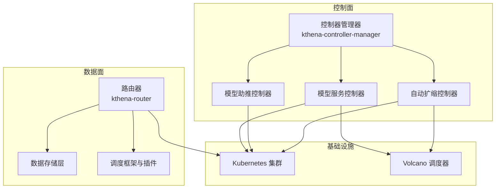
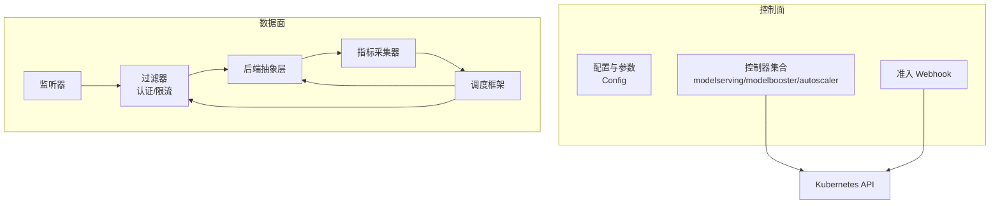
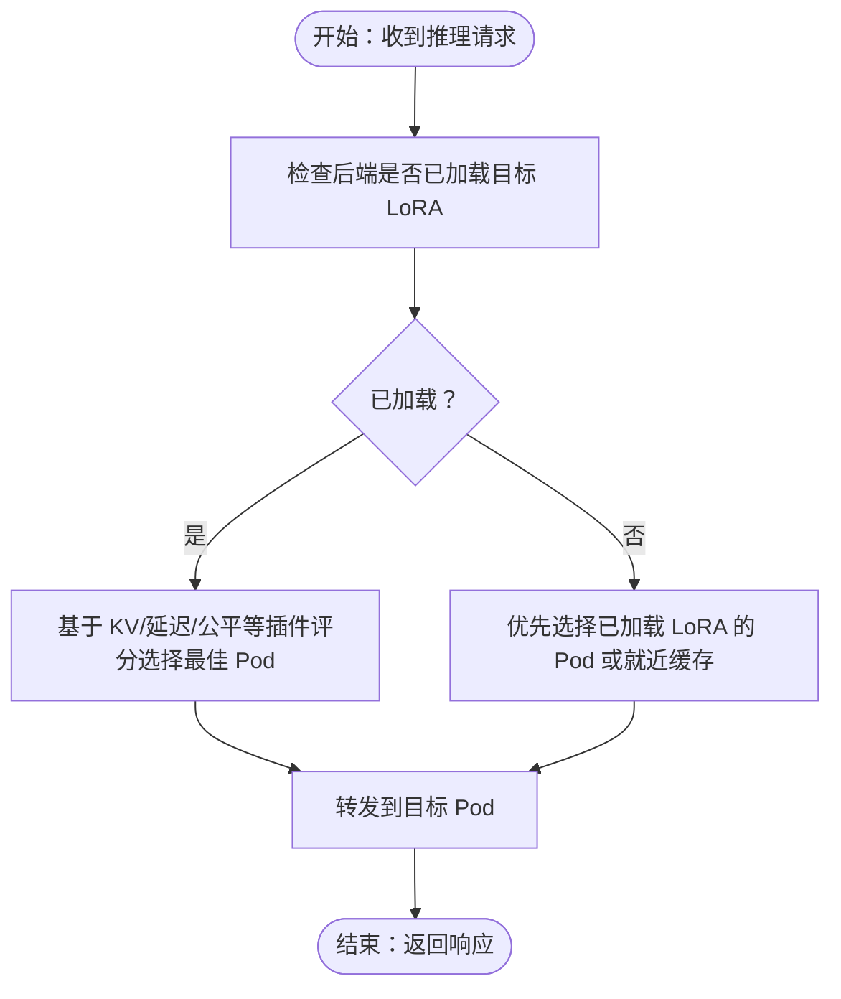
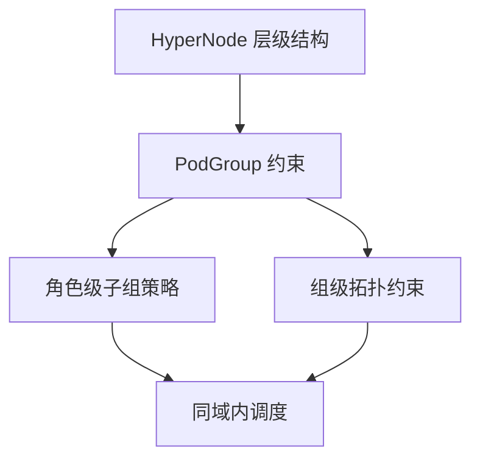
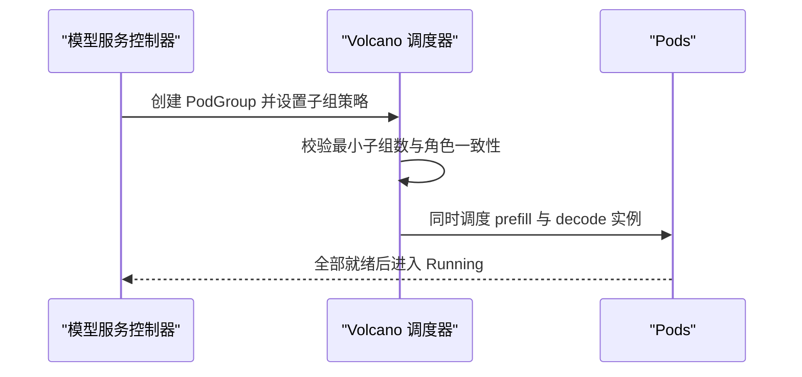
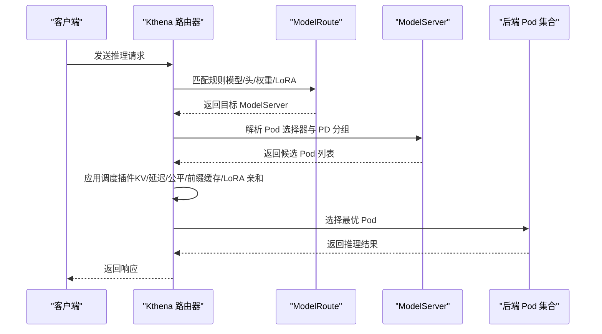
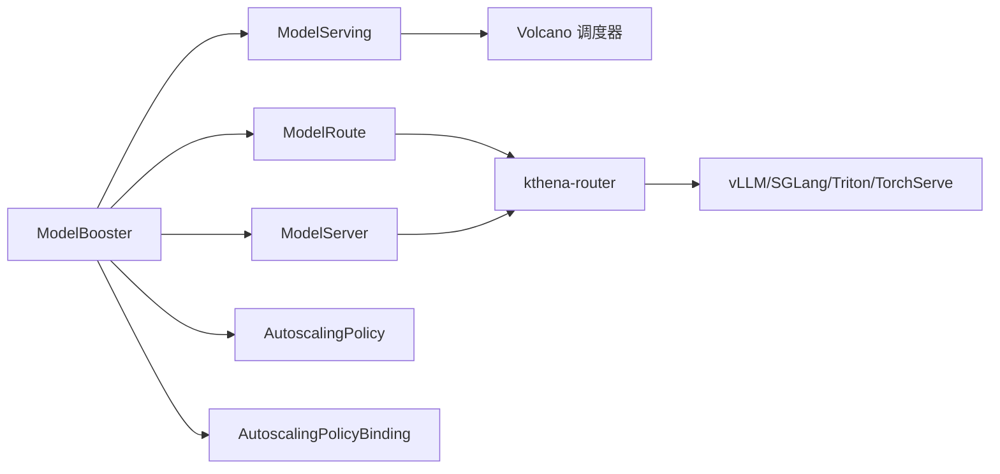

# 关键技术特性

<cite>
**本文引用的文件**
- [README.md](file://README.md)
- [intro.md](file://docs/kthena/docs/intro.md)
- [prefill-decode-disaggregation.mdx](file://docs/kthena/docs/user-guide/prefill-decode-disaggregation/prefill-decode-disaggregation.mdx)
- [autoscaler.md](file://docs/kthena/docs/user-guide/autoscaler.md)
- [gang-scheduling.md](file://docs/kthena/docs/user-guide/gang-scheduling.md)
- [network-topology.md](file://docs/kthena/docs/user-guide/network-topology.md)
- [router-routing.md](file://docs/kthena/docs/user-guide/router-routing.md)
- [kthena-router.md](file://docs/kthena/docs/architecture/kthena-router.md)
- [model-booster-controller.md](file://docs/kthena/docs/architecture/model-booster-controller.md)
- [main.go（控制器管理器）](file://cmd/kthena-controller-manager/main.go)
- [main.go（路由器）](file://cmd/kthena-router/main.go)
- [config.go（控制器）](file://pkg/controller/config.go)
- [values.yaml（Helm 图表）](file://charts/kthena/values.yaml)
- [ModelRoute 类型定义](file://pkg/apis/networking/v1alpha1/modelroute_types.go)
- [ModelServer 类型定义](file://pkg/apis/networking/v1alpha1/modelserver_types.go)
- [ModelServing 类型定义](file://pkg/apis/workload/v1alpha1/model_serving_types.go)
- [AutoscalingPolicy 类型定义](file://pkg/apis/workload/v1alpha1/autoscalingpolicy_types.go)
- [AutoscalingPolicyBinding 类型定义](file://pkg/apis/workload/v1alpha1/autoscalingpolicybinding_types.go)
- [ModelBooster 类型定义](file://pkg/apis/workload/v1alpha1/model_booster_types.go)
- [examples/kthena-router/ModelRoute-prefill-decode-disaggregation.yaml](file://examples/kthena-router/ModelRoute-prefill-decode-disaggregation.yaml)
- [examples/kthena-router/ModelServer-ds1.5b-pd-disaggregation.yaml](file://examples/kthena-router/ModelServer-ds1.5b-pd-disaggregation.yaml)
- [examples/model-serving/prefill-decode-disaggregation.yaml](file://examples/model-serving/prefill-decode-disaggregation.yaml)
- [examples/model-serving/gangPolicy.yaml](file://examples/model-serving/gangPolicy.yaml)
- [examples/model-serving/network-topology.yaml](file://examples/model-serving/network-topology.yaml)
</cite>

## 目录
1. [引言](#引言)
2. [项目结构](#项目结构)
3. [核心组件](#核心组件)
4. [架构总览](#架构总览)
5. [详细组件分析](#详细组件分析)
6. [依赖关系分析](#依赖关系分析)
7. [性能考量](#性能考量)
8. [故障排查指南](#故障排查指南)
9. [结论](#结论)
10. [附录](#附录)

## 引言
本文件聚焦于 Kthena 平台的关键技术特性，围绕以下五大能力展开：生产级 LLM 推理、简化的 LLM 管理、内置网络拓扑感知调度、内置群体调度、智能路由与流量控制。同时深入解析预取-解码分离、成本驱动扩缩容、零停机更新、动态 LoRA 管理等创新点的技术原理、业务价值与落地实践，并提供可操作的配置示例与使用指南。

## 项目结构
Kthena 采用“控制面 + 数据面”的分层架构：
- 控制面：kthena-controller-manager，负责模型生命周期、扩缩容策略、准入校验等。
- 数据面：kthena-router，负责请求接入、路由决策、负载均衡与可观测性。
- CRD 层：通过 ModelBooster、ModelServing、ModelRoute、ModelServer、AutoscalingPolicy 等资源统一编排推理工作负载。
- 插件与适配：支持 vLLM、SGLang、Triton、TorchServe 等引擎；通过 Connector 实现 KV 缓存协同（如 LMCache、MoonCake、NIXL）。

图表来源
- [kthena-router.md:1-84](file://docs/kthena/docs/architecture/kthena-router.md#L1-L84)
- [model-booster-controller.md:1-51](file://docs/kthena/docs/architecture/model-booster-controller.md#L1-L51)
- [main.go（控制器管理器）:54-111](file://cmd/kthena-controller-manager/main.go#L54-L111)
- [main.go（路由器）:40-122](file://cmd/kthena-router/main.go#L40-L122)

章节来源
- [README.md:53-66](file://README.md#L53-L66)
- [intro.md:1-60](file://docs/kthena/docs/intro.md#L1-L60)

## 核心组件
- 控制面组件
  - 模型服务控制器：编排 ModelServing、处理滚动更新、扩缩容与状态同步。
  - 模型助推控制器：以 ModelBooster 为入口，自动生成 ModelRoute、ModelServer、ModelServing、AutoscalingPolicy 及绑定。
  - 自动扩缩控制器：基于多指标与成本约束，执行稳定/紧急模式的弹性策略。
- 数据面组件
  - 路由器：统一接入 LLM 请求，按规则匹配与负载均衡，支持 LoRA/前缀缓存/KV 缓存感知调度。
  - 调度框架：插件化实现最小 KV 使用、最小延迟、公平调度、前缀缓存、LoRA 亲和等算法。
  - 认证与限流：支持 API Key/JWT/OAuth 与令牌级速率限制。
  - 观测性：访问日志、端到端追踪、Prometheus 指标（TTFT/TPOT、队列深度、缓存命中率）。

章节来源
- [kthena-router.md:21-84](file://docs/kthena/docs/architecture/kthena-router.md#L21-L84)
- [model-booster-controller.md:6-35](file://docs/kthena/docs/architecture/model-booster-controller.md#L6-L35)

## 架构总览
Kthena 将控制平面与数据平面解耦，既可独立部署又可协同工作。控制面通过 CRD 抽象与 Volcano 集成，实现跨引擎、跨硬件的统一编排；数据面通过路由器完成请求级的精细化调度与流量治理。

图表来源
- [main.go（控制器管理器）:54-111](file://cmd/kthena-controller-manager/main.go#L54-L111)
- [main.go（路由器）:40-122](file://cmd/kthena-router/main.go#L40-L122)
- [config.go（控制器）:19-28](file://pkg/controller/config.go#L19-L28)
- [kthena-router.md:21-84](file://docs/kthena/docs/architecture/kthena-router.md#L21-L84)

## 详细组件分析

### 特性一：生产级 LLM 推理
- 技术要点
  - 多引擎后端：统一 API 下支持 vLLM、SGLang、Triton、TorchServe，屏蔽差异。
  - 运行时指标：持续采集 TTFT/TPOT、队列长度、KV 缓存利用率、LoRA 状态，用于调度决策。
  - 容器化运行：通过 Helm Chart 一键部署，支持 GPU/NPU 等异构加速器。
- 业务价值
  - 降低运维复杂度，提升吞吐与延迟表现；在多引擎间灵活切换，满足不同场景需求。
- 使用场景
  - 通用大模型推理、低时延对话、高吞吐批量生成。
- 配置示例路径
  - [values.yaml（Helm 图表）](file://charts/kthena/values.yaml)
  - [examples/kthena-router/ModelServer-ds1.5b-pd-disaggregation.yaml](file://examples/kthena-router/ModelServer-ds1.5b-pd-disaggregation.yaml)
  - [examples/kthena-router/ModelRoute-prefill-decode-disaggregation.yaml](file://examples/kthena-router/ModelRoute-prefill-decode-disaggregation.yaml)

章节来源
- [kthena-router.md:11-20](file://docs/kthena/docs/architecture/kthena-router.md#L11-L20)
- [router-routing.md:77-84](file://docs/kthena/docs/user-guide/router-routing.md#L77-L84)

### 特性二：简化的 LLM 管理
- 预取-解码分离（Prefill-Decode Disaggregation）
  - 原理：将输入处理（prefill）与输出生成（decode）拆分至不同角色/实例，独立扩展与优化。
  - 效果：最大化计算带宽利用率，降低解码阶段延迟，提升整体吞吐。
  - 配置示例路径
    - [prefill-decode-disaggregation.mdx:16-31](file://docs/kthena/docs/user-guide/prefill-decode-disaggregation/prefill-decode-disaggregation.mdx#L16-L31)
    - [examples/model-serving/prefill-decode-disaggregation.yaml](file://examples/model-serving/prefill-decode-disaggregation.yaml)
- 成本驱动扩缩容
  - 原理：在稳定/紧急模式下，结合 CPU/GPU/内存/自定义指标与预算约束，选择最优实例组合，避免过度扩容。
  - 效果：在满足 SLO 的前提下，显著降低算力成本。
  - 配置示例路径
    - [autoscaler.md:120-252](file://docs/kthena/docs/user-guide/autoscaler.md#L120-L252)
- 零停机更新
  - 原理：基于分区控制与滚动升级策略，确保升级过程中始终有可用副本。
  - 效果：保障线上服务连续性，缩短升级窗口。
  - 配置示例路径
    - [router-routing.md:124-178](file://docs/kthena/docs/user-guide/router-routing.md#L124-L178)
- 动态 LoRA 管理
  - 原理：路由器根据后端已加载的 LoRA 列表进行亲和调度，避免频繁切换带来的时延。
  - 效果：毫秒级 LoRA 切换，提升用户体验。
  - 配置示例路径
    - [router-routing.md:81-122](file://docs/kthena/docs/user-guide/router-routing.md#L81-L122)

图表来源
- [kthena-router.md:43-50](file://docs/kthena/docs/architecture/kthena-router.md#L43-L50)
- [router-routing.md:81-122](file://docs/kthena/docs/user-guide/router-routing.md#L81-L122)

章节来源
- [prefill-decode-disaggregation.mdx:10-31](file://docs/kthena/docs/user-guide/prefill-decode-disaggregation/prefill-decode-disaggregation.mdx#L10-L31)
- [autoscaler.md:1-331](file://docs/kthena/docs/user-guide/autoscaler.md#L1-L331)
- [router-routing.md:81-122](file://docs/kthena/docs/user-guide/router-routing.md#L81-L122)

### 特性三：内置网络拓扑感知调度
- 原理
  - 借助 Volcano HyperNode 与 PodGroup 的网络拓扑策略，将相关任务尽量调度在同一层级的网络域内，减少跨层通信开销。
  - 支持硬/软约束与最高层级限制，结合子组策略实现角色级（Role）与组级（Group）的多维拓扑约束。
- 效果
  - 显著降低分布式推理中的节点间通信延迟，提升吞吐与稳定性。
- 配置示例路径
  - [network-topology.md:23-78](file://docs/kthena/docs/user-guide/network-topology.md#L23-L78)
  - [examples/model-serving/network-topology.yaml](file://examples/model-serving/network-topology.yaml)

图表来源
- [network-topology.md:10-78](file://docs/kthena/docs/user-guide/network-topology.md#L10-L78)

章节来源
- [network-topology.md:1-207](file://docs/kthena/docs/user-guide/network-topology.md#L1-L207)

### 特性四：内置群体调度（Gang Scheduling）
- 原理
  - 在 PD 分离等场景中，确保 prefill 与 decode 的配对实例同时被调度，避免部分部署导致的资源浪费与性能退化。
  - 通过 Volcano 的子组策略与最小子组数约束，实现角色级与组级的“全有或全无”调度。
- 效果
  - 提升资源利用率，避免半成品部署；简化大规模分布式推理的编排复杂度。
- 配置示例路径
  - [gang-scheduling.md:11-54](file://docs/kthena/docs/user-guide/gang-scheduling.md#L11-L54)
  - [examples/model-serving/gangPolicy.yaml](file://examples/model-serving/gangPolicy.yaml)

图表来源
- [gang-scheduling.md:11-54](file://docs/kthena/docs/user-guide/gang-scheduling.md#L11-L54)

章节来源
- [gang-scheduling.md:1-129](file://docs/kthena/docs/user-guide/gang-scheduling.md#L1-L129)

### 特性五：智能路由与流量控制
- 路由能力
  - 基于模型名、HTTP 头、权重分配、LoRA 名称等多维特征进行路由。
  - 支持 PD 分离路由，按 groupKey 绑定 prefill/decode 实例，协调 KV 状态交换。
- 流量治理
  - 令牌级速率限制、按用户等级的差异化限流、金丝雀发布与 A/B 测试。
- 配置示例路径
  - [router-routing.md:38-302](file://docs/kthena/docs/user-guide/router-routing.md#L38-L302)
  - [ModelRoute 类型定义](file://pkg/apis/networking/v1alpha1/modelroute_types.go)
  - [ModelServer 类型定义](file://pkg/apis/networking/v1alpha1/modelserver_types.go)

图表来源
- [router-routing.md:38-302](file://docs/kthena/docs/user-guide/router-routing.md#L38-L302)
- [kthena-router.md:43-50](file://docs/kthena/docs/architecture/kthena-router.md#L43-L50)

章节来源
- [router-routing.md:1-302](file://docs/kthena/docs/user-guide/router-routing.md#L1-L302)
- [kthena-router.md:1-84](file://docs/kthena/docs/architecture/kthena-router.md#L1-L84)

## 依赖关系分析
- 控制面与数据面
  - 控制面通过 CRD 驱动集群状态，数据面通过监听器与控制器同步的后端信息进行请求转发。
- CRD 依赖
  - ModelBooster → ModelServing/ModelRoute/ModelServer/AutoscalingPolicy/AutoscalingPolicyBinding
  - ModelServing → Volcano PodGroup/Role/子组策略
  - ModelRoute/ModelServer → 路由与流量策略
- 外部依赖
  - Volcano：网络拓扑感知与群体调度
  - Prometheus：指标采集与观测
  - Gateway API（可选）：与上游网关生态兼容

图表来源
- [model-booster-controller.md:18-35](file://docs/kthena/docs/architecture/model-booster-controller.md#L18-L35)
- [main.go（控制器管理器）:54-111](file://cmd/kthena-controller-manager/main.go#L54-L111)
- [main.go（路由器）:40-122](file://cmd/kthena-router/main.go#L40-L122)

章节来源
- [model-booster-controller.md:1-51](file://docs/kthena/docs/architecture/model-booster-controller.md#L1-L51)

## 性能考量
- 调度插件选择
  - 在高并发场景优先考虑“最小 KV 使用”“最小延迟”“公平调度”，在长上下文场景引入“前缀缓存感知”。
- 扩缩容策略
  - 结合“紧急模式阈值”与“稳定窗口”，避免抖动；在多实例类型场景启用成本优化，限定成本膨胀比例。
- 网络拓扑
  - 通过硬约束将相关实例置于同一层级 HyperNode，减少跨层通信；配合子组策略保证角色配对。
- LoRA 亲和
  - 优先选择已加载目标 LoRA 的实例，避免切换开销；结合 KV 缓存命中率提升整体吞吐。

## 故障排查指南
- 路由不生效
  - 检查 ModelRoute 规则匹配顺序与字段（模型名/头/权重/LoRA），确认 ModelServer 的 Pod 选择器与 pdGroup 配置正确。
  - 参考：[router-routing.md:38-302](file://docs/kthena/docs/user-guide/router-routing.md#L38-L302)
- 扩缩容异常
  - 核对 AutoscalingPolicy 的指标、容忍度、稳定窗口与紧急模式配置；检查指标端点暴露与控制器日志。
  - 参考：[autoscaler.md:12-331](file://docs/kthena/docs/user-guide/autoscaler.md#L12-L331)
- 群体调度失败
  - 确认 Volcano 版本满足子组策略要求；检查 PodGroup 的最小子组数与角色标签一致性。
  - 参考：[gang-scheduling.md:11-54](file://docs/kthena/docs/user-guide/gang-scheduling.md#L11-L54)
- 网络拓扑未生效
  - 检查 HyperNode 层级与 PodGroup 的拓扑策略；确认资源声明与角色模板包含资源请求。
  - 参考：[network-topology.md:118-198](file://docs/kthena/docs/user-guide/network-topology.md#L118-L198)

章节来源
- [router-routing.md:254-302](file://docs/kthena/docs/user-guide/router-routing.md#L254-L302)
- [autoscaler.md:307-318](file://docs/kthena/docs/user-guide/autoscaler.md#L307-L318)
- [gang-scheduling.md:56-129](file://docs/kthena/docs/user-guide/gang-scheduling.md#L56-L129)
- [network-topology.md:118-207](file://docs/kthena/docs/user-guide/network-topology.md#L118-L207)

## 结论
Kthena 通过“控制面 + 数据面”的解耦设计，将复杂的 LLM 推理编排与流量治理能力以云原生方式呈现。五大核心特性覆盖从引擎抽象、生命周期管理到路由调度与可观测性的完整链路，配合预取-解码分离、成本驱动扩缩容、零停机更新与动态 LoRA 管理等创新点，有效提升性能、降低成本并增强可维护性。建议结合实际业务场景，优先落地 PD 分离与网络拓扑感知，再逐步引入动态 LoRA 与成本优化扩缩容策略，最终形成稳定高效的生产级推理平台。

## 附录
- 快速开始与安装
  - 参考：[README.md:68-81](file://README.md#L68-L81)
- Helm 部署参数
  - 参考：[values.yaml（Helm 图表）](file://charts/kthena/values.yaml)
- 示例清单
  - 路由与 PD 分离：[ModelRoute-prefill-decode-disaggregation.yaml](file://examples/kthena-router/ModelRoute-prefill-decode-disaggregation.yaml)
  - PD 分离服务端：[ModelServer-ds1.5b-pd-disaggregation.yaml](file://examples/kthena-router/ModelServer-ds1.5b-pd-disaggregation.yaml)
  - PD 分离模型服务：[prefill-decode-disaggregation.yaml](file://examples/model-serving/prefill-decode-disaggregation.yaml)
  - 群体调度策略：[gangPolicy.yaml](file://examples/model-serving/gangPolicy.yaml)
  - 网络拓扑策略：[network-topology.yaml](file://examples/model-serving/network-topology.yaml)