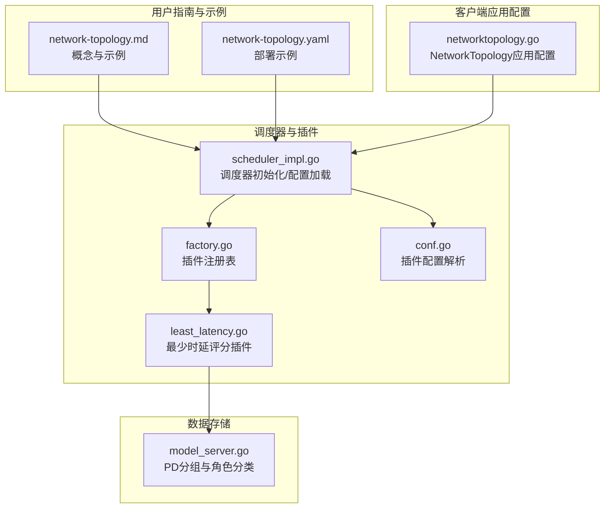
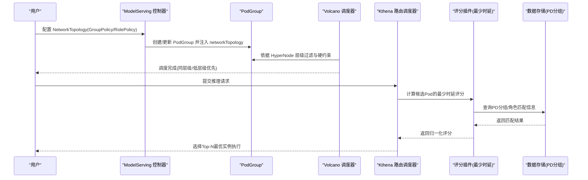
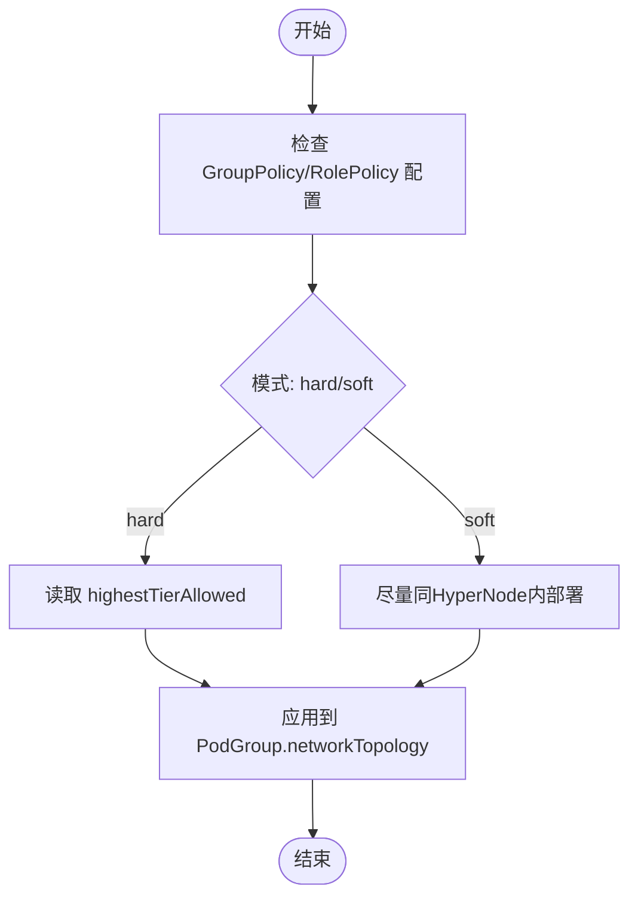
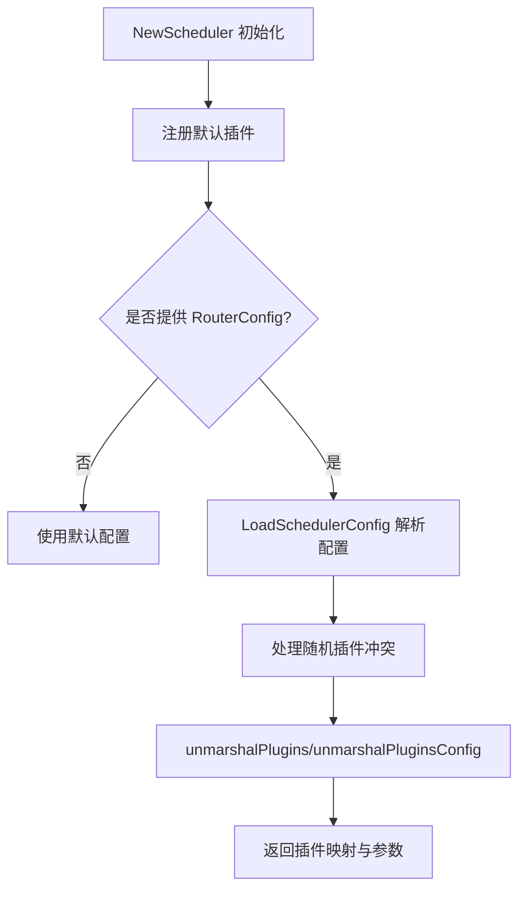
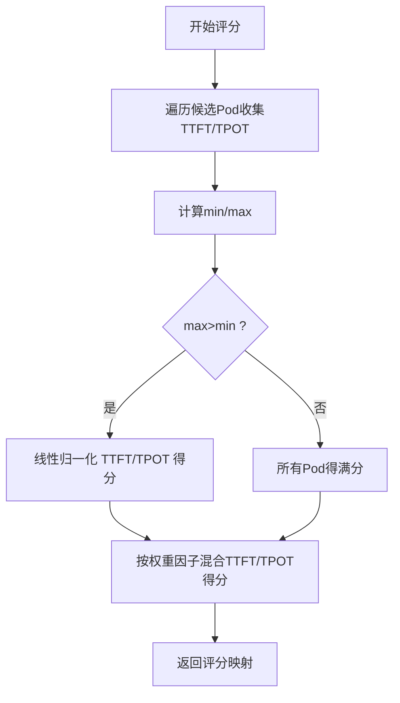
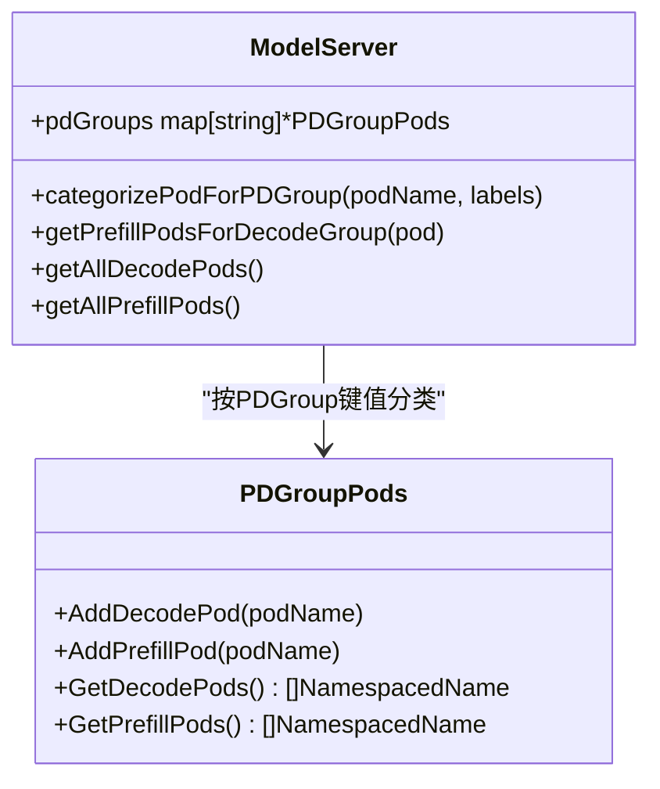
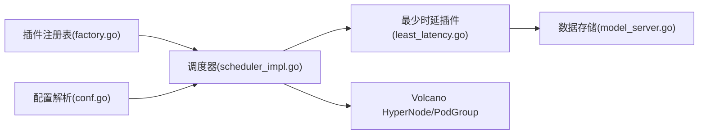

# 内置网络拓扑感知调度

<cite>
**本文引用的文件**
- [network-topology.md](file://docs/kthena/docs/user-guide/network-topology.md)
- [network-topology.yaml](file://examples/model-serving/network-topology.yaml)
- [least_latency.go](file://pkg/kthena-router/scheduler/plugins/least_latency.go)
- [conf.go](file://pkg/kthena-router/scheduler/plugins/conf/conf.go)
- [scheduler_impl.go](file://pkg/kthena-router/scheduler/scheduler_impl.go)
- [factory.go](file://pkg/kthena-router/scheduler/factory.go)
- [networktopology.go](file://client-go/applyconfiguration/workload/v1alpha1/networktopology.go)
- [model_server.go](file://pkg/kthena-router/datastore/model_server.go)
- [config-router.md](file://docs/kthena/docs/user-guide/config-router.md)
</cite>

## 目录
1. [简介](#简介)
2. [项目结构](#项目结构)
3. [核心组件](#核心组件)
4. [架构总览](#架构总览)
5. [详细组件分析](#详细组件分析)
6. [依赖关系分析](#依赖关系分析)
7. [性能考量](#性能考量)
8. [故障排查指南](#故障排查指南)
9. [结论](#结论)
10. [附录](#附录)

## 简介
本章节面向希望在分布式推理场景中通过“网络拓扑感知”提升实例间通信效率与整体推理性能的用户。Kthena 基于 Volcano 的 HyperNode 概念，将网络拓扑抽象为层级化的 HyperNode 树，借助 PodGroup 的 networkTopology 字段约束任务部署范围，使频繁通信的推理角色（如 prefill/decode）尽可能部署在同一层级内，从而降低跨层通信开销，提升吞吐并降低时延。

Kthena 在路由侧的调度器采用多阶段流水线：过滤阶段先筛除资源不满足或不可用节点，评分阶段由多个评分插件并行计算候选 Pod 的适合度得分，随后按权重加权聚合，最终选择 Top-N 进行调度。其中“最少等待请求”“最少时延”“前缀缓存命中”等插件共同作用，既考虑资源负载，也关注端到端时延表现，以实现更优的推理体验。

## 项目结构
围绕网络拓扑感知调度的相关模块分布如下：
- 用户指南与示例：包含网络拓扑概念、HyperNode 层级模型、PodGroup 与子组策略、以及部署示例。
- 调度器与插件：定义调度器工厂、默认插件注册、插件配置加载、评分插件（含最少时延）实现。
- 数据存储：模型服务与 PD 分组的分类存储，支撑跨角色/分组的高效匹配。
- 客户端应用配置：Workload CRD 中的 NetworkTopology 应用配置生成器，便于声明式地设置 GroupPolicy 与 RolePolicy。

**图表来源**
- [network-topology.md:1-207](file://docs/kthena/docs/user-guide/network-topology.md#L1-L207)
- [network-topology.yaml:1-73](file://examples/model-serving/network-topology.yaml#L1-L73)
- [scheduler_impl.go:49-88](file://pkg/kthena-router/scheduler/scheduler_impl.go#L49-L88)
- [factory.go:43-63](file://pkg/kthena-router/scheduler/factory.go#L43-L63)
- [conf.go:82-103](file://pkg/kthena-router/scheduler/plugins/conf/conf.go#L82-L103)
- [least_latency.go:65-96](file://pkg/kthena-router/scheduler/plugins/least_latency.go#L65-L96)
- [model_server.go:76-103](file://pkg/kthena-router/datastore/model_server.go#L76-L103)
- [networktopology.go:25-30](file://client-go/applyconfiguration/workload/v1alpha1/networktopology.go#L25-L30)

**章节来源**
- [network-topology.md:1-207](file://docs/kthena/docs/user-guide/network-topology.md#L1-L207)
- [network-topology.yaml:1-73](file://examples/model-serving/network-topology.yaml#L1-L73)

## 核心组件
- 网络拓扑与 HyperNode
  - 通过 Volcano 的 HyperNode 抽象网络层级，PodGroup 的 networkTopology 支持 hard/soft 模式与最高允许层级限制，确保同组角色尽量部署在同一 HyperNode 或较低层级范围内。
  - Kthena 的 ModelServing 在 ServingGroup 与 Role 上分别支持 GroupPolicy 与 RolePolicy，便于在不同维度上进行拓扑约束。
- 调度器与插件体系
  - 调度器初始化时注册默认插件集合，支持从 ConfigMap 加载插件启用列表、权重与参数；同时处理随机插件与其他评分插件冲突的边界情况。
  - 最少时延插件基于 TTFT/TPOT 的归一化评分，结合权重因子综合评估候选 Pod 的端到端时延潜力。
- 数据存储与 PD 分组
  - 按 PDGroup 键值对 decode/prefill 角色进行分类，便于在相同分组内进行角色匹配与就近调度，减少跨节点通信。

**章节来源**
- [network-topology.md:23-52](file://docs/kthena/docs/user-guide/network-topology.md#L23-L52)
- [scheduler_impl.go:59-88](file://pkg/kthena-router/scheduler/scheduler_impl.go#L59-L88)
- [conf.go:82-103](file://pkg/kthena-router/scheduler/plugins/conf/conf.go#L82-L103)
- [least_latency.go:65-96](file://pkg/kthena-router/scheduler/plugins/least_latency.go#L65-L96)
- [model_server.go:76-103](file://pkg/kthena-router/datastore/model_server.go#L76-L103)

## 架构总览
下图展示了从用户配置到调度执行的关键路径：用户在 ModelServing 中声明 NetworkTopology 策略，控制器生成 PodGroup 并注入 networkTopology；Volcano 根据 HyperNode 层级约束进行过滤与调度；路由侧调度器在评分阶段引入“最少时延”等插件，进一步优化实例间的通信质量与时延表现。

**图表来源**
- [network-topology.md:39-52](file://docs/kthena/docs/user-guide/network-topology.md#L39-L52)
- [network-topology.yaml:11-17](file://examples/model-serving/network-topology.yaml#L11-L17)
- [least_latency.go:65-96](file://pkg/kthena-router/scheduler/plugins/least_latency.go#L65-L96)
- [model_server.go:76-103](file://pkg/kthena-router/datastore/model_server.go#L76-L103)

## 详细组件分析

### 组件A：网络拓扑策略与声明式配置
- 功能要点
  - 在 ServingGroup 与 Role 上分别设置 GroupPolicy 与 RolePolicy，支持 hard/soft 模式与 highestTierAllowed。
  - 通过 subGroupPolicy 实现任务级的子组划分与拓扑约束，配合 Volcano 的 PodGroup 机制实现更细粒度的拓扑感知调度。
- 典型配置
  - GroupPolicy 限定 ServingGroup 可部署的最高层级，RolePolicy 限定单个角色可部署的最高层级。
  - 示例参考：[network-topology.yaml:11-17](file://examples/model-serving/network-topology.yaml#L11-L17)

**图表来源**
- [network-topology.md:23-52](file://docs/kthena/docs/user-guide/network-topology.md#L23-L52)
- [network-topology.yaml:11-17](file://examples/model-serving/network-topology.yaml#L11-L17)

**章节来源**
- [network-topology.md:23-52](file://docs/kthena/docs/user-guide/network-topology.md#L23-L52)
- [network-topology.yaml:1-73](file://examples/model-serving/network-topology.yaml#L1-L73)

### 组件B：调度器初始化与插件配置加载
- 功能要点
  - 默认注册一组评分/过滤插件，支持从 ConfigMap 加载插件启用列表、权重与参数。
  - 处理随机插件与其它评分插件共存的冲突，避免无意义混合评分。
- 关键流程
  - 读取 RouterConfiguration 中的 scheduler 配置，解析插件启用与权重。
  - 将插件参数反序列化为 RawExtension，供各插件构造函数使用。
  - 对评分插件权重进行边界校验（如负数置零），保证调度稳定性。

**图表来源**
- [scheduler_impl.go:59-88](file://pkg/kthena-router/scheduler/scheduler_impl.go#L59-L88)
- [conf.go:82-103](file://pkg/kthena-router/scheduler/plugins/conf/conf.go#L82-L103)
- [factory.go:43-63](file://pkg/kthena-router/scheduler/factory.go#L43-L63)

**章节来源**
- [scheduler_impl.go:59-88](file://pkg/kthena-router/scheduler/scheduler_impl.go#L59-L88)
- [conf.go:82-103](file://pkg/kthena-router/scheduler/plugins/conf/conf.go#L82-L103)
- [config-router.md:54-97](file://docs/kthena/docs/user-guide/config-router.md#L54-L97)

### 组件C：最少时延评分插件
- 算法原理
  - 基于 TTFT（首次 token 时延）与 TPOT（后续 token 平均时延）计算每 Pod 的评分。
  - 先遍历求得 TTFT/TPOT 的最小值与最大值，再对每个 Pod 进行线性归一化，得到分数区间 [0, 100]。
  - 使用权重因子组合 TTFT 与 TPOT 的贡献，形成最终评分。
- 性能影响
  - 时延越低的实例得分越高，有助于在拓扑相近的前提下进一步优选低时延实例，提升端到端推理体验。

**图表来源**
- [least_latency.go:65-96](file://pkg/kthena-router/scheduler/plugins/least_latency.go#L65-L96)
- [least_latency.go:98-130](file://pkg/kthena-router/scheduler/plugins/least_latency.go#L98-L130)

**章节来源**
- [least_latency.go:65-96](file://pkg/kthena-router/scheduler/plugins/least_latency.go#L65-L96)
- [least_latency.go:98-130](file://pkg/kthena-router/scheduler/plugins/least_latency.go#L98-L130)

### 组件D：数据存储与 PD 分组匹配
- 功能要点
  - 将 decode/prefill 角色按 PDGroup 键值进行分类，便于在相同分组内进行角色匹配与就近调度。
  - 支持查询某 decode Pod 所在分组对应的 prefill Pod 列表，加速匹配与决策。
- 价值
  - 在拓扑相近的基础上，进一步缩小匹配空间，减少跨节点通信，提升推理吞吐与稳定性。

**图表来源**
- [model_server.go:27-45](file://pkg/kthena-router/datastore/model_server.go#L27-L45)
- [model_server.go:76-103](file://pkg/kthena-router/datastore/model_server.go#L76-L103)
- [model_server.go:158-180](file://pkg/kthena-router/datastore/model_server.go#L158-L180)

**章节来源**
- [model_server.go:76-103](file://pkg/kthena-router/datastore/model_server.go#L76-L103)
- [model_server.go:158-180](file://pkg/kthena-router/datastore/model_server.go#L158-L180)

## 依赖关系分析
- 组件耦合
  - 调度器依赖插件注册表与配置解析模块，插件之间保持松耦合，通过统一接口扩展。
  - 最少时延插件依赖数据存储模块提供的 PD 分组与角色匹配能力，实现更细粒度的匹配与评分。
- 外部依赖
  - 依赖 Volcano 的 HyperNode 与 PodGroup 机制实现拓扑约束与硬软策略。
  - 依赖 Kubernetes 资源标签与选择器进行角色与分组匹配。

**图表来源**
- [factory.go:43-63](file://pkg/kthena-router/scheduler/factory.go#L43-L63)
- [scheduler_impl.go:59-88](file://pkg/kthena-router/scheduler/scheduler_impl.go#L59-L88)
- [conf.go:82-103](file://pkg/kthena-router/scheduler/plugins/conf/conf.go#L82-L103)
- [least_latency.go:65-96](file://pkg/kthena-router/scheduler/plugins/least_latency.go#L65-L96)
- [model_server.go:76-103](file://pkg/kthena-router/datastore/model_server.go#L76-L103)

**章节来源**
- [factory.go:43-63](file://pkg/kthena-router/scheduler/factory.go#L43-L63)
- [scheduler_impl.go:59-88](file://pkg/kthena-router/scheduler/scheduler_impl.go#L59-L88)
- [conf.go:82-103](file://pkg/kthena-router/scheduler/plugins/conf/conf.go#L82-L103)
- [least_latency.go:65-96](file://pkg/kthena-router/scheduler/plugins/least_latency.go#L65-L96)
- [model_server.go:76-103](file://pkg/kthena-router/datastore/model_server.go#L76-L103)

## 性能考量
- 通信带宽与延迟
  - 通过 HyperNode 层级约束，将高频通信的角色部署在同一层级或相邻层级，减少跨层转发，提升带宽利用率并降低尾延迟。
- 评分权重与参数
  - “最少时延”插件的权重因子可调，建议在高并发、低时延敏感场景提高其权重；同时结合“最少等待请求”等插件，平衡排队长度与时延。
- PD 分组与角色匹配
  - 合理设置 PDGroup 键值，使 decode/prefill 在同一分组内匹配，减少跨节点 KV 传输与同步成本。
- 资源与拓扑一致性
  - 确保 role.entryTemplate 与 role.workerTemplate 中声明了明确的资源请求/限制，避免因资源不足导致调度失败或退化。

[本节为通用指导，无需特定文件引用]

## 故障排查指南
- 现象：Pod 长时间处于 Pending
  - 排查点：确认 HyperNode 层级配置与 highestTierAllowed 是否合理；检查 PodGroup 的 networkTopology 是否与集群实际拓扑一致。
  - 参考：[network-topology.md:30-37](file://docs/kthena/docs/user-guide/network-topology.md#L30-L37)
- 现象：实例间通信仍跨层级
  - 排查点：确认 GroupPolicy/RolePolicy 是否正确设置为 hard 模式且层级上限合理；检查 subGroupPolicy 的匹配标签是否生效。
  - 参考：[network-topology.md:56-77](file://docs/kthena/docs/user-guide/network-topology.md#L56-L77)
- 现象：调度器未按预期启用插件
  - 排查点：核对 ConfigMap 中 schedulerConfiguration 的 plugins 与 pluginConfig；确认随机插件与其他评分插件冲突已被自动处理。
  - 参考：[config-router.md:54-97](file://docs/kthena/docs/user-guide/config-router.md#L54-L97)，[conf.go:93-125](file://pkg/kthena-router/scheduler/plugins/conf/conf.go#L93-L125)
- 现象：时延评分异常或波动大
  - 排查点：检查 TTFT/TPOT 指标采集是否正常；调整“最少时延”插件权重因子；确认 PD 分组匹配逻辑是否正确。
  - 参考：[least_latency.go:65-96](file://pkg/kthena-router/scheduler/plugins/least_latency.go#L65-L96)，[model_server.go:158-180](file://pkg/kthena-router/datastore/model_server.go#L158-L180)

**章节来源**
- [network-topology.md:30-37](file://docs/kthena/docs/user-guide/network-topology.md#L30-L37)
- [network-topology.md:56-77](file://docs/kthena/docs/user-guide/network-topology.md#L56-L77)
- [config-router.md:54-97](file://docs/kthena/docs/user-guide/config-router.md#L54-L97)
- [conf.go:93-125](file://pkg/kthena-router/scheduler/plugins/conf/conf.go#L93-L125)
- [least_latency.go:65-96](file://pkg/kthena-router/scheduler/plugins/least_latency.go#L65-L96)
- [model_server.go:158-180](file://pkg/kthena-router/datastore/model_server.go#L158-L180)

## 结论
Kthena 的网络拓扑感知调度通过 Volcano 的 HyperNode 与 PodGroup 机制，将“同层级优先”的拓扑约束落实到调度阶段；在此基础上，路由侧调度器引入“最少时延”等评分插件，进一步在拓扑相近的实例中优选低时延与低排队的候选，从而在多角色协同推理场景中显著降低跨节点通信开销，提升整体吞吐与端到端时延表现。结合合理的 PD 分组与资源声明，可在复杂网络环境中稳定获得可观的性能收益。

[本节为总结性内容，无需特定文件引用]

## 附录

### A. 网络拓扑配置示例
- 在 ModelServing 的 template.networkTopology 中设置 RolePolicy 与 GroupPolicy，控制角色与整体部署的最高层级。
- 示例参考：[network-topology.yaml:11-17](file://examples/model-serving/network-topology.yaml#L11-L17)

**章节来源**
- [network-topology.yaml:1-73](file://examples/model-serving/network-topology.yaml#L1-L73)

### B. 调度策略设置与参数
- 通过 ConfigMap 的 schedulerConfiguration 配置启用插件、权重与参数，例如“最少等待请求”“最少时延”“前缀缓存”等。
- 示例参考：[config-router.md:54-97](file://docs/kthena/docs/user-guide/config-router.md#L54-L97)

**章节来源**
- [config-router.md:54-97](file://docs/kthena/docs/user-guide/config-router.md#L54-L97)

### C. 性能优化建议
- 优先使用 hard 模式并设置合理的 highestTierAllowed，确保关键角色在同一层级内。
- 在高并发场景提高“最少时延”插件权重，同时结合“最少等待请求”平衡排队与响应时间。
- 明确 PD 分组键值，使 decode/prefill 在同一分组内匹配，减少跨节点 KV 传输。

[本节为通用指导，无需特定文件引用]