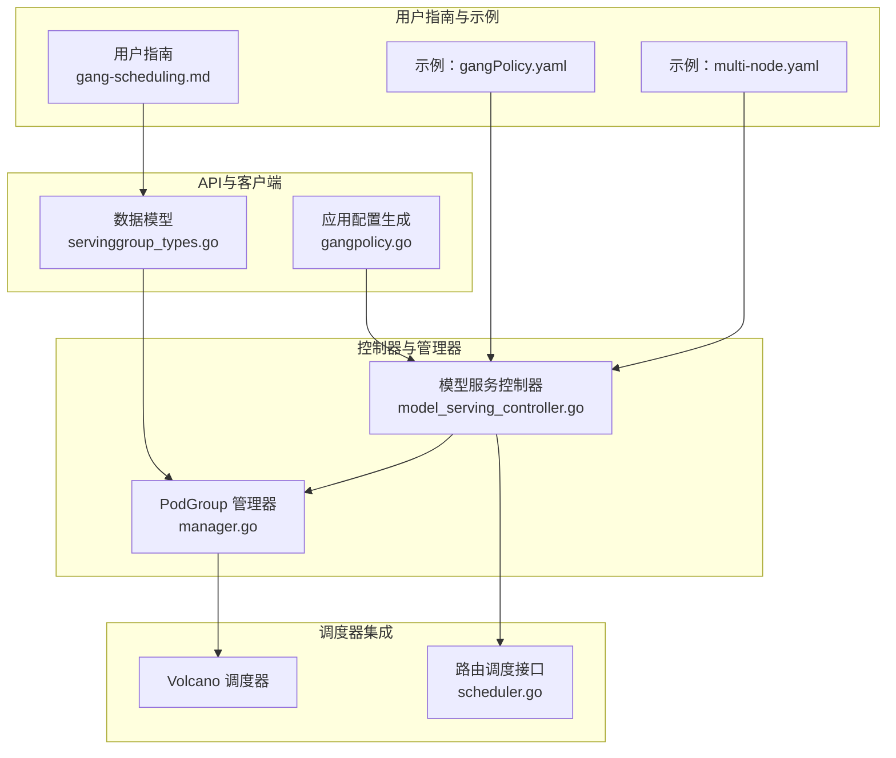
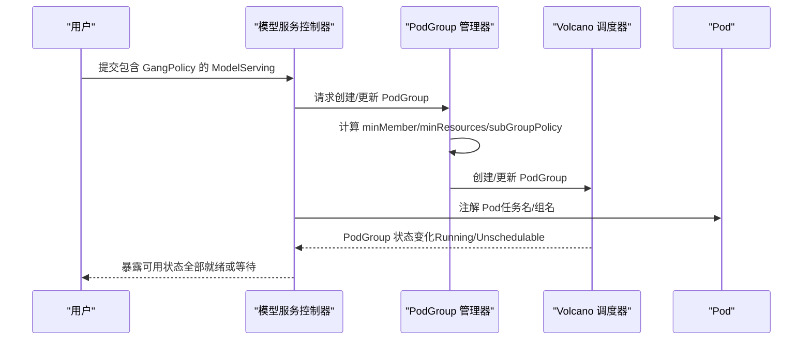
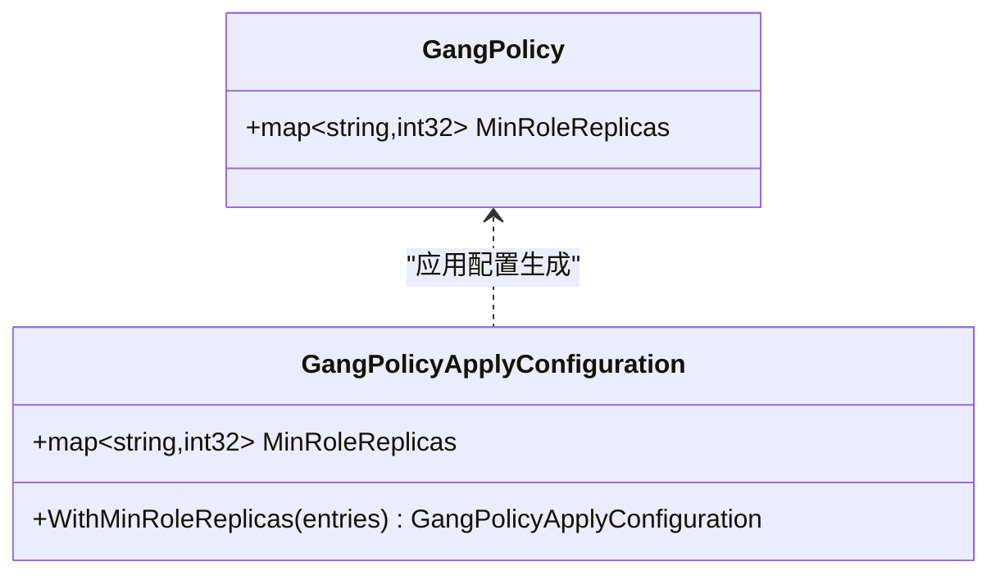
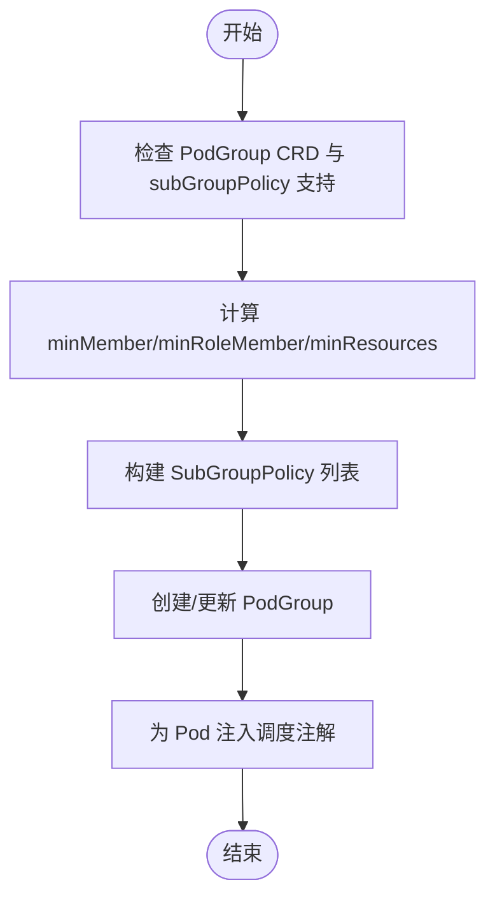
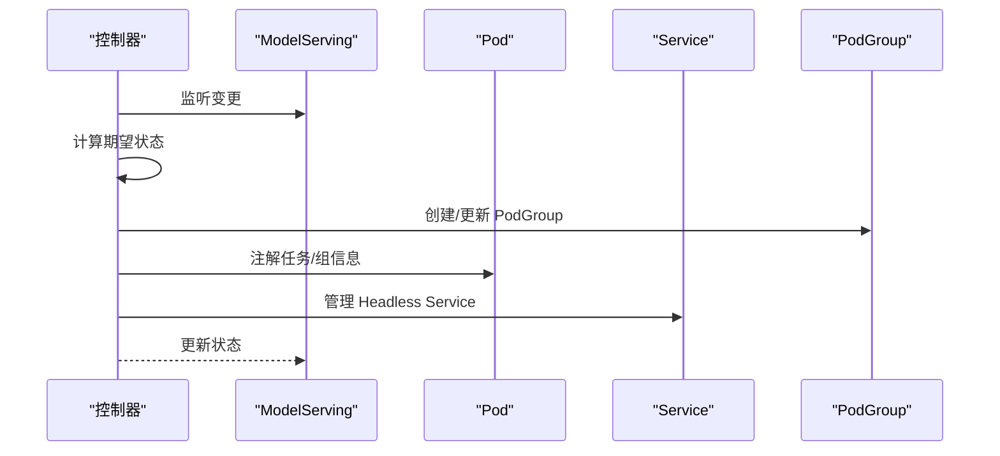
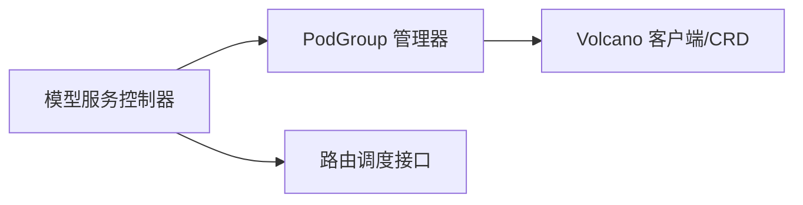

# 内置群体调度

<cite>
**本文引用的文件**
- [gang-scheduling.md](file://docs/kthena/docs/user-guide/gang-scheduling.md)
- [servinggroup_types.go](file://pkg/apis/workload/v1alpha1/servinggroup_types.go)
- [gangpolicy.go](file://client-go/applyconfiguration/workload/v1alpha1/gangpolicy.go)
- [manager.go](file://pkg/model-serving-controller/podgroupmanager/manager.go)
- [model_serving_controller.go](file://pkg/model-serving-controller/controller/model_serving_controller.go)
- [gangPolicy.yaml](file://examples/model-serving/gangPolicy.yaml)
- [multi-node.yaml](file://examples/model-serving/multi-node.yaml)
- [scheduler.go](file://pkg/kthena-router/scheduler/scheduler.go)
</cite>

## 目录
1. [简介](#简介)
2. [项目结构](#项目结构)
3. [核心组件](#核心组件)
4. [架构总览](#架构总览)
5. [详细组件分析](#详细组件分析)
6. [依赖关系分析](#依赖关系分析)
7. [性能考量](#性能考量)
8. [故障排查指南](#故障排查指南)
9. [结论](#结论)
10. [附录](#附录)

## 简介
本章节系统阐述 Kthena 的内置群体调度（Gang Scheduling）能力：其概念、在分布式推理中的关键作用、与 Volcano 调度器的集成方式、如何通过最小角色副本数（MinRoleReplicas）实现“全有或全无”的原子性调度，以及在多维（ServingGroup 与 Role 双层）场景下的策略与配置要点。同时给出可直接落地的配置示例、常见问题定位方法与性能优化建议。

## 项目结构
围绕群体调度的关键代码与文档分布如下：
- 用户指南与设计文档：位于 docs/kthena/docs/user-guide/gang-scheduling.md
- 数据模型定义：pkg/apis/workload/v1alpha1/servinggroup_types.go 中的 GangPolicy 结构体
- 客户端应用配置生成：client-go/applyconfiguration/workload/v1alpha1/gangpolicy.go
- PodGroup 管理与 Volcano 集成：pkg/model-serving-controller/podgroupmanager/manager.go
- 控制器编排与事件处理：pkg/model-serving-controller/controller/model_serving_controller.go
- 示例配置：examples/model-serving/gangPolicy.yaml、examples/model-serving/multi-node.yaml
- 路由侧调度接口：pkg/kthena-router/scheduler/scheduler.go

**图表来源**
- [gang-scheduling.md](file://docs/kthena/docs/user-guide/gang-scheduling.md)
- [servinggroup_types.go](file://pkg/apis/workload/v1alpha1/servinggroup_types.go)
- [gangpolicy.go](file://client-go/applyconfiguration/workload/v1alpha1/gangpolicy.go)
- [model_serving_controller.go](file://pkg/model-serving-controller/controller/model_serving_controller.go)
- [manager.go](file://pkg/model-serving-controller/podgroupmanager/manager.go)
- [gangPolicy.yaml](file://examples/model-serving/gangPolicy.yaml)
- [multi-node.yaml](file://examples/model-serving/multi-node.yaml)
- [scheduler.go](file://pkg/kthena-router/scheduler/scheduler.go)

**章节来源**
- [gang-scheduling.md](file://docs/kthena/docs/user-guide/gang-scheduling.md)
- [servinggroup_types.go](file://pkg/apis/workload/v1alpha1/servinggroup_types.go)
- [gangpolicy.go](file://client-go/applyconfiguration/workload/v1alpha1/gangpolicy.go)
- [model_serving_controller.go](file://pkg/model-serving-controller/controller/model_serving_controller.go)
- [manager.go](file://pkg/model-serving-controller/podgroupmanager/manager.go)
- [gangPolicy.yaml](file://examples/model-serving/gangPolicy.yaml)
- [multi-node.yaml](file://examples/model-serving/multi-node.yaml)
- [scheduler.go](file://pkg/kthena-router/scheduler/scheduler.go)

## 核心组件
- GangPolicy（群体调度策略）
  - 通过 MinRoleReplicas 指定每个 Role 至少需要满足的副本数量，从而保证该 Role 内部的“全有或全无”调度。
  - 若未设置，则默认所有 Role 均需满足全量调度。
- PodGroup 管理器
  - 在启用 Volcano 且存在 PodGroup CRD 的前提下，为每个 ServingGroup 创建/更新 PodGroup，并根据 MinRoleReplicas 计算最小成员数与资源聚合。
  - 支持 subGroupPolicy（Volcano ≥1.14），实现 Role 维度的子组约束。
- 模型服务控制器
  - 监听 ModelServing、Pod、Service 等资源变更，触发 PodGroup 的创建/更新与资源注解，保障调度原子性。
- 路由侧调度接口
  - 提供统一调度接口，便于在路由阶段进行二次决策与钩子扩展。

**章节来源**
- [servinggroup_types.go](file://pkg/apis/workload/v1alpha1/servinggroup_types.go)
- [gangpolicy.go](file://client-go/applyconfiguration/workload/v1alpha1/gangpolicy.go)
- [manager.go](file://pkg/model-serving-controller/podgroupmanager/manager.go)
- [model_serving_controller.go](file://pkg/model-serving-controller/controller/model_serving_controller.go)
- [scheduler.go](file://pkg/kthena-router/scheduler/scheduler.go)

## 架构总览
Kthena 将群体调度能力内嵌于模型服务控制器中，通过 Volcano 的 PodGroup 实现“全有或全无”的调度。控制器负责：
- 解析 ModelServing 的 GangPolicy
- 计算最小成员数与资源聚合
- 创建/更新 PodGroup 并注入 subGroupPolicy
- 为 Pod 注入调度所需标签与注解
- 在路由层提供调度接口以支持上层策略

**图表来源**
- [model_serving_controller.go](file://pkg/model-serving-controller/controller/model_serving_controller.go)
- [manager.go](file://pkg/model-serving-controller/podgroupmanager/manager.go)
- [gang-scheduling.md](file://docs/kthena/docs/user-guide/gang-scheduling.md)

## 详细组件分析

### GangPolicy 数据模型与应用配置
- 数据模型
  - MinRoleReplicas：映射 Role 名称到最小副本数，用于计算 PodGroup 的最小成员与子组策略。
  - 不可变性校验：通过 XValidation 约束，确保 GangPolicy 一旦设置不可变更。
- 应用配置生成
  - 提供 WithMinRoleReplicas 方法，便于声明式地构建 GangPolicyApplyConfiguration。

**图表来源**
- [servinggroup_types.go](file://pkg/apis/workload/v1alpha1/servinggroup_types.go)
- [gangpolicy.go](file://client-go/applyconfiguration/workload/v1alpha1/gangpolicy.go)

**章节来源**
- [servinggroup_types.go](file://pkg/apis/workload/v1alpha1/servinggroup_types.go)
- [gangpolicy.go](file://client-go/applyconfiguration/workload/v1alpha1/gangpolicy.go)

### PodGroup 管理器与 Volcano 集成
- 能力探测
  - 动态检测 PodGroup CRD 是否存在及是否具备 subGroupPolicy 字段，决定是否启用 Role 维度的子组策略。
- 要求计算
  - 基于 MinRoleReplicas 与每个 Role 的副本数、Worker 数，计算：
    - 全局最小成员数（minMember）
    - 角色级最小成员映射（minRoleMember）
    - 资源聚合（minResources）
- 子组策略生成
  - 为每个 Role 生成 SubGroupPolicy 条目，包含：
    - 名称（Role 名）
    - 标签选择器（匹配模型服务名与 Role 名）
    - 最小子组数（等于该 Role 的最小副本数）
    - 子组大小（等于该 Role 每个实例的 Pod 数）
- 注解与队列
  - 为 Pod 注入任务名与组名注解；继承 ModelServing 的队列配置。

**图表来源**
- [manager.go](file://pkg/model-serving-controller/podgroupmanager/manager.go)

**章节来源**
- [manager.go](file://pkg/model-serving-controller/podgroupmanager/manager.go)

### 模型服务控制器的编排与事件处理
- 资源监听
  - 监听 ModelServing、Pod、Service 变更，触发对应处理逻辑。
- 同步流程
  - 管理 ServingGroup 副本、角色、滚动更新、Headless Service。
  - 在缩容/扩容过程中同步更新 PodGroup。
- 错误与删除处理
  - 对失败 Pod 进行错误处理与重试；删除 Pod/Service/Group 时清理状态并触发重均衡。

**图表来源**
- [model_serving_controller.go](file://pkg/model-serving-controller/controller/model_serving_controller.go)

**章节来源**
- [model_serving_controller.go](file://pkg/model-serving-controller/controller/model_serving_controller.go)

### 配置示例与使用指引
- 基础示例（Prefill/Decode 分离）
  - 在 ModelServing 的模板中设置 GangPolicy.minRoleReplicas，分别指定 prefill 与 decode 的最小副本数。
  - 示例路径：examples/model-serving/gangPolicy.yaml
- 多节点推理示例
  - 使用自定义角色名（如 405b），结合 MinRoleReplicas 控制至少启动的副本数。
  - 示例路径：examples/model-serving/multi-node.yaml
- 验证与观测
  - 通过 kubectl 查看 PodGroup 状态与 subGroupPolicy，确认 minSubGroups 与 MinRoleReplicas 匹配。
  - 示例命令与输出参考：docs/kthena/docs/user-guide/gang-scheduling.md

**章节来源**
- [gangPolicy.yaml](file://examples/model-serving/gangPolicy.yaml)
- [multi-node.yaml](file://examples/model-serving/multi-node.yaml)
- [gang-scheduling.md](file://docs/kthena/docs/user-guide/gang-scheduling.md)

### 故障处理机制
- CRD 缺失或版本不满足
  - 当 PodGroup CRD 不存在或不支持 subGroupPolicy 时，控制器会禁用相关能力并记录日志。
- 调度失败与回退
  - 控制器对冲突操作采用重试策略；若 PodGroup 更新失败，将按指数退避重试。
- 清理与降级
  - 当移除网络拓扑或 GangPolicy 时，控制器会清理相关 PodGroup，避免悬挂状态。

**章节来源**
- [manager.go](file://pkg/model-serving-controller/podgroupmanager/manager.go)
- [model_serving_controller.go](file://pkg/model-serving-controller/controller/model_serving_controller.go)

## 依赖关系分析
- 控制器依赖 PodGroup 管理器进行调度资源准备
- PodGroup 管理器依赖 Volcano 客户端与 CRD 检测
- 路由侧调度接口与控制器解耦，便于扩展

**图表来源**
- [model_serving_controller.go](file://pkg/model-serving-controller/controller/model_serving_controller.go)
- [manager.go](file://pkg/model-serving-controller/podgroupmanager/manager.go)
- [scheduler.go](file://pkg/kthena-router/scheduler/scheduler.go)

**章节来源**
- [model_serving_controller.go](file://pkg/model-serving-controller/controller/model_serving_controller.go)
- [manager.go](file://pkg/model-serving-controller/podgroupmanager/manager.go)
- [scheduler.go](file://pkg/kthena-router/scheduler/scheduler.go)

## 性能考量
- 资源聚合与最小成员计算
  - 仅纳入达到最小副本阈值的角色实例，减少不必要的资源预留与等待。
- 子组策略粒度
  - 通过 subGroupPolicy 将 Role 维度的约束与全局约束分离，提升调度并发与命中率。
- 队列与优先级
  - 支持从 ModelServing 注解继承队列配置，结合 Volcano 队列策略实现公平与吞吐平衡。
- 扩缩容与滚动更新
  - 在分区更新与扩缩容过程中，尽量复用已有 PodGroup，降低频繁重建带来的抖动。

[本节为通用指导，无需特定文件来源]

## 故障排查指南
- 现象：PodGroup 未创建或状态长期 Pending
  - 检查 Volcano 版本是否满足 ≥1.14，且 PodGroup CRD 已安装。
  - 确认 ModelServing.spec.schedulerName 设置为 volcano。
  - 参考：docs/kthena/docs/user-guide/gang-scheduling.md
- 现象：部分 Role 副本未就绪
  - 检查 GangPolicy.minRoleReplicas 与实际 Role 副本数是否一致。
  - 通过 kubectl describe podgroup 查看 subGroupPolicy 与 minSubGroups。
- 现象：网络拓扑策略未生效
  - 确认 NetworkTopology 配置已在 Role 或 Group 层面正确设置，并满足 Volcano 的网络拓扑支持。

**章节来源**
- [gang-scheduling.md](file://docs/kthena/docs/user-guide/gang-scheduling.md)
- [manager.go](file://pkg/model-serving-controller/podgroupmanager/manager.go)

## 结论
Kthena 的内置群体调度通过 GangPolicy 与 Volcano 的 PodGroup/SubGroupPolicy 协作，实现了 ServingGroup 与 Role 双层的“全有或全无”调度，有效避免了分布式推理中部分部署导致的资源浪费与死锁风险。配合控制器的自动化管理与路由侧调度接口，可在多场景下实现高可靠、高性能的推理服务交付。

[本节为总结性内容，无需特定文件来源]

## 附录
- 关键术语
  - ServingGroup：完成推理任务的最小单元
  - Role：执行推理任务的特定角色（如 prefill/decode）
  - MinRoleReplicas：每个 Role 至少需要满足的副本数
  - SubGroupPolicy：Volcano 的子组策略，用于 Role 维度的约束
- 推荐实践
  - 在 PD 分离等场景下，明确划分 prefill 与 decode 的最小副本数
  - 为高资源消耗的 Role 提前估算资源并设置合理的最小成员数
  - 结合队列与公平策略，平衡多租户场景下的吞吐与延迟

[本节为补充说明，无需特定文件来源]