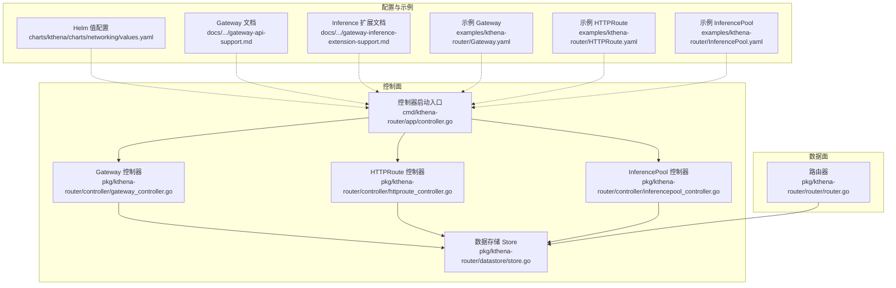
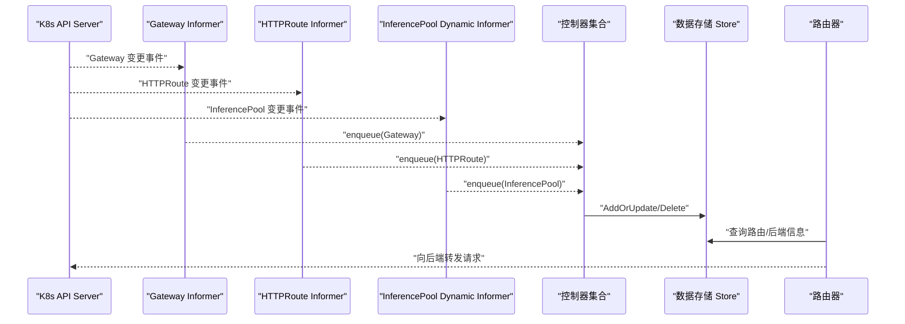
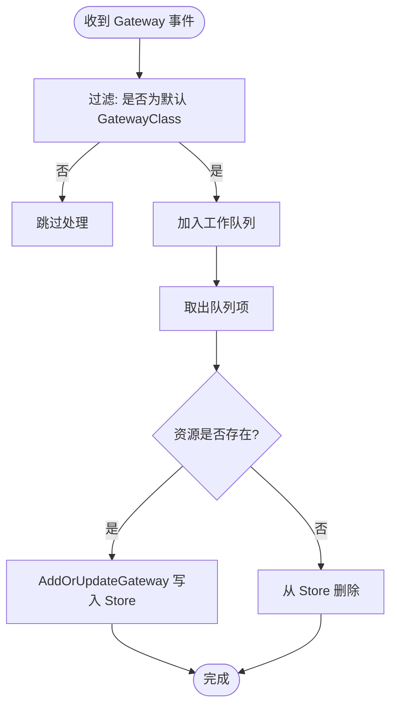
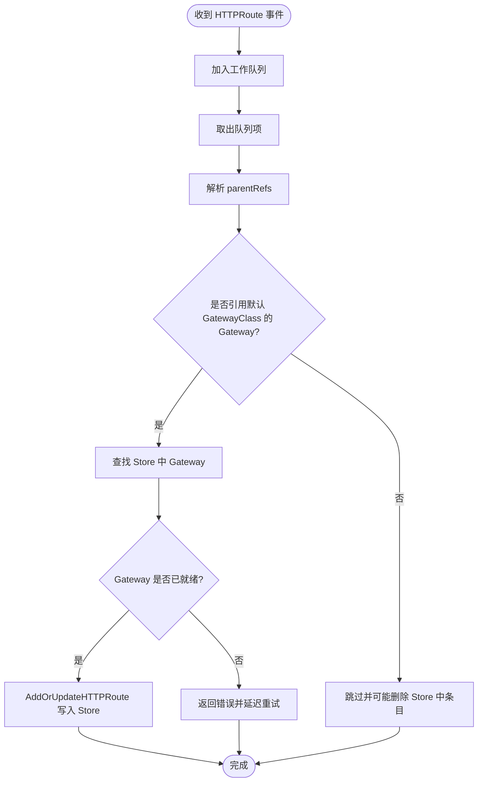
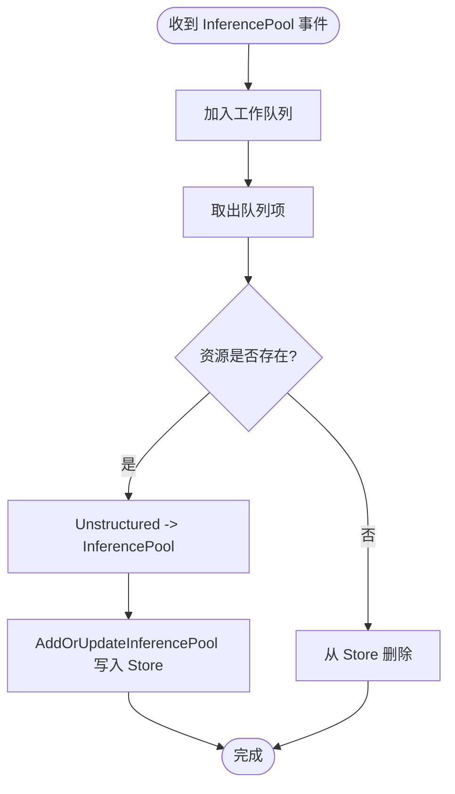
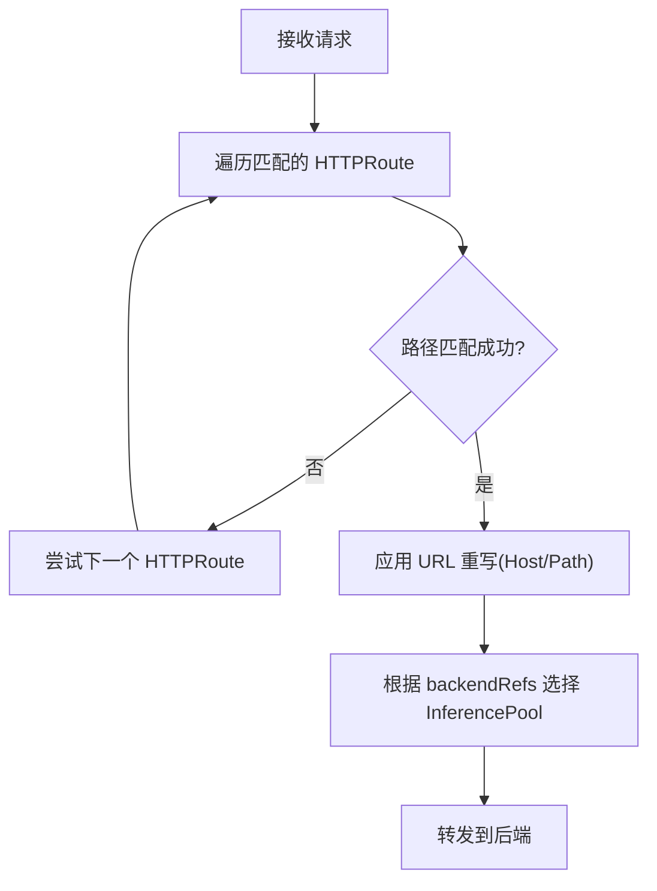
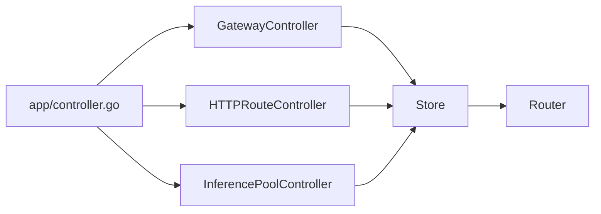

# Gateway API 集成

<cite>
**本文引用的文件**
- [pkg/kthena-router/controller/gateway_controller.go](file://pkg/kthena-router/controller/gateway_controller.go)
- [pkg/kthena-router/controller/httproute_controller.go](file://pkg/kthena-router/controller/httproute_controller.go)
- [pkg/kthena-router/controller/inferencepool_controller.go](file://pkg/kthena-router/controller/inferencepool_controller.go)
- [pkg/kthena-router/controller/constants.go](file://pkg/kthena-router/controller/constants.go)
- [pkg/kthena-router/datastore/store.go](file://pkg/kthena-router/datastore/store.go)
- [pkg/kthena-router/router/router.go](file://pkg/kthena-router/router/router.go)
- [cmd/kthena-router/app/controller.go](file://cmd/kthena-router/app/controller.go)
- [docs/kthena/docs/user-guide/gateway-api-support.md](file://docs/kthena/docs/user-guide/gateway-api-support.md)
- [docs/kthena/docs/user-guide/gateway-inference-extension-support.md](file://docs/kthena/docs/user-guide/gateway-inference-extension-support.md)
- [examples/kthena-router/Gateway.yaml](file://examples/kthena-router/Gateway.yaml)
- [examples/kthena-router/HTTPRoute.yaml](file://examples/kthena-router/HTTPRoute.yaml)
- [examples/kthena-router/InferencePool.yaml](file://examples/kthena-router/InferencePool.yaml)
- [charts/kthena/charts/networking/values.yaml](file://charts/kthena/charts/networking/values.yaml)
</cite>

## 目录
1. [简介](#简介)
2. [项目结构](#项目结构)
3. [核心组件](#核心组件)
4. [架构总览](#架构总览)
5. [详细组件分析](#详细组件分析)
6. [依赖分析](#依赖分析)
7. [性能考虑](#性能考虑)
8. [故障排查指南](#故障排查指南)
9. [结论](#结论)
10. [附录](#附录)

## 简介
本文件面向希望在 Kthena 中启用并掌握 Gateway API 集成能力的读者，系统性阐述以下内容：
- Gateway、HTTPRoute、InferencePool 三种 CRD 的职责与相互关系
- Gateway API 控制器（Gateway、HTTPRoute、InferencePool）的实现机制：资源监听、状态管理、事件处理与重试策略
- HTTPRoute 路由规则配置要点：路径匹配、主机名匹配、请求重写等
- InferencePool 的工作机制及与 Gateway API 的协同，用于更灵活的流量管理与负载均衡
- 完整部署配置示例：证书管理、路由规则、端口暴露与监控
- 结合企业级推理服务场景，给出可落地的网关构建思路与最佳实践

## 项目结构
围绕 Gateway API 的核心代码位于 kthena-router 子模块中，主要包含控制器、数据存储、路由器与启动入口等部分；用户指南与示例位于 docs 与 examples 目录。

图表来源
- [pkg/kthena-router/controller/gateway_controller.go:1-174](file://pkg/kthena-router/controller/gateway_controller.go#L1-L174)
- [pkg/kthena-router/controller/httproute_controller.go:1-232](file://pkg/kthena-router/controller/httproute_controller.go#L1-L232)
- [pkg/kthena-router/controller/inferencepool_controller.go:1-165](file://pkg/kthena-router/controller/inferencepool_controller.go#L1-L165)
- [pkg/kthena-router/datastore/store.go:1-800](file://pkg/kthena-router/datastore/store.go#L1-L800)
- [cmd/kthena-router/app/controller.go:1-292](file://cmd/kthena-router/app/controller.go#L1-L292)
- [charts/kthena/charts/networking/values.yaml:1-92](file://charts/kthena/charts/networking/values.yaml#L1-L92)

章节来源
- [cmd/kthena-router/app/controller.go:55-184](file://cmd/kthena-router/app/controller.go#L55-L184)
- [pkg/kthena-router/controller/gateway_controller.go:47-82](file://pkg/kthena-router/controller/gateway_controller.go#L47-L82)
- [pkg/kthena-router/controller/httproute_controller.go:49-90](file://pkg/kthena-router/controller/httproute_controller.go#L49-L90)
- [pkg/kthena-router/controller/inferencepool_controller.go:46-68](file://pkg/kthena-router/controller/inferencepool_controller.go#L46-L68)

## 核心组件
- Gateway 控制器：监听标准 Gateway API 的 Gateway 资源，仅处理 gatewayClassName 指定为默认类的实例，并将其持久化到 Store，供路由决策使用。
- HTTPRoute 控制器：监听 HTTPRoute 资源，校验 parentRefs 是否指向默认 GatewayClass 的 Gateway；当关联的 Gateway 尚未就绪时会延迟处理，确保一致性。
- InferencePool 控制器：监听 Gateway API Inference Extension 的 InferencePool 资源，通过 Dynamic Informer 动态发现并同步至 Store，作为模型后端的统一抽象。
- 数据存储 Store：集中维护 Gateway、HTTPRoute、InferencePool、ModelServer、Pod 等状态，提供查询与匹配接口，支撑路由与调度。
- 路由器 Router：基于 Store 中的路由规则与后端信息，执行路径匹配、主机匹配、请求重写等逻辑，并进行后端转发。

章节来源
- [pkg/kthena-router/controller/gateway_controller.go:37-45](file://pkg/kthena-router/controller/gateway_controller.go#L37-L45)
- [pkg/kthena-router/controller/httproute_controller.go:38-47](file://pkg/kthena-router/controller/httproute_controller.go#L38-L47)
- [pkg/kthena-router/controller/inferencepool_controller.go:36-44](file://pkg/kthena-router/controller/inferencepool_controller.go#L36-L44)
- [pkg/kthena-router/datastore/store.go:161-240](file://pkg/kthena-router/datastore/store.go#L161-L240)
- [pkg/kthena-router/router/router.go:518-644](file://pkg/kthena-router/router/router.go#L518-L644)

## 架构总览
下图展示了 Gateway API 集成在 Kthena Router 中的整体交互流程：控制器从 API Server 同步资源并写入 Store，路由器在运行期读取 Store 并执行路由与转发。

图表来源
- [cmd/kthena-router/app/controller.go:95-129](file://cmd/kthena-router/app/controller.go#L95-L129)
- [pkg/kthena-router/controller/gateway_controller.go:103-140](file://pkg/kthena-router/controller/gateway_controller.go#L103-L140)
- [pkg/kthena-router/controller/httproute_controller.go:116-148](file://pkg/kthena-router/controller/httproute_controller.go#L116-L148)
- [pkg/kthena-router/controller/inferencepool_controller.go:94-126](file://pkg/kthena-router/controller/inferencepool_controller.go#L94-L126)
- [pkg/kthena-router/datastore/store.go:214-235](file://pkg/kthena-router/datastore/store.go#L214-L235)

## 详细组件分析

### Gateway 控制器
- 职责
  - 过滤并监听指定 GatewayClass 的 Gateway 资源
  - 将 Gateway 写入 Store，或在删除时清理对应键值
  - 提供初始同步信号与重试机制，保证一致性
- 关键点
  - 使用 FilteringResourceEventHandler 仅处理目标 GatewayClass
  - 工作队列带限速重试，失败达到阈值后放弃并记录错误
  - 初始同步完成后更新内部标志位，供上层聚合控制器判断就绪

图表来源
- [pkg/kthena-router/controller/gateway_controller.go:62-79](file://pkg/kthena-router/controller/gateway_controller.go#L62-L79)
- [pkg/kthena-router/controller/gateway_controller.go:142-164](file://pkg/kthena-router/controller/gateway_controller.go#L142-L164)

章节来源
- [pkg/kthena-router/controller/gateway_controller.go:47-82](file://pkg/kthena-router/controller/gateway_controller.go#L47-L82)
- [pkg/kthena-router/controller/gateway_controller.go:103-140](file://pkg/kthena-router/controller/gateway_controller.go#L103-L140)
- [pkg/kthena-router/controller/constants.go:19-30](file://pkg/kthena-router/controller/constants.go#L19-L30)

### HTTPRoute 控制器
- 职责
  - 监听 HTTPRoute，校验 parentRefs 引用的 Gateway 是否属于默认 GatewayClass
  - 当被引用的 Gateway 尚未就绪时延迟处理，避免不一致
  - 将匹配的 HTTPRoute 写入 Store，或在删除时清理
- 关键点
  - 对 Gateway 变更事件进行广播，触发所有相关 HTTPRoute 重新入队
  - 支持多父引用，任一匹配即处理
  - 初始同步完成后更新内部标志位

图表来源
- [pkg/kthena-router/controller/httproute_controller.go:166-195](file://pkg/kthena-router/controller/httproute_controller.go#L166-L195)
- [pkg/kthena-router/controller/httproute_controller.go:206-231](file://pkg/kthena-router/controller/httproute_controller.go#L206-L231)

章节来源
- [pkg/kthena-router/controller/httproute_controller.go:49-90](file://pkg/kthena-router/controller/httproute_controller.go#L49-L90)
- [pkg/kthena-router/controller/httproute_controller.go:116-148](file://pkg/kthena-router/controller/httproute_controller.go#L116-L148)

### InferencePool 控制器
- 职责
  - 通过 Dynamic Informer 监听 InferencePool 资源，动态发现并同步
  - 将 InferencePool 写入 Store，或在删除时清理
- 关键点
  - 使用 Unstructured 转换为强类型对象，便于后续路由匹配
  - 支持与 HTTPRoute 的 backendRefs 组合，实现模型后端的统一抽象

图表来源
- [pkg/kthena-router/controller/inferencepool_controller.go:128-155](file://pkg/kthena-router/controller/inferencepool_controller.go#L128-L155)

章节来源
- [pkg/kthena-router/controller/inferencepool_controller.go:46-68](file://pkg/kthena-router/controller/inferencepool_controller.go#L46-L68)
- [pkg/kthena-router/controller/inferencepool_controller.go:94-126](file://pkg/kthena-router/controller/inferencepool_controller.go#L94-L126)

### 数据存储 Store
- 职责
  - 统一存储 Gateway、HTTPRoute、InferencePool、ModelServer、Pod 等状态
  - 提供查询接口：按 Gateway 查询其绑定的 HTTPRoute、按 Gateway 查询其关联的 ModelRoute 等
  - 提供公平调度相关的令牌跟踪与等待队列统计
- 关键点
  - 多个互斥锁保护不同域的数据并发访问
  - 支持回调注册，用于 Pod/模型变更后的联动

章节来源
- [pkg/kthena-router/datastore/store.go:214-235](file://pkg/kthena-router/datastore/store.go#L214-L235)
- [pkg/kthena-router/datastore/store.go:487-489](file://pkg/kthena-router/datastore/store.go#L487-L489)

### 路由器 Router（HTTPRoute 匹配与重写）
- 路径匹配
  - 支持 Exact、PathPrefix、RegularExpression 三种类型
  - 记录匹配到的前缀以便后续处理
- 主机名匹配
  - 支持 Hostname 类型匹配（具体实现参考上游 Router）
- 请求重写
  - 支持 Hostname 与 Path 全路径替换
- 后端选择
  - 基于 HTTPRoute 的 backendRefs 与 Store 中的 InferencePool 信息进行选择

图表来源
- [pkg/kthena-router/router/router.go:518-644](file://pkg/kthena-router/router/router.go#L518-L644)

章节来源
- [pkg/kthena-router/router/router.go:518-644](file://pkg/kthena-router/router/router.go#L518-L644)

## 依赖分析
- 控制器启动与初始化
  - 启动时根据参数决定是否启用 Gateway API 与 Inference Extension
  - 自动创建默认 GatewayClass 与默认 Gateway，确保最小可用环境
  - 启动 Gateway、HTTPRoute、InferencePool 控制器，并等待各 Informer 缓存同步
- 控制器间耦合
  - HTTPRoute 控制器依赖 Store 中的 Gateway 状态以决定是否处理
  - InferencePool 控制器独立于 HTTPRoute，但两者共同服务于路由后端选择
- 外部依赖
  - Gateway API 与 Inference Extension CRD
  - Kubernetes API Server 与 Informer/Dynamic Informer

图表来源
- [cmd/kthena-router/app/controller.go:95-129](file://cmd/kthena-router/app/controller.go#L95-L129)
- [pkg/kthena-router/controller/gateway_controller.go:103-140](file://pkg/kthena-router/controller/gateway_controller.go#L103-L140)
- [pkg/kthena-router/controller/httproute_controller.go:116-148](file://pkg/kthena-router/controller/httproute_controller.go#L116-L148)
- [pkg/kthena-router/controller/inferencepool_controller.go:94-126](file://pkg/kthena-router/controller/inferencepool_controller.go#L94-L126)

章节来源
- [cmd/kthena-router/app/controller.go:195-291](file://cmd/kthena-router/app/controller.go#L195-L291)

## 性能考虑
- 控制器限速与重试
  - 控制器使用带限速的工作队列，失败达到阈值后放弃，避免雪崩
- Store 并发与缓存
  - 多域互斥锁保护，减少锁竞争；定期刷新 Pod 指标与模型列表
- 公平调度
  - 支持基于令牌窗口的公平队列，可通过环境变量调整窗口大小与权重
- 路由匹配复杂度
  - HTTPRoute 匹配采用线性扫描与正则匹配，建议合理组织规则顺序与数量

章节来源
- [pkg/kthena-router/controller/gateway_controller.go:130-140](file://pkg/kthena-router/controller/gateway_controller.go#L130-L140)
- [pkg/kthena-router/controller/httproute_controller.go:138-148](file://pkg/kthena-router/controller/httproute_controller.go#L138-L148)
- [pkg/kthena-router/datastore/store.go:410-430](file://pkg/kthena-router/datastore/store.go#L410-L430)

## 故障排查指南
- 控制器未就绪
  - 检查默认 GatewayClass 与默认 Gateway 是否创建成功
  - 确认 Informer 缓存同步是否完成
- HTTPRoute 不生效
  - 确认 parentRefs 引用的 Gateway 是否属于默认 GatewayClass
  - 若被引用的 Gateway 尚未就绪，控制器会延迟处理
- InferencePool 未被识别
  - 确认已安装 Inference Extension CRD
  - 确认控制器已启用 Inference Extension 支持
- 路由不匹配
  - 检查 HTTPRoute 的 path/host 匹配规则与请求是否一致
  - 如使用正则，请确认表达式有效

章节来源
- [cmd/kthena-router/app/controller.go:195-291](file://cmd/kthena-router/app/controller.go#L195-L291)
- [pkg/kthena-router/controller/httproute_controller.go:166-195](file://pkg/kthena-router/controller/httproute_controller.go#L166-L195)
- [docs/kthena/docs/user-guide/gateway-inference-extension-support.md:45-52](file://docs/kthena/docs/user-guide/gateway-inference-extension-support.md#L45-L52)

## 结论
Kthena 的 Gateway API 集成通过三类控制器与统一 Store，实现了对标准 Gateway、HTTPRoute 与 InferencePool 的全生命周期管理。配合路由器的路径/主机匹配与请求重写能力，可为企业级推理服务提供灵活、可观测且可扩展的流量管理方案。通过 Helm 值配置与示例清单，可在生产环境中快速落地。

## 附录

### 部署配置与示例
- 启用 Gateway API 与 Inference Extension
  - 在 Helm 值中开启 gatewayAPI.enabled 与 gatewayAPI.inferenceExtension
  - 或在容器参数中添加相应开关
- 默认 Gateway 与 GatewayClass
  - 启动时自动创建默认 GatewayClass 与默认 Gateway
- 示例清单
  - Gateway：示例 Gateway 定义
  - HTTPRoute：示例 HTTPRoute 绑定到 InferencePool
  - InferencePool：示例 InferencePool 选择后端 Pod

章节来源
- [charts/kthena/charts/networking/values.yaml:56-62](file://charts/kthena/charts/networking/values.yaml#L56-L62)
- [cmd/kthena-router/app/controller.go:195-291](file://cmd/kthena-router/app/controller.go#L195-L291)
- [examples/kthena-router/Gateway.yaml:1-12](file://examples/kthena-router/Gateway.yaml#L1-L12)
- [examples/kthena-router/HTTPRoute.yaml:1-20](file://examples/kthena-router/HTTPRoute.yaml#L1-L20)
- [examples/kthena-router/InferencePool.yaml:1-17](file://examples/kthena-router/InferencePool.yaml#L1-L17)

### 用户指南与最佳实践
- Gateway API 支持概述与使用场景
- Inference Extension 集成步骤与验证方法
- 企业级场景下的路由隔离、端口暴露与监控建议

章节来源
- [docs/kthena/docs/user-guide/gateway-api-support.md:1-358](file://docs/kthena/docs/user-guide/gateway-api-support.md#L1-L358)
- [docs/kthena/docs/user-guide/gateway-inference-extension-support.md:1-344](file://docs/kthena/docs/user-guide/gateway-inference-extension-support.md#L1-L344)