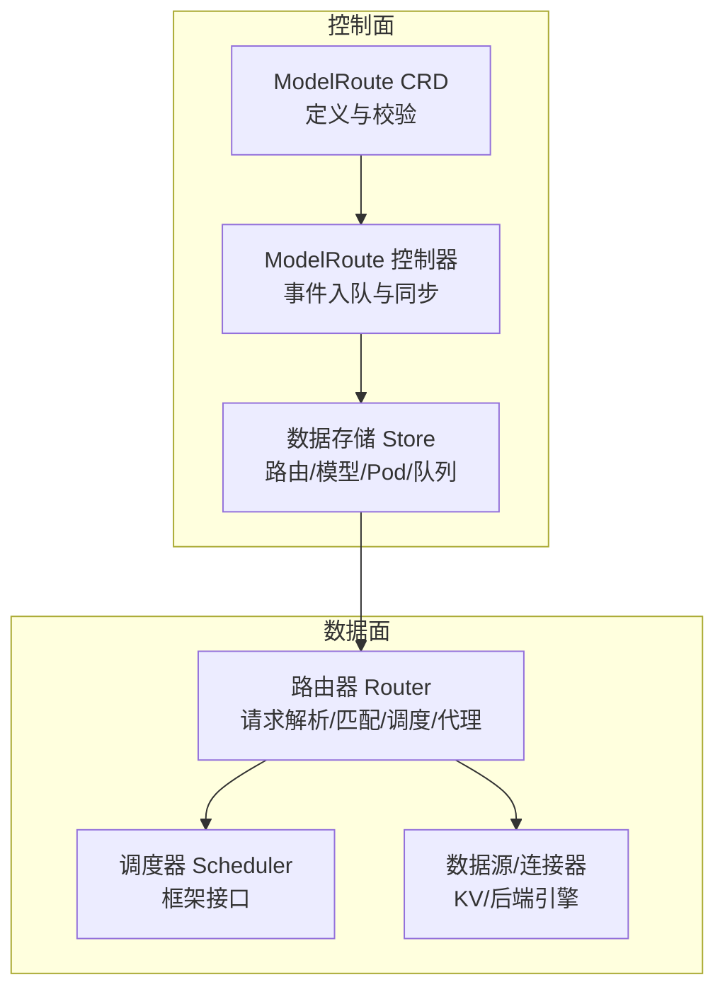
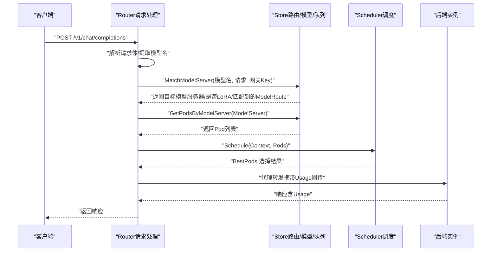
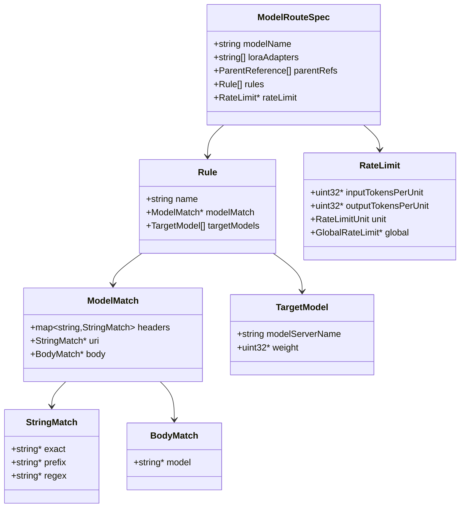
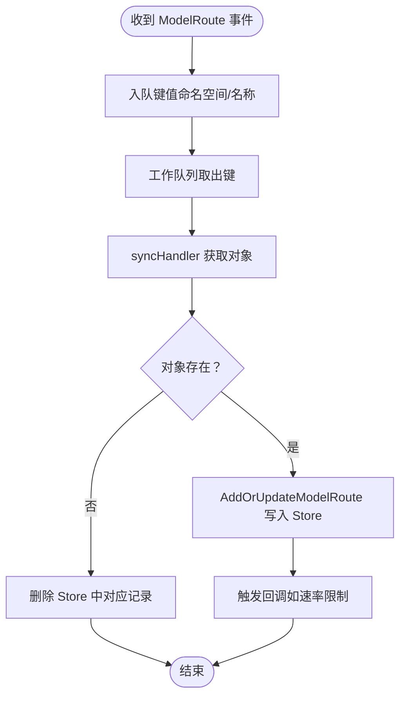
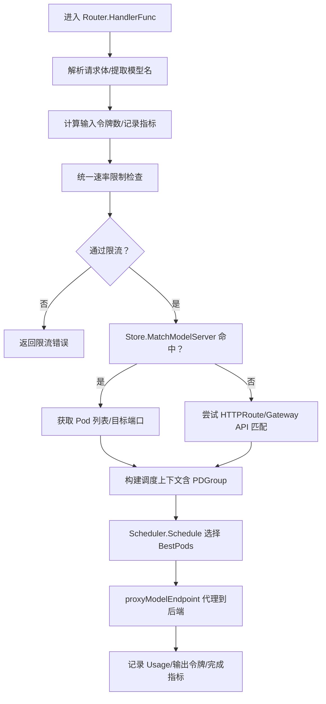
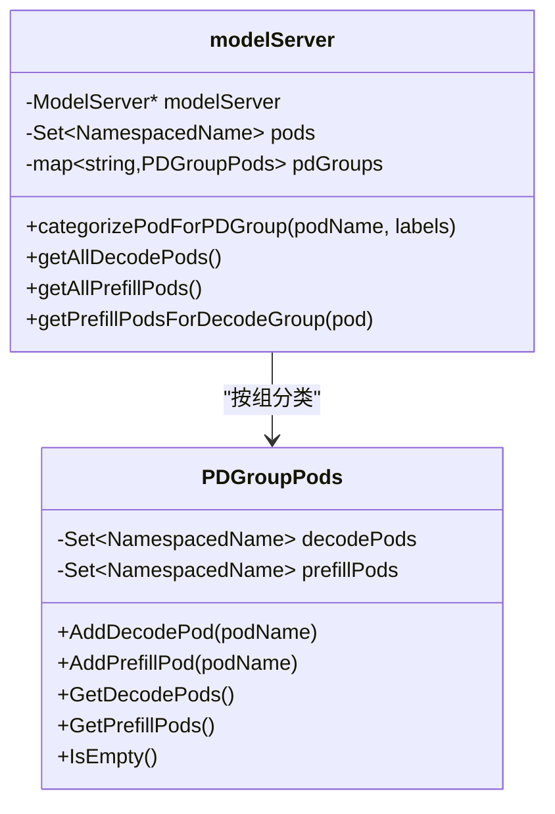
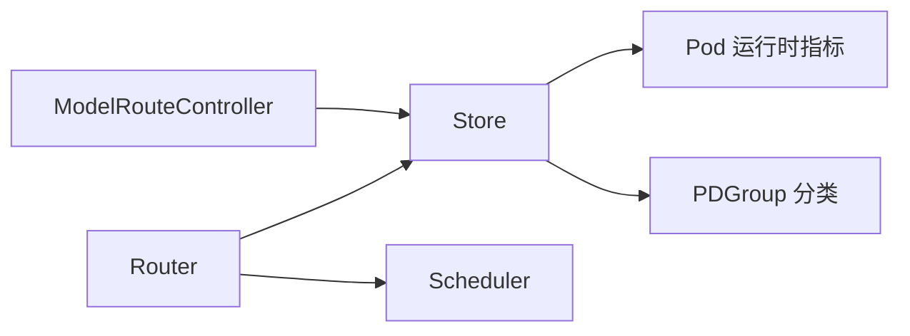

# 多模型路由

<cite>
**本文引用的文件**   
- [pkg/apis/networking/v1alpha1/modelroute_types.go](file://pkg/apis/networking/v1alpha1/modelroute_types.go)
- [client-go/applyconfiguration/networking/v1alpha1/modelroute.go](file://client-go/applyconfiguration/networking/v1alpha1/modelroute.go)
- [cmd/kthena-router/app/router.go](file://cmd/kthena-router/app/router.go)
- [pkg/kthena-router/controller/modelroute_controller.go](file://pkg/kthena-router/controller/modelroute_controller.go)
- [pkg/kthena-router/router/router.go](file://pkg/kthena-router/router/router.go)
- [pkg/kthena-router/datastore/store.go](file://pkg/kthena-router/datastore/store.go)
- [pkg/kthena-router/datastore/model_server.go](file://pkg/kthena-router/datastore/model_server.go)
- [pkg/kthena-router/datastore/pdgroup_pods.go](file://pkg/kthena-router/datastore/pdgroup_pods.go)
- [pkg/kthena-router/scheduler/scheduler.go](file://pkg/kthena-router/scheduler/scheduler.go)
- [examples/kthena-router/ModelRouteSimple.yaml](file://examples/kthena-router/ModelRouteSimple.yaml)
- [examples/kthena-router/ModelRouteMultiModels.yaml](file://examples/kthena-router/ModelRouteMultiModels.yaml)
- [examples/kthena-router/ModelRouteLora.yaml](file://examples/kthena-router/ModelRouteLora.yaml)
</cite>

## 目录
1. [简介](#简介)
2. [项目结构](#项目结构)
3. [核心组件](#核心组件)
4. [架构总览](#架构总览)
5. [详细组件分析](#详细组件分析)
6. [依赖分析](#依赖分析)
7. [性能考虑](#性能考虑)
8. [故障排查指南](#故障排查指南)
9. [结论](#结论)
10. [附录：路由配置示例与最佳实践](#附录路由配置示例与最佳实践)

## 简介
本章节面向希望在 Kthena 中使用多模型路由能力的用户与开发者，系统性阐述 ModelRoute CRD 的工作机制与实现细节，覆盖以下关键主题：
- 模型匹配算法：基于模型名称、LoRA 适配器、请求头与路径前缀的多维匹配策略
- 路由规则配置：规则顺序、目标模型权重与网关绑定
- 多模型选择策略：基于 PD 组感知的调度与硬件资源、负载状态的综合考量
- 实际代码流程：从请求进入、路由匹配到后端实例选择与代理转发的完整链路
- 错误处理与可观测性：访问日志、指标埋点、限流与错误返回

## 项目结构
围绕“多模型路由”的核心代码主要分布在如下模块：
- CRD 定义与客户端应用配置：定义 ModelRoute 规则、匹配条件与目标模型
- 控制器：监听 ModelRoute 变更并更新内存数据存储
- 数据存储：维护路由表、模型服务器、Pod 列表、队列与运行时指标
- 路由器：解析请求、执行匹配与调度、代理到后端
- 调度器：在多模型/多 Pod 场景下进行公平调度与 PD 组感知
- 示例：提供简单路由、多模型路由、LoRA 适配器路由等典型配置

图表来源
- [pkg/apis/networking/v1alpha1/modelroute_types.go:24-120](file://pkg/apis/networking/v1alpha1/modelroute_types.go#L24-L120)
- [pkg/kthena-router/controller/modelroute_controller.go:36-161](file://pkg/kthena-router/controller/modelroute_controller.go#L36-L161)
- [pkg/kthena-router/router/router.go:73-169](file://pkg/kthena-router/router/router.go#L73-L169)
- [pkg/kthena-router/datastore/store.go:162-240](file://pkg/kthena-router/datastore/store.go#L162-L240)

章节来源
- [pkg/apis/networking/v1alpha1/modelroute_types.go:24-120](file://pkg/apis/networking/v1alpha1/modelroute_types.go#L24-L120)
- [pkg/kthena-router/controller/modelroute_controller.go:36-161](file://pkg/kthena-router/controller/modelroute_controller.go#L36-L161)
- [pkg/kthena-router/router/router.go:73-169](file://pkg/kthena-router/router/router.go#L73-L169)
- [pkg/kthena-router/datastore/store.go:162-240](file://pkg/kthena-router/datastore/store.go#L162-L240)

## 核心组件
- ModelRoute CRD：定义模型名或 LoRA 适配器列表、匹配条件与目标模型权重
- ModelRoute 控制器：监听 CRD 变更，写入 Store 并触发回调
- Store：维护路由索引、模型服务器、Pod 信息、队列与运行时指标
- Router：解析请求、匹配路由、计算令牌数、执行限流、调度与代理
- Scheduler：框架化调度接口，支持公平调度与 PD 组感知
- PDGroup：按硬件分组（如 decode/prefill）进行高效调度

章节来源
- [pkg/apis/networking/v1alpha1/modelroute_types.go:24-120](file://pkg/apis/networking/v1alpha1/modelroute_types.go#L24-L120)
- [pkg/kthena-router/controller/modelroute_controller.go:36-161](file://pkg/kthena-router/controller/modelroute_controller.go#L36-L161)
- [pkg/kthena-router/router/router.go:73-169](file://pkg/kthena-router/router/router.go#L73-L169)
- [pkg/kthena-router/datastore/store.go:162-240](file://pkg/kthena-router/datastore/store.go#L162-L240)
- [pkg/kthena-router/scheduler/scheduler.go:25-28](file://pkg/kthena-router/scheduler/scheduler.go#L25-L28)

## 架构总览
下面以序列图展示一次请求从进入路由器到后端实例选择与代理的全流程。

图表来源
- [pkg/kthena-router/router/router.go:204-464](file://pkg/kthena-router/router/router.go#L204-L464)
- [pkg/kthena-router/datastore/store.go:179-180](file://pkg/kthena-router/datastore/store.go#L179-L180)
- [pkg/kthena-router/scheduler/scheduler.go:25-28](file://pkg/kthena-router/scheduler/scheduler.go#L25-L28)

## 详细组件分析

### ModelRoute CRD 与匹配算法
- 字段与约束
  - modelName：主模型名；与 loraAdapters 至少一个非空
  - loraAdapters：LoRA 适配器名列表
  - parentRefs：可选，绑定到特定 Gateway
  - rules：有序规则列表，命中即止；每条规则包含 modelMatch（可选）与 targetModels（必选）
  - rateLimit：可选，支持全局/本地限流
- 匹配条件
  - ModelMatch 支持 headers（精确/前缀/正则）、uri（精确/前缀/正则）与 body.model
  - 未设置 modelMatch 表示匹配所有请求
- 目标模型与权重
  - targetModels 指定模型服务器与权重，用于流量分配

图表来源
- [pkg/apis/networking/v1alpha1/modelroute_types.go:24-120](file://pkg/apis/networking/v1alpha1/modelroute_types.go#L24-L120)

章节来源
- [pkg/apis/networking/v1alpha1/modelroute_types.go:24-120](file://pkg/apis/networking/v1alpha1/modelroute_types.go#L24-L120)

### 控制器与数据存储联动
- 控制器监听 ModelRoute 增删改事件，入队并调用同步处理
- 同步处理将 ModelRoute 写入 Store，并触发回调（如速率限制配置）
- Store 维护路由索引（按主模型与 LoRA 名称），并提供匹配查询

图表来源
- [pkg/kthena-router/controller/modelroute_controller.go:103-151](file://pkg/kthena-router/controller/modelroute_controller.go#L103-L151)
- [pkg/kthena-router/datastore/store.go:755-800](file://pkg/kthena-router/datastore/store.go#L755-L800)

章节来源
- [pkg/kthena-router/controller/modelroute_controller.go:103-151](file://pkg/kthena-router/controller/modelroute_controller.go#L103-L151)
- [pkg/kthena-router/datastore/store.go:755-800](file://pkg/kthena-router/datastore/store.go#L755-L800)

### 路由匹配与调度
- 请求解析：从请求体中提取模型名，记录令牌数与开始阶段
- 速率限制：统一速率限制器按输入/输出令牌与请求数进行限制
- 模型匹配：优先通过 Store.MatchModelServer 命中 ModelRoute；若失败且路径为 /v1/，尝试通过 HTTPRoute（Gateway API）匹配
- 调度：根据 PD 组标签对 decode/prefill 进行分组，结合队列长度、GPU 缓存占用、TTFT/TPOT 等指标进行公平调度
- 代理：将请求转发至最佳 Pod，回传 Usage 用于统计与限流

图表来源
- [pkg/kthena-router/router/router.go:204-464](file://pkg/kthena-router/router/router.go#L204-L464)
- [pkg/kthena-router/router/router.go:466-486](file://pkg/kthena-router/router/router.go#L466-L486)
- [pkg/kthena-router/router/router.go:500-622](file://pkg/kthena-router/router/router.go#L500-L622)
- [pkg/kthena-router/router/router.go:674-780](file://pkg/kthena-router/router/router.go#L674-L780)

章节来源
- [pkg/kthena-router/router/router.go:204-464](file://pkg/kthena-router/router/router.go#L204-L464)
- [pkg/kthena-router/router/router.go:500-622](file://pkg/kthena-router/router/router.go#L500-L622)
- [pkg/kthena-router/router/router.go:674-780](file://pkg/kthena-router/router/router.go#L674-L780)

### PD 组感知的路由决策
- Store 在 AddOrUpdatePod 时根据 PDGroup 标签对 Pod 进行分类（decode/prefill）
- ModelServer 对象维护 pdGroups 映射，便于快速定位同组内的 prefill/decode Pod
- 调度时可基于 decode Pod 所属 PD 组，仅在相同组内选择 prefill Pod，提升吞吐与降低跨组延迟

图表来源
- [pkg/kthena-router/datastore/model_server.go:27-180](file://pkg/kthena-router/datastore/model_server.go#L27-L180)
- [pkg/kthena-router/datastore/pdgroup_pods.go:26-97](file://pkg/kthena-router/datastore/pdgroup_pods.go#L26-L97)

章节来源
- [pkg/kthena-router/datastore/model_server.go:27-180](file://pkg/kthena-router/datastore/model_server.go#L27-L180)
- [pkg/kthena-router/datastore/pdgroup_pods.go:26-97](file://pkg/kthena-router/datastore/pdgroup_pods.go#L26-L97)

### 访问日志、认证与中间件
- 访问日志中间件仅对 /v1/ 路径生效，记录模型名、令牌数、路由信息与错误
- 认证中间件同样限定在 /v1/ 路径，支持 JWT 校验
- Debug 端点提供资源导出，便于排障

章节来源
- [cmd/kthena-router/app/router.go:640-669](file://cmd/kthena-router/app/router.go#L640-L669)
- [pkg/kthena-router/router/router.go:798-800](file://pkg/kthena-router/router/router.go#L798-L800)

## 依赖分析
- 控制器依赖 Store 的回调机制，实现 ModelRoute 变更的即时生效
- Router 依赖 Store 的匹配与 Pod 查询能力，同时依赖 Scheduler 的调度接口
- Store 依赖 Pod 运行时指标与模型列表，用于公平调度与 PD 组分类

图表来源
- [pkg/kthena-router/controller/modelroute_controller.go:36-161](file://pkg/kthena-router/controller/modelroute_controller.go#L36-L161)
- [pkg/kthena-router/router/router.go:73-169](file://pkg/kthena-router/router/router.go#L73-L169)
- [pkg/kthena-router/datastore/store.go:162-240](file://pkg/kthena-router/datastore/store.go#L162-L240)

章节来源
- [pkg/kthena-router/controller/modelroute_controller.go:36-161](file://pkg/kthena-router/controller/modelroute_controller.go#L36-L161)
- [pkg/kthena-router/router/router.go:73-169](file://pkg/kthena-router/router/router.go#L73-L169)
- [pkg/kthena-router/datastore/store.go:162-240](file://pkg/kthena-router/datastore/store.go#L162-L240)

## 性能考虑
- 公平调度：通过滑动窗口令牌跟踪与队列长度，结合 TTFT/TPOT 等指标，避免长尾阻塞
- PD 组调度：在 decode/prefill 解耦场景下，限制 prefill 选择范围，减少跨组通信开销
- 速率限制：统一速率限制器减少重复计算，支持输入/输出令牌与请求数三类维度
- 访问日志与指标：仅对 /v1/ 生效，降低无关路径的开销

## 故障排查指南
- 路由未命中
  - 检查 ModelRoute 是否正确绑定到 Gateway（parentRefs）与命名空间
  - 确认 rules 顺序与 modelMatch 条件（headers/uri/body.model）是否匹配
- 模型服务器不可达
  - 使用 Debug 端点列出 ModelServer/Pod/InferencePool 等资源，确认是否存在与健康状态
  - 检查 Store 中是否已缓存对应 ModelServer 与 Pod 列表
- 调度异常
  - 查看队列长度与等待时间统计，确认是否存在过载
  - 检查 PD 组标签是否正确，确保 decode/prefill 分组一致
- 限流触发
  - 检查 RateLimit 配置与单位，确认输入/输出令牌阈值是否合理
  - 关注访问日志中的错误类型（输入/输出/请求级）

章节来源
- [cmd/kthena-router/app/router.go:107-156](file://cmd/kthena-router/app/router.go#L107-L156)
- [pkg/kthena-router/datastore/store.go:470-485](file://pkg/kthena-router/datastore/store.go#L470-L485)

## 结论
Kthena 的多模型路由通过清晰的 CRD 定义、控制器与 Store 的解耦设计、以及基于 PD 组与公平调度的路由器实现，提供了高扩展、可观测、易运维的多模型推理路由能力。结合速率限制与访问日志，可在复杂生产环境中稳定地承载多模型与多适配器场景。

## 附录：路由配置示例与最佳实践
- 简单路由：仅指定主模型名与单一目标模型服务器
- 多模型路由：通过请求头区分不同等级用户，将 Premium 流量导向更高规格模型
- LoRA 适配器路由：针对 LoRA 名称进行匹配，统一指向同一模型服务器

章节来源
- [examples/kthena-router/ModelRouteSimple.yaml:1-12](file://examples/kthena-router/ModelRouteSimple.yaml#L1-L12)
- [examples/kthena-router/ModelRouteMultiModels.yaml:1-19](file://examples/kthena-router/ModelRouteMultiModels.yaml#L1-L19)
- [examples/kthena-router/ModelRouteLora.yaml:1-14](file://examples/kthena-router/ModelRouteLora.yaml#L1-L14)