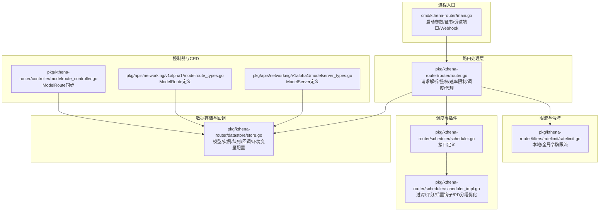
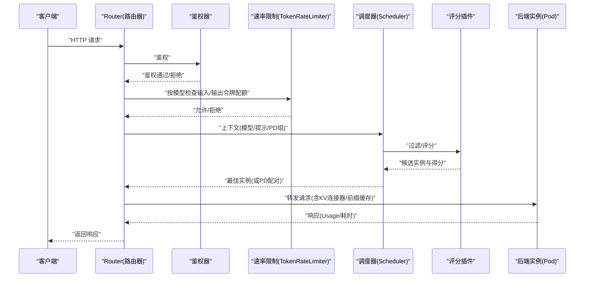
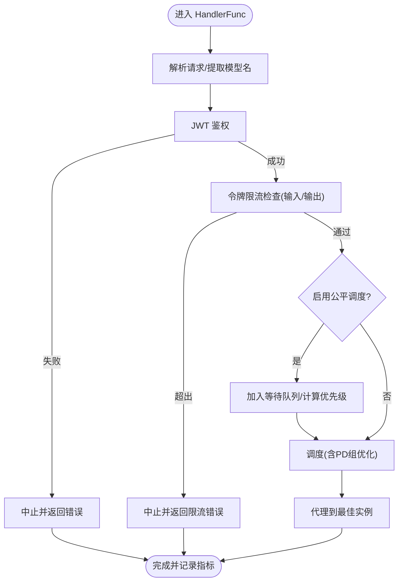
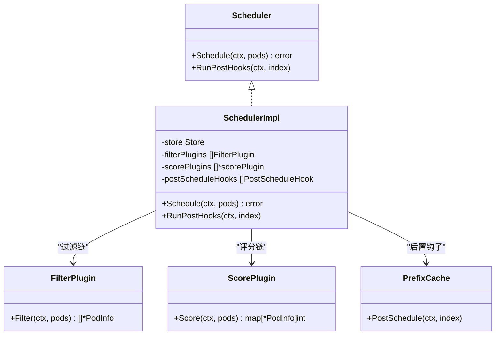
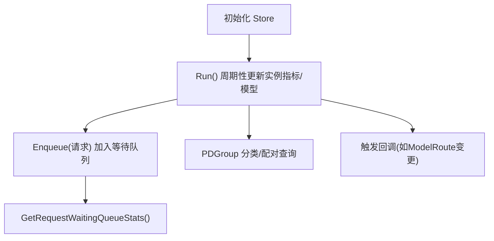
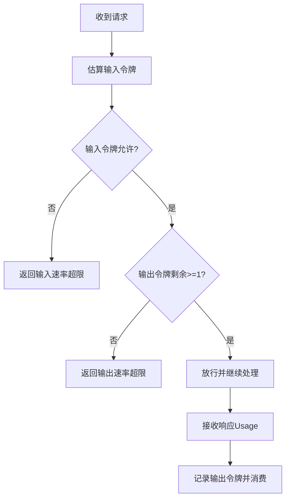
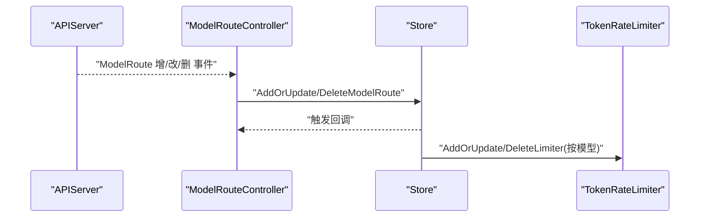
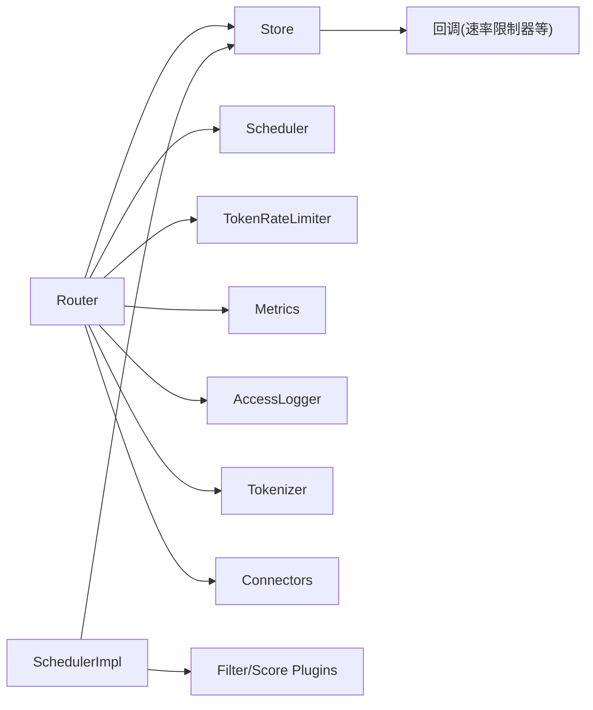

# 智能路由与流量控制

<cite>
**本文引用的文件**
- [cmd/kthena-router/main.go](file://cmd/kthena-router/main.go)
- [pkg/kthena-router/router/router.go](file://pkg/kthena-router/router/router.go)
- [pkg/kthena-router/scheduler/scheduler.go](file://pkg/kthena-router/scheduler/scheduler.go)
- [pkg/kthena-router/scheduler/scheduler_impl.go](file://pkg/kthena-router/scheduler/scheduler_impl.go)
- [pkg/kthena-router/datastore/store.go](file://pkg/kthena-router/datastore/store.go)
- [pkg/kthena-router/filters/ratelimit/ratelimit.go](file://pkg/kthena-router/filters/ratelimit/ratelimit.go)
- [pkg/apis/networking/v1alpha1/modelroute_types.go](file://pkg/apis/networking/v1alpha1/modelroute_types.go)
- [pkg/apis/networking/v1alpha1/modelserver_types.go](file://pkg/apis/networking/v1alpha1/modelserver_types.go)
- [pkg/kthena-router/controller/modelroute_controller.go](file://pkg/kthena-router/controller/modelroute_controller.go)
- [docs/kthena/docs/user-guide/router-routing.md](file://docs/kthena/docs/user-guide/router-routing.md)
- [examples/kthena-router/ModelRouteMultiModels.yaml](file://examples/kthena-router/ModelRouteMultiModels.yaml)
- [examples/kthena-router/ModelRouteWithRateLimit.yaml](file://examples/kthena-router/ModelRouteWithRateLimit.yaml)
- [examples/kthena-router/ModelRouteWithGlobalRateLimit.yaml](file://examples/kthena-router/ModelRouteWithGlobalRateLimit.yaml)
</cite>

## 目录
1. [简介](#简介)
2. [项目结构](#项目结构)
3. [核心组件](#核心组件)
4. [架构总览](#架构总览)
5. [详细组件分析](#详细组件分析)
6. [依赖关系分析](#依赖关系分析)
7. [性能考量](#性能考量)
8. [故障排查指南](#故障排查指南)
9. [结论](#结论)
10. [附录](#附录)

## 简介
本文件面向 Kthena 的“智能路由与流量控制”能力，系统化阐述多模型路由、可插拔负载均衡算法、PD 组感知的请求分配、以及丰富的流量策略（含金丝雀发布、权重流量分配、基于令牌的速率限制与全局限流、自动化故障转移）。文档从代码级实现到用户实践场景，提供架构图、流程图、配置示例与监控告警建议，帮助读者在生产环境中稳定、高效地部署与运维。

## 项目结构
Kthena 路由子系统由“入口程序”“路由处理层”“调度器与插件体系”“数据存储与回调”“限流与令牌计数”等模块组成，围绕 ModelRoute/ModelServer 两类 CRD 构建灵活的路由与流量控制能力。

**图表来源**
- [cmd/kthena-router/main.go:1-226](file://cmd/kthena-router/main.go#L1-L226)
- [pkg/kthena-router/router/router.go:1-800](file://pkg/kthena-router/router/router.go#L1-L800)
- [pkg/kthena-router/scheduler/scheduler.go:1-29](file://pkg/kthena-router/scheduler/scheduler.go#L1-L29)
- [pkg/kthena-router/scheduler/scheduler_impl.go:1-251](file://pkg/kthena-router/scheduler/scheduler_impl.go#L1-L251)
- [pkg/kthena-router/datastore/store.go:1-800](file://pkg/kthena-router/datastore/store.go#L1-L800)
- [pkg/kthena-router/filters/ratelimit/ratelimit.go:1-231](file://pkg/kthena-router/filters/ratelimit/ratelimit.go#L1-L231)
- [pkg/kthena-router/controller/modelroute_controller.go:1-161](file://pkg/kthena-router/controller/modelroute_controller.go#L1-L161)
- [pkg/apis/networking/v1alpha1/modelroute_types.go:1-194](file://pkg/apis/networking/v1alpha1/modelroute_types.go#L1-L194)
- [pkg/apis/networking/v1alpha1/modelserver_types.go:1-172](file://pkg/apis/networking/v1alpha1/modelserver_types.go#L1-L172)

**章节来源**
- [cmd/kthena-router/main.go:1-226](file://cmd/kthena-router/main.go#L1-L226)
- [pkg/kthena-router/router/router.go:1-800](file://pkg/kthena-router/router/router.go#L1-L800)
- [pkg/kthena-router/scheduler/scheduler.go:1-29](file://pkg/kthena-router/scheduler/scheduler.go#L1-L29)
- [pkg/kthena-router/scheduler/scheduler_impl.go:1-251](file://pkg/kthena-router/scheduler/scheduler_impl.go#L1-L251)
- [pkg/kthena-router/datastore/store.go:1-800](file://pkg/kthena-router/datastore/store.go#L1-L800)
- [pkg/kthena-router/filters/ratelimit/ratelimit.go:1-231](file://pkg/kthena-router/filters/ratelimit/ratelimit.go#L1-L231)
- [pkg/kthena-router/controller/modelroute_controller.go:1-161](file://pkg/kthena-router/controller/modelroute_controller.go#L1-L161)
- [pkg/apis/networking/v1alpha1/modelroute_types.go:1-194](file://pkg/apis/networking/v1alpha1/modelroute_types.go#L1-L194)
- [pkg/apis/networking/v1alpha1/modelserver_types.go:1-172](file://pkg/apis/networking/v1alpha1/modelserver_types.go#L1-L172)

## 核心组件
- 路由器 Router：负责请求解析、鉴权、速率限制、调度选择、代理转发与访问日志记录；支持公平调度优先队列与令牌权重。
- 调度器 Scheduler：可插拔的过滤/评分插件框架，支持 PD 组优化（预取/解码配对）与后置钩子（如前缀缓存）。
- 数据存储 Store：统一管理 ModelServer/ModelRoute/实例/网关/推理池等资源，维护运行时指标与令牌统计，支持回调与初始化同步。
- 速率限制 TokenRateLimiter：支持本地与全局（Redis）令牌桶限流，按输入/输出令牌维度进行配额控制。
- 控制器 ModelRouteController：监听 ModelRoute 变更，写入 Store 并触发回调，驱动路由表更新。
- CRD 定义：ModelRoute/ModelServer 描述路由规则、目标模型服务器、PD 组、KV 连接器与流量策略。

**章节来源**
- [pkg/kthena-router/router/router.go:73-169](file://pkg/kthena-router/router/router.go#L73-L169)
- [pkg/kthena-router/scheduler/scheduler.go:25-28](file://pkg/kthena-router/scheduler/scheduler.go#L25-L28)
- [pkg/kthena-router/scheduler/scheduler_impl.go:40-99](file://pkg/kthena-router/scheduler/scheduler_impl.go#L40-L99)
- [pkg/kthena-router/datastore/store.go:161-240](file://pkg/kthena-router/datastore/store.go#L161-L240)
- [pkg/kthena-router/filters/ratelimit/ratelimit.go:61-231](file://pkg/kthena-router/filters/ratelimit/ratelimit.go#L61-L231)
- [pkg/kthena-router/controller/modelroute_controller.go:36-89](file://pkg/kthena-router/controller/modelroute_controller.go#L36-L89)
- [pkg/apis/networking/v1alpha1/modelroute_types.go:24-166](file://pkg/apis/networking/v1alpha1/modelroute_types.go#L24-L166)
- [pkg/apis/networking/v1alpha1/modelserver_types.go:23-142](file://pkg/apis/networking/v1alpha1/modelserver_types.go#L23-L142)

## 架构总览
下图展示了从请求进入路由器到后端实例的完整链路，包含鉴权、速率限制、调度与代理过程。

**图表来源**
- [pkg/kthena-router/router/router.go:204-464](file://pkg/kthena-router/router/router.go#L204-L464)
- [pkg/kthena-router/scheduler/scheduler_impl.go:101-165](file://pkg/kthena-router/scheduler/scheduler_impl.go#L101-L165)
- [pkg/kthena-router/filters/ratelimit/ratelimit.go:100-137](file://pkg/kthena-router/filters/ratelimit/ratelimit.go#L100-L137)

## 详细组件分析

### 路由器 Router 实现
- 请求生命周期
  - 解析与校验：解析 JSON 请求体，提取模型名与提示词，记录输入令牌数。
  - 鉴权：通过 JWT 认证中间件。
  - 速率限制：统一令牌限流器按模型维度检查输入/输出令牌配额，支持错误类型区分与指标上报。
  - 调度：根据是否启用公平调度与是否存在 PD 组，分别走常规调度或 PD 优化路径。
  - 代理：将请求转发至最佳实例，记录上游/下游请求数量与输出令牌用量，更新访问日志与指标。
- 公平调度优先队列
  - 支持按令牌与请求数加权计算优先级，超时与窗口大小可通过环境变量配置。
- 访问日志与可观测性
  - 结构化日志记录模型名、令牌用量、路由信息、网关 API 匹配结果等。

**图表来源**
- [pkg/kthena-router/router/router.go:204-315](file://pkg/kthena-router/router/router.go#L204-L315)
- [pkg/kthena-router/router/router.go:317-464](file://pkg/kthena-router/router/router.go#L317-L464)
- [pkg/kthena-router/router/router.go:466-486](file://pkg/kthena-router/router/router.go#L466-L486)
- [pkg/kthena-router/router/router.go:714-780](file://pkg/kthena-router/router/router.go#L714-L780)

**章节来源**
- [pkg/kthena-router/router/router.go:73-169](file://pkg/kthena-router/router/router.go#L73-L169)
- [pkg/kthena-router/router/router.go:193-200](file://pkg/kthena-router/router/router.go#L193-L200)
- [pkg/kthena-router/router/router.go:204-315](file://pkg/kthena-router/router/router.go#L204-L315)
- [pkg/kthena-router/router/router.go:317-464](file://pkg/kthena-router/router/router.go#L317-L464)
- [pkg/kthena-router/router/router.go:466-486](file://pkg/kthena-router/router/router.go#L466-L486)
- [pkg/kthena-router/router/router.go:714-780](file://pkg/kthena-router/router/router.go#L714-L780)

### 调度器与插件体系
- 接口与实现
  - Scheduler 接口定义 Schedule 与 RunPostHooks。
  - SchedulerImpl 默认注册“最少请求/最低延迟/前缀缓存”评分插件，支持过滤插件链。
- PD 组优化
  - 当存在 PDGroup 时，直接从 Store 获取已分类的 Decode/Prefill 实例，按组配对并评分，减少全量扫描成本。
- 后置钩子
  - 前缀缓存插件在代理成功后执行，用于后续命中加速。

**图表来源**
- [pkg/kthena-router/scheduler/scheduler.go:25-28](file://pkg/kthena-router/scheduler/scheduler.go#L25-L28)
- [pkg/kthena-router/scheduler/scheduler_impl.go:40-99](file://pkg/kthena-router/scheduler/scheduler_impl.go#L40-L99)
- [pkg/kthena-router/scheduler/scheduler_impl.go:101-165](file://pkg/kthena-router/scheduler/scheduler_impl.go#L101-L165)
- [pkg/kthena-router/scheduler/scheduler_impl.go:225-229](file://pkg/kthena-router/scheduler/scheduler_impl.go#L225-L229)

**章节来源**
- [pkg/kthena-router/scheduler/scheduler.go:25-28](file://pkg/kthena-router/scheduler/scheduler.go#L25-L28)
- [pkg/kthena-router/scheduler/scheduler_impl.go:40-99](file://pkg/kthena-router/scheduler/scheduler_impl.go#L40-L99)
- [pkg/kthena-router/scheduler/scheduler_impl.go:101-165](file://pkg/kthena-router/scheduler/scheduler_impl.go#L101-L165)
- [pkg/kthena-router/scheduler/scheduler_impl.go:225-229](file://pkg/kthena-router/scheduler/scheduler_impl.go#L225-L229)

### 数据存储与回调
- 资源管理
  - ModelServer/ModelRoute/实例/网关/推理池的增删改查与同步。
  - PD 组相关：按 groupKey 与角色标签对实例进行分类，支持 O(1) 查询与配对。
- 公平调度队列
  - 基于滑动窗口令牌追踪器统计用户/模型维度的令牌与请求数，动态计算优先级。
  - 支持最大并发、最大 QPS、优先级刷新重试次数、重建阈值等环境变量配置。
- 回调机制
  - Store 注册回调，当 ModelRoute 更新时通知速率限制器等组件重新配置。

**图表来源**
- [pkg/kthena-router/datastore/store.go:410-485](file://pkg/kthena-router/datastore/store.go#L410-L485)
- [pkg/kthena-router/datastore/store.go:572-635](file://pkg/kthena-router/datastore/store.go#L572-L635)
- [pkg/kthena-router/datastore/store.go:754-800](file://pkg/kthena-router/datastore/store.go#L754-L800)

**章节来源**
- [pkg/kthena-router/datastore/store.go:161-240](file://pkg/kthena-router/datastore/store.go#L161-L240)
- [pkg/kthena-router/datastore/store.go:410-485](file://pkg/kthena-router/datastore/store.go#L410-L485)
- [pkg/kthena-router/datastore/store.go:572-635](file://pkg/kthena-router/datastore/store.go#L572-L635)
- [pkg/kthena-router/datastore/store.go:754-800](file://pkg/kthena-router/datastore/store.go#L754-L800)

### 速率限制与令牌计数
- 令牌桶
  - 支持本地与全局（Redis）两种模式；单位时间输入/输出令牌配额可独立配置。
  - 输入令牌估算采用分词器，输出令牌在响应后回填。
- 错误类型
  - 输入速率超限、输出速率超限、通用速率超限，便于区分与告警。
- 全局限流
  - 通过 Redis 实现跨实例一致的配额控制，适合多副本部署。

**图表来源**
- [pkg/kthena-router/filters/ratelimit/ratelimit.go:100-137](file://pkg/kthena-router/filters/ratelimit/ratelimit.go#L100-L137)
- [pkg/kthena-router/filters/ratelimit/ratelimit.go:140-204](file://pkg/kthena-router/filters/ratelimit/ratelimit.go#L140-L204)

**章节来源**
- [pkg/kthena-router/filters/ratelimit/ratelimit.go:61-231](file://pkg/kthena-router/filters/ratelimit/ratelimit.go#L61-L231)

### 控制器与 CRD
- ModelRouteController
  - 监听 ModelRoute 增删改事件，写入 Store 并触发回调，确保路由表实时生效。
- CRD 定义
  - ModelRoute：模型名/LoRA 列表、匹配条件、目标模型与权重、速率限制（含全局 Redis 配置）。
  - ModelServer：推理引擎、工作负载选择器（含 PD 组）、端口协议、流量策略、KV 连接器。

**图表来源**
- [pkg/kthena-router/controller/modelroute_controller.go:130-151](file://pkg/kthena-router/controller/modelroute_controller.go#L130-L151)
- [pkg/kthena-router/datastore/store.go:100-118](file://pkg/kthena-router/datastore/store.go#L100-L118)
- [pkg/kthena-router/filters/ratelimit/ratelimit.go:140-204](file://pkg/kthena-router/filters/ratelimit/ratelimit.go#L140-L204)

**章节来源**
- [pkg/kthena-router/controller/modelroute_controller.go:36-89](file://pkg/kthena-router/controller/modelroute_controller.go#L36-L89)
- [pkg/kthena-router/controller/modelroute_controller.go:130-151](file://pkg/kthena-router/controller/modelroute_controller.go#L130-L151)
- [pkg/apis/networking/v1alpha1/modelroute_types.go:24-166](file://pkg/apis/networking/v1alpha1/modelroute_types.go#L24-L166)
- [pkg/apis/networking/v1alpha1/modelserver_types.go:23-142](file://pkg/apis/networking/v1alpha1/modelserver_types.go#L23-L142)

## 依赖关系分析
- 组件耦合
  - Router 依赖 Store/Scheduler/RateLimiter/AccessLogger/Metrics/Tokenizer/Connectors。
  - SchedulerImpl 依赖 Store 与插件注册表，评分/过滤插件通过接口解耦。
  - Store 通过回调与速率限制器联动，保证路由变更即时生效。
- 外部依赖
  - Redis（全局限流）、Prometheus 指标、Kubernetes API（Informers/Ingress/Gateway API）。

**图表来源**
- [pkg/kthena-router/router/router.go:73-169](file://pkg/kthena-router/router/router.go#L73-L169)
- [pkg/kthena-router/scheduler/scheduler_impl.go:40-99](file://pkg/kthena-router/scheduler/scheduler_impl.go#L40-L99)
- [pkg/kthena-router/datastore/store.go:100-118](file://pkg/kthena-router/datastore/store.go#L100-L118)

**章节来源**
- [pkg/kthena-router/router/router.go:73-169](file://pkg/kthena-router/router/router.go#L73-L169)
- [pkg/kthena-router/scheduler/scheduler_impl.go:40-99](file://pkg/kthena-router/scheduler/scheduler_impl.go#L40-L99)
- [pkg/kthena-router/datastore/store.go:100-118](file://pkg/kthena-router/datastore/store.go#L100-L118)

## 性能考量
- 调度性能
  - PD 组优化避免全量扫描，评分仅在候选集上进行，TopN 限制降低复杂度。
  - 插件执行时间记录到指标，便于定位瓶颈。
- 公平调度
  - 滑动窗口令牌追踪器与优先级权重可调，平衡吞吐与公平性。
- 限流效率
  - 本地限流适合单实例，全局限流通过 Redis 保证一致性但引入网络开销。
- 指标与日志
  - 上下游活跃请求数、令牌用量、排队长度、插件耗时等指标可用于容量规划与告警。

[本节为通用指导，无需特定文件来源]

## 故障排查指南
- 路由不生效
  - 检查 ModelRoute 是否正确同步到 Store，确认控制器日志与 Store 回调触发。
  - 确认模型名/LoRA 匹配条件与请求体一致。
- 限流异常
  - 查看速率限制错误类型（输入/输出/通用），核对单位与配额设置。
  - 全局限流需检查 Redis 地址连通性与权限。
- 调度失败
  - 查看过滤插件是否将所有实例过滤掉；检查 PD 组标签是否正确、是否有可用配对。
- 公平队列堆积
  - 调整最大并发/QPS/优先级权重，观察排队长度指标。

**章节来源**
- [pkg/kthena-router/controller/modelroute_controller.go:130-151](file://pkg/kthena-router/controller/modelroute_controller.go#L130-L151)
- [pkg/kthena-router/filters/ratelimit/ratelimit.go:100-137](file://pkg/kthena-router/filters/ratelimit/ratelimit.go#L100-L137)
- [pkg/kthena-router/scheduler/scheduler_impl.go:167-185](file://pkg/kthena-router/scheduler/scheduler_impl.go#L167-L185)
- [pkg/kthena-router/datastore/store.go:443-468](file://pkg/kthena-router/datastore/store.go#L443-L468)

## 结论
Kthena 的智能路由与流量控制以 CRD 为中心，结合可插拔调度插件、PD 组感知与令牌计数的公平队列，实现了从多模型路由、权重分配、金丝雀发布到全局限流与自动化故障转移的全栈能力。通过结构化日志与指标可观测性，可在生产环境中实现高可用与高性能的模型服务。

[本节为总结，无需特定文件来源]

## 附录

### 路由配置示例与最佳实践
- 多模型路由（按头字段分流）
  - 示例路径：[examples/kthena-router/ModelRouteMultiModels.yaml](file://examples/kthena-router/ModelRouteMultiModels.yaml)
  - 适用场景：根据用户等级将流量导向不同规模模型，实现差异化体验。
- 本地速率限制
  - 示例路径：[examples/kthena-router/ModelRouteWithRateLimit.yaml](file://examples/kthena-router/ModelRouteWithRateLimit.yaml)
  - 适用场景：单实例或小规模集群的速率约束。
- 全局速率限制（Redis）
  - 示例路径：[examples/kthena-router/ModelRouteWithGlobalRateLimit.yaml](file://examples/kthena-router/ModelRouteWithGlobalRateLimit.yaml)
  - 适用场景：多副本部署的统一配额控制。
- 用户指南与场景
  - 参考文档：[docs/kthena/docs/user-guide/router-routing.md](file://docs/kthena/docs/user-guide/router-routing.md)
  - 包含简单模型路由、LoRA 路由、权重分配、头字段多模型路由与 PD 分割路由等场景。

**章节来源**
- [examples/kthena-router/ModelRouteMultiModels.yaml:1-19](file://examples/kthena-router/ModelRouteMultiModels.yaml#L1-L19)
- [examples/kthena-router/ModelRouteWithRateLimit.yaml:1-18](file://examples/kthena-router/ModelRouteWithRateLimit.yaml#L1-L18)
- [examples/kthena-router/ModelRouteWithGlobalRateLimit.yaml:1-22](file://examples/kthena-router/ModelRouteWithGlobalRateLimit.yaml#L1-L22)
- [docs/kthena/docs/user-guide/router-routing.md:1-302](file://docs/kthena/docs/user-guide/router-routing.md#L1-L302)

### 环境变量与调度配置要点
- 公平调度与优先级
  - FAIRNESS_QUEUE_TIMEOUT、FAIRNESS_PRIORITY_TOKEN_WEIGHT、FAIRNESS_PRIORITY_REQUEST_NUM_WEIGHT、FAIRNESS_WINDOW_SIZE、FAIRNESS_MAX_CONCURRENT、FAIRNESS_MAX_QPS、FAIRNESS_PRIORITY_REFRESH_RETRIES、FAIRNESS_REBUILD_THRESHOLD。
- 访问日志
  - ACCESS_LOG_ENABLED、ACCESS_LOG_FORMAT、ACCESS_LOG_OUTPUT。
- 入口参数
  - 路由端口、TLS 证书/密钥、Webhook 开关与证书管理、调试端口、K8s API QPS/Burst。

**章节来源**
- [pkg/kthena-router/router/router.go:125-168](file://pkg/kthena-router/router/router.go#L125-L168)
- [pkg/kthena-router/datastore/store.go:70-111](file://pkg/kthena-router/datastore/store.go#L70-L111)
- [pkg/kthena-router/datastore/store.go:351-404](file://pkg/kthena-router/datastore/store.go#L351-L404)
- [cmd/kthena-router/main.go:67-81](file://cmd/kthena-router/main.go#L67-L81)