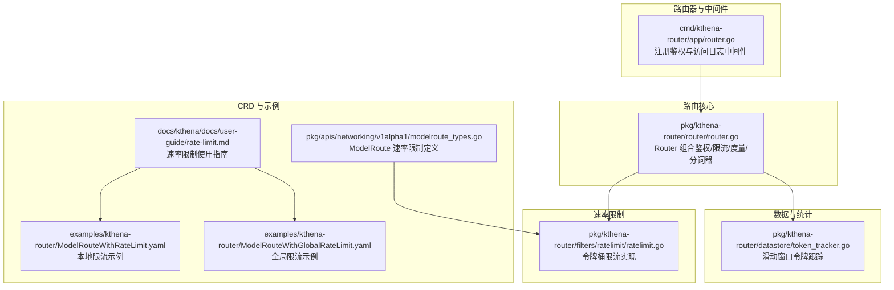
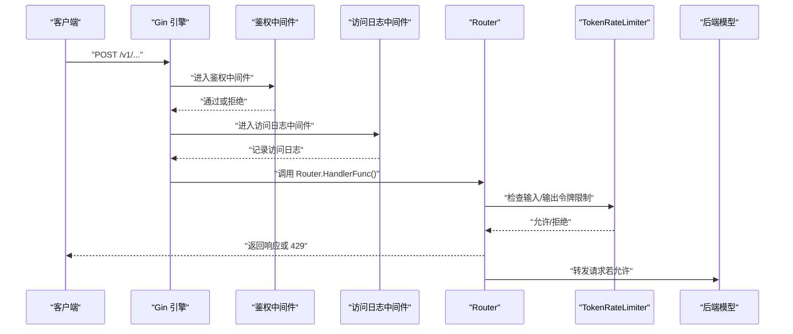
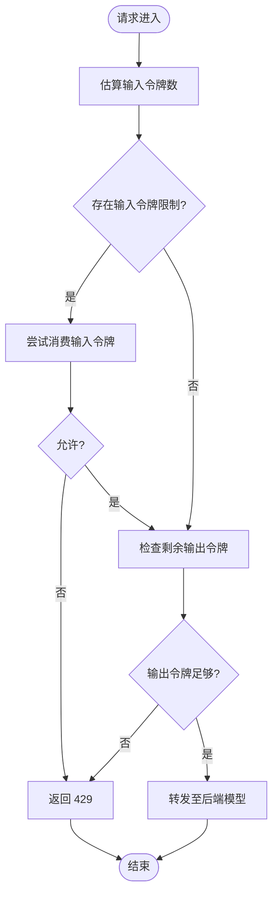
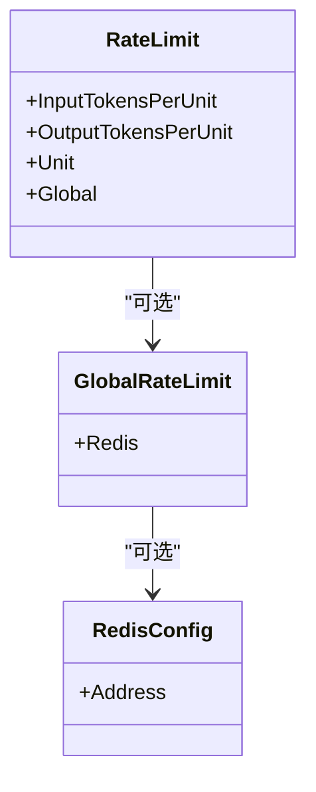
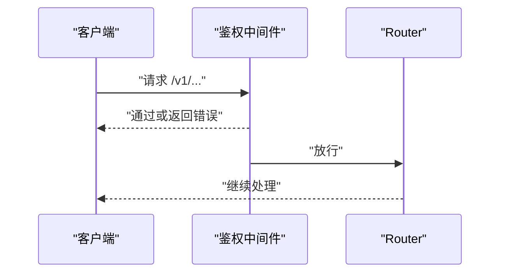
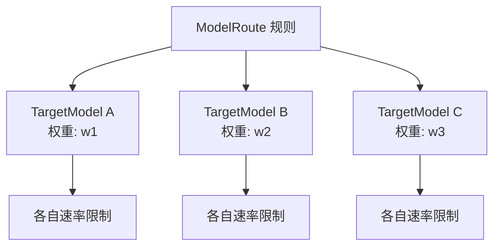
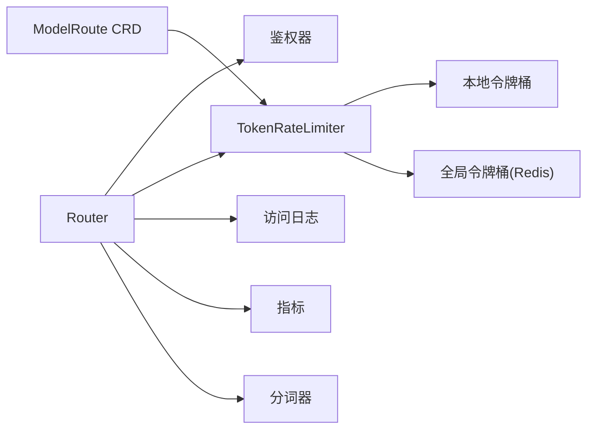

# 流量策略

<cite>
**本文引用的文件**
- [pkg/kthena-router/router/router.go](file://pkg/kthena-router/router/router.go)
- [pkg/kthena-router/filters/ratelimit/ratelimit.go](file://pkg/kthena-router/filters/ratelimit/ratelimit.go)
- [pkg/kthena-router/datastore/token_tracker.go](file://pkg/kthena-router/datastore/token_tracker.go)
- [pkg/apis/networking/v1alpha1/modelroute_types.go](file://pkg/apis/networking/v1alpha1/modelroute_types.go)
- [docs/kthena/docs/user-guide/rate-limit.md](file://docs/kthena/docs/user-guide/rate-limit.md)
- [examples/kthena-router/ModelRouteWithRateLimit.yaml](file://examples/kthena-router/ModelRouteWithRateLimit.yaml)
- [examples/kthena-router/ModelRouteWithGlobalRateLimit.yaml](file://examples/kthena-router/ModelRouteWithGlobalRateLimit.yaml)
- [cmd/kthena-router/app/router.go](file://cmd/kthena-router/app/router.go)
- [pkg/kthena-router/common/types.go](file://pkg/kthena-router/common/types.go)
</cite>

## 目录
1. [简介](#简介)
2. [项目结构](#项目结构)
3. [核心组件](#核心组件)
4. [架构总览](#架构总览)
5. [详细组件分析](#详细组件分析)
6. [依赖分析](#依赖分析)
7. [性能考虑](#性能考虑)
8. [故障排查指南](#故障排查指南)
9. [结论](#结论)
10. [附录](#附录)

## 简介
本章节面向希望在 Kthena 推理服务中构建高可用、可扩展且具备精细化流量治理能力的用户。文档聚焦以下主题：
- 基于令牌桶的速率限制机制：输入令牌限制、输出令牌限制与请求次数限制的实现原理与差异。
- 全局速率限制与模型级别速率限制的区别、配置方法与适用场景。
- JWT 认证与授权机制：用户身份验证、权限控制与访问策略配置。
- 高级流量控制策略：金丝雀发布、权重流量分配、故障转移等。
- 结合实际配置示例，给出使用场景与最佳实践。

## 项目结构
围绕“流量策略”的关键代码与配置分布在如下模块：
- 路由器与中间件：负责接入层鉴权、访问日志与请求转发。
- 速率限制过滤器：实现本地/全局令牌桶限流与令牌估算。
- 数据存储与统计：滑动窗口令牌跟踪（按用户/模型维度）。
- CRD 定义：ModelRoute 中的速率限制字段与单位枚举。
- 文档与示例：速率限制使用指南与示例清单。
- 示例配置：本地与全局速率限制的 YAML 模板。

图表来源
- [cmd/kthena-router/app/router.go:242-269](file://cmd/kthena-router/app/router.go#L242-L269)
- [pkg/kthena-router/router/router.go:71-107](file://pkg/kthena-router/router/router.go#L71-L107)
- [pkg/kthena-router/filters/ratelimit/ratelimit.go:60-231](file://pkg/kthena-router/filters/ratelimit/ratelimit.go#L60-L231)
- [pkg/kthena-router/datastore/token_tracker.go:56-357](file://pkg/kthena-router/datastore/token_tracker.go#L56-L357)
- [pkg/apis/networking/v1alpha1/modelroute_types.go:122-155](file://pkg/apis/networking/v1alpha1/modelroute_types.go#L122-L155)
- [docs/kthena/docs/user-guide/rate-limit.md:1-167](file://docs/kthena/docs/user-guide/rate-limit.md#L1-L167)
- [examples/kthena-router/ModelRouteWithRateLimit.yaml:1-18](file://examples/kthena-router/ModelRouteWithRateLimit.yaml#L1-L18)
- [examples/kthena-router/ModelRouteWithGlobalRateLimit.yaml:1-22](file://examples/kthena-router/ModelRouteWithGlobalRateLimit.yaml#L1-L22)

章节来源
- [cmd/kthena-router/app/router.go:242-269](file://cmd/kthena-router/app/router.go#L242-L269)
- [pkg/kthena-router/router/router.go:71-107](file://pkg/kthena-router/router/router.go#L71-L107)
- [pkg/kthena-router/filters/ratelimit/ratelimit.go:60-231](file://pkg/kthena-router/filters/ratelimit/ratelimit.go#L60-L231)
- [pkg/kthena-router/datastore/token_tracker.go:56-357](file://pkg/kthena-router/datastore/token_tracker.go#L56-L357)
- [pkg/apis/networking/v1alpha1/modelroute_types.go:122-155](file://pkg/apis/networking/v1alpha1/modelroute_types.go#L122-L155)
- [docs/kthena/docs/user-guide/rate-limit.md:1-167](file://docs/kthena/docs/user-guide/rate-limit.md#L1-L167)
- [examples/kthena-router/ModelRouteWithRateLimit.yaml:1-18](file://examples/kthena-router/ModelRouteWithRateLimit.yaml#L1-L18)
- [examples/kthena-router/ModelRouteWithGlobalRateLimit.yaml:1-22](file://examples/kthena-router/ModelRouteWithGlobalRateLimit.yaml#L1-L22)

## 核心组件
- 路由器 Router：聚合鉴权、速率限制、访问日志、指标、分词器与后端连接工厂，统一处理 /v1/* 请求。
- 速率限制过滤器 TokenRateLimiter：支持本地与全局两种模式，分别基于内存令牌桶与 Redis 分布式计数，对输入/输出令牌进行限制。
- 滑动窗口令牌跟踪 TokenTracker：按用户与模型维度记录令牌消耗与请求次数，支持权重计算与窗口修剪。
- ModelRoute CRD：在 Spec 中声明速率限制策略，包含输入/输出令牌上限、时间单位与全局 Redis 配置。
- 中间件链路：鉴权中间件仅对 /v1/* 生效；访问日志中间件同样限定路径范围。

章节来源
- [pkg/kthena-router/router/router.go:71-107](file://pkg/kthena-router/router/router.go#L71-L107)
- [pkg/kthena-router/filters/ratelimit/ratelimit.go:60-231](file://pkg/kthena-router/filters/ratelimit/ratelimit.go#L60-L231)
- [pkg/kthena-router/datastore/token_tracker.go:56-357](file://pkg/kthena-router/datastore/token_tracker.go#L56-L357)
- [pkg/apis/networking/v1alpha1/modelroute_types.go:122-155](file://pkg/apis/networking/v1alpha1/modelroute_types.go#L122-L155)
- [cmd/kthena-router/app/router.go:242-269](file://cmd/kthena-router/app/router.go#L242-L269)

## 架构总览
下图展示了从客户端到后端模型的请求路径，以及鉴权、速率限制与访问日志在中间件中的执行顺序与作用域。

图表来源
- [cmd/kthena-router/app/router.go:242-269](file://cmd/kthena-router/app/router.go#L242-L269)
- [pkg/kthena-router/router/router.go:71-107](file://pkg/kthena-router/router/router.go#L71-L107)
- [pkg/kthena-router/filters/ratelimit/ratelimit.go:100-137](file://pkg/kthena-router/filters/ratelimit/ratelimit.go#L100-L137)

## 详细组件分析

### 基于令牌桶的速率限制机制
- 输入令牌限制：根据请求提示文本估算输入令牌数，结合模型级别的输入令牌配额与时间单位进行判断。
- 输出令牌限制：在请求开始时保守检查剩余可用输出令牌是否大于等于 1，避免启动后无法完成的请求。
- 请求次数限制：当前实现以令牌桶为主，未直接暴露“请求数”独立阈值；可通过输入/输出令牌配额间接约束请求频率。
- 本地与全局模式：
  - 本地：每个 Router 实例维护内存令牌桶，适合单实例保护与低延迟场景。
  - 全局：通过 Redis 分布式计数，跨实例共享配额，适合多副本与弹性扩缩容场景。
- 时间单位：支持 second、minute、hour、day、month，内部转换为纳秒级时间窗。

图表来源
- [pkg/kthena-router/filters/ratelimit/ratelimit.go:100-137](file://pkg/kthena-router/filters/ratelimit/ratelimit.go#L100-L137)
- [pkg/kthena-router/filters/ratelimit/ratelimit.go:139-204](file://pkg/kthena-router/filters/ratelimit/ratelimit.go#L139-L204)

章节来源
- [pkg/kthena-router/filters/ratelimit/ratelimit.go:60-231](file://pkg/kthena-router/filters/ratelimit/ratelimit.go#L60-L231)
- [pkg/apis/networking/v1alpha1/modelroute_types.go:122-155](file://pkg/apis/networking/v1alpha1/modelroute_types.go#L122-L155)
- [docs/kthena/docs/user-guide/rate-limit.md:1-167](file://docs/kthena/docs/user-guide/rate-limit.md#L1-L167)

### 全局速率限制与模型级别速率限制
- 全局速率限制：在 ModelRoute.spec.rateLimit.global.redis.address 指定 Redis 地址后启用，所有 Router 实例共享计数，适合集群级一致性。
- 模型级别速率限制：在 ModelRoute.spec.rateLimit 下配置，针对特定模型生效；可同时设置输入/输出令牌上限与时间单位。
- 切换逻辑：当存在 global.redis.address 时采用全局模式；否则使用本地内存令牌桶。

图表来源
- [pkg/apis/networking/v1alpha1/modelroute_types.go:122-155](file://pkg/apis/networking/v1alpha1/modelroute_types.go#L122-L155)

章节来源
- [pkg/apis/networking/v1alpha1/modelroute_types.go:122-155](file://pkg/apis/networking/v1alpha1/modelroute_types.go#L122-L155)
- [pkg/kthena-router/filters/ratelimit/ratelimit.go:139-204](file://pkg/kthena-router/filters/ratelimit/ratelimit.go#L139-L204)
- [docs/kthena/docs/user-guide/rate-limit.md:1-167](file://docs/kthena/docs/user-guide/rate-limit.md#L1-L167)

### JWT 认证与授权机制
- 中间件生效范围：鉴权中间件仅对 /v1/* 路径生效，确保推理接口受控。
- 用户身份键：在通用类型中定义了用户标识键名与令牌用量键名，便于在下游插件或中间件中读取与传递。
- 鉴权流程：中间件在进入 Router 处理前执行，若失败则中断后续处理并返回相应错误；通过后继续访问日志与路由处理。

图表来源
- [cmd/kthena-router/app/router.go:653-669](file://cmd/kthena-router/app/router.go#L653-L669)
- [pkg/kthena-router/common/types.go:19-22](file://pkg/kthena-router/common/types.go#L19-L22)

章节来源
- [cmd/kthena-router/app/router.go:242-269](file://cmd/kthena-router/app/router.go#L242-L269)
- [pkg/kthena-router/common/types.go:19-22](file://pkg/kthena-router/common/types.go#L19-L22)

### 高级流量控制策略：金丝雀发布、权重流量分配与故障转移
- 权重流量分配：ModelRoute.Rule.TargetModels 支持为不同目标模型设置权重，用于按比例分流请求，便于灰度与 A/B 测试。
- 故障转移：通过多个目标模型与权重组合，可在上游限流或健康检查失败时自动将流量切换至备用模型。
- 与速率限制协同：建议为不同权重的目标模型配置差异化速率限制，避免热模型过载，冷模型被饿死。

图表来源
- [pkg/apis/networking/v1alpha1/modelroute_types.go:106-120](file://pkg/apis/networking/v1alpha1/modelroute_types.go#L106-L120)

章节来源
- [pkg/apis/networking/v1alpha1/modelroute_types.go:106-120](file://pkg/apis/networking/v1alpha1/modelroute_types.go#L106-L120)

### 使用示例与最佳实践
- 本地速率限制示例：参考示例清单中的本地限流 YAML，快速在单实例上验证输入/输出令牌限制效果。
- 全局速率限制示例：参考示例清单中的全局限流 YAML，部署 Redis 并在多副本 Router 上验证跨实例一致性。
- 最佳实践：
  - 对高成本模型优先开启全局速率限制，确保集群级公平性。
  - 将权重与速率限制结合：热模型降低权重并收紧配额，冷模型提高权重并适度放宽。
  - 在金丝雀阶段先以小权重分流，配合严格输入/输出令牌限制，逐步放大流量。

章节来源
- [docs/kthena/docs/user-guide/rate-limit.md:1-167](file://docs/kthena/docs/user-guide/rate-limit.md#L1-L167)
- [examples/kthena-router/ModelRouteWithRateLimit.yaml:1-18](file://examples/kthena-router/ModelRouteWithRateLimit.yaml#L1-L18)
- [examples/kthena-router/ModelRouteWithGlobalRateLimit.yaml:1-22](file://examples/kthena-router/ModelRouteWithGlobalRateLimit.yaml#L1-L22)

## 依赖分析
- Router 组合依赖：鉴权器、速率限制器、访问日志、指标、分词器与连接工厂。
- 速率限制依赖：令牌桶实现依赖 golang.org/x/time/rate 与 go-redis/redis/v8；全局模式需要 Redis 连接可用。
- CRD 依赖：ModelRoute.spec.rateLimit 字段驱动速率限制行为；单位枚举影响时间窗换算。
- 中间件依赖：鉴权与访问日志中间件仅对 /v1/* 生效，避免对健康检查与指标端点产生干扰。

图表来源
- [pkg/kthena-router/router/router.go:71-107](file://pkg/kthena-router/router/router.go#L71-L107)
- [pkg/kthena-router/filters/ratelimit/ratelimit.go:60-231](file://pkg/kthena-router/filters/ratelimit/ratelimit.go#L60-L231)
- [pkg/apis/networking/v1alpha1/modelroute_types.go:122-155](file://pkg/apis/networking/v1alpha1/modelroute_types.go#L122-L155)

章节来源
- [pkg/kthena-router/router/router.go:71-107](file://pkg/kthena-router/router/router.go#L71-L107)
- [pkg/kthena-router/filters/ratelimit/ratelimit.go:60-231](file://pkg/kthena-router/filters/ratelimit/ratelimit.go#L60-L231)
- [pkg/apis/networking/v1alpha1/modelroute_types.go:122-155](file://pkg/apis/networking/v1alpha1/modelroute_types.go#L122-L155)

## 性能考虑
- 本地令牌桶：低延迟、零网络开销，适合单实例保护；注意在多副本场景下各实例独立计数。
- 全局令牌桶：引入 Redis 网络往返，需关注延迟与可用性；建议使用就近集群内 Redis 服务。
- 令牌估算：默认使用简单估算器，必要时可替换更精确的分词器以提升限流精度。
- 滑动窗口统计：按用户/模型维度维护窗口与累计和，注意内存占用与修剪策略；可通过选项调整窗口大小与权重。

## 故障排查指南
- 429 错误排查：
  - 检查 ModelRoute.spec.rateLimit 是否正确配置输入/输出令牌上限与单位。
  - 若使用全局模式，确认 Redis 地址可达且连接成功。
- 鉴权失败：
  - 确认 /v1/* 路径已启用鉴权中间件；检查客户端凭据与策略。
- 限流不一致（多副本）：
  - 若期望全局一致性，请启用 global.redis.address 并确保多副本共享同一 Redis。
- 令牌估算偏差：
  - 更换或自定义分词器，或适当上调输出令牌阈值以缓解误杀。

章节来源
- [pkg/kthena-router/filters/ratelimit/ratelimit.go:139-204](file://pkg/kthena-router/filters/ratelimit/ratelimit.go#L139-L204)
- [cmd/kthena-router/app/router.go:653-669](file://cmd/kthena-router/app/router.go#L653-L669)

## 结论
Kthena 的流量策略以令牌桶为核心，结合本地与全局两种模式，既能满足单实例快速保护，也能在多副本环境下实现一致的资源治理。通过与 JWT 鉴权、权重分流与滑动窗口统计的协同，可覆盖从基础限流到高级金丝雀发布的完整需求，帮助用户构建高可用、可扩展的推理服务。

## 附录
- 示例清单：
  - 本地速率限制：[ModelRouteWithRateLimit.yaml:1-18](file://examples/kthena-router/ModelRouteWithRateLimit.yaml#L1-L18)
  - 全局速率限制：[ModelRouteWithGlobalRateLimit.yaml:1-22](file://examples/kthena-router/ModelRouteWithGlobalRateLimit.yaml#L1-L22)
- 使用指南：[速率限制文档:1-167](file://docs/kthena/docs/user-guide/rate-limit.md#L1-L167)