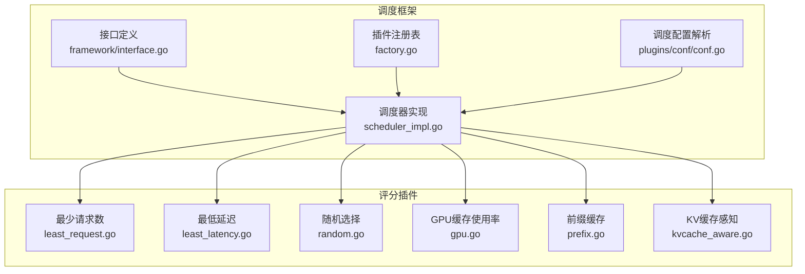
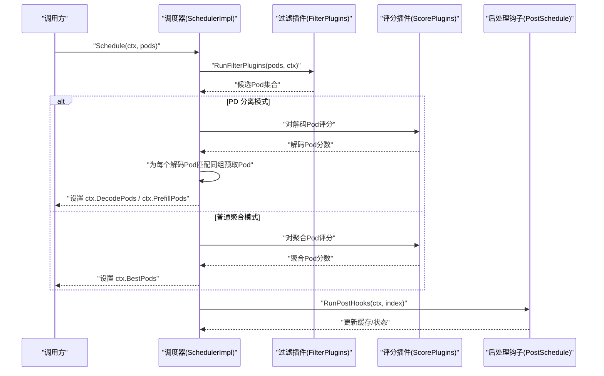
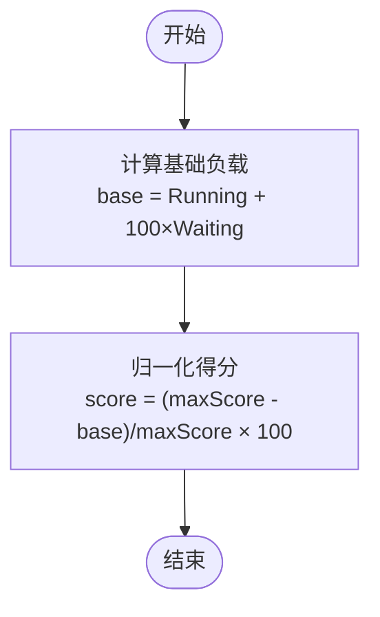
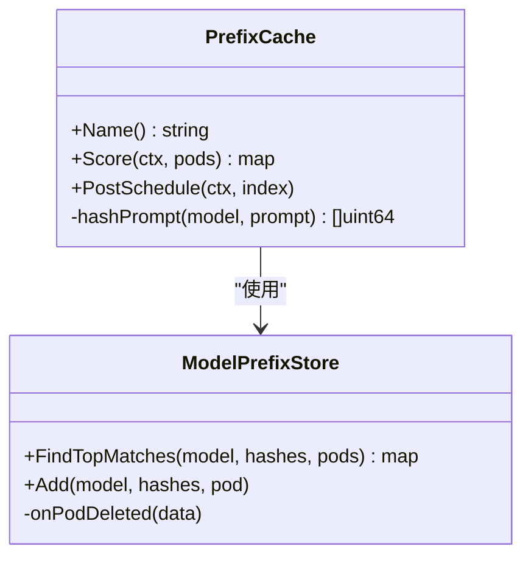
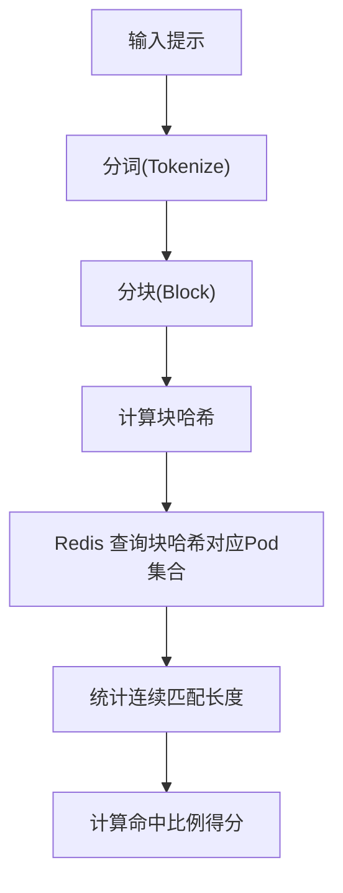
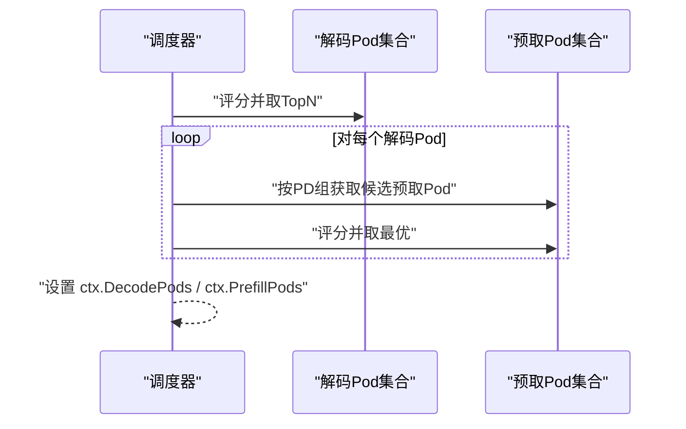
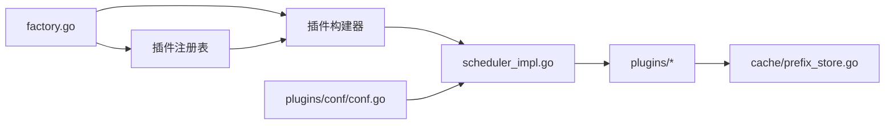

# 负载均衡算法

<cite>
**本文引用的文件**
- [pkg/kthena-router/scheduler/scheduler_impl.go](file://pkg/kthena-router/scheduler/scheduler_impl.go)
- [pkg/kthena-router/scheduler/factory.go](file://pkg/kthena-router/scheduler/factory.go)
- [pkg/kthena-router/scheduler/plugins/conf/conf.go](file://pkg/kthena-router/scheduler/plugins/conf/conf.go)
- [pkg/kthena-router/scheduler/framework/interface.go](file://pkg/kthena-router/scheduler/framework/interface.go)
- [pkg/kthena-router/scheduler/plugins/least_request.go](file://pkg/kthena-router/scheduler/plugins/least_request.go)
- [pkg/kthena-router/scheduler/plugins/least_latency.go](file://pkg/kthena-router/scheduler/plugins/least_latency.go)
- [pkg/kthena-router/scheduler/plugins/random.go](file://pkg/kthena-router/scheduler/plugins/random.go)
- [pkg/kthena-router/scheduler/plugins/gpu.go](file://pkg/kthena-router/scheduler/plugins/gpu.go)
- [pkg/kthena-router/scheduler/plugins/prefix.go](file://pkg/kthena-router/scheduler/plugins/prefix.go)
- [pkg/kthena-router/scheduler/plugins/kvcache_aware.go](file://pkg/kthena-router/scheduler/plugins/kvcache_aware.go)
- [pkg/kthena-router/scheduler/plugins/cache/prefix_store.go](file://pkg/kthena-router/scheduler/plugins/cache/prefix_store.go)
- [docs/kthena/blog/2025-09-09-benchmark/index.md](file://docs/kthena/blog/2025-09-09-benchmark/index.md)
- [docs/kthena/docs/user-guide/config-router.md](file://docs/kthena/docs/user-guide/config-router.md)
- [pkg/kthena-router/connectors/http.go](file://pkg/kthena-router/connectors/http.go)
- [pkg/kthena-router/connectors/sglang.go](file://pkg/kthena-router/connectors/sglang.go)
</cite>

## 目录
1. [简介](#简介)
2. [项目结构](#项目结构)
3. [核心组件](#核心组件)
4. [架构总览](#架构总览)
5. [详细组件分析](#详细组件分析)
6. [依赖关系分析](#依赖关系分析)
7. [性能考量](#性能考量)
8. [故障排查指南](#故障排查指南)
9. [结论](#结论)
10. [附录](#附录)

## 简介
本文件系统性阐述 Kthena 路由器中的可插拔调度器架构与多种负载均衡算法，覆盖公平调度、最少请求数、随机选择、最低延迟等通用策略，以及 KV 缓存感知调度与前缀匹配调度器的工作机制，并结合预取-解码分离（PD Disaggregation）场景下的负载分配流程，给出配置示例、性能对比与扩展实践建议。

## 项目结构
围绕调度器的关键目录与文件：
- 调度器核心：pkg/kthena-router/scheduler
  - 实现层：scheduler_impl.go、factory.go、plugins/conf/conf.go、framework/interface.go
  - 插件：least_request.go、least_latency.go、random.go、gpu.go、prefix.go、kvcache_aware.go 及其缓存实现 cache/prefix_store.go
- 文档与示例：docs/kthena/blog/2025-09-09-benchmark/index.md、docs/kthena/docs/user-guide/config-router.md
- 连接器与 PD 分离：pkg/kthena-router/connectors/http.go、pkg/kthena-router/connectors/sglang.go

图表来源
- [pkg/kthena-router/scheduler/scheduler_impl.go:101-165](file://pkg/kthena-router/scheduler/scheduler_impl.go#L101-L165)
- [pkg/kthena-router/scheduler/factory.go:66-95](file://pkg/kthena-router/scheduler/factory.go#L66-L95)
- [pkg/kthena-router/scheduler/plugins/conf/conf.go:82-103](file://pkg/kthena-router/scheduler/plugins/conf/conf.go#L82-L103)
- [pkg/kthena-router/scheduler/framework/interface.go:28-67](file://pkg/kthena-router/scheduler/framework/interface.go#L28-L67)

章节来源
- [pkg/kthena-router/scheduler/scheduler_impl.go:59-99](file://pkg/kthena-router/scheduler/scheduler_impl.go#L59-L99)
- [pkg/kthena-router/scheduler/factory.go:66-95](file://pkg/kthena-router/scheduler/factory.go#L66-L95)
- [pkg/kthena-router/scheduler/plugins/conf/conf.go:82-103](file://pkg/kthena-router/scheduler/plugins/conf/conf.go#L82-L103)
- [pkg/kthena-router/scheduler/framework/interface.go:28-67](file://pkg/kthena-router/scheduler/framework/interface.go#L28-L67)

## 核心组件
- 调度器接口与上下文
  - Context 提供模型名、提示词、哈希、PD 组信息、候选 Pod 列表及指标记录器等，贯穿过滤与评分阶段。
  - ScorePlugin/FilterPlugin 接口约定评分与过滤能力，统一返回范围在 [0,100] 的归一化分数。
- 调度执行流水线
  - 过滤阶段：按资源约束与可用性筛选候选 Pod
  - 评分阶段：多插件并行计算，加权聚合
  - 选择决策：Top-N 选出最佳 Pod
- 插件注册与配置
  - 默认插件注册表包含 GPU 使用率、最少请求数、最少延迟、随机、前缀缓存、KV 缓存感知等
  - 支持通过 ConfigMap 动态加载插件启用列表、权重与参数

章节来源
- [pkg/kthena-router/scheduler/framework/interface.go:28-67](file://pkg/kthena-router/scheduler/framework/interface.go#L28-L67)
- [pkg/kthena-router/scheduler/scheduler_impl.go:101-165](file://pkg/kthena-router/scheduler/scheduler_impl.go#L101-L165)
- [pkg/kthena-router/scheduler/factory.go:66-95](file://pkg/kthena-router/scheduler/factory.go#L66-L95)
- [pkg/kthena-router/scheduler/plugins/conf/conf.go:82-103](file://pkg/kthena-router/scheduler/plugins/conf/conf.go#L82-L103)

## 架构总览
调度器采用“可插拔 + 多阶段流水线”的设计：
- 插件体系：ScorePlugin/FilterPlugin 抽象，支持独立扩展
- 执行流程：过滤 → 并行评分 → 权重聚合 → TopN 选择
- PD 分离优化：针对预取-解码分离场景，先选解码 Pod 再为其匹配同组预取 Pod，提升端到端一致性

图表来源
- [pkg/kthena-router/scheduler/scheduler_impl.go:101-165](file://pkg/kthena-router/scheduler/scheduler_impl.go#L101-L165)
- [pkg/kthena-router/scheduler/scheduler_impl.go:225-229](file://pkg/kthena-router/scheduler/scheduler_impl.go#L225-L229)

章节来源
- [pkg/kthena-router/scheduler/scheduler_impl.go:101-165](file://pkg/kthena-router/scheduler/scheduler_impl.go#L101-L165)

## 详细组件分析

### 公平调度（最少请求数）
- 设计要点
  - 过滤：限制等待队列长度阈值，避免将请求发往过载节点
  - 评分：以运行中请求数 + 等待队列权重因子（默认 100）作为基础负载，进行归一化得到 0-100 分
- 适用场景
  - 需要动态感知排队压力的高并发环境；与最低延迟插件组合可兼顾吞吐与时延

图表来源
- [pkg/kthena-router/scheduler/plugins/least_request.go:68-96](file://pkg/kthena-router/scheduler/plugins/least_request.go#L68-L96)

章节来源
- [pkg/kthena-router/scheduler/plugins/least_request.go:62-96](file://pkg/kthena-router/scheduler/plugins/least_request.go#L62-L96)

### 最低延迟（最少延迟）
- 设计要点
  - 基于 TTFT 与 TPOT 的最小-最大归一化，按权重因子组合得到最终分数
  - 当所有 Pod 延迟一致时退化为满分，保证稳定性
- 适用场景
  - 对首 token 时延敏感的实时交互应用；可调节 TTFT/TPOT 权重平衡首包与后续输出速度

章节来源
- [pkg/kthena-router/scheduler/plugins/least_latency.go:65-96](file://pkg/kthena-router/scheduler/plugins/least_latency.go#L65-L96)
- [pkg/kthena-router/scheduler/plugins/least_latency.go:98-130](file://pkg/kthena-router/scheduler/plugins/least_latency.go#L98-L130)

### 随机选择
- 设计要点
  - 生成 [0,100] 均匀分布随机分，适合基线对比或轻量部署
  - 不建议与其他有含义的评分混合使用
- 适用场景
  - 快速验证调度器行为、无明确模式的混合工作负载

章节来源
- [pkg/kthena-router/scheduler/plugins/random.go:58-73](file://pkg/kthena-router/scheduler/plugins/random.go#L58-L73)

### GPU 缓存使用率（资源感知）
- 设计要点
  - 依据 GPU 缓存使用率打分，优先选择更低占用的 Pod，降低显存溢出风险
- 适用场景
  - 显存受限或多模型共享 GPU 的边缘/云边协同场景

章节来源
- [pkg/kthena-router/scheduler/plugins/gpu.go:41-49](file://pkg/kthena-router/scheduler/plugins/gpu.go#L41-L49)

### 前缀匹配调度器（Prefix Cache）
- 设计要点
  - 将提示文本切分为固定大小块，逐块滚动哈希（xxHash），形成链式依赖
  - 三层数组映射：Model → Hash → Pod，配合 LRU 记录哈希，支持 Top-K 匹配
  - 评分：匹配的块数占比 × 100；后处理钩子将最终选择的 Pod 与哈希写回缓存
- 适用场景
  - 重复提示/长系统提示的对话、代码生成等场景，显著提升缓存命中

图表来源
- [pkg/kthena-router/scheduler/plugins/prefix.go:158-206](file://pkg/kthena-router/scheduler/plugins/prefix.go#L158-L206)
- [pkg/kthena-router/scheduler/plugins/cache/prefix_store.go:138-195](file://pkg/kthena-router/scheduler/plugins/cache/prefix_store.go#L138-L195)

章节来源
- [pkg/kthena-router/scheduler/plugins/prefix.go:162-206](file://pkg/kthena-router/scheduler/plugins/prefix.go#L162-L206)
- [pkg/kthena-router/scheduler/plugins/cache/prefix_store.go:138-195](file://pkg/kthena-router/scheduler/plugins/cache/prefix_store.go#L138-L195)

### KV 缓存感知调度器（KV Cache Aware）
- 设计要点
  - 使用远程 VLLM 分词器将提示转为 token 序列，按固定块大小切分并计算标准化哈希
  - 通过 Redis 管道查询各块哈希对应的已缓存 Pod 列表，统计连续匹配长度，计算命中比例得分
  - 支持可配置块大小与最大匹配块数，键空间格式为 “matrix:kv:block:{model}@{hash}”
- 适用场景
  - 长系统提示、模板驱动的高重复性推理，跨 Pod 协作最大化 KV 缓存复用

图表来源
- [pkg/kthena-router/scheduler/plugins/kvcache_aware.go:153-192](file://pkg/kthena-router/scheduler/plugins/kvcache_aware.go#L153-L192)
- [pkg/kthena-router/scheduler/plugins/kvcache_aware.go:194-238](file://pkg/kthena-router/scheduler/plugins/kvcache_aware.go#L194-L238)
- [pkg/kthena-router/scheduler/plugins/kvcache_aware.go:247-299](file://pkg/kthena-router/scheduler/plugins/kvcache_aware.go#L247-L299)

章节来源
- [pkg/kthena-router/scheduler/plugins/kvcache_aware.go:153-192](file://pkg/kthena-router/scheduler/plugins/kvcache_aware.go#L153-L192)
- [pkg/kthena-router/scheduler/plugins/kvcache_aware.go:194-238](file://pkg/kthena-router/scheduler/plugins/kvcache_aware.go#L194-L238)
- [pkg/kthena-router/scheduler/plugins/kvcache_aware.go:247-299](file://pkg/kthena-router/scheduler/plugins/kvcache_aware.go#L247-L299)

### 预取-解码分离场景下的负载分配
- 场景说明
  - 在 PD Disaggregation 模式下，解码与预取分别由不同 Pod 承担，需确保二者在同一 PD 组内配对
- 调度流程
  - 先对解码 Pod 评分并取 Top-N
  - 针对每个解码 Pod，从存储中获取同组预取候选并单独评分，选择最优预取 Pod
  - 最终同时返回解码与预取候选，保证端到端一致性

图表来源
- [pkg/kthena-router/scheduler/scheduler_impl.go:108-158](file://pkg/kthena-router/scheduler/scheduler_impl.go#L108-L158)

章节来源
- [pkg/kthena-router/scheduler/scheduler_impl.go:108-158](file://pkg/kthena-router/scheduler/scheduler_impl.go#L108-L158)

## 依赖关系分析
- 组件耦合
  - SchedulerImpl 依赖插件注册表与配置解析，通过统一接口调用各插件
  - 前缀缓存与 KV 缓存感知插件依赖数据存储与外部服务（Redis/VLLM）
- 关键依赖链
  - factory.go 注册默认插件 → scheduler_impl.go 构建调度器 → plugins/* 实现具体算法
  - plugins/conf/conf.go 解析 ConfigMap 中的插件启用/权重/参数 → factory.go 构造插件实例

图表来源
- [pkg/kthena-router/scheduler/factory.go:66-95](file://pkg/kthena-router/scheduler/factory.go#L66-L95)
- [pkg/kthena-router/scheduler/scheduler_impl.go:59-99](file://pkg/kthena-router/scheduler/scheduler_impl.go#L59-L99)
- [pkg/kthena-router/scheduler/plugins/conf/conf.go:82-103](file://pkg/kthena-router/scheduler/plugins/conf/conf.go#L82-L103)
- [pkg/kthena-router/scheduler/plugins/cache/prefix_store.go:82-94](file://pkg/kthena-router/scheduler/plugins/cache/prefix_store.go#L82-L94)

章节来源
- [pkg/kthena-router/scheduler/factory.go:66-95](file://pkg/kthena-router/scheduler/factory.go#L66-L95)
- [pkg/kthena-router/scheduler/scheduler_impl.go:59-99](file://pkg/kthena-router/scheduler/scheduler_impl.go#L59-L99)
- [pkg/kthena-router/scheduler/plugins/conf/conf.go:82-103](file://pkg/kthena-router/scheduler/plugins/conf/conf.go#L82-L103)

## 性能考量
- 性能基准与结论（节选）
  - 在长系统提示场景下，KVCacheAware + Least Request 组合相较随机策略，吞吐提升达 173%，TTFT 降低 73.5%
  - 在短系统提示场景下，策略差异较小，传统策略已具备稳定表现
- 影响因素
  - Token 化与 Redis 查询带来额外开销，应结合工作负载特征自适应选择策略
  - PD 分离模式下，解码/预取配对的评分与存储查找直接影响端到端时延

章节来源
- [docs/kthena/blog/2025-09-09-benchmark/index.md:226-262](file://docs/kthena/blog/2025-09-09-benchmark/index.md#L226-L262)
- [docs/kthena/blog/2025-09-09-benchmark/index.md:263-337](file://docs/kthena/blog/2025-09-09-benchmark/index.md#L263-L337)

## 故障排查指南
- 常见问题定位
  - 插件未生效：检查 ConfigMap 中 plugins.enabled 列表与权重配置是否正确
  - 随机插件冲突：若与其他评分插件同时启用，将被自动移除并告警
  - 前缀缓存/Redis 异常：确认 Redis 客户端初始化与管道查询是否成功
  - PD 分离找不到配对：确认存储中是否存在同组预取 Pod，或解码/预取数量不匹配
- 建议步骤
  - 查看调度器日志中各插件耗时记录，定位瓶颈
  - 逐步禁用非必要插件，验证影响
  - 在测试环境对比不同策略组合的吞吐与 TTFT

章节来源
- [pkg/kthena-router/scheduler/plugins/conf/conf.go:105-125](file://pkg/kthena-router/scheduler/plugins/conf/conf.go#L105-L125)
- [pkg/kthena-router/scheduler/scheduler_impl.go:167-185](file://pkg/kthena-router/scheduler/scheduler_impl.go#L167-L185)
- [pkg/kthena-router/scheduler/scheduler_impl.go:190-223](file://pkg/kthena-router/scheduler/scheduler_impl.go#L190-L223)

## 结论
Kthena 的调度器通过可插拔架构与多阶段流水线，实现了灵活且高性能的推理请求分配。在高重复性与长提示场景下，KV 缓存感知与前缀缓存策略显著提升吞吐与首包时延表现；在资源受限或实时交互场景下，最少请求数与最低延迟策略提供了稳健的平衡。结合 PD 分离模式，调度器能够有效协调预取与解码阶段，提升整体一致性与效率。

## 附录

### 调度器配置示例
- 基础配置（含参数与启用列表）
  - 参考路径：[docs/kthena/docs/user-guide/config-router.md:54-97](file://docs/kthena/docs/user-guide/config-router.md#L54-L97)
- 参数说明
  - least-request：maxWaitingRequests
  - least-latency：TTFTTPOTWeightFactor
  - prefix-cache：blockSizeToHash、maxBlocksToMatch、maxHashCacheSize、topKMatches

章节来源
- [docs/kthena/docs/user-guide/config-router.md:54-97](file://docs/kthena/docs/user-guide/config-router.md#L54-L97)

### 扩展与自定义开发
- 新增评分插件
  - 实现 framework.ScorePlugin 接口，注册到 PluginRegistry
  - 在调度器构造时纳入启用列表与权重
- 新增过滤插件
  - 实现 framework.FilterPlugin 接口，加入 Filter 列表
- 注意事项
  - 插件返回分数应在 [0,100] 区间
  - 避免将随机插件与其它评分插件混用
  - 如需外部依赖（如 Redis/VLLM），确保初始化与错误处理完备

章节来源
- [pkg/kthena-router/scheduler/factory.go:66-95](file://pkg/kthena-router/scheduler/factory.go#L66-L95)
- [pkg/kthena-router/scheduler/factory.go:114-143](file://pkg/kthena-router/scheduler/factory.go#L114-L143)
- [pkg/kthena-router/scheduler/plugins/conf/conf.go:105-125](file://pkg/kthena-router/scheduler/plugins/conf/conf.go#L105-L125)