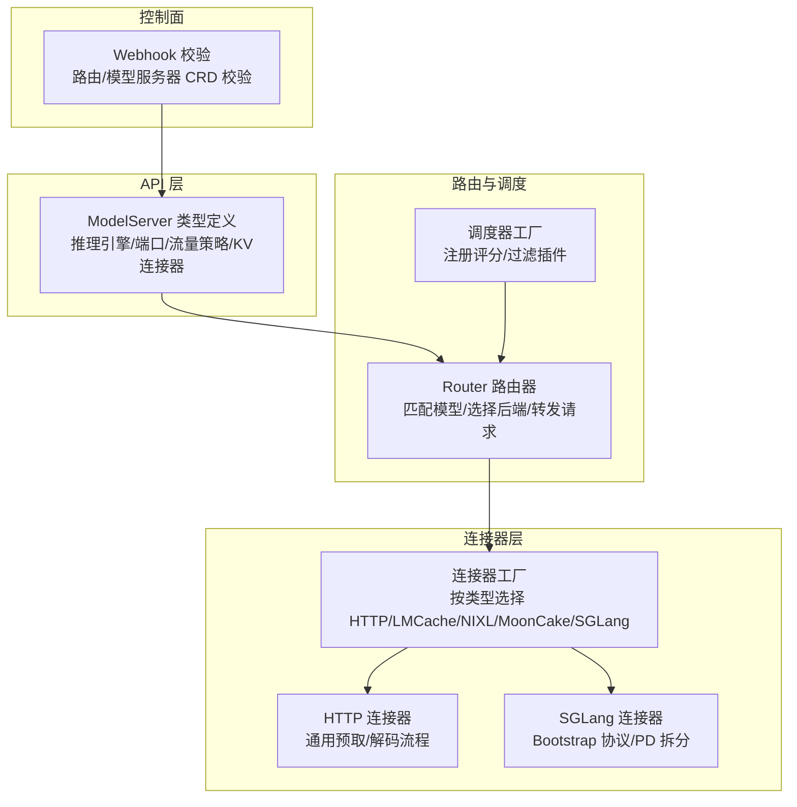
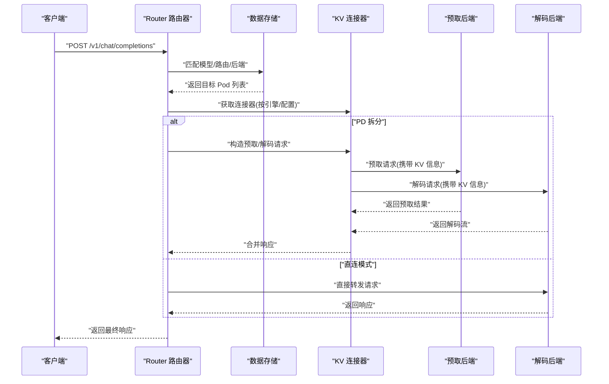
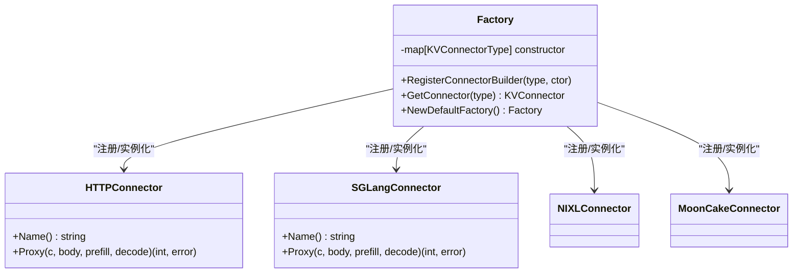
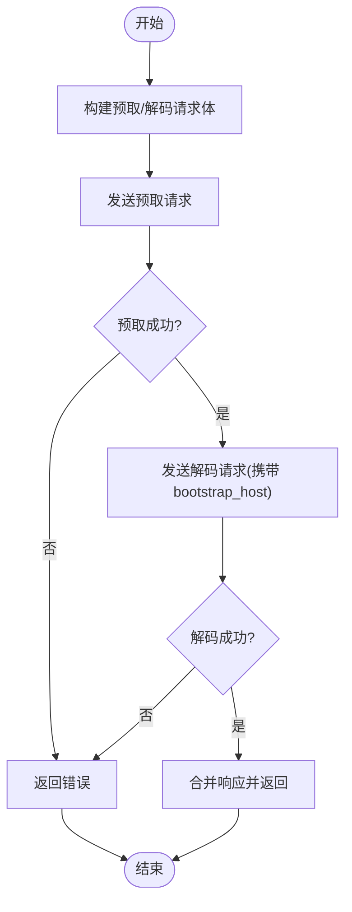
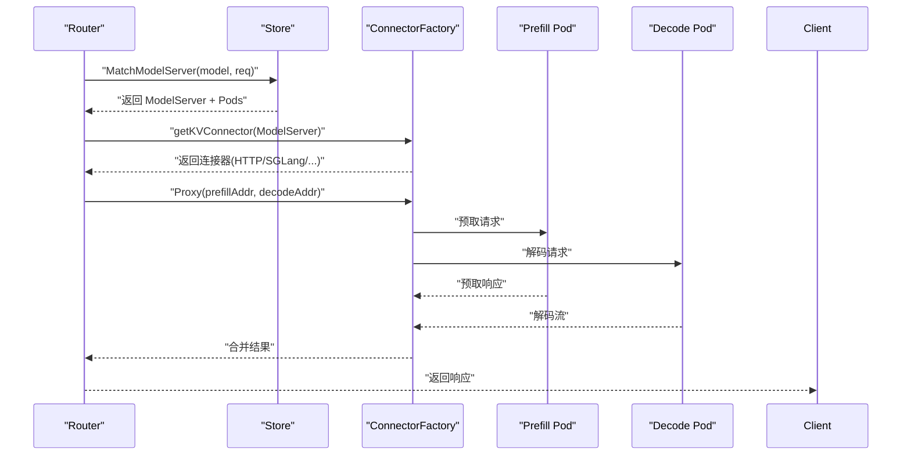
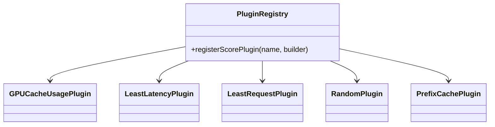
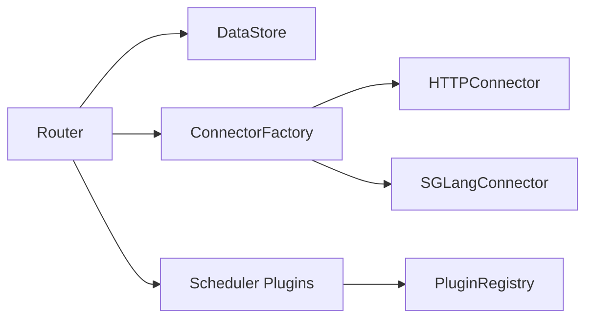

# 生产级 LLM 推理

<cite>
**本文引用的文件**
- [pkg/apis/networking/v1alpha1/modelserver_types.go](file://pkg/apis/networking/v1alpha1/modelserver_types.go)
- [pkg/kthena-router/connectors/factory.go](file://pkg/kthena-router/connectors/factory.go)
- [pkg/kthena-router/connectors/sglang.go](file://pkg/kthena-router/connectors/sglang.go)
- [pkg/kthena-router/connectors/http.go](file://pkg/kthena-router/connectors/http.go)
- [pkg/kthena-router/router/router.go](file://pkg/kthena-router/router/router.go)
- [pkg/kthena-router/datastore/store.go](file://pkg/kthena-router/datastore/store.go)
- [examples/kthena-router/ModelServer-sglang.yaml](file://examples/kthena-router/ModelServer-sglang.yaml)
- [cmd/kthena-router/main.go](file://cmd/kthena-router/main.go)
- [pkg/kthena-router/scheduler/factory.go](file://pkg/kthena-router/scheduler/factory.go)
- [pkg/kthena-router/scheduler/plugins/conf/conf_test.go](file://pkg/kthena-router/scheduler/plugins/conf/conf_test.go)
- [benchmark/kthena-router/README.md](file://benchmark/kthena-router/README.md)
</cite>

## 目录
1. [简介](#简介)
2. [项目结构](#项目结构)
3. [核心组件](#核心组件)
4. [架构总览](#架构总览)
5. [详细组件分析](#详细组件分析)
6. [依赖分析](#依赖分析)
7. [性能考量](#性能考量)
8. [故障排查指南](#故障排查指南)
9. [结论](#结论)
10. [附录](#附录)

## 简介
本文件面向生产环境，系统性阐述 Kthena 在 Kubernetes 原生平台上对多推理引擎的统一支持与企业级可靠性保障。Kthena 通过路由层抽象与可插拔的 KV 连接器，实现对 vLLM、SGLang 等推理引擎的统一接入；同时结合模型路由、调度策略、可观测性与 Webhook 校验，构建高可用、可扩展、可运维的 LLM 推理体系。

## 项目结构
围绕“推理引擎统一接入”的目标，Kthena 的关键代码分布在以下模块：
- API 定义：定义模型服务器、推理引擎枚举、端口协议、流量策略、KV 连接器类型等
- 路由与调度：路由请求到具体后端 Pod，支持 PD 拆分（Prefill/Decode）与公平调度
- 连接器工厂：按引擎或配置选择合适的 KV 连接器（HTTP、LMCache、NIXL、MoonCake、SGLang）
- 控制面与 Webhook：校验 CRD 配置，确保一致性与安全性
- 示例与基准：提供示例 CRD 与基准测试说明



图表来源
- [pkg/apis/networking/v1alpha1/modelserver_types.go:23-50](file://pkg/apis/networking/v1alpha1/modelserver_types.go#L23-L50)
- [pkg/kthena-router/router/router.go:916-930](file://pkg/kthena-router/router/router.go#L916-L930)
- [pkg/kthena-router/connectors/factory.go:47-60](file://pkg/kthena-router/connectors/factory.go#L47-L60)
- [pkg/kthena-router/connectors/http.go:28-61](file://pkg/kthena-router/connectors/http.go#L28-L61)
- [pkg/kthena-router/connectors/sglang.go:42-86](file://pkg/kthena-router/connectors/sglang.go#L42-L86)
- [pkg/kthena-router/scheduler/factory.go:65-83](file://pkg/kthena-router/scheduler/factory.go#L65-L83)

章节来源
- [pkg/apis/networking/v1alpha1/modelserver_types.go:23-120](file://pkg/apis/networking/v1alpha1/modelserver_types.go#L23-L120)
- [pkg/kthena-router/router/router.go:916-930](file://pkg/kthena-router/router/router.go#L916-L930)
- [pkg/kthena-router/connectors/factory.go:21-60](file://pkg/kthena-router/connectors/factory.go#L21-L60)
- [pkg/kthena-router/connectors/http.go:28-120](file://pkg/kthena-router/connectors/http.go#L28-L120)
- [pkg/kthena-router/connectors/sglang.go:42-221](file://pkg/kthena-router/connectors/sglang.go#L42-L221)
- [pkg/kthena-router/scheduler/factory.go:65-83](file://pkg/kthena-router/scheduler/factory.go#L65-L83)

## 核心组件
- 模型服务器（ModelServer）：声明模型名、推理引擎、工作负载选择器、端口协议、流量策略、KV 连接器等
- 路由器（Router）：解析请求、匹配模型路由、选择后端 Pod、调用 KV 连接器执行 PD 拆分或直连
- 连接器工厂：根据 CRD 或引擎自动选择 HTTP、LMCache、NIXL、MoonCake 或 SGLang 连接器
- 调度器：基于评分与过滤插件进行后端选择，支持 GPU 缓存使用率、延迟、请求数、随机等策略
- Webhook 校验：对 CRD 进行准入校验，保证配置正确性与一致性

章节来源
- [pkg/apis/networking/v1alpha1/modelserver_types.go:23-120](file://pkg/apis/networking/v1alpha1/modelserver_types.go#L23-L120)
- [pkg/kthena-router/router/router.go:916-930](file://pkg/kthena-router/router/router.go#L916-L930)
- [pkg/kthena-router/connectors/factory.go:21-60](file://pkg/kthena-router/connectors/factory.go#L21-L60)
- [pkg/kthena-router/scheduler/factory.go:65-83](file://pkg/kthena-router/scheduler/factory.go#L65-L83)

## 架构总览
Kthena 将“推理引擎无关”的路由与调度逻辑与“引擎特定”的 KV 连接器解耦。路由器根据 ModelServer 配置选择连接器，再执行预取/解码阶段的请求转发与 KV 缓存传递。调度器在多候选 Pod 中选择最优目标，结合公平队列与限流策略提升整体吞吐与稳定性。



图表来源
- [pkg/kthena-router/router/router.go:441-780](file://pkg/kthena-router/router/router.go#L441-L780)
- [pkg/kthena-router/connectors/factory.go:47-60](file://pkg/kthena-router/connectors/factory.go#L47-L60)
- [pkg/kthena-router/connectors/http.go:63-120](file://pkg/kthena-router/connectors/http.go#L63-L120)
- [pkg/kthena-router/connectors/sglang.go:72-195](file://pkg/kthena-router/connectors/sglang.go#L72-L195)

## 详细组件分析

### 组件一：模型服务器与推理引擎选择
- 推理引擎枚举：vLLM、SGLang
- 端口与协议：支持 http/https，默认 http
- 流量策略：超时、重试次数与间隔
- KV 连接器类型：http、lmcache、nixl、mooncake
- PD 拆分：通过 PDGroup 区分 prefill/decode 标签集合

```mermaid
classDiagram
class ModelServerSpec {
+string? model
+InferenceEngine inferenceEngine
+WorkloadSelector workloadSelector
+WorkloadPort workloadPort
+TrafficPolicy? trafficPolicy
+KVConnectorSpec? kvConnector
}
class InferenceEngine {
<<enum>>
"vLLM"
"SGLang"
}
class WorkloadPort {
+int32 port
+string protocol
}
class KVConnectorSpec {
+KVConnectorType type
}
class TrafficPolicy {
+duration? timeout
+Retry? retry
}
class Retry {
+int32 attempts
+duration? retryInterval
}
ModelServerSpec --> InferenceEngine
ModelServerSpec --> WorkloadPort
ModelServerSpec --> TrafficPolicy
ModelServerSpec --> KVConnectorSpec
TrafficPolicy --> Retry
```

图表来源
- [pkg/apis/networking/v1alpha1/modelserver_types.go:23-142](file://pkg/apis/networking/v1alpha1/modelserver_types.go#L23-L142)

章节来源
- [pkg/apis/networking/v1alpha1/modelserver_types.go:23-142](file://pkg/apis/networking/v1alpha1/modelserver_types.go#L23-L142)
- [examples/kthena-router/ModelServer-sglang.yaml:1-16](file://examples/kthena-router/ModelServer-sglang.yaml#L1-L16)

### 组件二：连接器工厂与引擎适配
- 工厂注册默认连接器：http、lmcache、nixl、mooncake
- SGLang 引擎自动绑定内部 sglang 连接器，不暴露给用户配置
- 默认回退：未知类型使用 http 连接器



图表来源
- [pkg/kthena-router/connectors/factory.go:21-60](file://pkg/kthena-router/connectors/factory.go#L21-L60)
- [pkg/kthena-router/connectors/http.go:28-61](file://pkg/kthena-router/connectors/http.go#L28-L61)
- [pkg/kthena-router/connectors/sglang.go:36-70](file://pkg/kthena-router/connectors/sglang.go#L36-L70)

章节来源
- [pkg/kthena-router/connectors/factory.go:21-60](file://pkg/kthena-router/connectors/factory.go#L21-L60)
- [pkg/kthena-router/connectors/http.go:28-120](file://pkg/kthena-router/connectors/http.go#L28-L120)
- [pkg/kthena-router/connectors/sglang.go:36-221](file://pkg/kthena-router/connectors/sglang.go#L36-L221)

### 组件三：SGLang PD 拆分与 Bootstrap 协议
- 关键点：预取/解码请求必须同时在途，否则会因无法建立 KV 缓存传输而超时
- 解决方案：连接器在同一流水线中并发发起预取与解码，并携带相同的 bootstrap_room 与 bootstrap_host



图表来源
- [pkg/kthena-router/connectors/sglang.go:72-195](file://pkg/kthena-router/connectors/sglang.go#L72-L195)

章节来源
- [pkg/kthena-router/connectors/sglang.go:72-195](file://pkg/kthena-router/connectors/sglang.go#L72-L195)

### 组件四：路由器与后端选择
- 路由匹配：从数据存储中查找模型/LoRA 对应的 ModelServer 与 Pod
- 连接器选择：优先使用 CRD 显式配置的 KV 连接器；若未指定且引擎为 SGLang，则使用 sglang 连接器
- PD 拆分：调用 KV 连接器执行预取/解码两阶段转发



图表来源
- [pkg/kthena-router/router/router.go:782-796](file://pkg/kthena-router/router/router.go#L782-L796)
- [pkg/kthena-router/router/router.go:916-930](file://pkg/kthena-router/router/router.go#L916-L930)
- [pkg/kthena-router/datastore/store.go:936-938](file://pkg/kthena-router/datastore/store.go#L936-L938)

章节来源
- [pkg/kthena-router/router/router.go:782-796](file://pkg/kthena-router/router/router.go#L782-L796)
- [pkg/kthena-router/router/router.go:916-930](file://pkg/kthena-router/router/router.go#L916-L930)
- [pkg/kthena-router/datastore/store.go:936-938](file://pkg/kthena-router/datastore/store.go#L936-L938)

### 组件五：调度器与评分策略
- 默认评分插件：GPU 缓存使用率、最低延迟、最少请求、随机、前缀缓存等
- 冲突处理：当存在随机插件与其他评分插件时，移除随机以避免冲突
- 参数化：部分插件支持参数注入（如最大等待请求数）



图表来源
- [pkg/kthena-router/scheduler/factory.go:65-83](file://pkg/kthena-router/scheduler/factory.go#L65-L83)
- [pkg/kthena-router/scheduler/plugins/conf/conf_test.go:66-123](file://pkg/kthena-router/scheduler/plugins/conf/conf_test.go#L66-L123)

章节来源
- [pkg/kthena-router/scheduler/factory.go:65-83](file://pkg/kthena-router/scheduler/factory.go#L65-L83)
- [pkg/kthena-router/scheduler/plugins/conf/conf_test.go:66-123](file://pkg/kthena-router/scheduler/plugins/conf/conf_test.go#L66-L123)

## 依赖分析
- 路由器依赖数据存储以解析模型路由与后端 Pod
- 路由器通过连接器工厂选择 KV 连接器
- 连接器工厂注册多种连接器，SGLang 自动绑定 sglang 连接器
- 调度器插件注册集中于工厂，便于扩展与测试



图表来源
- [pkg/kthena-router/router/router.go:916-930](file://pkg/kthena-router/router/router.go#L916-L930)
- [pkg/kthena-router/connectors/factory.go:47-60](file://pkg/kthena-router/connectors/factory.go#L47-L60)
- [pkg/kthena-router/scheduler/factory.go:65-83](file://pkg/kthena-router/scheduler/factory.go#L65-L83)

章节来源
- [pkg/kthena-router/router/router.go:916-930](file://pkg/kthena-router/router/router.go#L916-L930)
- [pkg/kthena-router/connectors/factory.go:47-60](file://pkg/kthena-router/connectors/factory.go#L47-L60)
- [pkg/kthena-router/scheduler/factory.go:65-83](file://pkg/kthena-router/scheduler/factory.go#L65-L83)

## 性能考量
- 引擎选择建议
  - vLLM：通用性强、生态完善，适合大多数场景；可通过 LMCache/NIXL/MoonCake 连接器实现 KV 缓存优化
  - SGLang：原生支持 PD 拆分与 Bootstrap 协议，适合需要严格 KV 传递与低延迟的场景
- 配置要点
  - 使用 PDGroup 明确区分 prefill/decode 角色标签，确保连接器正确匹配
  - 合理设置 WorkloadPort 的端口与协议，确保与后端服务一致
  - 通过 TrafficPolicy 设置超时与重试，平衡可靠性与资源占用
- 调度优化
  - 结合 GPU 缓存使用率、最低延迟与最少请求策略，动态选择最优后端
  - 避免随机插件与其他评分插件共存导致的冲突
- 可观测性
  - 启用访问日志与指标记录，跟踪预取/解码阶段耗时与上游请求数
  - 通过调试端口与 Webhook 日志定位问题

[本节为通用性能指导，不直接分析具体文件]

## 故障排查指南
- SGLang PD 拆分失败
  - 现象：预取超时或解码阶段报 KV 传输错误
  - 原因：预取/解码请求未同时在途
  - 处理：确认连接器并发发起两阶段请求，并携带相同 bootstrap_room 与 bootstrap_host
- 连接器类型不匹配
  - 现象：请求被错误地直连或未走 PD 拆分
  - 处理：检查 ModelServer 的 KVConnector 配置或推理引擎是否为 SGLang
- 路由匹配失败
  - 现象：找不到对应 ModelServer 或后端 Pod
  - 处理：核对模型名、LoRA 适配器、标签选择器与命名空间
- 调度冲突
  - 现象：随机插件与其他评分插件共存导致异常
  - 处理：移除随机插件或调整权重，确保调度策略清晰

章节来源
- [pkg/kthena-router/connectors/sglang.go:72-195](file://pkg/kthena-router/connectors/sglang.go#L72-L195)
- [pkg/kthena-router/router/router.go:916-930](file://pkg/kthena-router/router/router.go#L916-L930)
- [pkg/kthena-router/datastore/store.go:936-938](file://pkg/kthena-router/datastore/store.go#L936-L938)
- [pkg/kthena-router/scheduler/plugins/conf/conf_test.go:66-123](file://pkg/kthena-router/scheduler/plugins/conf/conf_test.go#L66-L123)

## 结论
Kthena 通过“路由+调度+连接器”的分层设计，实现了对 vLLM、SGLang 等推理引擎的统一接入与企业级可靠性保障。结合 PD 拆分、流量策略、调度插件与 Webhook 校验，可在不同业务场景下灵活选择最优推理引擎，并持续优化性能与资源利用率。

[本节为总结性内容，不直接分析具体文件]

## 附录

### A. 推理引擎选择与部署配置建议
- vLLM
  - 适用场景：通用大模型推理、易于扩展与运维
  - 配置要点：选择 http/lmcache/nixl/mooncake 连接器以启用 KV 缓存优化；合理设置端口与协议
- SGLang
  - 适用场景：需要严格的 KV 传递与低延迟的 PD 拆分
  - 配置要点：无需手动配置连接器类型，SGLang 引擎自动绑定 sglang 连接器；确保 prefill/decode 标签分离

章节来源
- [pkg/apis/networking/v1alpha1/modelserver_types.go:52-62](file://pkg/apis/networking/v1alpha1/modelserver_types.go#L52-L62)
- [pkg/kthena-router/connectors/factory.go:47-60](file://pkg/kthena-router/connectors/factory.go#L47-L60)
- [examples/kthena-router/ModelServer-sglang.yaml:1-16](file://examples/kthena-router/ModelServer-sglang.yaml#L1-L16)

### B. 基准测试与性能评估
- 基准测试说明：参考基准目录下的 README，了解测试方法与指标采集方式
- 建议指标：吞吐量、P50/P95 延迟、预取/解码阶段耗时、CPU/GPU 利用率、内存占用

章节来源
- [benchmark/kthena-router/README.md](file://benchmark/kthena-router/README.md)

### C. 控制面与安全
- Webhook 校验：启动时自动加载/生成证书，更新 ValidatingWebhookConfiguration 的 CA Bundle
- 路由器参数：支持开启/关闭网关 API 与推理扩展、TLS 证书路径、调试端口、K8s API QPS/Burst 等

章节来源
- [cmd/kthena-router/main.go:40-226](file://cmd/kthena-router/main.go#L40-L226)