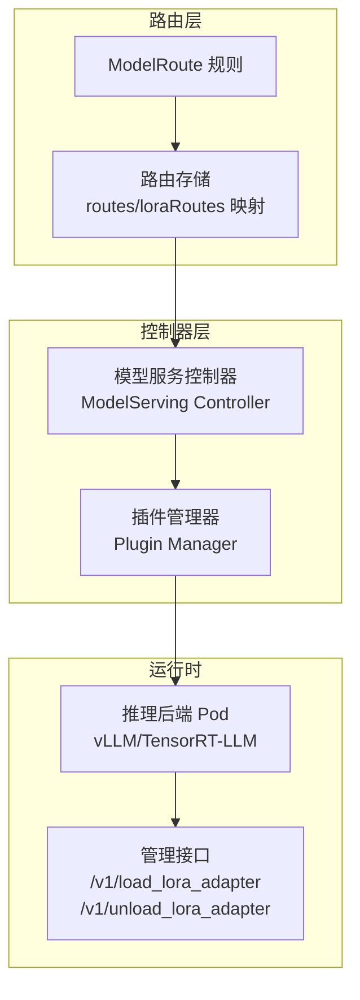
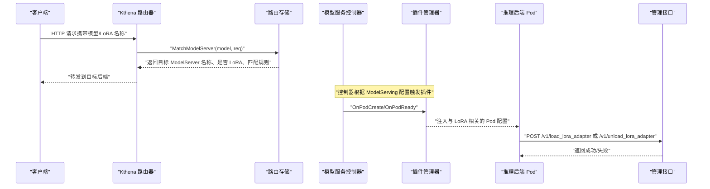
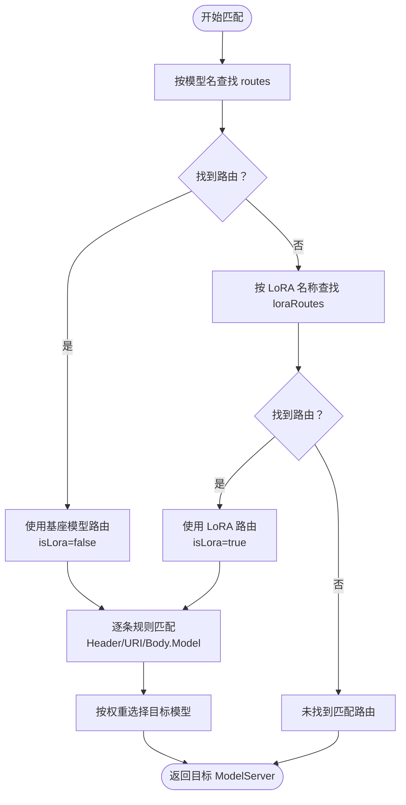
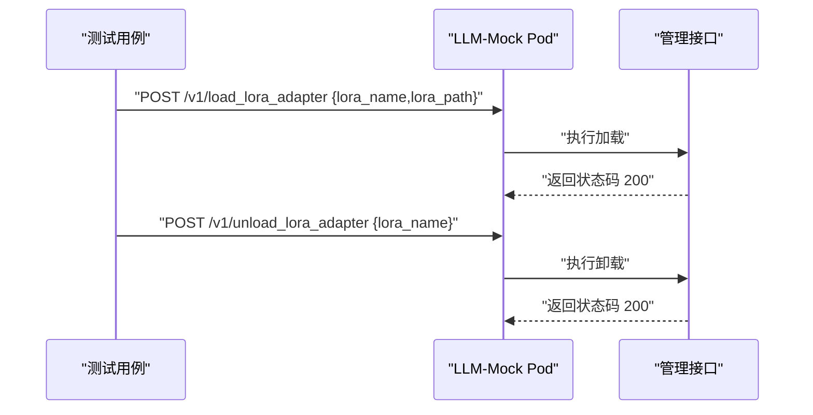
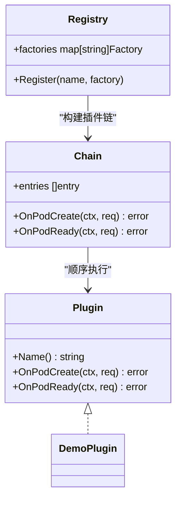
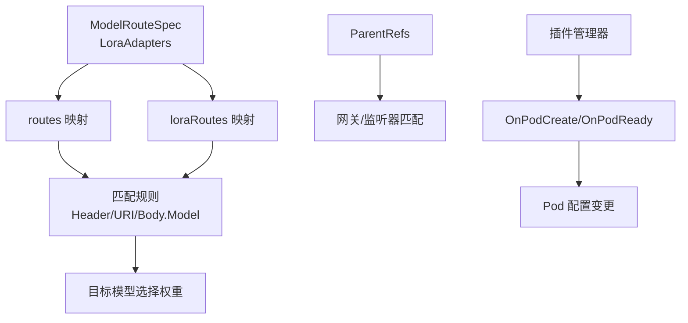

# 动态 LoRA 管理

<cite>
**本文引用的文件**
- [modelroute_types.go](file://pkg/apis/networking/v1alpha1/modelroute_types.go)
- [modelroutespec.go](file://client-go/applyconfiguration/networking/v1alpha1/modelroutespec.go)
- [store.go](file://pkg/kthena-router/datastore/store.go)
- [store_test.go](file://pkg/kthena-router/datastore/store_test.go)
- [lora.go](file://test/e2e/utils/lora.go)
- [ModelRouteLora.yaml](file://examples/kthena-router/ModelRouteLora.yaml)
- [manager.go](file://pkg/model-serving-controller/plugins/manager.go)
- [types.go](file://pkg/model-serving-controller/plugins/types.go)
- [modelserving-plugin-framework.md](file://docs/kthena/docs/user-guide/modelserving-plugin-framework.md)
- [model_booster_controller.go](file://pkg/model-booster-controller/controller/model_booster_controller.go)
</cite>

## 目录
1. [简介](#简介)
2. [项目结构](#项目结构)
3. [核心组件](#核心组件)
4. [架构总览](#架构总览)
5. [详细组件分析](#详细组件分析)
6. [依赖分析](#依赖分析)
7. [性能考虑](#性能考虑)
8. [故障排查指南](#故障排查指南)
9. [结论](#结论)
10. [附录](#附录)

## 简介
本文件围绕 Kthena 的动态 LoRA 管理能力进行系统化说明，涵盖 LoRA 基本概念、在大模型推理中的价值、Kthena 在路由层对 LoRA 的支持方式、LoRA 的存储与热切换机制、部署配置示例、优先级与冲突处理策略、性能影响与最佳实践，以及如何通过插件框架扩展 LoRA 管理能力。

LoRA（Low-Rank Adaptation）是一种高效微调技术：通过低秩矩阵对权重进行增量调整，在不改变基础模型参数的前提下实现任务或领域的个性化。在 LLM 推理场景中，LoRA 可以按需切换不同适配器，实现“同一基座模型”的多任务/多领域推理，具备资源占用低、切换快、易于管理等优势。

## 项目结构
与动态 LoRA 管理直接相关的核心模块包括：
- 路由与匹配：ModelRoute 定义与匹配逻辑，支持基于模型名或 LoRA 名称的路由规则
- 存储与状态：路由表、LoRA 列表、目标模型选择与权重分配
- 端到端测试：通过直接向后端 Pod 发送管理接口实现 LoRA 的加载/卸载
- 插件框架：可扩展的 Pod 生命周期钩子，便于在运行时注入与 LoRA 相关的环境变量、卷或侧车

图表来源
- [store.go:280-323](file://pkg/kthena-router/datastore/store.go#L280-L323)
- [manager.go:54-80](file://pkg/model-serving-controller/plugins/manager.go#L54-L80)
- [lora.go:32-63](file://test/e2e/utils/lora.go#L32-L63)

章节来源
- [store.go:280-323](file://pkg/kthena-router/datastore/store.go#L280-L323)
- [manager.go:54-80](file://pkg/model-serving-controller/plugins/manager.go#L54-L80)
- [types.go:27-44](file://pkg/model-serving-controller/plugins/types.go#L27-L44)

## 核心组件
- ModelRoute 与 LoRA 字段
  - ModelRouteSpec 包含 LoraAdapters 字段，用于声明该路由所服务的 LoRA 适配器名称列表
  - 同时保留 ModelName 字段，支持“基座模型 + 多个 LoRA”的混合路由
- 路由存储与匹配
  - 存储层维护 routes（按基座模型名索引）与 loraRoutes（按 LoRA 名称索引）两套映射
  - 匹配时优先按模型名查找；若未找到，则回退到 LoRA 名称查找，并标记 isLora
- 端到端 LoRA 管理
  - 通过直接访问后端 Pod 的管理接口实现 LoRA 的加载与卸载，避免经由网关/路由器转发
- 插件框架
  - 提供 OnPodCreate/OnPodReady 生命周期钩子，可在 Pod 创建前后注入与 LoRA 相关的配置（如环境变量、卷挂载）

章节来源
- [modelroute_types.go:24-56](file://pkg/apis/networking/v1alpha1/modelroute_types.go#L24-L56)
- [modelroutespec.go:36-58](file://client-go/applyconfiguration/networking/v1alpha1/modelroutespec.go#L36-L58)
- [store.go:268-289](file://pkg/kthena-router/datastore/store.go#L268-L289)
- [store.go:936-998](file://pkg/kthena-router/datastore/store.go#L936-L998)
- [lora.go:32-95](file://test/e2e/utils/lora.go#L32-L95)
- [manager.go:82-112](file://pkg/model-serving-controller/plugins/manager.go#L82-L112)
- [types.go:27-44](file://pkg/model-serving-controller/plugins/types.go#L27-L44)

## 架构总览
下图展示了从请求进入路由层，到控制器与插件框架协作，再到后端 Pod 执行 LoRA 加载/卸载的整体流程。

图表来源
- [store.go:936-998](file://pkg/kthena-router/datastore/store.go#L936-L998)
- [manager.go:82-112](file://pkg/model-serving-controller/plugins/manager.go#L82-L112)
- [lora.go:32-95](file://test/e2e/utils/lora.go#L32-L95)

## 详细组件分析

### 组件一：ModelRoute 与 LoRA 路由
- 设计要点
  - LoraAdapters 字段允许将多个 LoRA 名称与路由绑定，形成“LoRA 名称 → 路由集合”的映射
  - 当请求模型名为某个 LoRA 名称时，路由层会命中对应的 loraRoutes 并标记 isLora
  - 支持与 ParentRefs 结合，限定路由仅作用于特定 Gateway/Listener
- 关键行为
  - 添加/更新路由时，同时写入 routes 与 loraRoutes
  - 删除路由时，清理两条映射并回收等待队列
  - 匹配规则支持 Header/URI/Body.Model 的组合匹配，确保 LoRA 场景下的细粒度路由

图表来源
- [store.go:936-998](file://pkg/kthena-router/datastore/store.go#L936-L998)
- [store.go:1041-1082](file://pkg/kthena-router/datastore/store.go#L1041-L1082)
- [store.go:1098-1114](file://pkg/kthena-router/datastore/store.go#L1098-L1114)

章节来源
- [modelroute_types.go:24-56](file://pkg/apis/networking/v1alpha1/modelroute_types.go#L24-L56)
- [store.go:754-828](file://pkg/kthena-router/datastore/store.go#L754-L828)
- [store.go:844-934](file://pkg/kthena-router/datastore/store.go#L844-L934)
- [store_test.go:907-976](file://pkg/kthena-router/datastore/store_test.go#L907-L976)

### 组件二：LoRA 适配器的存储、分发与热切换
- 存储与分发
  - 路由层通过 loraRoutes 维护 LoRA 名称到路由的映射，便于按 LoRA 名称快速定位
  - 控制器通过插件框架在 Pod 创建阶段注入必要的运行时配置（如环境变量、卷），使后端能够识别并加载对应 LoRA
- 热切换机制
  - 通过直接访问后端 Pod 的管理接口实现 LoRA 的加载/卸载，避免经由网关/路由器转发
  - 测试工具提供了统一的加载/卸载封装，便于端到端验证

图表来源
- [lora.go:32-95](file://test/e2e/utils/lora.go#L32-L95)

章节来源
- [lora.go:32-95](file://test/e2e/utils/lora.go#L32-L95)
- [manager.go:82-112](file://pkg/model-serving-controller/plugins/manager.go#L82-L112)
- [types.go:27-44](file://pkg/model-serving-controller/plugins/types.go#L27-L44)

### 组件三：插件系统扩展 LoRA 管理
- 插件生命周期
  - OnPodCreate：在 Pod 创建前注入与 LoRA 相关的配置（如环境变量、卷）
  - OnPodReady：在 Pod 就绪后执行观测或日志记录
- 执行顺序与作用域
  - 按配置顺序依次执行，每个插件看到的是前序插件已应用后的 Pod
  - 支持按角色（Entry/Worker/All）与目标（roles/target）进行范围控制

图表来源
- [types.go:27-44](file://pkg/model-serving-controller/plugins/types.go#L27-L44)
- [manager.go:54-80](file://pkg/model-serving-controller/plugins/manager.go#L54-L80)
- [manager.go:122-139](file://pkg/model-serving-controller/plugins/manager.go#L122-L139)

章节来源
- [modelserving-plugin-framework.md:1-166](file://docs/kthena/docs/user-guide/modelserving-plugin-framework.md#L1-L166)
- [manager.go:54-80](file://pkg/model-serving-controller/plugins/manager.go#L54-L80)
- [types.go:27-44](file://pkg/model-serving-controller/plugins/types.go#L27-L44)

### 组件四：部署配置示例（ModelRoute 与 ModelServer）
- ModelRoute 示例
  - 通过 LoraAdapters 字段声明该路由服务的 LoRA 名称列表
  - 可结合 ParentRefs 限定作用于特定 Gateway/Listener
- ModelServer 示例
  - 与 ModelRoute 配合，将请求路由到具体的推理后端（如 vLLM/TensorRT-LLM）

章节来源
- [ModelRouteLora.yaml:1-14](file://examples/kthena-router/ModelRouteLora.yaml#L1-L14)
- [modelroute_types.go:24-56](file://pkg/apis/networking/v1alpha1/modelroute_types.go#L24-L56)

## 依赖分析
- 路由层依赖
  - routes：按基座模型名索引，支持常规模型匹配
  - loraRoutes：按 LoRA 名称索引，支持 LoRA 专用路由
  - ParentRefs：限制路由作用范围
- 控制器与插件
  - 插件注册与执行顺序由插件管理器统一调度
  - 插件在 OnPodCreate/OnPodReady 阶段对 Pod 进行变更，影响后端加载 LoRA 的能力

图表来源
- [store.go:280-323](file://pkg/kthena-router/datastore/store.go#L280-L323)
- [store.go:936-998](file://pkg/kthena-router/datastore/store.go#L936-L998)
- [manager.go:82-112](file://pkg/model-serving-controller/plugins/manager.go#L82-L112)

章节来源
- [store.go:280-323](file://pkg/kthena-router/datastore/store.go#L280-L323)
- [store.go:936-998](file://pkg/kthena-router/datastore/store.go#L936-L998)
- [manager.go:82-112](file://pkg/model-serving-controller/plugins/manager.go#L82-L112)

## 性能考虑
- 路由匹配复杂度
  - routes/loraRoutes 采用切片+排序的结构，匹配时按时间/版本次序遍历，整体为 O(N)（N 为同名模型/LoRA 的路由数量）
  - Header/URI/Body.Model 的匹配为字符串比较，常数开销较小
- 权重选择
  - 目标模型权重随机选择，时间复杂度 O(M)（M 为目标数量），建议合理设置权重以避免极端倾斜
- 等待队列与公平调度
  - 路由层维护 per-model 等待队列，配合令牌跟踪与滑动窗口实现公平调度，避免 LoRA 切换导致的热点问题
- 端到端延迟
  - 直接访问后端管理接口进行 LoRA 加载/卸载，避免额外转发开销；但需注意接口超时与连接池配置

章节来源
- [store.go:830-842](file://pkg/kthena-router/datastore/store.go#L830-L842)
- [store.go:1098-1114](file://pkg/kthena-router/datastore/store.go#L1098-L1114)
- [store.go:431-441](file://pkg/kthena-router/datastore/store.go#L431-L441)

## 故障排查指南
- 未找到匹配路由
  - 检查 ModelRoute 是否正确声明 LoraAdapters，且请求模型名与 LoRA 名称一致
  - 若使用 ParentRefs，请确认 Gateway/Listener 匹配条件
- LoRA 无法加载/卸载
  - 确认后端 Pod 的管理接口可达，检查请求体字段（lora_name、lora_path）
  - 查看控制器日志，确认插件链执行顺序与作用域配置
- 冲突与优先级问题
  - 同名 LoRA 的多条路由按创建时间与资源版本排序，旧路由会被新路由覆盖
  - 若存在 Header/URI/Body.Model 的组合匹配，优先满足更严格的条件

章节来源
- [store.go:936-998](file://pkg/kthena-router/datastore/store.go#L936-L998)
- [store.go:754-828](file://pkg/kthena-router/datastore/store.go#L754-L828)
- [lora.go:32-95](file://test/e2e/utils/lora.go#L32-L95)

## 结论
Kthena 通过 ModelRoute 的 LoRA 支持与路由存储的双映射机制，实现了对 LoRA 适配器的灵活路由与匹配；结合插件框架与后端管理接口，能够在不重启服务的情况下完成 LoRA 的加载与卸载，满足动态定制与快速切换的需求。通过合理的配置与监控，可进一步提升系统的稳定性与性能。

## 附录
- 最佳实践建议
  - 将 LoRA 名称规范化，避免大小写与特殊字符差异导致的匹配失败
  - 对关键路由启用 ParentRefs，限定作用范围，减少误匹配风险
  - 使用插件在 Pod 层面注入必要的运行时参数，确保后端能够正确识别与加载 LoRA
  - 合理设置权重与公平调度参数，避免 LoRA 切换带来的流量倾斜
- 相关参考
  - ModelRoute API 定义与字段约束
  - 插件框架设计与使用指南
  - 端到端 LoRA 管理接口示例

章节来源
- [modelroute_types.go:24-56](file://pkg/apis/networking/v1alpha1/modelroute_types.go#L24-L56)
- [modelserving-plugin-framework.md:1-166](file://docs/kthena/docs/user-guide/modelserving-plugin-framework.md#L1-L166)
- [lora.go:32-95](file://test/e2e/utils/lora.go#L32-L95)