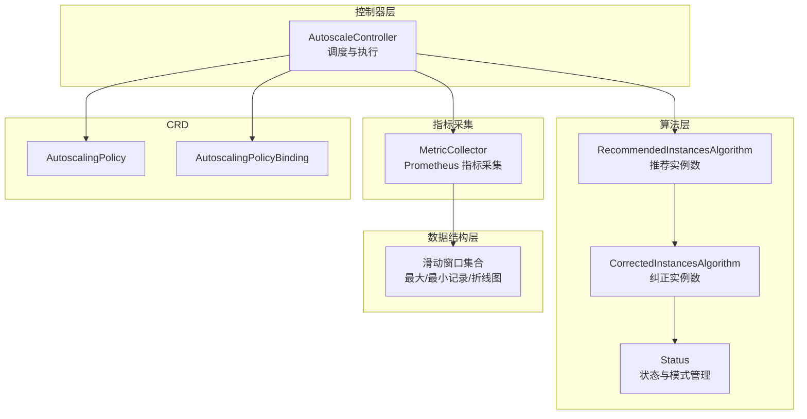
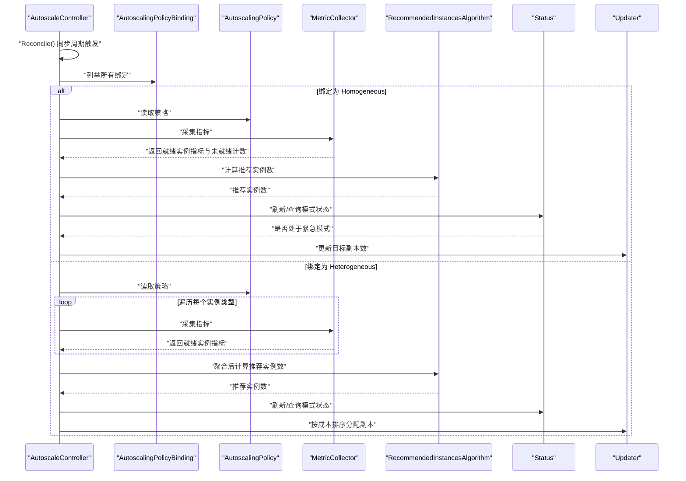
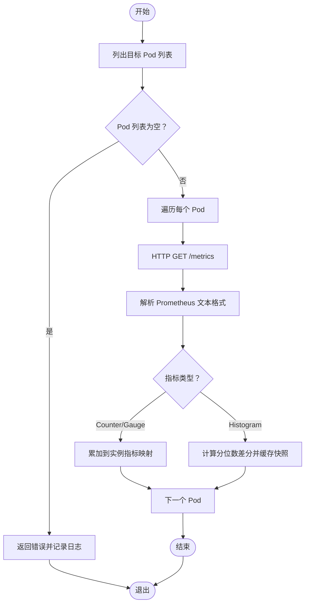
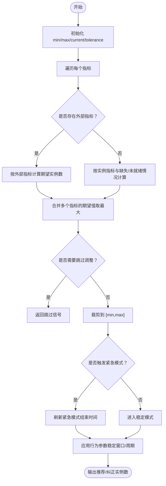
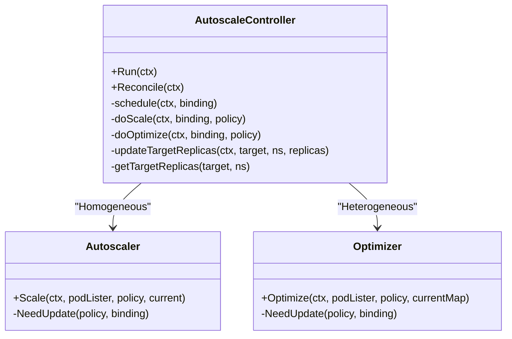
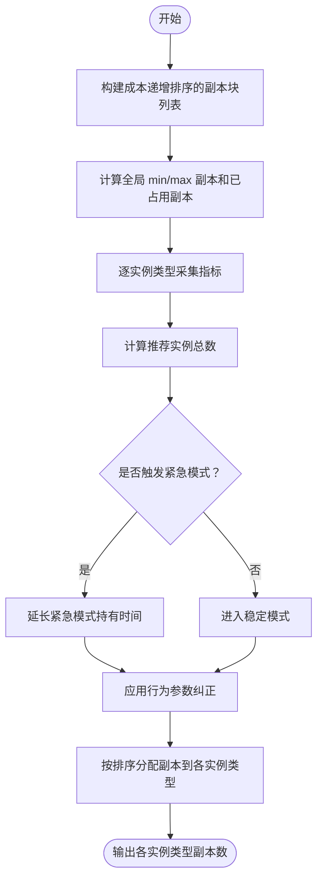
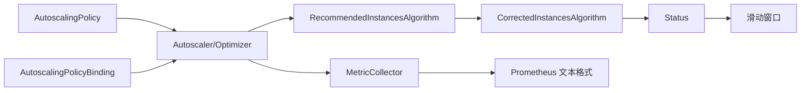

# 成本驱动扩缩容

<cite>
**本文引用的文件**   
- [autoscalingpolicy_types.go](file://pkg/apis/workload/v1alpha1/autoscalingpolicy_types.go)
- [autoscalingpolicybinding_types.go](file://pkg/apis/workload/v1alpha1/autoscalingpolicybinding_types.go)
- [autoscale_controller.go](file://pkg/autoscaler/controller/autoscale_controller.go)
- [scaler.go](file://pkg/autoscaler/autoscaler/scaler.go)
- [optimizer.go](file://pkg/autoscaler/autoscaler/optimizer.go)
- [metric_collector.go](file://pkg/autoscaler/autoscaler/metric_collector.go)
- [recommendation.go](file://pkg/autoscaler/algorithm/recommendation.go)
- [status.go](file://pkg/autoscaler/autoscaler/status.go)
- [settings.go](file://pkg/autoscaler/util/settings.go)
- [sliding_window.go](file://pkg/autoscaler/datastructure/sliding_window.go)
- [autoscaler.md](file://docs/kthena/docs/user-guide/autoscaler.md)
- [workload.serving.volcano.sh.md](file://docs/kthena/docs/reference/crd/workload.serving.volcano.sh.md)
- [scaledobject.yaml](file://examples/keda-autoscaling/scaledobject.yaml)
- [rbac.yaml](file://examples/keda-autoscaling/rbac.yaml)
- [modelserving.yaml](file://examples/keda-autoscaling/modelserving.yaml)
</cite>

## 目录
1. [简介](#简介)
2. [项目结构](#项目结构)
3. [核心组件](#核心组件)
4. [架构总览](#架构总览)
5. [详细组件分析](#详细组件分析)
6. [依赖分析](#依赖分析)
7. [性能考虑](#性能考虑)
8. [故障排查指南](#故障排查指南)
9. [结论](#结论)
10. [附录](#附录)

## 简介
本文件面向希望在 Kthena 中实现“成本驱动扩缩容”的用户与工程师，系统性阐述自动扩缩容控制器的工作原理、成本驱动算法、指标采集机制、扩缩容决策流程，以及与 KEDA 外部扩缩容的集成方案。文档同时提供基于 CRD 的配置方法、监控指标说明、策略评估流程与性能影响分析，帮助您依据业务负载与成本目标优化资源使用。

## 项目结构
Kthena 的扩缩容能力由控制器、算法与数据结构三部分协同实现：
- 控制器层：负责监听绑定关系与策略变更，调度具体扩缩容执行
- 算法层：提供推荐实例数计算与纠正逻辑，支持稳定模式与紧急模式
- 数据结构层：提供滑动窗口等数据结构，支撑历史记录与稳定性判断

图表来源
- [autoscale_controller.go:47-96](file://pkg/autoscaler/controller/autoscale_controller.go#L47-L96)
- [scaler.go:28-53](file://pkg/autoscaler/autoscaler/scaler.go#L28-L53)
- [optimizer.go:29-43](file://pkg/autoscaler/autoscaler/optimizer.go#L29-L43)
- [metric_collector.go:43-62](file://pkg/autoscaler/autoscaler/metric_collector.go#L43-L62)
- [recommendation.go:27-36](file://pkg/autoscaler/algorithm/recommendation.go#L27-L36)
- [status.go:26-30](file://pkg/autoscaler/autoscaler/status.go#L26-L30)
- [sliding_window.go:37-104](file://pkg/autoscaler/datastructure/sliding_window.go#L37-L104)

章节来源
- [autoscale_controller.go:47-120](file://pkg/autoscaler/controller/autoscale_controller.go#L47-L120)
- [scaler.go:28-53](file://pkg/autoscaler/autoscaler/scaler.go#L28-L53)
- [optimizer.go:29-43](file://pkg/autoscaler/autoscaler/optimizer.go#L29-L43)
- [metric_collector.go:43-62](file://pkg/autoscaler/autoscaler/metric_collector.go#L43-L62)
- [recommendation.go:27-36](file://pkg/autoscaler/algorithm/recommendation.go#L27-L36)
- [status.go:26-30](file://pkg/autoscaler/autoscaler/status.go#L26-L30)
- [sliding_window.go:37-104](file://pkg/autoscaler/datastructure/sliding_window.go#L37-L104)

## 核心组件
- AutoscalingPolicy：定义指标、目标值、容忍度与行为（稳定/紧急模式）
- AutoscalingPolicyBinding：将策略绑定到目标资源（单实例或多实例组合），并指定最小/最大副本数
- AutoscaleController：监听绑定与策略变更，按模式选择 Homogeneous（单实例）或 Heterogeneous（多实例成本优化）路径
- MetricCollector：从目标 Pod 的 /metrics 端点拉取 Prometheus 指标，支持直方图分位数差分
- RecommendedInstancesAlgorithm：基于指标与目标值计算推荐实例数，考虑未就绪实例与缺失指标
- CorrectedInstancesAlgorithm + Status：结合历史记录与行为参数（稳定窗口、周期、紧急阈值）输出最终实例数
- 滑动窗口：用于维持历史推荐/纠正记录，支撑稳定模式与紧急模式的判定

章节来源
- [autoscalingpolicy_types.go:24-40](file://pkg/apis/workload/v1alpha1/autoscalingpolicy_types.go#L24-L40)
- [autoscalingpolicybinding_types.go:24-39](file://pkg/apis/workload/v1alpha1/autoscalingpolicybinding_types.go#L24-L39)
- [autoscale_controller.go:251-348](file://pkg/autoscaler/controller/autoscale_controller.go#L251-L348)
- [metric_collector.go:98-129](file://pkg/autoscaler/autoscaler/metric_collector.go#L98-L129)
- [recommendation.go:38-75](file://pkg/autoscaler/algorithm/recommendation.go#L38-L75)
- [status.go:32-64](file://pkg/autoscaler/autoscaler/status.go#L32-L64)
- [sliding_window.go:37-104](file://pkg/autoscaler/datastructure/sliding_window.go#L37-L104)

## 架构总览
扩缩容控制器以 15 秒为同步周期运行，遍历所有绑定关系，分别进入 Homogeneous 或 Heterogeneous 路径：
- Homogeneous：针对单一 ModelServing 实例或其 Role，按指标目标与行为参数计算推荐实例数并更新副本
- Heterogeneous：对多个 ModelServing 实例进行成本优化组合，在满足最小/最大副本约束的前提下，优先选择成本更低的实例组合

图表来源
- [autoscale_controller.go:124-171](file://pkg/autoscaler/controller/autoscale_controller.go#L124-L171)
- [scaler.go:67-107](file://pkg/autoscaler/autoscaler/scaler.go#L67-L107)
- [optimizer.go:151-208](file://pkg/autoscaler/autoscaler/optimizer.go#L151-L208)
- [metric_collector.go:98-129](file://pkg/autoscaler/autoscaler/metric_collector.go#L98-L129)
- [status.go:77-87](file://pkg/autoscaler/autoscaler/status.go#L77-L87)

## 详细组件分析

### 组件一：指标采集与处理（MetricCollector）
- 通过目标的 MetricEndpoint（默认端口 8100，默认路径 /metrics）访问 Pod 指标
- 支持 Counter/Gauge/Histogram 类型；对直方图采用“当前快照与上一快照的分位数差分”以消除累积偏差
- 对每个 Pod 记录就绪/失败/重启状态，若存在失败或不就绪实例则跳过本次推荐
- 将采集结果写入滑动窗口，供后续算法与状态模块使用

图表来源
- [metric_collector.go:131-183](file://pkg/autoscaler/autoscaler/metric_collector.go#L131-L183)
- [metric_collector.go:185-241](file://pkg/autoscaler/autoscaler/metric_collector.go#L185-L241)

章节来源
- [metric_collector.go:98-129](file://pkg/autoscaler/autoscaler/metric_collector.go#L98-L129)
- [metric_collector.go:131-183](file://pkg/autoscaler/autoscaler/metric_collector.go#L131-L183)
- [metric_collector.go:185-241](file://pkg/autoscaler/autoscaler/metric_collector.go#L185-L241)

### 组件二：推荐与纠正算法（RecommendedInstancesAlgorithm + CorrectedInstancesAlgorithm）
- 推荐阶段：对每个指标计算期望实例数，综合多个指标取最大值；若比率接近 1±容忍度则保持不变
- 纠正阶段：结合历史记录与行为参数（稳定窗口、周期、紧急阈值），决定最终实例数
- 紧急模式：当推荐实例数达到策略设定的紧急阈值百分比时，进入紧急模式并延长持有时间

图表来源
- [recommendation.go:38-75](file://pkg/autoscaler/algorithm/recommendation.go#L38-L75)
- [recommendation.go:100-150](file://pkg/autoscaler/algorithm/recommendation.go#L100-L150)
- [status.go:77-87](file://pkg/autoscaler/autoscaler/status.go#L77-L87)

章节来源
- [recommendation.go:38-75](file://pkg/autoscaler/algorithm/recommendation.go#L38-L75)
- [recommendation.go:100-150](file://pkg/autoscaler/algorithm/recommendation.go#L100-L150)
- [status.go:77-87](file://pkg/autoscaler/autoscaler/status.go#L77-L87)

### 组件三：控制器调度（AutoscaleController）
- 监听策略与绑定变更，维护 Homogeneous 与 Heterogeneous 的执行器映射
- 每个绑定对应一个执行器；当策略或绑定发生变更时重建执行器
- 执行器根据当前副本数与推荐实例数，调用 Patch/JSON Patch 更新目标副本

图表来源
- [autoscale_controller.go:47-96](file://pkg/autoscaler/controller/autoscale_controller.go#L47-L96)
- [autoscale_controller.go:251-348](file://pkg/autoscaler/controller/autoscale_controller.go#L251-L348)
- [scaler.go:28-53](file://pkg/autoscaler/autoscaler/scaler.go#L28-L53)
- [optimizer.go:29-43](file://pkg/autoscaler/autoscaler/optimizer.go#L29-L43)

章节来源
- [autoscale_controller.go:98-171](file://pkg/autoscaler/controller/autoscale_controller.go#L98-L171)
- [autoscale_controller.go:251-348](file://pkg/autoscaler/controller/autoscale_controller.go#L251-L348)
- [scaler.go:28-53](file://pkg/autoscaler/autoscaler/scaler.go#L28-L53)
- [optimizer.go:29-43](file://pkg/autoscaler/autoscaler/optimizer.go#L29-L43)

### 组件四：成本驱动优化（HeterogeneousTarget）
- 通过多个实例类型的 params 定义最小/最大副本与相对成本
- 基于“成本扩展率百分比”限制可接受的成本增长范围，按成本从小到大排序逐步分配副本
- 在满足全局 min/max 与各实例类型 min/max 的前提下，优先满足性能目标

图表来源
- [optimizer.go:70-124](file://pkg/autoscaler/autoscaler/optimizer.go#L70-L124)
- [optimizer.go:151-208](file://pkg/autoscaler/autoscaler/optimizer.go#L151-L208)

章节来源
- [optimizer.go:70-124](file://pkg/autoscaler/autoscaler/optimizer.go#L70-L124)
- [optimizer.go:151-208](file://pkg/autoscaler/autoscaler/optimizer.go#L151-L208)

## 依赖分析
- 控制器依赖策略与绑定 CRD，动态生成执行器并复用
- 执行器依赖 MetricCollector 进行指标采集，依赖算法模块进行推荐与纠正
- 状态模块依赖滑动窗口记录历史，支撑稳定/紧急模式判断
- 指标采集依赖 Prometheus 文本格式解析与直方图分位数差分

图表来源
- [autoscale_controller.go:251-348](file://pkg/autoscaler/controller/autoscale_controller.go#L251-L348)
- [scaler.go:67-107](file://pkg/autoscaler/autoscaler/scaler.go#L67-L107)
- [optimizer.go:151-208](file://pkg/autoscaler/autoscaler/optimizer.go#L151-L208)
- [metric_collector.go:185-241](file://pkg/autoscaler/autoscaler/metric_collector.go#L185-L241)
- [status.go:56-63](file://pkg/autoscaler/autoscaler/status.go#L56-L63)
- [sliding_window.go:37-104](file://pkg/autoscaler/datastructure/sliding_window.go#L37-L104)

章节来源
- [autoscale_controller.go:251-348](file://pkg/autoscaler/controller/autoscale_controller.go#L251-L348)
- [scaler.go:67-107](file://pkg/autoscaler/autoscaler/scaler.go#L67-L107)
- [optimizer.go:151-208](file://pkg/autoscaler/autoscaler/optimizer.go#L151-L208)
- [metric_collector.go:185-241](file://pkg/autoscaler/autoscaler/metric_collector.go#L185-L241)
- [status.go:56-63](file://pkg/autoscaler/autoscaler/status.go#L56-L63)
- [sliding_window.go:37-104](file://pkg/autoscaler/datastructure/sliding_window.go#L37-L104)

## 性能考虑
- 同步周期：默认 15 秒，兼顾响应速度与控制面开销
- 指标采集超时：默认 3 秒，避免阻塞整体循环
- 滑动窗口：稳定/紧急模式的历史记录窗口与周期可调，直接影响决策稳定性
- 直方图分位数差分：减少累积指标带来的漂移，提高推荐准确性
- 紧急模式持有时间：防止抖动，但会延迟恢复正常状态

章节来源
- [settings.go:19-25](file://pkg/autoscaler/util/settings.go#L19-L25)
- [status.go:32-64](file://pkg/autoscaler/autoscaler/status.go#L32-L64)
- [metric_collector.go:214-230](file://pkg/autoscaler/autoscaler/metric_collector.go#L214-L230)

## 故障排查指南
- 策略与绑定未生效
  - 检查绑定是否正确引用策略与目标资源
  - 确认策略中 metrics 与 targetValue 设置合理
- 指标未采集
  - 确认 Pod 指标端点可达且返回 200
  - 检查 MetricEndpoint 的 uri/port 与标签选择器
- 副本未变化
  - 查看容忍度是否过大导致不触发
  - 检查 minReplicas/maxReplicas 是否限制了调整空间
- 抖动频繁
  - 降低 tolerancePercent 或增加稳定窗口
  - 提高 scaleDown.stabilizationWindow
- 紧急模式频繁触发
  - 调整 panicThresholdPercent 与 panicModeHold
  - 分析流量特征，必要时引入预热或限流

章节来源
- [autoscaler.md:307-318](file://docs/kthena/docs/user-guide/autoscaler.md#L307-L318)
- [autoscaler.md:254-318](file://docs/kthena/docs/user-guide/autoscaler.md#L254-L318)
- [metric_collector.go:155-167](file://pkg/autoscaler/autoscaler/metric_collector.go#L155-L167)

## 结论
Kthena 的成本驱动扩缩容通过“策略 + 绑定 + 控制器 + 算法 + 指标采集”的完整链路，实现了对单实例与多实例组合的精细化控制。Homogeneous 模式适合传统指标驱动场景，Heterogeneous 模式则在满足成本上限的前提下，自动选择性价比更高的实例组合。配合 KEDA 外部扩缩容，可在复杂场景中实现更灵活的弹性策略。

## 附录

### 配置方法与示例

- AutoscalingPolicy（策略）
  - 指标：metricName 与 targetValue
  - 容忍度：tolerancePercent
  - 行为：scaleUp（稳定/紧急）、scaleDown（稳定/周期）
- AutoscalingPolicyBinding（绑定）
  - 单实例：homogeneousTarget.target + minReplicas/maxReplicas
  - 多实例成本优化：heterogeneousTarget.params + costExpansionRatePercent
- KEDA 集成（可选）
  - 使用 ScaledObject 针对 ModelServing 资源进行外部扩缩容
  - RBAC 权限需允许对 modelservings 及其 scale 子资源进行 get/update/patch

章节来源
- [autoscaler.md:120-253](file://docs/kthena/docs/user-guide/autoscaler.md#L120-L253)
- [workload.serving.volcano.sh.md:22-241](file://docs/kthena/docs/reference/crd/workload.serving.volcano.sh.md#L22-L241)
- [scaledobject.yaml:1-25](file://examples/keda-autoscaling/scaledobject.yaml#L1-L25)
- [rbac.yaml:1-35](file://examples/keda-autoscaling/rbac.yaml#L1-L35)
- [modelserving.yaml:1-45](file://examples/keda-autoscaling/modelserving.yaml#L1-L45)

### 监控指标与验证
- 关键指标
  - 当前指标值 vs 目标值
  - 副本数趋势
  - 紧急模式激活频率
- 验证步骤
  - 检查 CRD 状态
  - 观察副本数变化
  - 查看控制器日志中的指标采集与推荐结果

章节来源
- [autoscaler.md:254-318](file://docs/kthena/docs/user-guide/autoscaler.md#L254-L318)