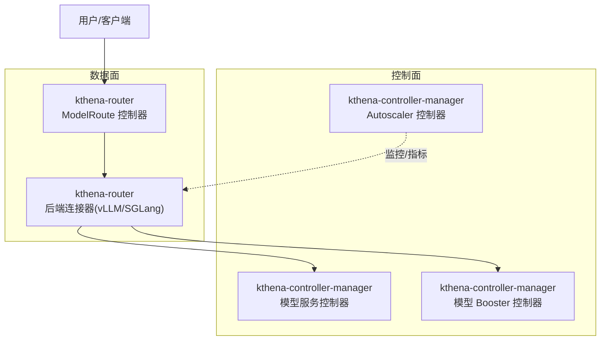
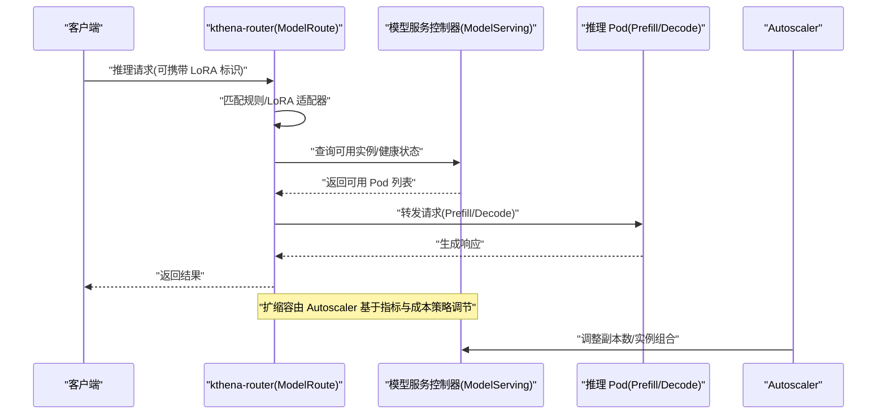
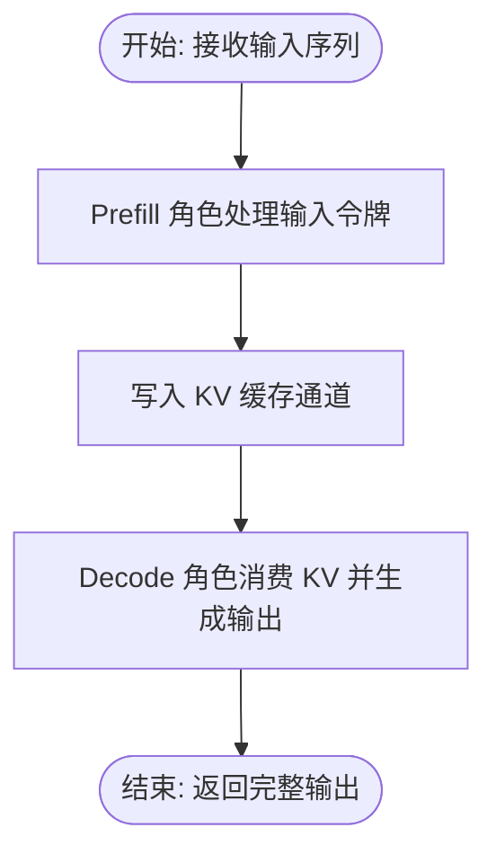
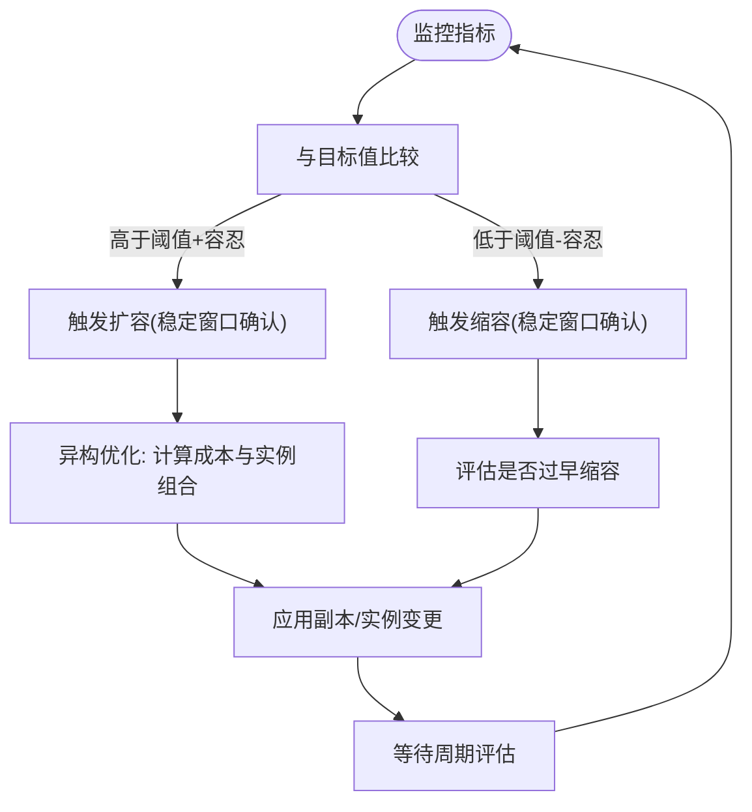
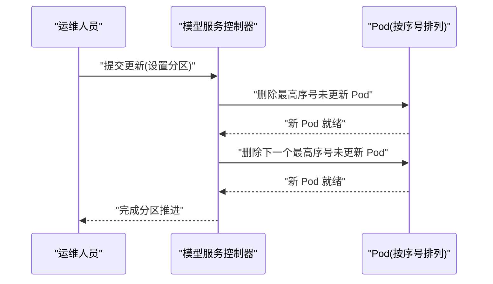
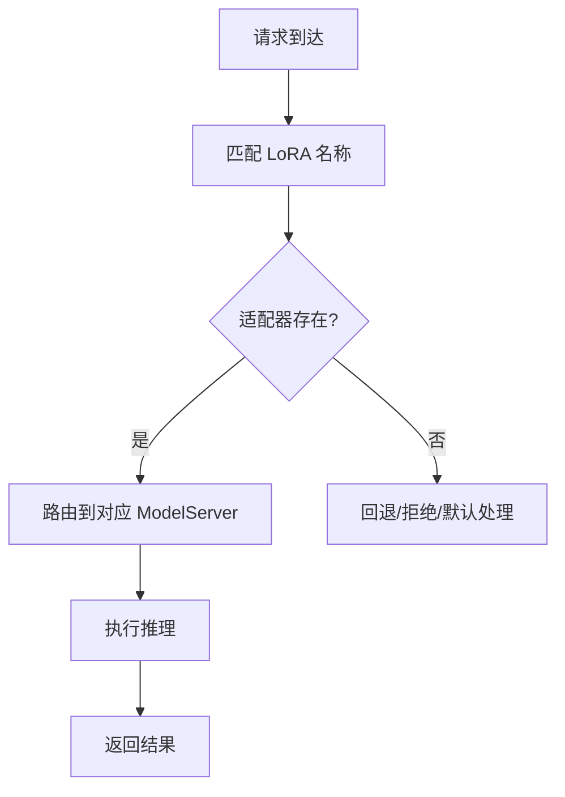
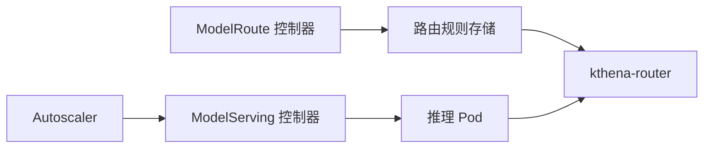

# 简化的 LLM 管理

<cite>
**本文引用的文件**
- [README.md](file://README.md)
- [autoscaler.md](file://docs/kthena/docs/user-guide/autoscaler.md)
- [model-serving-rolling-update.md](file://docs/kthena/docs/developer-guide/model-serving-rolling-update.md)
- [prefill-decode-disaggregation.mdx](file://docs/kthena/docs/user-guide/prefill-decode-disaggregation/prefill-decode-disaggregation.mdx)
- [prefill-decode-disaggregation.yaml](file://examples/model-serving/prefill-decode-disaggregation.yaml)
- [ModelRouteLora.yaml](file://examples/kthena-router/ModelRouteLora.yaml)
- [model_serving_controller.go](file://pkg/model-serving-controller/controller/model_serving_controller.go)
- [modelroute_controller.go](file://pkg/kthena-router/controller/modelroute_controller.go)
</cite>

## 目录
1. [简介](#简介)
2. [项目结构](#项目结构)
3. [核心组件](#核心组件)
4. [架构总览](#架构总览)
5. [详细组件分析](#详细组件分析)
6. [依赖关系分析](#依赖关系分析)
7. [性能考量](#性能考量)
8. [故障排查指南](#故障排查指南)
9. [结论](#结论)
10. [附录](#附录)

## 简介
本文件围绕 Kthena 的“简化 LLM 管理”目标，系统性梳理四大核心能力：预取-解码分离、成本驱动扩缩容、零停机更新、动态 LoRA 管理。通过对控制面（控制器）与数据面（路由）的关键实现进行剖析，并结合官方文档与示例清单，帮助读者快速理解其技术原理、业务价值与落地实践。

## 项目结构
Kthena 采用“控制面 + 数据面”的分层架构：
- 控制面：kthena-controller-manager，负责模型生命周期、扩缩容策略、滚动更新等编排
- 数据面：kthena-router，负责请求路由、LoRA 路由、预取-解码分流等流量调度

图示来源
- [README.md:57-62](file://README.md#L57-L62)
- [modelroute_controller.go:36-44](file://pkg/kthena-router/controller/modelroute_controller.go#L36-L44)

章节来源
- [README.md:53-62](file://README.md#L53-L62)

## 核心组件
- 预取-解码分离：通过 ModelServing 的角色化部署，将 prefill 与 decode 分离到不同 Pod 组，配合 KV 缓存通道实现高效推理
- 成本驱动扩缩容：基于多指标与成本参数的异构实例组合优化，支持预算约束下的弹性伸缩
- 零停机更新：以分区化滚动升级策略，按序替换副本，确保服务连续性
- 动态 LoRA 管理：在 ModelRoute 中声明 LoRA 列表，路由层根据请求特征进行热切换

章节来源
- [README.md:30-51](file://README.md#L30-L51)
- [autoscaler.md:1-331](file://docs/kthena/docs/user-guide/autoscaler.md#L1-L331)
- [model-serving-rolling-update.md:1-35](file://docs/kthena/docs/developer-guide/model-serving-rolling-update.md#L1-L35)
- [prefill-decode-disaggregation.mdx:1-31](file://docs/kthena/docs/user-guide/prefill-decode-disaggregation/prefill-decode-disaggregation.mdx#L1-L31)

## 架构总览
下图展示了从请求进入路由、到模型服务控制器与路由器协同工作的整体流程。

图示来源
- [modelroute_controller.go:130-151](file://pkg/kthena-router/controller/modelroute_controller.go#L130-L151)
- [model_serving_controller.go:531-572](file://pkg/model-serving-controller/controller/model_serving_controller.go#L531-L572)
- [autoscaler.md:120-252](file://docs/kthena/docs/user-guide/autoscaler.md#L120-L252)

## 详细组件分析

### 预取-解码分离
- 技术原理
  - 通过 ModelServing 的角色（Role）将 prefill 与 decode 角色拆分，分别管理副本与模板
  - 使用 KV 缓存通道在角色间传递中间状态，降低重复计算
  - 支持多节点/多副本的 PD Group 模式，提升吞吐与延迟表现
- 业务价值
  - 提升硬件利用率，尤其在专用加速器上
  - 更好地满足低延迟 SLO 与高并发场景
- 使用场景
  - 大模型在线推理、长上下文对话、多模态生成
- 配置要点（示例参考）
  - 在 ModelServing 中定义 prefill 与 decode 两个角色，分别配置容器镜像、资源、探针与卷挂载
  - 示例清单展示了 vLLM 引擎与 Ascend 设备的 KV 传输配置
- 参考示例
  - [prefill-decode-disaggregation.yaml:1-256](file://examples/model-serving/prefill-decode-disaggregation.yaml#L1-L256)

图示来源
- [prefill-decode-disaggregation.mdx:16-28](file://docs/kthena/docs/user-guide/prefill-decode-disaggregation/prefill-decode-disaggregation.mdx#L16-L28)
- [prefill-decode-disaggregation.yaml:12-256](file://examples/model-serving/prefill-decode-disaggregation.yaml#L12-L256)

章节来源
- [prefill-decode-disaggregation.mdx:1-31](file://docs/kthena/docs/user-guide/prefill-decode-disaggregation/prefill-decode-disaggregation.mdx#L1-L31)
- [prefill-decode-disaggregation.yaml:1-256](file://examples/model-serving/prefill-decode-disaggregation.yaml#L1-L256)

### 成本驱动扩缩容
- 技术原理
  - 支持同构与异构两种目标模式：同构针对单一实例类型；异构通过成本参数与预算上限，自动选择最优实例组合
  - 通过策略参数（目标值、容忍度、稳定窗口、恐慌阈值等）平衡性能与成本
- 业务价值
  - 在满足 SLA 的前提下，最大化成本优化与资源利用率
- 使用场景
  - 混合机型集群、多云/本地混合部署、突发流量应对
- 配置要点（示例参考）
  - 定义 AutoscalingPolicy 与 AutoscalingPolicyBinding
  - 同构模式：绑定到 ModelServing 或其子角色
  - 异构模式：配置多个实例类型及其成本权重与边界
- 参考示例
  - [autoscaler.md:120-252](file://docs/kthena/docs/user-guide/autoscaler.md#L120-L252)

图示来源
- [autoscaler.md:19-46](file://docs/kthena/docs/user-guide/autoscaler.md#L19-L46)
- [autoscaler.md:202-252](file://docs/kthena/docs/user-guide/autoscaler.md#L202-L252)

章节来源
- [autoscaler.md:1-331](file://docs/kthena/docs/user-guide/autoscaler.md#L1-L331)

### 零停机更新
- 技术原理
  - 基于分区（Partition）的滚动升级策略，优先更新高序号副本，待新副本就绪后再更新下一个
  - 控制器在每次更新前校验新副本健康状态，失败则回退或重试
- 业务价值
  - 保障在线服务的连续性，降低维护窗口内的风险
- 使用场景
  - 生产环境模型版本迭代、运行时配置变更
- 操作指南
  - 在 ModelServing 的 rolloutStrategy 中设置类型与分区值
  - 逐步推进分区，观察新副本健康状态与流量切换
- 参考示例
  - [model-serving-rolling-update.md:9-35](file://docs/kthena/docs/developer-guide/model-serving-rolling-update.md#L9-L35)
  - [model_serving_controller.go:559-561](file://pkg/model-serving-controller/controller/model_serving_controller.go#L559-L561)

图示来源
- [model-serving-rolling-update.md:19-35](file://docs/kthena/docs/developer-guide/model-serving-rolling-update.md#L19-L35)
- [model_serving_controller.go:675-794](file://pkg/model-serving-controller/controller/model_serving_controller.go#L675-L794)

章节来源
- [model-serving-rolling-update.md:1-35](file://docs/kthena/docs/developer-guide/model-serving-rolling-update.md#L1-L35)
- [model_serving_controller.go:531-794](file://pkg/model-serving-controller/controller/model_serving_controller.go#L531-L794)

### 动态 LoRA 管理
- 技术原理
  - 在 ModelRoute 中声明可用的 LoRA 适配器列表，路由层根据请求特征（如头部/路径匹配）选择对应适配器
  - 支持在不中断服务的情况下切换不同 LoRA 配置
- 业务价值
  - 快速切换不同领域/风格的 LoRA，无需重建后端实例
- 使用场景
  - 多租户/多任务场景、A/B 实验、个性化定制
- 配置要点（示例参考）
  - 在 ModelRoute 的 loraAdapters 字段中列出可用适配器名称
  - 在 rules 中将请求路由到对应的 ModelServer
- 参考示例
  - [ModelRouteLora.yaml:1-14](file://examples/kthena-router/ModelRouteLora.yaml#L1-L14)

图示来源
- [ModelRouteLora.yaml:7-13](file://examples/kthena-router/ModelRouteLora.yaml#L7-L13)
- [modelroute_controller.go:130-151](file://pkg/kthena-router/controller/modelroute_controller.go#L130-L151)

章节来源
- [ModelRouteLora.yaml:1-14](file://examples/kthena-router/ModelRouteLora.yaml#L1-L14)
- [modelroute_controller.go:1-161](file://pkg/kthena-router/controller/modelroute_controller.go#L1-L161)

## 依赖关系分析
- 控制面与数据面的耦合点
  - ModelRoute 控制器负责将路由规则写入内存存储，供 kthena-router 使用
  - 模型服务控制器负责根据策略创建/更新 Pod 与服务，支撑扩缩容与滚动更新
- 关键依赖链
  - ModelRoute → 内存存储 → kthena-router
  - ModelServing → Pod/Service → Autoscaler
  - Autoscaler → 指标采集 → 扩缩容决策

图示来源
- [modelroute_controller.go:130-151](file://pkg/kthena-router/controller/modelroute_controller.go#L130-L151)
- [model_serving_controller.go:531-572](file://pkg/model-serving-controller/controller/model_serving_controller.go#L531-L572)
- [autoscaler.md:120-252](file://docs/kthena/docs/user-guide/autoscaler.md#L120-L252)

章节来源
- [modelroute_controller.go:1-161](file://pkg/kthena-router/controller/modelroute_controller.go#L1-L161)
- [model_serving_controller.go:1-800](file://pkg/model-serving-controller/controller/model_serving_controller.go#L1-L800)

## 性能考量
- 预取-解码分离
  - 合理划分角色副本数量，避免 KV 缓存成为瓶颈
  - 依据模型规模与设备带宽调优 KV 传输参数
- 成本驱动扩缩容
  - 为不同实例类型设定合理的成本权重与上限，避免过度偏离预算
  - 结合稳定窗口与容忍度，减少抖动与频繁切换
- 零停机更新
  - 设置合适的分区步长与重启宽限期，确保平滑过渡
- 动态 LoRA 管理
  - 对不同 LoRA 的资源占用进行评估，避免热点适配器导致的拥塞

## 故障排查指南
- 预取-解码分离
  - 检查角色模板与资源限制是否匹配，关注 Pod 就绪探针与健康检查
  - 关注 KV 传输日志与网络拓扑，定位跨节点通信问题
- 成本驱动扩缩容
  - 确认指标端点可达与指标名称正确
  - 核对最小/最大副本与成本参数，避免策略被误触发
- 零停机更新
  - 观察控制器日志中的分区推进与副本重建过程
  - 如遇失败，检查新模板与依赖资源（镜像/密钥/卷）是否可用
- 动态 LoRA 管理
  - 确认 ModelRoute 中声明的 LoRA 名称与后端一致
  - 核对路由规则与目标 ModelServer 的一致性

章节来源
- [autoscaler.md:254-318](file://docs/kthena/docs/user-guide/autoscaler.md#L254-L318)
- [model-serving-rolling-update.md:304-316](file://docs/kthena/docs/developer-guide/model-serving-rolling-update.md#L304-L316)

## 结论
Kthena 通过“预取-解码分离、成本驱动扩缩容、零停机更新、动态 LoRA 管理”四大能力，将复杂的 LLM 推理运维转化为可声明、可编排、可观测的云原生流程。结合官方文档与示例清单，可在保证稳定性的同时显著提升资源利用率与交付效率。

## 附录
- 快速参考
  - 预取-解码分离：参考示例清单与用户指南
  - 成本驱动扩缩容：参考策略与绑定示例
  - 零停机更新：参考滚动更新文档与控制器实现
  - 动态 LoRA 管理：参考 ModelRoute LoRA 示例

章节来源
- [prefill-decode-disaggregation.mdx:16-28](file://docs/kthena/docs/user-guide/prefill-decode-disaggregation/prefill-decode-disaggregation.mdx#L16-L28)
- [prefill-decode-disaggregation.yaml:1-256](file://examples/model-serving/prefill-decode-disaggregation.yaml#L1-L256)
- [autoscaler.md:120-252](file://docs/kthena/docs/user-guide/autoscaler.md#L120-L252)
- [model-serving-rolling-update.md:9-35](file://docs/kthena/docs/developer-guide/model-serving-rolling-update.md#L9-L35)
- [ModelRouteLora.yaml:7-13](file://examples/kthena-router/ModelRouteLora.yaml#L7-L13)