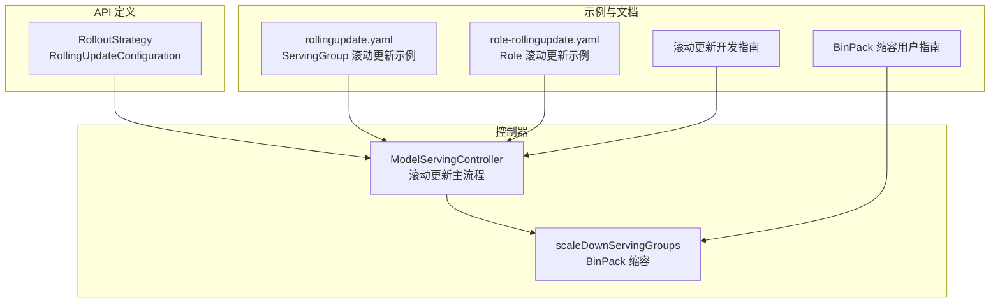
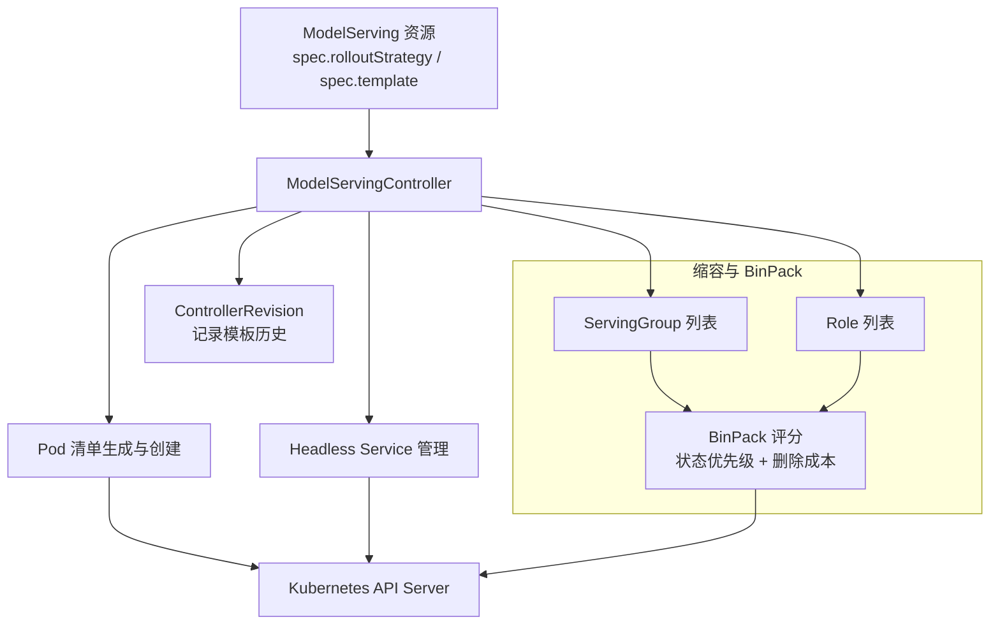
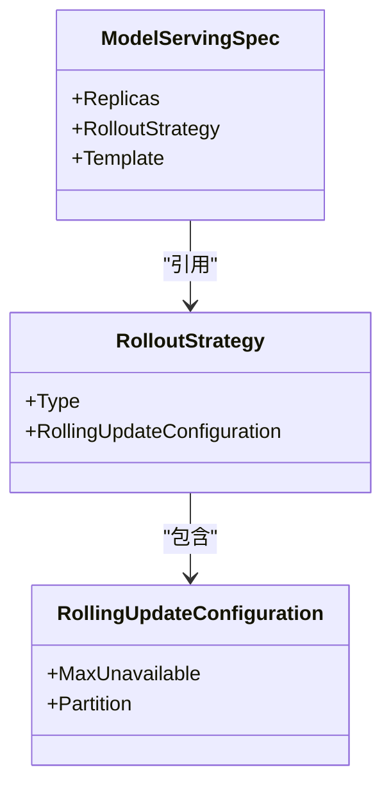
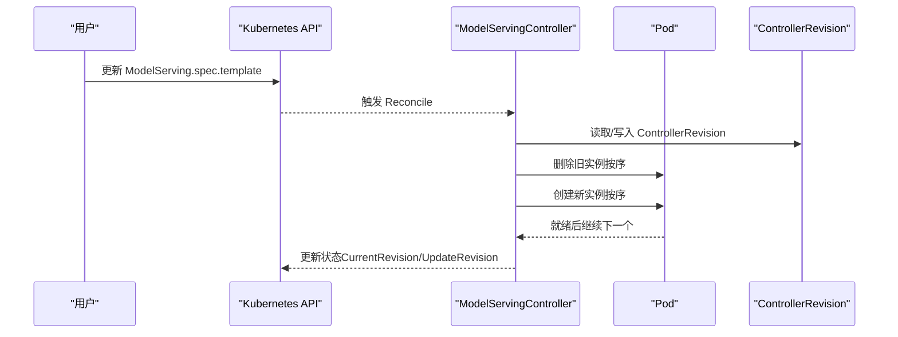
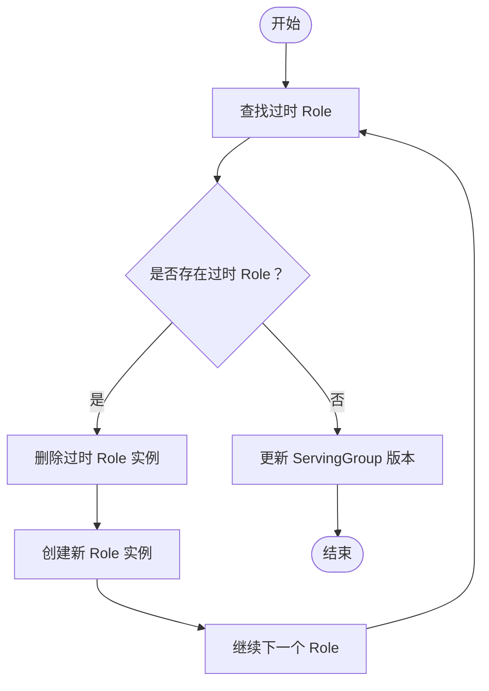
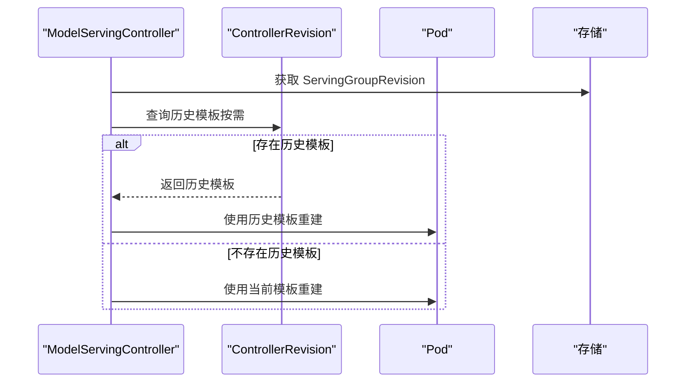
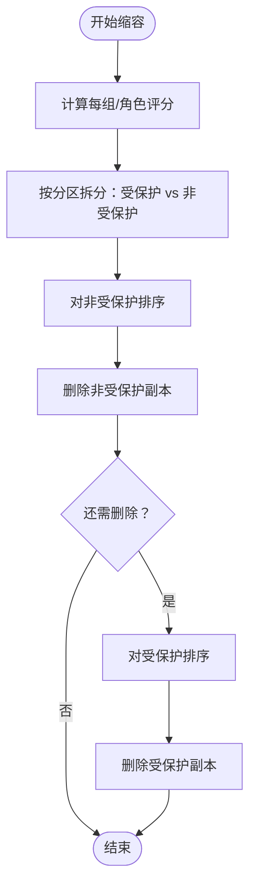
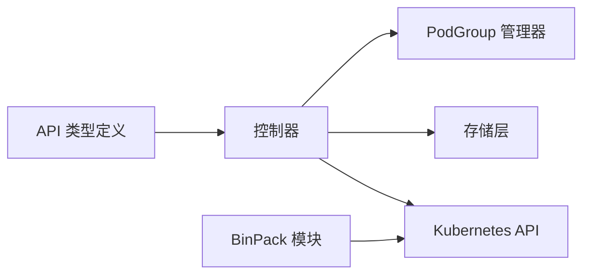

# 零停机更新

<cite>
**本文引用的文件**
- [pkg/apis/workload/v1alpha1/model_serving_types.go](file://pkg/apis/workload/v1alpha1/model_serving_types.go)
- [pkg/model-serving-controller/controller/model_serving_controller.go](file://pkg/model-serving-controller/controller/model_serving_controller.go)
- [pkg/model-serving-controller/controller/binpack_scaledown.go](file://pkg/model-serving-controller/controller/binpack_scaledown.go)
- [examples/model-serving/rollingupdate.yaml](file://examples/model-serving/rollingupdate.yaml)
- [examples/model-serving/role-rollingupdate.yaml](file://examples/model-serving/role-rollingupdate.yaml)
- [docs/kthena/docs/developer-guide/model-serving-rolling-update.md](file://docs/kthena/docs/developer-guide/model-serving-rolling-update.md)
- [docs/kthena/docs/user-guide/binpack-scale-down.md](file://docs/kthena/docs/user-guide/binpack-scale-down.md)
- [pkg/model-serving-controller/controller/model_serving_controller_test.go](file://pkg/model-serving-controller/controller/model_serving_controller_test.go)
</cite>

## 目录
1. [简介](#简介)
2. [项目结构](#项目结构)
3. [核心组件](#核心组件)
4. [架构总览](#架构总览)
5. [详细组件分析](#详细组件分析)
6. [依赖分析](#依赖分析)
7. [性能考虑](#性能考虑)
8. [故障排查指南](#故障排查指南)
9. [结论](#结论)
10. [附录](#附录)

## 简介
本篇文档围绕 Kthena 的“零停机更新”能力，系统阐述模型服务的滚动更新机制与实现细节，覆盖以下主题：
- 滚动更新策略：ServingGroup 与 Role 两个层级的滚动更新模式
- 版本控制与回滚：基于 ControllerRevision 的历史模板恢复与分区保护
- 并行部署与资源调度：基于 Partition 的分批更新与基于 MaxUnavailable 的并发度控制
- 缩容与 BinPack：缩容时的删除成本排序与资源高效利用
- 更新流程示例：从配置变更到版本切换、健康检查与流量迁移
- 常见问题与排错：更新卡住、回滚失败、缩容异常等

## 项目结构
Kthena 将“零停机更新”的能力集中在模型服务控制器中，核心类型定义位于 API 层，控制器逻辑位于控制器包内，并通过 CRD 与 Kubernetes 资源协同工作。

图示来源
- [pkg/apis/workload/v1alpha1/model_serving_types.go:133-182](file://pkg/apis/workload/v1alpha1/model_serving_types.go#L133-L182)
- [pkg/model-serving-controller/controller/model_serving_controller.go:1906-2016](file://pkg/model-serving-controller/controller/model_serving_controller.go#L1906-L2016)
- [pkg/model-serving-controller/controller/binpack_scaledown.go:107-191](file://pkg/model-serving-controller/controller/binpack_scaledown.go#L107-L191)
- [examples/model-serving/rollingupdate.yaml:1-50](file://examples/model-serving/rollingupdate.yaml#L1-L50)
- [examples/model-serving/role-rollingupdate.yaml:1-48](file://examples/model-serving/role-rollingupdate.yaml#L1-L48)
- [docs/kthena/docs/developer-guide/model-serving-rolling-update.md:1-35](file://docs/kthena/docs/developer-guide/model-serving-rolling-update.md#L1-L35)
- [docs/kthena/docs/user-guide/binpack-scale-down.md:1-66](file://docs/kthena/docs/user-guide/binpack-scale-down.md#L1-L66)

章节来源
- [pkg/apis/workload/v1alpha1/model_serving_types.go:133-182](file://pkg/apis/workload/v1alpha1/model_serving_types.go#L133-L182)
- [pkg/model-serving-controller/controller/model_serving_controller.go:1906-2016](file://pkg/model-serving-controller/controller/model_serving_controller.go#L1906-L2016)
- [pkg/model-serving-controller/controller/binpack_scaledown.go:107-191](file://pkg/model-serving-controller/controller/binpack_scaledown.go#L107-L191)
- [examples/model-serving/rollingupdate.yaml:1-50](file://examples/model-serving/rollingupdate.yaml#L1-L50)
- [examples/model-serving/role-rollingupdate.yaml:1-48](file://examples/model-serving/role-rollingupdate.yaml#L1-L48)
- [docs/kthena/docs/developer-guide/model-serving-rolling-update.md:1-35](file://docs/kthena/docs/developer-guide/model-serving-rolling-update.md#L1-L35)
- [docs/kthena/docs/user-guide/binpack-scale-down.md:1-66](file://docs/kthena/docs/user-guide/binpack-scale-down.md#L1-L66)

## 核心组件
- 滚动更新策略（RolloutStrategy）
  - 类型：支持 ServingGroupRollingUpdate 与 RoleRollingUpdate
  - 默认值：ServingGroupRollingUpdate
- 滚动更新配置（RollingUpdateConfiguration）
  - MaxUnavailable：更新期间允许的最大不可用副本数（绝对数或百分比，向下取整；不可为 0）
  - Partition：分区阈值（绝对数或百分比，向上取整），用于保护前 N 个副本不被更新
- 控制器主流程
  - 解析策略与配置，计算当前/更新版本，按序更新 ServingGroup 或 Role
  - 通过 ControllerRevision 记录历史模板，支持回滚与分区保护下的恢复
- 缩容与 BinPack
  - 基于 Pod deletion-cost 注解与状态优先级进行两层排序，优先删除低优先级、低成本的组或角色

章节来源
- [pkg/apis/workload/v1alpha1/model_serving_types.go:133-182](file://pkg/apis/workload/v1alpha1/model_serving_types.go#L133-L182)
- [pkg/model-serving-controller/controller/model_serving_controller.go:1906-2016](file://pkg/model-serving-controller/controller/model_serving_controller.go#L1906-L2016)
- [pkg/model-serving-controller/controller/binpack_scaledown.go:107-191](file://pkg/model-serving-controller/controller/binpack_scaledown.go#L107-L191)

## 架构总览
下图展示了滚动更新与缩容的关键交互路径，以及与 CRD、控制器与 Kubernetes API 的关系。

图示来源
- [pkg/apis/workload/v1alpha1/model_serving_types.go:133-182](file://pkg/apis/workload/v1alpha1/model_serving_types.go#L133-L182)
- [pkg/model-serving-controller/controller/model_serving_controller.go:2084-2141](file://pkg/model-serving-controller/controller/model_serving_controller.go#L2084-L2141)
- [pkg/model-serving-controller/controller/binpack_scaledown.go:107-191](file://pkg/model-serving-controller/controller/binpack_scaledown.go#L107-L191)

## 详细组件分析

### 滚动更新策略与配置
- 策略类型
  - ServingGroupRollingUpdate：逐个更新 ServingGroup，适合整体一致性要求高的场景
  - RoleRollingUpdate：逐个更新 Role，适合细粒度升级与快速验证
- 配置项
  - MaxUnavailable：限制并发更新的副本数量，避免同时不可用过多导致容量不足
  - Partition：保护前 N 个副本不被更新，常用于灰度发布与风险隔离
- 分区保护与版本控制
  - 当分区存在时，控制器会使用历史 ControllerRevision 中的模板恢复受保护的副本
  - 新增副本始终使用最新模板，保证后续扩容采用新版本

图示来源
- [pkg/apis/workload/v1alpha1/model_serving_types.go:133-182](file://pkg/apis/workload/v1alpha1/model_serving_types.go#L133-L182)

章节来源
- [pkg/apis/workload/v1alpha1/model_serving_types.go:133-182](file://pkg/apis/workload/v1alpha1/model_serving_types.go#L133-L182)
- [pkg/model-serving-controller/controller/model_serving_controller.go:1906-1928](file://pkg/model-serving-controller/controller/model_serving_controller.go#L1906-L1928)

### 滚动更新流程（ServingGroup 层级）
- 主流程
  - 计算目标副本数与当前副本数差异，触发扩容或缩容
  - 对需要更新的 ServingGroup，按序删除旧实例并重建新实例
  - 使用 ControllerRevision 记录历史模板，保障回滚与分区保护
- 关键点
  - 仅当新实例完全就绪后，才继续更新下一个实例
  - 分区阈值决定哪些副本参与更新，未保护副本优先被替换

图示来源
- [pkg/model-serving-controller/controller/model_serving_controller.go:1153-1173](file://pkg/model-serving-controller/controller/model_serving_controller.go#L1153-L1173)
- [pkg/model-serving-controller/controller/model_serving_controller.go:1906-1928](file://pkg/model-serving-controller/controller/model_serving_controller.go#L1906-L1928)
- [pkg/model-serving-controller/controller/model_serving_controller.go:2186-2273](file://pkg/model-serving-controller/controller/model_serving_controller.go#L2186-L2273)

章节来源
- [pkg/model-serving-controller/controller/model_serving_controller.go:1153-1173](file://pkg/model-serving-controller/controller/model_serving_controller.go#L1153-L1173)
- [pkg/model-serving-controller/controller/model_serving_controller.go:1906-1928](file://pkg/model-serving-controller/controller/model_serving_controller.go#L1906-L1928)
- [pkg/model-serving-controller/controller/model_serving_controller.go:2186-2273](file://pkg/model-serving-controller/controller/model_serving_controller.go#L2186-L2273)

### 滚动更新流程（Role 层级）
- 主流程
  - 在每个 ServingGroup 内，识别过时的 Role 并逐个替换
  - 通过角色模板哈希比较判断是否过时，必要时删除并重建
- 适用场景
  - 需要对不同角色（如 prefill/decode）分别升级，降低整体影响面

图示来源
- [pkg/model-serving-controller/controller/model_serving_controller.go:2371-2449](file://pkg/model-serving-controller/controller/model_serving_controller.go#L2371-L2449)

章节来源
- [pkg/model-serving-controller/controller/model_serving_controller.go:2371-2449](file://pkg/model-serving-controller/controller/model_serving_controller.go#L2371-L2449)

### 版本控制与回滚策略
- ControllerRevision
  - 每次模板变更时创建新的 ControllerRevision，保存历史模板
  - 受分区保护的副本在删除时，若历史模板可用则恢复使用
- 回滚条件
  - 当受保护副本因故障被删除，可从对应 ControllerRevision 恢复模板
  - 若 ControllerRevision 不可用，则回退到当前模板（兼容性）

图示来源
- [pkg/model-serving-controller/controller/model_serving_controller.go:2192-2211](file://pkg/model-serving-controller/controller/model_serving_controller.go#L2192-L2211)
- [pkg/model-serving-controller/controller/model_serving_controller.go:2287-2351](file://pkg/model-serving-controller/controller/model_serving_controller.go#L2287-L2351)

章节来源
- [pkg/model-serving-controller/controller/model_serving_controller.go:2192-2211](file://pkg/model-serving-controller/controller/model_serving_controller.go#L2192-L2211)
- [pkg/model-serving-controller/controller/model_serving_controller.go:2287-2351](file://pkg/model-serving-controller/controller/model_serving_controller.go#L2287-L2351)

### 缩容与 BinPack 算法
- 评分维度
  - 一级：状态优先级（非就绪优先删除）
  - 二级：Pod 删除成本之和（越低越先删）
  - 三级：索引（高索引优先，向后兼容）
- 分区保护
  - 当设置分区时，前 N 个副本受保护，不参与删除
  - 仅在需要进一步缩容时，才会考虑受保护副本

图示来源
- [pkg/model-serving-controller/controller/binpack_scaledown.go:107-191](file://pkg/model-serving-controller/controller/binpack_scaledown.go#L107-L191)
- [pkg/model-serving-controller/controller/model_serving_controller.go:1930-2016](file://pkg/model-serving-controller/controller/model_serving_controller.go#L1930-L2016)

章节来源
- [pkg/model-serving-controller/controller/binpack_scaledown.go:107-191](file://pkg/model-serving-controller/controller/binpack_scaledown.go#L107-L191)
- [pkg/model-serving-controller/controller/model_serving_controller.go:1930-2016](file://pkg/model-serving-controller/controller/model_serving_controller.go#L1930-L2016)

### 更新流程示例（含配置、版本切换与健康检查）
- 示例一：ServingGroup 滚动更新
  - 配置要点：type 为 ServingGroupRollingUpdate，maxUnavailable 设置为 2
  - 流程：控制器按序删除最高索引的 ServingGroup，等待新实例就绪后再更新下一个
  - 文档参考：开发者指南中的滚动更新阶段说明
- 示例二：Role 滚动更新
  - 配置要点：type 为 RoleRollingUpdate
  - 流程：在每个 ServingGroup 内，识别过时 Role 并逐个替换
- 示例三：分区灰度
  - 配置要点：设置 Partition，保护前 N 个副本
  - 效果：仅更新索引 ≥ N 的副本，其余保持不变，便于灰度验证

章节来源
- [examples/model-serving/rollingupdate.yaml:1-50](file://examples/model-serving/rollingupdate.yaml#L1-L50)
- [examples/model-serving/role-rollingupdate.yaml:1-48](file://examples/model-serving/role-rollingupdate.yaml#L1-L48)
- [docs/kthena/docs/developer-guide/model-serving-rolling-update.md:1-35](file://docs/kthena/docs/developer-guide/model-serving-rolling-update.md#L1-L35)

### 流量迁移与实例替换
- Headless Service
  - 控制器为每个 Role 维护 Headless Service，确保实例替换后仍可通过稳定 DNS 访问
- 就绪检查
  - 新实例必须达到 Running 且 Ready 才会继续更新下一个实例，避免流量切换造成抖动
- 删除顺序
  - 先删除非受保护副本，再根据需要删除受保护副本，结合 BinPack 选择最优删除对象

章节来源
- [pkg/model-serving-controller/controller/model_serving_controller.go:2018-2072](file://pkg/model-serving-controller/controller/model_serving_controller.go#L2018-L2072)
- [pkg/model-serving-controller/controller/model_serving_controller.go:1335-1389](file://pkg/model-serving-controller/controller/model_serving_controller.go#L1335-L1389)

## 依赖分析
- 组件耦合
  - 控制器依赖 API 层的策略与配置定义
  - 控制器依赖 Kubernetes API 进行 Pod/Service/ControllerRevision 的创建与删除
  - 缩容模块依赖存储层的状态信息与评分计算
- 外部集成
  - Pod deletion-cost 注解用于 BinPack 评分
  - PodGroup 管理器用于 Gang 调度场景下的任务管理

图示来源
- [pkg/apis/workload/v1alpha1/model_serving_types.go:133-182](file://pkg/apis/workload/v1alpha1/model_serving_types.go#L133-L182)
- [pkg/model-serving-controller/controller/model_serving_controller.go:2275-2285](file://pkg/model-serving-controller/controller/model_serving_controller.go#L2275-L2285)
- [pkg/model-serving-controller/controller/binpack_scaledown.go:107-191](file://pkg/model-serving-controller/controller/binpack_scaledown.go#L107-L191)

章节来源
- [pkg/apis/workload/v1alpha1/model_serving_types.go:133-182](file://pkg/apis/workload/v1alpha1/model_serving_types.go#L133-L182)
- [pkg/model-serving-controller/controller/model_serving_controller.go:2275-2285](file://pkg/model-serving-controller/controller/model_serving_controller.go#L2275-L2285)
- [pkg/model-serving-controller/controller/binpack_scaledown.go:107-191](file://pkg/model-serving-controller/controller/binpack_scaledown.go#L107-L191)

## 性能考虑
- 并发度控制
  - MaxUnavailable 限制同时不可用副本数，避免大规模更新导致容量紧张
- 更新节奏
  - 逐个实例更新，确保新实例就绪后再推进，降低失败传播
- 缩容效率
  - BinPack 通过删除成本与状态优先级排序，最大化释放高价值资源，减少不必要的中断

## 故障排查指南
- 滚动更新卡住
  - 检查新实例是否处于 Running/Ready 状态
  - 查看控制器事件与日志，确认是否存在权限或网络问题
  - 适当提高 MaxUnavailable 或缩短重启宽限期
- 分区保护导致缩容失败
  - 确认分区阈值设置是否合理
  - 检查受保护副本是否处于非就绪状态，必要时手动清理
- 回滚失败
  - 确认对应的 ControllerRevision 是否存在
  - 若缺失，控制器会回退到当前模板；建议重新创建 ControllerRevision 后重试
- 缩容异常
  - 检查 Pod deletion-cost 注解是否正确设置
  - 确认状态优先级与索引排序是否符合预期

章节来源
- [pkg/model-serving-controller/controller/model_serving_controller.go:1335-1389](file://pkg/model-serving-controller/controller/model_serving_controller.go#L1335-L1389)
- [pkg/model-serving-controller/controller/model_serving_controller.go:2192-2211](file://pkg/model-serving-controller/controller/model_serving_controller.go#L2192-L2211)
- [pkg/model-serving-controller/controller/binpack_scaledown.go:107-191](file://pkg/model-serving-controller/controller/binpack_scaledown.go#L107-L191)
- [pkg/model-serving-controller/controller/model_serving_controller_test.go:3567-3760](file://pkg/model-serving-controller/controller/model_serving_controller_test.go#L3567-L3760)

## 结论
Kthena 通过“策略 + 配置 + 版本控制 + 缩容算法”的组合，实现了面向生产环境的零停机更新能力：
- 策略灵活：支持 ServingGroup 与 Role 两级滚动更新
- 配置精细：MaxUnavailable 与 Partition 提供强约束与灰度能力
- 版本安全：ControllerRevision 保障回滚与恢复
- 资源高效：BinPack 缩容在保证稳定性的同时最大化资源利用率
- 流程可控：严格的就绪检查与顺序更新，确保服务连续性

## 附录
- 示例清单
  - ServingGroup 滚动更新示例：[rollingupdate.yaml:1-50](file://examples/model-serving/rollingupdate.yaml#L1-L50)
  - Role 滚动更新示例：[role-rollingupdate.yaml:1-48](file://examples/model-serving/role-rollingupdate.yaml#L1-L48)
- 开发者指南
  - 滚动更新流程与阶段说明：[model-serving-rolling-update.md:1-35](file://docs/kthena/docs/developer-guide/model-serving-rolling-update.md#L1-L35)
- 用户指南
  - BinPack 缩容原理与操作步骤：[binpack-scale-down.md:1-66](file://docs/kthena/docs/user-guide/binpack-scale-down.md#L1-L66)