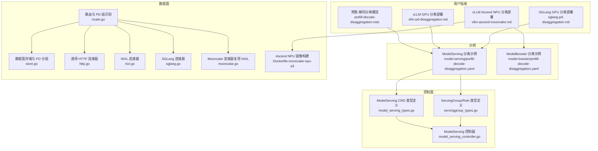
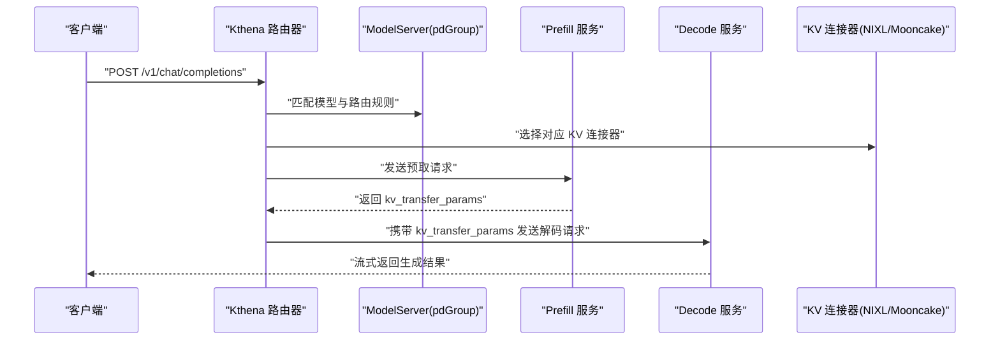
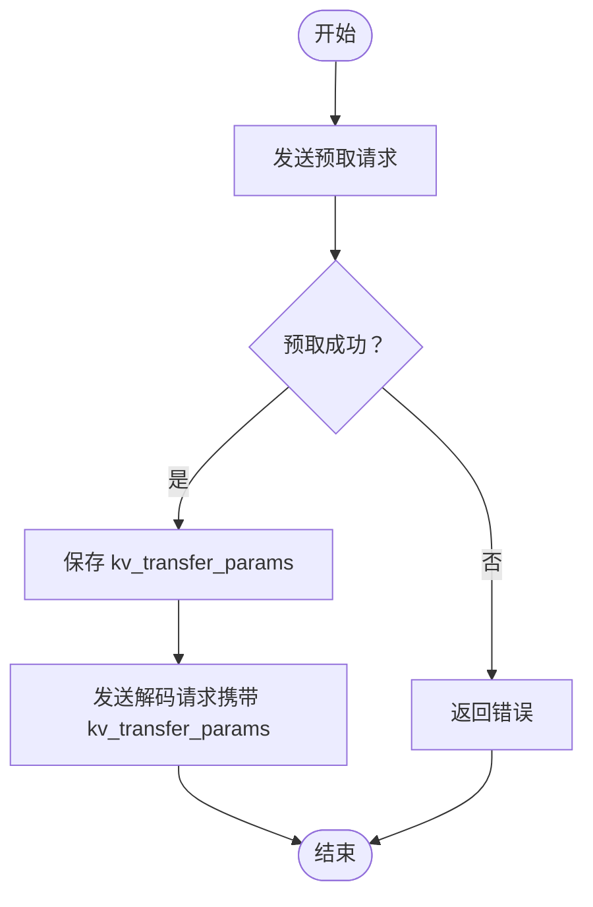
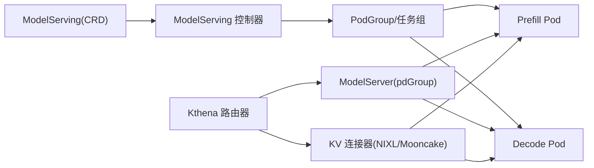

# 预取-解码分离

<cite>
**本文引用的文件**
- [prefill-decode-disaggregation.mdx](file://docs/kthena/docs/user-guide/prefill-decode-disaggregation/prefill-decode-disaggregation.mdx)
- [vllm-pd-disaggregation.md](file://docs/kthena/docs/user-guide/prefill-decode-disaggregation/vllm-pd-disaggregation.md)
- [sglang-pd-disaggregation.md](file://docs/kthena/docs/user-guide/prefill-decode-disaggregation/sglang-pd-disaggregation.md)
- [vllm-ascend-mooncake.md](file://docs/kthena/docs/user-guide/prefill-decode-disaggregation/vllm-ascend-mooncake.md)
- [prefill-decode-disaggregation.yaml（模型服务）](file://examples/model-serving/prefill-decode-disaggregation.yaml)
- [prefill-decode-disaggregation.yaml（模型增强器）](file://examples/model-booster/prefill-decode-disaggregation.yaml)
- [Dockerfile.mooncake-npu-a3](file://docker/Dockerfile.mooncake-npu-a3)
- [model_serving_types.go](file://pkg/apis/workload/v1alpha1/model_serving_types.go)
- [servinggroup_types.go](file://pkg/apis/workload/v1alpha1/servinggroup_types.go)
- [model_serving_controller.go](file://pkg/model-serving-controller/controller/model_serving_controller.go)
- [http.go](file://pkg/kthena-router/connectors/http.go)
- [nixl.go](file://pkg/kthena-router/connectors/nixl.go)
- [sglang.go](file://pkg/kthena-router/connectors/sglang.go)
- [mooncake.go](file://pkg/kthena-router/connectors/mooncake.go)
- [router.go](file://pkg/kthena-router/router/router.go)
- [store.go](file://pkg/kthena-router/datastore/store.go)
</cite>

## 目录
1. [引言](#引言)
2. [项目结构](#项目结构)
3. [核心组件](#核心组件)
4. [架构总览](#架构总览)
5. [详细组件分析](#详细组件分析)
6. [依赖关系分析](#依赖关系分析)
7. [性能考量](#性能考量)
8. [故障排查指南](#故障排查指南)
9. [结论](#结论)
10. [附录](#附录)

## 引言
本篇文档系统阐述 Kthena 的预取-解码分离能力与实现原理，解释为何需要分离、传统方式的局限性以及分离后带来的资源利用效率提升。重点覆盖 Kthena 如何通过 ModelServing CRD 描述并编排预取-解码角色，如何在 vLLM 与 SGLang 两大推理引擎上落地，以及在 Mooncake Ascend NPU 环境下的特殊配置与优化。文末提供可直接参考的 YAML 示例与部署步骤，帮助读者快速落地。

## 项目结构
围绕“预取-解码分离”，本仓库的关键位置如下：
- 用户指南与示例：docs/kthena/docs/user-guide/prefill-decode-disaggregation/*.md
- 示例清单：examples/model-serving/prefill-decode-disaggregation.yaml、examples/model-booster/prefill-decode-disaggregation.yaml
- 控制器与 CRD 定义：pkg/apis/workload/v1alpha1/* 与 pkg/model-serving-controller/controller/model_serving_controller.go
- 路由与连接器：pkg/kthena-router/connectors/* 与 pkg/kthena-router/router/router.go
- NPU 构建与镜像：docker/Dockerfile.mooncake-npu-a3

图表来源
- [prefill-decode-disaggregation.mdx:1-19](file://docs/kthena/docs/user-guide/prefill-decode-disaggregation/prefill-decode-disaggregation.mdx#L1-L19)
- [vllm-pd-disaggregation.md:1-327](file://docs/kthena/docs/user-guide/prefill-decode-disaggregation/vllm-pd-disaggregation.md#L1-L327)
- [sglang-pd-disaggregation.md:1-227](file://docs/kthena/docs/user-guide/prefill-decode-disaggregation/sglang-pd-disaggregation.md#L1-L227)
- [vllm-ascend-mooncake.md:1-144](file://docs/kthena/docs/user-guide/prefill-decode-disaggregation/vllm-ascend-mooncake.md#L1-L144)
- [prefill-decode-disaggregation.yaml（模型服务）:1-256](file://examples/model-serving/prefill-decode-disaggregation.yaml#L1-L256)
- [prefill-decode-disaggregation.yaml（模型增强器）:1-99](file://examples/model-booster/prefill-decode-disaggregation.yaml#L1-L99)
- [model_serving_types.go:35-66](file://pkg/apis/workload/v1alpha1/model_serving_types.go#L35-L66)
- [servinggroup_types.go:54-80](file://pkg/apis/workload/v1alpha1/servinggroup_types.go#L54-L80)
- [model_serving_controller.go:82-102](file://pkg/model-serving-controller/controller/model_serving_controller.go#L82-L102)
- [router.go:771-780](file://pkg/kthena-router/router/router.go#L771-L780)
- [store.go:715-727](file://pkg/kthena-router/datastore/store.go#L715-L727)
- [http.go:85-119](file://pkg/kthena-router/connectors/http.go#L85-L119)
- [nixl.go:53-112](file://pkg/kthena-router/connectors/nixl.go#L53-L112)
- [sglang.go:72-195](file://pkg/kthena-router/connectors/sglang.go#L72-L195)
- [mooncake.go:19-25](file://pkg/kthena-router/connectors/mooncake.go#L19-L25)
- [Dockerfile.mooncake-npu-a3:1-26](file://docker/Dockerfile.mooncake-npu-a3#L1-L26)

章节来源
- [prefill-decode-disaggregation.mdx:1-19](file://docs/kthena/docs/user-guide/prefill-decode-disaggregation/prefill-decode-disaggregation.mdx#L1-L19)
- [vllm-pd-disaggregation.md:1-327](file://docs/kthena/docs/user-guide/prefill-decode-disaggregation/vllm-pd-disaggregation.md#L1-L327)
- [sglang-pd-disaggregation.md:1-227](file://docs/kthena/docs/user-guide/prefill-decode-disaggregation/sglang-pd-disaggregation.md#L1-L227)
- [vllm-ascend-mooncake.md:1-144](file://docs/kthena/docs/user-guide/prefill-decode-disaggregation/vllm-ascend-mooncake.md#L1-L144)

## 核心组件
- ModelServing CRD：用于声明式描述推理工作负载的角色（Role）、副本与模板，支持预取-解码分离的 Pod 分组与调度策略。
- 路由与 PD 分组：根据 ModelServer 中的 pdGroup 配置，识别 prefill/decode Pod 并进行感知式路由。
- 连接器（KV Connector）：封装预取-解码两阶段请求转发与 KV 缓存传递协议，包括 NIXL（GPU）与 Mooncake（Ascend NPU）。
- 控制器：负责将 CRD 声明转换为 Pod、Service、任务组等资源，确保角色一致性与可用性。

章节来源
- [model_serving_types.go:35-66](file://pkg/apis/workload/v1alpha1/model_serving_types.go#L35-L66)
- [servinggroup_types.go:54-80](file://pkg/apis/workload/v1alpha1/servinggroup_types.go#L54-L80)
- [router.go:771-780](file://pkg/kthena-router/router/router.go#L771-L780)
- [store.go:715-727](file://pkg/kthena-router/datastore/store.go#L715-L727)
- [nixl.go:34-51](file://pkg/kthena-router/connectors/nixl.go#L34-L51)
- [sglang.go:42-70](file://pkg/kthena-router/connectors/sglang.go#L42-L70)
- [mooncake.go:19-25](file://pkg/kthena-router/connectors/mooncake.go#L19-L25)

## 架构总览
下图展示了从客户端到预取-解码两阶段处理的整体流程，以及 Mooncake 在 Ascend NPU 上的 KV 传输路径。

图表来源
- [router.go:771-780](file://pkg/kthena-router/router/router.go#L771-L780)
- [http.go:85-119](file://pkg/kthena-router/connectors/http.go#L85-L119)
- [nixl.go:53-112](file://pkg/kthena-router/connectors/nixl.go#L53-L112)
- [sglang.go:72-195](file://pkg/kthena-router/connectors/sglang.go#L72-L195)
- [mooncake.go:19-25](file://pkg/kthena-router/connectors/mooncake.go#L19-L25)

## 详细组件分析

### 1) 为什么需要预取-解码分离？
- 传统方式在同一硬件上同时执行输入 token 处理（预取）与输出 token 生成（解码），导致资源利用不均衡。
- 预取-解码分离将两阶段任务分配至不同计算单元或节点，使预取阶段可充分利用高吞吐资源，解码阶段专注低延迟与 KV 缓存消费，从而提升整体吞吐与时延表现。

章节来源
- [prefill-decode-disaggregation.mdx:10-14](file://docs/kthena/docs/user-guide/prefill-decode-disaggregation/prefill-decode-disaggregation.mdx#L10-L14)

### 2) Kthena 如何通过 ModelServing 支持分离部署
- 角色定义：在 ServingGroup 的 Roles 中定义 prefill 与 decode 两个角色，每个角色拥有独立的 entryTemplate 与资源配额。
- Pod 分组：通过 ModelServer 的 pdGroup.groupKey 与 prefill/decode 标签键，将不同角色的 Pod 归入同一 PD 组，便于感知式路由与调度。
- 资源配置：针对不同硬件（GPU/NPU）设置合适的设备插件、网络接口与内存共享卷，保证两阶段通信与 KV 传输稳定。

章节来源
- [servinggroup_types.go:54-80](file://pkg/apis/workload/v1alpha1/servinggroup_types.go#L54-L80)
- [model_serving_types.go:35-66](file://pkg/apis/workload/v1alpha1/model_serving_types.go#L35-L66)
- [store.go:715-727](file://pkg/kthena-router/datastore/store.go#L715-L727)

### 3) vLLM 部署（GPU）
- 部署顺序：先创建 ModelServing（含 prefill/decode 两角色），再创建 ModelServer（pdGroup 指定分组键与标签），最后创建 ModelRoute 将模型名映射到该 ModelServer。
- 关键点：
  - 使用 NIXL 作为 KV 传输后端，prefill 侧产出 kv_transfer_params，decode 侧消费。
  - 通过环境变量与网络接口（如 GLOO/NCCL）保障多进程与多机通信。
- 参考示例：见用户指南中的 vLLM 分离部署文档与示例清单。

章节来源
- [vllm-pd-disaggregation.md:1-327](file://docs/kthena/docs/user-guide/prefill-decode-disaggregation/vllm-pd-disaggregation.md#L1-L327)
- [nixl.go:34-51](file://pkg/kthena-router/connectors/nixl.go#L34-L51)
- [http.go:85-119](file://pkg/kthena-router/connectors/http.go#L85-L119)

### 4) SGLang 部署（GPU）
- 特殊协议：SGLang 需要在预取与解码请求中携带相同的 bootstrap_room，并在解码请求中携带 prefill pod 的 IP 以建立 KV 缓存交换通道。
- 关键点：
  - 必须同时在途，避免预取超时。
  - 两阶段均需开启 Mooncake 后端以完成 KV 传输。
- 参考示例：见用户指南中的 SGLang 分离部署文档与示例清单。

章节来源
- [sglang-pd-disaggregation.md:1-227](file://docs/kthena/docs/user-guide/prefill-decode-disaggregation/sglang-pd-disaggregation.md#L1-L227)
- [sglang.go:42-86](file://pkg/kthena-router/connectors/sglang.go#L42-L86)

### 5) Mooncake Ascend NPU 环境下的部署与优化
- 组件定位：
  - Mooncake 在 Kthena 中作为 NPU 场景下的 KV 传输后端，其连接器在 vLLM-Ascend 中复用 NIXL 的实现。
  - Ascend NPU 镜像通过自定义 Dockerfile 构建，集成 Ascend 工具链与 HCCL 网络库，适配 NPU 设备与驱动。
- 配置要点：
  - 两阶段分别标记为 kv_producer/kv_consumer，使用独立端口与 rank 区分。
  - 通过 HCCN/HCCL 等网络参数与共享内存卷优化传输与内存访问。
- 参考示例：见用户指南中的 Ascend 分离部署文档与示例清单；镜像构建参考 Dockerfile。

章节来源
- [vllm-ascend-mooncake.md:1-144](file://docs/kthena/docs/user-guide/prefill-decode-disaggregation/vllm-ascend-mooncake.md#L1-L144)
- [mooncake.go:19-25](file://pkg/kthena-router/connectors/mooncake.go#L19-L25)
- [Dockerfile.mooncake-npu-a3:1-26](file://docker/Dockerfile.mooncake-npu-a3#L1-L26)
- [prefill-decode-disaggregation.yaml（模型服务）:1-256](file://examples/model-serving/prefill-decode-disaggregation.yaml#L1-L256)
- [prefill-decode-disaggregation.yaml（模型增强器）:1-99](file://examples/model-booster/prefill-decode-disaggregation.yaml#L1-L99)

### 6) 控制器与 CRD 的协同
- 控制器职责：
  - 解析 ModelServing 声明，生成 ServingGroup、Pod、Service 等资源。
  - 维护角色一致性与可用状态，按滚动更新策略推进升级。
- 关键字段：
  - ModelServingSpec：replicas、schedulerName、recoveryPolicy、rolloutStrategy 等。
  - ServingGroup/Role：roles、replicas、entryTemplate/workerTemplate 等。
- PD 分组识别：
  - 通过 ModelServer 的 pdGroup.groupKey 与 prefill/decode 标签键，将 Pod 归类到 PD 组，供路由器感知路由。

章节来源
- [model_serving_types.go:35-66](file://pkg/apis/workload/v1alpha1/model_serving_types.go#L35-L66)
- [servinggroup_types.go:54-80](file://pkg/apis/workload/v1alpha1/servinggroup_types.go#L54-L80)
- [model_serving_controller.go:82-102](file://pkg/model-serving-controller/controller/model_serving_controller.go#L82-L102)
- [store.go:715-727](file://pkg/kthena-router/datastore/store.go#L715-L727)

### 7) 连接器工作流（NIXL/Mooncake/SGLang）
- 通用流程（NIXL/Mooncake）：
  - 预取阶段：发送预取请求，接收 kv_transfer_params。
  - 解码阶段：携带 kv_transfer_params 发送解码请求，实现 KV 缓存跨阶段传递。
- SGLang 特殊流程：
  - 预取与解码请求必须同时在途，否则会因无法建立 KV 传输通道而超时。
  - 解码请求需携带 prefill pod IP 与统一的 bootstrap_room。

图表来源
- [nixl.go:53-112](file://pkg/kthena-router/connectors/nixl.go#L53-L112)
- [http.go:85-119](file://pkg/kthena-router/connectors/http.go#L85-L119)

章节来源
- [nixl.go:53-112](file://pkg/kthena-router/connectors/nixl.go#L53-L112)
- [sglang.go:72-195](file://pkg/kthena-router/connectors/sglang.go#L72-L195)
- [mooncake.go:19-25](file://pkg/kthena-router/connectors/mooncake.go#L19-L25)

## 依赖关系分析
- 控制面依赖：ModelServing CRD → ModelServing 控制器 → Pod/Service/任务组管理 → Volcano 调度。
- 数据面依赖：Router → ModelServer(pdGroup) → KV Connector → 预取/解码 Pod。
- 硬件依赖：GPU 场景使用 NIXL；Ascend 场景使用 Mooncake（复用 NIXL 实现）。

图表来源
- [model_serving_controller.go:82-102](file://pkg/model-serving-controller/controller/model_serving_controller.go#L82-L102)
- [router.go:771-780](file://pkg/kthena-router/router/router.go#L771-L780)
- [store.go:715-727](file://pkg/kthena-router/datastore/store.go#L715-L727)
- [nixl.go:34-51](file://pkg/kthena-router/connectors/nixl.go#L34-L51)
- [mooncake.go:19-25](file://pkg/kthena-router/connectors/mooncake.go#L19-L25)

章节来源
- [model_serving_controller.go:82-102](file://pkg/model-serving-controller/controller/model_serving_controller.go#L82-L102)
- [router.go:771-780](file://pkg/kthena-router/router/router.go#L771-L780)
- [store.go:715-727](file://pkg/kthena-router/datastore/store.go#L715-L727)

## 性能考量
- 资源隔离：将预取与解码分配至不同硬件或节点，避免 GPU/NPU 计算与显存竞争。
- 通信优化：在 GPU 场景使用 NCCL/Gloo，在 Ascend 场景使用 HCCL，减少跨节点传输延迟。
- 内存与缓存：合理设置共享内存卷大小与模型缓存路径，降低 I/O 抖动。
- 滚动更新：结合滚动更新策略与恢复策略，确保升级过程中的可用性与一致性。

## 故障排查指南
- 预取超时（SGLang）：确认预取与解码请求是否同时在途，检查解码请求是否携带正确的 prefill IP 与 bootstrap_room。
- KV 传输失败：核对 kv_transfer_params 是否正确传递，检查 Mooncake/NIXL 配置与端口映射。
- 路由不生效：检查 ModelServer 的 pdGroup.groupKey 与标签键是否与 Pod 标签一致，确认路由器已加载最新路由表。
- 升级异常：查看 ModelServing 控制器日志，确认滚动更新分区与最大不可用配置是否合理。

章节来源
- [sglang.go:72-195](file://pkg/kthena-router/connectors/sglang.go#L72-L195)
- [nixl.go:53-112](file://pkg/kthena-router/connectors/nixl.go#L53-L112)
- [router.go:771-780](file://pkg/kthena-router/router/router.go#L771-L780)
- [store.go:715-727](file://pkg/kthena-router/datastore/store.go#L715-L727)

## 结论
预取-解码分离通过将两阶段任务在资源与拓扑上解耦，显著提升了 LLM 推理的资源利用率与端到端性能。Kthena 基于 ModelServing CRD 提供了灵活的编排能力，并通过路由与 KV 连接器实现跨阶段的 KV 缓存传递。在 GPU 与 Ascend NPU 环境下，分别采用 NIXL 与 Mooncake（复用 NIXL 实现）作为传输后端，配合网络与设备插件，形成可扩展、可观测且易维护的分布式推理架构。

## 附录
- vLLM GPU 分离部署步骤与示例清单：参见用户指南文档与示例清单。
- SGLang GPU 分离部署步骤与示例清单：参见用户指南文档与示例清单。
- Ascend NPU 分离部署步骤与示例清单：参见用户指南文档与示例清单。
- Ascend NPU 镜像构建参考：参见 Dockerfile。

章节来源
- [vllm-pd-disaggregation.md:1-327](file://docs/kthena/docs/user-guide/prefill-decode-disaggregation/vllm-pd-disaggregation.md#L1-L327)
- [sglang-pd-disaggregation.md:1-227](file://docs/kthena/docs/user-guide/prefill-decode-disaggregation/sglang-pd-disaggregation.md#L1-L227)
- [vllm-ascend-mooncake.md:1-144](file://docs/kthena/docs/user-guide/prefill-decode-disaggregation/vllm-ascend-mooncake.md#L1-L144)
- [prefill-decode-disaggregation.yaml（模型服务）:1-256](file://examples/model-serving/prefill-decode-disaggregation.yaml#L1-L256)
- [prefill-decode-disaggregation.yaml（模型增强器）:1-99](file://examples/model-booster/prefill-decode-disaggregation.yaml#L1-L99)
- [Dockerfile.mooncake-npu-a3:1-26](file://docker/Dockerfile.mooncake-npu-a3#L1-L26)