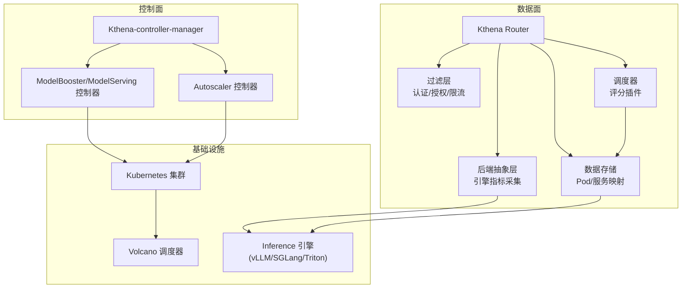
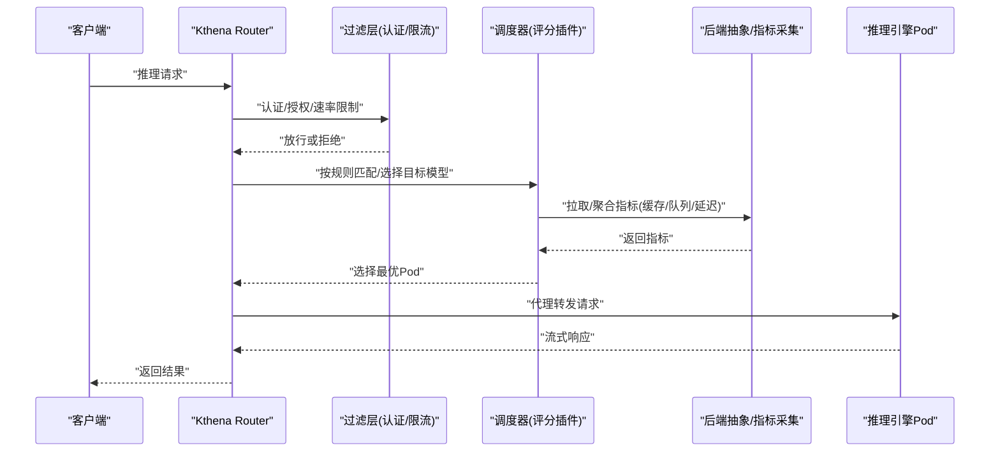
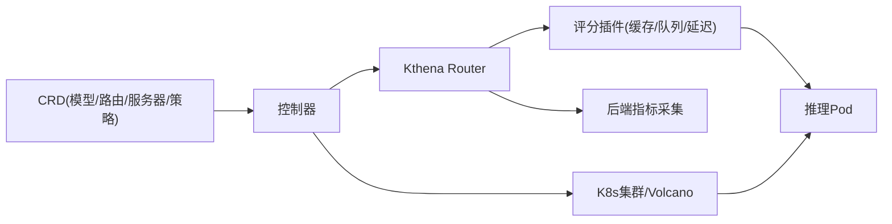

# 应用场景与价值

<cite>
**本文引用的文件**
- [README.md](file://README.md)
- [intro.md](file://docs/kthena/docs/intro.md)
- [quick-start.md](file://docs/kthena/docs/getting-started/quick-start.md)
- [architecture.mdx](file://docs/kthena/docs/architecture/architecture.mdx)
- [model-deployment.md](file://docs/kthena/docs/user-guide/model-deployment.md)
- [router-routing.md](file://docs/kthena/docs/user-guide/router-routing.md)
- [autoscaler.md](file://docs/kthena/docs/user-guide/autoscaler.md)
- [fairness-scheduling.md](file://docs/kthena/docs/user-guide/fairness-scheduling.md)
- [router/index.md](file://docs/kthena/blog/router/index.md)
- [modelserving/index.md](file://docs/kthena/blog/modelserving/index.md)
- [2025-09-09-benchmark/index.md](file://docs/kthena/blog/2025-09-09-benchmark/index.md)
- [networking.serving.volcano.sh.md](file://docs/kthena/docs/reference/crd/networking.serving.volcano.sh.md)
- [ModelRouteSimple.yaml](file://examples/kthena-router/ModelRouteSimple.yaml)
- [ModelRouteMultiModels.yaml](file://examples/kthena-router/ModelRouteMultiModels.yaml)
- [benchmark/README.md](file://benchmark/kthena-router/README.md)
</cite>

## 目录
1. [引言](#引言)
2. [项目结构](#项目结构)
3. [核心组件](#核心组件)
4. [架构总览](#架构总览)
5. [详细组件分析](#详细组件分析)
6. [依赖关系分析](#依赖关系分析)
7. [性能考量](#性能考量)
8. [故障排查指南](#故障排查指南)
9. [结论](#结论)
10. [附录](#附录)

## 引言
本文件面向不同行业与规模的企业，系统化阐述 Kthena 平台在 AI 应用开发、企业智能客服、内容生成、数据分析、智能搜索等场景中的典型应用与价值。围绕高并发请求处理、多模型管理、成本控制、性能优化等关键痛点，结合平台的两阶段架构（控制面/数据面）、路由与调度能力、自动伸缩策略、公平队列与速率限制、预取-解码拆分（PD）等特性，给出可落地的实施建议与价值量化维度。

## 项目结构
Kthena 是一个 Kubernetes 原生的大模型推理服务平台，采用“控制面 + 数据面”的双平面架构：
- 控制面：通过 CRD 管理模型生命周期（部署、扩缩容、滚动升级、多后端引擎支持），并与 Volcano 调度器集成实现拓扑感知与成组调度。
- 数据面：Kthena Router 作为推理流量入口，基于请求级调度插件进行智能路由，支持 LoRA 适配器感知、KV 缓存感知、前缀缓存、最小请求数、最低延迟等多种评分策略，并提供公平队列、令牌级速率限制、可观测性等能力。

图示来源
- [architecture.mdx](file://docs/kthena/docs/architecture/architecture.mdx)
- [router/index.md](file://docs/kthena/blog/router/index.md)

章节来源
- [architecture.mdx](file://docs/kthena/docs/architecture/architecture.mdx)
- [router/index.md](file://docs/kthena/blog/router/index.md)

## 核心组件
- 控制面组件
  - Kthena-controller-manager：统一协调 CRD 生命周期，驱动模型部署、扩缩容与升级。
  - ModelBooster/ModelServing 控制器：以 ServingGroup × Role 组织推理实例，支持 PD 拆分、成组调度、拓扑感知、滚动升级与回滚策略。
  - Autoscaler 控制器：基于多指标与成本优化策略，实现稳定/紧急模式的弹性伸缩。
- 数据面组件
  - Kthena Router：请求级调度与路由，支持认证/限流/公平队列/评分插件组合、LoRA/KV 前缀感知、PD 拆分路由。
  - 后端抽象与指标采集：屏蔽 vLLM/SGLang 等引擎差异，统一暴露 KV 缓存利用率、TTFT/TPOT、排队长度等关键指标。
  - 可观测性：Prometheus 指标、访问日志、调试接口，便于定位性能瓶颈与资源占用。

章节来源
- [architecture.mdx](file://docs/kthena/docs/architecture/architecture.mdx)
- [router/index.md](file://docs/kthena/blog/router/index.md)
- [intro.md](file://docs/kthena/docs/intro.md)

## 架构总览
Kthena 将“声明式意图”与“请求级智能路由”解耦：
- 控制面：通过 ModelBooster/ModelServing/ModelRoute/ModelServer/AutoscalingPolicy 等 CRD 描述目标状态，控制器持续收敛至运行态。
- 数据面：Kthena Router 在每条请求上执行认证、限流、公平队列、调度评分、负载均衡与代理转发，确保低延迟、高吞吐与资源高效利用。

图示来源
- [architecture.mdx](file://docs/kthena/docs/architecture/architecture.mdx)
- [router/index.md](file://docs/kthena/blog/router/index.md)

章节来源
- [architecture.mdx](file://docs/kthena/docs/architecture/architecture.mdx)
- [router/index.md](file://docs/kthena/blog/router/index.md)

## 详细组件分析

### 场景一：AI 应用开发（提示词工程、微调与在线推理）
- 典型需求
  - 快速迭代与上线：通过 ModelBooster 一键部署，或使用 ModelServing 细粒度控制容器、网络与设备驱动。
  - 多模型/多适配器：支持 LoRA 动态加载与路由，避免重启带来的中断。
  - 成本与性能平衡：结合 KV 缓存感知与最小请求数评分，降低 TTFT 并提升吞吐。
- 关键能力
  - 路由与速率限制：基于令牌数的全局/本地限流，保障多租户公平性与成本可控。
  - 自动伸缩：homogeneous/heterogeneous 模式，结合 panic/stable 策略应对突发流量。
  - PD 拆分：将预热与解码分离，分别按吞吐/时延优化，提升整体资源利用率。
- 实施要点
  - 使用 ModelRoute/ModelServer 定义路由规则与后端服务；在 Router 中启用公平队列与评分插件组合。
  - 通过 AutoscalingPolicyBinding 将策略绑定到 ModelServing，设置 panic 阈值与稳定窗口。
  - 对长系统提示场景优先启用 KVCacheAware + Least Request 组合，短提示场景可用 Least Request + Least Latency。

章节来源
- [model-deployment.md](file://docs/kthena/docs/user-guide/model-deployment.md)
- [router-routing.md](file://docs/kthena/docs/user-guide/router-routing.md)
- [autoscaler.md](file://docs/kthena/docs/user-guide/autoscaler.md)
- [2025-09-09-benchmark/index.md](file://docs/kthena/blog/2025-09-09-benchmark/index.md)

### 场景二：企业智能客服（高并发对话、SLA 保障）
- 典型需求
  - 低延迟首 Token（TTFT）与稳定吞吐，保障用户感知体验。
  - 多轮会话与相似前缀命中，最大化 KV/前缀缓存命中率。
  - 公平分配资源，防止单个租户/用户过度占用。
- 关键能力
  - 公平队列：按用户近期 token 使用量动态调整优先级，避免饥饿。
  - 前缀缓存与 KV 缓存感知：提升重复/相似请求的命中率，减少重复计算。
  - 令牌级速率限制：按输入/输出 token 限制，保护后端并控制成本。
- 实施要点
  - 在 Router 中开启公平队列与 Prefix Cache/KV Cache Aware 插件。
  - 为不同用户层级配置权重路由（如 premium 用户走更大模型），并设置全局/本地限流。
  - 结合 Autoscaler 的 panic 模式，快速应对促销/活动高峰。

章节来源
- [fairness-scheduling.md](file://docs/kthena/docs/user-guide/fairness-scheduling.md)
- [router/index.md](file://docs/kthena/blog/router/index.md)
- [networking.serving.volcano.sh.md](file://docs/kthena/docs/reference/crd/networking.serving.volcano.sh.md)

### 场景三：内容生成（模板驱动、长上下文）
- 典型需求
  - 高吞吐与低 TTFT：长系统提示场景下显著提升吞吐与降低首 Token 时间。
  - 多模型/多适配器协同：根据模板类型选择合适模型或 LoRA。
- 关键能力
  - KVCacheAware + Least Request 组合在长提示场景下吞吐提升明显，TTFT 显著降低。
  - LoRA 亲和路由：避免频繁切换适配器导致的延迟。
- 实施要点
  - 采用 KVCacheAware + Least Request 评分组合；对模板类任务启用前缀缓存。
  - 使用 ModelRoute 的 header 匹配区分模板/角色，实现差异化路由与扩容策略。

章节来源
- [2025-09-09-benchmark/index.md](file://docs/kthena/blog/2025-09-09-benchmark/index.md)
- [router-routing.md](file://docs/kthena/docs/user-guide/router-routing.md)

### 场景四：数据分析（结构化查询、批处理与交互式）
- 典型需求
  - 低延迟交互式查询与稳定批处理吞吐。
  - 多模型并行：小模型用于快速过滤，大模型用于深度分析。
- 关键能力
  - 权重路由：将 70%/30% 流量分配给稳定版/灰度版模型，安全验证新版本。
  - PD 拆分：预热阶段使用高算力节点，解码阶段使用低延迟节点。
  - 自动伸缩：根据排队长度与 GPU 缓存利用率动态扩容。
- 实施要点
  - 使用权重路由进行金丝雀发布；结合公平队列保障多租户公平。
  - 通过 KV Connector（LMCache/Mooncake/NIXL）在 PD 拆分中传递 KV 状态。

章节来源
- [router-routing.md](file://docs/kthena/docs/user-guide/router-routing.md)
- [model-deployment.md](file://docs/kthena/docs/user-guide/model-deployment.md)
- [modelserving/index.md](file://docs/kthena/blog/modelserving/index.md)

### 场景五：智能搜索（检索增强、多模态）
- 典型需求
  - 低延迟检索与生成链路协同；多模型/多适配器按业务域路由。
  - 公平队列与速率限制保障多租户一致性体验。
- 关键能力
  - LoRA 亲和路由与 KV 缓存感知，减少适配器切换与重复计算。
  - 公平队列与令牌级限流，避免热点用户影响整体性能。
- 实施要点
  - 通过 ModelRoute 的 headers/body 匹配实现业务域路由；启用公平队列与速率限制。
  - 使用 PD 拆分优化检索与生成阶段的资源分配。

章节来源
- [router/index.md](file://docs/kthena/blog/router/index.md)
- [router-routing.md](file://docs/kthena/docs/user-guide/router-routing.md)
- [fairness-scheduling.md](file://docs/kthena/docs/user-guide/fairness-scheduling.md)

## 依赖关系分析
- 控制面与数据面解耦：CRD 描述与请求级路由相互独立，便于独立演进与故障隔离。
- 调度器与后端指标耦合：评分插件依赖后端指标（TTFT/TPOT/排队长度/KV 利用率），形成闭环反馈。
- 资源与成本耦合：Autoscaler 在 homogenous/heterogeneous 模式下综合考虑 SLO 与成本上限，避免过度扩容。

图示来源
- [architecture.mdx](file://docs/kthena/docs/architecture/architecture.mdx)
- [router/index.md](file://docs/kthena/blog/router/index.md)

章节来源
- [architecture.mdx](file://docs/kthena/docs/architecture/architecture.mdx)
- [router/index.md](file://docs/kthena/blog/router/index.md)

## 性能考量
- 评分插件组合
  - 长提示场景：KVCacheAware + Least Request 组合显著提升吞吐并降低 TTFT。
  - 一般场景：Least Request + Least Latency 组合兼顾吞吐与时延。
  - 资源受限：GPU Cache Usage 插件优先选择缓存空闲的 Pod。
- 公平队列
  - 通过滑动窗口统计用户 token 使用，按权重计算优先级，避免单用户独占。
- PD 拆分
  - 将预热与解码分离，分别按吞吐/时延优化，提升整体资源利用率。
- 自动伸缩
  - panic 模式应对突发流量，稳定模式避免抖动；成本优化模式在异构实例池间分配。

章节来源
- [2025-09-09-benchmark/index.md](file://docs/kthena/blog/2025-09-09-benchmark/index.md)
- [fairness-scheduling.md](file://docs/kthena/docs/user-guide/fairness-scheduling.md)
- [modelserving/index.md](file://docs/kthena/blog/modelserving/index.md)
- [autoscaler.md](file://docs/kthena/docs/user-guide/autoscaler.md)

## 故障排查指南
- 路由与速率限制
  - 检查 ModelRoute/ModelServer 配置是否正确匹配请求（headers/body/uri）。
  - 通过 Router 的 /metrics 与访问日志定位限流触发点与排队情况。
- 公平队列
  - 确认请求中包含 userId；检查队列超时、取消与优先级刷新参数。
- 自动伸缩
  - 核对 AutoscalingPolicy 与 Binding 的指标阈值、panic 窗口与稳定窗口；查看控制器日志与指标收集状态。
- PD 拆分
  - 确认 pdGroup 的 groupKey 与 prefill/decode 标签匹配；检查 KV Connector 配置与连接状态。

章节来源
- [router/index.md](file://docs/kthena/blog/router/index.md)
- [networking.serving.volcano.sh.md](file://docs/kthena/docs/reference/crd/networking.serving.volcano.sh.md)
- [fairness-scheduling.md](file://docs/kthena/docs/user-guide/fairness-scheduling.md)
- [autoscaler.md](file://docs/kthena/docs/user-guide/autoscaler.md)

## 结论
Kthena 通过“控制面 + 数据面”的双平面架构，将企业级 LLM 推理从“运维复杂度”转变为“声明式编排”，在高并发、多模型、多适配器与成本控制等关键场景中提供系统性解决方案。其核心价值体现在：
- 成本节约：通过 PD 拆分、KV/前缀缓存感知、成本优化的自动伸缩，降低 GPU/内存占用与能耗。
- 效率提升：评分插件组合与公平队列显著改善吞吐与 TTFT，缩短用户等待时间。
- 可靠性增强：成组调度、滚动升级、多后端引擎与可观测性保障生产稳定性。

## 附录

### 不同规模企业部署实践概览
- 小型企业（原型/单机）
  - 使用 ModelBooster 一键部署，结合 Router 的简单模型路由与本地限流，快速验证业务可行性。
  - 示例参考：[quick-start.md](file://docs/kthena/docs/getting-started/quick-start.md)
- 中型企业（多模型/多租户）
  - 使用 ModelServing 细粒度控制容器与网络；启用公平队列与令牌级限流；通过权重路由进行金丝雀发布。
  - 示例参考：[router-routing.md](file://docs/kthena/docs/user-guide/router-routing.md)、[ModelRouteSimple.yaml](file://examples/kthena-router/ModelRouteSimple.yaml)
- 大型企业（大规模多集群/混合云）
  - 使用 heterogeneous 自动伸缩在异构实例池间优化成本；启用 KVCacheAware/Least Request 组合；结合 PD 拆分与 KV Connector。
  - 示例参考：[model-deployment.md](file://docs/kthena/docs/user-guide/model-deployment.md)、[2025-09-09-benchmark/index.md](file://docs/kthena/blog/2025-09-09-benchmark/index.md)

### 实际效果与投资回报（ROI）参考
- 长提示场景下，KVCacheAware + Least Request 组合可实现约 1.7 倍吞吐提升与 70%+ 的 TTFT 降低，显著改善用户体验并降低单位请求成本。
- 公平队列与令牌级限流有效抑制单租户/单用户对整体性能的影响，提升 SLA 达成率与资源利用率。
- PD 拆分与 KV Connector 使预热与解码阶段资源匹配更精准，减少无效计算与跨节点通信开销。

章节来源
- [2025-09-09-benchmark/index.md](file://docs/kthena/blog/2025-09-09-benchmark/index.md)
- [router/index.md](file://docs/kthena/blog/router/index.md)
- [model-deployment.md](file://docs/kthena/docs/user-guide/model-deployment.md)