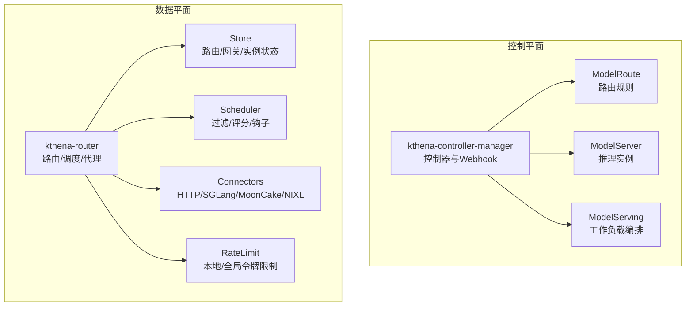
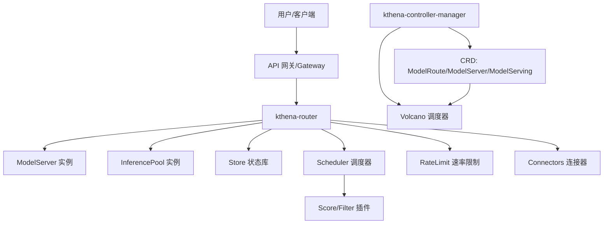
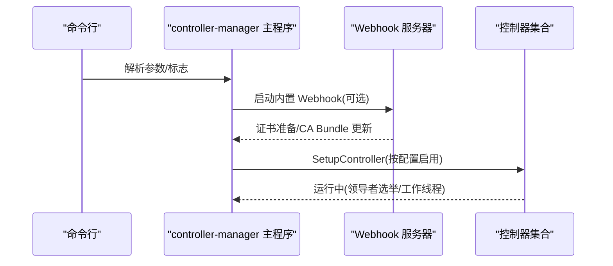
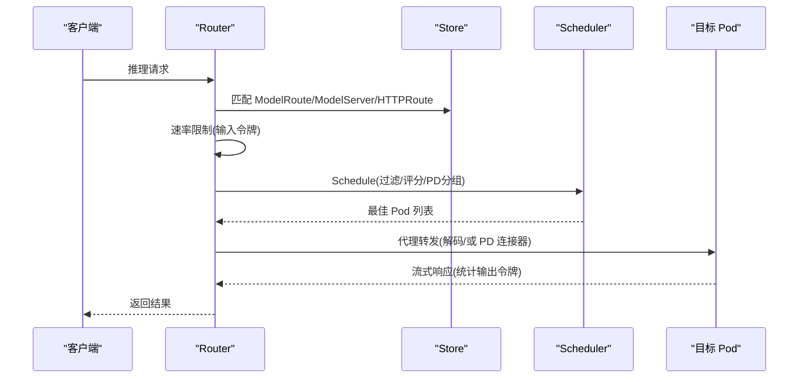
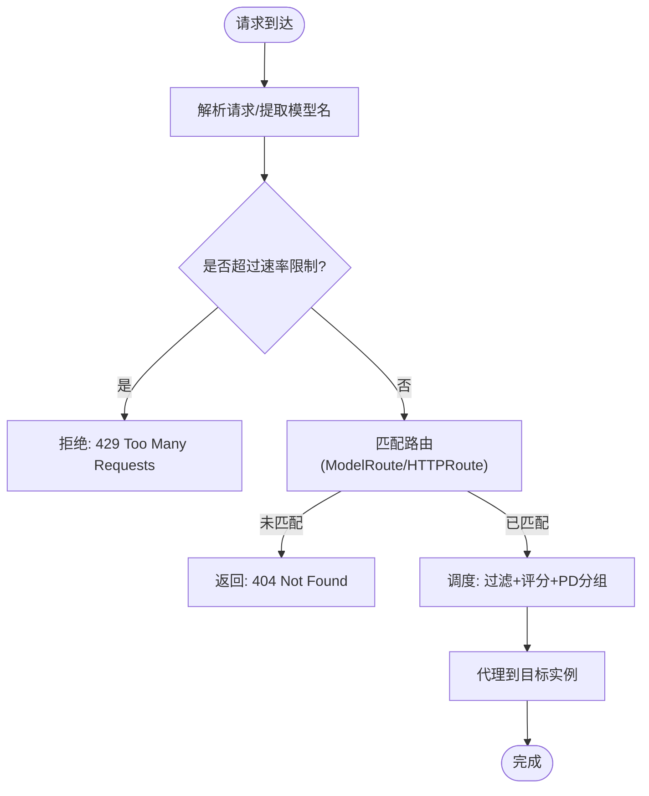
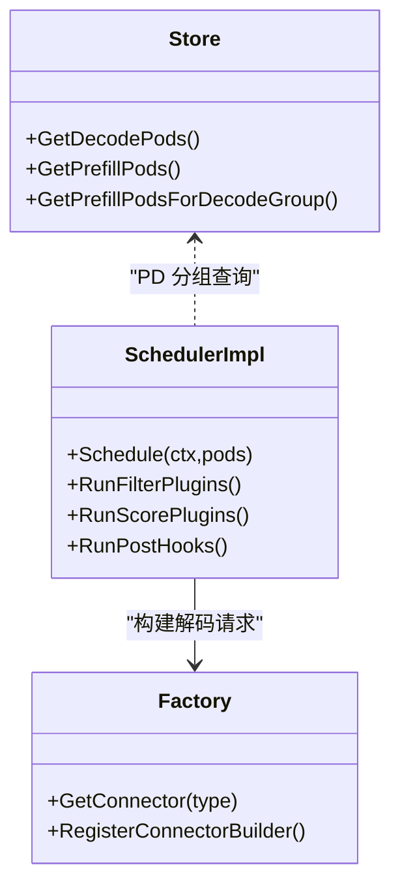
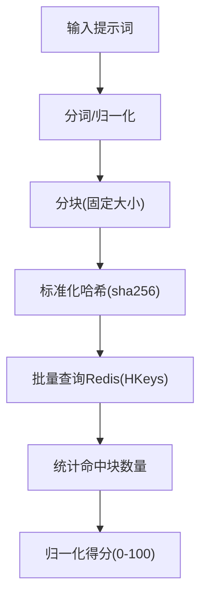
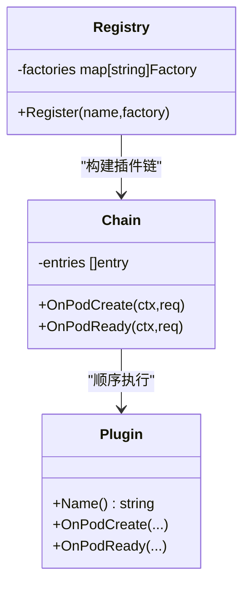
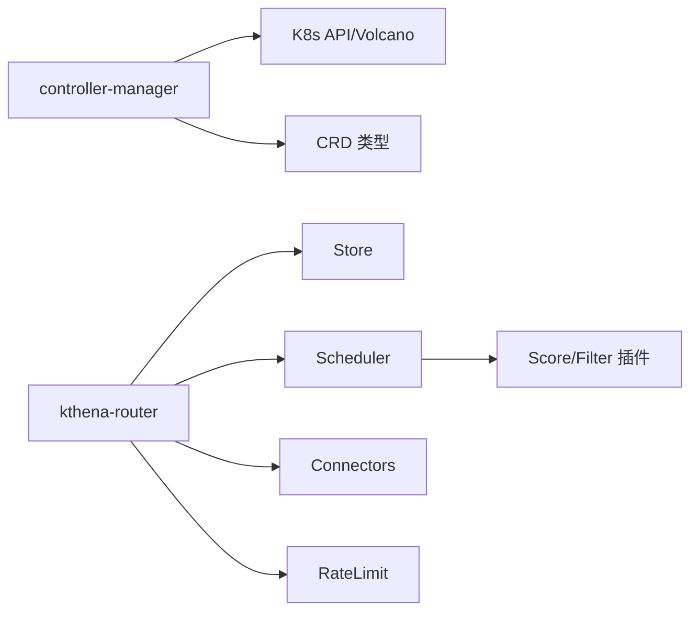

# 架构设计理念

<cite>
**本文引用的文件**   
- [README.md](file://README.md)
- [cmd/kthena-controller-manager/main.go](file://cmd/kthena-controller-manager/main.go)
- [cmd/kthena-router/main.go](file://cmd/kthena-router/main.go)
- [pkg/apis/networking/v1alpha1/modelroute_types.go](file://pkg/apis/networking/v1alpha1/modelroute_types.go)
- [pkg/apis/workload/v1alpha1/model_serving_types.go](file://pkg/apis/workload/v1alpha1/model_serving_types.go)
- [pkg/controller/config.go](file://pkg/controller/config.go)
- [pkg/kthena-router/router/router.go](file://pkg/kthena-router/router/router.go)
- [pkg/kthena-router/scheduler/scheduler.go](file://pkg/kthena-router/scheduler/scheduler.go)
- [pkg/kthena-router/scheduler/scheduler_impl.go](file://pkg/kthena-router/scheduler/scheduler_impl.go)
- [pkg/kthena-router/datastore/store.go](file://pkg/kthena-router/datastore/store.go)
- [pkg/kthena-router/connectors/factory.go](file://pkg/kthena-router/connectors/factory.go)
- [pkg/kthena-router/filters/ratelimit/ratelimit.go](file://pkg/kthena-router/filters/ratelimit/ratelimit.go)
- [pkg/kthena-router/scheduler/plugins/kvcache_aware.go](file://pkg/kthena-router/scheduler/plugins/kvcache_aware.go)
- [pkg/model-serving-controller/plugins/manager.go](file://pkg/model-serving-controller/plugins/manager.go)
</cite>

## 目录
1. [引言](#引言)
2. [项目结构](#项目结构)
3. [核心组件](#核心组件)
4. [架构总览](#架构总览)
5. [详细组件分析](#详细组件分析)
6. [依赖关系分析](#依赖关系分析)
7. [性能考量](#性能考量)
8. [故障排查指南](#故障排查指南)
9. [结论](#结论)
10. [附录](#附录)

## 引言
本文件面向 Kthena 平台的架构设计理念进行深入分析，重点阐述以下主题：
- 控制平面与数据平面分离：控制平面负责模型生命周期与调度策略，数据平面负责推理流量的智能路由与负载均衡。
- Kubernetes 原生架构：通过 CRD（ModelRoute、ModelServer、ModelServing 等）与控制器模式实现声明式管理，并与 Volcano 调度器深度集成。
- 智能路由架构：请求分类、多维度负载均衡、流量控制（含令牌级速率限制与全局限流）、网关 API 集成与前缀缓存优化。
- 预取-解码分离（Prefill-Decode Disaggregation）：通过 KV 缓存感知调度与连接器抽象，实现高吞吐低延迟的推理路径。
- 插件化设计：在工作负载层面（ModelServing）与路由器层面（调度插件、连接器）实现可扩展能力，保障可维护性与演进空间。

## 项目结构
Kthena 采用分层清晰的模块化组织：
- 控制平面：kthena-controller-manager，包含多个控制器（模型服务、模型增强器、自动伸缩），并提供 Webhook 校验与证书管理。
- 数据平面：kthena-router，提供 HTTP 入口、路由匹配、调度、代理转发、访问日志、指标与速率限制等能力。
- API 与类型定义：networking/v1alpha1 与 workload/v1alpha1 下的 CRD 类型，定义模型路由、服务器、工作负载等资源。
- 调度与存储：路由器内部的数据存储层（Store）与调度框架（Filter/Score/PostSchedule Hooks），支持 PD 分离与 KV 缓存感知。
- 连接器与过滤器：抽象不同后端（HTTP、SGLang、MoonCake、NIXL）与速率限制、鉴权、分词器等通用能力。
- 插件体系：工作负载插件链（注册表、作用域、执行顺序）与路由器调度插件（如 KV 缓存感知）。

图示来源
- [cmd/kthena-controller-manager/main.go:54-111](file://cmd/kthena-controller-manager/main.go#L54-L111)
- [cmd/kthena-router/main.go:40-122](file://cmd/kthena-router/main.go#L40-L122)
- [pkg/kthena-router/router/router.go:91-169](file://pkg/kthena-router/router/router.go#L91-L169)
- [pkg/kthena-router/datastore/store.go:162-240](file://pkg/kthena-router/datastore/store.go#L162-L240)
- [pkg/kthena-router/scheduler/scheduler.go:25-28](file://pkg/kthena-router/scheduler/scheduler.go#L25-L28)
- [pkg/kthena-router/connectors/factory.go:21-60](file://pkg/kthena-router/connectors/factory.go#L21-L60)
- [pkg/kthena-router/filters/ratelimit/ratelimit.go:60-98](file://pkg/kthena-router/filters/ratelimit/ratelimit.go#L60-L98)

章节来源
- [README.md:53-66](file://README.md#L53-L66)
- [cmd/kthena-controller-manager/main.go:54-111](file://cmd/kthena-controller-manager/main.go#L54-L111)
- [cmd/kthena-router/main.go:40-122](file://cmd/kthena-router/main.go#L40-L122)

## 核心组件
- 控制平面（kthena-controller-manager）
  - 多控制器：模型服务控制器、模型增强器控制器、自动伸缩控制器，支持按需启用/禁用。
  - Webhook：校验与变更注入，自动生成证书并更新 ValidatingWebhookConfiguration。
  - 配置：支持领导者选举、并发工作线程数、K8s API QPS/Burst 参数。
- 数据平面（kthena-router）
  - 路由器：解析请求、匹配路由、统一速率限制、公平队列优先级、调度与代理。
  - 存储层：聚合 ModelRoute/ModelServer/Gateway/HTTPRoute/InferencePool/Pod 状态，支持回调与队列统计。
  - 调度器：过滤 + 多插件评分 + PD 分组优化 + 后处理钩子。
  - 连接器：抽象不同后端协议与实现（HTTP、SGLang、MoonCake、NIXL）。
  - 速率限制：本地令牌桶与 Redis 全局令牌桶，支持输入/输出令牌限制。
- CRD 与控制器模式
  - ModelRoute：基于模型名、LoRA、Header/URI/Body 匹配的路由规则与全局/本地速率限制。
  - ModelServer：绑定到具体推理实例，支持 PD 分组与工作负载选择器。
  - ModelServing：声明式工作负载编排、滚动升级策略、恢复策略、插件链。

章节来源
- [cmd/kthena-controller-manager/main.go:54-111](file://cmd/kthena-controller-manager/main.go#L54-L111)
- [pkg/controller/config.go:19-27](file://pkg/controller/config.go#L19-L27)
- [cmd/kthena-router/main.go:40-122](file://cmd/kthena-router/main.go#L40-L122)
- [pkg/kthena-router/router/router.go:73-169](file://pkg/kthena-router/router/router.go#L73-L169)
- [pkg/kthena-router/datastore/store.go:162-240](file://pkg/kthena-router/datastore/store.go#L162-L240)
- [pkg/kthena-router/scheduler/scheduler.go:25-28](file://pkg/kthena-router/scheduler/scheduler.go#L25-L28)
- [pkg/kthena-router/connectors/factory.go:21-60](file://pkg/kthena-router/connectors/factory.go#L21-L60)
- [pkg/kthena-router/filters/ratelimit/ratelimit.go:60-98](file://pkg/kthena-router/filters/ratelimit/ratelimit.go#L60-L98)
- [pkg/apis/networking/v1alpha1/modelroute_types.go:24-56](file://pkg/apis/networking/v1alpha1/modelroute_types.go#L24-L56)
- [pkg/apis/workload/v1alpha1/model_serving_types.go:35-66](file://pkg/apis/workload/v1alpha1/model_serving_types.go#L35-L66)

## 架构总览
Kthena 将“控制”与“数据”严格分离：
- 控制平面：通过 CRD 声明模型与路由策略，控制器持续协调集群状态，确保目标副本、滚动更新、自动伸缩与准入校验。
- 数据平面：路由器作为流量入口，完成请求解析、路由匹配、速率限制、调度与代理转发，支持网关 API 与前缀缓存优化。

图示来源
- [README.md:53-66](file://README.md#L53-L66)
- [cmd/kthena-router/main.go:40-122](file://cmd/kthena-router/main.go#L40-L122)
- [pkg/kthena-router/router/router.go:204-315](file://pkg/kthena-router/router/router.go#L204-L315)
- [pkg/kthena-router/datastore/store.go:178-240](file://pkg/kthena-router/datastore/store.go#L178-L240)
- [pkg/kthena-router/scheduler/scheduler_impl.go:101-165](file://pkg/kthena-router/scheduler/scheduler_impl.go#L101-L165)
- [pkg/kthena-router/filters/ratelimit/ratelimit.go:100-137](file://pkg/kthena-router/filters/ratelimit/ratelimit.go#L100-L137)

## 详细组件分析

### 控制平面：控制器与 Webhook
- 启动流程：解析命令行参数，支持控制器列表、领导者选举、Webhook 开关与证书生成；启动控制器并进入运行循环。
- Webhook：统一的健康检查端点与多路由校验/变更注入，自动从 Secret 或文件加载或生成证书并更新 CA Bundle。
- 控制器配置：支持按名称启用/禁用控制器，设置并发工作线程与 K8s API 限速参数。

图示来源
- [cmd/kthena-controller-manager/main.go:54-111](file://cmd/kthena-controller-manager/main.go#L54-L111)
- [cmd/kthena-controller-manager/main.go:127-236](file://cmd/kthena-controller-manager/main.go#L127-L236)

章节来源
- [cmd/kthena-controller-manager/main.go:54-111](file://cmd/kthena-controller-manager/main.go#L54-L111)
- [cmd/kthena-controller-manager/main.go:127-236](file://cmd/kthena-controller-manager/main.go#L127-L236)
- [pkg/controller/config.go:19-27](file://pkg/controller/config.go#L19-L27)

### 数据平面：路由器与调度器
- 请求处理主流程：解析请求 → 计算输入令牌 → 统一速率限制 → 路由匹配（ModelRoute/HTTPRoute）→ 调度（PD 分离/普通聚合）→ 代理转发 → 上游计数回收。
- 调度器接口：统一的 Schedule 与 PostSchedule 钩子，支持过滤插件与评分插件链。
- PD 分离优化：针对 ModelServer 的 PDGroup，先选出最优解码实例，再在同组内挑选最优预取实例，避免跨节点 KV 传输。
- 公平队列与优先级：基于用户与模型的令牌追踪窗口，结合权重计算公平优先级，支持环境变量配置。

图示来源
- [pkg/kthena-router/router/router.go:204-315](file://pkg/kthena-router/router/router.go#L204-L315)
- [pkg/kthena-router/router/router.go:317-464](file://pkg/kthena-router/router/router.go#L317-L464)
- [pkg/kthena-router/router/router.go:714-780](file://pkg/kthena-router/router/router.go#L714-L780)
- [pkg/kthena-router/scheduler/scheduler.go:25-28](file://pkg/kthena-router/scheduler/scheduler.go#L25-L28)
- [pkg/kthena-router/scheduler/scheduler_impl.go:101-165](file://pkg/kthena-router/scheduler/scheduler_impl.go#L101-L165)

章节来源
- [pkg/kthena-router/router/router.go:204-315](file://pkg/kthena-router/router/router.go#L204-L315)
- [pkg/kthena-router/router/router.go:317-464](file://pkg/kthena-router/router/router.go#L317-L464)
- [pkg/kthena-router/router/router.go:714-780](file://pkg/kthena-router/router/router.go#L714-L780)
- [pkg/kthena-router/scheduler/scheduler_impl.go:101-165](file://pkg/kthena-router/scheduler/scheduler_impl.go#L101-L165)

### 智能路由与流量控制
- 请求分类：基于模型名、Header/URI/Body 匹配，支持 LoRA 适配器路由；HTTPRoute 支持路径前缀/正则/主机名匹配与 URL 重写。
- 负载均衡策略：多插件评分（如最少请求数、最低时延、前缀缓存命中率），支持 PD 分组内的预取-解码配对。
- 流量控制：统一速率限制器，支持输入/输出令牌限制与全局 Redis 令牌桶；支持访问日志与指标记录。

图示来源
- [pkg/kthena-router/router/router.go:204-315](file://pkg/kthena-router/router/router.go#L204-L315)
- [pkg/kthena-router/router/router.go:500-622](file://pkg/kthena-router/router/router.go#L500-L622)
- [pkg/kthena-router/filters/ratelimit/ratelimit.go:100-137](file://pkg/kthena-router/filters/ratelimit/ratelimit.go#L100-L137)

章节来源
- [pkg/kthena-router/router/router.go:500-622](file://pkg/kthena-router/router/router.go#L500-L622)
- [pkg/kthena-router/filters/ratelimit/ratelimit.go:100-137](file://pkg/kthena-router/filters/ratelimit/ratelimit.go#L100-L137)

### 预取-解码分离（PD Disaggregation）
- 设计要点：将计算密集的预取阶段与逐 token 生成的解码阶段分离，减少 KV 缓存跨节点传输开销。
- 路由器侧实现：Store 中按 PDGroup 对实例进行预分类；调度器在解码候选中挑选最优，再在同组内选择最优预取实例。
- 连接器抽象：通过工厂模式支持不同后端（HTTP、SGLang、MoonCake、NIXL），在 PD 模式下构建解码请求并代理。

图示来源
- [pkg/kthena-router/datastore/store.go:572-635](file://pkg/kthena-router/datastore/store.go#L572-L635)
- [pkg/kthena-router/scheduler/scheduler_impl.go:101-165](file://pkg/kthena-router/scheduler/scheduler_impl.go#L101-L165)
- [pkg/kthena-router/connectors/factory.go:21-60](file://pkg/kthena-router/connectors/factory.go#L21-L60)

章节来源
- [pkg/kthena-router/datastore/store.go:572-635](file://pkg/kthena-router/datastore/store.go#L572-L635)
- [pkg/kthena-router/scheduler/scheduler_impl.go:101-165](file://pkg/kthena-router/scheduler/scheduler_impl.go#L101-L165)
- [pkg/kthena-router/connectors/factory.go:21-60](file://pkg/kthena-router/connectors/factory.go#L21-L60)

### KV 缓存感知调度（KVCache Aware）
- 核心思想：基于提示词的 token 块哈希与 Redis 分布式键值映射，评估各实例的 KV 命中潜力，提升命中率与吞吐。
- 关键步骤：分块与标准化哈希 → 批量 Redis 查询 → 计算命中得分 → 归一化评分。
- 参数化：块大小、最大匹配块数、Redis 地址等可通过配置注入。

图示来源
- [pkg/kthena-router/scheduler/plugins/kvcache_aware.go:153-192](file://pkg/kthena-router/scheduler/plugins/kvcache_aware.go#L153-L192)
- [pkg/kthena-router/scheduler/plugins/kvcache_aware.go:194-238](file://pkg/kthena-router/scheduler/plugins/kvcache_aware.go#L194-L238)
- [pkg/kthena-router/scheduler/plugins/kvcache_aware.go:247-299](file://pkg/kthena-router/scheduler/plugins/kvcache_aware.go#L247-L299)

章节来源
- [pkg/kthena-router/scheduler/plugins/kvcache_aware.go:153-192](file://pkg/kthena-router/scheduler/plugins/kvcache_aware.go#L153-L192)
- [pkg/kthena-router/scheduler/plugins/kvcache_aware.go:194-238](file://pkg/kthena-router/scheduler/plugins/kvcache_aware.go#L194-L238)
- [pkg/kthena-router/scheduler/plugins/kvcache_aware.go:247-299](file://pkg/kthena-router/scheduler/plugins/kvcache_aware.go#L247-L299)

### 插件化设计：工作负载与路由器
- 工作负载插件（ModelServing）
  - 注册表：名称到工厂函数映射，支持内置类型。
  - 插件链：按顺序执行 OnPodCreate/OnPodReady，支持角色与目标（Entry/Worker/All）作用域。
- 路由器插件（调度）
  - 过滤与评分插件链，支持环境变量与配置文件加载；PD 分组优化与后处理钩子。

图示来源
- [pkg/model-serving-controller/plugins/manager.go:30-80](file://pkg/model-serving-controller/plugins/manager.go#L30-L80)
- [pkg/model-serving-controller/plugins/manager.go:82-112](file://pkg/model-serving-controller/plugins/manager.go#L82-L112)

章节来源
- [pkg/model-serving-controller/plugins/manager.go:30-80](file://pkg/model-serving-controller/plugins/manager.go#L30-L80)
- [pkg/model-serving-controller/plugins/manager.go:82-112](file://pkg/model-serving-controller/plugins/manager.go#L82-L112)

### Kubernetes 原生与 Volcano 集成
- CRD 设计：ModelRoute/ModelServer/ModelServing 定义清晰的期望状态与行为约束，配合 XValidation 与枚举字段保证一致性。
- 控制器模式：控制器持续 reconcile CRD，驱动 Pod 生命周期、滚动升级、自动伸缩与准入校验。
- 调度器集成：ModelServing 默认使用 Volcano 作为调度器，结合路由器的调度插件实现更细粒度的负载均衡与公平性。

章节来源
- [pkg/apis/networking/v1alpha1/modelroute_types.go:24-56](file://pkg/apis/networking/v1alpha1/modelroute_types.go#L24-L56)
- [pkg/apis/workload/v1alpha1/model_serving_types.go:35-66](file://pkg/apis/workload/v1alpha1/model_serving_types.go#L35-L66)
- [cmd/kthena-controller-manager/main.go:54-111](file://cmd/kthena-controller-manager/main.go#L54-L111)

## 依赖关系分析
- 控制平面依赖 K8s API 与 Volcano 调度器，通过 CRD 与控制器实现声明式编排。
- 数据平面依赖存储层（Store）聚合状态，调度器依赖插件生态，连接器抽象后端差异。
- 速率限制器可选择本地或全局（Redis），以满足多实例一致性需求。

图示来源
- [cmd/kthena-controller-manager/main.go:54-111](file://cmd/kthena-controller-manager/main.go#L54-L111)
- [cmd/kthena-router/main.go:40-122](file://cmd/kthena-router/main.go#L40-L122)
- [pkg/kthena-router/datastore/store.go:162-240](file://pkg/kthena-router/datastore/store.go#L162-L240)
- [pkg/kthena-router/scheduler/scheduler_impl.go:59-99](file://pkg/kthena-router/scheduler/scheduler_impl.go#L59-L99)
- [pkg/kthena-router/connectors/factory.go:21-60](file://pkg/kthena-router/connectors/factory.go#L21-L60)
- [pkg/kthena-router/filters/ratelimit/ratelimit.go:139-204](file://pkg/kthena-router/filters/ratelimit/ratelimit.go#L139-L204)

章节来源
- [cmd/kthena-controller-manager/main.go:54-111](file://cmd/kthena-controller-manager/main.go#L54-L111)
- [cmd/kthena-router/main.go:40-122](file://cmd/kthena-router/main.go#L40-L122)
- [pkg/kthena-router/datastore/store.go:162-240](file://pkg/kthena-router/datastore/store.go#L162-L240)
- [pkg/kthena-router/scheduler/scheduler_impl.go:59-99](file://pkg/kthena-router/scheduler/scheduler_impl.go#L59-L99)
- [pkg/kthena-router/connectors/factory.go:21-60](file://pkg/kthena-router/connectors/factory.go#L21-L60)
- [pkg/kthena-router/filters/ratelimit/ratelimit.go:139-204](file://pkg/kthena-router/filters/ratelimit/ratelimit.go#L139-L204)

## 性能考量
- 调度性能
  - 过滤与评分插件链短路与早停，Top-N 选择降低复杂度。
  - PD 分离避免跨节点 KV 传输，显著降低尾延迟。
- 速率限制
  - 输入令牌估算与输出令牌保守检查，防止半成品请求占用资源。
  - 全局令牌桶通过 Redis 保证多实例一致性，适合高并发场景。
- 缓存与命中
  - KV 缓存感知插件通过分块哈希与 Redis 分布式键值映射，最大化命中率。
- 存储与队列
  - Store 周期性更新 Pod 指标与模型列表，公平队列按窗口统计令牌与请求数，动态调整优先级。

## 故障排查指南
- Webhook 启动失败
  - 检查 TLS 证书文件是否存在与权限，确认 CA Bundle 更新成功。
- 路由不生效
  - 确认 ModelRoute/HTTPRoute 是否正确匹配（模型名、Header/URI/Body、路径前缀/正则）。
- 调度无实例
  - 检查 Store 中 Pod 与 ModelServer 关联是否正确，PD 分组是否按标签分类。
- 速率限制频繁触发
  - 调整速率限制配置（单位、输入/输出令牌上限），或切换为全局 Redis 令牌桶。
- 公平队列异常
  - 检查环境变量（窗口大小、权重、最大并发/QPS）与令牌追踪器初始化。

章节来源
- [cmd/kthena-controller-manager/main.go:127-236](file://cmd/kthena-controller-manager/main.go#L127-L236)
- [pkg/kthena-router/router/router.go:317-464](file://pkg/kthena-router/router/router.go#L317-L464)
- [pkg/kthena-router/datastore/store.go:410-485](file://pkg/kthena-router/datastore/store.go#L410-L485)
- [pkg/kthena-router/filters/ratelimit/ratelimit.go:139-204](file://pkg/kthena-router/filters/ratelimit/ratelimit.go#L139-L204)

## 结论
Kthena 通过“控制平面 + 数据平面”的清晰分离，结合 Kubernetes 原生 CRD 与控制器模式、Volcano 调度器集成、路由器的智能路由与调度插件、以及预取-解码分离与 KV 缓存感知，实现了生产级的大模型推理平台。其插件化设计进一步增强了可扩展性与可维护性，使平台能够在多引擎、多拓扑、多策略的复杂场景中保持高性能与高可用。

## 附录
- 关键术语
  - 控制平面：负责模型生命周期与策略管理的组件集合。
  - 数据平面：负责推理流量接入、路由与调度的组件集合。
  - PD 分离：将预取与解码阶段解耦，提升吞吐与降低延迟。
  - KV 缓存感知：基于提示词分块哈希与 Redis 分布式映射的调度优化。
- 参考文档与示例
  - 快速开始与安装指南：[README.md:68-81](file://README.md#L68-L81)
  - 架构文档与特性概览：[README.md:53-66](file://README.md#L53-L66)