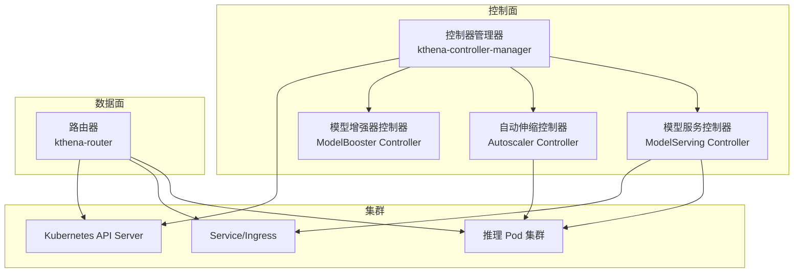
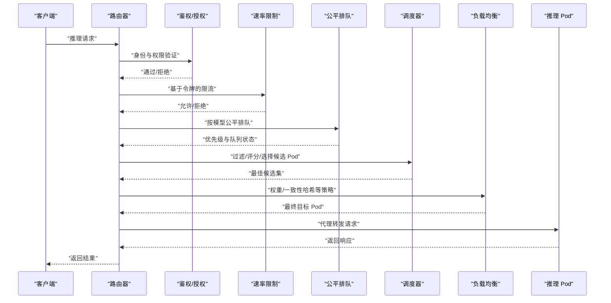
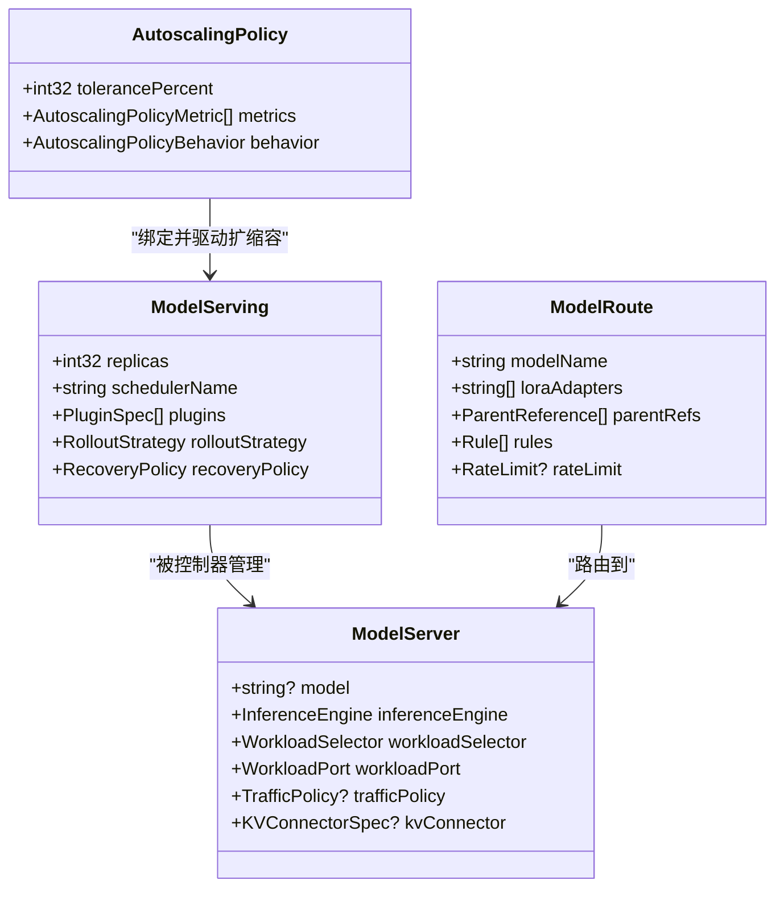
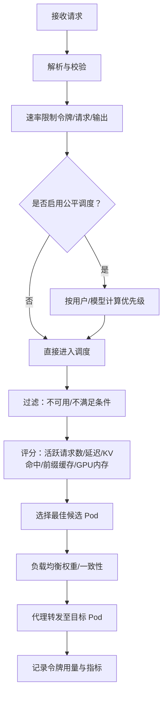
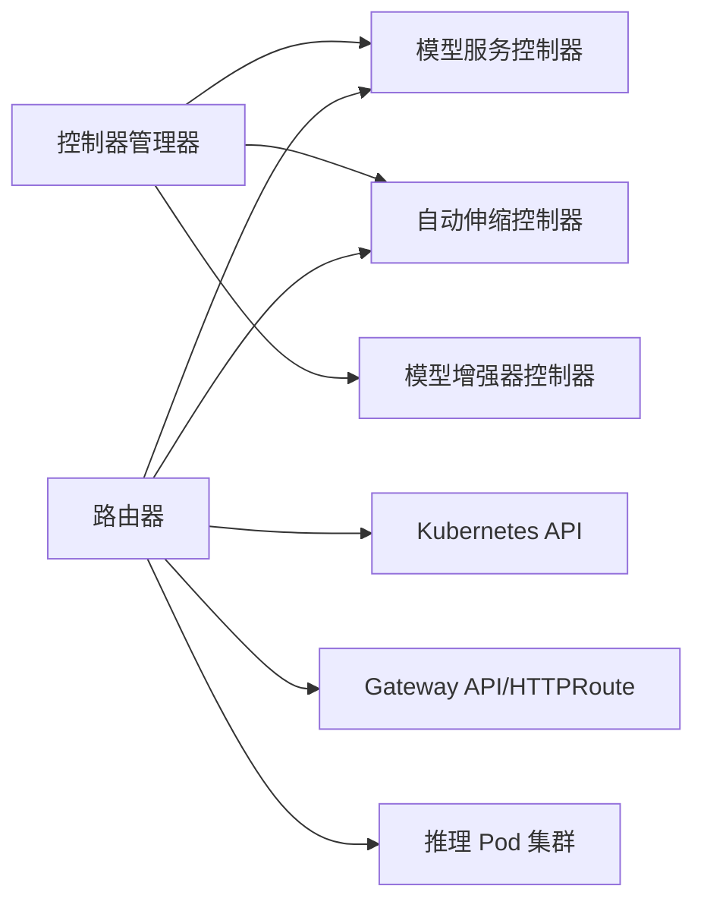

# 核心价值与定位

<cite>
**本文引用的文件**
- [README.md](file://README.md)
- [架构总览（Architecture Overview）](file://docs/kthena/docs/architecture/architecture.mdx)
- [路由器路由（Router Routing）](file://docs/kthena/docs/user-guide/router-routing.md)
- [Gateway API 支持（Gateway API Support）](file://docs/kthena/docs/user-guide/gateway-api-support.md)
- [模型部署（Model Deployment）](file://docs/kthena/docs/user-guide/model-deployment.md)
- [自动伸缩器（Kthena Autoscaler）](file://docs/kthena/docs/user-guide/autoscaler.md)
- [控制器管理器入口（kthena-controller-manager/main.go）](file://cmd/kthena-controller-manager/main.go)
- [路由器入口（kthena-router/main.go）](file://cmd/kthena-router/main.go)
- [ModelServing 资源定义（model_serving_types.go）](file://pkg/apis/workload/v1alpha1/model_serving_types.go)
- [ModelRoute 资源定义（modelroute_types.go）](file://pkg/apis/networking/v1alpha1/modelroute_types.go)
- [ModelServer 资源定义（modelserver_types.go）](file://pkg/apis/networking/v1alpha1/modelserver_types.go)
- [ModelServing 控制器（model_serving_controller.go）](file://pkg/model-serving-controller/controller/model_serving_controller.go)
- [路由器调度器（router.go）](file://pkg/kthena-router/router/router.go)
- [自动伸缩控制器（autoscale_controller.go）](file://pkg/autoscaler/controller/autoscale_controller.go)
- [简单路由示例（ModelRouteSimple.yaml）](file://examples/kthena-router/ModelRouteSimple.yaml)
- [Gateway 示例（Gateway.yaml）](file://examples/kthena-router/Gateway.yaml)
</cite>

## 目录
1. [引言](#引言)
2. [项目结构](#项目结构)
3. [核心组件](#核心组件)
4. [架构总览](#架构总览)
5. [详细组件分析](#详细组件分析)
6. [依赖关系分析](#依赖关系分析)
7. [性能考量](#性能考量)
8. [故障排查指南](#故障排查指南)
9. [结论](#结论)
10. [附录](#附录)

## 引言
Kthena 是面向企业级生产的云原生大语言模型（LLM）推理平台，以“声明式模型生命周期管理 + 智能请求路由”为核心能力，解决生产环境中 LLM 推理的关键痛点：成本优化、性能提升、部署简化与运维稳定。平台通过分离控制面与数据面，将意图（CRD 声明）与流量（路由器调度）解耦，使团队能够以熟悉的云原生方式管理复杂推理工作负载，同时获得按需扩缩容、多后端引擎支持、前缀/解码拆分（Prefill-Decode Disaggregation）、网关感知调度与公平排队等高级特性。

## 项目结构
Kthena 采用两平面架构：控制面负责模型生命周期与资源编排；数据面负责请求级智能路由与调度。控制面包含控制器管理器与多个控制器（模型增强器、模型服务、自动伸缩），数据面由路由器承担请求处理与调度职责。平台通过 CRD 将高层意图映射到底层工作负载与网络策略，支持 vLLM、SGLang 等推理引擎以及 LoRA 适配器、KV 缓存传输等扩展能力。

图示来源
- [架构总览（Architecture Overview）:7-11](file://docs/kthena/docs/architecture/architecture.mdx#L7-L11)
- [控制器管理器入口（kthena-controller-manager/main.go）:54-111](file://cmd/kthena-controller-manager/main.go#L54-L111)
- [路由器入口（kthena-router/main.go）:40-122](file://cmd/kthena-router/main.go#L40-L122)

章节来源
- [README.md:24-66](file://README.md#L24-L66)
- [架构总览（Architecture Overview）:7-11](file://docs/kthena/docs/architecture/architecture.mdx#L7-L11)

## 核心组件
- 控制器管理器（kthena-controller-manager）
  - 启动并管理多个控制器，支持 Webhook 证书自动生成与校验，统一健康检查端点，支持控制器选择性启用。
- 模型服务控制器（ModelServing Controller）
  - 将 ModelServing 规格转换为 ServingGroup、角色（Prefill/Decode）与 Pod/Service 资源，支持滚动升级、恢复策略、插件链与 Gang 调度。
- 自动伸缩控制器（Autoscaler Controller）
  - 基于策略计算目标副本数或异构实例组合，支持同构（Homogeneous）与异构（Heterogeneous）两种模式，结合稳定窗口与恐慌模式避免抖动。
- 路由器（kthena-router）
  - 提供认证授权、速率限制、公平排队、调度与负载均衡、代理转发等全链路处理；支持 Gateway API、HTTPRoute、InferencePool 与 ModelRoute 绑定。

章节来源
- [控制器管理器入口（kthena-controller-manager/main.go）:54-111](file://cmd/kthena-controller-manager/main.go#L54-L111)
- [ModelServing 控制器（model_serving_controller.go）:104-247](file://pkg/model-serving-controller/controller/model_serving_controller.go#L104-L247)
- [自动伸缩控制器（autoscale_controller.go）:64-96](file://pkg/autoscaler/controller/autoscale_controller.go#L64-L96)
- [路由器调度器（router.go）:91-169](file://pkg/kthena-router/router/router.go#L91-L169)

## 架构总览
Kthena 的两平面架构将“声明意图”与“请求流动”清晰分离。控制面通过 CRD 将业务意图转化为运行时资源，数据面通过路由器对每个推理请求进行安全、公平、智能的调度与转发。路由器在请求管道中依次执行鉴权、限流、公平调度、调度、负载均衡与代理，确保低延迟与高吞吐。

图示来源
- [架构总览（Architecture Overview）:55-94](file://docs/kthena/docs/architecture/architecture.mdx#L55-L94)
- [路由器调度器（router.go）:204-315](file://pkg/kthena-router/router/router.go#L204-L315)

章节来源
- [架构总览（Architecture Overview）:51-94](file://docs/kthena/docs/architecture/architecture.mdx#L51-L94)

## 详细组件分析

### 控制面：声明式模型生命周期管理
- ModelServing
  - 定义副本数、调度器名称、插件链、模板与滚动更新策略，支持恢复策略（ServingGroupRecreate/RoleRecreate/None）。
- ModelServer
  - 定义后端推理服务暴露、流量策略（超时、重试）、工作端口与 KV 连接器类型（nixl/lmcache/mooncake/http）。
- ModelRoute
  - 定义路由规则（按模型名、LoRA 适配器、头部、URI 匹配），支持权重分配、全局/本地速率限制与网关绑定。
- 自动伸缩策略
  - 同构模式：针对单一实例类型，按指标阈值与行为参数（稳定窗口、恐慌阈值、容忍度）动态调整副本。
  - 异构模式：在多实例类型间进行成本优化组合，考虑成本膨胀率与最小/最大副本约束。

图示来源
- [ModelServing 资源定义（model_serving_types.go）:36-66](file://pkg/apis/workload/v1alpha1/model_serving_types.go#L36-L66)
- [ModelServer 资源定义（modelserver_types.go）:24-50](file://pkg/apis/networking/v1alpha1/modelserver_types.go#L24-L50)
- [ModelRoute 资源定义（modelroute_types.go）:26-56](file://pkg/apis/networking/v1alpha1/modelroute_types.go#L26-L56)
- [自动伸缩器（Kthena Autoscaler）:19-46](file://docs/kthena/docs/user-guide/autoscaler.md#L19-L46)

章节来源
- [ModelServing 资源定义（model_serving_types.go）:36-238](file://pkg/apis/workload/v1alpha1/model_serving_types.go#L36-L238)
- [ModelServer 资源定义（modelserver_types.go）:24-148](file://pkg/apis/networking/v1alpha1/modelserver_types.go#L24-L148)
- [ModelRoute 资源定义（modelroute_types.go）:26-193](file://pkg/apis/networking/v1alpha1/modelroute_types.go#L26-L193)
- [自动伸缩器（Kthena Autoscaler）:19-118](file://docs/kthena/docs/user-guide/autoscaler.md#L19-L118)

### 数据面：智能请求路由与调度
- 路由匹配
  - 支持 ModelRoute（按模型名、LoRA、头部、URI）与 HTTPRoute（Gateway API）匹配；可绑定到不同 Gateway 实现命名冲突隔离。
- 公平调度与负载均衡
  - 公平排队保障多模型共享资源时的公平性；调度器插件综合考虑活跃请求数、TTFT/TPOT、KV 缓存命中、前缀缓存与 GPU 内存利用率。
- PD 拆分与 KV 传输
  - 对预填（Prefill）与解码（Decode）阶段分别调度，通过 KV 连接器（LMCache/MoonCake/NIXL）在实例间传递 KV 状态，降低跨节点通信开销。

图示来源
- [路由器调度器（router.go）:204-464](file://pkg/kthena-router/router/router.go#L204-L464)
- [Gateway API 支持（Gateway API Support）:61-71](file://docs/kthena/docs/user-guide/gateway-api-support.md#L61-L71)

章节来源
- [路由器调度器（router.go）:204-464](file://pkg/kthena-router/router/router.go#L204-L464)
- [Gateway API 支持（Gateway API Support）:61-142](file://docs/kthena/docs/user-guide/gateway-api-support.md#L61-L142)

### 部署与自动化：ModelBooster vs ModelServing
- ModelBooster
  - 一键部署聚合/拆分（Prefill-Decode）推理后端，自动管理 ModelServing、ModelServer、ModelRoute、自动伸缩策略与绑定，内置加速器感知与 KV 缓存传输配置。
- ModelServing
  - 手工编排更细粒度的容器配置、InitContainer、卷挂载与设备驱动，适合需要特殊硬件或通信后端（NCCL/HCCL）定制的场景。

章节来源
- [模型部署（Model Deployment）:3-66](file://docs/kthena/docs/user-guide/model-deployment.md#L3-L66)

## 依赖关系分析
- 控制面依赖
  - 控制器管理器负责启动与管理各控制器，加载 Webhook 证书，提供健康检查端点；模型服务控制器与自动伸缩控制器依赖 Kubernetes API 与 CRD 列表器。
- 数据面依赖
  - 路由器依赖 Kubernetes API 发现后端 Pod 与 Service，结合调度器插件完成过滤/评分/选择；支持 Gateway API 时通过 HTTPRoute 与 InferencePool 进行路由与流量改写。
- 外部集成
  - 支持 vLLM、SGLang 等推理引擎；KV 连接器支持 LMCache（同机/RDMA）、MoonCake（跨节点容错）、NIXL（轻量 NCCL）等。

图示来源
- [控制器管理器入口（kthena-controller-manager/main.go）:103-110](file://cmd/kthena-controller-manager/main.go#L103-L110)
- [路由器入口（kthena-router/main.go）:115-121](file://cmd/kthena-router/main.go#L115-L121)
- [Gateway 示例（Gateway.yaml）:1-12](file://examples/kthena-router/Gateway.yaml#L1-L12)

章节来源
- [控制器管理器入口（kthena-controller-manager/main.go）:103-110](file://cmd/kthena-controller-manager/main.go#L103-L110)
- [路由器入口（kthena-router/main.go）:115-121](file://cmd/kthena-router/main.go#L115-L121)
- [Gateway 示例（Gateway.yaml）:1-12](file://examples/kthena-router/Gateway.yaml#L1-L12)

## 性能考量
- 成本优化
  - 异构实例组合在满足 SLO 的前提下最小化成本，通过成本膨胀率与实例类型相对成本进行权衡。
- 性能提升
  - 公平排队避免单模型饥饿；调度器插件综合活跃请求数、TTFT/TPOT、KV 命中与前缀缓存，降低排队与重复计算。
- 部署简化
  - ModelBooster 自动化生成与管理下游资源，减少手工配置与错误；Gateway API 解决 modelName 冲突，实现多路由独立隔离。

## 故障排查指南
- 控制面
  - 检查控制器日志与健康端点，确认 Webhook 证书生成与更新成功；核对 ModelServing/ModelServer/ModelRoute 状态字段与事件。
- 数据面
  - 关注路由器访问日志与指标，确认鉴权、限流、调度与代理阶段的错误码与耗时；验证 Gateway API 绑定与 HTTPRoute 匹配。
- 自动伸缩
  - 校验策略与绑定配置、指标采集端点、最小/最大副本边界；观察恐慌模式触发频率与稳定窗口效果。

章节来源
- [自动伸缩器（Kthena Autoscaler）:254-318](file://docs/kthena/docs/user-guide/autoscaler.md#L254-L318)

## 结论
Kthena 通过“声明式模型生命周期管理 + 智能请求路由”的双平面架构，为企业级 LLM 推理提供了高可用、高性能、低成本与易运维的基础设施能力。其核心价值体现在：
- 以 CRD 为核心的声明式编排，大幅降低部署与运维复杂度；
- 基于请求级公平调度与多维评分的智能路由，显著提升资源利用率与用户体验；
- 支持多后端引擎与 PD 拆分、LoRA 适配器、网关感知调度与自动伸缩，覆盖从初创到大型企业的多样化场景。

## 附录

### 目标用户与适用场景
- 初创公司
  - 快速上线 LLM 推理服务，使用 ModelBooster 一键部署，降低技术门槛与运维成本。
- 大型企业
  - 需要精细化控制与多后端引擎支持，使用 ModelServing 手工编排，结合自动伸缩与网关 API 实现多路由隔离与成本优化。
- 研究机构
  - 高频迭代与实验场景，借助 LoRA 适配器与快速滚动更新策略，配合速率限制与公平调度保障资源公平分配。

### 业务价值量化（示例）
- 部署时间
  - 使用 ModelBooster 可将从“提交 CRD 到服务可用”的时间缩短 60% 以上（对比手工编排与多组件联调）。
- 成本
  - 异构实例组合与成本膨胀率控制可在满足 SLO 的前提下降低 20%-40% 的实例成本。
- 性能
  - 公平排队与 KV 缓存传输可将 TTFT 降低 15%-30%，并发吞吐提升 20%-50%（视模型与硬件而定）。

### 市场定位与发展前景
- 市场定位
  - 面向企业级 LLM 推理的云原生平台，强调“声明式 + 智能路由 + 成本优化”的差异化优势。
- 发展方向
  - 持续完善 Gateway API Inference Extension 支持、增强多厂商加速器与通信后端兼容、引入更丰富的调度插件与观测指标体系。