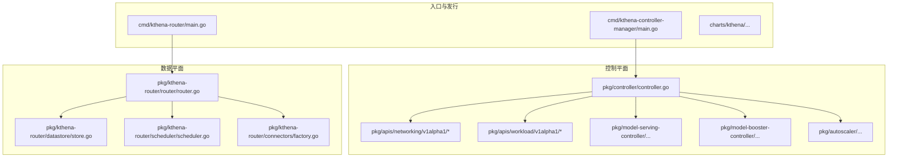
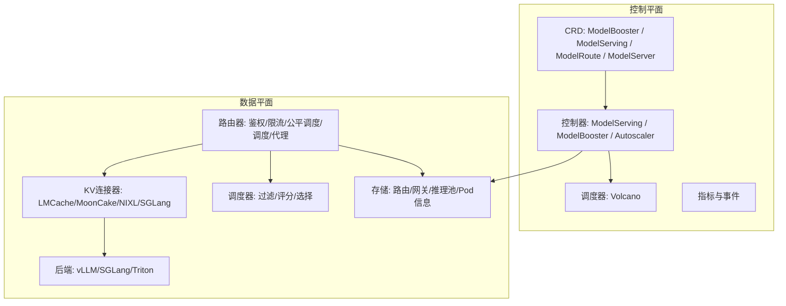
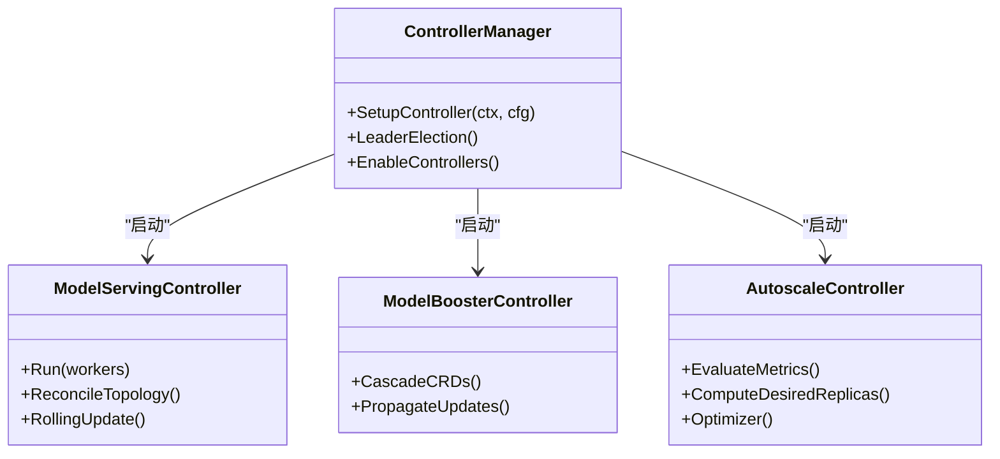
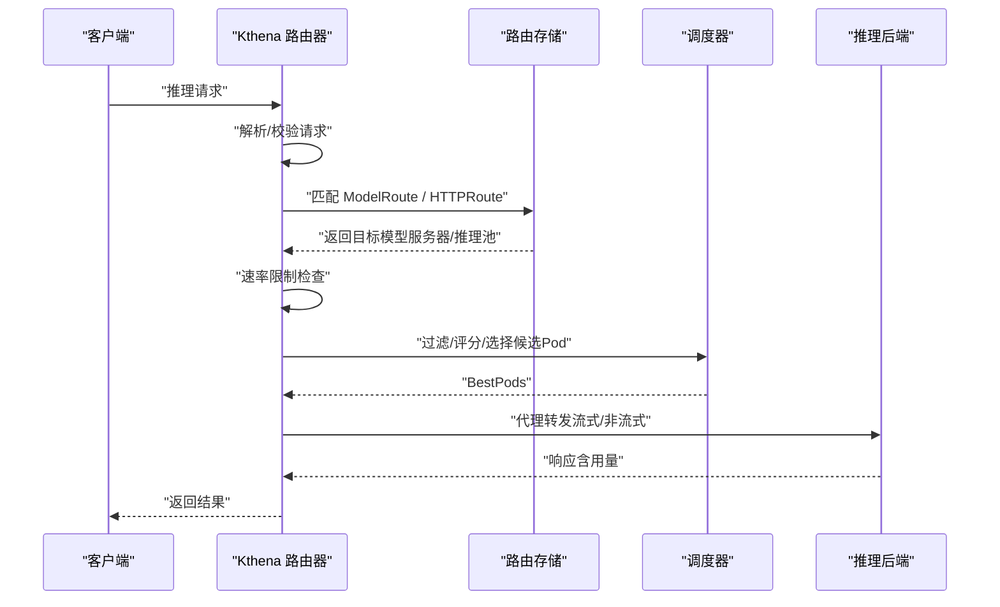
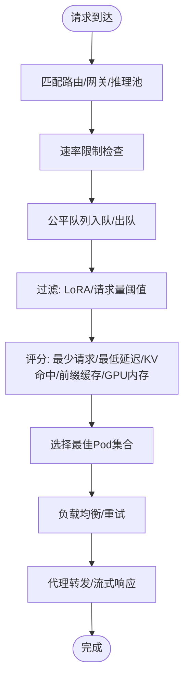
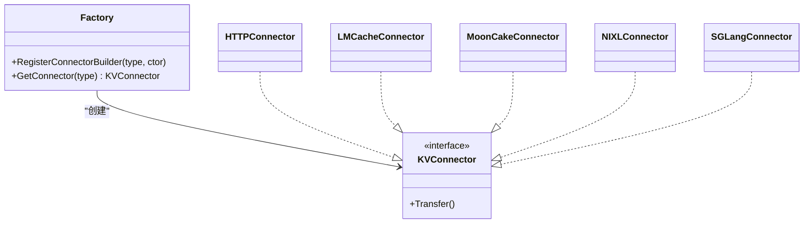
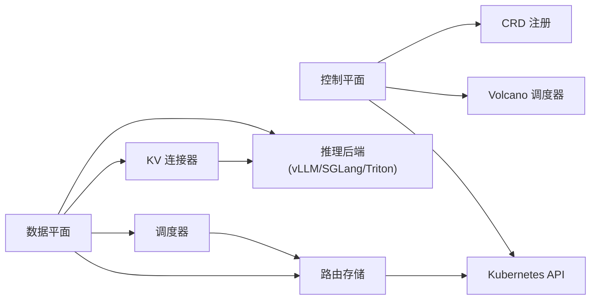

# 项目概述

<cite>
**本文引用的文件**
- [README.md](file://README.md)
- [main.go](file://cmd/kthena-controller-manager/main.go)
- [main.go](file://cmd/kthena-router/main.go)
- [controller.go](file://pkg/controller/controller.go)
- [modelroute_types.go](file://pkg/apis/networking/v1alpha1/modelroute_types.go)
- [model_serving_types.go](file://pkg/apis/workload/v1alpha1/model_serving_types.go)
- [router.go](file://pkg/kthena-router/router/router.go)
- [store.go](file://pkg/kthena-router/datastore/store.go)
- [scheduler.go](file://pkg/kthena-router/scheduler/scheduler.go)
- [factory.go](file://pkg/kthena-router/connectors/factory.go)
- [architecture.mdx](file://docs/kthena/docs/architecture/architecture.mdx)
- [ModelRouteSimple.yaml](file://examples/kthena-router/ModelRouteSimple.yaml)
- [ModelRouteWithRateLimit.yaml](file://examples/kthena-router/ModelRouteWithRateLimit.yaml)
- [sample.yaml](file://examples/model-serving/sample.yaml)
</cite>

## 目录
1. [引言](#引言)
2. [项目结构](#项目结构)
3. [核心组件](#核心组件)
4. [架构总览](#架构总览)
5. [详细组件分析](#详细组件分析)
6. [依赖关系分析](#依赖关系分析)
7. [性能考量](#性能考量)
8. [故障排查指南](#故障排查指南)
9. [结论](#结论)
10. [附录](#附录)

## 引言
Kthena 是一个面向生产的云原生大语言模型（LLM）推理平台，以“声明式模型生命周期管理 + 智能请求路由”为核心设计，帮助企业在 Kubernetes 上实现 LLM 推理的高可靠、可扩展与成本优化。平台通过控制平面与数据平面分离的双平面架构，将“你声明什么”与“请求如何流动”清晰解耦：控制平面负责模型生命周期编排、弹性伸缩与拓扑调度；数据平面负责每条推理请求的鉴权、限流、公平调度、负载均衡与代理转发。

Kthena 的关键价值主张包括：
- 声明式模型生命周期管理：通过 CRD 将复杂推理拓扑抽象为高层资源，简化部署与运维。
- 智能请求路由：基于网关 API 与内部路由规则，实现多模型匹配、权重分发、令牌级速率限制与无感故障切换。
- 多推理引擎支持：统一接入 vLLM、SGLang、Triton 等后端，屏蔽引擎差异。
- 预取-解码分离（Prefill-Decode Disaggregation）：将计算密集型预取与延迟敏感的逐字生成解耦，提升硬件利用率与端到端时延表现。
- 公平调度与可观测性：内置公平队列、令牌估算、访问日志与指标采集，保障多租户公平与运行可见。

## 项目结构
Kthena 采用模块化分层组织，主要目录与职责如下：
- cmd：入口程序
  - kthena-controller-manager：控制平面控制器管理器
  - kthena-router：数据平面路由器
- pkg：核心库与控制器
  - apis：自定义资源定义（CRD）
  - controller：控制平面控制器集合
  - kthena-router：数据平面路由器与调度器
  - model-serving-controller / model-booster-controller / autoscaler：工作负载与弹性控制器
- examples：路由与推理拓扑示例
- docs：官方文档与架构说明
- charts：Helm 发行包（网络与工作负载子图）

**图表来源**
- [main.go:54-111](file://cmd/kthena-controller-manager/main.go#L54-L111)
- [main.go:40-122](file://cmd/kthena-router/main.go#L40-L122)
- [controller.go:52-141](file://pkg/controller/controller.go#L52-L141)
- [router.go:91-169](file://pkg/kthena-router/router/router.go#L91-L169)
- [store.go:316-342](file://pkg/kthena-router/datastore/store.go#L316-L342)
- [scheduler.go:25-28](file://pkg/kthena-router/scheduler/scheduler.go#L25-L28)
- [factory.go:48-59](file://pkg/kthena-router/connectors/factory.go#L48-L59)

**章节来源**
- [README.md:24-66](file://README.md#L24-L66)
- [architecture.mdx:1-144](file://docs/kthena/docs/architecture/architecture.mdx#L1-L144)

## 核心组件
- 控制平面（kthena-controller-manager）
  - 负责 CRD 的持续协调与运行态资源编排，集成 Volcano 调度器，支持拓扑感知、成组调度与滚动升级。
  - 支持启用/禁用控制器（ModelServing、ModelBooster、Autoscaler），并可配置领导者选举与并发工作线程数。
- 数据平面（kthena-router）
  - 面向推理请求的入口，执行鉴权、速率限制、公平调度、调度与负载均衡，并将请求代理至最优后端实例。
  - 支持 Gateway API 与 Inference Extension，兼容标准 HTTP 路由与 InferencePool 后端。
- CRD 层
  - networking/v1alpha1：ModelRoute（路由）、ModelServer（服务暴露）、InferencePool（推理池）等
  - workload/v1alpha1：ModelServing（推理拓扑）、AutoScalingPolicy/Binding（弹性策略）等
- 调度与连接
  - 调度器插件化（过滤/评分），支持 KV 缓存感知、前缀缓存、GPU 内存与延迟感知。
  - 连接器工厂支持 LMCache、MoonCake、NIXL、SGLang 等 KV 传输后端。

**章节来源**
- [main.go:54-111](file://cmd/kthena-controller-manager/main.go#L54-L111)
- [controller.go:52-141](file://pkg/controller/controller.go#L52-L141)
- [router.go:91-169](file://pkg/kthena-router/router/router.go#L91-L169)
- [modelroute_types.go:24-56](file://pkg/apis/networking/v1alpha1/modelroute_types.go#L24-L56)
- [model_serving_types.go:35-66](file://pkg/apis/workload/v1alpha1/model_serving_types.go#L35-L66)
- [scheduler.go:25-28](file://pkg/kthena-router/scheduler/scheduler.go#L25-L28)
- [factory.go:48-59](file://pkg/kthena-router/connectors/factory.go#L48-L59)

## 架构总览
Kthena 采用“控制平面 + 数据平面”的双平面架构：
- 控制平面：以 CRD 为“意图”，控制器将其转换为实际的 Pod、服务与调度策略，提供拓扑、弹性与可观测性。
- 数据平面：以路由为中心，对每条推理请求进行鉴权、限流、公平排队、调度与代理，确保低延迟与高吞吐。

**图表来源**
- [architecture.mdx:7-95](file://docs/kthena/docs/architecture/architecture.mdx#L7-L95)
- [router.go:91-169](file://pkg/kthena-router/router/router.go#L91-L169)
- [store.go:162-240](file://pkg/kthena-router/datastore/store.go#L162-L240)
- [scheduler.go:25-28](file://pkg/kthena-router/scheduler/scheduler.go#L25-L28)
- [factory.go:48-59](file://pkg/kthena-router/connectors/factory.go#L48-L59)

## 详细组件分析

### 控制平面：控制器与 CRD
- 控制器启动与领导者选举
  - 支持按需启用/禁用控制器，设置并发工作线程数与 Kubernetes API 的 QPS/Burst。
  - 可选领导者选举，避免多副本冲突。
- 关键 CRD
  - ModelRoute：声明路由规则、头/URI 匹配、权重分发与令牌级速率限制。
  - ModelServing：以“ServingGroup × 角色（Prefill/Decode）”组织推理拓扑，支持滚动升级与恢复策略。
  - ModelServer：定义服务暴露、流量策略与后端发现。
  - AutoScalingPolicy/Binding：基于指标与成本目标的弹性策略绑定。

**图表来源**
- [controller.go:52-141](file://pkg/controller/controller.go#L52-L141)
- [main.go:54-111](file://cmd/kthena-controller-manager/main.go#L54-L111)

**章节来源**
- [controller.go:52-141](file://pkg/controller/controller.go#L52-L141)
- [main.go:54-111](file://cmd/kthena-controller-manager/main.go#L54-L111)
- [modelroute_types.go:24-56](file://pkg/apis/networking/v1alpha1/modelroute_types.go#L24-L56)
- [model_serving_types.go:35-66](file://pkg/apis/workload/v1alpha1/model_serving_types.go#L35-L66)

### 数据平面：路由器与请求处理流水线
- 请求处理阶段
  1) 鉴权与授权
  2) 速率限制（按模型/租户，支持输入/输出令牌与请求数）
  3) 公平调度（按用户与模型维度排队，支持令牌权重与请求数权重）
  4) 调度（过滤/评分/选择候选 Pod）
  5) 负载均衡（重试策略）
  6) 代理（转发至后端，支持流式响应与用量统计）
- 路由匹配
  - 优先匹配 ModelRoute（按模型名、LoRA、头/URI/Body 匹配），否则回退到 Gateway API 的 HTTPRoute 与 InferencePool。
- PD 分离与 KV 传输
  - 当目标为 PD 组时，先评分解码 Pod，再从同组内预取 Pod 中选择最佳配对，减少跨节点数据传输。

**图表来源**
- [router.go:204-315](file://pkg/kthena-router/router/router.go#L204-L315)
- [router.go:317-464](file://pkg/kthena-router/router/router.go#L317-L464)
- [router.go:714-780](file://pkg/kthena-router/router/router.go#L714-L780)
- [store.go:178-184](file://pkg/kthena-router/datastore/store.go#L178-L184)

**章节来源**
- [router.go:91-169](file://pkg/kthena-router/router/router.go#L91-L169)
- [router.go:204-315](file://pkg/kthena-router/router/router.go#L204-L315)
- [router.go:317-464](file://pkg/kthena-router/router/router.go#L317-L464)
- [router.go:714-780](file://pkg/kthena-router/router/router.go#L714-L780)
- [store.go:178-184](file://pkg/kthena-router/datastore/store.go#L178-L184)

### 调度器与存储
- 存储层
  - 维护 ModelServer/Pod/HTTPRoute/Gateway/InferencePool 等资源映射，提供路由匹配、PD 分组查询与公平队列统计。
  - 提供回调机制，当路由/模型变更时更新速率限制与调度参数。
- 调度器
  - 插件化设计：过滤（如 LoRA 亲和、请求量阈值）与评分（最少请求、最低延迟、KV 缓存命中、前缀缓存、GPU 内存）。
  - PD 组感知：在预取-解码分离场景下，先评分解码 Pod，再在同组内选择预取 Pod，保证 KV 局部性。

**图表来源**
- [store.go:410-485](file://pkg/kthena-router/datastore/store.go#L410-L485)
- [store.go:572-635](file://pkg/kthena-router/datastore/store.go#L572-L635)
- [scheduler.go:25-28](file://pkg/kthena-router/scheduler/scheduler.go#L25-L28)

**章节来源**
- [store.go:162-240](file://pkg/kthena-router/datastore/store.go#L162-L240)
- [store.go:410-485](file://pkg/kthena-router/datastore/store.go#L410-L485)
- [store.go:572-635](file://pkg/kthena-router/datastore/store.go#L572-L635)
- [scheduler.go:25-28](file://pkg/kthena-router/scheduler/scheduler.go#L25-L28)

### KV 连接器与后端适配
- 连接器工厂
  - 注册多种 KV 传输后端：HTTP（默认）、LMCache（内存/低延迟）、MoonCake（分布式/容错）、NIXL（NCCL/GPU 直通）、SGLang（内部预取-解码分离）。
- 后端引擎
  - vLLM、SGLang、Triton 等推理引擎通过统一接口接入，结合 KV 连接器实现预取-解码状态迁移。

**图表来源**
- [factory.go:21-59](file://pkg/kthena-router/connectors/factory.go#L21-L59)

**章节来源**
- [factory.go:21-59](file://pkg/kthena-router/connectors/factory.go#L21-L59)

### 实际使用场景与价值案例
- 快速开始
  - 通过 Helm 或本地一键安装脚本快速部署，随后使用示例 CRD 完成路由与推理拓扑的声明式配置。
- 场景示例
  - 单模型路由与速率限制：通过 ModelRouteSimple 与带速率限制的路由示例，演示基础流量分发与节流。
  - 预取-解码分离：结合 ModelServing 的角色拓扑与路由规则，实现高性能推理集群。
- 行业与规模潜力
  - 金融风控：低延迟问答与实时决策，结合公平调度与速率限制保障多租户稳定。
  - 教育科技：大规模课堂问答与个性化辅导，利用弹性伸缩与成本优化策略降低运营成本。
  - 企业知识库：多模型与多 LoRA 的混合路由，支持 A/B 测试与灰度发布。

**章节来源**
- [README.md:68-81](file://README.md#L68-L81)
- [ModelRouteSimple.yaml:1-12](file://examples/kthena-router/ModelRouteSimple.yaml#L1-L12)
- [ModelRouteWithRateLimit.yaml:1-18](file://examples/kthena-router/ModelRouteWithRateLimit.yaml#L1-L18)
- [sample.yaml:1-46](file://examples/model-serving/sample.yaml#L1-L46)

## 依赖关系分析
- 控制平面依赖
  - Kubernetes API 与 CRD 注册，Volcano 调度器集成，API 扩展客户端用于 LWS 等 CRD。
- 数据平面依赖
  - 路由器依赖存储层（路由/网关/推理池/Pod 信息），调度器依赖存储提供的 Pod 指标与模型列表，连接器依赖后端引擎与 KV 传输协议。
- 外部集成
  - Gateway API 与 Inference Extension，Prometheus 指标，Redis（全局速率限制）。

**图表来源**
- [controller.go:52-141](file://pkg/controller/controller.go#L52-L141)
- [router.go:91-169](file://pkg/kthena-router/router/router.go#L91-L169)
- [store.go:162-240](file://pkg/kthena-router/datastore/store.go#L162-L240)
- [factory.go:48-59](file://pkg/kthena-router/connectors/factory.go#L48-L59)

**章节来源**
- [controller.go:52-141](file://pkg/controller/controller.go#L52-L141)
- [router.go:91-169](file://pkg/kthena-router/router/router.go#L91-L169)
- [store.go:162-240](file://pkg/kthena-router/datastore/store.go#L162-L240)
- [factory.go:48-59](file://pkg/kthena-router/connectors/factory.go#L48-L59)

## 性能考量
- 双平面解耦
  - 控制面与数据面独立演进，便于在不中断流量的前提下进行控制逻辑迭代。
- 调度器微秒级决策
  - 采用 Kubernetes 风格的过滤/评分模式，针对请求粒度进行快速决策，降低排队与调度开销。
- PD 分离与 KV 局部性
  - 解码侧优先评分，预取侧就近匹配，减少跨节点 KV 传输，提高吞吐与降低尾延迟。
- 公平调度窗口与权重
  - 支持按令牌与请求数加权的公平队列，避免单模型或单用户饥饿，提升多租户稳定性。
- 速率限制与可观测性
  - 令牌级限流与访问日志、指标采集，便于容量规划与问题定位。

[本节为通用性能讨论，无需具体文件分析]

## 故障排查指南
- 控制平面
  - 检查控制器是否启用、领导者选举状态与并发工作线程数配置。
  - 关注 CRD 同步状态与控制器日志，确认资源一致性与错误事件。
- 数据平面
  - 路由匹配失败：确认 ModelRoute/HTTPRoute 是否正确关联到 Gateway，路径/头/URI 匹配条件是否满足。
  - 速率限制触发：检查 ModelRoute 的 rateLimit 配置与 Redis 全局限流设置。
  - 公平队列积压：查看队列长度统计与权重配置，调整窗口与权重参数。
  - PD 分离异常：确认 PD 组标签与同组预取/解码 Pod 的匹配关系。

**章节来源**
- [main.go:54-111](file://cmd/kthena-controller-manager/main.go#L54-L111)
- [router.go:204-315](file://pkg/kthena-router/router/router.go#L204-L315)
- [store.go:410-485](file://pkg/kthena-router/datastore/store.go#L410-L485)

## 结论
Kthena 通过“控制平面 + 数据平面”的双平面架构，将企业级 LLM 推理的复杂度封装在声明式 API 与智能路由之中。它不仅解决了生产环境中模型生命周期管理、弹性伸缩与多后端兼容的难题，更以预取-解码分离、公平调度与令牌级限流等创新特性，显著提升了系统的吞吐、延迟与多租户公平性。对于初学者，Kthena 提供了清晰的 CRD 与示例；对于有经验的开发者，其可插拔的调度器、连接器与可观测性体系则提供了充分的扩展空间与工程化保障。

[本节为总结性内容，无需具体文件分析]

## 附录
- 快速开始与安装
  - 参考根目录 README 的“快速开始”与一键安装脚本说明。
- 示例参考
  - 路由示例：ModelRouteSimple、ModelRouteWithRateLimit
  - 推理拓扑示例：ModelServing 的角色与滚动升级配置

**章节来源**
- [README.md:68-81](file://README.md#L68-L81)
- [ModelRouteSimple.yaml:1-12](file://examples/kthena-router/ModelRouteSimple.yaml#L1-L12)
- [ModelRouteWithRateLimit.yaml:1-18](file://examples/kthena-router/ModelRouteWithRateLimit.yaml#L1-L18)
- [sample.yaml:1-46](file://examples/model-serving/sample.yaml#L1-L46)